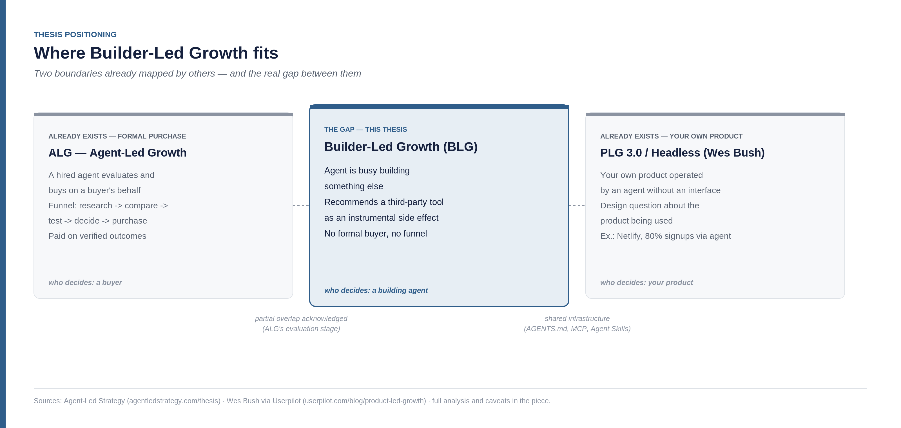
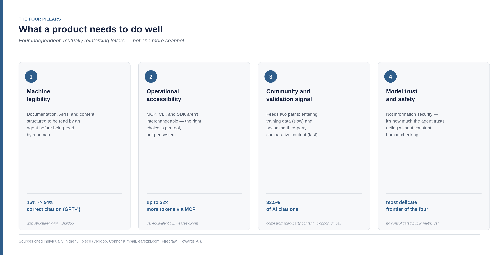
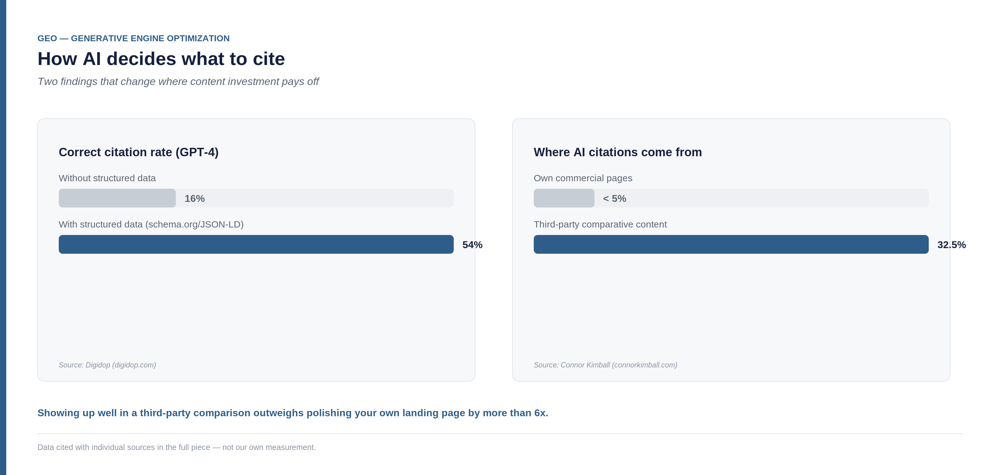
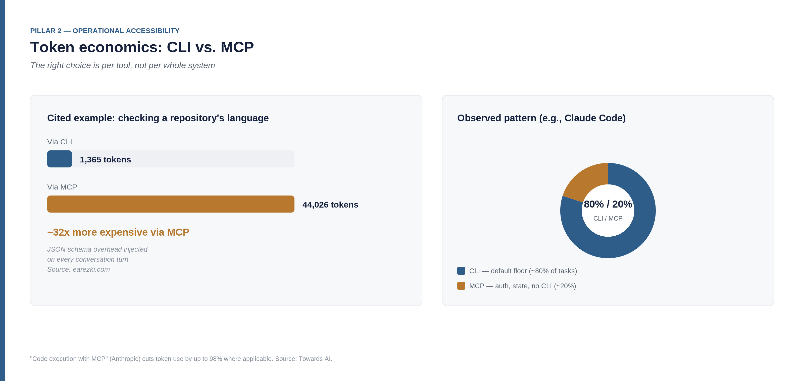
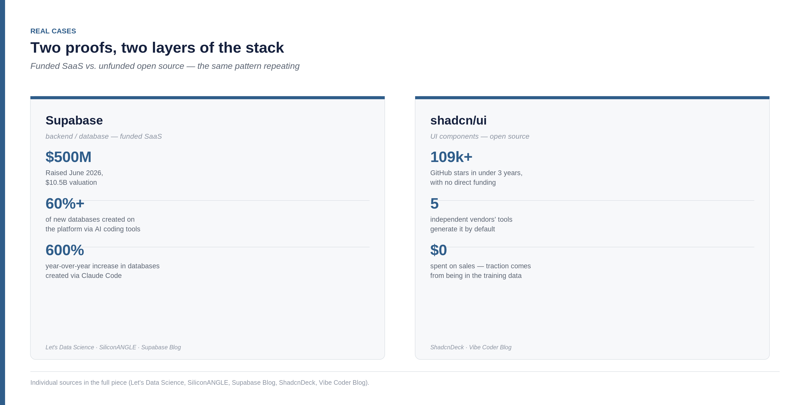

<!--
Part 01 of the Builder-Led Growth series, by Matheus Ramos.
CANONICAL VERSION (English).
Portuguese counterpart: ../pt-br/01-quando-a-maquina-e-cliente.md
Published on LinkedIn on 28 July 2026: https://www.linkedin.com/pulse/builder-led-growth-when-machine-also-your-customer-matheus-inudf/
Generated from the private working repository. Do not edit here.
-->

# Builder-Led Growth: when the machine is also your customer

Three months ago, while building an API to unify Markdown operations, I asked Claude Code for a suggestion on how to organize sprints and milestones. It suggested Linear. I hadn't mentioned Linear, or Jira, or any alternative — I just described what I needed. Later, discussing observability, the suggestion was Sentry, again without me putting it on the table.

Nothing extraordinary — it's the kind of thing anyone building with a coding assistant has probably already seen happen. But I stopped to think about what that actually was: a customer acquisition event for Linear and for Sentry, originated entirely by a machine, with no SEO, no ads, no salesperson involved. If this happens to me, on a small project, how many times is it happening right now, in parallel, across thousands of other projects?

That question pulled a thread worth investigating properly — with actual research, not just intuition. What follows is what I found, including the places where my initial hypothesis didn't hold up.

## The scale of the pattern: the Supabase case

A personal anecdote is a starting point, not proof. The proof is in a case that already moves billions of dollars.

In June 2026, Supabase raised $500 million at a $10.5 billion valuation. The market narrative behind the round is explicit: more than 60% of new databases created on the platform are started by AI coding tools, and Claude Code is, today, the single largest contributor to the company's growth since the start of the year — a 600% year-over-year increase in databases created ([Let's Data Science](https://letsdatascience.com/blog/supabase-10-5-billion-ai-agents-build-most-databases); [SiliconANGLE](https://siliconangle.com/2026/06/04/supabase-raises-500m-ai-coding-tools-drive-phenomenal-growth/)).

This isn't a market accident. Lovable — roughly 8 million users and ~200,000 new projects a day as of February 2026, when it crossed $400 million in annual recurring revenue ([TechCrunch](https://techcrunch.com/2026/03/11/lovable-says-it-added-100m-in-revenue-last-month-alone-with-just-146-employees/)) — automatically provisions a Supabase backend in every workspace it creates — a structural partnership, not a coincidence ([Supabase Blog](https://supabase.com/blog/lovable-cloud-launch)). And the most telling signal: Supabase itself published a technical post titled "AI Agents Know About Supabase. They Don't Always Use It Right," and shipped a package of Agent Skills — files specifically designed to teach agents how to use their product correctly ([Supabase Blog](https://supabase.com/blog/supabase-agent-skills)). That's a company deliberately investing in being a machine's preferred choice, the same way it would invest in SEO or a sales team.

## What already exists — and the credit it deserves

Before proposing any name or framework, I asked the question any skeptic should ask: has someone already named this?

The honest answer is: not this exact phenomenon, but the surrounding territory is already well occupied, and it's worth crediting who got there first.

**Agent-Led Growth (ALG)** is by now an established term, with its own glossary and coverage from firms like Insight Partners. InstitutePM's definition is precise: "agent-led growth is what happens when AI Agents work for the buyer: researching vendors, compiling feature matrices, testing capabilities, evaluating options, and ultimately recommending or initiating purchases on the buyer's behalf" ([InstitutePM](https://www.institutepm.com/knowledge-hub/agent-led-growth-strategy)). ALG's focus is the buyer — agents replacing the traditional B2B evaluation funnel.

**Generative Engine Optimization (GEO)** is already a consolidated industry, with agencies dedicated to optimizing brands to appear in ChatGPT, Gemini, and Perplexity responses ([Salesforce](https://www.salesforce.com/blog/generative-engine-optimization/)).

Aakash Gupta, in his *Product Growth* newsletter, wrote a direct guide on the three layers that determine whether an agent can find and use your product — machine-readable documentation, AGENTS.md, and MCP servers ([news.aakashg.com](https://www.news.aakashg.com/p/master-ai-agent-distribution-channel)). And there's even an emerging technical discipline, "harness engineering," with its own academic paper, about how an agent's orchestration design determines its token economics more than the choice of model itself ([arXiv 2607.06906](https://arxiv.org/abs/2607.06906)).

There's a fourth piece, and it may be the closest to home: Wes Bush — the person who most popularized the term "product-led growth" itself — now describes a three-phase evolution: PLG 1.0 (user-led), PLG 2.0 (agentic), and PLG 3.0 (headless), citing Netlify as an example already in the third phase, with 80% of signups coming from agents ([Userpilot](https://userpilot.com/blog/product-led-growth/)). PLG 3.0/headless asks whether your own product is operable by an agent without an interface — a design question, from the side of whoever builds the product being used.

This is where the central point of this thesis shows up — and I'd rather treat it as the most important argument in this piece, not a footnote at the end. I went straight to ALG's primary source to map the boundary with precision instead of intuition: the site dedicated to the term draws the axis as directly as possible — "PLG is growth bounded by the product's UI; ALG is the growth surface opened to external autonomous agents operating against a trusted growth layer" ([Agent-Led Strategy](https://agentledstrategy.com/thesis)). In the authors' own definition, ALG is about an agent formally hired to evaluate and buy on a buyer's behalf — a funnel with research, comparison, testing, and decision stages, paid on verified outcomes. PLG 3.0/headless, in turn, asks about *your own* product: is it operable by an agent without an interface?

Neither boundary names the event that opened this piece: a coding assistant, whose primary task isn't to evaluate or buy anything, recommending or embedding a third-party tool as an instrumental side effect of building something else. There's no formal buyer, no evaluation funnel, and the question isn't about your product's operability — it's about whether you're the dependency an agent defaults to while solving someone else's problem. It's a real gap between two boundaries already drawn by serious people, with venture capital money behind one of them — not an entirely new category. It's a narrower angle than either one, and for that reason more defensible than claiming the whole space.

## The thesis

I call this gap **Builder-Led Growth (BLG)** — not because "builder" is a magic word, but because it precisely names who's making the decision: not a buyer evaluating vendors (ALG), not your own product being operated (PLG 3.0), but a building agent choosing, mid-construction, what to use.

The thesis fits in one sentence: the more an AI comes to treat your product as the default answer to a problem, the more it grows.

The uncomfortable implication is that the machine ends up occupying two roles at once: **customer** — when it decides architecture, picks dependencies, and selects tools on behalf of whoever operates it — and **distribution channel** — when it recommends something to a human who is building. These two roles already existed separately in other disciplines — agent-assisted buying is ALG, content recommendation is GEO, your own product being operable without an interface is what Wes Bush calls PLG 3.0/headless. What I'm proposing sits in the gap between these three boundaries: it isn't formal purchase evaluation (that's ALG), it isn't about your product being usable without a UI (that's PLG 3.0) — it's about being the default choice of an agent that's busy building something else. Architecture, documentation, and access-protocol decisions that today belong to "engineering" start belonging to the growth table too.

The historical analogy is worth drawing: Product-Led Growth didn't replace Sales-Led Growth when it emerged — it earned its own space, adjusted itself over the better part of a decade, and today coexists alongside traditional sales motions depending on the type of business. I'm not proposing this discipline replaces PLG. I'm proposing it earns the same kind of space, with the same caution.

And the numbers behind this shift in purchasing behavior, while still early, are already large enough not to ignore — with an important caveat I'd rather state plainly than hide: **forecasts diverge wildly between research firms**, which is itself a data point about how young this discipline is. Gartner projects that by 2028, AI agents will intermediate 90% of B2B purchases, moving $15 trillion ([Digital Commerce 360](https://www.digitalcommerce360.com/2025/11/28/gartner-ai-agents-15-trillion-in-b2b-purchases-by-2028/)). Meanwhile, the size of the "agentic commerce" market in 2026 ranges from $2.66 billion (NMSC) to $7.7 billion (Grand View Research) — a nearly threefold gap between serious firms covering, in theory, the same thing. That doesn't invalidate the trend. It does mean we're early enough that no one has a reliable ruler yet.

## The four pillars

Four things a product needs to do well to become a machine's default choice — not one more channel, but four independent, mutually reinforcing levers.

**1. Machine legibility — the SEO-to-GEO equivalence.** The same way SEO is vital to classic PLG, GEO (Generative Engine Optimization) is the structural equivalent for this discipline: documentation, APIs, and content structured to be read by an agent before being read by a human. And the effect is measurable, not a bet: structured data (schema.org/JSON-LD) drastically changes correct citation rates — in one cited test, GPT-4 went from 16% to 54% correct responses when the consulted content used structured data ([Digidop](https://www.digidop.com/blog/structured-data-secret-weapon-seo)). Even more telling: 32.5% of AI citations come from third-party comparative content — listicles, comparisons, reviews — while a product's own commercial pages account for less than 5% ([Connor Kimball](https://connorkimball.com/blog/best-generative-engine-optimization-geo-strategies/)). That changes where it's worth investing: showing up well in a third-party comparison outweighs polishing your own landing page by more than sixfold. This is also where Markdown itself matters as a format — more on that below.

**2. Operational accessibility — and the token economics behind the choice.** MCP, CLI, and SDK are not interchangeable, and the difference between them is measurable in money. Multiple independent benchmarks show an MCP server consumes 4 to 32 times more tokens than an equivalent CLI, due to JSON schema overhead injected on every conversation turn — one cited example: checking a repository's language cost 1,365 tokens via CLI versus 44,026 via MCP ([earezki.com](https://earezki.com/ai-news/2026-06-02-i-measured-mcp-vs-a-cli-for-agent-search-the-mcp-used-17x-more-tokens-per-call/)). Anthropic itself published a pattern called "code execution with MCP" — treating MCP as an API called via code instead of direct tool-calls — that cuts token consumption by up to 98% ([Towards AI](https://pub.towardsai.net/ai-agent-revolution-how-anthropic-cut-token-usage-by-98-with-code-execution-e276c9570bf0)). I need to correct an oversimplification I made myself here: the right choice isn't "CLI always wins" or "MCP always wins" — it's a per-tool decision, not a system-wide one. The pattern observed in agents like Claude Code is using both transports at once: CLI as the default floor for roughly 80% of tasks involving tools the model already knows well, and MCP reserved for the ~20% that require authentication, stateful connections, or integrations that simply have no CLI available ([Firecrawl](https://www.firecrawl.dev/blog/mcp-vs-cli)). The right choice depends on which bucket your product's surface falls into.

**3. Community and validation signal.** Neither of the two proven cases below became "default" without real community traction first — GitHub, documentation, outsiders writing about the product. Community feeds two paths at once: a slow one (entering a model's training data) and a fast one (becoming the subject of third-party comparative content — which, as we saw in pillar 1, outweighs a product's own page by more than sixfold). Managing community in this discipline stops being only about human user satisfaction and starts deliberately including the kind of content a machine also consumes.

**4. Model trust and safety toward the product.** Not information security in the traditional sense — it's how much the agent itself trusts recommending or executing your tool without constant human checking. It's the most delicate frontier of the four pillars, and the one that most separates this framework from anything resembling "SEO for robots": the first three pillars are about being found, understood, and integrable; this one is about being trustworthy enough to act without supervision.

A fifth candidate pillar didn't survive the cutting criterion I applied to decide what belongs on this list: "being the option an agent picks on its own" described the outcome being pursued, not an independent practice you execute — so it became the name of a funnel stage instead of a pillar. The full analysis of why is in part two.

## Cases

Two already-consolidated proofs, and one experiment I'm running myself right now — I hold all three to the same rigor, but not the same confidence: the first two already happened, the third is a bet being tested.

**Supabase** proves the mechanism at the backend/database layer: more than 60% of new databases created on the platform are started by AI coding tools, Claude Code is today the single largest contributor to the company's growth since the start of the year — a 600% year-over-year increase in databases created — and that pattern backed a $500 million round at a $10.5 billion valuation in June 2026 ([Let's Data Science](https://letsdatascience.com/blog/supabase-10-5-billion-ai-agents-build-most-databases); [SiliconANGLE](https://siliconangle.com/2026/06/04/supabase-raises-500m-ai-coding-tools-drive-phenomenal-growth/)). Lovable automatically provisions a Supabase backend in every workspace it creates — a structural partnership, not a coincidence ([Supabase Blog](https://supabase.com/blog/lovable-cloud-launch)) — and Supabase itself began deliberately investing in being a machine's preferred choice, shipping a package of Agent Skills specifically designed to teach agents how to use the product correctly ([Supabase Blog](https://supabase.com/blog/supabase-agent-skills)).

**shadcn/ui** proves the same mechanism at a different layer — UI components — and with a difference that matters: it isn't a venture-backed company, it's an open source project. It went from a personal side project to more than 109,000 GitHub stars in under three years, and today v0.dev, Lovable, Bolt, Cursor, and Claude Code — five tools from entirely independent vendors — generate shadcn/ui by default when asked to build an interface ([ShadcnDeck](https://www.shadcndeck.com/blog/rise-of-shadcn-ui-2026); [Vibe Coder Blog](https://blog.vibecoder.me/shadcn-ui-component-library-ai-development)). The mechanism cited by the sources themselves is direct: models were trained on a huge volume of shadcn-based code, and that alone pushed AI tools to prefer it. Like Supabase, the project has since invested deliberately in this, shipping "shadcn/skills" — a package explicitly designed to be consumed by agents.

Two cases, two layers of the stack, two business models (funded SaaS vs. unfunded open source) — and the same pattern repeating.

**MarkdownScribe — the experiment in progress.** Here I need to be more careful, because I have a direct stake in the outcome — it's not a success story, it's a bet being tested, with no public launch yet.

What it is: an API that unifies six common Markdown operations — frontmatter extraction, table-of-contents generation with slugify, linting, formatting, Mermaid-to-SVG conversion, and URL-to-Markdown conversion — served via REST, CLI, and MCP over the same backend, billed by usage credit. The intended differentiator sits in the package's hardest operation: URL-to-Markdown with real content extraction, not indiscriminate "raw HTML turned into Markdown." In an internal test we ran, a well-known competitor (Firecrawl) returned about 65% junk — menus, share buttons, comments — when converting a real news article.

The bet ties directly to the pillars above, and I'd rather be honest about which ones it already tests and which it doesn't. On pillar 1 (machine legibility): the bet is that Markdown is indeed becoming the standard of the machine-readable layer — AI and RAG pipelines use up to 95% fewer tokens with Markdown than with PDF ([MDisBetter](https://mdisbetter.com/blog/markdown-vs-pdf-for-ai)), though the strong version of that claim is false: PDF remains dominant in absolute volume, with 2.5 trillion already existing worldwide ([TheyLovePDF](https://www.theylovepdf.com/el/pdf-trends-2026)) — Markdown isn't replacing PDF, it's becoming the standard of a parallel layer. On pillar 2 (operational accessibility): instead of betting solely on MCP, which is expensive in tokens, the product is built with REST, CLI, and MCP over the same backend, letting whoever consumes it pick the cheapest channel for their case — a decision made directly from this piece's research, not the other way around. Pillars 3 (community) and 4 (trust) are, honestly, the ones MarkdownScribe hasn't tested yet — the product has no built community or usage history to generate agent trust. That's exactly why I call this an experiment, not a case.

## Where this doesn't apply

No growth discipline works for every kind of business — classic PLG has well-known contraindications too, and it would be dishonest to propose this one as universal. This section rests on two different foundations, and I'd rather be clear about which is which than blend them as if they carried equal weight: one comes from published, checkable data; the other comes only from my own empirical read of the market, with no formal validation yet.

The barrier backed by data: regulated markets. 37% of teams adopting agentic AI cite security and compliance as their biggest obstacle; in healthcare, 57% cite patient data privacy as the top concern; in financial services, 31% point to governance gaps. The EU AI Act makes high-risk obligations enforceable starting August 2026, classifying automated credit decisions as "high-risk" ([Glean](https://www.glean.com/perspectives/top-7-industries-with-stringent-ai-compliance-needs-in-2026); [Fin.ai](https://fin.ai/learn/evaluate-ai-agent-compliance-financial-services)).

The second list is my own conjecture, based on market intuition rather than formal research — and I treat it as such: status and luxury goods, where the value lies precisely in visible human choice and social signaling, probably resist this mechanism — an agent "optimizing" the purchase of a luxury watch defeats the point of the purchase itself. High-touch B2B sales that depend on personal trust built over years, services where irreducible human judgment matters (choosing a wedding photographer for their style), and categories that turn "made without AI" into their own brand differentiator also look, at first glance, out of this discipline's reach. Nobody has solid data on these boundaries yet — partly because the phenomenon is too recent to have been tested exhaustively.

## The skeptical voice

An honest piece about this needs to make room for the counterargument, not just the thesis.

The most obvious critique: isn't this just GEO with a new name? Partly, yes — GEO is one of the pillars, not a competing discipline. The distinction I'm trying to hold onto: GEO covers content and discovery — being found and correctly cited. What I'm describing adds two things GEO alone doesn't cover: community as a parallel engine for citation and training-data inclusion (pillar 3), and the operational-friction layer that decides whether a recommendation actually turns into a working integration — access protocol and token cost not as a preference factor for the AI, but as a conversion factor between intent and real adoption (pillar 2). GEO helps the machine find you; the other pillars help the machine pick you and actually use you.

The second critique is the one that most demands rigor from me, because it has two variants and each needs its own answer: isn't this just Agent-Led Growth with a new name? And isn't it just the "headless" phase Wes Bush already named inside PLG itself? I already drew that boundary with primary sources in the previous section: ALG, in the authors' own definition, is about a formal buyer evaluating and purchasing through an agent — a funnel, stages, payment on verified outcomes. PLG 3.0/headless is about your own product being operable without an interface. Neither names an agent recommending a third-party tool as a side effect of building something else, with no formal buyer and with nothing to do with your own product being operated.

Where I won't pretend the boundary is clean: ALG's own funnel includes, at the evaluation stage, an agent "browsing documentation and testing capabilities" — close enough to what a coding agent does when trying out a library before adopting it that the distinction becomes more a matter of trigger and context (a buyer's deliberate evaluation vs. an instrumental side effect of someone building) than of a fully disjoint mechanism. And the infrastructure behind PLG 3.0 and what I'm describing here is, in large part, the same one — AGENTS.md, MCP, Agent Skills serve both making a product operable without an interface and making it recommendable in the middle of someone else's build. A good-faith critic could argue this is just a slice of one category or the other, not a sibling discipline — and that's a critique I take seriously, not one I dismiss for convenience.

The third critique, serious in a different way: this entire strategy depends on the behavior of model vendors who can change overnight. If Anthropic or OpenAI alter how their agents recommend tools, a competitive advantage built on top of that could evaporate without warning.

This deserves a discussion, not a closed verdict. There's a more optimistic reading worth considering: if the pillars that actually matter are real community and genuine presence in training data — not a shallow trick specific to one vendor — the dependency is smaller than it first looks. Common Crawl, GitHub, technical forums, and third-party comparative content feed multiple models at once; they aren't any single vendor's property. A product deeply understood within that shared substrate is less vulnerable to one vendor's policy shift than a product that only gained visibility through a one-off partnership or a shallow trick specific to a single model. That said, I don't have data proving this robustness in practice — it's reasoning, not measurement, and honesty requires saying so. The risk that remains even with the pillars well executed: a vendor could change the underlying architecture of how agents retrieve information — for instance, relying less on real-time retrieval and more on parametric knowledge — in a way that weakens any GEO strategy, not just yours. Diversifying across multiple assistants and multiple channels (REST, CLI, MCP) remains the most concrete mitigation I can offer.

The fourth: there's a concrete risk of "agent-washing" — companies slapping an "AI-optimized" label on anything, with no substance, the same way "AI-powered" became a pitch-deck cliché. That risk is real and will probably get worse before it gets better.

## And the "how," in practice?

This piece deliberately stayed at the level of thesis and evidence — enough to hold up the argument without turning into a 6,000-word manual. But the obvious questions that follow once you accept this thesis are all operational: what exactly makes a model prefer one product over another, which metrics to track to know if it's working, which pricing model fits best, how to turn community management into part of the strategy — and, above all, how growth should demand things from engineering and relate to it to get this thesis off the page. I wrote that part separately. What I pictured as a second piece turned into a series — each pillar asked for more room than a single deep-dive could hold.

## Closing

Let me connect the dots, because a thesis that can't stand on its own by the end wasn't worth writing. Supabase is worth $10.5 billion partly because coding agents pick it on their own. shadcn/ui became the default across five independent vendors' tools without spending a cent on sales. Structured data nearly quadruples a model's correct citation rate. That's not an isolated coincidence or a passing trend — it's enough evidence to argue that a discipline genuinely exists here: Builder-Led Growth, with a mechanism, pillars, a clear position relative to what already exists (the gap between ALG and PLG 3.0), and real cases solid enough that it isn't just a good story.

If this thesis holds, the organizational consequence is uncomfortable for a lot of companies: decisions that today live entirely inside engineering — which protocol to expose, how to structure documentation, what becomes a public code example — stop being purely technical calls and start being growth calls too. Not because growth should run architecture, but because growth now has a legitimate stake in it: those choices decide whether a machine can find you, understand you, and prefer you. Growth that keeps treating this as "engineering's problem, not mine" is leaving an entire acquisition channel on the table.

I'm not writing this as someone who cracked a settled category. I'm writing it as someone in the middle of an experiment — building a product that bets on this thesis, alongside the data I found while testing it, including the parts that partially contradicted it. If you have a counter-example, a case that refutes this, or a layer of the framework that doesn't hold up in your context, that's exactly the kind of response this piece is asking for.

## Appendix — what to do on Monday

Closing without pretending to have the finished answer — because I don't — here are concrete actions small enough to test this week, not a twelve-month plan:

- Ask a coding assistant (Claude Code, Cursor, whatever you use) to solve a problem in your domain without naming your tool. See if it already recommends you, a competitor, or nothing.
- If you have an API, measure what it would cost in tokens to expose it as MCP versus as a plain CLI — the right answer for your case might be both, not one.
- Write a simple `AGENTS.md` or `llms.txt` — but know exactly what to expect from it. Ahrefs analyzed server logs across 137,000 domains and found 97% of `llms.txt` files received zero requests in May 2026; AI retrieval bots accounted for 1.1% of hits, and the single largest requester was SEO audit tooling at 21.7% ([PPC Land](https://ppc.land/llms-txt-adoption-rises-8-8x-but-97-of-files-get-zero-ai-requests/)). For generative search visibility, then, the file doesn't deliver — Google itself has stated it carries no ranking effect. What the same study shows is that IDE agents (Cursor, Windsurf, Claude Code, Copilot, Cline, Aider) actively look for `/llms.txt` and `/llms-full.txt` when pointed at a documentation site. It's agent-readiness infrastructure, not a GEO tool — and that's precisely why it matters here.
- If your product serves a regulated industry, don't bet on this discipline as your main motion — treat it as a complementary layer, not a replacement.

---

**The Builder-Led Growth series**

- Part 1 — When the machine is also your customer (this piece)
- [Part 2 — The decision, the price and what to measure](https://www.linkedin.com/pulse/builder-led-growth-part-2-decision-price-what-measure-matheus-0ahff/)

The series continues. Each part goes deeper into something this piece could only point at, and this block is updated as the next ones come out.
