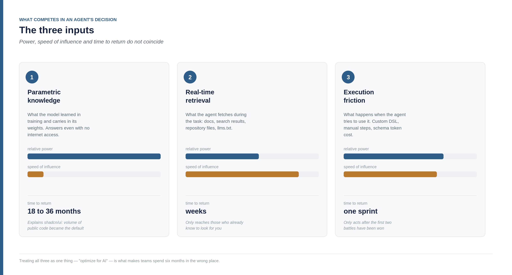
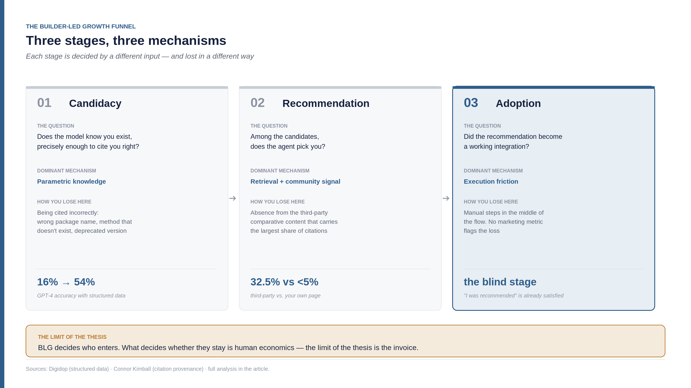
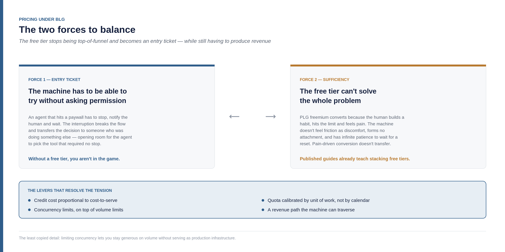
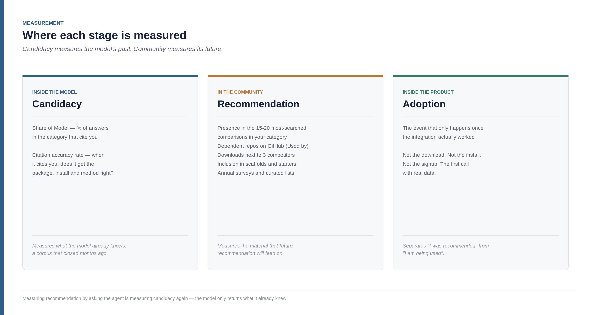
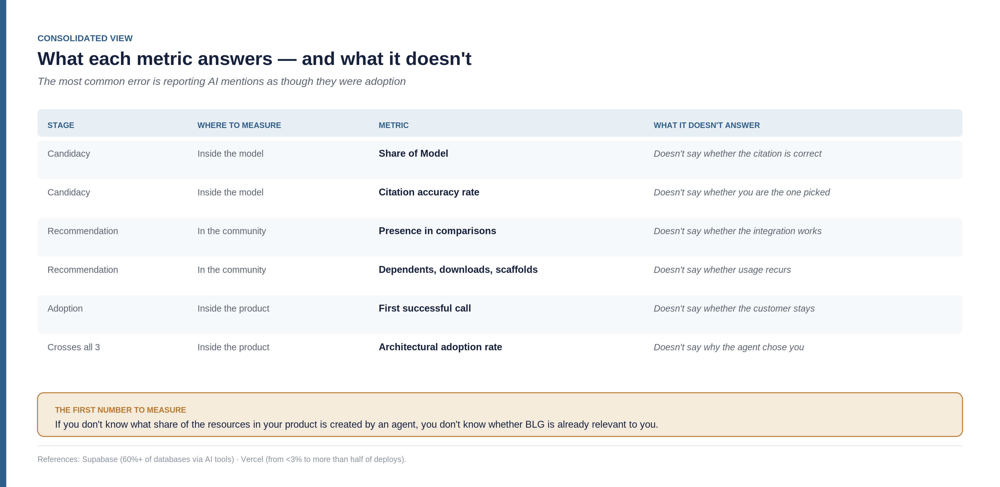

<!--
Part 02 of the Builder-Led Growth series, by Matheus Ramos.
CANONICAL VERSION (English).
Portuguese counterpart: ../pt-br/02-decisao-preco-e-medicao.md
Published on LinkedIn on 30 July 2026: https://www.linkedin.com/pulse/builder-led-growth-part-2-decision-price-what-measure-matheus-0ahff/
Generated from the private working repository. Do not edit here.
-->

# Builder-Led Growth, part 2: the decision, the price and what to measure

*Continuation of ["Builder-Led Growth: when the machine is also your customer"](https://www.linkedin.com/pulse/builder-led-growth-when-machine-also-your-customer-matheus-inudf/). Part 1 named the discipline, positioned BLG in the gap between Agent-Led Growth and PLG 3.0/headless, and proposed four pillars. I kept investigating since then, and the picture gained enough detail that I can now state things part 1 could only gesture at.*

I'll start with the number that reorganized how I read the problem.

Stack Overflow's 2026 survey, with 49,000 respondents across 177 countries, shows AI tool adoption at 84% of developers — against 76% the year before. Half of professionals use them daily. And in the same survey, trust in output accuracy fell to 29%, down from 40% in 2024. Only 3% say they "highly trust" generated code ([byteiota](https://byteiota.com/stack-overflow-dev-survey-2026-ai-at-84-trust-at-3/)).

It's worth holding those three numbers together, because the combination is unusual. Adoption up eight points in a year. Trust down eleven. And high trust — the kind that would authorize using the output without review — at 3%.

Markets usually behave differently: when adoption rises and satisfaction falls, either the product got worse, or usage spread into cases it doesn't serve. Here it looks like the second. The assistant moved from "help me write this function" to "solve this task," and in that change of scope it started making decisions that used to belong to the human — including which tool to use.

When I proposed the fourth pillar in part 1 — model trust and safety toward the product — I described it as the most delicate of the four. These numbers give it a size I didn't have: at 3% high trust, being recommended is the easy part. Being executed without supervision is where nearly all the unserved demand in this market lives.

Hold on to that number. It comes back at the end.

## Back to the two cases from part 1, now with more depth

Part 1 presented Supabase and shadcn/ui as the two proofs of the mechanism. I kept pulling both threads, and what I found changes the weight of each — mainly because it explains **why** it happened, not just that it did.

### Supabase: the order of events matters

The most common reading of the Supabase case reduces everything to a commercial deal: Lovable picked Supabase as its default backend, Lovable grew, Supabase rode along. If that were it, it would support no thesis at all — it would just be a successful partnership.

I went after the chronology and the order is different. Craft Ventures, an investor in the company, published the account of the executive who spent four months inside Supabase as interim growth lead. The sequence he describes is explicit: open source community and Hacker News traction first; then one of the most-starred projects on GitHub; then the position of "default backend for serious Postgres developers, many of them using Supabase alongside Cursor and Claude Code"; and **only then** did the vibe coding platforms — Bolt, Figma Make, Lovable, v0 — adopt it ([Craft Ventures](https://www.craftventures.com/articles/inside-supabase-breakout-growth)).

Lovable's decision didn't create the default. It ratified a default that already existed.

The numbers from that period give the scale: from 1 million to more than 4.5 million developers in under a year; annual recurring revenue from $16 million in 2024 to $70 million in September 2025, growing 250% year over year with a user base up more than 700%; 15.1 million databases created in 2025 alone, more than every prior year combined; 55% of the Y Combinator batch that was most recent at the time of the September 2025 survey, and more than a thousand YC companies in total on the platform ([Sacra](https://sacra.com/research/supabase-at-70m-arr-growing-250-yoy/)).

And there's a line in that account worth more than the numbers, because it's the thesis stated from the inside: *"community is a moat, not a channel."* They describe GEO, community and lifecycle as one combined effort — not three separate marketing initiatives.

When I wrote the third pillar in part 1, I treated community as one of four. After reading that account, I'd put it differently: community is the pillar that **produces** the others. It generates the volume of public code that enters training, it generates the third-party comparative content, and it generates the usage history that model trust feeds on. It isn't a quarter of the work — it's the raw material for the other three.

### shadcn/ui: the mechanism, up close

In part 1 I said shadcn/ui became the default across five tools from independent vendors — v0, Lovable, Bolt, Cursor and Claude Code — and attributed that to training code volume. I kept investigating and the data got sharper, including the size: more than 109,000 GitHub stars in under three years, starting from a personal project.

What interests me here is what the case proves by elimination. Five tools from companies that compete with each other converging on the same standard isn't explained by a commercial agreement — no agreement includes v0 (Vercel), Lovable, Bolt, Cursor and Claude Code (Anthropic) at the same time. It isn't explained by marketing either, because an open source project with no direct funding doesn't buy five integrations. What remains, and what the sources themselves attribute, is that the models learned from the same source: the volume of public code using shadcn that accumulated over the previous three years.

That makes shadcn the cleanest case of **candidacy through parametric knowledge** I've been able to find. And both projects, Supabase and shadcn, later made the same move: both shipped Agent Skills packages — files designed explicitly to teach agents to use the product correctly. Two companies at different layers of the stack, with opposite business models, independently reaching the same conclusion about what to do next.

## What I kept discovering about llms.txt

In part 1, the appendix recommended writing an `AGENTS.md` or `llms.txt`, with the caveat that no AI provider publicly confirmed reading the file. The recommendation was right; the caveat was incomplete. The data I found afterward makes it possible to be precise about **what the file is for** — and that precision turned out to be, in my view, the most valuable finding of this round.

Ahrefs analyzed server logs across 137,000 domains and found that 97% of `llms.txt` files received zero requests in May 2026. Where there were requests, AI retrieval bots — the ones answering questions inside search products — accounted for 1.1%. The single largest requester was SEO audit tooling, at 21.7%. Only 7.4% of Fortune 500 companies have the file, against 92.8% that have `robots.txt`. Google published an explicit note stating the file affects rankings in neither direction. And even so, adoption grew 8.8x in twelve months ([PPC Land](https://ppc.land/llms-txt-adoption-rises-8-8x-but-97-of-files-get-zero-ai-requests/)).

Read in isolation, that looks like the end of the recommendation. But the same study says the opposite for our case, and Originality.ai's conclusion is literal: `llms.txt` looks far more like agent-readiness infrastructure than like a search visibility tool. The agents that actually consume the file are exactly the ones that matter here — Cursor, Windsurf, Claude Code, GitHub Copilot, Cline and Aider actively look for `/llms.txt` and `/llms-full.txt` when pointed at a documentation site.

Notice what that offers the thesis. In part 1, the argument that BLG and GEO are distinct disciplines was conceptual — the kind of claim you defend by reasoning. Now there's a practice that is measurably useless for GEO and measurably functional for BLG, and the difference shows up in server logs. The distinction no longer depends on rhetoric.

The refined recommendation: write the file, and keep it out of every search visibility metric. It serves the agent that has already been pointed at your documentation — an instrument of funnel stages 2 and 3, never stage 1. What that means becomes precise in the next section.

## How a model decides what to recommend

Three inputs compete when an agent picks a tool. They don't carry equal weight, they cost different things to influence, and they respond on timelines that don't match each other.

**Parametric knowledge** is what the model learned in training and carries in its own weights. When an agent suggests a library without consulting anything, this is where the answer comes from. It's the most powerful input — it doesn't depend on internet access, or on the user mentioning your domain — and the slowest: between a technology becoming common and appearing well represented there's a lag I estimate at 18 to 36 months, accounting for collection, training and release of a large model. It's the input that explains shadcn.

The implication is uncomfortable and worth stating plainly: **if you're starting today, parametric knowledge is not a lever available to you this quarter.** You can't get into last year's training run. It's the most durable of the three assets and the one with the most distant return — worth building, as long as nobody promises quarterly results through that path.

**Real-time retrieval** is what the agent fetches during the task: your documentation, search results, repository files, the `llms.txt` if it was pointed there. Fast to influence, in weeks. And it has a limitation that enthusiasm for GEO tends to hide: **it only reaches those who already know to look for you.**

That's why the distinction between GEO and AEO, though real, matters less here than it appears. GEO is about being cited inside generative answers; AEO is about being extracted as a direct answer in AI Overviews and voice assistants, and in practice GEO is usually treated as the generative subset of AEO ([Jasper](https://www.jasper.ai/blog/geo-aeo)). Both are real, both belong to the first pillar, and both operate at the retrieval layer — which on its own doesn't solve the problem of existing for the model at all.

**Execution friction** is what happens when the agent tries to use it. If the library requires a custom language the model knows less well than TypeScript; if the integration has six manual steps; if the MCP server injects two thousand tokens of schema per turn — each is a chance to give up and try something else. It's the most ignored input and, in my reading, the most underestimated, because it only acts after you've already won the first two battles. It's easy to miss that you're losing there, since the comfortable metric — "I was recommended" — has already been satisfied.

## The funnel in three stages

In part 1 I mentioned that a candidate pillar didn't survive the cutting criterion: "being the option an agent picks on its own" described the outcome being pursued, not an executable practice, and so it became the name of a stage. Here's the full design, with the mechanism that dominates each one.

**Candidacy.** The model knows you exist, precisely enough to cite you correctly. Two paths, and you need at least one: being in parametric knowledge, or being retrievable from something the agent already has reason to consult.

The word "correctly" carries weight. A model that knows your product exists but gets the package name wrong, suggests a method that doesn't exist, or points at a deprecated version hasn't made you a candidate — it has burned you. The agent tries, fails, and now there's a bad experience attached to your name in that session. This is where structured data shows the most measurable effect of anything I found: in a cited test, GPT-4 went from 16% to 54% correct answers when the content consulted used schema.org/JSON-LD ([Digidop](https://www.digidop.com/blog/structured-data-secret-weapon-seo)). It isn't about appearing more; it's about appearing right.

**Recommendation.** Among the candidates, the agent picks you. The competition is comparative, and the datapoint that most changed my view on content allocation is this: 32.5% of AI citations come from third-party comparative content — listicles, comparisons, reviews — while a product's own commercial pages account for less than 5% ([Connor Kimball](https://connorkimball.com/blog/best-generative-engine-optimization-geo-strategies/)). More than six to one against your own landing page.

That datapoint opens a question I can't answer, and I'd rather leave it open than pretend I've resolved it.

The number measures **provenance**: third-party content carries 32.5%, the product's own page carries under 5%. The intuitive reading is that independent provenance is what gives the weight — you don't control it, so it counts for more. If that's right, bought comparisons and planted reviews will tend to get discounted as models learn to recognize manufactured patterns, and the only durable path is the slow one: being good enough that third parties write on their own.

But there's an intermediate category the data doesn't resolve: **first-person comparative content** — the company publishing, on its own domain, an honest comparison between itself and its competitors. It isn't a planted review, because authorship is declared. It also isn't a commercial page in the sense the study means, because the format is comparative and includes the competitor. Whether that falls into the 5% bucket or captures part of the 32.5% is something I couldn't determine with the material I have.

I am leaving it open, and the practical consequence is large: if first-person comparative content captures third-party weight, there's a cheap and still uncontested lever. If it doesn't, it's simply a good brand defense page. And over the course of this research, I found at least one company betting on the first hypothesis.

**Adoption.** The recommendation becomes a working integration. This is where most products lose without any marketing metric flagging it, because the agent tried, hit three steps that required human intervention, the user got irritated halfway through, and the project moved on with something else.

## Two displacements, in 2025 and 2026, and what each one teaches

Supabase and shadcn show how a position is won. Two later cases show how one is **lost** — and they lose for opposite reasons, which is more instructive than if they confirmed the same thing.

### Drizzle passed Prisma at the early stages

It isn't a trend, it's a dated fact. In weekly npm downloads: 4.1 million for Prisma against 4.4 million for Drizzle in Q4 2025, the first crossover; 4.3 million against 5.1 million in Q1 2026, with the gap widening. Drizzle also became the majority choice in new t3-app projects, one of the most-used Next.js starters ([PkgPulse](https://www.pkgpulse.com/guides/prisma-vs-drizzle-2026)).

The mechanism the sources attribute is specific: Drizzle's TypeScript-native schema works better with AI code editors, while Prisma's own schema language sometimes interferes with autocomplete in vibe coding tools.

It's worth unpacking why this is machine legibility in near-laboratory conditions. Prisma has a custom DSL. To write a Prisma schema, the model has to generate code in a language that appears in the training corpus at a volume orders of magnitude smaller than TypeScript. Drizzle has no DSL: the schema is TypeScript, and the model already writes TypeScript better than any language invented in the last five years.

From that comes the formulation I consider the most useful in this piece: **a product's API surface is itself a machine legibility decision.** It isn't documentation about the product — it's the product. A team inventing its own language for design elegance is making a distribution decision without knowing it.

And note what doesn't explain this displacement: not price, not marketing, not a larger community. Prisma remains an excellent product with a mature ecosystem. It lost ground because the model found the competitor's syntax easier.

### Better Auth advances on Clerk at the final stage, against the machine

Better Auth launched in September 2024, built by Bereket Engida, a self-taught developer from Ethiopia. Today it has more than 28,600 GitHub stars, 150,000 weekly npm downloads and 6,000 Discord members, plus a Y Combinator batch and $5 million raised ([makerkit](https://makerkit.dev/blog/tutorials/better-auth-vs-clerk)).

But the reasons cited for switching have nothing to do with machine preference. Cost at scale is the first and strongest: at 100,000 monthly active users, Clerk runs roughly $2,025 per month against the price of a Postgres instance, somewhere between $25 and $50. The annual difference approaches $24,000. The other two are EU data residency and the absence of lock-in.

The detail that closes the argument is what the same sources say about Clerk: it has superior developer experience and better prebuilt components. The pattern is explicit — most new SaaS products start on Clerk for speed and reassess when enterprise SSO becomes a sales requirement.

Translated: the machine still prefers Clerk. It's the human who switches, when the invoice arrives.

## The limit of the thesis, and where it continues

The difference between those two displacements draws a boundary I didn't yet have the material to trace in part 1.

Drizzle won at candidacy and recommendation, on legibility — and the human doesn't reverse it, because swapping an ORM is a technical decision whose cost they don't feel on the invoice. Better Auth wins after the default is established, on economics — and the machine has no opinion, because it isn't the one paying. An agent has no budget, receives no invoice, and is never penalized for picking the expensive option.

From that comes the most complete formulation I can give the thesis so far:

> Builder-Led Growth dominates the candidacy and recommendation stages. At adoption, it decides whether the recommendation becomes a working integration. What decides whether it **stays** is human economics.

The limit of the thesis is the invoice. And that's precisely why the next section isn't a commercial appendix — it's a central part of the model.

A caveat before moving on: two cases, and the sources are technical comparisons, not surveys with published methodology. I treat this as an observed pattern, not a law. A third case in which the machine reversed a human economic decision would be the most valuable counterexample possible, and it's what I'd most like to receive.

## Price: why it leaves the triad and enters strategy

An opening caveat, so this doesn't read as rediscovering the wheel: in mature PLG, price stopped being a purely commercial topic a long time ago. Free-plan limits, upgrade triggers and billing units have been product decisions since PLG became a discipline — anyone working in it knows that.

What changes under BLG is something else, and it's more structural. Under PLG, price is the variable that **converts** a user who is already using. Under BLG, price is the variable that **authorizes the machine to begin** — and, at the same time, the one that determines whether the human lets you stay. Two functions at opposite ends of the funnel, exercised by two different decision-makers, with opposite sensitivities.

That's what takes the discussion out of the marketing–sales–finance triad. Not because those areas don't matter, but because none of the three holds a mandate over both ends at once. Whoever designs the free limit is designing the product's candidacy rate — a distribution strategy decision. Whoever designs the price at scale is designing time-to-churn — a retention strategy decision. Treating both as a pricing table loses sight of the fact that they solve different problems.

### The two forces to balance

The tension, stated precisely:

On one side, **the machine has to be able to try without asking permission.** An agent that hits a paywall has to stop, notify the human and wait. That interruption is expensive — it breaks the flow, transfers a decision to someone who was doing something else, and opens room for the agent to simply pick another tool that required no stop. Under BLG, the free tier stops being top-of-funnel for conversion and becomes an **entry ticket**: without it, you aren't in the game.

On the other side, **the free tier can't be sufficient.** And here the difference between human and machine is decisive. PLG freemium works because the human builds a habit, hits the limit, feels the pain and converts. The machine doesn't feel friction as discomfort, doesn't form attachment, has no emotional switching cost, and has infinite patience to wait for a limit to reset. The pain-driven conversion mechanism doesn't transfer.

That this is already a real problem, and not a forecast, is verifiable: there is published material teaching how to assemble a production agent by routing across the free tiers of Gemini, Groq, Cerebras and Mistral, with the conclusion that "small production workloads can hide inside free quotas if you route carefully" ([RoboRhythms](https://www.roborhythms.com/free-tier-ai-agent-stack/)). The most sophisticated providers in the market are already being drained exactly that way.

### Firecrawl: a case that executes the whole model

While researching pricing, I found a company that isn't only solving price — it's executing all four pillars and managing the three funnel stages in a way that looks deliberate to me. It's worth opening the case in full, because it's the most complete validation of the framework I've been able to assemble in one place.

First, a clarification I owe part 1. There I cited an internal test in which Firecrawl returned roughly 65% unwanted content when converting a news article. What I left out was the main point: they were chosen as the benchmark for that test precisely because they were the best available implementation in the category, and because they were already practicing what at the time was only an idea forming in my head. It took months of research, proof of concept and development with the explicit goal of beating that specific number. Beating a benchmark you deliberately chose because it was the highest says nothing against the benchmark.

And there's a point of internal consistency I need to record, because it contradicts an earlier version of this reasoning: **product quality is not an axis independent of BLG execution — it's a precondition of it.** The whole thesis depends on that. A product that doesn't work accumulates no usage; without usage there's no public code, without public code there's no presence in training, and without usage history there's no model trust. None of the four pillars survives the absence of quality. Firecrawl has 157,000 GitHub stars and sustained growth because the product delivers — the distribution design amplifies that, it doesn't substitute for it.

**Pillar 1, machine legibility.** They publish their pricing in Markdown, at a `/pricing.md` alongside the human page: the human reads the table, the machine reads the file without having to interpret layout. The product itself is defined in terms of legibility — "turn any source into clean Markdown or structured data your agents can use." They sell exactly what the machine needs in order to consume the rest of the web, which is an interesting coincidence between what they do and what they are.

**Pillar 2, operational accessibility.** This is the most advanced execution I found in any product. There's an onboarding path dedicated to agents at `/agent-onboarding/SKILL.md` — a script written for the machine, not the human. There's an `/auth.md` with a direct authentication flow for platforms capable of issuing their own identity credential, meaning the agent authenticates with no manual step. At the foot of the pricing page there's a block of text addressed literally to an "AI agent, LLM, or automated system," instructing which path to follow depending on the platform's capability. And there's a **keyless** free tier — the instruction says to prefer creating an account when a human is available to sign up, and, if no key can be obtained, to use the keyless path to search, extract and interact.

That last point deserves to be read slowly, because it's the most direct operational acknowledgment of the thesis I've seen: **they built a path for the case in which no human is available to authorize.** That only makes sense if you consider the machine a customer, and not a channel.

**Pillar 3, community.** The GitHub star counter — 157,400 — sits at the top of the page, next to the sign-up button, treated as a credential rather than as vanity. They run their own community forum, an ambassador program, an affiliate program, a student program, and a template repository sorted by stars. The product is open source. And the social proof on the pricing page isn't institutional testimony: it's posts from real developers on X, including one saying they migrated from a competitor after a benchmark.

**Pillar 4, trust.** SOC 2 Type 2, zero data retention on the enterprise plan, SSO, a public status page. And a policy I consider a trust artifact designed for machines, even if they might not describe it that way: **they don't charge for failures on their side.** Timeouts or server errors generate no charge; a page fetched successfully does, even if the site returns an error. For an agent about to make thousands of unsupervised calls, knowing exactly under what conditions it will be billed is the kind of predictability that lowers the risk of leaving it running alone.

**And the funnel management.** This is where it becomes clear it isn't accidental.

At the candidacy stage, open source with 157,000 stars feeds the training corpus, and the public templates multiply the code that mentions them.

At the recommendation stage sits the most interesting bet, and it's exactly the open question from a few sections back: they maintain a page of **alternatives to their own product**. First-person comparative content, declared authorship, competitors named.

There's no way to know from the outside whether that captures part of the 32.5% weight the study attributes to third-party content, or whether it stays in the 5% bucket of owned pages. What is observable is that a defensive function exists independent of that doubt: when someone — human or agent — searches for "Firecrawl alternatives," their page competes for the answer instead of ceding the whole field to comparisons written by competitors. They add a web-extraction glossary and use-case pages to that, all structured to be retrieved.

If the larger bet is right, it's a cheap lever almost nobody is using. If it's wrong, it remains good brand defense. It's the kind of decision with a known floor and an uncertain ceiling — and those tend to be worth taking.

At the adoption stage, the `SKILL.md` does something I hadn't seen: it **scripts the agent's adoption ladder**, with a declared order of preference. Prefer a free account if a human is available; if not, use the keyless path. That's funnel management written as an executable instruction for the machine-customer.

**On the pricing structure itself.** They charge by credit, with cost proportional to cost-to-serve: scrape, crawl, map and monitor cost 1 credit per page; search costs 2 credits per 10 results; browser interaction costs 2 credits per session minute; the agent product is in preview with 5 free daily runs and dynamic pricing. The free tier is 1,000 credits per month, no card.

And there's one detail I consider the smartest and least copied part of the whole design: **they don't limit volume alone, they limit concurrency.** The free plan allows 2 concurrent requests; the middle plan, 50; the largest, 150. An agent can consume the 1,000 free credits and genuinely evaluate the product, but it can't run a production workload on 2 parallel requests. The free tier stays generous enough to serve as an entry ticket and narrow enough not to serve as infrastructure.

That resolves the tension between the two forces without sacrificing either — and it's the most finished answer I found to the problem that opens this section.

### The hidden cost of removing friction

There's a side effect in the keyless path that deserves attention, because it relocates a problem rather than eliminating it.

When the agent can start without signing up, it starts faster — and it also **consumes the free quota faster**, because there's no human step slowing the pace. The moment when someone has to decide about money arrives sooner. And it arrives in a specific way: the human is interrupted in the middle of something else, by an agent that hit a limit, to decide about a tool they may not have consciously chosen.

It's worth recognizing the parallel with the classic funnel. In pirate metrics — acquisition, activation, retention, revenue, referral — what the keyless path does is optimize activation at the cost of pulling the revenue decision forward. It isn't a net gain: it's a deliberate trade about where the bottleneck will show up.

And the bottleneck shows up in a difficult place. In classic PLG, whoever arrives at the moment of payment has already used the product, already built a habit and already felt the value — the revenue decision happens after a sequence of experiences that justify it. Under BLG with frictionless onboarding, the decision can arrive before the human has formed any opinion of their own about the product. They didn't live the experience; the agent did.

That suggests price design also has to answer a question of sequence, and not only of value: **when the human is interrupted, will they already have seen enough value to say yes?** If the answer is no, the friction removed at the start reappears — larger — at conversion. Two levers seem to address this: sizing the free quota to cover at least one complete job end to end, so the interruption arrives after a delivered result; and making visible to the human what the agent has already produced with the tool, so the decision to pay is made in front of demonstrated value rather than a limit notice.

From here on this is my own reasoning: I found no one publishing conversion data under that design. But it's the kind of trap that only appears when you look at the whole funnel instead of celebrating the removal of an isolated piece of friction.

### Models that serve BLG, and why

Synthesizing what the cases suggest — and making clear this is my proposal, not a framework tested in production:

**Consumption-based billing, not per seat or per unit of time.** A seat presupposes an identifiable human behind each license, which stops holding when the consumer is a process. Time-based billing disconnects revenue from delivered value. A credit per operation ties what you bill to what it cost to serve, and scales naturally with usage — including machine usage.

**Credit cost proportional to cost-to-serve, not uniform.** It's what Firecrawl does by charging 1 credit per page and 2 per browser minute. Cheap operations stay abundant and build habit; expensive operations consume fast and protect margin. A uniform credit across operations of unequal cost subsidizes expensive usage with cheap usage, and under BLG that's dangerous because the agent goes straight to the operation that solves its problem, with no consideration of cost.

**Free allocation calibrated by unit of work, not by calendar.** The question to answer is: how much credit does one real, complete job consume? If a typical job fits several times inside the free tier, that segment will never pay — not out of abuse, out of sufficiency. And the answer changes by operation, which means calibration is per operation, not global.

**Concurrency limits, on top of volume.** The Firecrawl detail. Volume defines how much can be tried; concurrency defines whether it can run in production. Separating the two axes lets you be generous on one without opening the other.

**A revenue path the machine can traverse.** If the only way to pay requires the human to visit your site, pick a plan and enter a card, you have a human bottleneck in the middle of a machine flow. Billing on the API call itself, programmatic authentication and machine-readable pricing remove that bottleneck.

On that last point, the counterexample is the central one of the series. On January 6, 2026, Tailwind Labs laid off 75% of its engineering team — from four people to one. Revenue fell roughly 80%, documentation traffic fell roughly 40%, and the cash projection indicated an inability to make payroll within six months. All of it at the moment of the product's **greatest** success: roughly a 70% chance that a coding assistant picks Tailwind over plain CSS, 300% growth in npm installs, roughly 31 million weekly downloads, 617,000 active sites ([devclass](https://devclass.com/2026/01/08/tailwind-labs-lays-off-75-percent-of-its-engineers-thanks-to-brutal-impact-of-ai/)).

The failure mechanism is precise: documentation was the only discovery channel for the paid products. With the agent writing the CSS, the developer stopped visiting the documentation. The machine consumed the free tier and cut the path to the paid one.

Cline's founder, announcing a sponsorship, wrote that "coding agents are Tailwind's distribution pipelines at this point." That's the BLG thesis stated by someone building the agent, with no connection to this text — and it's also the demonstration that **winning at BLG and having a sustainable business are independent variables.** You can win distribution entirely and lose the company.

Applying that to the experiment I'm running myself, with the bias declared: MarkdownScribe charges per usage credit on the API call, with cost per operation ranging from 1 credit (extract frontmatter) to 100 (convert a URL to Markdown with real extraction), and an initial allocation of 2,000 credits that don't expire. Cross-referencing that with the real use cases I documented, I found that a frontmatter job across 200 posts consumes roughly 200 credits — it fits ten times inside the free tier. The cheap operations are, in practice, a permanently free product; only the expensive ones function as an evaluation. That may be the right strategy, but I hadn't decided it consciously. It's exactly the kind of thing calibration by unit of work reveals.

## What to measure, and where to look

The question that always follows is how to know whether it's working. The answer changes by stage — and one of the things that matured most in my understanding since part 1 is where each measurement belongs.

### Candidacy: measured inside the model

Here the question is what the model already knows about you. The metric with a name of its own is *Share of Model*: the percentage of AI assistant answers, within a category, that mention or recommend your brand. The calculation is your brand's mentions over total brand mentions in the category. The methodology that became a de facto consensus suggests running hundreds of category queries across ChatGPT, Gemini and Perplexity, with 60 to 100 runs per query, since the same question produces different answers ([AIO Copilot](https://www.aiocopilot.com/blog/share-of-model-ai-visibility-measurement-2026)).

There's still no single certified standard, and several competing methodologies were published in 2026. This is young measurement: trust the trend more than the absolute value, and be skeptical of an index presented to two decimal places as though it were a physical measurement.

There's a second candidacy metric that requires less infrastructure and that almost nobody cites: **citation accuracy rate.** When the model mentions you, does it get the package name, the install command, the method right? A list of twenty questions reviewed manually each month covers it, against the hundreds of queries at 60 to 100 runs each that Share of Model requires.

The reason I track both together is that they measure different things and one can mask the other. High Share of Model with low citation accuracy means the model recommends you and the agent fails trying to follow the recommendation — the session ends with an error attached to your name, and the cost of that falls on you rather than on whoever wasn't cited. I have no number sizing that relative cost, and I know of no study that has measured it; it's an asymmetry I observe, not a quantity I can assert.

### Recommendation: measured outside the agent, in the community

This is where my reasoning evolved most. Measuring recommendation by asking the agent is, in practice, measuring candidacy again — you're consulting what the model already knows. And what the model knows is a portrait of a corpus that closed months ago.

The measurement that actually informs is of the **material that future recommendation will feed on**. Put differently: candidacy measures the model's past; community measures its future. What exists today in comparative content, public code and technical discussion is what will be in the next generation's training and in tomorrow's retrieval.

Where to look, concretely:

**Presence in comparative content.** Build the list of the 15 to 20 most-searched comparisons in your category — the "X vs Y," "best Z tools," "alternatives to W" pattern. For each, record three things: whether you appear, in what position, and whether the description is correct. That's the metric that maps directly onto the 32.5% of citations coming from third parties. It's manual work, and it's the highest return per hour I can point to in this piece.

**Repository signals, looking at trajectory rather than absolute value.** GitHub stars are the most cited indicator and the weakest in isolation — they measure attention, not usage. What informs more: number of dependent repositories (the "Used by" count), contributors from outside the company, and issue response time. A project with 5,000 stars and 400 dependents is in a different position from one with 30,000 stars and 20 dependents.

**Comparative downloads, not isolated ones.** npm trends lets you overlay your curve on those of your three main competitors. That's exactly how the Drizzle–Prisma crossover became visible, in a single chart, months before any analysis wrote about it.

**Inclusion in scaffolds and starter templates.** This is the most underestimated signal of all. Being among the options in the starter people use to begin a project — t3-app is the example in the Drizzle case — puts you on the path every new project travels. It's compound distribution: it enters the project, the project becomes public code, the public code becomes training.

**Presence in annual surveys.** Stack Overflow Developer Survey, State of JS and equivalents, JetBrains Developer Ecosystem. Appearing as a listed option in the questionnaire is already a signal — it means the organizers consider you part of the category. Appearing in the results with meaningful share is a stronger signal, and it's public data comparable year over year.

**Spontaneous discussion.** Mentions on Hacker News (Algolia's search is open and free), in technical subreddits in your area, and in curated `awesome-*` lists on GitHub. What matters isn't raw volume, it's the ratio between spontaneous mentions and mentions originating from your own channels.

For anyone who wants a tool rather than a spreadsheet, the brand monitoring market adapted: Brandwatch and Talkwalker serve those needing broad analysis, Mention works well for real-time alerts, and platforms dedicated to tracking presence in AI answers specifically have appeared ([Brand24](https://brand24.com/blog/competitor-analysis-tools/)). My recommendation, even so, is to start with the manual comparison spreadsheet. The tool automates a measurement you need to understand before outsourcing.

### Adoption: measured inside the product, at a single event

Here vanity metrics die. And the best reference didn't come from theory — it came from Supabase.

The account from the executive who spent four months inside the company describes the decision to reorient the entire funnel around a single event: creating a database, which they call *initialization*. Not signup, not visit, not install — the moment the product actually starts being used. Every activation metric was re-measured against that event, and the team started tracking initialization rate instead of signups.

For BLG that becomes a question any product can use: **what is the event that only happens once the integration actually worked?**

It isn't the package download — the agent downloads and abandons. It isn't the MCP server install — installs and never calls. It isn't the signup — an account can be created and stall at the first authentication error. It's the first successful call with the user's real data.

Measuring that event separates "I was recommended" from "I am being used." And that's especially critical under BLG because, with a human, the distance between installing and using is short: whoever installed wanted to use it. With an agent, that distance can be infinite — it installs as part of an attempt, fails, and moves on without ever returning.

### One indicator that crosses all three

**Architectural adoption rate**: the share of resources created in your product that originated from an agent rather than a human. Supabase discloses that more than 60% of new databases on the platform are initiated by AI coding tools. Vercel reported, at Ship 2026, that agent-originated deploys went from under 3% to more than half ([Digital Applied](https://www.digitalapplied.com/blog/vercel-ship-2026-agents-half-of-deployments-enterprise-stack)).

If you don't know that number for your product, you don't know whether BLG is already relevant to you or not yet. It's the first one I'd measure.

## Closing

Recapping what came into sharper focus this round.

Supabase and shadcn didn't win through deals or marketing: they won because the community produced the material that candidacy and recommendation feed on. Community, revisiting what I wrote in part 1, isn't one of the four pillars — it's what manufactures the raw material for the other three.

Three inputs compete in an agent's decision: what it learned, what it can retrieve, and how much it hurts to use. They have different power, speed and time horizons, and they weigh differently by stage. You can observe that in real displacements — Drizzle won on legibility at the early stages, Better Auth advances on economics at the final stage, against the machine's preference.

From that comes the boundary I couldn't yet draw in part 1: BLG decides who enters; human economics decides who stays. And that's why price isn't a commercial appendix to the thesis — it's the variable operating at both ends, authorizing the machine to begin and determining whether the human lets you continue.

Back to the opening number. AI adoption at 84%, trust at 29%, high trust at 3%. If only 3% of developers trust enough to skip review, then every product that reduces the need for review — that works on the first try, that fails predictably, that doesn't require six manual steps — is competing in a market where most of the demand for reliability remains uncovered. That's the size of the fourth pillar, and it's where the series is heading.

In part 3 I open the first pillar from the inside: what it means, in practice, to be legible to a machine — from structured data to the API surface, by way of what GEO and AEO cover and what they don't reach.

If any part of this mechanism doesn't match what you observe in practice, that's the kind of response the series needs to move forward.
