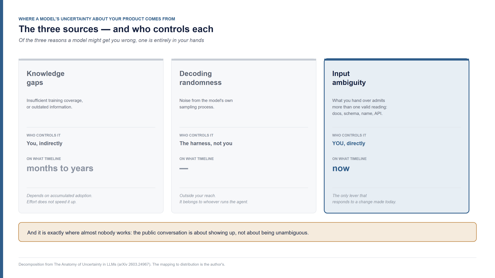
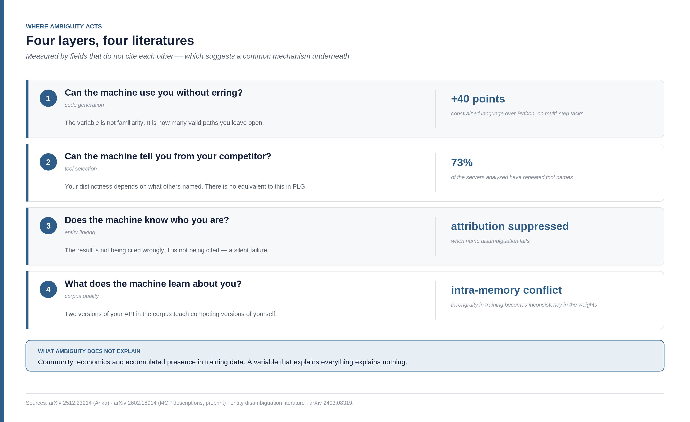
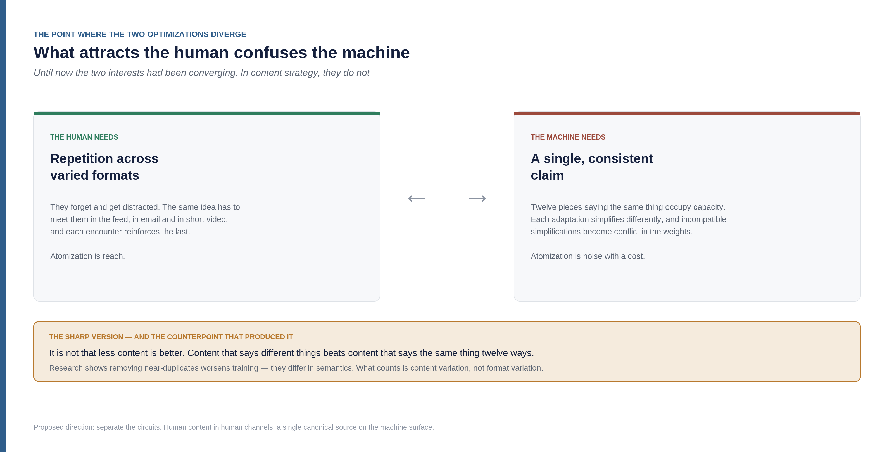
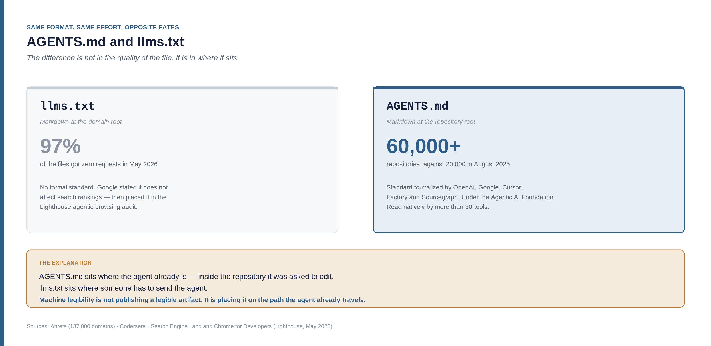
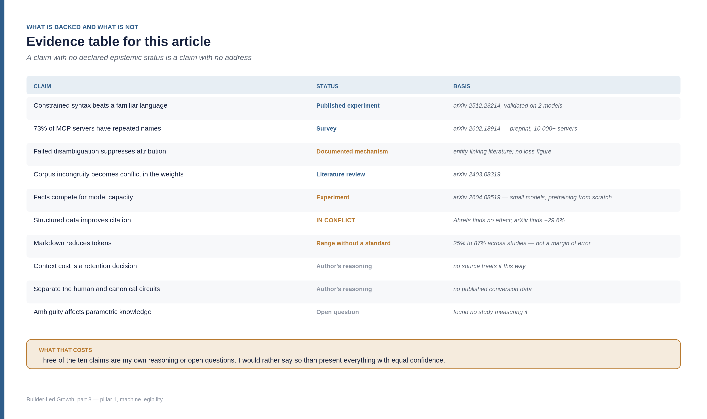

<!--
Part 03 of the Builder-Led Growth series, by Matheus Ramos.
CANONICAL VERSION (English).
Portuguese counterpart: ../pt-br/03-legibilidade-por-maquina.md
Published on LinkedIn on 5 August 2026: https://www.linkedin.com/pulse/builder-led-growth-part-3-tax-machine-charges-human-matheus-oc20f/
Generated from the private working repository. Do not edit here.
-->

# Builder-Led Growth, part 3: the tax the machine charges and the human never sees

*Third part of the Builder-Led Growth series. [Part 1](https://www.linkedin.com/pulse/builder-led-growth-when-machine-also-your-customer-matheus-inudf/) named the discipline and proposed four pillars. [Part 2](https://www.linkedin.com/pulse/builder-led-growth-part-2-decision-price-what-measure-matheus-0ahff/) opened up the mechanism of the decision, the role of price, and what to measure. This one opens the first pillar from the inside — and it turned out to be about a variable I hadn't seen when I wrote either of the previous two.*

Before getting into the first pillar, it's worth putting all four back on the table. There are weeks between articles, and whoever arrives through this one shouldn't need the previous ones to follow along.

## The four pillars, in one page

**Machine legibility.** The machine can read, understand and use your product without ambiguity. It covers everything from documentation to API surface, by way of structured data and file format. That's the subject of this article.

**Operational accessibility.** The machine can get started without a human having to step in halfway through. API key, authentication, number of manual steps, how much context your integration consumes.

**Community and validation signal.** There is third-party material that future recommendations will feed on — comparisons, public code, technical discussion, presence in surveys.

**Model trust and safety.** The machine, and the human behind it, accept using it without reviewing every step. This is where certifications, predictable failure modes, and most of the market's unserved demand live.

One correction part 2 already made, worth repeating: community isn't quite one of the four. It's what **produces the raw material** for the other three. It generates the public code that enters training, the comparative content that weighs on recommendation, and the usage history that trust feeds on.

Each pillar acts at a different moment of an agent's decision, which is why each gets its own article. Starting with what the machine can read, understand and use from your product.

## Two Markdown files, opposite fates

Look at this contrast, which I couldn't explain until this round of research.

`llms.txt` is a Markdown file at the root of your domain, summarizing your documentation for language models. Part 2 brought the number: Ahrefs analyzed server logs across 137,000 domains and found **97% of `llms.txt` files with zero requests** in May 2026.

`AGENTS.md` is a Markdown file at the root of your repository, with instructions for coding agents. Its numbers run the other way: more than **60,000 repositories** adopted it by 2026, against more than 20,000 in August 2025. It was formalized as an open standard that month, in collaboration between OpenAI, Google, Cursor, Factory and Sourcegraph, and today sits under the stewardship of the Linux Foundation's Agentic AI Foundation. It's read natively by more than thirty tools — Claude Code, GitHub Copilot, Cursor, OpenAI Codex, Gemini CLI, Windsurf, Devin, Aider, Amazon Q, among others ([Codersera](https://codersera.com/blog/agents-md-complete-guide-2026/)).

There are impact numbers circulating too: projects that adopted it report 35% to 55% fewer agent-generated bugs, and a drop in session setup time from 20–40 minutes to under 2. Worth a note of caution here — the people reporting those numbers are the ones who adopted it, not a controlled study. It indicates direction, not size.

Before moving on, a counterweight I found afterward that changes the advice. A study across four agents and 438 tasks compared repositories with an `AGENTS.md` auto-generated by a model, repositories with a hand-written one, and repositories with no file at all. The auto-generated files **reduced** success rates relative to having no file. The hand-written ones, listing only what the agent can't infer from the code — command ordering, sequencing constraints, recurring pitfalls — performed best.

Which means adopting the file is the start of the conversation, not the end of it. A six-thousand-token file produced by asking a model to "describe this repository" is worse than its absence, because it fills context with what was already visible and sometimes invents rules that don't exist. What works is short, written by someone who knows the pitfalls, and restricted to the non-obvious.

Two Markdown files. Same apparent idea. Same writing effort. Opposite fates.

The explanation isn't in the format or the quality. It's somewhere else:

> `AGENTS.md` sits where the agent already is — inside the repository it was asked to edit. `llms.txt` sits where someone has to send the agent.

And from that comes the definition organizing this entire article:

**Machine legibility isn't publishing a legible artifact. It's placing the artifact on the path the agent already travels.**

That changes the working question. It isn't "is my documentation good?". It's "where does the agent go when it solves a problem in my domain, and what does it find there?".

## Google separated the two disciplines, and there's a date

On May 5, 2026, Google added the `llms.txt` check to Chrome Lighthouse's agentic audits. Two days later, Lighthouse 13.3.0 promoted the "Agentic Browsing" category from experimental to the default configuration ([Search Engine Land](https://searchengineland.com/google-llms-txt-chrome-lighthouse-478246), [Chrome for Developers](https://developer.chrome.com/docs/lighthouse/agentic-browsing/llms-txt)).

The audit flags the page if a server error occurs while fetching the file. If the file doesn't exist, the result is marked "not applicable" — publishing it remains optional.

Notice what happened. The same company that publicly stated `llms.txt` doesn't affect search rankings put the file in an audit category dedicated to **agentic browsing**. That isn't a contradiction. It's institutional confirmation that the file was never a search instrument.

Part 2 argued that boundary with server logs. Now there's also an act by whoever operates the search engine, with a date attached.

This settles, without rhetoric, the most common confusion about this thesis. GEO and AEO, *generative engine optimization* and *answer engine optimization*, belong to this pillar — optimizing to be cited in generative answers and to be extracted as a direct answer are real, useful practices. But they're a **subset** of it, and they operate on one layer only: retrieval. A product can do well at GEO and remain impossible to use for an agent that needs to integrate it. Different problems.

## Of the three sources of uncertainty, you control one

Here the article gets the spine it was missing, and it comes from somewhere I hadn't looked.

A 2026 paper proposes decomposing a language model's uncertainty into three distinct components, rather than treating it as a single score ([The Anatomy of Uncertainty in LLMs](https://arxiv.org/abs/2603.24967), by Aditya Taparia and Ransalu Senanayake):

**Input ambiguity** — uncertainty that comes from the request admitting multiple valid interpretations.

**Knowledge gaps** — uncertainty from insufficient training coverage or outdated information.

**Decoding randomness** — uncertainty introduced by the sampling process itself.

The authors' stated motivation is practical: a single score doesn't tell you what to do. The decomposition does. High input uncertainty calls for clarification; high knowledge uncertainty calls for retrieval or more data; high decoding uncertainty calls for adjusting the sampling strategy.

Those three sources map almost directly onto the three decision inputs I proposed in part 2 — and that connection is mine, not the authors'. But what matters here is what the decomposition reveals when you ask *who controls what*. Knowledge gaps you control indirectly, on a timeline of months to years. Decoding randomness is controlled by the harness, not by you. **Input ambiguity is yours, directly, and now.**

Of the three reasons a model might get your product wrong, one is entirely in your hands, and it's the only one that responds to a change made today.

And it's exactly where almost nobody is working. The public conversation about optimizing for AI is almost entirely about **showing up**. Very little of it is about **being unambiguous**.

### A correction about timelines, before moving on

Part 2 spoke of "a lag I estimate at 18 to 36 months, accounting for collection, training and release of a large model." Investigating knowledge gaps more carefully made it clear that sentence was fusing two different quantities.

The gap between a model's cutoff date and its release is considerably smaller, and it has been shrinking:

- **GPT-3**, released June 2020, cutoff October 2019 — about 8 months
- **ChatGPT (GPT-3.5)**, November 2022, cutoff September 2021 — about 14 months
- **GPT-4**, March 2023, cutoff September 2021 — about 18 months
- **GPT-4 Turbo**, November 2023, cutoff April 2023 — about 7 months
- **Claude Fable 5**, June 2026, cutoff January 2026 — about 5 months
- **GPT-5.6 Sol**, July 2026, cutoff February 2026 — about 5 months

The curve rises through GPT-4 and falls afterward. Today the typical gap sits between 5 and 8 months ([Otterly](https://otterly.ai/blog/knowledge-cutoff/), [RankScope](https://rankscope.ai/blog/chatgpt-knowledge-cutoff)).

The 18-to-36-month figure corresponds to something else: the time it takes a technology to accumulate enough corpus volume for the model to generate it by default. That depends on adoption curve, not training calendar — and it's my estimate, derived from the shadcn/ui case, not a sourced number.

Part 2's practical conclusion still holds: if you're starting today, parametric knowledge isn't a lever for this quarter. But for the second reason, not the first.

And there's a fact that goes beyond the correction: Gemini 3.6 Flash operates with no fixed cutoff, with real-time search access. If that becomes the norm, two of the three sources of uncertainty stop being separable.

## Ambiguity, in four layers

If ambiguity is the variable under your control, it's worth understanding where it acts. I found four layers, and what convinced me there's a common mechanism underneath is that they're measured by literatures that don't cite each other: code generation, tool selection, entity linking, and training data quality.

### Layer 1 — can the machine use you without getting it wrong?

In part 2 I used the Drizzle vs. Prisma case to argue that a product's API surface is itself a distribution decision. The mechanism the sources reported was specific: Drizzle's TypeScript-native schema works better with AI code editors, while Prisma's own schema language sometimes interferes with autocomplete.

I kept pulling that thread and found a result that refines the rule I derived from it.

An experiment published in December 2025 built a domain-specific language called Anka, designed with explicit, constrained syntax to reduce ambiguity in generation ([arXiv 2512.23214](https://arxiv.org/abs/2512.23214), by Saif Khalfan Saif Al Mazrouei). The result: **with zero prior exposure to the language in training**, Claude 3.5 Haiku reached 99.9% parse success and 95.8% accuracy across 100 benchmark problems. And it beat Python by **40 percentage points** on multi-step pipeline tasks — 100% against 60%. Cross-validation with GPT-4o-mini confirmed the advantage, at 26.7 points.

The cause the authors attribute: Python's flexibility permits multiple valid approaches and requires implicit state management. That's exactly where the errors show up.

Which means the deciding variable isn't familiarity. Python is the most heavily represented language in training corpora that exists, and it loses to a language the model had never seen.

In part 2 I read the Drizzle case correctly and derived from it a rule that was too broad — something like "inventing your own language is making a distribution decision without knowing it." The case still stands; the rule needs adjusting. Inventing your own language is a problem when it combines **low corpus volume** with **syntax that doesn't constrain the output space**. A language that constrains can make up for the complete absence of training.

The more useful formulation, then:

> Design to reduce ambiguity, not to look familiar.

That's actionable in a way the earlier rule wasn't. It isn't about avoiding your own abstractions — it's about asking, at each design decision, how many valid paths it leaves open.

It's worth making that concrete, because "reduce ambiguity" sounds vague until it becomes an example. Some surface decisions that constrain the output space, drawn from what practice sources recommend for agent consumption:

**Enum instead of free string.** A parameter accepting `"pending" | "active" | "cancelled"` has three possible outputs. The same parameter typed as a string has infinite ones — and nothing stops the model from producing `"in_progress"`, which is plausible, coherent with the domain, and invalid.

**One purpose per endpoint.** The recurring recommendation is to avoid a generic `/process` with a dozen modes. Each mode is a fork where the agent can choose wrong, and the endpoint description has to carry every caveat at once.

**A declared shortcut for the common flow.** If a sequence of four calls is the frequent case, offering a single call that does all four removes four failure points at once.

**Structured errors with machine-readable codes.** Without them, the agent doesn't know whether to retry, try differently, or stop — and practice literature records that it falls into retry loops. An error message in prose is ambiguity at the worst possible moment: when something has already failed.

Worth saying where these recommendations come from: they're convergence of practice among API tooling vendors and training material, not measured results. Which is informed opinion from a lot of people who have done it, and that already counts for something — but it isn't evidence.

### Layer 2 — can the machine tell you apart from your competitor?

This is the most uncomfortable layer, and where the strongest data of this round sits.

One study analyzed a corpus of more than ten thousand MCP servers, classifying description problems into eighteen categories ([From Docs to Descriptions, arXiv 2602.18914](https://arxiv.org/html/2602.18914) — preprint, not yet peer reviewed). The distribution of problems found:

- **Repeated tool names: 7,894 cases, about 73% of the corpus.** The single most frequent failure, by a wide margin.
- Confusing functional descriptions: 3,572
- Wrong parameter meaning: 3,449
- No description of the return value: 3,093
- No declared trigger conditions: 2,972
- Clutter with irrelevant details: 2,904

The authors' sentence that captures the effect: *"in a multi-server environment, this semantic ambiguity effectively prevents the LLM from distinguishing between competing tools, leading to arbitrary selection behaviors."*

And the cause they identify is mundane, which makes it more interesting: developers name tools after internal utility functions — `read_file`, `get_data` — instead of uniquely distinct identifiers, which is what a shared namespace requires.

One supporting datapoint shows the size of the effect. Filtering which tools the model sees, rather than dumping all of them, **more than triples** selection accuracy: 43.13% against a 13.62% baseline, while cutting more than 50% of prompt tokens ([RAG-MCP, arXiv 2505.03275](https://arxiv.org/html/2505.03275v1)).

Now, what's new here for anyone thinking about growth.

**Your distinctness depends on what everyone else named.** If three servers expose a tool called `search`, none of the three is chosen on merit — the model selects arbitrarily among them. There's no equivalent to this in PLG, product-led growth, where the product itself pulls adoption. There, a bad name costs you. Here, your competitor's name costs you too.

Worth noting the study's own framing: one of its research questions is the extent to which fixing these problems **enhances the competitive advantage** of an MCP server. That's this article's thesis written in software engineering vocabulary, by people who aren't discussing distribution.

And there are two corrections the authors derive from their own survey that are worth more than the diagnosis.

The first is about **trigger conditions**. Nearly three thousand cases in the corpus don't declare in what situation the tool should be used. A robust description, they argue, can't only state what the tool does — it has to explicitly define the context in which it should be prioritized over others. Notice the shift: that isn't documenting your tool, it's positioning it against the alternatives, inside the description itself. It's a sales argument written for a machine.

The second is about **boundaries**. More than a thousand cases present unclear limits — how far the tool goes and where it stops. Without that, the model executes behaviors the tool doesn't have or misreads argument constraints. Declaring what you **don't** do is, counterintuitively, a way of getting chosen: it lowers the chance of being called in the wrong case and failing.

There's also a root-cause diagnosis from the authors worth quoting, because it describes a recognizable working pattern: they call it *"code-first, description-last"* development, in which documentation is treated as an afterthought rather than as a functional interface contract.

Under Builder-Led Growth, that order inverts. The description **is** the interface — it's the only artifact the machine-customer reads before deciding.

### Layer 3 — does the machine know who you are?

The third layer is about identity, and it opens a subject large enough that I can't handle it here.

The problem has a name in the information retrieval literature: entity disambiguation. One name can correspond to several entities — the canonical example is the acronym ABC, which resolves to American Broadcasting Company, Australian Broadcasting Corporation, or the Spanish newspaper. And one entity can have several names: full name, acronym, spelling variations, nicknames.

The entities most at risk are those with generic names, those with a close homonym among competitors, and those already carrying a history of confusion in sales and support conversations.

The finding that struck me most is the mechanism of the failure. In retrieval pipelines, sources are pulled by semantic relevance and then attributed by entity. If disambiguation fails, **attribution is suppressed**. Which means the result of name ambiguity isn't being cited incorrectly. It's simply not being cited.

It's a silent failure. It shows up in no error metric, because nothing went wrong — nothing happened.

There's a case that makes the mechanism visible, and it predates generative AI. The language created at Google is called Go. The domain `go.org` was already taken, which led to `golang.org`, and searching for the word "go" was unworkable — too common a word to index precisely. The community adopted "Golang" as a searchable nickname, and the team started using `golang.org` and the `@golang` handle. There's even issue number 9 in the project's repository, opened by someone claiming they already used the name for their own language.

The Go team solved the problem with the instrument available at the time, and the language grew. What changed wasn't their decision — it was the cost of the problem. In the search era, the human worked around it by typing "golang," and the price was friction. The machine doesn't work around it: if disambiguation fails, it doesn't try the alternative spelling on its own.

The countermeasure available today is a knowledge graph entry — Wikidata, structured data, an encyclopedia article — which is the strongest disambiguation signal that exists.

I'm keeping this section short on purpose. Investigating it, the subject turned out to be of another scale: it involves branding and naming, taxonomy, linguistics, identifier engineering and governance — five bodies of knowledge, each with its own literature. There's even a classic piece of work demonstrating that ambiguity is a **functional** property of human language rather than a defect of it, which changes the whole discussion. I'm going to give it an entire article.

For now, what stands:

> Naming looks like a brand decision. Under Builder-Led Growth, it's also a distribution decision.

### Layer 4 — ambiguity written into the weights

The first three layers deal with what happens in the moment. The fourth deals with what stays.

A review of the literature on knowledge conflicts in language models classifies the problem into three types: conflict between context and the model's memory, conflict between distinct sources within the context, and **intra-memory conflict** — inconsistency inside the weights themselves ([Knowledge Conflicts for LLMs: A Survey, arXiv 2403.08319](https://arxiv.org/html/2403.08319v1)).

The relevant claim is direct: incongruities in the training set result in inconsistencies in the knowledge encoded in the model's parameters.

Add to that two behaviors documented in the same review: models show strong confirmation bias, favoring evidence that appears most frequently; and there is sensitivity to the order in which information is presented. On the ability to detect their own conflict, GPT-4 identifies contradictions in self-contradictory documents with over 70% probability, while other models fall below 50%.

Translating that into the problem of whoever builds product:

> If your product's API changed between versions and both versions are in the public corpus, you created an intra-memory conflict **about yourself**. The model now knows two incompatible things about you — and favors the one appearing more often, which tends to be the old version, because it had more time to accumulate mentions.

That reframes something everyone who uses a coding assistant knows: the agent suggesting a deprecated API. The standard explanation is cutoff lag. Sometimes it is. But part of it may be internal memory conflict — and that one doesn't resolve by waiting for the next model, because the contradictory material stays in the corpus. Worse: it can get worse, as new versions of your API keep appearing and each leaves its own trail of tutorials, examples and forum answers. Every new version adds one more voice to a discussion the model is trying to settle on its own.

The practical consequence is tedious and nobody treats it as distribution work: version in a way that doesn't create conflict, deprecate explicitly in your own material, keep naming consistent across versions. It's corpus hygiene.

And there's a cruel asymmetry in it. The more successful you were before, the more old material exists about you — third-party tutorials, forum answers, blog posts, sample code in abandoned repositories. Past success is literally what competes with your current version for the model's attention. A product that never had traction doesn't have this problem; one that did, does.

That suggests a practice I haven't seen anyone recommend: when you break compatibility, the work doesn't end at updating your documentation. It ends at making the change **detectable** in material you don't control — method names that don't collide with the old ones, error messages that explicitly say "this changed in version X," dated examples. You can't edit someone else's corpus. You can make the new version unmistakable from the old one.

### The corpus about you isn't a warehouse, it's a budget

There's a second finding in this layer, and it runs directly against the standard recommendation for AI optimization.

Work published in April 2026 formalizes fact memorization from an information-theoretic perspective and studies how training data distribution affects factual accuracy ([Cram Less to Fit More, arXiv 2604.08519](https://arxiv.org/abs/2604.08519), by Jiayuan Ye, Vitaly Feldman and Kunal Talwar, at Apple). The findings:

Factual accuracy sits **below the capacity limit** whenever the amount of information contained in the training facts exceeds the model's capacity. The problem is worsened when the frequency distribution of facts is skewed — following a power law, for instance.

And the result that gives the effect its size: pruning training data allowed a 110-million-parameter model to memorize 1.3x more entity facts than standard training, matching the performance of a model ten times larger trained on the full dataset.

**A large caveat here:** the experiment is pretraining from scratch, on an annotated Wikipedia corpus and semi-synthetic sets, with small models. Extrapolating to the effect of a specific product inside a frontier corpus is my inference, not the paper's result.

Caveat made, the mechanism is what matters: **facts compete with each other for the model's capacity.** A redundant fact about you occupies room another fact of yours could occupy.

Which brings us to the most counterintuitive point in this article.

## What attracts the human confuses the machine

There's a consolidated practice in content, and it's expanding quickly: atomization. The idea is to take a core asset and break it into the smallest usable units — key messages, data points, quotes, visualizations — adapting each to a channel's format. The recommended cycle is pillar, atomize, distribute, running weekly. There are already agents executing this end to end, with promises of substantial production cost reduction.

For the human, it makes sense. Repetition across varied formats is reach. The same idea meets the person in the feed, in email and in short video, and each encounter reinforces the last.

For the machine, that same practice produces three effects, and none of them is good.

**First, capacity cost.** Twelve pieces saying the same thing occupy budget that other facts of yours could occupy. It's the mechanism from the previous section applied to your own content strategy.

**Second, and this is the more serious one, inconsistency.** In adapting the same message to twelve channels, each version simplifies differently. The simplifications aren't identical — and slightly incompatible claims about the same product become the intra-memory conflict from the previous section. You don't just spend capacity: you teach competing versions of yourself.

**Third, manufactured ambiguity.** An excerpt pulled from a larger argument carries less context than it would need to be read one way only. Fragmenting removes the information that was doing the disambiguating.

### The counterpoint, which improves the argument

Before turning this into a recommendation, I found evidence pointing the other way that's worth more than confirmation.

There's research showing that training on **deduplicated** data produces worse results than keeping near-duplicates, with degradation equivalent to training on 5% to 10% less data. The explanation: near-duplicates are less equivalent than one might assume — they differ noticeably in semantics ([arXiv 2404.06508](https://arxiv.org/pdf/2404.06508)).

That forced me to sharpen the mechanism, and the sharp version is stronger than the initial intuition:

> It isn't that less content is better. It's that **content saying different things** beats content saying the same thing twelve ways. What helps the machine is semantic variation. What hurts it is format variation without content variation.

And that's exactly why atomization is the hard case: it produces the second kind by construction. It carries the capacity cost of duplication without the informational gain of genuine variation.

### Why this section matters more than the others

This is the first point in the series where optimizing for the human and optimizing for the machine point in opposite directions.

Until now, the two interests had been converging. Clear documentation serves both. Frictionless integration serves both. A reliable product serves both. Here, no: the human needs repetition and format variation to remember; the machine needs a single, consistent claim in order not to get confused.

The direction that seems reasonable to me isn't choosing between the two optimizations. It's **separating them**. A heads-up that from here on this is my reasoning — I looked for anyone publishing data on this and found none.

Separating means something more specific than having a documentation section. It means accepting that there are two content circuits with different rules:

**The human circuit** stays as it is. Atomization, repetition, adaptation by channel, variation in tone. It's optimized for memory and reach, and those are properties of someone who forgets and gets distracted. Nothing in this research suggests changing it.

**The canonical circuit** follows the opposite rule: each claim about your product exists **once**, in one place, in the current version. Versioned documentation, `AGENTS.md`, `llms.txt`, structured data, API reference. When something changes, it changes there — and prior versions are explicitly marked as prior, neither deleted nor left ambiguous.

The practical question that separates the two: **if this claim turns out to be wrong six months from now, how many places do I have to fix?** If the answer is "one," it's the canonical circuit. If it's "twelve," it's the human circuit — and you've just accepted that twelve different versions of it will circulate.

This carries an organizational cost that isn't small. In most companies the two circuits are run by different teams, with different goals, and the canonical circuit tends to be the responsibility of whoever has fewer resources. I don't have a solution for that — it's the kind of problem that probably belongs to an article about how product teams organize under this discipline.

## Context cost is also legibility

There's a dimension of legibility that doesn't seem to belong to it until you look at the numbers.

Each tool exposed by an MCP server costs between 550 and 1,400 tokens in name, description, JSON schema, field descriptions, enums and system instructions. GitHub's official MCP server consumes 17,600 tokens of tool definitions per request. Three services with forty tools add up to roughly 55,000 tokens of definitions **before the agent reads the user's first message** — more than a quarter of Claude's 200,000 limit ([StackOne](https://www.stackone.com/blog/mcp-token-optimization/), [The New Stack](https://thenewstack.io/how-to-reduce-mcp-token-bloat/)).

This isn't a peripheral problem. There's an open issue in the protocol's official repository asking the specification to address the roughly thousand-token overhead per tool per session. And the subject left the technical blog and entered formal research, with work on tool schema compression published on arXiv. One solution from Atlassian Labs replaces the full inventory with two generic tools and reports a 70% to 97% reduction in initial consumption.

There's also a less-discussed effect: the cost of **responses**. A single call to a corporate API can return hundreds of thousands of characters of raw JSON. In the analyses I found, that cost tends to exceed the cost of the definitions, and it gets less attention.

"Publish an MCP server" became standard advice. The data suggests a more careful reading: a poorly designed server is a **cost imposed on the user**. It occupies context that would have belonged to that person's work.

And here there's a consequence that closes a circuit with part 2, which opened the decision and the price.

Part 2 described the hidden cost of removing friction: keyless onboarding makes the agent consume the quota faster and pulls forward the moment someone has to decide about money. Context cost produces the same effect by another route — and this one is harder to see, because **the cost doesn't appear on your invoice, it appears on the user's**.

A server occupying 55,000 tokens makes every session it's loaded into more expensive. The human perceives that as slowness, a full window, or an API bill going up. The natural reaction is to remove tools from the harness. Which means: the agent adopted, and the human **un-adopts** for economic reasons — without any plan price entering the equation.

Part 2 formulated the limit of the thesis as "BLG decides who enters, human economics decides who stays." That still holds, and now it gets broader: it isn't only your product's price that returns control to the human. It's any cost your product's use imposes on them. Under Builder-Led Growth there's an implicit invoice the vendor neither issues nor sees.

From which comes a derivation I found in no source: **context economy is a retention decision, not an engineering one.** Whoever designs the server with progressive loading or schema compression is buying permanence. All the literature I found treats the subject as technical optimization.

And notice the relation to the rest of this article. The solutions the literature proposes for the context problem — progressive loading, on-demand tool retrieval, schema compression — are all ways of **showing the model less at a time**. That accuracy gain in choosing among competing tools, from 13.62% to 43.13%, comes precisely from this: filtering which tools the model sees before asking it to choose.

In other words, context cost and ambiguity aren't two problems. They're the same problem measured in different units. Every token you occupy unnecessarily is attention the model spreads across more options — and spreading attention across more options is the operational definition of being unsure.

## Structured data: when the evidence is in conflict

This section is the opposite of the previous one. Here the studies disagree, and the disagreement is more informative than either of them alone.

**In favor.** Part 2 cited a test in which GPT-4 went from 16% to 54% correct answers when the content consulted used schema.org/JSON-LD. Work from March 2026 measures a similar effect: JSON-LD enriched with agent-optimized entity pages lifts retrieval-augmented generation accuracy by 29.6% in standard pipelines and 29.8% in fully agentic ones. And Google, in an April 2025 statement, said structured data gives an advantage in search results.

**Against.** Ahrefs tracked 1,885 pages that added JSON-LD between August 2025 and March 2026, comparing them to 4,000 control pages with similar citation levels. It found no significant increase in citations across Google AI Overview, AI Mode or ChatGPT.

Both sides have declared methodology. Neither can be dismissed.

The reconciliation that seems most likely to me, and here I'm already speculating from what I read, lies in how the model processes the file. Models tokenize the entire HTML response, including the script blocks containing the JSON-LD, but they don't parse it as structured data: they read it as plain text, alongside the rest of the page.

If that's it, the gain doesn't come from the model "understanding schema." It comes from the schema **stating the fact explicitly, briefly and unambiguously** in the middle of the text. Which would explain why accuracy improves in retrieval studies while citation rate doesn't in the Ahrefs study: they're different things. Being cited is competition for attention. Being cited correctly is reduction of ambiguity.

And that reinforces this article's thesis. The value of structured data isn't decorative or about ranking. It's disambiguation.

## Format: the honest range

On Markdown versus HTML, the numbers exist in quantity — and they disagree with each other enough that picking one would be dishonest.

A study with 50 pages reports a 67% reduction in tokens, a 31% increase in accuracy, and measurable cost savings. Other reports point to 68% to 87% reduction for clean content and real-world pages. One measured benchmark reaches 71%. And there's a contrarian study suggesting the real saving sits around 25% and that the high numbers are optimistic. In retrieval pipelines, the reported range is up to 35% accuracy gain with 20% to 30% less token cost.

> The direction is consistent across every study. The magnitude has no standardized methodology. From 25% to 87% isn't a margin of error — it's the absence of a standard.

I'll declare the bias: converting content into machine-readable Markdown is the business rationale of the product I'm building. Which is exactly why I'd rather publish the whole range than pick the number that flatters me.

## When legibility leaves the repository

A fair objection to everything I've written so far: the examples all come from developer tools. MCP server, `AGENTS.md`, ORM schema. Someone could conclude the thesis only applies to whoever sells to people who write code.

There's a movement underway suggesting otherwise.

WebMCP is a standard proposed to the W3C, developed jointly by Google and Microsoft, that lets a website expose executable actions directly to agents running inside the browser. The developer declares named JavaScript functions and HTML forms as machine-readable endpoints — "search inventory," "start checkout," "open a ticket." Instead of the agent screenshotting the page and guessing where to click, the site hands over the list of what it can do and the exact parameters of each action ([Web Developer](https://webdeveloper.com/news/google-webmcp-chrome-149-origin-trial/), [Locomotive](https://locomotive.agency/blog/webmcp-ai-agents-website-functions/)).

The difference from traditional MCP is architectural: MCP connects the agent to backend servers; WebMCP keeps everything inside the tab. Tools execute in the page's JavaScript, share the session the user already has, and the browser mediates what the agent is allowed to do.

Current status: specification accepted by the W3C's Web Machine Learning Community Group in September 2025, experimental origin trial in Chrome 149, native support in Chrome and Edge expected in the second half of 2026. Firefox and Safari participate in the discussions without declared implementation commitments.

To sum up: it's a standard in testing, with two relevant browsers still out. We'll have to wait and see — but we will see, because one of the two largest browsers in the world is already implementing it.

What it means for the thesis, if it advances: any site — e-commerce, SaaS with an interface, service — becomes able to declare its actions to a machine. Machine legibility leaves the repository and enters the ordinary web. And this article's same question applies: how many valid paths does your declaration leave open?

## What to measure in this pillar

Part 2 dealt with measurement by stage of the decision. Here are the measures specific to legibility, in order of increasing cost.

**Citation accuracy rate.** I proposed this in part 2, when the subject was what to measure; now the mechanism is explained. A list of twenty questions about your domain, reviewed manually once a month: when the model mentions you, does it get the package name, the install command, the method right? When it gets it wrong, the cause is usually one of two things we saw here — either it doesn't know who you are and resolved your name to another entity, or it learned two incompatible versions of you and picked the wrong one.

**Semantic dispersion.** Derived from uncertainty quantification methods: ask the same question about your product several times and measure how far the answers diverge **in meaning**, not in wording. The distinction matters — token-level entropy captures phrasing variation and can't tell that apart from real ambiguity, which is why the literature developed semantic entropy measures. High dispersion about you is an indirect measure of ambiguity in your surface.

**Name audit.** Whose identifiers do yours collide with? In MCP registries this is directly verifiable. Bearing in mind that around 73% of the servers analyzed in that survey have repeated tool names — the chance you're in that count is high enough to justify checking.

**Context cost.** How many tokens your server occupies before the user's first message. It's measurable in an afternoon and almost nobody measures it.

**Consistency across versions.** How many incompatible claims about your product exist in the public corpus today. Old documentation that wasn't removed, outdated third-party tutorials, old forum answers.

Here's a gap worth saying out loud: **there is no ambiguity index computed from the artifact itself**, without going through a model. The only exception I found was the detector built for that MCP server survey, and it only covers tool descriptions. Every measure above looks at the symptom inside the model. Measuring the cause in the material itself remains an open problem — and, as I read it, an opportunity.

It's worth being explicit about why that distinction matters and isn't fussiness. Measuring the symptom inside the model has three practical limitations: it costs money per run, it changes when the model changes, and it arrives late — by the time semantic dispersion shows up, the ambiguous material has been in the corpus for months. An index computed over the artifact would answer before publishing, cost almost nothing, and not depend on which model is in front. It's the difference between a blood test and a scale.

While that doesn't exist, the reasonable substitute is manual and cheap: take your main documentation and your tool descriptions and ask, line by line, how many different readings each claim admits. It's tedious work — and, by the numbers from that ten-thousand-server survey, it's where most of the problem sits.

## Where ambiguity explains nothing

A variable that explains everything explains nothing. Worth marking where this one stops.

Ambiguity explains execution, competitive selection, identity and part of what the model learns. It **doesn't explain** why third parties write about you — that's the validation signal pillar, the third-party material recommendation feeds on, and it depends on community rather than clarity. It **doesn't explain** the economics that make a human switch vendors when the invoice arrives. And it **doesn't explain** accumulated presence in training data, which is a function of volume and time, and which no amount of precision accelerates.

And a question stayed open that I honestly can't answer. If ambiguous content produces an ambiguous representation in the weights, then two products with the same documentation volume and the same apparent quality could be represented very differently inside the model — one with sharp contours, the other blurred. I looked and found no study that has measured this.

If you work with model evaluation and know of work in that direction, or have a way to test it, that's the kind of thing I'd like to discuss. I'm leaving the question open on purpose.

## Closing

What came into sharper focus this round.

Machine legibility isn't publishing a legible artifact — it's being on the path the agent already travels. `AGENTS.md` and `llms.txt` are the same format with the same effort, and the difference in their fates is entirely one of position.

Of the three sources of uncertainty a model has about your product, you control one directly and in the short term: ambiguity. Knowledge gaps take months or years. Decoding randomness isn't yours.

And ambiguity acts across four layers, measured by literatures that don't talk to each other: whether the machine can use you without erring, whether it can tell you apart from your competitor in a shared namespace, whether it knows who you are, and what it ends up learning about you.

The formulation I'd take from here:

> Ambiguity is the tax the machine charges and the human never sees. The human resolves ambiguity for free — reads the context, asks, tries again, infers from common sense. It's work they don't even register as work. The machine doesn't resolve it: it picks arbitrarily, gets it wrong, or gives up.

Every point of ambiguity left in your product because "it's understandable" is a point where the machine can pick someone else.

And the most uncomfortable finding of this part is the inversion. Until now, optimizing for human and optimizing for machine had been converging. In content strategy, they diverge: the human needs repetition across varied formats, and the machine needs a single consistent claim. If that reading is right, the answer isn't choosing one of the two — it's to stop serving both through the same channel.

In part 4 I open the second pillar: operational accessibility. What happens once the machine has chosen you and tries to start — how many steps require a human, what the first success costs, and why most products lose right there without any metric flagging it.

If any part of this mechanism doesn't match what you observe in practice, that's the kind of response the series needs to move forward.

---

**Builder-Led Growth series**

- [Part 1 — When the machine is also your customer](https://www.linkedin.com/pulse/builder-led-growth-when-machine-also-your-customer-matheus-inudf/)
- [Part 2 — The decision, the price and what to measure](https://www.linkedin.com/pulse/builder-led-growth-part-2-decision-price-what-measure-matheus-0ahff/)
- Part 3 — The tax the machine charges and the human never sees (this piece)

The series continues. Each part goes deeper into something the previous one could only point at, and this block is updated as the next ones come out.
