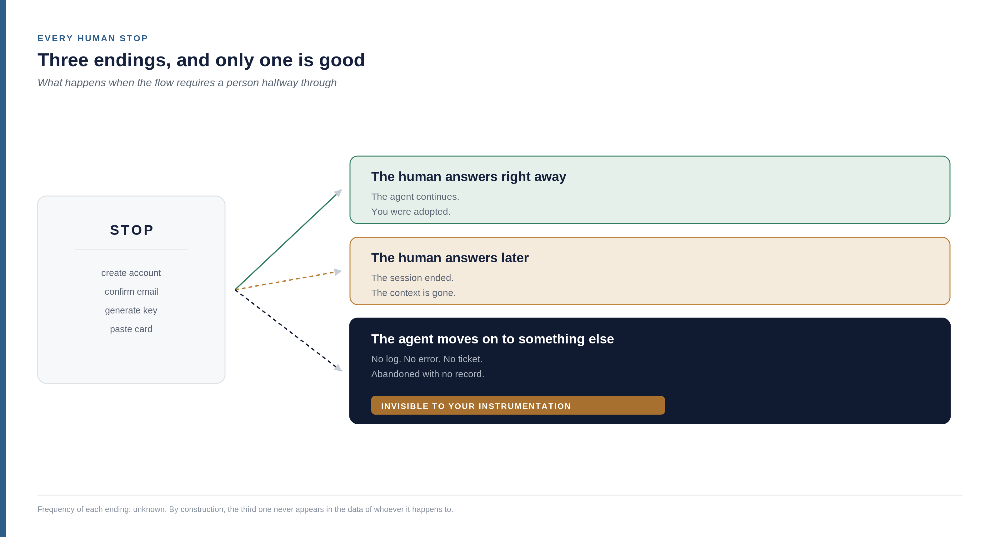
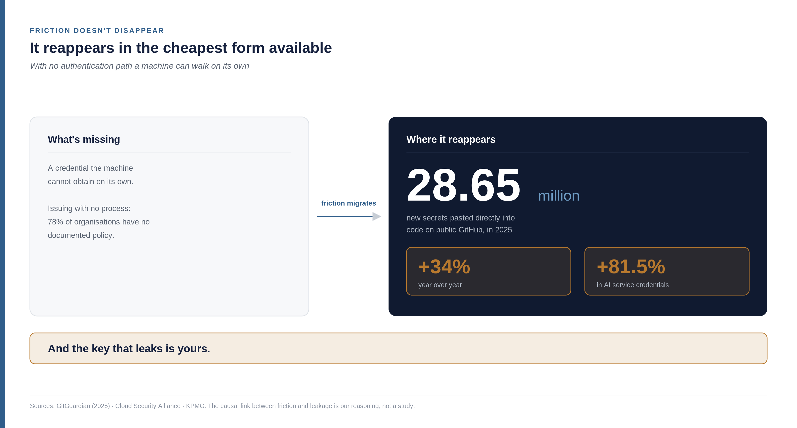
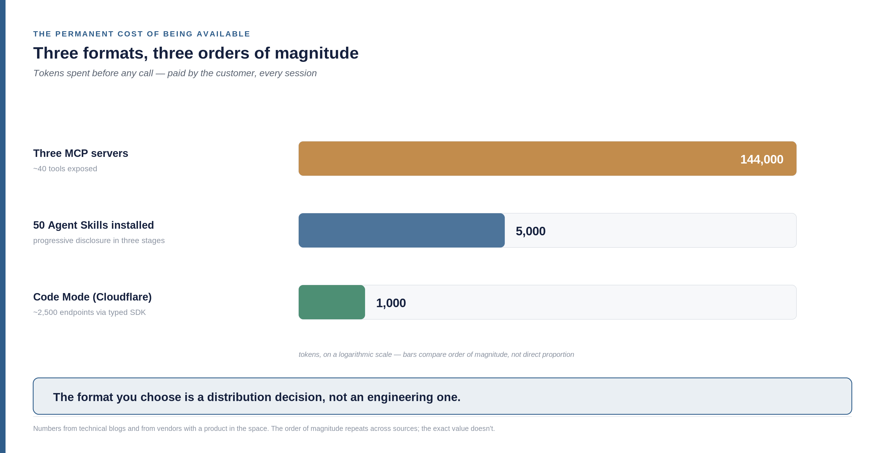
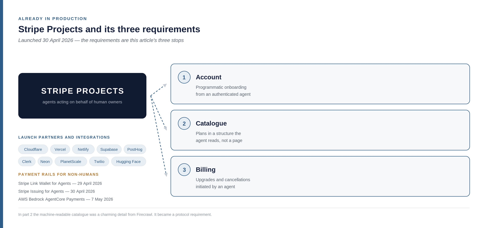
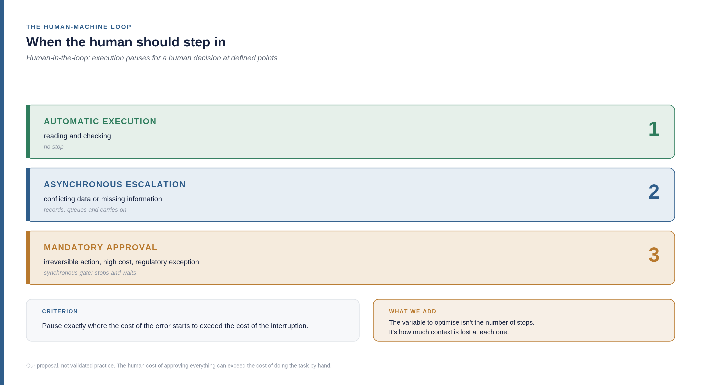

<!--
Part 04 of the Builder-Led Growth series, by Matheus Ramos.
CANONICAL VERSION (English).
Portuguese counterpart: ../pt-br/04-acessibilidade-operacional.md
Text frozen. Scheduled for LinkedIn on 7 August 2026.
Generated from the private working repository. Do not edit here.
-->

# Builder-Led Growth, part 4: how many times the agent has to call a human

*Fourth part of the Builder-Led Growth series. [Part 1](https://www.linkedin.com/pulse/builder-led-growth-when-machine-also-your-customer-matheus-inudf/) named the discipline and proposed four pillars. [Part 2](https://www.linkedin.com/pulse/builder-led-growth-part-2-decision-price-what-measure-matheus-0ahff/) opened up the decision mechanism and the role of pricing. [Part 3](https://www.linkedin.com/pulse/builder-led-growth-part-3-tax-machine-charges-human-matheus-oc20f/) covered the first pillar, machine legibility. This one opens the second — and it comes down to a question you can actually count.*

## The four pillars, on one page

**Machine legibility.** The machine can read, understand and use your product without ambiguity. Documentation, structured data, file format, API surface. That was part 3.

**Operational accessibility.** The machine can get started without a human having to step in halfway through. Credentials, authentication, number of manual steps, the cost of being available. That's this article.

**Community and validation signal.** There is third-party material that future recommendations will feed on — comparisons, public code, technical discussion.

**Model trust and safety.** The machine, and the human behind it, accept using it without reviewing every step.

One correction part 2 made, worth repeating: community isn't quite one of the four. It's what **produces the raw material** for the other three — the public code that lands in training, the comparative content that weighs on recommendation, the usage history that trust feeds on.

Each pillar acts at a different moment of the decision. This one is about the moment the machine has already picked you and tries to get started.

## The number that settles whether this is real

Vercel publishes a production index for its AI Gateway — the layer model traffic passes through for teams using the platform. The April 2026 data, covering more than 200,000 teams and seven months of history, shows this: **58.9% of all tokens now flow in tool-call requests**, against 31.6% six months earlier. And **22.2% of requests end in a tool call**, against 11.4% in October 2025 ([Vercel](https://vercel.com/blog/ai-gateway-production-index)).

It doubled in half a year.

Hold onto the proportion: more than half the tokens moving through the model layer aren't conversation. They're a machine calling a tool. If your product isn't one of those tools, you're outside more than half of the traffic that matters in that layer.

And now the uncomfortable part: there's an established metric for exactly this moment, and it measures the wrong thing.

## The metric that exists and starts counting too late

In API products the reference metric is *time to first successful call* — counted from account creation to the first response that works. Under five minutes is considered excellent. Above thirty indicates friction that meaningfully reduces conversion from whoever tried to whoever activated.

There's an older variant, *time to first hello world* — the time until a developer gets the minimum result proving the thing works. In developer relations teams it usually sits next to *weekly active tokens* as the pair of north-star metrics for the function. And there's a practical data point: offering a ready-to-run collection makes a developer between 1.7 and 56 times faster to the first call. That range is far too wide to treat as a measurement; it tells you the effect exists, not how big it is.

All of those metrics share one thing: **they start counting at account creation**.

Under Builder-Led Growth the clock starts earlier. The agent has already picked you — it won candidacy, it won recommendation — and still has no account, no key, no permission. The interval that decides the outcome runs from **intent** to first call. And almost nobody instruments that, because every instrument that exists was designed for a funnel that begins at signup.

One of the sources I read puts the shift well: documentation now has two audiences, and the machine audience is growing faster than the human one.

## Operational accessibility as a question you can count

The operational definition of this pillar fits in one line:

> Count how many times your flow calls a human, from the decision to the first successful call.

You can count it in an afternoon. Take the path an agent would walk to use your product for the first time and mark every point where it has to stop and ask a person for something. Create an account. Confirm an email. Generate a key. Accept terms. Pick a plan. Paste a card.

Each of those stops has three possible endings, and only one is good.

**The human answers right away.** The agent continues, and you were adopted. This is the case everyone pictures while designing the flow.

**The human answers later.** But the context is gone. The session ended, the window closed, the agent no longer knows why it needed that. Formally you were adopted; in practice, that task was never finished.

**The agent moves on to something else.** And this is where this pillar's problem lives.

## What happens when the machine neither uses you nor calls the human

The agent hits a stop, decides it isn't worth interrupting the person, and solves the problem some other way. No log. No error. No support ticket. Not even an abandoned signup showing up in a report somewhere.

The product wasn't rejected. It was **abandoned with no record**.

Here I have to be strict with myself, because the temptation is strong. I don't know how often this happens. I have no number, and I couldn't get one from the data of whoever suffers the effect — if there were a record, it wouldn't be this ending. Writing that it's the most common case would be building a claim that defends itself from any challenge, and that isn't an argument.

What holds up is narrower and still uncomfortable: **this ending exists, it is invisible to the instrumentation products have today, and its size is unknown to whoever it happens to.** You don't see the queue of people giving up, because there is no queue. You see an activation number that looks reasonable, with no denominator.

It's the same shape of silent failure part 3, [the tax the machine charges and the human never sees](https://www.linkedin.com/pulse/builder-led-growth-part-3-tax-machine-charges-human-matheus-oc20f/), found in name disambiguation — when the model can't resolve what a name refers to, the attribution disappears, and no error metric flags it, because nothing went wrong. Here the failure happens one layer later, at execution, and vanishes the same way.

And there is a way to measure it, indirect, which I get to further down in the section on what to track: instrument the agent's side, not yours. Whoever runs the fleet of agents sees the abandonment you can't.

## How the machine decides to keep going or quit

If the decision to quit exists, it's worth understanding why it gets made. And it works differently from the decisions in the earlier stages.

In candidacy and recommendation the agent chooses by preference: what it knows, what it can retrieve, what looks appropriate. Here it isn't preference. It's **feasibility within the task's budget**. The agent is in the middle of something else, with limited context and a goal that isn't using you.

What weighs, from what the sources describe about agent behaviour:

**Is there a path that doesn't require a human?** If there isn't, the cost of insisting is indeterminate — it could be thirty seconds or it could be all day, depending on when the person looks at the screen.

**Does the error say what to do?** A message that only reports that something failed forces the agent to guess. One that says which step is missing lets it continue.

**How many steps are left, and is that discoverable up front?** A six-step flow declared at the start is a known cost. The same flow discovered one step at a time is a sequence of surprises.

**Does the remaining context fit the attempt?** If the window is already full — and part 3 showed how fast it fills — the attempt never starts.

Which produces the formulation I find most useful in this article:

> The machine doesn't quit because the product is bad. It quits because the path to success isn't **estimable**.

That changes what you fix first. It isn't cutting steps at any cost — it's making the cost visible before the agent invests in the attempt.

## What blocks the agent is almost always the credential

If most stops were spread across different things, this pillar would be a list of unrelated improvements. It isn't. Nearly everything converges on one point: the machine needs a credential and has no way to get one on its own.

The term the security industry uses is **non-human identity** — any credential that doesn't belong to a person. API key, service token, bot account, machine certificate. They've always existed. What changed is the ratio.

KPMG, in its *Cybersecurity Considerations 2026* report, estimates the average company now runs more than **80 machine identities for every human one**. And the pace is what's striking: an organisation holding roughly 50,000 machine identities in 2021 reached 250,000 by 2025 — five times more in four years.

Here the sources diverge, and I'd rather show the whole range than pick the number that sounds better: in cloud-native environments one survey puts it at 144 machine identities per human and another at 45. A threefold gap between measurements that, in theory, describe the same thing — which by itself says something about how much this count is still being figured out.

The effect, though, shows up in all three sources. **68% of IT security incidents involve machine identities**, and half the companies surveyed have already had a breach through an unmanaged non-human identity. Preparedness doesn't keep pace: 78% of organisations have no documented policy for creating or removing AI identities, and only 8% report high confidence that the system they already use to manage identity and access — IAM, for *identity and access management* — covers the risk.

On where these numbers come from, because it changes the weight they deserve: the 80-to-1 figure is KPMG's, primary and named. The governance and incident numbers come from a [Cloud Security Alliance](https://labs.cloudsecurityalliance.org/research/csa-whitepaper-nonhuman-identity-agentic-ai-governance-v1-cs/) whitepaper, an industry association, and from two market compilations ([Axis Intelligence](https://axis-intelligence.com/machine-identity-statistics/), [Digital Applied](https://www.digitalapplied.com/blog/agent-identity-credentials-non-human-access-2026-playbook)) that cite primary research I did not open one by one. They're enough to support the order of magnitude and the direction. They're not enough for me to defend the second decimal place of any of them.

Hold those numbers for two paragraphs. They come back somewhere else, wearing a different face.

## Friction doesn't disappear, it moves

GitGuardian scans public repositories looking for exposed credentials. In 2025 it counted **28.65 million new secrets pasted directly into code** on public GitHub — up 34% year over year, the largest annual jump since the company started measuring. Credentials for AI services specifically grew 81.5%.

Now put the two together. On one side, a volume of machine identities that quintupled and an issuing process most organisations admit they don't have. On the other, tens of millions of keys showing up inside public code.

The mechanism linking one end to the other is short: when there's no authentication path a machine can walk on its own, the friction doesn't disappear. It reappears in the cheapest form available to someone in a hurry — a key pasted into the code, because that was the way to make the thing work today.

And the key that leaks is yours.

Fair warning that from here it's my reasoning: I found no study causally linking onboarding friction to credential leakage. What exists is two curves rising together and a direct mechanism between them. That's enough for me to take it seriously, not enough for me to state it as demonstrated.

But if the reading is right, it changes whose problem this is. Authentication stops being the security requirement that gets in the way of adoption and becomes part of the product — because the path a machine walks alone is, at the same time, what reduces friction and what keeps the key out of the repository. These aren't two initiatives competing for priority. They're one.

## What the specification of 28 July 2026 changed

Worth explaining the protocol before what it started doing. **MCP** stands for *Model Context Protocol* — an open standard, created by Anthropic and later adopted by other vendors, defining how an agent discovers which external tools exist and how it calls them. It's the plumbing through which a coding assistant talks to your product.

The revision published on 28 July 2026 is the largest change the protocol has had so far, and much of it attacks exactly the human stop this article has been counting. It's worth going item by item, because every acronym hides a practical consequence.

**Stateless core.** Before, a server could depend on holding a session between one request and the next. Now it doesn't have to. In practice: hosting an MCP server stops requiring special infrastructure and runs behind an ordinary load balancer.

**MCP servers formally become OAuth 2.1 *resource servers*.** OAuth is the authorisation standard the web has used for over a decade — it's what sits behind "sign in with your Google account". Putting MCP inside it means stopping the invention of bespoke authentication and reusing what the world already knows how to operate.

**Mandatory *Protected Resource Metadata*.** The server now publishes, in a predictable place, where the client should authenticate. The client finds out on its own, instead of someone having to tell it.

***Dynamic Client Registration*.** The client registers programmatically, at runtime. Without exaggeration: this is the formal removal, from the protocol, of the human who copied an identifier from one dashboard and pasted it somewhere else. It's the single most common human stop turning into a call.

***Resource Indicators*.** The token becomes bound to the destination it was issued for. If it leaks, it doesn't work anywhere else — which shrinks the damage from that earlier item about keys in public code.

**Tool listing cache.** The `tools/list` call, which is how an agent discovers what exists, can now be cached. It attacks directly the context cost measured in part 3, [the tax the machine charges and the human never sees](https://www.linkedin.com/pulse/builder-led-growth-part-3-tax-machine-charges-human-matheus-oc20f/), which the next section picks up with numbers.

[David Soria Parra](https://www.linkedin.com/in/david-soria-parra-4a78b3a), one of MCP's creators and now its lead maintainer at Anthropic, publicly acknowledges the context-bloat problem and describes the protocol's direction in the same terms: progressive discovery, stateless transport, composition through code. This isn't an outside critique the protocol ignores — it's the diagnosis of the people who built it.

What that means for anyone building product: most of this pillar's human stops stopped being a problem without a standard solution. They became a decision about whether or not to adopt a standard that already exists.

## The permanent cost of being available

With entry solved, one calculation remains that almost nobody does: **being available costs, and it costs every single time.**

It isn't the cost of being called. It's the cost of existing in the agent's context before any call happens — the tool definitions it has to load just to know you're there. And here the three available formats separate by order of magnitude, not by taste.

**MCP.** Between 550 and 1,400 tokens per exposed tool. GitHub's official server consumes around 17,600 tokens per request. A database server with 106 tools burned 54,600 tokens before answering anything at all. Three servers totalling about 40 tools consumed 72% of a 200,000-token window — and the work hadn't started. Perplexity reported dropping MCP internally because the numbers didn't work in production.

**Agent Skills.** An open standard published by Anthropic on 18 December 2025 and adopted by OpenAI, Google, GitHub and Cursor within weeks. The format is a `SKILL.md` file, and the mechanism is *progressive disclosure* — the principle of showing only what's needed at each step, borrowed from interface design and applied here to the model's context. It works in three stages: discovery loads only name and description; activation reads the whole file when the task matches; execution loads the rest if needed. The result: **50 installed skills cost around 5,000 permanent tokens** — roughly a tenth of what three MCP servers cost in the example above.

**Code Mode**, from Cloudflare. Instead of exposing tool definitions, it exposes a typed SDK and an isolated environment where the agent writes code to use the product. The reported number: a tool context of 1.17 million tokens dropped to around a thousand, covering approximately 2,500 endpoints. That's a 99.9% reduction, and the magnitude is large enough that I'll flag I haven't confirmed it in the primary source.

A caveat that belongs where the numbers are, not in a footnote: much of this measurement comes from technical blogs and from material published by people with a product in the space. The orders of magnitude repeat across independent sources, which makes me comfortable with the relative comparison. The exact values, less so.

> The format you make yourself available through is a distribution decision, not an engineering one. It determines what it costs your customer to keep you around.

And there's an asymmetry in that worth seeing. The cost of being available is paid by the customer, in tokens, every time they open a session — including the sessions where they don't use you. A product that's expensive to keep around is a product someone, at some point, removes from the configuration to free up room. Not out of dissatisfaction. Out of budget.

## This is already in production, and you can see it from outside

Up to here all of this could sound like a recommendation. It isn't: there are companies that have already reorganised product around these stops, and what they require from anyone integrating shows clearly what this pillar charges.

On 30 April 2026 Stripe launched **Projects**, a protocol letting agents create accounts, buy domains, upgrade plans and deploy infrastructure on behalf of human owners. Cloudflare, Vercel and Netlify came in as launch partners; Supabase, PostHog, Clerk, Neon, PlanetScale, Twilio and Hugging Face already appear as integrated.

Look at what the protocol requires from whoever adopts it, because they're exactly the three stops this article has been counting:

1. Account creation that accepts programmatic onboarding from an authenticated agent
2. Plan catalogue exposed in a structure the agent reads, not just a pricing page built for a human
3. Billing that accepts upgrades and cancellations initiated by an agent

The second item deserves a second look. In part 2 Firecrawl showed up publishing a `/pricing.md` — a version of its pricing written for machines — and it looked like a charming detail from someone who understood the game early. It stopped being a detail: it became a protocol requirement from one of the largest payment processors in the world.

Still in April and May 2026 the payment rails arrived: **Stripe Link Wallet for Agents** and **Issuing for Agents**, on 29 and 30 April, and **AWS Bedrock AgentCore Payments** on 7 May, with Coinbase and Stripe, in which agents discover, evaluate and pay for APIs and servers inside a single execution loop.

That answers directly a recommendation part 2 made without any way to fulfil it: having a revenue path a machine can walk. At the time it was a good idea with no infrastructure. Now the infrastructure exists.

And there's a quieter acknowledgement, which I find the most revealing of the three. Cloudflare published a documentation surface dedicated to agents, separate from the documentation for people, at `developers.cloudflare.com/docs-for-agents/`. It's the explicit admission that the agent-reader and the human-reader want different views of the same material — which is the inversion described in part 3, [the tax the machine charges and the human never sees](https://www.linkedin.com/pulse/builder-led-growth-part-3-tax-machine-charges-human-matheus-oc20f/), turning into site structure.

## What we inherited, and what we add

If I see further, it's because I'm sitting on the shoulders of giants. The line is Isaac Newton's, in a letter to Robert Hooke from 1675, though the metaphor is far older — attributed to Bernard of Chartres in the twelfth century and recorded by John of Salisbury. It fits here.

[Joshua Baer](https://www.linkedin.com/in/joshuabaer), founder and CEO of Capital Factory, published the **Agents First** framework in April 2026, at agentsfirst.dev, with a formulation I'd rather quote in full than paraphrase:

> "Every product is gaining a second customer: the human who pays and the agent who decides."
>
> — Joshua Baer, *Agents First*, April 2026

The framework brings nine implementation principles, a five-level adoption ladder, named anti-patterns and an open instrument that scores websites. It's serious work, and it improved this series' understanding of the phenomenon — I say that plainly because it's true and because crediting well is cheap.

And, in the same motion, what changes here. That framework asks how to build the interface for the agent. This series asks what the interface does to your distribution — and what happens when the human goes back to deciding. The decisions are the same ones: API design, documentation format, protocol choice. What I'm proposing is pulling them out of the "technical matter" category and onto the growth table, with growth having a say in the decision.

The practical gain from that shift is what matters to a reader. When the choice of format stops being an engineering decision and becomes a distribution one, it starts being judged by acquisition cost, by retention and by staying power — not by architectural elegance. Product and growth teams get vocabulary to argue about a decision that today happens without them in the room.

There's also ground this series covers that sits outside that work's declared scope: community as the producer of the raw material for the other pillars, accumulated presence in training data, the economic limit where the human takes the decision back — and combined experience, which is the next section.

Two instruments you can use today, complementary to each other and to what I'm proposing here: Cloudflare's **Agent Readiness Score**, which measures external signals verifiable by a crawler, and **a14y.dev**, with 38 versioned checks applied to pages.

One figure from Cloudflare's survey shows the size of the window: **4% of sites declare AI usage preferences**, and fewer than fifteen sites, combined, publish MCP server cards or API catalogues. The field is close to empty. That's why treating this as a growth decision, rather than an infrastructure chore, still pays.

## Combined experience

Here comes an addition to the thesis, and it started with a personal account — mine, with all the bias that carries.

Setting up payment methods for two projects, with Stripe, working in *vibe coding* — programming by talking to the agent and letting it write most of the code — the number of times I had to step in was small. The results came out right. There was practically no rework.

That's the experience of one satisfied user with a declared interest in the subject, and not a measurement. But there's something in it that none of the numbers in this article capture: **the absence of rework**. No adoption metric counts how many times the human had to correct what the agent did with your tool. And that is exactly what the person feels while using it.

From which the concept follows. There aren't two parallel experiences, one for the agent and one for the human, that a team optimises separately. There is **one**, running through both, whose perceived quality forms in the seam between them.

Three consequences, and they're uncomfortable.

**The human experience becomes mediated.** The person doesn't experience your product. They experience the result the agent produced using your product. Your interface can be irrelevant and the product still be loved; it can be excellent and the human never see it.

**Perceived quality changes definition.** It stops being the quality of what you built and becomes the quality of what the agent managed to do with what you built. Two different things, and the second depends entirely on the first two pillars — how well the machine can read and understand you, and how far it can operate you without stopping. Which is what this article and the previous one were saying by another route.

**And the third one I can't answer.** In my account, the agent getting it right with Stripe was felt by me as Stripe's quality. But I can tell the layers apart — I know what's the tool, what's the model and what's my own prompt. Someone who doesn't make that distinction probably credits all of it to the agent. If that's how it works, excellent products may be building reputation for the assistant rather than for themselves. I have no data on this at all, and it's a question that shifts the calculation for anyone investing in being good for machines. If you have a way to observe this in your product, that's the kind of thing I'd like to know.

What stays: the user journey now runs through the machine, and that makes everything more complex. Optimising only execution produces a product that works and nobody notices. Optimising only the human interface produces a dashboard nobody opens.

## When the human should step in

This article spent ten sections counting human stops as cost. What's missing is the opposite, which is equally true: some stops need to exist, and removing them is worse than keeping them.

The name the literature uses is *human-in-the-loop*: the design in which automatic execution pauses for a human decision at defined points. There are two patterns, and the difference between them matters more than it looks.

The **synchronous gate** stops everything and waits. Maximum control, maximum latency. It's the right design when the action is irreversible — deleting data, transferring money, publishing something.

**Asynchronous escalation** records the decision point, puts it in a queue and carries on with something else. It loses immediate control and gains continuity.

The graduation that shows up most often has three bands: automatic execution for reading and checking; escalation when there's conflicting data or missing information; mandatory approval for irreversible actions, high cost or regulatory exception. And the criterion organising the three is reasonably simple to state — pause exactly where the cost of the error starts to exceed the cost of the interruption.

There's a recurring warning alongside it, and it's the honest counterweight to everything this article has argued: the human cost of approving everything can easily exceed the cost of just doing the task by hand. A flow with ten synchronous gates isn't a safe flow, it's a flow nobody uses.

And here's the proposal I'm adding, which is my reasoning and not validated practice: for Builder-Led Growth, the design that works is the one that **preserves the task context through the stop**. A synchronous gate that loses everything when the person takes two hours to look is worse than an asynchronous escalation that resumes exactly where it was. Go back to the three endings from the start of the article: the second one — the human answers later and the context is gone — is a failure of loop design, not a failure of the human. The variable to optimise isn't the number of stops. It's how much is lost at each one.

The Stanford Digital Economy Lab, in a 2026 report, found stronger gains precisely in flows with clear success criteria and recoverable errors. The phrase that sums up the direction of the field is a good one: this isn't unsupervised autonomy, it's **selective autonomy**.

The degree of coupling between the two personas — the machine that executes and the person who answers — is a large enough subject for its own article, and that's what I intend to do.

## How to grow inside a registry

A practical question, since curated directories of MCP servers are today a discovery path: what do you do to exist well inside them?

Publish a correct `server.json` under a name whose ownership you've proven. When authentication is through GitHub, use the namespace pattern `io.github.<user-or-org>/<server>`. Claim the listings that already exist in third-party directories, because they probably exist without you. Set up continuous integration so every version is registered automatically — manual submission produces stale listings, and a stale listing is worse than none, because it instructs wrongly. List on Glama as well, which tracked around 37,000 servers in mid-2026, and on `awesome-mcp-servers`. And it's worth knowing that PulseMCP's weekly digest is described by authors as one of the highest-signal channels.

The link back to the previous article is direct. That survey finding nearly 7,900 repeated tool names across MCP servers described a problem without pointing at what to do. This is it: the registry namespace is literally where those names collide, and claiming yours early is the concrete action that piece was missing.

## What you gain, not just what you avoid

This pillar has been presented so far from the loss side. Worth flipping the coin.

**Pilot-to-production conversion goes up.** One survey puts it at 38% in stacks with MCP integrated against 22% without. It's a consultancy projection, not research with a declared sample, and I treat it as a direction rather than a measurement.

**The cost of connecting tends to zero.** The traditional integration path has about eight steps, from reading the documentation to deploy. The agent-ready path has two: install and connect. What disappears is glue code. What doesn't disappear — and it's honest to say so — is data mapping, business rules and compliance work. Those stay human.

**Compatibility yields reach without network effects.** Every new agent client that starts supporting the protocol widens your reach without you doing anything. It's different from a network effect: your product doesn't become more valuable when there are more clients, it becomes more **reachable**. The distinction matters because it changes what you do — with network effects you chase users; here you chase compatibility.

**Ergonomics becomes a durable differentiator.** Two products with the same REST API can offer agent experiences that look nothing alike. One exposes a generic query tool and lets the agent figure out the rest. The other exposes ten well-named tools, with typed parameters and errors that say what to do. The API is the same. The success rate isn't.

## Where this pillar differs from what's already done

Worth marking the boundaries, because a lot of this looks already solved by existing disciplines.

**Against classic API design:** there the consumer is human — a person who reads the documentation once and writes code that persists, and who accumulates familiarity with your product over time. Here the consumer is the machine, which decides again every session and accumulates nothing between them: each session starts from zero, with no memory of what worked last time. Good documentation solves the first case. It doesn't solve the second.

**Against PLG, product-led growth, where the product itself pulls adoption:** the activation funnel starts at signup. Here the deciding moment happens before an account exists.

**Against Agent-Led Growth:** there's a buyer there, with an evaluation process. Here adoption is a by-product of another task, and nobody is evaluating anything.

**Against Agents First:** there the question is how to build the interface. Here it's what the interface does to your distribution — and what happens when the human goes back to deciding.

## What to measure

Seven things, ordered by how much I trust them.

**Number of human stops** between the decision and the first successful call. It's the operational definition of the pillar and you can survey it in an afternoon.

**Time from intent to first call**, not from signup. Requires instrumentation you probably don't have.

**Tool-call success rate.** Below 90% indicates a design problem, not an infrastructure one.

**Tool-selection accuracy.** Log the sequence of calls per task and mark the cases where the agent calls one, gets an error, and tries another. Each of those is a name or a description that wasn't clear.

**Agent return rate** — the equivalent of seven-day and thirty-day retention, applied to something that isn't a person.

**Permanent context cost** of the format you expose yourself through. It's the arithmetic from the formats section, done for your case.

**Human visibility rate**: how many agent actions produce some artifact the person sees. If the agent uses you and the human never finds out, you have an attribution problem — which is combined experience's open question, turned into a metric.

And it still owes you the invisible ending, the one where the agent moves on. It appears in none of those seven, because by definition it doesn't appear in your telemetry. What you can do is reproduce it: **run an agent against your own flow**, with the same task a real customer would give, and count how many times it stops, what it does after stopping, and in how many attempts it reaches the end. Run it against two or three competitors in sequence, because the number alone says nothing without comparison. It isn't a market measurement, it's a bench measurement — and it's the only one available today. If you operate a fleet of agents, then you have the data vendors don't: you see the abandonment from the side of whoever abandons.

The gap runs across the whole list and is worth stating clearly: almost all existing instrumentation starts at signup, because it was designed for a human funnel. Three of those seven metrics have no ready tool today.

## Where this pillar doesn't reach

Operational accessibility doesn't make the machine choose you — that's machine legibility, and it's what training data already decided. It doesn't make the human keep paying, which is part 2's economic limit: BLG decides who enters, human economics decides who stays. And it doesn't substitute for a product that works.

There are also cases where the number of stops is a requirement, not a defect. Sectors where the approval exists because someone has to answer for it. There, counting stops is still useful — the target just stops being zero.

What this pillar does is narrower and more verifiable than any larger promise: it determines whether the choice already made in your favour turns into use, or into nothing — without you finding out.

## What would make this pillar fall

One thing bothers me about having written this article, and I'd rather say it than let the reader find out alone: the argument has a shape that resists challenge far too easily. If the central failure leaves no trace, any absence of evidence can be read as confirmation. That's convenient, and what's convenient deserves suspicion — including mine.

So it's worth saying, with the same clarity, what would make me abandon this pillar.

**If cutting stops changes nothing.** Take two flows, one with six human stops and one with a single stop, and run the same task through both with the same agent. If the completion rate comes out similar, the causal chain holding up this entire article is broken, and counting stops is a pretty number that predicts nothing. This is the cheapest test of all, and anyone with two competing products at hand can run it in an afternoon.

**If agents, in practice, always call the human.** The third ending is what gives this pillar weight. If, observing real agents on the bench, they interrupt the person at practically every stop instead of routing around, then the problem is one of latency and user patience — a known problem, with known solutions. The pillar would stay valid and stop being interesting: it would become onboarding optimisation under another name.

**If standardisation solves it by itself.** The specification of 28 July 2026 removed much of the stops by decree. If adoption is broad and fast, operational accessibility stops separating who grows from who doesn't, and becomes table stakes — everyone has it, nobody gains from it. In that scenario I wouldn't be wrong about the mechanism; I'd be wrong about it being an advantage, which is a different and more important claim for anyone deciding where to invest.

I don't know which of the three will happen. I record all three because a pillar that doesn't say how it could be knocked down isn't a pillar, it's a belief.

## The experiment I didn't run

Declaring a falsification condition and stopping there would be too easy. So I designed the test — and I'm going to say why I didn't execute it, which strikes me as more useful than pretending the question is settled.

First, the design most people would try and that doesn't work: comparing two competing products, one with short onboarding and one with long. It fails because two different products don't only differ in their stops. They also differ in how well the model already knows each one — which is legibility, not accessibility. If the one with short onboarding is also the better-known one, and it wins, there's no way to tell which of the two pillars produced the result. The experiment would confirm the entire thesis while testing nothing.

**The design that isolates the pillar is varying the flow within the same product.** Same name, same documentation, same presence in training data, same API — changing only how many human stops exist before the first call. Three arms: zero stops with a keyless usage tier; one stop with account and email confirmation; three stops with account, email, plan and card. Crossed with two conditions: an operator answering within a minute, and nobody answering. It's that second condition that makes the third ending observable.

The task names the product on purpose — accessibility acts after the choice, so letting the agent choose would reintroduce legibility. And it has to allow an alternative, otherwise the agent has no way to route around and the hypothesis becomes impossible to test.

The primary outcome is binary: the task was completed with a successful call to the product, or it wasn't. The secondary one is which of the three endings occurred, coded blind — with the arm label stripped from the transcript, by someone who doesn't know where it came from.

On sample size, which is where most homemade tests fall apart: to detect a difference of 40 percentage points in completion rate, with 80% power, you need about ten runs per arm. For 20 points, about 30. And with five runs per arm, even a large effect goes unnoticed two thirds of the time — **absence of a difference with a small sample isn't evidence of absence of effect**, it's evidence the test had no way to see it.

Now the reason I didn't run it, with the arithmetic done. A hundred runs cost between $8 and $120 in tokens, depending on the model — irrelevant. What costs is everything else: building the three onboarding paths, writing the harness, supervising the runs with a human present, and coding a hundred transcripts by hand. Between 27 and 41 hours. It isn't that it can't be done. It's roughly a week of work I chose not to spend before publishing this.

And there's an irony in that arithmetic I hadn't seen until I did it. This article spent a whole section saying the human cost of a flow can exceed the benefit of running it, and that when it does the task gets deferred with nothing recording the deferral. That is exactly what happened to the experiment: the part the machine does costs eight dollars, the part requiring people costs a week, and the result is a task that didn't happen. No log, no error, no ticket.

I don't treat that as evidence — it's one case, it's ours, and I have an interest in the outcome. But the mechanism turned up somewhere I wasn't looking, and that's the only reason it convinces me slightly more than it did before.

So it stands as is: protocol open, result non-existent. If you have two onboarding flows for the same product and an afternoon, the ten-runs-per-arm test already separates a large effect. If you run it, tell me what you got — including, and especially, if it comes out the opposite of what this article claims.

And that last part is the one I can't stop finding most important. Everything else in this article has a number. The third ending, the one where the agent moves on, doesn't. It's the only one that sends you no signal at all.

If you do one thing after reading this, do the count: take the path an agent would walk to the first call in your product and mark every stop. The number will be higher than you think. And then tell me what it was — I'm collecting these, and they don't exist anywhere yet.

Part 5 takes on the third pillar, community and validation signal. It's the pillar you can't build by writing code, and the only one whose raw material is produced by other people.

---

**The Builder-Led Growth series**

- [Part 1 — When the machine is also your customer](https://www.linkedin.com/pulse/builder-led-growth-when-machine-also-your-customer-matheus-inudf/)
- [Part 2 — The decision, the price and what to measure](https://www.linkedin.com/pulse/builder-led-growth-part-2-decision-price-what-measure-matheus-0ahff/)
- Part 3 — The tax the machine charges and the human never sees: https://www.linkedin.com/pulse/builder-led-growth-part-3-tax-machine-charges-human-matheus-oc20f/
- Part 4 — How many times the agent has to call a human (this piece)

The series continues. Each part goes deeper into something the previous one could only point at, and this block is updated as the next ones come out.
