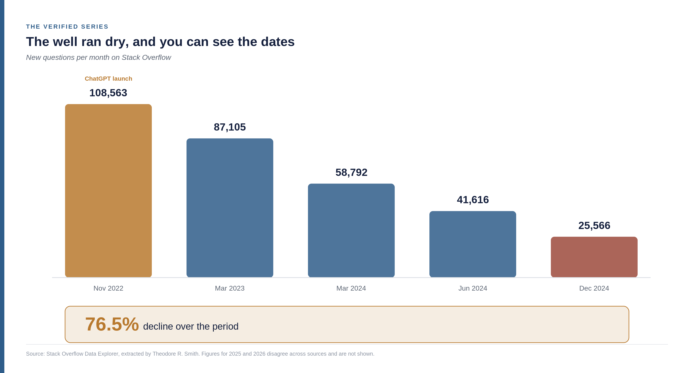
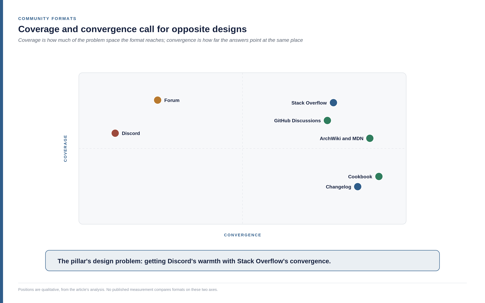
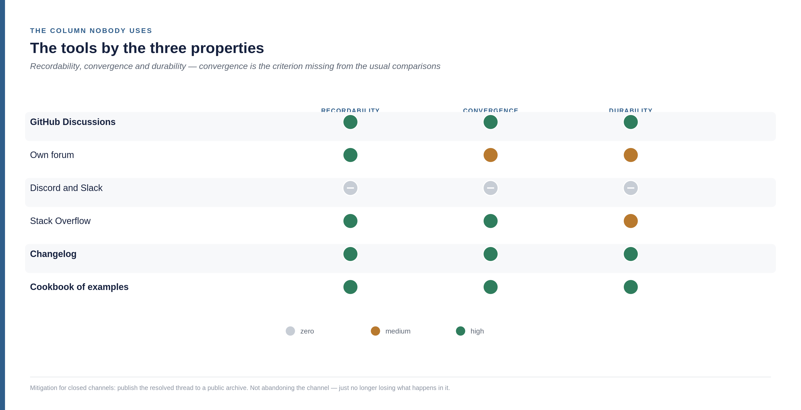
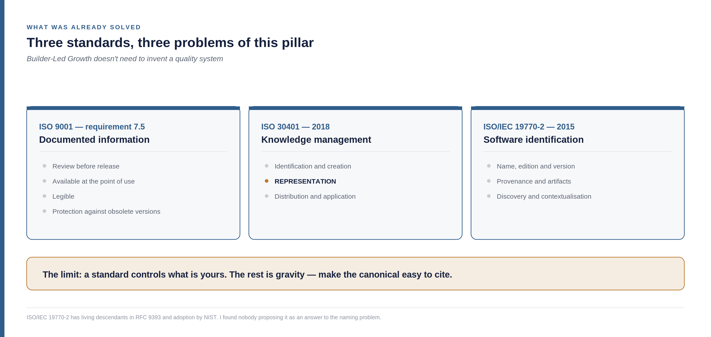
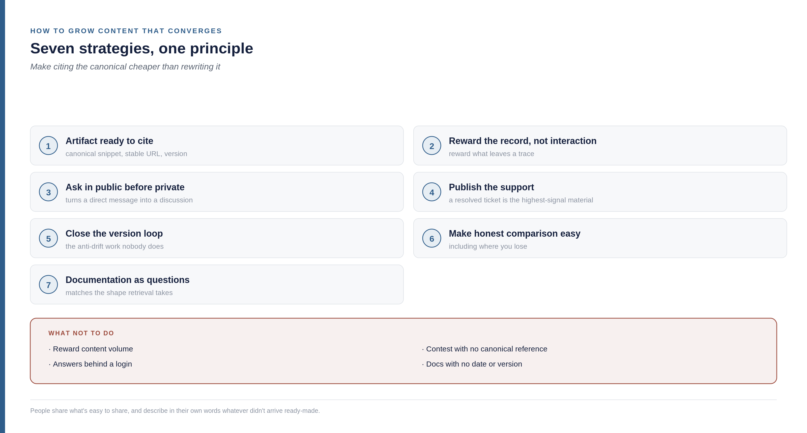

<!--
Part 05 of the Builder-Led Growth series, by Matheus Ramos.
CANONICAL VERSION (English).
Portuguese counterpart: ../pt-br/05-comunidade-e-sinal-de-validacao.md
Text frozen. Scheduled for LinkedIn on 12 August 2026.
Generated from the private working repository. Do not edit here.
-->

# Builder-Led Growth, part 5: the well everyone drinks from

*Fifth part of the Builder-Led Growth series. [Part 1](https://www.linkedin.com/pulse/builder-led-growth-when-machine-also-your-customer-matheus-inudf/) named the discipline and proposed four pillars. [Part 2](https://www.linkedin.com/pulse/builder-led-growth-part-2-decision-price-what-measure-matheus-0ahff/) opened up the decision mechanism and the role of pricing. Part 3 covered machine legibility and part 4, operational accessibility. This one is about the third pillar — and it's the only one that isn't yours.*

## The four pillars, on one page

**Machine legibility.** The machine can read, understand and use your product without ambiguity. That was part 3.

**Operational accessibility.** The machine can get started without a human having to step in halfway through. That was part 4.

**Community and validation signal.** There is third-party material that future recommendations will feed on. That's this article.

**Model trust and safety.** The machine, and the human behind it, accept using it without reviewing every step.

Since part 2 this series has been saying that community isn't quite one of the four pillars — that it's what **produces the raw material** for the other three. It was an uncomfortable hedge, because it said what community isn't without saying what it is. This article settles that, and the answer changes what you should do.

## It isn't a pillar. It's the water table.

A pillar is yours. You size it, you build it, and it stands on your land.

Community doesn't work that way, and the image that describes it best is groundwater. You don't manufacture it: you drill, you pump, you use. An aquifer has four properties that describe this pillar with uncomfortable precision.

**It produces the raw material everything else consumes.** The water isn't the crop. It's what the crop drinks.

**It's shared with the neighbours.** A water table doesn't respect property lines. Third-party content about your category feeds the model that will also answer about your competitor. You can't pump only your own water.

**It's exhaustible, and it recharges on a timescale that isn't yours.** Whoever over-pumps lowers the level for everyone, themselves included.

**And alone it holds nothing up.** An aquifer nobody draws from is just water: it hydrates no one, irrigates nothing, becomes no harvest. It stays matter, and matter isn't a result.

One caveat before going on, because the metaphor carries a built-in bias: I'm using water from the point of view of whoever uses it. Anyone who looks at an aquifer thinking about preservation will rightly say that untouched water has value in itself. Here the analogy serves to describe product growth, and so it deliberately adopts the perspective of use.

The third property is the one that arrived last and changed the whole article, because it stopped being metaphor and became a literal description of the past three years.

## The well ran dry, and you can see the dates

Stack Overflow was, for over a decade, the largest well of raw material software ever had. Before the numbers, a word about where they come from — because this is a subject with a lot of loose figures in circulation.

The primary series is from the Stack Overflow Data Explorer, extracted and published as a spreadsheet by Theodore R. Smith, and it's the same one cited by [Gergely Orosz](https://blog.pragmaticengineer.com/stack-overflow-is-almost-dead/), by [Eric Holscher](https://www.ericholscher.com/blog/2025/jan/21/stack-overflows-decline/) and by [Drew Breunig](https://www.dbreunig.com/2025/05/16/stackoverflow-s-decline.html). There's a layer of aggregators repeating this data with magnitudes that don't agree with each other; nothing here comes from them.

In the month ChatGPT launched, November 2022, Stack Overflow received **108,563 questions**. In March 2023, 87,105. In March 2024, 58,792 — down 32.5% against the same month a year earlier. In June 2024, 41,616 against 63,752 in June 2023. And in **December 2024, 25,566** against 42,716 in the same month a year earlier, down 40.2%.

From ChatGPT's launch to December 2024, the drop is **76.5%**. The historical peak, according to the secondary sources, was around 200,000 questions a month in 2014.

The decline continued through 2025 and 2026, and here I have to be honest about what I don't know. The figures circulating for that period — a few thousand questions a month, and some citing a few hundred — don't agree with each other or with the series I verified. One of them, attributed to the same Data Explorer, implies a December 2024 base that is two thirds of what the series shows, which suggests different query definitions. And I found at least one monthly figure that is almost certainly from an incomplete month, collected while the month was still running.

So I'll stay with what holds up: the drop is three quarters between the end of 2022 and the end of 2024, it continued after that, and the exact magnitude in 2025 and 2026 depends on which definition of "question" the query used.

And there are two causes in the sources, which don't exclude each other. One is routine questions moving to assistants, from the end of 2022. The other came earlier: volume had been falling since 2017, after the 2014 peak, and the sources attribute part of that to tighter moderation — questions closed faster and in greater numbers. Hold on to that second cause. It comes back later, and not in the way it looks.

## The well doesn't dry evenly, and that inverts the intuition

Breunig asked a question I wouldn't have thought to ask: is the decline uniform across languages?

It isn't. Comparing 2023 with 2024, the C family — C, C++, C# and, by cultural proximity, Rust — fell between 35% and 40%. The dominant scripting languages, JavaScript, Python and Ruby, fell by about half.

His explanation is direct: assistants get popular languages right more often, because they're a larger share of the training corpus and get more attention during reinforcement learning. Someone writing Python asks the forum less because the model already answers well.

From here on it's my reading, and it's uncomfortable. If the drop is larger where the model is already good, then **the well dries fastest exactly where it drank most**. Getting the answer right destroys the source of the answer.

For anyone building product, that inverts an intuition that looks obvious. Being in a popular ecosystem looks like protection — more people, more content, more chance the model knows you. But that's precisely the ecosystem where the new public trace is drying fastest. What sustains your presence there is archive, not flow. And archives age.

## Where the community went

The next question is better than the previous one: if people stopped asking in one place, where did they start asking?

The answer is that the raw material didn't disappear — it split into two destinations with opposite properties.

The first is public and glued to the code. **GitHub Discussions** became the channel for library- and framework-specific questions, with answers frequently from the maintainers themselves. Something around 40 million monthly active users are reported for 2025, up 340% on 2022 — and the structural advantage is that the answer sits next to the code, the issues and the changelog it references. Worth the caveat: those figures come from statistics compilations, not from a primary GitHub report.

The second is closed. Discord and Slack took real-time conversation, with large communities per technology. Breunig himself records this, and acknowledges the cost in plain words: the opacity of those channels to search engines and links is frustrating, even though the level of support is better than it used to be.

It's the most important observation in this article, and it comes from a practitioner with no connection to this thesis. **The community didn't die. It moved to places that leave no public trace.** Under Builder-Led Growth, that's the difference between producing raw material and producing nothing.

And there's a fragility to declare alongside the good news: GitHub itself identifies a growing distance between the people who open pull requests and the people who actually maintain the code, with maintainers under pressure from repeated questions and duplicate issues. The channel producing the best raw material today is sustained by a small number of people.

## The uncomfortable part: the duplicate was deduplication

Now go back to the second cause of the decline, the one that predates AI.

Stack Overflow's most criticised practice was closing questions as duplicates. Anyone who tried to ask there knows the feeling, and it wasn't good: you arrive with a problem, and the problem gets closed pointing at another question that may not quite be yours.

In machine terms, that practice has another name. It's **corpus deduplication**. One question, one accepted answer, one canonical place per subject. It forces convergence and reduces dispersion — and that's why that archive became the highest-quality raw material software ever had.

Both things were true at once. The same rule the human community experienced as hostile was the one producing the record the models fed on. I'm not saying the community was wrong to find it harsh, nor that the platform was right to apply it that way. I'm saying the cost and the benefit sat in different ledgers, and nobody was adding them up.

And when the conversation moved to Discord, both ledgers flipped at the same time: the human experience improved and the quality of the record collapsed.

That explains why this pillar is hard, and why it isn't a matter of effort. There is no "do community better" that solves both sides. Until now, answer latency and record convergence called for opposite designs.

This pillar's design problem fits in one line: **how to get Discord's warmth with Stack Overflow's convergence.**

## It isn't the mean. It's the dispersion.

Before proposing a solution, I need to correct something I had been formulating wrongly myself.

I had been saying that community content without a canonical source "amplifies the mean" of what gets said about the product. The mean is the wrong quantity, and the correction came from a simple observation: a mean of 5 from 9 and 1 is one thing; a similar mean from 9, 10, 1, 1, 2 and 3 is something else entirely.

The model doesn't return the mean of the corpus. It samples from a distribution. Two archives with the same mean can have completely different spread and shape, and it's the shape that decides behaviour. An archive where half the material says A and half says B produces an answer that's sometimes A and sometimes B — and that's worse than a uniformly mediocre archive, because mediocre is at least **predictable**.

Under Builder-Led Growth, predictability is worth more than average quality. Being right 60% of the time and wrong 40% in varied ways produces silent failure, of the kind part 4 described: the agent tries, it doesn't work, it moves on to something else and nobody finds out. Always being slightly suboptimal in the same way produces a problem someone can see and report.

And the noise doesn't grow in a straight line. An API call has several independent aspects: method name, parameter names and order, authentication style, return format. If the corpus holds `v` documented variants of each aspect and the call has `k` aspects, the number of possible combinations is `v` to the power of `k`. Only one is correct.

With two variants and three aspects: eight possible combinations. With four variants and three aspects: sixty-four. **Doubling the variants multiplied the error space by eight.** That's combinatorial growth, and it's why the intuition that "more content is always better" fails here.

The hybrid isn't hypothetical. Breunig records a session where he asked a model for a spatial join in DuckDB: it first invented the function; given the documentation, it got the function right and the parameters wrong; on the third try it returned the query with the function commented out for being too difficult. Right piece from one variant, wrong piece from another.

If that sounds strange for a machine, it's worth remembering it's been happening to people for a long time, and it has a name. The Mandela effect — coined in 2010, after the widespread memory that Nelson Mandela had died in prison in the 1980s — describes exactly this: a lot of people confidently holding a version that never existed. The example most readers will recognise is Darth Vader's line, which collective memory recorded as "Luke, I am your father" and which in the film is *"No, I am your father"*.

Cognitive psychology describes three mechanisms for it, and they're the same ones this article has been describing. **Recombination**: a person assembles fragments of different memories into a convincing, incorrect recollection — which is the hybrid from the paragraph above. **Schema filling**: the mind completes the gap with what should have been there rather than what was; the model completes with the most probable continuation rather than the true one. And **memory conformity**: seeing many people repeat the same wrong detail alters your own recollection, which is reinforcement by volume.

Which produces a diagnostic question that's cheap to ask and uncomfortable to answer: **what does everyone "know" about your product that was never true?**

And it produces the formulation that organises the rest of this article: **this pillar's job isn't to raise the average quality of what's said about you. It's to reduce the dispersion.** A living canonical source doesn't improve the mean — it collapses the distribution around one mode.

## The erosion of the canonical

What follows has a practical consequence that runs against the instinct of anyone who works in growth.

Forums, third-party comparisons, tutorials, blog posts — all of it spreads the product and, at the same time, erodes the canonical knowledge about it. Each piece is a new formulation. Each old version still online is a permanent variant. With no place to check against, what comes up from the well is the mixture.

But the conclusion isn't to publish less, and that distinction matters. **Distribution is a multiplier, not a direction.** It amplifies the ratio of canonical to variant that you already have. With a strong, current canonical source, distributing amplifies what's right. With a weak or stale one, it amplifies the drift.

Two consequences follow.

The first reorders the series: **machine legibility — the first pillar, the one where a machine can read and understand your product without ambiguity — is a prerequisite for the third.** Before investing in a community programme, there has to be a single, current, machine-readable place saying how the product works — and the community needs a reason to point at it rather than rewrite it. Volume after that is a multiplier. Volume before it is noise with a cost.

The second is about who wins. The intuitive reading is that whoever has more resources wins: more people writing, more sponsored comparisons, more content. This series' own cases say otherwise. shadcn/ui went from a personal project to the default across five independent vendors' tools, with no direct funding and no sales spend. Supabase is cited because agents pick it on their own.

The mechanism explains why. A large organisation producing inconsistent material about its own product, at scale, is increasing its own dispersion — drilling deeper and clouding the water it will drink itself. A bigger budget with worse canonical discipline produces faster drift, not advantage. Fair warning that this is my reasoning, consistent with the cases but without direct measurement. I come back to it at the end, because it's a good candidate for knocking down everything this article argues.

## The concept: community of record

The series had been saying community produces raw material without defining what counts as community here. With no definition, the guidance becomes "do community", which guides nothing.

The definition I propose:

> Community, under Builder-Led Growth, is the system that converts human relationship into a **public, convergent and durable record** about the product.

Three words carry it. **Public** — it exists outside the login. **Convergent** — the answers point at the same place. **Durable** — dated, versioned, with the obsolete retired or marked.

The name I propose is **community of record**, borrowed from *system of record*, the term enterprise software has used for decades for the system holding the authoritative version of a piece of data. The borrowing is the argument: under BLG, community **is** the product's system of record as far as the machine is concerned. Treating it as an engagement programme is using the wrong tool for the problem.

And three properties come out of it that can actually be measured, which is rare in this subject:

**Recordability** — the share of interactions that leave a public artifact. A Discord with ten thousand people and no public archive has zero recordability.

**Convergence** — the dispersion across answers to the same question. It's the quantity the previous section identified as the one that matters.

**Durability** — the record is dated, versioned, and obsolete content is retired or marked. Without that, every old version becomes a permanent variant.

## A detail that shifts the target: whoever writes about you isn't only people

Before moving to practice, there's a change under way worth marking, even though I'll develop it in another piece.

There are thousands of posts, videos and tutorials today teaching people how to use coding assistants. And it's reasonable to assume a good share of that material was written by the assistants themselves — someone asks the agent to write the tutorial about how to use the agent. If each of those is a new formulation, the dispersion problem stops having human scale.

There's evidence of the direction, even if the total-volume figures are shaky. Estimates that most new web content is already machine-generated circulate widely and come almost entirely from commercial compilations — I use none of them here as a measurement. But there's a contrast in those same sources that's worth more than the totals: while most of the published volume would be automatic, the share of what actually ranks in search and comes from a machine is small. **Volume isn't visibility** — the same lesson as dispersion, from another angle.

What is solid is the behaviour on the repository side. `AGENTS.md`, a markdown file telling an agent how to work inside a project, is in more than 60,000 repositories, is read by more than thirty different agents, and moved under the Linux Foundation in December 2025. The pattern repeated with others: a repository collecting `DESIGN.md` files extracted from 59 sites appeared on 31 March 2026 and, within ten days, had 35,000 stars — faster growth than any comparable collection in GitHub's history. Markdown became the protocol layer between humans and agents, and the code repository became a store for things that aren't code.

This doesn't break the community-of-record definition. It reinforces the part that was already in it: **what matters is the record, not who produced it.** A machine-generated tutorial is third-party content for every corpus purpose — it will be read, indexed and cited like any other.

What changes is the target of the intervention, and that's the point I intend to develop. If whoever writes the material about your product is, increasingly, an agent reading your repository, there's a lever that didn't exist before: **you teach the machine that teaches the human.** A correct `AGENTS.md` and versioned canonical examples don't only make execution work — they make the tutorial someone is about to publish about you come out right. You don't control the author. You feed the source they drink from.

## The forum, which is the format that shows up when nobody decides anything

It's worth stopping at the forum before talking about tooling, because it's the shape technical conversation takes by default. Nobody designs a forum: it appears. And so it ends up deciding many companies' community — and with it, the raw material the machine will find — without anybody having decided anything.

What a forum does well is what no other format does. It produces natural language around real problems — the phrase a person uses when they're stuck, not the one a technical writer would use. And it covers the problem space, not just the product space: half the threads aren't about your tool, they're about the difficulty that led someone to it. That feeds candidacy, because it's how a model learns your product has anything to do with that difficulty.

What it does badly is everything this article has been describing. Each thread is a new formulation of the same subject — the highest dispersion of any format. And it ages without warning: the correct answer from 2023 is still online in 2026, looking exactly as correct.

**A forum is the format with the best coverage and the worst convergence.** On its own it produces precisely the multimodal archive described above: many plausible answers, none authoritative.

Five practices change that, and none of them requires switching tools:

Mark the canonical answer visibly **in the artifact**, not just in the database — whoever scrapes the page needs to see the marking. Adopt a one-page-per-subject norm instead of one thread per occurrence. Date and version each answer, retiring the obsolete explicitly. Link back to the canonical document instead of rewriting the answer there. And ask for review from someone whose incentives differ from yours before marking anything as settled — I come back to that one, because it has a mechanism of its own.

A forum is neither good nor bad for this pillar. It's the format that depends most on governance. With those five practices it becomes the best asset available. Without them, it becomes the largest source of drift a company has — and the hardest to notice, because it looks like a healthy community.

## The tools, judged by the column nobody uses

Almost every comparison of community tooling looks at engagement, retention and ease of moderation. The missing column is convergence.

| Tool | Recordability | Convergence | Durability |
|---|---|---|---|
| **GitHub Discussions** | high | high — marked answer, next to the code | high — versioned with the repository |
| Own forum | high | medium — there's a solved marker, but the canonical sits far from the code | medium — depends on active curation |
| Discord and Slack | zero by default | zero | zero |
| Stack Overflow | high | high | the old archive keeps teaching |
| Changelog and release notes | high | high | the highest of all |
| Cookbook of examples | high | the highest of all | high |

Two rows in that table deserve attention because they usually stay out of the community conversation.

**The changelog** solves durability better than any forum, and almost nobody treats it as a community asset. It's dated by nature, short, canonical and written in chronological order — which is exactly what a forum archive lacks. A well-kept changelog is the cheapest mechanism there is for retiring old information without deleting anything.

**The cookbook of canonical examples** is the most direct convergence mechanism that exists, and the reason is almost silly: **whoever copies doesn't invent a variant.** A repository of examples that work, kept current, turns every person who uses it into a replicator of the same formulation. It's the exact opposite of what happens when someone has to figure it out alone and then writes it up their own way.

On Discord and Slack, the highest-return mitigation for anyone who already has a large community in a closed channel is simple and off-the-shelf: publish the resolved thread to a public archive. It isn't abandoning the channel — it's stopping the loss of what happens in it.

## Who already does this, and the mechanism they share

Two technical communities solved this problem before it existed in its current form, and it's worth looking at how.

The **ArchWiki** is the documentation for Arch Linux, the distribution created by Judd Vinet — a Canadian programmer who started building it in early 2001 and released version 0.1 on 11 March 2002. The wiki came later: it was installed on 8 July 2005, and since then more than 20,000 people have created accounts and made close to 400,000 edits, turning a blank page into one of the most cited technical references in the Linux world.

The figure that matters here is about governance, not volume: most edits come from contributors outside the maintenance team, and there's a norm that every page be updated to reflect the version of the package being distributed. It brings the three properties together — it's public, it has one page per subject, and updating by version is a declared obligation, not good intentions. The Arch project has even shared its wiki strategy with Debian, which suggests the model transfers.

**MDN Web Docs** is the most explicit case, and it began as a rescue. In February 2005 a small Mozilla team took DevEdge — Netscape's developer material, whose licence the Mozilla Foundation obtained from AOL — and decided to turn it into an open, free resource built by the community. The original wiki went live on 23 July 2005.

The declared thesis was that developers shouldn't have to chase documentation scattered across standards bodies, browser vendors and third parties: there should be a single, canonical source, community-maintained and backed by the major vendors. Twelve years later, in 2017, competing vendors formally joined the project — which turned the thesis into an institutional arrangement. Convergence as a design decision, not a side effect.

The mechanism they share is what matters, and it answers the dilemma this article raised. **It isn't punitive moderation. It's a one-page norm plus an obligation to update.** Convergence by architecture, not by closing duplicates.

That's the way out of "how to get Discord's warmth with Stack Overflow's convergence": you don't need to close anyone's question if there's an obvious place where the answer lives and everybody knows which one it is.

An honest caveat: I found no measurement comparing how much each of these sources is cited by models. The claims that high-authority documentation gets cited more come, almost all of them, from commercial AI-optimisation material. I treat them as an indication, not a measurement.

## The standards that had already solved parts of this

Here a confession about the path: I started looking for what quality management had to offer and found more than expected — including a standard that has solved, since 2015, a problem this series raised without knowing a standard existed.

**ISO 9001**, in requirement 7.5, deals with what it calls documented information. The mapping to this pillar is almost term for term:

| What the standard requires | The equivalent here |
|---|---|
| Review before release | Reduce dispersion at the source |
| Available at the point of use | Put the artifact on the path the agent already walks, which is the formulation of machine legibility |
| Legible | Machine legibility, which was the subject of part 3 |
| Protection against use of obsolete versions | Closing the version loop |

That last item has been an auditable requirement since the 2008 edition. While the conversation about content for AI discovers that stale material gets in the way, quality management had been requiring a procedure against it for nearly two decades.

**ISO 30401**, from 2018, is a management system standard for knowledge management, and it's the most fitting of any I found for this pillar. It deals with identifying, creating, analysing, **representing**, distributing and applying knowledge. A community of record is, in its language, a knowledge management system whose audience has come to include the machine — and representation and distribution are exactly the two steps where Builder-Led Growth changes the requirement.

The difference the new discipline introduces is one of boundary. The standard assumes internal knowledge, with people as the audience. Here the knowledge that decides growth is public, produced partly by third parties, and read by a machine.

And the one that surprised me: **ISO/IEC 19770-2** defines a software identification tag — structured metadata, delivered with the product, carrying name, edition, version, the organisations involved in production and distribution, artifacts and relationships between products. Created to solve the difficulty of **discovering, identifying and contextualising** software. It has living descendants in RFC 9393 and adoption by NIST.

Hold what part 3 described about identity ambiguity — the model can't resolve what a name refers to — and what part 4 pointed out about the nearly 7,900 repeated tool names across MCP servers, without pointing at a standardised fix. **A standard for machine-readable software identity has existed since 2015**, and I found nobody in the agent debate who has mentioned it.

Why has software identification, solved for asset management, never been reused for product identification in front of agents? I don't know. I suspect it's distance between technical communities that don't read each other, but that's a guess. If anyone knows the answer, it's the kind of thing I'd like to hear — and it's where I'd start looking if I were solving the naming problem today.

The argument those three allow is comfortable and uncomfortable at once: **Builder-Led Growth doesn't need to invent a quality system.** Documented information control, knowledge management and machine-readable identification already exist, written, reviewed and auditable. What's missing isn't a standard. It's noticing that the documents deciding growth now sit outside the organisation.

And here's the limit, which needs saying so the argument doesn't turn into certification marketing. ISO 9001 applies document control to what the organisation controls. Somebody else's forum post doesn't enter document control — it isn't yours. What you can do is the shift: make the canonical document so easy to cite that community content becomes a **pointer** instead of a **copy**. Control over what's yours; gravity over what isn't.

A standard describes a requirement, it doesn't guarantee a result. No certification makes a model pick you.

## How to get people producing content that converges

Everything so far describes what should exist. What's missing is the hard part, which is getting it to exist without ordering anyone around — because a community doesn't take orders.

The principle organising the seven strategies below is the same: **people share what's easy to share, and describe in their own words whatever didn't arrive ready-made.** Each strategy makes citing the canonical cheaper than rewriting it.

**Give the artifact ready to be cited.** Canonical snippet, stable address, version tag. Whoever copies doesn't invent a variant. A poorly documented feature gets described twelve ways because each person had to work it out alone, and each discovery became a different write-up.

**Reward the record, not the interaction.** If your community programme rewards Discord activity, you get Discord activity. Reward the public write-up, the answered discussion, the comparison — the things that leave a trace. It's the metric change that changes behaviour, and it costs one meeting.

**Ask in public before answering in private.** A direct message with a technical question becomes an invitation to open the public discussion, and the answer goes there. It converts private into public without switching tools and without spending anything.

**Publish the support.** A resolved ticket is the highest-signal material a company produces, and almost all of it is locked away. Publishing resolved, anonymised tickets as a public base is the largest source of idle raw material most companies have — and the easiest to justify internally, because it reduces the volume of repeated tickets.

**Close the version loop.** Content rots, and rotten content doesn't disappear: it becomes a permanent variant. Finding and updating public material about old versions reduces dispersion directly. It's the anti-drift work nobody does, because it shows up in no engagement metric.

**Make honest comparison easy.** Third-party comparative content is what weighs most when a model cites someone. Publishing your own comparison, sourced and including where you lose, produces material third parties copy — and a comparison where the company admits a limit is the one with a chance of being reproduced, precisely because it doesn't read like a sales piece.

**Write the documentation as questions.** A question-shaped title matches the shape retrieval takes. It's cheap, and it reuses what fifteen years of forums already taught about how people describe a problem.

On the other side, four things not to do: rewarding content volume, which produces variants and variants are the damage; running a content contest with no canonical reference, which multiplies incompatible formulations; leaving answers behind a login, which zeroes out recordability; and publishing documentation without a date and a version, which turns an archive into a permanent variant.

## The mechanism the community itself can run

There's a convergence instrument that doesn't depend on you marking anything, and it's the most sophisticated one that exists: X's Community Notes.

The algorithm is a **bridging** one. A note only surfaces when it earns positive ratings from a diverse set of raters — people who usually disagree with each other on other notes. Technically it's matrix factorisation, with additional components against abuse, targeted manipulation and rating brigades. The requirement is subtle and elegant: the note needs positive ratings that **aren't predictable** from the prior leanings of whoever rates it.

The principle transfers directly to this pillar, and it reframes the honest-comparison strategy. The strongest convergence signal isn't "the vendor said so". It's "the vendor and people with different interests converged on this". A canonical answer endorsed only by maintainers is a weaker signal than the same answer also endorsed by independent users who disagree with each other about other things. And that's designable: you ask for review from someone whose incentives differ from yours before marking anything as settled.

The limit has to come along, because the research on the mechanism is honest about it. A study presented at the ACM Web Conference in 2026, "Consensus Stability of Community Notes on X", found that **30.2% of displayed notes later lose their helpful status and disappear** — and attributes that less to the quality of the note and more to strategically motivated rating after display. There is related work on coordinated manipulation in this kind of fact-checking and on the sustainability of the mechanism.

For anyone thinking about corpus, that instability matters in a specific way. A marking that appears and disappears produces variance **over time**, rather than across sources — and for an archive feeding a model, an unstable record is almost as bad as a divergent one. **Convergence without durability doesn't solve the problem.**

## Who answers for the machine's side

The organisational question is left, and it comes from somewhere that isn't the AI debate.

[Joca Torres](https://www.linkedin.com/in/jocatorres/) — author of four product books and former CPO at Gympass, Conta Azul and Locaweb — treats platforms as multi-sided products, and offers a distinction that settles this. In his framing, managing a product means understanding the value for one type of user; managing a platform means understanding the value for several types **and the relationship between them**. I came across that framing in the Product Management courses at PM3, and it's one of the origins of this series. His material has a concrete case: at Gympass, now Wellhub, there was one team per marketplace actor — gyms, corporate HR, and the people using it.

The equivalent question here is: who, in your company, answers for the machine's side?

And it's worth being precise about one thing before answering, because the analogy has a limit. Calling the model a "side of the platform" is imprecise. A side has objectives, negotiates, responds to incentives. The model does none of that — it reads and returns a mixture. It's closer to this article's water table than to a participant.

The organisational question still holds, and my answer is that it **shouldn't be a new team**. Whoever owns the machine's side should be whoever already owns the canonical source, because the two jobs are the same: keep an authoritative version and get the rest of the world to point at it.

What that shifts is the definition of the role. Developer relations stops being measured by events, presence and an active community, and starts being measured by the record.

## What to measure

Six things, and none of them has a ready-made tool — which is itself information about the state of the discipline.

**Public record rate**: of the interactions with your community, how many leave an artifact reachable without a login.

**Dispersion**: for your product's most common tasks, how many incompatible formulations exist publicly. It's this pillar's central metric and the most laborious — today you can only survey it by hand, or by putting an agent to work comparing the versions it finds. Which is, incidentally, a product waiting for someone to build it.

**Median age of public content** about your product. If the median is two years, half of what teaches the world about you was written before your current version.

**Ratio of third-party to first-party content**, because it's the third party that weighs in citation.

**Rate of answers marked canonical** in public discussions — how many end with a visible "this is it".

**Coverage**: how many of the most frequent questions have a marked public answer. It's the one that produces the most immediate work, because the list is usually short and the gap is usually obvious.

## What would make this pillar fall

Three conditions, and the first is the one that bothers me most.

**If dispersion predicts nothing.** Take two comparable technologies, measure how many incompatible formulations exist publicly for the most common tasks of each, then compare an agent's success rate at executing those tasks. If the technology with higher dispersion doesn't perform worse, the central argument of this article is wrong. It's an expensive test but a possible one, and it's the first I'd run.

**If resources settle it after all.** I've argued here that a bigger budget with worse canonical discipline produces faster drift rather than advantage, and I leaned on the series' cases — shadcn/ui and Supabase won without buying presence. If cases turn up where heavy investment in content volume produced better representation despite inconsistency, the formulation falls, and community becomes a question of scale like any other channel.

**If the raw material stops coming from public text.** This entire article assumes that what the community writes in public feeds what the machine knows. If models come to learn predominantly from other sources — usage telemetry, code execution, data licensed under contract — the pillar still exists and changes address. I wouldn't know where to.

And the question I can't answer, which strikes me as the most important in this article, stays open. If the model learned from the community, and the community is migrating into the model, **where does the raw material for the next generation come from?** GitHub Discussions is a partial and fragile answer, sustained by a few already overloaded maintainers. I don't know whether it's enough. If you have a better reading of that arithmetic, I want to hear it.

Part 6 takes up what Public Relations already knew about this in 1984 — and why the model the discipline considered the most ethical turned out to also be the most effective, for a reason nobody could have predicted.

---

**The Builder-Led Growth series**

- [Part 1 — When the machine is also your customer](https://www.linkedin.com/pulse/builder-led-growth-when-machine-also-your-customer-matheus-inudf/)
- [Part 2 — The decision, the price and what to measure](https://www.linkedin.com/pulse/builder-led-growth-part-2-decision-price-what-measure-matheus-0ahff/)
- Part 3 — The tax the machine charges and the human never sees: https://www.linkedin.com/pulse/builder-led-growth-part-3-tax-machine-charges-human-matheus-oc20f/
- Part 4 — How many times the agent has to call a human: [read](04-operational-accessibility.md)
- Part 5 — The well everyone drinks from (this piece)

The series continues. Each part goes deeper into something the previous one could only point at, and this block is updated as the next ones come out.
