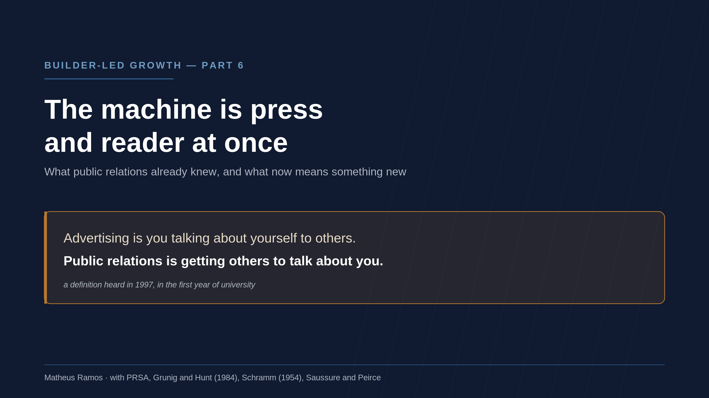
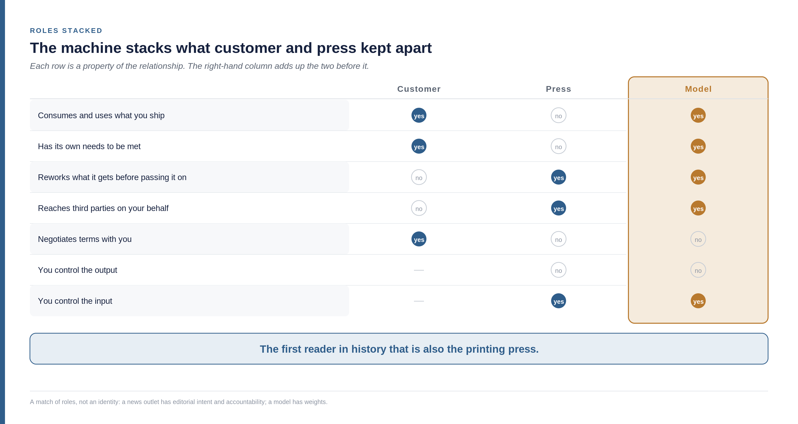
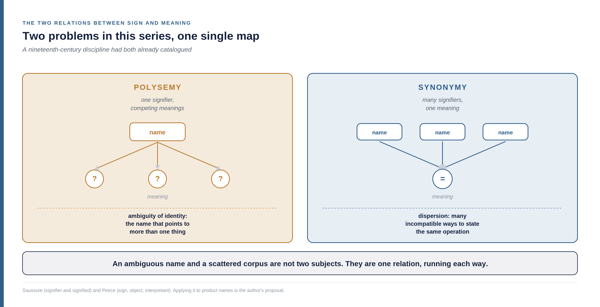
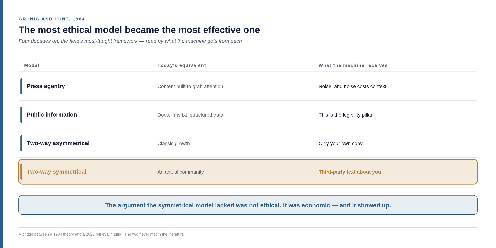

<!--
Part 06 of the Builder-Led Growth series, by Matheus Ramos.
CANONICAL VERSION (English).
Portuguese counterpart: ../pt-br/06-relacoes-publicas.md
Text frozen. Scheduled for LinkedIn on 14 August 2026.
Generated from the private working repository. Do not edit here.
-->

# Builder-Led Growth, part 6: the machine is press and reader at once

*Sixth part of the series on Builder-Led Growth. [Part 1](https://www.linkedin.com/pulse/builder-led-growth-when-machine-also-your-customer-matheus-inudf/) named the discipline and proposed four pillars. [Part 2](https://www.linkedin.com/pulse/builder-led-growth-part-2-decision-price-what-measure-matheus-0ahff/) opened up the decision mechanism and the role of price. Part 3 covered machine legibility, part 4 operational accessibility, and part 5 the community that feeds both. This one goes thirty years back, because some of what we are discovering already had a name.*

## The four pillars, in one page

**Machine legibility.** The machine can read, understand and use your product without ambiguity.

**Operational accessibility.** The machine can get started without a human having to step in halfway through.

**Community and validation signal.** There is third-party material that future recommendations will feed on.

**Model trust and safety.** The machine, and the human behind it, accept using it without reviewing every step.

This piece does not open a fifth pillar. It does something else: it takes a discipline that spent the twentieth century solving a problem very close to ours, and asks what still holds.

## An aunt, a Christmas party, and one sentence

I started university in 1997, at 17, in Communications — Public Relations, at the Federal University of Goiás, in Brazil.

Back then it was hard to explain to an aunt, at the Christmas party, what exactly a public relations professional does. Anyone studying medicine or civil engineering was spared that. The question always came with the tone of someone who wants to help and does not know how.

Someone, at some point in those first semesters, gave me the definition I still use:

> **Advertising is you talking about yourself to others. Public relations is getting others to talk about you.**

I kept it as a good corridor line. It did not occur to me, and could not have, that thirty years later it would be the most precise description I know of how a piece of software gets chosen.

Let me say something before going on, because it explains why this piece exists. I expected public relations to gain standing and visibility over time. That is not what happened. People still do not understand what it is, and the Christmas party conversation would go about the same today.

What I want from this article is to do the discipline justice and show what it is worth. It is a small contribution against the size of the field, and it is made with care.

### What public relations is, for anyone who never had to know

The definition the PRSA — the American professional association — has used since 2 March 2012 says that public relations is *a strategic communication process that builds mutually beneficial relationships between organizations and their publics*.

Three words in that sentence carry almost everything, and all three matter here.

**Process**, not campaign. It is not a one-off act of promotion; it is continuous practice. The PRSA explained the choice itself: *process* was preferred over *management function* because the second one evokes control and one-way communication.

**Mutually beneficial.** The relationship has to be worth it for both sides. If only one side gains, it is something else.

**Publics**, plural. There is no such thing as "the public". There are groups with distinct interests, and speaking to each one takes different things.

One detail of that definition is too good to skip: **it was crowd-sourced.** The PRSA opened submissions in 2012, received close to a thousand proposals, picked three finalists and put them to a public vote. The winner took 671 of 1,447 votes. A discipline that studies how organizations and publics adjust to each other defined itself in exactly that way — which, as we will see, is the model it considers the best of the ones it describes.

When I started in 1997, incidentally, the definition in force was still the one from 1982. It stayed in place for thirty years.

And about the difficulty of explaining it to an aunt: it was not mine alone. The Faculty of Information and Communication at UFG, where I graduated, keeps a page online titled exactly **"What public relations is and is not"** — and much of it is a list of what it is not. Not "sort of like journalism and advertising". Not international relations. Not an executive's escort, not a luxury receptionist. A discipline that has to define itself by elimination is telling you something about its own position.

## The 1997 sentence became a technical specification

In 1997, "getting others to talk about you" was a professional distinction. Almost a corridor joke to explain the difference between two degrees in the same faculty.

Part 1 of this series recorded a number that changes what that sentence is: **32.5% of citations in AI answers come from third-party comparative content, against under 5% from a product's own commercial pages.**

Getting others to talk about you came to be worth, in machine retrieval, more than six times what talking about yourself is worth.

I need to be exact about what that number is and is not. It measures citation behaviour — what the system brings back when someone asks. It does not measure training corpus composition, which is a different thing, measured differently. Conflating the two would turn a good number into a loose argument.

Even with the caveat, the shift is large. A distinction that organised two curricula became a distribution parameter.

## The machine is press and reader at once

Both roles are already established in this series, at different points.

Part 1 opened by saying the machine is also your customer: it consumes what you ship, has needs of its own to be met, and its experience with your product decides whether there is a second time. Part 5 showed the other side, in dealing with the public material that feeds recommendation — what the machine absorbs it redistributes, and that makes it a channel for what gets said about you.

What public relations adds here is not a third role. It is **which kind of channel** this is, because how you manage it depends on that.

Distribution channel management is a mature discipline, and it works with a known set of instruments: contract, margin, training, territory exclusivity, targets, co-op funds. A reseller or a distributor does rework your pitch — but within an agreement where both sides' incentives were aligned on purpose. You train, you pay, you measure.

**None of those instruments exists with the machine.** No contract, no margin to pass along, no target to negotiate, and nobody on the other side to align an incentive with.

That kind of channel is also already known, and the discipline that studies it is nearly a century old: **the press.** A newspaper takes what you say to an audience that is its own, not yours, rewrites it along the way, and decides alone what runs. No contract guarantees the story. What exists is well-prepared input and a relationship built over time.

That is the same condition as the machine, and so the instrument is the same: **you work the input, because the output is not yours.**

|  | Customer | Press | Model |
|---|---|---|---|
| Consumes and uses what you ship | yes | no | **yes** |
| Has its own needs to be met | yes | no | **yes** |
| Reworks what it gets before passing it on | no | yes | **yes** |
| Reaches third parties on your behalf | no | yes | **yes** |
| Negotiates terms with you | yes | no | no |
| You control the output | — | no | no |
| You control the input | — | yes | yes |

Read the right-hand column top to bottom. It stacks what the other two kept apart.

This has no comfortable precedent. In the history of communication, the reader and the vehicle were never the same entity: whoever read the newspaper did not print the next edition, and the press shop was not the audience. **The machine is the first reader that is also the printing press** — it uses your product to solve someone's problem and, in the same motion, teaches the next one how to use it.

From that comes the practical consequence, and it is the reason this article exists. Serving the machine as a customer and feeding it as a vehicle are different jobs, competing for the same budget and usually sitting at different desks in the company. Looking after the experience alone leaves the input to chance. Looking after the input alone produces excellent material about a product it stalls on at the first attempt. **Two jobs, and neither works on its own.**

And note the last row of the table, the one that offers hope: you do not control the output, but you control the input. That is exactly the condition press relations has always worked in, which is why there is a whole discipline about doing it well.

Worth the caveat: this is a match of roles, not an identity. A news outlet has editorial intent, people who decide, and accountability for what it publishes; a model has weights. What the table supports is more modest and more useful — **the shape of the relationship is the same, and for that shape there is already tested method.**

## The press release is the direct antecedent

With the vehicle role named, the next question answers itself: how do you properly feed an intermediary that rewrites what it receives?

By writing a document built to be reused.

That is what a press release always was. It is not an ad — it is structured raw material, verifiable facts up front, written in the format that makes life easy for whoever will transform it. Whoever writes a good release is not asking to be published verbatim. They are making it easy to be quoted correctly.

Swap "journalist" for "model" in that sentence and it still holds.

**The 2026 version of this goes by other names.** An `AGENTS.md` file at the root of a repository — the convention that tells a coding agent how to work in that project. An `llms.txt` — the file offering a model a clean, navigable version of what the site says. Documentation with blocks ready to be quoted. A versioned list of the claims you consider true about your own product.

All of them are the same object: **a communiqué written for an intermediary that will transform before redistributing.**

The format has been repurposed for a different end, long after it existed, and the case deserves credit. Amazon has used an internal method since 2005 in which a product starts from the press release — you write the release for a product that does not yet exist, and only then work backwards to what has to be built. The most detailed account of the method is in *Working Backwards*, by Colin Bryar and Bill Carr, two former executives; worth recording that it is an account by people who were there, not an institutional document.

What is interesting in that method is not the product technique. It is the assumption baked into it: **writing the communiqué first forces you to decide what the canonical version of your story is before building anything.** Part 5, in dealing with the public material that feeds recommendation, showed what happens when that canonical version does not exist: several incompatible formulations appear for the same thing, and the model learns them all. We call that dispersion, and it is the direct cost of never having decided which version is yours.

Same problem, solved thirty years apart by people who were not talking to each other.

## The five elements, and the message that was not for you

General communication theory organises any exchange into five elements: who **sends**, the **message**, the **medium** carrying it, who **receives**, and the **feedback** that travels from receiver back to sender.

The fifth element has a date and an author. Wilbur Schramm, in 1954, proposed a circular model in which communication does not end at reception: the receiver replies, the reply returns to the sender, and the sender corrects the next transmission. It was a direct response to the linear models dominant until then — the one by Claude Shannon and Warren Weaver, from 1948, described communication as a one-way line. Schramm argued something stronger: **communication without feedback is incomplete.**

The skeleton brings along a concept that names this series' central problem: **noise** — everything that degrades the message between transmission and reception. The dispersion part 5 measured, that count of how many incompatible formulations exist publicly for the same task, is noise under another name.

Here is what each element becomes under Builder-Led Growth:

| Element | Before | Now |
|---|---|---|
| Sender | the organization | the organization **and** everyone writing about it, machines included |
| Message | what you say | what survives the blending |
| Medium | a vehicle that carries and dissipates | a model that absorbs, blends, **retains** and returns |
| Receiver | a person | **the machine** — and the person behind it |
| Feedback | returns to the sender | goes to the human; the record stays with whoever runs the model |

Two rows in that table are worth stopping on.

**The first is the medium that retains.** In the classical scheme the medium carries and disappears — the newspaper goes in the bin, the radio signal dissipates. Not here. The model is the first channel that keeps everything that passed through it and returns it blended, months later, to someone you have never met. That groundwater image part 5 used — the aquifer shared with the neighbour, that everyone drinks from — is the same observation stated in the vocabulary of hydrology.

**The second is that medium and receiver became the same entity.** It is the accumulation of roles described above, now visible in the structure: the two middle rows of the table both point at the machine. And that is where the feedback problem comes from, because **Schramm's model assumes the receiver is distinct from the carrier.** When those two functions collapse into one thing, the receiver's reply has no route back — it is absorbed by the channel itself.

Now look at product management and count how many things are, at bottom, that feedback. User interviews. Support tickets. Churn analysis. Satisfaction surveys. Continuous discovery. All of them make the same movement — carrying the reply of whoever used it back to whoever built it.

**Feedback breaks in three distinct places, and separating them is worth doing, because each one hurts differently.**

**The first: what the agent thinks of your product never reaches you.** It tries, hits an obstacle, does not resolve it, and moves on to something else.

When part 4 dealt with the stops where an agent needs a human, it separated three possible endings: the person shows up and resolves it, the person shows up and gives up, or the agent works around it alone and never calls anyone. The third leaves no trace anywhere — no ticket, no abandoned signup, no complaint. **That silent exit is, seen through the communication skeleton, the first point where feedback is lost.**

**The second: what the user thinks of the result goes to the agent.** The person complains to whoever delivered the work, and the agent delivered it. She says "this did not work", the agent adjusts and tries another route, and the product that caused the failure never learns of it. The message existed and someone heard it. It just never reached anyone who could act on it.

**The third, and this is what changes the nature of the risk: the loop did not vanish, it closed somewhere else.** Whoever runs the model has a record of the whole session — what was tried, what failed, what needed a second attempt, where the person got annoyed. The feedback exists. It is being collected. And it is being collected by an organization that is not yours.

**Why this is a product risk, and not only a communication one.** A product that loses feedback does not stop being judged. The decision to recommend or not recommend keeps happening every day, fed by information you cannot see. And the interval between your quality dropping and your finding out stops being measured in support days: it becomes measured in how long it takes you to notice a curve falling without knowing why.

Worth saying what this is: reasoning, not measurement. I know of no study that has quantified that lag. The mechanism is direct enough for me to bet on it, and cheap enough for someone to falsify.

**What you can try. None of these four things actually closes the loop, and I would rather say so than sell a solution.**

**Build your own bench.** Run an agent against your product at a fixed interval, with real tasks, and measure what happens. It is the only feedback you control entirely. It measures your product, not your user — a serious limitation, and still more than nothing.

**Make the error carry a route back.** A structured error message with a reporting address the agent can show the human. It guarantees nothing, because showing it or not is the agent's decision. It is cheap, and the alternative is silence. I know of no product doing this today, which may mean it does not work or that nobody has tried.

**Ask where the person actually is.** If she sees the result inside her editor and not on your dashboard, the question has to happen there. How to do that without becoming an interruption is an open problem, and I have no answer.

**Instrument what still passes through you.** Calls, errors by type, abandonment on first attempt. It is poor feedback — you see behaviour without seeing intent — but it is what is left.

And there is a question I cannot answer. If the most useful information about how your product behaves sits with whoever runs the model, is there any arrangement where it comes back to the product in aggregate, without exposing anyone? I do not know whether anyone is building that, or whether they should. If you work on this problem, I would very much like to talk.

## Two old words for two problems in this series

Semiotics is the study of how signs produce meaning, and it names a correspondence that organises two problems in this series into one.

The two main traditions divide the sign differently. Ferdinand de Saussure works with a pair: the **signifier**, which is the form, and the **signified**, which is the concept evoked. Charles Sanders Peirce works with three: the sign, the **object** it refers to, and the **interpretant** — the effect the sign produces in whoever receives it.

Roman Jakobson picked out of Peirce an idea worth reading twice: **every sign translates into another sign.**

That sentence is a functional description of a language model. It receives signs and returns other signs, indefinitely. It is not a receiver that consumes the message and stops — it is a machine for producing interpretants in series, out of everything it absorbed.

Two classical relations between signs cover, one each way, the two failure modes this series described in different parts:

| Relation | What it is | Where the series described it |
|---|---|---|
| **Polysemy** | one signifier, competing meanings | the ambiguity of identity in part 3 — the name that points to more than one thing |
| **Synonymy** | many signifiers, one meaning | the dispersion in part 5 — many incompatible ways to state the same operation |

**An ambiguous name and a scattered corpus are not two subjects: they are the two fundamental relations between sign and meaning, one running each way.** A nineteenth-century discipline had both catalogued and named, and its map covers the whole terrain.

Peirce also offers a classification with a direct practical consequence. He separates signs into **icon** (resembles what it represents), **index** (has a causal link to what it represents) and **symbol** (arbitrary, working by learned convention).

A product name is a symbol. Nothing in the word points to what the tool does — it works because a convention exists, and conventions have to be learned by whoever receives them. The model learns its own by reading the corpus. **If the corpus carries two conventions, it learns both.** Which is, in vocabulary over a hundred years old, exactly the mechanism of dispersion.

A warning that this last reading is mine, and not an established interpretation of Peirce. I am taking a classification made for another purpose and applying it to a problem he could not have imagined.

One last piece of that vocabulary, and it closes the release argument. Communication depends on sender and receiver operating the same **code**. Publishing an `AGENTS.md` is, in those terms, making the code explicit instead of hoping the receiver infers it from the corpus. It is the same instinct as a competent press officer: **do not leave the intermediary guessing.**

## Niche, and why it became more true

"The riches are in the niches" is one of those phrases that has circulated in marketing so long that authorship got lost. Susan Friedmann published a book with that title; Pat Flynn is often credited with popularising it. I found no source establishing the origin with confidence, and I would rather say so than pick a name for convenience.

The idea, whoever it belongs to, predates all of this: segmenting and speaking precisely to a defined group pays better than speaking generically to everyone.

What changed is the mechanism by which it pays.

Part 5 showed that content volume without a canonical anchor amplifies dispersion rather than reducing it — noise grows combinatorially, because each aspect described in incompatible ways multiplies against the others. Two variants across three aspects already produce eight possible combinations, of which one is correct.

Niche is the direct defence against that. **A narrow scope has fewer aspects to describe, and fewer aspects means fewer possible wrong combinations.** The old phrase holds for a new reason: it is not about finding a less contested audience, it is about having less surface for noise to occupy.

That is reasoning derived from the dispersion finding, not direct measurement. Nobody, as far as I know, has measured dispersion against breadth of scope.

**And there is a new niche on the table, which is the subject of this whole series: the machine itself.**

It is a stakeholder, it is a customer, and it behaves as a niche in the strictest sense of the term — an audience with very specific needs that are nobody else's. The difference is that those needs conflict with much of what current growth strategy considers correct, especially the parts that depend on communication and marketing.

The friction shows up at four concrete points:

- Persuasive copy, which raises conversion with humans, enters as noise and occupies context that belonged to the argument
- Content volume, which widens human reach, amplifies dispersion when there is no canonical version
- Signup before first use, which qualifies a lead, is where the agent stops and sometimes does not come back
- Differentiation by positioning, which helps a human choose, hinders the machine when it turns into an ambiguous name

It is counter-intuitive, and only apparently paradoxical. The two lists of needs do not contradict each other at bottom: they compete for the same space, and what resolves it is deliberately choosing where each one rules, instead of assuming what serves one serves the other.

## The disciplines got confused, and this is not a complaint

Content creator. Influencer. Ambassador. Advocacy programme.

Four names for a practice public relations was already doing decades before any of them existed: **cultivating third parties who talk about you to an audience that is theirs, not yours.**

I want to be clear about tone here, because it is easy to slip. This is not a claim to territory, nor a complaint about lost credit. Discipline names change all the time, and almost always because the practice migrated to where the demand was. **What matters is not who got there first. It is that whoever has to solve these problems today is not starting from zero.**

Worth seeing the pairs side by side, because that way the reader checks them one by one instead of accepting the assertion:

| Public relations practice | Today's name |
|---|---|
| Brand ambassador | influencer, content creator |
| Press relations | developer relations, technical content |
| Trained spokesperson | technical person who represents the product in public |
| Relations with opinion formers | analyst relations, creator programmes |
| Monitoring and clipping | social listening — and now, measuring how the machine cites you |
| Press kit | brand kit, developer kit, `AGENTS.md` |
| Events and sponsorship | conferences, hackathons, open source sponsorship |
| Crisis management | incident communication, status page |
| Communication targeted by public | content segmented by persona |
| Earned mention, not bought | appearing in the comparison a third party wrote |
| Community relations | community management |

A match is not an identity, and overstating it here would spoil the argument. Scale, speed and the fact that the intermediary is now a machine change execution on almost every one of those lines. What the table supports is enough: **there is method tested over decades in adverse conditions, and it is available to anyone who thinks the problem is new.**

I should say that this table is organised reasoning, not a literature review. I built the pairs from what the practice teaches, not by checking each one against the field's scholarship.

## The most ethical model became the most effective one

In 1984, James Grunig and Todd Hunt published *Managing Public Relations* and proposed four models describing how organizations practise the discipline. Four decades on, it remains the field's most-taught framework.

| Model | How it works | Today's equivalent | What the machine receives |
|---|---|---|---|
| Press agentry | One-way, persuasive, seeking attention any way it can | Content built to grab attention | Noise — and noise has a context cost |
| Public information | One-way, accurate, seeking to inform | Documentation, `llms.txt`, structured data | This is the legibility pillar |
| Two-way asymmetrical | Researches the public in order to persuade better | Classic growth | Only your own copy, better calibrated |
| **Two-way symmetrical** | Research on both sides, and both can change | An actual community | **Third-party text about you** |

There is a description by Grunig and Hunt of the second model that sat still for decades waiting for this moment: they call its practitioners **"journalists in residence"** — professionals producing accurate information about their own organization, in the format of someone who knows another party will reuse it.

If you have ever written documentation thinking about how a model will read it, you are a journalist in residence. Only the vehicle changed.

Grunig and Hunt considered the symmetrical model the best of the four — more ethical, because it assumes the organization can also change position, not just the public. In the 1990s that idea unfolds into Excellence Theory.

**And here is the inversion.**

The most repeated criticism of the symmetrical model, across four decades, was not that it is wrong. It was that **it asks the organization to act against its own interest.**

Genuine dialogue costs time, staff and a willingness to change position in public. In return it delivers a better relationship — and nothing that shows up in the quarter's numbers. Whoever defended the model defended it on the ethical argument, because that was the only one available: there was no selfish reason to be symmetrical. An organization adopting it would be choosing to pay more out of conviction. Hence the charge that it was idealised, fit for the textbook and not for the budget meeting.

What changes under Builder-Led Growth is exactly that: the missing selfish reason shows up.

Symmetrical communication produces third-party artefacts — the public conversation, the comparison written by someone who used it, the forum answer someone marked as definitive. And third-party artefacts are, by the number that opened this article, what weighs most in machine retrieval.

**The argument the symmetrical model lacked was not ethical. It was economic. And it showed up.**

An organization practising symmetry today is not paying more out of conviction: it is producing the kind of material that weighs most when a machine decides what to recommend. The sum that never added up started adding up, and not because anyone convinced anyone of anything.

Worth saying where this comes from: it is a bridge between a 1984 theory and a 2026 retrieval finding, and the two never met in the literature. Treat it as a proposal, not a finding.

## Symmetry implemented as an algorithm

There is a working example of the symmetrical model as a mechanism rather than an intention.

Community Notes, on X, lets any participant propose a clarification on a post. The note only becomes publicly visible if it gets positive ratings from people who **historically disagree with each other** — the system uses rating history to identify who usually lands on opposite sides, and requires agreement between them.

It is the symmetrical model rendered as mathematics: no side alone can publish, and agreement between those who disagree becomes the criterion.

Worth recording a number showing the mechanism is alive and not perfect: **30.2% of notes that do get displayed later lose that status**, when subsequent ratings change the picture. The conclusion is non-final by construction, and that is a feature, not a defect.

For anyone building product, the interesting part is not copying the algorithm. It is the property it demonstrates: **you can design a mechanism where the validity signal emerges from agreement between parties that do not align** — and a signal with that origin cannot be manufactured with budget, because manufacturing it would require convincing two groups that habitually disagree, at the same time.

## What would bring all of this down

Three conditions, and the first takes down the whole article.

**If well-structured owned content comes to weigh as much as third-party content.** This entire text rests on the asymmetry between 32.5% and under 5%. If retrieval systems start treating an official company statement with the same weight as an independent comparison — an engineering decision someone could take tomorrow — the 1997 sentence goes back to being just a good sentence. I think that is unlikely, because the asymmetry exists precisely to resist manipulation, but it is a third party's decision and not a prediction of mine.

**If the press parallel does not survive use.** I argued that the vehicle role, stacked on the customer role, behaves like a press medium. If in practice press-relations technique produces no different result from direct marketing technique, the analogy is pretty and useless. That is testable by anyone with both sets of material and the patience to compare.

**If feedback starts closing on you again.** The section on feedback assumes information about how your product behaves sits with whoever runs the model. If standardised channels appear that return it to the product — and there are commercial reasons for someone to build exactly that — the risk I described shrinks considerably. I would be glad to be wrong on that one.

And here is the question I would open a conversation with, if we were at a table. I spent thirty years thinking that sentence from university was a good professional definition. It became a system parameter. **How many other things we learned as distinctions of craft are actually descriptions of a mechanism, waiting for the mechanism to show up?** I have a hunch about where to start looking, but I would rather hear yours.

## Closing by going back to the beginning

The world changes, and societies, cultures and organizations change with it. I understand why certain concepts fall out of circulation: the context that justified them passed, and carrying everything ever thought would be impossible. Letting go is not always carelessness.

But not every abandonment is time's doing. Some models stop circulating not because they failed, but because they stayed confined to one sphere of the organization and never reached the others.

The clearest case I found in this series came up in part 5, when I went looking for technical standards dealing with the public material about a product. **ISO/IEC 19770-2** has defined a software identification tag since 2015: structured metadata, delivered with the product, carrying name, edition, version, who produced it and who distributed it. It was created to solve the difficulty of **discovering, identifying and contextualising** software — which is, almost word for word, the ambiguous-name problem agents run into. It has living descent in RFC 9393 and adoption by NIST, and I found nobody in the agent debate who has mentioned it.

The standard is neither wrong nor obsolete. It lives at the IT asset management desk, and the problem showed up at the product desk. Two rooms in the same building that do not read each other.

Public relations is the same case at a different address. It did not age out: it stayed at a desk that growth conversations stopped visiting.

If we look back with some patience, we will find answers already written to questions we are asking as though they were new. What I wanted from this text was to recover a piece of that memory — which, in my case, is also a memory I am fond of — and put public relations, semiotics and general communication theory back into the middle of the growth conversation, rather than the footnote.

It is a small contribution against the size of those disciplines. It is also everything I had to give, and all of it is here.

Part 7 takes on the fourth pillar — model trust and safety. It is the only one still unopened, and the one where the decision to recommend depends less on what you wrote and more on what you did not do.

---

**Builder-Led Growth series**

- [Part 1 — When the machine is also your customer](https://www.linkedin.com/pulse/builder-led-growth-when-machine-also-your-customer-matheus-inudf/)
- [Part 2 — The decision, the price and what to measure](https://www.linkedin.com/pulse/builder-led-growth-part-2-decision-price-what-measure-matheus-0ahff/)
- Part 3 — The tax the machine charges and the human never sees: https://www.linkedin.com/pulse/builder-led-growth-part-3-tax-machine-charges-human-matheus-oc20f/
- Part 4 — How many times the agent has to call a human: https://www.linkedin.com/pulse/builder-led-growth-part-4-how-many-times-agent-has-matheus-nmixf/
- Part 5 — The well everyone drinks from: [read](05-community-and-validation-signal.md)
- Part 6 — The machine is press and reader at once (this piece)

The series continues. Each part goes deeper into something the previous one could only point at, and this block is updated as the next ones come out.

---

**Sources and credits**

- Definition of public relations and the 2012 selection process: [PRSA](https://www.prsa.org/about/all-about-pr) and [PRSAY, 1 March 2012](https://prsay.prsa.org/2012/03/01/new-definition-of-public-relations/)
- "What public relations is and is not": [Faculty of Information and Communication, UFG](https://rp.fic.ufg.br/p/28755-o-que-e-e-o-que-nao-e-relacoes-publicas)
- The four models: James Grunig and Todd Hunt, *Managing Public Relations*, 1984. Description consulted at [Ohio State — Writing for Strategic Communication Industries](https://ohiostate.pressbooks.pub/stratcommwriting/chapter/four-models-of-public-relations/)
- Circular model and the role of feedback: Wilbur Schramm, 1954. Reference consulted at [Wikipedia — Schramm's model of communication](https://en.wikipedia.org/wiki/Schramm%27s_model_of_communication). The earlier linear model is Claude Shannon and Warren Weaver's, 1948
- Saussure, Peirce and Jakobson's reading: [Saussure and Peirce: two complementary concepts of the sign](https://www.academia.edu/40836098/SAUSSURE_E_PEIRCE_DOIS_CONCEITOS_DE_SIGNO_COMPLEMENTARES) and [Semiology/semiotics in Saussure and Jakobson](https://periodicos.ufrn.br/gelne/article/download/13589/9217/)
- The write-the-release-first method: Colin Bryar and Bill Carr, *Working Backwards*, 2021 — an account by former executives, not an institutional document. Method described at [workingbackwards.com](https://workingbackwards.com/concepts/working-backwards-pr-faq-process/)
- Community Notes: mechanism and the 30.2% figure detailed in part 5 of this series
- The 32.5% against under 5% figure: source credited in part 1 of this series
