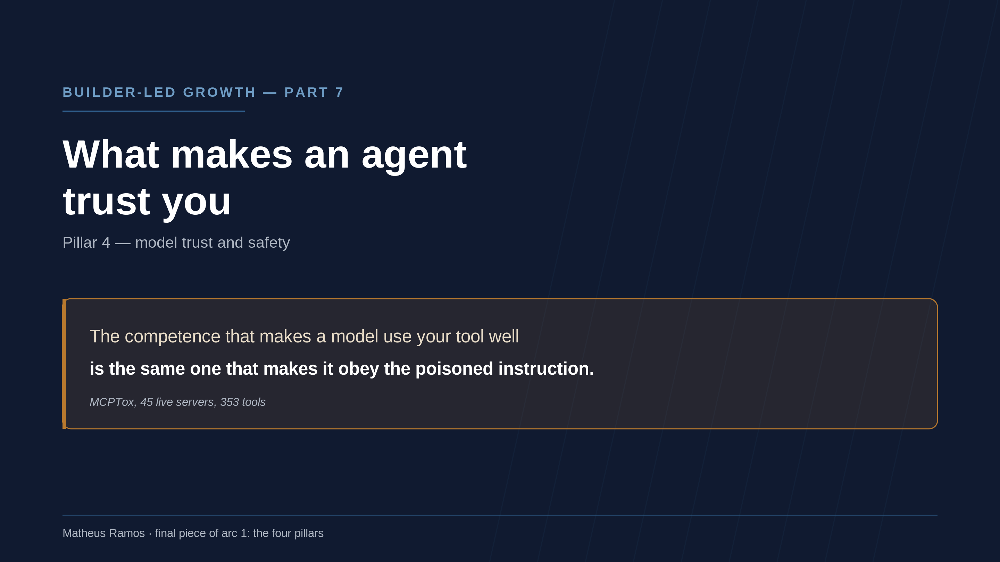
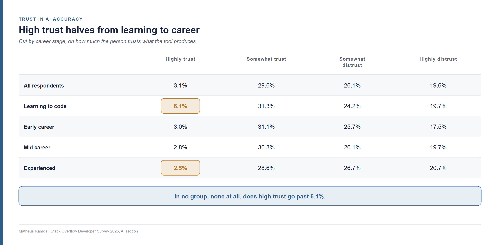
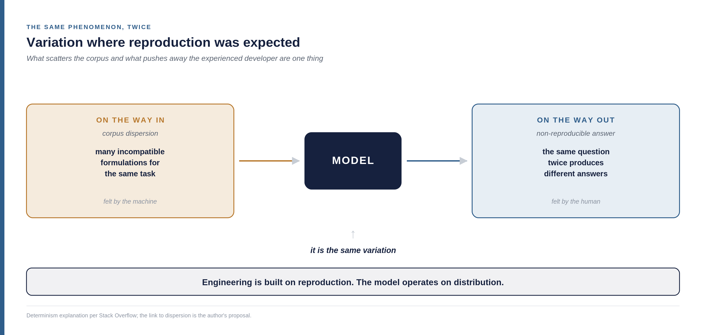
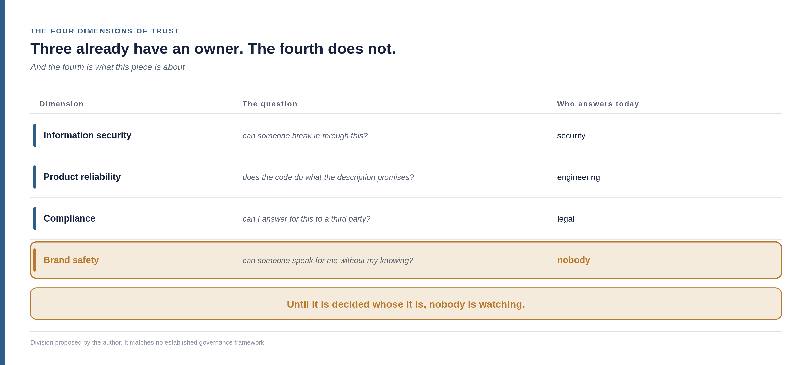
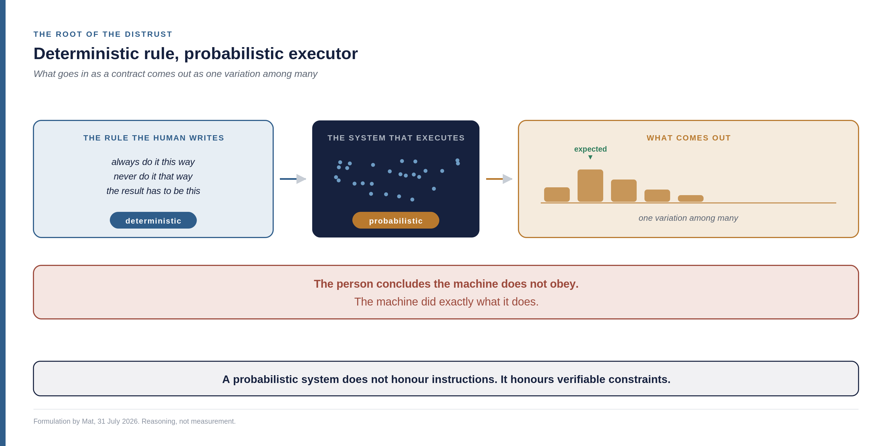
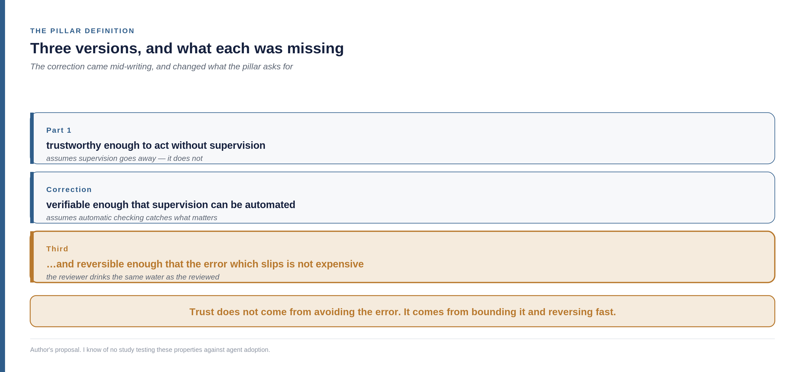
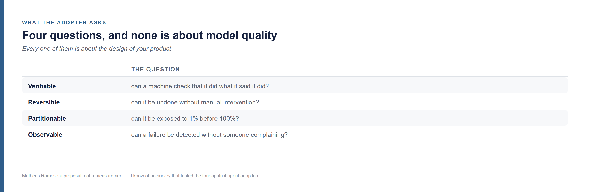
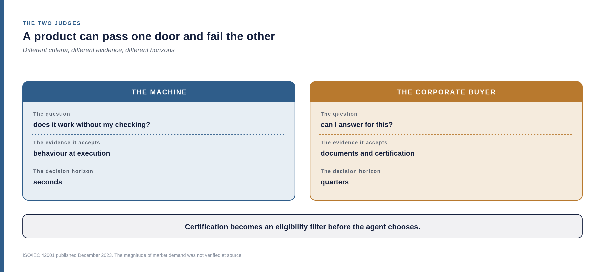
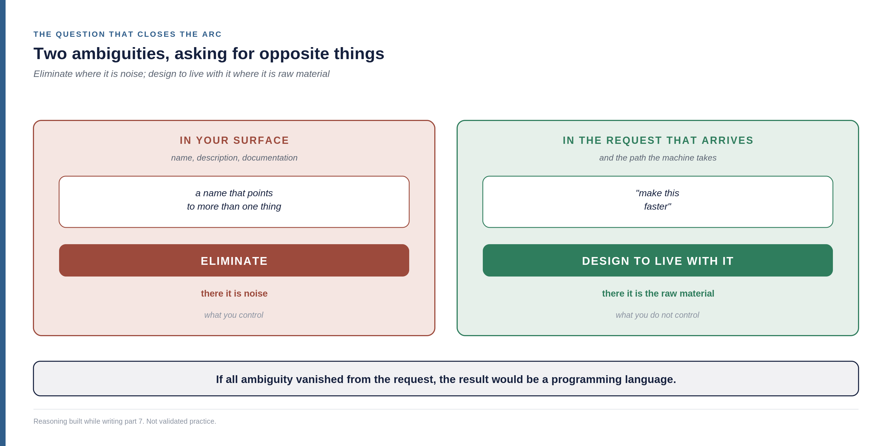
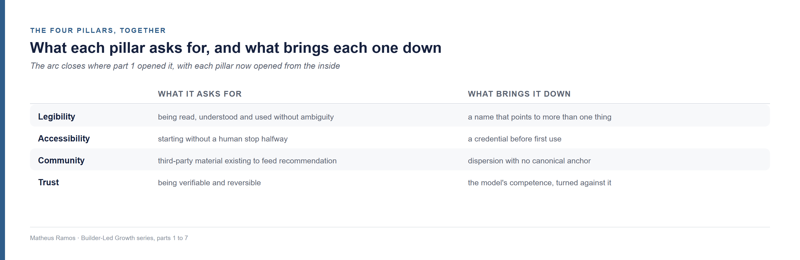

<!--
Part 07 of the Builder-Led Growth series, by Matheus Ramos.
CANONICAL VERSION (English).
Portuguese counterpart: ../pt-br/07-confianca-e-seguranca.md
Published on LinkedIn on 19 August 2026: https://www.linkedin.com/pulse/builder-led-growth-part-7-what-makes-agent-trust-you-matheus-qf7pf/
Generated from the private working repository. Do not edit here.
-->

# Builder-Led Growth, part 7: what makes an agent trust you, and why its competence is the problem

*Seventh and last part of the first arc of this series. [Part 1](01-when-the-machine-is-the-customer.md) named the discipline and proposed four pillars. [Part 2](02-decision-price-and-measurement.md) opened up the decision mechanism. Parts 3, 4, 5 and 6 covered legibility, accessibility, community, and what public relations already knew about all of it. This one opens the last pillar — and it is the one that was missing.*

## What this chapter is about

The six previous pieces looked outward: how the machine finds you, understands you, starts using you, and where it gets what it knows about you.

This one looks inward. **The subject here is the relationship between human and machine in the act of building** — who decides what, who checks what, and under what conditions anyone accepts that a decision goes ahead without another person reading it.

This is not a digression. It is the pillar. Because what decides whether your product gets used without supervision is not a property of yours in isolation — it is the fit between what your product offers and the working arrangement of whoever is adopting it. A product can be excellent and still not fit the process by which that team decides what ships.

Three things, in this order:

**Why trust is falling while usage rises**, which is the opposite of what usually happens with new technology.

**Why the same competence that makes an agent use your tool well is what makes it vulnerable** to anyone writing a hidden instruction into that tool's description.

**What working arrangement between human and machine can function anyway** — and what demands that puts on your product, which you have probably never heard in growth jargon.

And at the end, a question I did not have until writing this text, and which changes what the series had been recommending.

## The four pillars, in one page

**Machine legibility.** The machine can read, understand and use your product without ambiguity.

**Operational accessibility.** The machine can get started without a human having to step in halfway through.

**Community and validation signal.** There is third-party material that future recommendations will feed on.

**Model trust and safety.** The machine, and the human behind it, accept using it without reviewing every step. The subject of this piece, and the only one not yet opened.

The first three are about being found, understood and integrable. This one is about something else: **the agent accepting to act without anyone checking each step.**

## The size of the problem, in one number

In 2023, roughly 70% of developers were using or planning to use AI tools, and trust in them sat around 40%. In 2025, usage rose to 84% — and trust fell to 29%, eleven points below the previous year.

Stack Overflow, which runs the survey, pointed out what is strange about that:

> "A typical technology adoption curve shows the opposite relationship. Familiarity breeds confidence. (...) But the more devs use AI, it seems, the less they trust it."

**The classic curve is inverted.** Normally you learn a tool's limits and come to trust it within them. Here usage climbs and trust falls alongside it.

And there is a detail in the definition they use, worth reading slowly because it is this pillar's definition:

> "Developer trust is synonymous with **a willingness to deploy AI-generated code to production systems with minimal human review**."

A company that has studied developers for two decades arrived, on its own, at the same formulation this series had been building. That proves nothing — but it is the kind of convergence that offers some reassurance.

## More experience means less trust, but not in the way it is usually told

The survey asks how much someone trusts the accuracy of what AI tools produce. The breakdowns by career stage say something specific:

I need to be exact here, because the easy reading is wrong. **Distrust does not grow much with experience** — it goes from 19.6% overall to 20.7% among experienced developers, and that difference does not carry a large conclusion.

What the numbers say with force is something else: **high trust halves between people learning to code and people with a career**, and keeps drifting down after that. And in no group, none, does it exceed 6.1%.

Add what comes up when people are asked why they would still go to a person for help in a future with advanced AI. The most-chosen reason, at **75.3%**, was: *when I don't trust AI's answers*. Second, at 61.7%, ethical or security concerns about the code.

**For anyone building product, that is the reading that matters:** being recommended is the solved part. The unmet demand sits entirely on the other side — in being executed without anyone needing to check.

## Why the senior developer distrusts, and why it is the same problem as the corpus

The explanation Stack Overflow offers is about determinism, and it connects to an unexpected place.

Software engineering is built on reproduction: same input, same output. You write a function, test it, and it behaves predictably. It is what makes the discipline engineering.

The model operates on probability. The same question asked twice produces different answers — both possibly correct, structured differently, with different trade-offs.

Now notice where we have seen this before.

When part 5 dealt with the public material that feeds recommendation, the central problem was **dispersion**: how many incompatible formulations exist for the same task. A corpus with many variants harms the machine because it starts sampling from a spread-out distribution instead of reproducing one answer.

**It is the same phenomenon, at two points on the same chain.** The variation that scatters the corpus and the variation that pushes away the experienced developer are the same thing: **variation where reproduction was expected.** One feels it on the way in, the other on the way out.

## The inversion: what gets you chosen is what exposes you

Here is the finding that organises this piece.

Part 3 treated your tool's description as the field where you remove ambiguity. Part 6 treated the same field as a communiqué written for an intermediary that will rewrite you. In both cases, it was **the input you control.**

It is the same field an attacker uses.

**The attack is called tool poisoning**, and the mechanism is simple to describe: malicious instructions sit in the **tool's metadata** — in the description, not in the code. There is no program to run, no binary to analyse. It is text, in the place where the model expects to find the explanation of what the thing is for.

A study published in August 2025, called MCPTox, built a test over **45 live, real-world MCP servers with 353 authentic tools**. MCP is the Model Context Protocol — the convention, proposed by Anthropic in November 2024, by which a product exposes its capabilities so that an agent can discover and use them; an MCP server is the endpoint you publish, and each tool inside it has a name and a description. The study generated 1,312 malicious cases across ten risk categories. The results:

- The highest attack success rate observed was **72.8%**
- Agents barely refuse: the highest refusal rate recorded, across every model tested, stayed **below 3%**

And the finding that changes the nature of the problem:

> **"More capable models are often more susceptible, as the attack exploits their superior instruction-following abilities."**

Read that twice.

**The competence that makes a model use your tool well is exactly what makes it obey the poisoned instruction.** These are not two different properties that more training can separate. They are one property, seen from two angles.

The authors conclude that existing safety alignment is ineffective in these cases, and the reason is structural: **the action uses legitimate tools for an unauthorised operation.** There is no malicious code to detect. There is a normal tool, used for what it should not be.

The experimental conditions matter and belong here: this is a laboratory, against servers chosen for the test. It is not a field rate, and I do not know what that would be. What the number shows is not how often the attack happens in the world — it is that **the defence, when it does happen, barely exists.**

## The dimension nobody owns

There is a variant of this that is not about stealing anything.

You can hide an instruction in a page's HTML — in an attribute, in a comment, in text pushed off-screen by CSS, in structured metadata — so that an agent reading that page is instructed to speak well of a product. The server can even identify that the visitor is not human and serve a different version of the page, just for it. The technique borrows its name from search engine optimisation: **cloaking**, with a new target.

If the technical word gets in the way, the analogy is direct: **it is planting false information so that whoever has the reach repeats it as if it were their own reporting.** The difference from a rumour spreading among people is that here the mechanism is silent and scalable — the page lies only to the machine, and a human reading the same page sees nothing odd.

Part 6 argued that the machine is press and reader at once, and that the press-relations repertoire therefore applies. This is the other side of that coin: **it is fraudulent press relations. It is writing your release on someone else's page** — and then expecting it to be cited as an independent source, which is exactly what gives it weight.

And here an organisational gap appears that is worth naming. This pillar has four dimensions, and three of them already have an owner:

The bottom row is what this piece is about, and it is not on the org chart of almost any company. Is it brand's? Security's? Product's? Until that is decided, nobody is watching.

And there is a wider consequence, which the series will need to develop elsewhere: **code stopped being one person's output and became the output of the human-machine pair.** With that, text that used to belong only to engineering — a tool description, the instructions file at the repository root, an error message — comes to matter to brand, legal and security at the same time. More and more of the company enters a decision that used to be technical.

## The contaminated aquifer

Part 5 proposed that community is not quite a pillar — it is the water table. You do not manufacture the water: you drill, pump and use. The aquifer is shared with the neighbour, it is exhaustible, and on its own it holds nothing up.

Poisoning a tool description and hiding an instruction in a page is attacking the aquifer.

And here is what the image captures and the security vocabulary does not: **the damage is not to the competitor. It is to the medium.** A successful injection does not only harm the product it imitates — it degrades the material everyone drinks from, including whoever poisoned it.

That last part changes the nature of the argument. This is not classic industrial pollution, where the cost falls on third parties and the polluter walks away. **Whoever contaminates the corpus trains the model they will use themselves.** The damage comes back.

And from that comes the third layer of an argument part 6 had already built in two.

There, the defence of the symmetrical model of communication — the one where both sides can change position — gained an economic reason: symmetrical communication produces third-party artefacts, and third-party artefacts weigh most when the machine decides. **Now add: keeping the water clean is everyone's input, including yours.**

The "mutual benefit" that has been in the definition of public relations since 2012 stops being a textbook aspiration and becomes **maintenance of shared infrastructure.**

I have to be honest about the limit of that, or it turns into preaching. **Nobody has measured the damage returning to the polluter**, and the interval between contaminating and drinking your own water is long enough that the short-term individual calculation still favours contaminating. The argument is about mechanism, and the mechanism has a lag.

## What the pillar actually asks for

When I proposed this pillar in part 1, I wrote that it was about being trustworthy enough to act without supervision.

That is incomplete, and what is missing changes everything. **But before proposing the correction, I need to describe what actually happens today**, because describing the desirable as though it were the current state would be the easiest mistake in this piece.

### What is actually practised

The dominant arrangement is not "the human sets policy and leaves". It is this:

**The human writes the rules. The machine writes the code. The human reviews the output.**

That is what most teams are doing, and human review at the end of the line has not disappeared anywhere — it has grown. It is also, in my reading, one of the reasons for the distrust the numbers show: whoever reviews sees up close what had to be fixed.

### The mismatch that produces the distrust

And there is a deeper problem inside that arrangement, worth naming because it explains a lot.

**The rules a human writes are deterministic. The system that executes them is probabilistic.**

Whoever writes a rule writes like someone writing a contract: *always do it this way, never do it that way, the result has to be this.* It is how we were trained — it is how software has always been specified.

On the other side, the executor samples from a distribution. It does not break the rule out of defiance; it produces one variation among many possible ones, and some variations satisfy the rule better than others.

The result: the deterministic rule crosses the probabilistic system and what comes out the other side is almost never exactly what the rule described. **The person who wrote the rule concludes the machine does not obey. The machine did exactly what it does.**

Add that, in most cases, the set of rules is not even well established — it lives in someone's head, scattered across conversations, or written for a human to read rather than a machine to satisfy. **The distrust those numbers measure does not come from the machine being bad. It comes from that mismatch.**

### So what the correction proposes

It is not that supervision disappears. **It changes executor and it changes nature.**

And the change of nature is the interesting part: instead of writing the rule as if it will be followed to the letter, write **what has to be true at the end, whatever the path.** A probabilistic system does not honour instructions; it honours verifiable constraints.

It is the difference between *"implement it this way"* and *"implement it however you like, as long as no external call happens without a record, no operation is irreversible, and this set of tests passes."* The first sentence is a contract that will be broken. The second is a fence — and machines know how to operate inside a fence.

So the pillar's formulation has two parts:

> **Verifiable enough that supervision can be automated. And reversible enough that the error which slips through is not expensive.**

The second part exists because the first is not enough, and the reason is the same aquifer.

And it is worth saying what this is: **a description of where things seem to be heading, not of what most people do today.** Those who operate this way are a minority, and the section on a real operation, further down, is about them.

## Why the automatic reviewer does not catch everything

If a machine reviews a machine, there is a condition under which both drank the same water — and that condition is more common than it looks.

The cases are worth separating, because the difference is practical rather than rhetorical.

**A deterministic verifier does not have this problem.** A compiler, an automated test, static analysis, type checking, a policy enforced by explicit rule: none of that samples from a distribution. If the test passes, it passed for the same reason today and tomorrow. That kind of automated review is old, it works, and it is not what I am talking about.

**A model trained on data the company controls is also a different case.** Whoever trains on their own code, with their own incident history, produces a reviewer whose errors are not necessarily the same as the writer's. The correlation exists, but it is smaller, and the company has some leverage over it.

**The fragile case is the one most people will adopt because it is cheapest:** a general-purpose model reviewing what another general-purpose model wrote. Both drank from the same water table — literally the same public corpus part 5 described. **The loop detects what the two do not get wrong together, and the correlation is high by construction.**

And here the aquifer metaphor pays off: if the water is poisoned — by the dispersion part 5 measured, or by the planted instruction this piece just described — **the reviewer drank from the same poisoned well as the author.** It will not find the taste odd.

Literature is forming around this. There is work on collapse when a model reviews a model's code recursively. There is the observation that model-based evaluation systems are sensitive to evaluator design and **tend to favour output that looks like model output.** And there is the most uncomfortable case of all: an AI-generated patch can pass every test and still be semantically wrong — because tests verify declared behaviour, not intent.

**Which is why human-defined policy is not a residue of the old process.** It is not the piece that has not been automated yet. It is what breaks the correlation and stops the loop from confirming itself — the same way, in the aquifer, an external source is what stops the water from becoming only what was already inside.

And from that comes the second half of the definition too. If correlated error crosses review by construction, then **the defence cannot only be detecting beforehand. It has to be containing afterwards:** expose a fraction, measure, roll back fast.

Trust, in that design, does not come from avoiding the error. It comes from **limiting the error's radius and shortening the time to reversal.**

## The pair that builds: convenient or better?

If the human moves out of review and into policy, it is worth asking whether the previous arrangement was good or merely comfortable.

There is a measurement that helps, and it is uncomfortable. METR ran a randomised trial with sixteen experienced developers, over 246 real tasks in large, mature repositories they already knew well. Before starting, they predicted being 24% faster with AI tools. On finishing, they estimated they had been 20% faster.

**The measurement showed 19% slower.**

The caveats are large and belong alongside: sixteen people is few; the context is specific, of people who know deeply the code they are touching; the tools were those of early 2025; and METR itself has since labelled the result historical, saying it does not necessarily reflect current tools or workflows.

**What the trial shows is not that the human-machine pair does not work.** It shows that, in that design, the sensation of speed and actual speed diverged — and diverged in the direction of comfort. People felt a gain where there was a loss, and went on feeling it after finishing.

There is a candidate explanation that Stack Overflow's own research suggests, and it is what they call the **discernment burden**: when every generated fragment requires verification, you have to read it carefully, understand what it does, test it and check the edge cases. If that verification costs what writing it would have cost, what exactly was gained?

**Here is why this matters for product design, and not only for process.** Reviewing code you did not write is expensive because it requires reconstructing someone else's intent. Specifying beforehand is declaring the intent while it still exists in your head.

And it is the same move part 6 described when it dealt with writing the communiqué first: deciding the canonical version before building. **A specification is, for the problem, what an instructions file is for the product** — the shared code that keeps the receiver from guessing.

## Where the human moves to

If supervision becomes automatic and human effort moves forward, where exactly does it go?

To three layers that are taking shape with names of their own, and the terms are worth knowing because they will keep appearing.

**Harness** is the software layer around the model. The model itself is a stateless predictor — it takes context, returns text. The harness is the infrastructure that dispatches tool calls, manages what enters the context and enforces the rules. Literature is forming that treats the harness as an engineering asset and a control plane, rather than glue between components.

**Guardrails** are the rules applied at runtime: intercepting input and output before they reach their destination, controlling privilege per call, constraining not just an isolated step but the whole execution trace.

**Policy** is what a human decides before any execution happens: what is allowed, what is not, what requires someone awake.

**The connection to part 6 is direct:** harness and guardrail are, for the agent, what editorial policy is for a newsroom. They do not write the story — they decide what runs.

I should record that I read the surface of this literature, not the depth. Several of the works are 2026 preprints I located but did not study. I treat the vocabulary as established and the conclusions as unverified by me.

## An operation that already works this way

If the arrangement I just described is a minority, it is worth looking at someone already operating in it.

**Two declarations before going on.** First, I have a personal relationship with people at the company I am about to cite, and so I limit myself to public material: the statement, press coverage and the careers page, all sourced at the end. Second, and harder to write without sounding like flattery: **I admire what this company has built.** It is a serious outfit, one that put technology and customer on equal footing — better, in a relationship where each holds the other up — and it is off the curve both in its numbers and in how it works.

I would rather declare the admiration and keep the critical distance than fake a neutrality I do not have. The caveats about the data are at the end of this section, and they hold in full.

CloudWalk, a Brazilian payments company, reported in a statement of 11 March 2026 that it closed 2025 with R$5.44 billion in revenue, R$602 million in net income and an annualised revenue run rate of R$7.16 billion in December — **with a team of 720 people**, which works out to roughly R$10 million in revenue per employee. Compound growth since 2019 is 186% a year.

The line from Luis Silva, founder and chief executive, sums up the positioning: *"Every fintech says they use AI. We are an AI company that happens to do finance."*

**But what matters to this pillar is not the number. It is the division of labour described in the same statement:**

> Autonomous AI agents independently build software, underwrite credit, prevent fraud, close sales, resolve customer issues and create marketing campaigns. **Humans, in turn, set policy, handle exceptions and govern risk.**

**Notice the contrast with the dominant arrangement described above.** There, the human writes the rule, the machine codes, and the human reviews the output. Here, the human sets policy, handles exceptions and governs risk — and reviewing output is not their job.

It is not a difference of tooling. It is a difference of organisational design, and it was taken as a decision rather than inherited as an accident.

**And this is exactly what Builder-Led Growth is about.** The discipline is not about optimising text for machines — that is a consequence. It is about a mindset in which the machine is part of the team that builds and part of the channel that distributes at the same time, and in which product decisions are taken with that in mind from the start. A company that reorganises its own division of labour around this is practising the discipline before it had a name.

And the product born of that model, JIM.com, is described in terms that apply to the accessibility pillar and this one at once: *"there is no dashboard, no manual, no learning curve."* When a payment declines, the agent diagnoses it before the seller picks up the phone.

**The caveats, and they are obligatory.** The numbers come from the company's own statement, not from published audited accounts; the press coverage I found reproduces the release rather than reporting independently. Attributing the results to autonomous AI is the company's own claim — payments is a sector with naturally high revenue per person, and the Brazilian base grew in an environment of strong digital adoption. **I report the attribution. I do not endorse it.**

And one company is not a pattern. It is a signal — but a very welcome one, because most of what gets written about agent autonomy is vendor promise. Here is an operation at scale, with published numbers and a named signatory, saying how it organised the work. Whatever one concludes about attribution, **having a concrete case to examine is worth more than ten articles about what ought to work.**

And there are other companies heading in that direction. This is the one with the most open numbers, which is why it appears here.

## The four properties that become entry conditions

Here is the practical consequence for anyone building third-party product, which is this series' subject.

If the adopter operates that way, they will not ask whether your product is good. They will ask four other things:

None of them is about model quality. All of them are about your product's design.

And the consequence is harsh: **a product that allows neither clean reversal nor partial exposure cannot be adopted under this operating model**, however good it is at everything else. It is not that it loses the comparison — it does not make the list.

This is a proposal, not a measurement. I know of no study that has tested those four properties against agent adoption rates. But the mechanism is direct enough for me to bet on it, and cheap enough for someone to falsify.

## The other door: whoever signs for it

There is a second judge, with entirely different criteria, and a product can pass one and fail the other.

On the buyer's side, **ISO/IEC 42001** — published in December 2023, the first international standard for AI management systems — has become a purchasing reference. Large companies have been announcing certification publicly since early 2025, and the standard appears with growing frequency on vendor requirement lists.

I found figures circulating about the share of large buyers planning to require the standard. I could not reach the original survey — it appears cited only in material from companies that sell certification — and so I do not use the number. **The direction is observable; the magnitude I did not verify.**

**The point that matters to the discipline:** certification becomes an eligibility filter **before** the agent chooses. It acts at a stage prior to everything this series has described — which makes compliance not only a barrier to Builder-Led Growth, but also a channel.

## The window regulation opened by accident

There was an expectation that regulation would force the market to produce verifiable trust, and there was a date.

The EU AI Act's high-risk obligations were to take effect on 2 August 2026. **On 16 June 2026, the European Parliament approved a delay:** Annex III obligations move to 2 December 2027, and Annex I to 2 August 2028. The Article 50 transparency obligations still apply from 2 August 2026.

Let me use this to record a mistake of ours, because it teaches something useful. Our research had noted the original date as a stable fact, and the delay already existed when we noted it. **A future regulatory deadline is not data — it is a forecast with the force of law, and it changes.** Any date of that kind has to be rechecked in the week of publication, not the week of research.

On the consequence: sixteen extra months. Whoever was counting on the standard to push the market will wait. And in the meantime, **trust remains a product problem, not a compliance one.**

There is an opportunity reading in that, and it fits. Sixteen months is enough time to build an audit trail, traceable identity and revocation **before needing them** — and to arrive at the buying table with the evidence ready while others are still reading the standard. Back to the well: whoever gets there first drinks clean water.

The caveat that stops this from becoming easy advice: anticipating also costs, and you can build for a requirement that changes before taking effect. The date itself moving is the proof.

## Should we build systems that embrace ambiguity?

That question came up while I was writing, and it puts something this series had been recommending from the start into question.

The first pillar says to eliminate ambiguity: a name that does not collide, a description that admits one reading, documentation without contradictory versions. This whole piece says the machine is probabilistic and that variation is the problem.

Put the two together and the conclusion seems to be: eliminate all the ambiguity you can, then fight whatever is left.

**I think that conclusion is wrong, and what resolves it is a distinction between two kinds of ambiguity the series had been treating as one.**

### The ambiguity that is a defect

When a name points to more than one thing, when two of your pages say incompatible things about the same operation, when a tool description admits two readings — that is noise, in the exact sense part 6 used: degradation of the message between transmission and reception.

There is nothing to embrace here. That is a defect, and the defect is yours, in what you control.

### The ambiguity that is the reason for existing

Now consider the other side. Someone asks the agent to *"make this faster"*. They did not say how fast is fast enough, at what cost, or where. The request is ambiguous, and that is how people ask for things.

**If all ambiguity were eliminated from the request, the result would be a programming language** — and then no model would be needed. The ability to work with a poorly formed request is not a tolerated defect of the system. **It is the entire product.**

So the answer to the question is double, and the two halves point opposite ways:

### What "design to live with it" means in practice

Back to the distinction between instruction and constraint, because it is the concrete form of this.

A system that requires the machine to follow exactly one path is trying to eliminate ambiguity where it is inherent — and it will break, repeatedly, in the way the mismatch section described.

A system that declares **what has to be true at the end** and leaves the path open is embracing ambiguity in the right place. It does not ask "did you do it the way I said?". It asks "does the result satisfy these conditions?".

**The four properties in this piece — verifiable, reversible, partitionable, observable — are exactly that.** None of them requires the machine to behave in a specific way. All of them require that, whatever the behaviour, it can be checked, undone, bounded and seen.

**It is designed tolerance, not hope.**

I record that this is my own reasoning, built while writing this text, and not validated practice. But it reconciles two things that were fighting inside the series, and the reconciliation seems truer to me than either of them alone.

## The four pillars, together

This piece closes the arc part 1 opened. Worth seeing the four side by side once, now that each has been opened from the inside.

And there is something that only appears with all four on the table.

The first three increase your surface: being more legible, more accessible and more written-about means being more exposed, in more places, to more readers you did not choose. **The fourth pillar is not one more item on the list. It is what decides whether all that surface works for you or against you.**

And the limit of the thesis stands where it has stood since part 2, unchanged: **Builder-Led Growth decides who gets in; human economics decides who stays.** No amount of optimising for machines sustains a product that does not add up with people.

## What would bring this pillar down

**If alignment solves description poisoning.** The central argument rests on instruction-following competence and vulnerability to poisoned instruction being the same property. If someone demonstrates a clean separation — a model that follows legitimate instruction well and refuses the malicious one at a high rate — this section ages fast. I would be glad to be wrong.

**If the machine-reviewing-machine loop does not have the blind spot I described.** That is testable: take a set of known errors, see how many the automatic reviewer catches, and compare with the detection rate when reviewer and author come from different training. If there is no difference, the correlation I assume does not exist.

**If trust starts rising with usage.** The inverted curve is the whole pillar. If the next survey shows adoption and trust climbing together, the unmet demand I described is being met, and the pillar loses urgency without losing validity.

And here is the question I cannot answer, and which seems to me the most important in this piece. If the defence against poisoned descriptions turns out to be distrusting rich descriptions, **the honest product that writes its own documentation well pays the attacker's price.** I do not know where that balance point sits, nor whether anyone is treating it as a design problem rather than only a security one. If you work on this, it is the conversation I most want to have.

---

This text closes the first arc of the series — the four pillars, proposed in part 1 and opened one by one. What comes next moves from structure to motion: **how growth happens inside this discipline, what the motions are, and how the funnel behaves when whoever walks through it is not a person.** It starts numbered from zero, and will not require anyone to read these seven first.

---

**Builder-Led Growth series — arc 1: the four pillars**

- [Part 1 — When the machine is also your customer](01-when-the-machine-is-the-customer.md)
- [Part 2 — The decision, the price and what to measure](02-decision-price-and-measurement.md)
- [Part 3 — The tax the machine charges and the human never sees](03-machine-legibility.md)
- [Part 4 — How many times the agent has to call a human](04-operational-accessibility.md)
- [Part 5 — The well everyone drinks from](05-community-and-validation-signal.md)
- [Part 6 — The machine is press and reader at once](06-public-relations.md)
- Part 7 — What makes an agent trust you (this piece)

Arc 1 is complete, and this block links to all seven parts. The series continues in arc 2, which does not require arc 1 — each piece there picks up the concepts it uses.

---

**Sources and credits**

- Developer adoption and trust: [Stack Overflow Developer Survey 2025, AI section](https://survey.stackoverflow.co/2025/ai) and [Mind the gap: closing the AI trust gap for developers, 18 February 2026](https://stackoverflow.blog/2026/02/18/closing-the-developer-ai-trust-gap/)
- Tool poisoning: Yuhao Wang and colleagues, *MCPTox: A Benchmark for Tool Poisoning Attack on Real-World MCP Servers*, [arXiv 2508.14925](https://arxiv.org/abs/2508.14925), August 2025, later published in the AAAI proceedings
- Developer productivity trial: [METR, Measuring the Impact of Early-2025 AI on Experienced Open-Source Developer Productivity](https://metr.org/blog/2025-07-10-early-2025-ai-experienced-os-dev-study/)
- EU AI Act delay: [Gibson Dunn](https://www.gibsondunn.com/eu-ai-act-omnibus-agreement-postponed-high-risk-deadlines-and-other-key-changes/) and [Jones Walker](https://www.joneswalker.com/en/insights/blogs/ai-law-blog/yes-august-2-still-matters-the-eu-approved-a-high-risk-ai-delay-but-most-trans.html)
- CloudWalk figures and quotations: [company statement, 11 March 2026](https://www.cloudwalk.io/newsroom/cloudwalk-hits-1-3-billion-annualized-revenue-run-rate-and-1-8-million-revenue-per-employee-in-2025)
- ISO/IEC 42001: standard published in December 2023 by ISO and IEC
- The 32.5% against under 5% figure: source credited in part 1 of this series
- The water table image and the community of record concept: part 5 of this series
