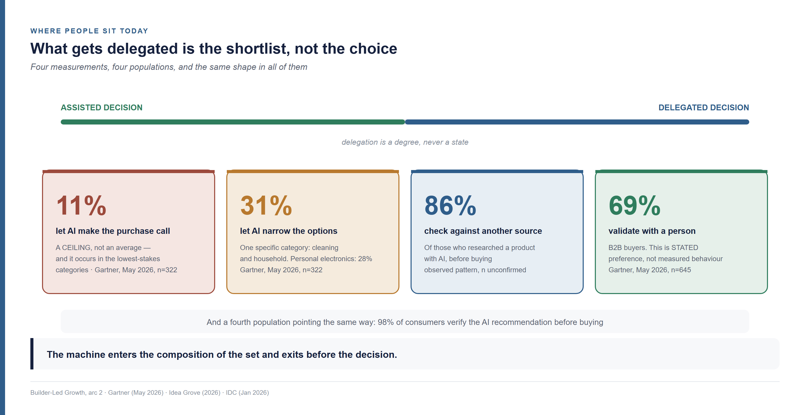
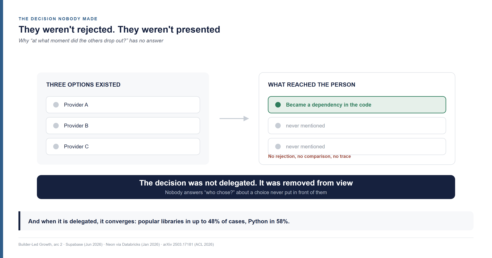
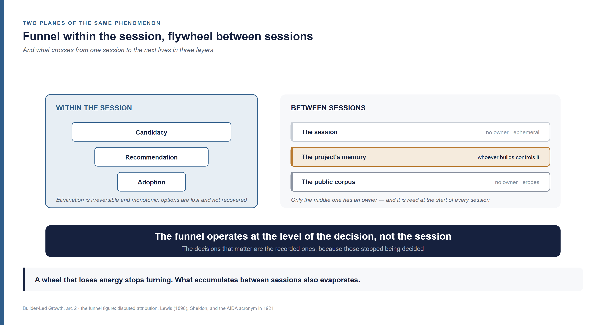
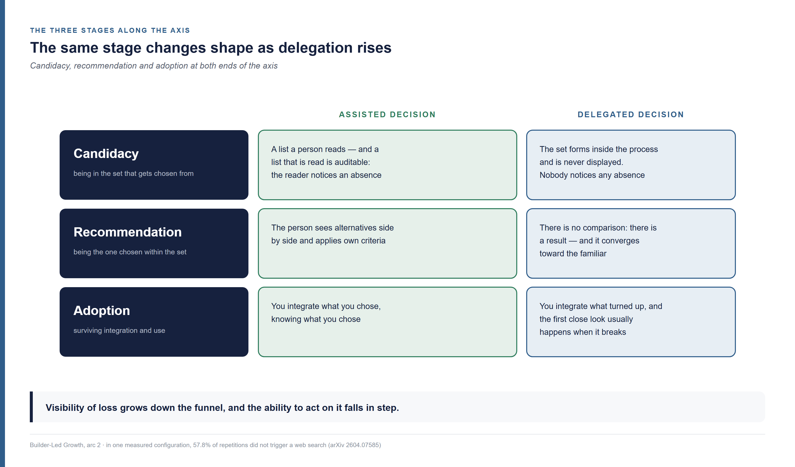
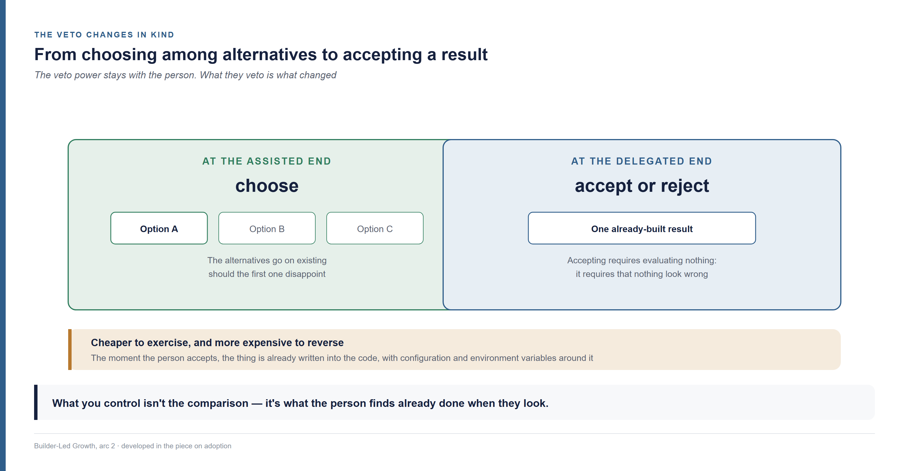

<!--
Arc 2, part 1 of the Builder-Led Growth series, by Matheus Ramos.
CANONICAL VERSION (English).
Portuguese counterpart: ../pt-br/arco2-01-o-funil-e-o-eixo-da-delegacao.md
Text frozen. No LinkedIn date set yet.
Generated from the private working repository. Do not edit here.
-->

# It isn't who decides. It's how much was delegated

*Second piece of the second arc of this series, and it doesn't require the earlier
ones — what matters is picked up here. The opening piece established that the one
choosing is a pair, a person and a machine. This one asks what changes as more of
that pair's work gets delegated, and where it lands inside the funnel.*

---

## Three options existed. One made it into the code

I ask the pair to get the application deployed. I say what it does, I say it needs
to be live, and I go back to what I was doing.

When I look again, it is live. The code calls a hosting provider I did not choose.
Its configuration is written, the environment variables are declared, and there is
a deployment file I never asked for that works.

Three providers would have handled that job. I know all three. One of them is used
by a team next to mine, and I would have picked that one if anyone had asked. Nobody
asked, and what bothers me is not that I ended up with the wrong provider — what
turned up works fine. What bothers me is something else.

I accepted it. I looked at the result, saw it was live, and moved on. The veto was
mine and I did not exercise it, because exercising a veto requires knowing there was
something to veto.

So: **at what moment did the other two drop out?**

Hold on to that question, because it is a trap and I set it deliberately. It
presumes there was a moment of dropping out — an instant when three became one. That
is what this piece is about, and the answer is less comfortable than the question.

## The axis, and the two names that were missing

I am going to promote to structure an idea that had been operating off to the side.

The opening piece of this arc established that a builder is the pair — the person
and the agent together, the agent selecting, the person validating, neither deciding
alone. And it recorded, with survey data behind it, that the weight does not sit
still in the middle: it tips with the experience of whoever is watching, and with
how much written rule surrounds them.

That went in as an observation. Here it becomes the axis everything else organises
around, and I am declaring the promotion rather than making it quietly.

**Saying that the machine chooses is false. The human chooses just as much.**
Outside this theory that is obvious — someone picking bread at a bakery has
delegated nothing to anyone. And inside it too: choosing which work to do, which
progress to chase, which problem to attack, and then asking the machine for help, is
a human decision from end to end. What changes from one case to the next is not who
decides. It is **how much was delegated** — and delegation is a degree, never a
state.

The two ends of that degree need names, and this is the first thing this piece
coins:

> **AI-assisted decision: the person chooses among options the machine assembled.
> Delegated decision: the person accepts or rejects a result the machine has already
> built.**

I looked for an existing name before inventing one, and what exists names other
things. **Conversational commerce** was coined by [Chris
Messina](https://www.linkedin.com/in/factoryjoe/) in 2015, and describes buying
through a messaging app — it predates language models. **Zero-click search** was
quantified at scale by [Rand Fishkin](https://www.linkedin.com/in/randfishkin/) from
13 August 2019 onward, and describes the absence of the click, not the decision.
**Generative engine optimisation**, coined on 16 November 2023 by the authors of the
paper that proposed it ([arXiv 2311.09735](https://arxiv.org/abs/2311.09735)), names
the response of whoever publishes. And the **Agentic Commerce Protocol**, announced
by Stripe and OpenAI in September 2025
([openai.com](https://openai.com/index/buy-it-in-chatgpt/)), names the far end where
the agent buys on its own.

None of those names the mediated case with the human decision still intact, which is
precisely the common one. The space was empty, so I filled it — with the caveat that
the pair above is a proposal of mine, not a field finding. If someone coined an
equivalent before me, the credit is theirs and I will swap mine for it.

One fence around the scope, because two different switches are easy to confuse. An
organisation deciding to start building with AI is one switch — large, slow, with a
committee. The already-formed pair choosing which tool to use mid-build is another.
This piece is about the second.

## Where people actually sit on that axis

The next question is empirical: in practice, how much gets delegated?

Three surveys, in three different populations, return the same shape of result — and
it is that agreement in shape, more than any single number, that carries what comes
next.

Consumer willingness to let AI **make** the purchase decision **tops out at 11%**.
The wording is the survey's own — *"topped out at 11%"* — and the ceiling occurs in
the lowest-stakes categories, personal care and household supplies. It is not an
average; it is the maximum observed. Willingness to let AI **narrow** the options
reaches **31%** in cleaning and household products and **28%** in personal
electronics ([Gartner, 27 May
2026](https://www.gartner.com/en/newsroom/press-releases/2026-05-27-gartner-survey-finds-consumers-want-ai-shopping-help-but-not-ai-purchase-decisions)).
Worth saying where it comes from: 322 US consumers, fielded in January 2026, and the
release publishes no sampling frame, collection mode or margin of error. I use the
pattern, not the decimals.

In corporate software buying, **69% say they prefer to validate** AI-generated
conclusions with a human sales rep, and 45% used generative AI *"primarily to gather
information on vendors and products"* ([Gartner, 20 May
2026](https://www.gartner.com/en/newsroom/press-releases/2026-05-20-gartner-survey-finds-sixty-nine-percent-of-b-two-b-buyers-turn-to-sales-reps-to-validate-ai-generated-insights),
645 buyers, fielded August to September 2025). The word the release uses is *prefer*
— stated preference, not measured behaviour. The difference matters and I am not
going to smooth it over.

And **86%** of those who used AI to research a product checked the recommendation
against another source before buying. Add the fourth population, which the opening
piece of this arc already brought in: 98% of consumers verify the AI recommendation
before buying.

Four measurements, four cuts, and the same shape in all of them: **what gets
delegated today is the shortlisting, not the choice.** The machine enters the
composition of the set and exits before the decision. It matches what one analyst
house described as narrowing the field before human evaluation begins ([IDC, 28
January
2026](https://www.idc.com/resource-center/blog/ai-mediated-buying-journeys-how-buyers-decide-whos-worth-their-time/)).

## The decision nobody made

If shortlisting is what gets delegated today, the question that matters is the
trend. And I suspected a specific answer: that among people building with AI the
proportion was shifting, with the machine deciding more and more.

Before searching, I wrote down what would knock the suspicion over — because
research that only comes back with what you already believed has a problem in the
question, not in the world. Three criteria: a proportion flat over time; growth in
execution only and not in decision; or the heavily-delegating population shrinking
rather than growing.

**Two of the three happened, and the suspicion fell.**

The one public series that comes close to measuring whole-task handoff without
evaluation of the path does not climb: 27.8% in the December 2024 to January 2025
field, 27% in the next one, up to 39% in August 2025, down to 32% in November 2025,
and then not published in the two editions after that ([Anthropic Economic
Index](https://www.anthropic.com/research/anthropic-economic-index-january-2026-report)).
I do not treat that as a series: the 15 January 2026 edition declares a classifier
change midway, and the measurement is a vendor's own, about its own product.

Scrutiny, meanwhile, rises with experience. High-tenure users are described as
*"much less likely to delegate greater responsibility"*, and the interruption rate
climbs from 5% to 9% of turns ([Anthropic, 24 March
2026](https://www.anthropic.com/research/economic-index-march-2026-report)). Across
500,000 sessions and 998,481 tool calls, 73% had a human in the loop and 80% had some
protective mechanism ([Anthropic, 18 February
2026](https://www.anthropic.com/research/measuring-agent-autonomy)) — again, the
vendor's own material.

And there is counter-evidence from the person who named the phenomenon. [Andrej
Karpathy](https://www.linkedin.com/in/andrej-karpathy-9a650716/) coined *vibe coding*
— programming by describing what you want and accepting what the machine writes,
without reading the diffs — on 2 February 2025, and the founding text is about
delegating decision, not execution: *"I 'Accept All' always, I don't read the diffs
anymore."* On 4 February 2026 he retired the term, proposed *agentic engineering* in
its place, and wrote that programming through agents is becoming the professional's
default flow *"except with more oversight and scrutiny"* ([dated record by Simon
Willison](https://simonwillison.net/2026/Feb/26/andrej-karpathy/)).

Agents, as it happens, are conservative exactly where the vendor decision lives.
Across 26,760 agent-authored pull requests in 1,832 repositories with more than a
hundred stars, **only 1.3% introduce a new dependency**, and pull requests that
import a library are merged at rates 6% to 11% lower — meaning human scrutiny goes
up when a library choice is on the table ([Twist and Zhang, King's College London,
arXiv 2512.11589](https://arxiv.org/html/2512.11589)).

All of it points the same way, and the way is not what I expected. Except that there
is one measurement none of those series can hold.

On 4 June 2026, [Paul
Copplestone](https://www.linkedin.com/in/paulcopplestone/), co-founder and chief
executive of Supabase, stated: *"agents are now deploying the majority of databases
on our platform"*, over a declared base of more than 250,000 customers ([official
release](https://www.prnewswire.com/news-releases/supabase-raises-500m-at-10-5b-to-accelerate-lead-in-agentic-infrastructure-302791787.html)).
Neon, in a Databricks report of 27 January 2026 covering more than 20,000 customers,
shows a neighbouring figure: agents create **80% of all databases and 97% of database
branches**
([Databricks](https://www.databricks.com/blog/enterprise-ai-agent-trends-top-use-cases-governance-evaluations-and-more)).

Which database to use is an architecture and a vendor decision. It is not execution.

And the mechanism is declared by the vendor itself, on 29 September 2025: *"every AI
builder using Lovable is already using Supabase, whether or not they realize it"*
([Supabase](https://supabase.com/blog/lovable-cloud-launch)). These are statements
from companies with a commercial interest in emphasising their own penetration, and
that is worth knowing as you read the numbers. The mechanism, though, does not depend
on the third decimal place being right.

Look at what that does to the question this piece opened with:

> **The decision was not delegated. It was removed from view.**

Nobody answers "who chose the database?" about a choice that was never put in front
of them. And that is why no opinion survey captures this case: the only party
positioned to count decisions the decider never saw is whoever hosts the decision.
That reading is mine, and it is the centre of this piece.

The other two providers in my opening scene never dropped out at any moment. They
never entered.

And when the decision genuinely is delegated, it does not spread — it **converges**.
In a study across eight models, popular libraries appear unnecessarily in up to
**48%** of cases, Python is chosen in **58%** including where it is suboptimal, and
Rust is not used once in high-performance scenarios. The authors' conclusion, in
their words: *"LLMs may prioritise familiarity and popularity over suitability"*
([Twist, Zhang, Harman, Syme, Noppen, Yannakoudakis and Nauck, Findings of ACL 2026,
arXiv 2503.17181](https://arxiv.org/abs/2503.17181)).

From here on this is my own reasoning, unvalidated: if delegated choice concentrates
on the familiar, **whoever is already the category default gains from delegation, and
whoever is fighting for second place loses twice** — not chosen, and not compared
either.

## Twenty points between the measured and the believed

I need to stop here and say what can be done with the numbers so far, because almost
all of them are self-reported.

In a randomised experiment with 16 experienced developers and 246 real tasks from
their own repositories, randomised per task between using and not using AI, people
were **19% slower** with the tool. Beforehand they expected to be 24% faster. And
after having been measured as slower, they still estimated they had been 20% faster
([METR, 10 July
2025](https://metr.org/blog/2025-07-10-early-2025-ai-experienced-os-dev-study/),
[arXiv 2507.09089](https://arxiv.org/abs/2507.09089)).

> Twenty points between what was measured and what the person believes.

The caveat is the authors' own and I am obliged to reproduce it: they do **not**
claim AI makes most developers slower, and they say the result does not extend beyond
that group and those repositories. In the 24 February 2026 update, with 57
participants and more than 800 tasks, the effect was −18% for the original cohort and
−4% for the new one, with the confidence intervals crossing zero
([METR](https://metr.org/blog/2026-02-24-uplift-update/)).

The bridge I build on top of that is mine: if the people delegating cannot correctly
assess their own performance with the machine, opinion surveys about delegation
measure belief, not behaviour.

And the same update carries what I consider the strongest figure in this whole piece,
because it is not opinion — it is behaviour. **Between 30% and 50% of participants
said they were declining to submit tasks to the study because they did not want to do
them without AI**, in a design that paid them 50 dollars an hour to work on tasks of
their own choosing. Refusing to work without the tool is not yet letting the tool
choose. But it is the step before, and it has been measured.

From here to the end of this piece, nothing rests on what people say about
themselves.

## Why the funnel, and not the wheel

With the axis in place, we can ask where it operates — and answering means walking
into an argument marketing has been having for years.

The funnel-versus-flywheel debate — the wheel that turns and gains momentum — is a
debate about human buyers. The case against the funnel is that buyers do not walk in
a straight line: they double back, revisit, consult peers, and a corporate purchase
involves ten or more people entering at different moments. The dominant reading today
is complementarity: funnel for acquisition and forecasting, wheel for retention and
advocacy. The numbers circulating in that debate come from agency material with no
published methodology, and I cite them as the weather of the discussion, not as
measurement.

The funnel figure comes from early twentieth-century advertising, and its parentage is
disputed — the stages are usually credited to Elias St. Elmo Lewis in 1898, part of
the literature attributes the full formulation to Arthur Frederick Sheldon, and the
AIDA acronym only appears in 1921, with C. P. Russell ([E. St. Elmo
Lewis](https://en.wikipedia.org/wiki/E._St._Elmo_Lewis)).

**What changes when the machine is the selector is specific, and it is what rescues
the funnel here.** Within a session, elimination is irreversible and monotonic. When
the agent settles on a hosting provider, the competitor is not "revisited later" — it
is out, and the choice hardens inside the code in that same session. There is no
committee to reopen it, no second meeting. Options are lost and not recovered.

And the wheel comes back over the top, on a different plane: the choice becomes public
code, a forum answer, a tutorial, training data, and that feeds the next selection,
made by another agent, at another company.

> **Funnel within the session, flywheel between sessions.**

The two figures describe different planes of the same phenomenon, and the fight
between them dissolves once you say which plane you are talking about. With one
correction to the wheel figure, and it earns its place: a wheel that loses energy
stops turning, it does not turn backwards. What accumulates between sessions also
**evaporates** — which is what I described when treating community as a water table
that rises with what is deposited and falls with what is drawn. When decay is what
matters, that is the figure I use.

## What crosses from one session to the next

Here I need to correct a sentence of mine before going on.

Writing about operational accessibility, I said the machine decides afresh every
session and accumulates nothing between one and the next — that every session starts
from zero. **The part about the machine is true. The part about the pair is not** —
and it is the pair that decides. I kept investigating and saw that it holds for one
layer only, and it is the wrong layer for anyone trying to understand this subject.

There are three layers, and I had been working with two.

The **session** is where elimination happens. It is ephemeral, it has no owner, and
nobody strengthens their position in it.

The **public corpus** — the material that trains the next model — accumulates slowly,
has no owner, and erodes.

The middle one is what was missing, and it is the only one with an owner: the
**project's memory**. Specifications, decision records, instruction files for the
agent. Whoever builds controls that layer entirely, and it is read at the start of
every session.

Out of it comes a habit mechanism I did not have:

Once "we chose this provider, and here is why" is written in the project's memory
file, **that decision is re-read at the start of every subsequent session. It stops
being a decision and becomes a premise.** It is the cheapest habit to install and the
hardest to dislodge, because it requires neither model training nor code written — it
requires one line in a file.

This is already a market category: context engineering, with persistent memory layers
sold by vendors who keep repeating that memory is the moat. That is material from
people who sell memory, with an evident interest in the thesis; what it establishes
safely is that the category exists and has named competitors.

And for anyone selling, it opens a position this series had not yet named: **being
written into the customer's memory artefact is a more durable position than being in
the training data, which refreshes, and a cheaper one than switching cost, which
requires the code to already exist.** The ethical line is clear and worth stating: you
write the documentation, the customer decides whether to reference it.

The adjustment this forces on the funnel formulation is small and changes a good deal:
**the funnel operates at the level of the decision, not the session.** Not every
decision is the same size — some are local to the task and will be re-decided
tomorrow, others are recorded and become premises. The ones that matter are the
recorded ones, because those stopped being decided.

## The three stages, run along the axis

The funnel this series uses has three stages, and they are not new — they were named
and defined when I wrote about the decision, the price and what to measure. One
sentence each, just to recall what they do: **candidacy** is being in the set that
gets chosen from; **recommendation** is being the one chosen within it; **adoption**
is surviving integration and use.

What this piece adds is crossing them with the axis. The same stage looks like one
thing when the decision is assisted and another when it is delegated.

**In candidacy**, the assisted end is a list a person reads — and a list that is read
is auditable, because a reader notices a familiar name missing. At the delegated end,
the set forms inside the process and is never displayed. Nobody notices any absence.
Which is why that question about the moment of dropping out has no answer.

**In recommendation**, the assisted end compares — the person sees alternatives side
by side and applies their own criteria. At the delegated end there is no comparison:
there is a result. And what decides which result appears is the convergence toward the
familiar, which is what the popular-libraries measurement above records.

**In adoption**, the assisted end integrates what it chose, knowing what it chose. At
the delegated end you integrate what turned up — and the first time anyone looks at it
closely is usually when it breaks.

One mechanism helps explain why the set forms so early: in one measured configuration,
**57.8% of repetitions did not trigger a web search** (Schulte, Bleeker and Kaufmann,
[arXiv 2604.07585](https://arxiv.org/pdf/2604.07585), 10 April 2026 — the figure comes
via a citation in a critical review, not from the primary table). When search is not
triggered, the candidate set comes entirely from what the model already carries. There
is no curation moment to observe, because the curation happened before the session
began.

And there is an asymmetry running through all three, which I offer as my own
reasoning: **the visibility of loss grows as you go down the funnel, and the ability to
act on it falls in step.** When a product is discarded at adoption there is a trace —
someone switched, someone complained, someone opened an issue. When it never enters
candidacy there is no trace at all, and that is precisely where something could still
have been done about it.

## The veto changes in kind

Three things change as delegation rises, and the first two have already appeared here:
curation of the set happens earlier and more quietly, and loss stops leaving a trace.
The third is the one that matters most, because it is the one that gives sellers a
lever.

At the assisted end, the veto is a choice among visible alternatives: the person sees
three, prefers one, and the other two go on existing as options should the first
disappoint. At the delegated end there are no alternatives on screen. There is a
finished result, and the person accepts or rejects it.

> **The veto stops being a choice among alternatives and becomes acceptance or
> rejection of an already-built result** — cheaper to exercise, and more expensive to
> reverse.

Cheaper because accepting requires evaluating nothing: it requires only that nothing
look wrong. That is what I did in the opening scene. And more expensive to reverse
because, the moment the person accepts, the thing is already written into the code,
with configuration, environment variables and a deployment file around it.

That has a direct consequence for anyone building a product, and it is the subject of
the piece on adoption: if the veto is exercised while looking at a result, then what
you control is not the comparison — it is what the person finds already done when they
finally look.

## What holds, and what comes next

Four things, and all four carry the rest of the arc.

It isn't who decides, it's how much was delegated — and delegation is a degree, with
one end where the person chooses among options the machine assembled and another where
they accept or reject a result it built.

What gets delegated today, measured across four different populations, is the
shortlisting and not the choice.

There is a whole class of decision that none of those measurements captures, because it
was not delegated: it was removed from view.

And the funnel survives, at the level of the decision rather than the session, because
within a session elimination is irreversible — while what accumulates between sessions
lives in three layers, of which only the middle one has an owner.

The pieces that follow walk down the funnel. Two on candidacy, one on how you get into
the set and another on how you get cut from it before any preference is formed; one on
what decides the choice within the set, and which of those tactics decay; one on
adoption, the guardrail and who stays; and a closing one on where your product fits and
who inside your company looks after it.

I will close with what I do not know, and it is a single thing.

Nobody publishes how many vendor decisions the agent made on its own. I looked through
developer surveys, platform reports and open-ended phrasings, and the question is not
asked anywhere — no survey asks builders who chose the library, the service or the
database last time, the person or the agent.

And it is not a failure of searching. One of the platforms built the taxonomy that
would answer it — separating work initiated by code, by one agent and by multiple
agents, in its own metrics interface, since 29 May 2026 — and does not publish the
aggregate.

**Someone can measure this, and does not publish it.** If you work somewhere that can,
that number is the most important thing this arc could cite, and the conversation I
would most like to have after this piece.

---

**Builder-Led Growth series**, by Matheus Ramos. Second arc:

- [Arc 2, part 0 — From PLG to BLG: what still holds when the one choosing is a pair](arc2-00-from-plg-to-blg.md)
- Arc 2, part 1 — It isn't who decides. It's how much was delegated (this text)

The first arc, for anyone who wants the full route:

- [Part 1 — When the machine is also your customer](01-when-the-machine-is-the-customer.md)
- [Part 2 — The decision, the price and what to measure](02-decision-price-and-measurement.md)
- [Part 3 — The tax the machine charges and the human never sees](03-machine-legibility.md)
- [Part 4 — How many times the agent has to call a human](04-operational-accessibility.md)
- [Part 5 — The well everyone drinks from](05-community-and-validation-signal.md)
- [Part 6 — The machine is press and reader at once](06-public-relations.md)
- [Part 7 — What makes an agent trust you, and why its competence is the problem](07-trust-and-safety.md)
