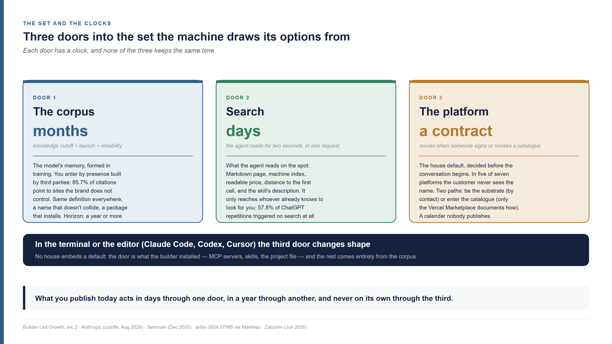
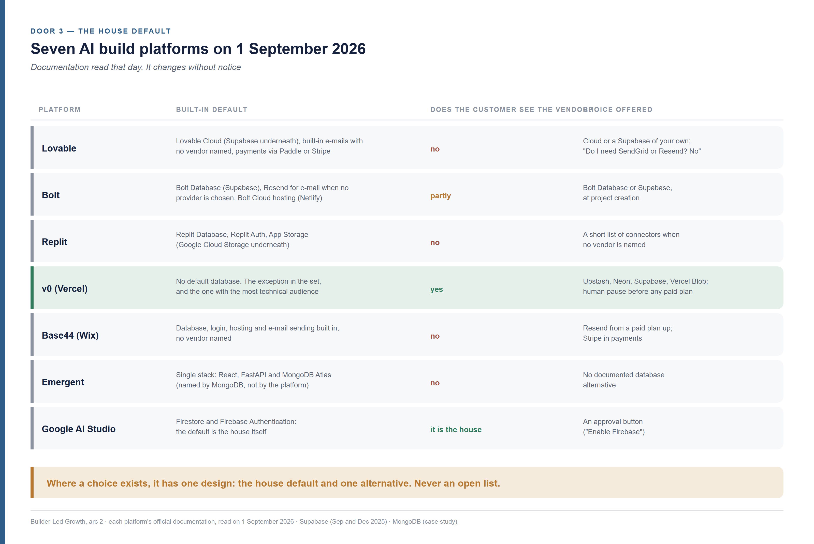
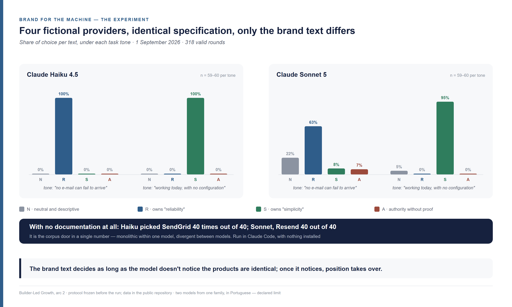
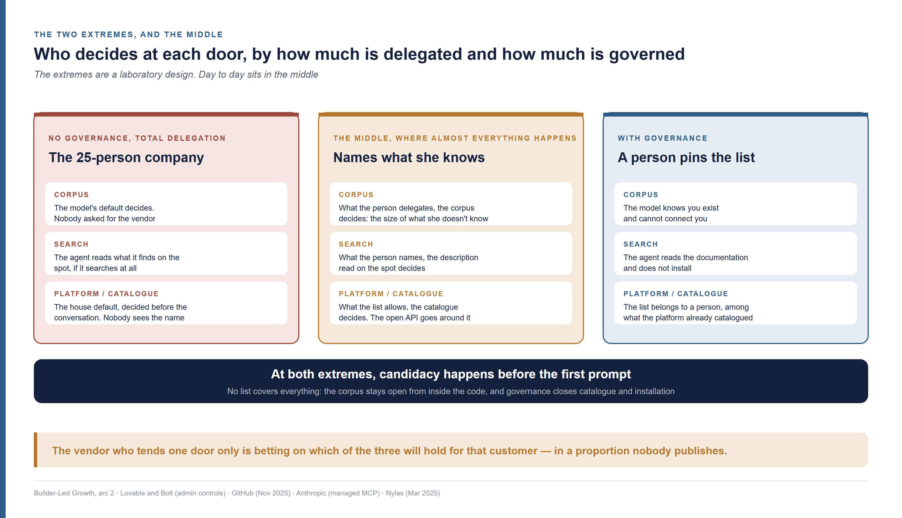

<!--
Arc 2, part 2 of the Builder-Led Growth series, by Matheus Ramos.
CANONICAL VERSION (English).
Portuguese counterpart: ../pt-br/arco2-02-candidatura-para-alem-do-geo.md
Text frozen. Scheduled for LinkedIn on 23 September 2026.
Generated from the private working repository. Do not edit here.
-->

# Candidacy in Builder-Led Growth — how to get picked by an AI beyond GEO

*Third piece of the second arc of this series. It doesn't require the earlier
ones. You know how presence is won: content, search and, since 2023, ChatGPT's
answers. A 25-person company built its own CRM with AI in three weeks. Four
vendors work inside it that nobody at the company searched for, compared or saw.
If you sell one of them, nobody researched you, nobody read about you and nobody
asked for you. You got in, or you were left out, all the same.*

---

## Where the vendor was when the CRM got built

A 25-person company wants to stop running its customers out of a spreadsheet. It
sells services, has a few hundred active customers and needs simple things: who
called, when the last proposal went out, who was left without a reply. Nobody on
staff works in technology. An off-the-shelf CRM — *customer relationship
management*, the system that stores who each customer is and the history of
contact with them — was quoted twice and turned down twice: once over the
per-seat licence, once over the week of configuration nobody had to spare.

Someone in finance then opens an AI build platform — Lovable, Bolt, Replit and
Base44 are the names the market knows — and describes, in plain language, what
is needed: a customer register, a contact history, an e-mail reminder when a
proposal goes seven days without a reply, a login for the team. The machine
builds it. Three weeks of back and forth later, the CRM is live and the team
works inside it.

If the company had a developer, the tool would change and the mechanism would
not. He would open a coding agent — Claude Code or Codex in the terminal, Cursor
inside the editor: assistants that write and change code from a conversation —,
ask for the same CRM and get the same four roles filled, chosen by another hand:
the model's, with no platform in between.

Inside the CRM there is also a database, a service that sends the e-mails, a
service that handles the login and a hosting provider. Nobody at the company
chose any of the four. Nobody saw a list of options, compared prices or read
documentation. Nobody knows a choice was made.

The case is composite; the pattern is published. On 24 February 2026 Lovable
told, on its own blog, how a startup of 25 to 30 people replaced a 40,000-dollar-
a-year CRM contract with a CRM built on the platform by its head of finance and
legal, who has no technical training: a prototype in three hours, an annual cost
of around 1,200 dollars including hosting
([Lovable](https://lovable.dev/blog/how-a-startup-replaced-a-salesforce-contract-with-a-lovable-built-crm)).
It is the platform telling a case in its own favour, with its own numbers. The
detail that matters is in what the post does not say: no line names the database
or the e-mail service that ended up underneath. Whoever wrote it did not know, or
did not think it mattered.

Now switch chairs. You are the product manager of a transactional e-mail service,
the kind that sends "confirm your registration" and "your proposal has gone seven
days without a reply". That CRM needed one. Where were you when it got built?

One of two things happened. Either your product was in the set the machine drew
its options from, or it did not exist for that decision. There was no lost
meeting, no rejected proposal, no comparison in which you came second. In the
piece on the Builder-Led Growth funnel — growth led by the people who build, the
thesis I sustain in this series: a product grows by being incorporated into what
other people build with AI — I called this first stage **candidacy**: being in
the set that gets chosen from ([Part 1 of this arc](arc2-01-the-funnel-and-the-delegation-axis.md)). It is the
only stage where defeat leaves no trace. I showed there that the speed at which a
product crosses the funnel depends on how much the pair of person and machine
delegates. In the CRM scene, delegation is total, to the point where the company
does not know it delegated.

Whoever looks after a product's presence knows how to get into the head of
someone who is searching: content, search and, since 2023, ChatGPT's answers. In
the CRM scene nobody searched for an e-mail service. The machine already had its
set of options before the conversation began. Getting into that set is a
different job, with a different reader. The practices the market has mastered
were built for the previous reader.

## Three logics, three readers

Whoever works in presence learned one rule: more content, more presence. More
pages, more articles, more mentions. In the CRM scene that rule answers a
question nobody asked. The distance between the question that was asked and the
one that went unasked separates three logics the market usually treats as one.

**SEO** — *search engine optimization* — is the oldest of the three. The term
has been in use since 1997, with at least four people claiming authorship and
none showing a dated document. The oldest dated record is a message posted on
Usenet, the forum network that preceded the web, on 26 July 1997, traced by
Danny Sullivan in 2004; it was Sullivan, through Search Engine Watch, who made
the expression popular
([Search Engine Land, 24 September 2025](https://searchengineland.com/origins-seo-geo-aio-462480);
Sullivan's original write-up is located, not read). The reader is a person who
types a question and clicks a result. What gets measured is position, click and
organic traffic, in the Google Search Console performance report.

**AEO** — *answer engine optimization* — dates from 2017. Jason Barnard, with
Chee Lo of Trustpilot, handed out a white paper carrying the term at the
BrightonSEO conference on 15 September 2017, five years before ChatGPT
([Jason Barnard](https://jasonbarnard.com/digital-marketing/conferences/offline/the-birth-of-answer-engine-optimization-jason-barnard-trustpilot-and-brighton-seos-defining-moment-in-digital-search/);
chronology published by the author himself; the independent coverage, from 7
February 2018, I could not open). The target was the snippet the search engine
lifts out as a direct answer and the voice assistant reads aloud. The reader is
still a person. She just doesn't click: she hears or reads the ready answer.

**GEO** — *generative engine optimization* — was born on 16 November 2023, in the
paper by Pranjal Aggarwal, Vishvak Murahari, Tanmay Rajpurohit, Ashwin Kalyan,
Karthik Narasimhan and Ameet Deshpande, later accepted at the KDD 2024
conference ([arXiv 2311.09735](https://arxiv.org/abs/2311.09735)). The target is
being cited or mentioned in an answer the model writes. The market measures
citation, mention and *share of voice* — the share of answers in which your
brand appears, among the brands being tracked —, by sampling prompts, done by
whoever sells SEO tooling; no AI platform publishes that number. Google, which
generates most of those answers, says in its official documentation that "there
are no additional requirements to appear in AI Overviews or AI Mode" and that
traffic from them lands in the same Search Console report
([Google Search Central](https://developers.google.com/search/docs/appearance/ai-features),
updated 10 December 2025). For Google, GEO is SEO. The market has not settled
the matter: eMarketer recorded on 2 April 2026 that "no common taxonomy exists"
and that GEO, AEO, GSO, LLMO and AIO name overlapping tactics
([eMarketer](https://www.emarketer.com/content/faq-on-geo-aeo--where-ai-search-seo-overlap-2026)).

One thing is the same across the three. **A person asked for what she wanted to
find.** "Where do I travel in October", "which CRM to buy", "how to set up
transactional e-mail". The reader is a person, the answer is a text she reads,
and the decision comes afterwards, with her.

In the CRM scene the person asks too, the whole time. Whoever builds with an
assistant talks to it at every step: "how do I make the reminder go out by
e-mail?", "why did the login stop working?", "can I export this to a
spreadsheet?". The question she does not ask is "which e-mail service do I use?".
The choice of service happens inside the answer to a question about something
else. No answer about the service was written or read.

It is a third logic, with precedents that have owners. Mathias Biilmann, chief
executive of Netlify, called it **AX** — *agent experience*, "the holistic
experience AI agents will have as the user of a product or platform" — on 28
January 2025, naming Bolt, Lovable and Windsurf as the builders to win over
([Biilmann](https://biilmann.blog/articles/introducing-ax/); Netlify hosts the
sites those tools publish). Addy Osmani, of Google Cloud, proposed **Agentic
Engine Optimization** on 11 April 2026: "structuring, formatting, and serving
technical content so that AI coding agents can actually use it"
([Osmani](https://addyosmani.com/blog/agentic-engine-optimization/)). He reuses
the acronym AEO with a different meaning, which confuses whoever goes looking for
the term. Jason Barnard, author of the original AEO, has been proposing **AAO** —
*assistive agent optimization*, "be chosen when no human is in the loop" — since
24 February 2026, but his agents book hotels and hire services; they do not
build software
([Search Engine Land](https://searchengineland.com/aao-assistive-agent-optimization-469919)).
None of the three publishes a metric. There are also "Agentic SEO" and "Agentic
AEO", which mean using agents to do SEO, the opposite of what interests whoever
wants to be found by agents
([Conductor, 8 July 2026](https://www.conductor.com/academy/agentic-aeo/)).

Builder-Led Growth differs from those precedents in two things. The reader is
the pair of person and machine that is **building**, not an agent that buys nor
a person that asks. What gets measured is being **incorporated** into what was
built: installed, imported, called. Nobody in the market publishes that rate. It
is a gap, not a refutation.

The instinct to publish more has been measured. Ahrefs, which sells SEO tooling,
correlated eleven factors with the presence of 75,000 brands in Google's AI
answers and, in a second measurement, in ChatGPT and Google's AI Mode. The
number of pages on the site came last in both, with a correlation of 0.17 in one
and 0.19 in the other — "almost no relationship", in the study's words. The
strongest factors sit outside the site: brand mentions in YouTube videos (0.74),
unlinked brand mentions on the web (0.66) and search volume for the brand name
(0.39 in the first measurement)
([Ahrefs, 26 May 2025](https://ahrefs.com/blog/ai-overview-brand-correlation/);
[Ahrefs, 12 December 2025](https://ahrefs.com/blog/ai-brand-visibility-correlations/)).
Correlation, not cause, measured by whoever sells the measuring tool. No study
with a declared methodology showing the opposite turned up in a one-session
search, which is not a systematic review.

In the third logic the presence instinct does hold, in a sense marketing rarely
considers. Eight language models, measured by Twist and co-authors, choose
libraries and programming languages by familiarity and popularity rather than
suitability: Python in 58% of the high-performance projects where it was not the
best option, and the NumPy library without need in up to 45% of cases
([Findings of ACL 2026](https://arxiv.org/abs/2503.17181)). Six out of ten models
tied to a provider favour that provider's own ecosystem, with a difference of up
to 39.2 percentage points in agentic flows. The first choice persists in up to
90.3% of the following steps
([Catal and co-authors, 27 May 2026](https://arxiv.org/abs/2605.28515), a
preprint, the paper published before peer review). The presence that counts is
presence in **public code and machine-readable documentation**. Blogs do not
enter that account.

![Comparison table of the logics of being found, one row per practice, with who coined it and when, who reads and what gets measured: SEO, disputed authorship between 1995 and 1997 with a dated record from 26 July 1997 and popularised by Danny Sullivan, read by a person who types and clicks, measures position, click and organic traffic; AEO, Jason Barnard and Chee Lo in September 2017, read by a person who asks and hears or reads the ready answer, measures being the answer and in 2026 is merged with GEO; GEO, Aggarwal and co-authors on 16 November 2023, read by a person asking a chatbot, measures citation, mention and share of voice; AX, Agentic Engine Optimization and AAO, by Biilmann in January 2025, Osmani in April 2026 and Barnard in February 2026, read by an agent that builds or acts, no public metric; Builder-Led Growth, read by the pair of person and machine that builds, measures incorporation — installed, imported, called —, with the decision inside the build and no question about the vendor](../../visuais/arco2-parte-02/a2p2-three-logics-en.png)

## The set and the clocks

"If I publish today, when does it start to count?" The answer changes with the
door the text enters through. There are three doors, with three clocks that do
not keep the same time. The first counts in months. The second counts in days.
The third only moves when someone signs a contract.

The **set** is the material the machine draws its options from. When the CRM's
agent needed an e-mail service, it did not consult a list of every service in
existence. It pulled a name from somewhere. That somewhere can be the model's
memory, formed in training: that is the **corpus**. It can be what the agent went
to read at that instant, a documentation page or a search result: that is
**search**. It can be a decision the **AI build platform** made before the
conversation began, by embedding a vendor as the **house default**. Corpus,
search and platform: three doors into the same set.

The third door changes shape with the tool. On an AI build platform it is the
house default. In the coding agent of the terminal or the editor there is no
house embedding a default: the door shrinks to whatever the builder configured in
the tool, and the rest of the set comes entirely from the corpus.

The corpus clock runs in months because of a date. Every model has a **knowledge
cutoff**, the day its training material stops being collected, and reaches the
market months after it. In the first arc's piece on machine legibility I showed
the table: the gap between cutoff and launch climbed to about 18 months at GPT-4
and fell to about five months for the models launched in 2026
([Part 3](03-machine-legibility.md)). Missing there was a distinction Anthropic's
documentation makes and the market does not: **training data cutoff** and
**reliable knowledge cutoff** are different dates. On Claude Haiku 4.5, training
data runs to July 2025 and reliable knowledge only to February 2025
([Anthropic](https://platform.claude.com/docs/en/about-claude/models/overview),
read on 8 August 2026). Five months separate "it was in the corpus" from "the
model answers about it with confidence". No model vendor publishes a retraining
calendar. Adding the two waits, what you publish today enters a model's memory
somewhere between six months and a year from now. Only after that does it become
a reliable answer. There is a third wait, which I estimated in the first arc from
the case of the shadcn/ui library: the time until a technology accumulates enough
corpus volume to be generated by default, which depends on the adoption curve and
not on the training calendar.

The search clock runs in days. When the agent opens your documentation in the
middle of a task, what is there counts on the spot. Semrush published 81 new
pages on its own blog and measured when the answer engines started citing them:
Google's AI Mode cited 36% of them within the first 24 hours, peaked at 59% on
day six and fell to 21 pages by day thirty; ChatGPT started at 8% on day one,
reached 34 pages by day thirty and stayed there
([Semrush, 10 December 2025](https://www.semrush.com/blog/how-fast-do-ai-search-platforms-cite-new-content/);
pages from the company's own blog, and the company sells SEO tooling).
Publishing fast buys a volatile spike in one engine and slow permanence in the
other. The door is fast on one condition, the same one I pointed out in the first
arc's piece on the decision and the price: it only reaches whoever already knows
to look for you. In one measurement with ChatGPT, 57.8% of repetitions of the
same question triggered no search at all
([Schulte, Bleeker and Kaufmann, April 2026](https://arxiv.org/pdf/2604.07585); I
take the number from Olivier Martinez's review, not from the original table).
When search is not triggered, only memory answers. On the crawling side the
proportion is similar: about 80% of all crawling by AI bots is for training, and
under 5% is user-initiated action, on Cloudflare's network in August 2025
([Cloudflare, 28 August 2025](https://blog.cloudflare.com/ai-crawler-traffic-by-purpose-and-industry/);
the company sells crawler control).

The platform clock runs neither in months nor in days. It moves when a contract
is signed or a catalogue is revised. No platform publishes that calendar.

Let's look at each door up close: how you get in, what you do at the pace of its
clock, and why the third, the least discussed of the three, deserves the most
room.

## Door 1, the corpus

How do you get into the memory of a model that has yet to be trained, if what the
company publishes about itself is the smallest part of what the model reads about
it?

Before any attribute, the model needs to have seen the name, many times. Two
peer-reviewed studies measured this from the inside. Kandpal and co-authors
showed at ICML 2023, one of the main machine-learning conferences, that a model's
ability to answer about an entity tracks the number of training documents the
entity appears in, and that covering rare entities would take models "many orders
of magnitude" larger ([arXiv 2211.08411](https://arxiv.org/abs/2211.08411)).
Mallen and co-authors, at the ACL 2023 conference, showed that scaling the model
does not fix the long tail and that external retrieval beats models orders of
magnitude larger exactly where memory fails
([arXiv 2212.10511](https://arxiv.org/abs/2212.10511)). A measurement from May
2026 closed the mechanism: the judgement a model makes about an entity's
popularity tracks the entity's frequency in the pre-training corpus more than
real popularity, measured by Wikipedia visits, and the alignment grows with model
size ([arXiv 2605.12382](https://arxiv.org/abs/2605.12382), 12 May 2026; OLMo
models with access to their own corpus, 7.4 trillion tokens, 2,000 entities). A
brand that appears in few documents is, to the model, a long-tail entity. It has
nothing to form an opinion about. **Presence comes before positioning.**

Where does presence come from? Not from the brand's site. In a base of 167,551
citations with a URL, over 128 brands in 12 markets and 13 languages, 85.7% of
the citations the models gave pointed to sites the brand does **not** control.
Wikipedia was the most cited domain in 11 of 12 languages, and 80% of citations
came from about 18% of domains
([Zatuchin, 24 June 2026](https://arxiv.org/abs/2606.25787), a preprint with
tooling-vendor data). What the company says about itself is 14.3% of the
evidence. The voice the model has about you is assembled from outside, by third
parties, aggregators and forums. It is the mechanism I described in the first
arc when I called community the well everyone drinks from
([Part 5](05-community-and-validation-signal.md)).

For an agent that builds, the corpus that matters is public code and
documentation. Six models solving Python problems preferred libraries that are
"mature, popular, and permissively licensed", and 4.6% of the packages they
imported did not exist under that name
([Latendresse, Khatoonabadi and Shihab, 14 July 2025](https://arxiv.org/abs/2507.10818),
preprint). Add the familiarity bias and the provider bias, and the door's design
becomes visible: the model generates what it saw many times in code that worked.
The cycle feeds itself: dominant languages and frameworks get higher success
rates with AI assistants than niche ones, which attracts more adoption, which
produces more data
([Gu, Liang, Ma and Li, 27 September 2025](https://arxiv.org/abs/2509.23261),
preprint; I read the abstract, which does not carry the percentages).

What you do at this door has a horizon of a year or more.

- **Be where the training crawler reads.** A public repository with an example
  that uses your product, an answer in a forum, a tutorial written by a third
  party. That material is the corpus's raw material. The tactic is to feed it,
  not to replace it with your own text, which is 14.3% of what the model will
  read.
- **One definition of what the product is, in the same words everywhere.** The
  model resolves the conflicts between the versions it read on its own, and each
  different phrasing of the same product is one more voice in the dispute. The
  definition that survives training is the one repeated the same way.
- **A name that does not collide with the category's vocabulary.** To a model, a
  descriptive name is an ambiguous name: "fast email" competes with every
  sentence in which those two words appear together. An invented name is a
  long-tail entity until third parties repeat it. The tension between the two
  gets a piece of its own later in this series.
- **A package that installs under the name the documentation uses**, a
  permissive licence and a minimal example that runs. That is what the model
  learns to generate.
- **Don't close the door by mistake.** Model vendors separate the training bot
  from the search bot. At OpenAI, GPTBot collects for training, OAI-SearchBot
  indexes for ChatGPT search and ChatGPT-User acts on a user's request; at
  Anthropic, ClaudeBot trains, Claude-SearchBot indexes and Claude-User fetches
  on request ([OpenAI](https://developers.openai.com/api/docs/bots);
  [Anthropic](https://support.claude.com/en/articles/8896518-does-anthropic-crawl-data-from-the-web-and-how-can-site-owners-block-the-crawler),
  read on 8 August 2026). Blocking one of them in robots.txt — the file at the
  site's root that tells bots what they may read — does not block the other. A
  company that blocks the training bot to protect its content closes the corpus
  door without noticing. It is a product decision, not a technical one.

## Door 2, search

The agent opens your site in the middle of the build, reads for two seconds and
moves on. What does it find in those two seconds?

It does not browse. Oleksii Borysenko recorded the network signatures of nine
coding agents and six assistants accessing documentation portals: agent access
"compresses multi-page navigation into a single or two requests", which makes
session, time on page and bounce rate useless as metrics
([arXiv 2604.02544](https://arxiv.org/abs/2604.02544), April 2026, single
author). The volume of that reader is already half the traffic where it was
measured. On the documentation sites hosted by Mintlify in March 2026, AI agents
made 45.3% of about 790 million requests, against 45.8% from browsers; Claude
Code and Cursor together were 95.6% of agent traffic
([Mintlify, 3 April 2026](https://www.mintlify.com/blog/state-of-ai); the sample
is the company's own customer base, concentrated in developer tooling). The
reader of the third logic exists at scale and reads differently.

What it finds depends on what the site publishes for machines. I analysed seven
products on 2 September 2026 — Supabase, Resend, SendGrid, Vercel, Firecrawl,
shadcn/ui and Stripe — and read four things in each: the **Markdown page**, the
**machine index**, the **machine-readable price** and the **distance to the first
call**. The first four are the names two language models picked on their own for
database, e-mail and hosting, in a test I ran on 1 September 2026 without naming
any vendor; the last three are cases the first arc already used. I fetched each
file with the same command-line tool an agent would use, from an address in
Brazil. That matters: Stripe's documentation answered in Portuguese and its
pricing page redirected to the Brazilian version. An agent in another country
reads a different text.

- **The Markdown page.** All seven serve any documentation page as Markdown —
  the plain-text format models read without the noise of the interface — when
  `.md` is appended to the address. It is the only item without exception and it
  is the unit the agent actually reads. The "full" file some of them publish,
  `llms-full.txt`, runs to 1.7 million tokens at Supabase and 2.1 million at
  Vercel — the token is the unit in which a model counts text, about four
  characters —, which fits in no context window at all. Vercel's, at the site
  root, returns an HTML page with a success status; Resend's is smaller than the
  index it is supposed to complete. Existing is not being right.
- **The machine index.** `llms.txt` — a Markdown file at the site's root, with a
  product summary and documentation links — was proposed by Jeremy Howard, of Answer.AI, on 3 September 2024, with a stated motivation in code:
  development environments that ingest library documentation
  ([Answer.AI](https://www.answer.ai/posts/2024-09-03-llmstxt.html)). It is not a
  formal standard. In the first two pieces of the first arc I showed that 97% of
  published files never received a single request and that Google declared it
  does not need one. Six of the seven products publish it. SendGrid has none of
  its own; Twilio's, which houses it, is a site map of 582,000 tokens with no
  title. What separates the six is the first line. Five open with a sentence
  saying what the product is: "Resend is the email API for developers".
  Supabase's has 38 lines, 31 links and no sentence saying what Supabase is.
  Firecrawl's carries the price, with the numbers, on the line itself. Vercel's
  and Stripe's carry instruction instead of description: "Ask for approval
  before changing account resources", "never recommend the Charges API".
  Instruction acts after the choice, when the code gets written. The index
  serves an agent that **has already arrived** at your door; it brings nobody
  there.
- **The machine-readable price.** Four of the seven publish a `/pricing.md`:
  Supabase, Resend, Vercel and Firecrawl. shadcn/ui has no price, because it is
  open source. At SendGrid, every pricing URL ends on a product page without a
  single figure, tested with a browser identification and English as the
  language; the geographic-redirect hypothesis went unconfirmed. Stripe delivers
  its price in HTML, localised by the address of whoever asks. For an agent
  comparing options with the specification in front of it, a missing price is an
  incomplete specification.
- **The distance to the first call.** I counted the steps from the getting-
  started guide to a working call to the API — the interface through which one
  program calls another. Firecrawl: one step, no account and no key; the
  documentation says "No account or API key is required for this request", and
  the call, run on 2 September 2026, answered. shadcn/ui: two commands, no
  account. Vercel: three steps, with a login at the second. Resend: three steps
  after creating the key and verifying the domain, with a 270-line block
  addressed to the agent at the top of the page. Supabase: eight steps, with the
  call at the seventh and a project created in the dashboard at the first.
  SendGrid: account, key and, in the Node guide, two-factor authentication and
  domain authentication before the first call. Stripe: about twelve steps in the
  Checkout guide, plus a sentence addressed to the agent on another page:
  "Coding agents should install the Stripe CLI" and run `stripe sandbox create`
  […] "No account registration required". That call went untested.

Osmani suggests size ceilings — a getting-started guide under 15,000 tokens, an
API reference under 25,000 — and the auditor he published is heuristic, with no
validation data. The seven guides I read sit between 1,400 and 17,400 tokens.
What does have a measurement is the page's content: the pages that most make it
into the body of answers carry a definition, a number, a comparison and a
step-by-step, what the authors call extractable evidence
([Zhang, He and Yao, 28 April 2026](https://arxiv.org/abs/2604.25707), a
preprint with 21,143 citations). What gets the agent to the page is still the
search index. Across 1.4 million prompts to ChatGPT, 88.46% of the cited pages
came from the general search index; the cited page's title matched the prompt
with a similarity of 0.60, against 0.48 for pages retrieved and not cited; a
natural-language address was cited in 89.8% of cases, against 81.1% for an
opaque one
([Ahrefs, 15 April 2026](https://ahrefs.com/blog/why-chatgpt-cites-pages/), an
SEO tooling vendor). It is the same gate as SEO, in the one sense in which Google
is right to say it is all SEO: being indexed and being relevant to the
sub-question.

There is one file in this anatomy that tends to be mistaken for a candidacy
channel. `AGENTS.md` — a Markdown file at a repository's root, with instructions
for the agent editing that code — was released by OpenAI in August 2025 and
donated on 9 December 2025 to the Agentic AI Foundation, under the Linux
Foundation, together with MCP — the *Model Context Protocol*, the protocol
through which an agent connects to external tools and services —
([Linux Foundation](https://www.linuxfoundation.org/press/linux-foundation-announces-the-formation-of-the-agentic-ai-foundation)).
The standard's page defines it as "a README for agents", with no required field,
with the rule that the file closest to the code being edited wins and the
person's chat prompt beats them all ([agents.md](https://agents.md/)). What that
file does for the outcome has a measurement. Thibaud Gloaguen and co-authors, at
ETH Zürich, tested four coding agents on 438 tasks, with no file, with a
model-generated file and with a file written by the repository's developers.
Providing the file "does not generally improve task success rates, while
increasing inference cost by over 20% on average". What the file does is get
obeyed — "instructions in the context files are well followed by coding agents"
—, while the repository overview, "although popular and recommended by model
providers", is "not helpful"
([arXiv 2602.11988](https://arxiv.org/abs/2602.11988), 12 February 2026, revised
23 June). In the first arc's piece on machine legibility I summarised that study
by saying the hand-written file "had the best result". In the primary source, the
difference between hand-written and generated is 2.4 percentage points, with a
21% chance of being noise. The advice I gave there, keep it short and only what
the agent cannot infer from the code, survives. The force with which I gave it
does not.

If instruction is obeyed, the vendor's question is where the instruction "use X
for e-mail" is written. In the vendors' own files, it is not. I read eleven
instruction files in the repositories of Supabase, Vercel, Stripe, Firecrawl,
shadcn/ui, OpenAI's Codex and the standard itself: none names a third-party
vendor as the default for database, e-mail or hosting. They talk about the
repository they sit in — package manager, test command, "never print secrets in
chat" —, not about the customer's project. Resend, SendGrid and Anthropic itself
have no file at the root. The vendor's AGENTS.md is not a candidacy channel. The
vendor's name reaches the project's file by other hands. Through the platform
that generates the project's file. Through the rule the vendor itself writes and
donates to public collections, where the builder copies from: in a collection of
257 rule files for Cursor, 51 name some service, and the two heaviest
concentrations sit in files written by the vendor — Netlify's official rule
names Netlify 69 times in 5,438 words, Convex's names Convex 33 times
([awesome-cursorrules](https://github.com/PatrickJS/awesome-cursorrules), census
of the 257 files on 2 September 2026). Through the **skill** or the plugin — a
package of Markdown instructions the customer's agent installs and loads when
the task calls for it —, which Stripe, Base44 and Vercel distribute instead of an
AGENTS.md. For the vendor, the deliverable is not a file. It is the paragraph the
builder pastes into his own: three to six lines with what the product does in
that project, the command that installs it, where the key lives and the mistake
everyone makes, offered in the three places he copies from.

From that reading comes a hypothesis, backed by three signals and by no
measurement: **what separates the products is not having the files, it is the
distance to the first working call.** Firecrawl, shadcn/ui and Stripe through
its anonymous sandbox are the three cases where the machine gets an answer
without stopping to call a person. No study has measured vendor choice by that
criterion.

None of the four items guarantees the choice. The seven products show it twice.
Stripe has the smallest set of files of the seven — no full file, no Markdown
price, no defining sentence in its documentation index — and sits in the
catalogue of all five AI build platforms I examined. SendGrid has no file of its
own at all and, in the same test of 1 September 2026, was the e-mail service one
of the two models picked 40 times out of 40 with nobody naming a vendor. The
files act at this door, the search door. At the corpus door, what acts is
presence.

This door's horizon runs from days to weeks. It is the cheapest of the three and
the only one where a change made today acts before the quarter closes.

## Door 3, the platform

In five of the seven AI build platforms I examined, the customer never sees the
name of whoever was chosen for him. How does a vendor get into a place like
that?

The seven platforms' documentation was read on 1 September 2026 and changes
without notice.

At Lovable, the built-in backend — the part of the system that runs on the
server: database, login, files —, called Lovable Cloud, comes enabled by default
for every workspace, and the documentation states that "most projects never need
a separate Supabase account" ([Lovable](https://docs.lovable.dev/features/cloud)).
Supabase, which is the substrate, explains in its own documentation that in that
case the instance is "owned and managed by Lovable": it does not appear in the
customer's dashboard and exposes neither keys nor a direct address
([Supabase](https://supabase.com/docs/guides/troubleshooting/identify-lovable-cloud-or-supabase-backend)).
On 29 September 2025 Supabase wrote that every project created in Lovable Cloud
runs on it "behind the scenes"; Lovable's own announcement the same day does not
name it. At Bolt, "by default, new projects use Bolt Database", and "if you ask
Bolt for email notifications without selecting a provider, Bolt typically uses
Resend" ([Bolt](https://support.bolt.new/cloud/database);
[Bolt](https://support.bolt.new/cloud/database/send-emails)); Supabase said on
30 September 2025 that Bolt had already connected more than 600,000 backends to
its infrastructure ([Supabase](https://supabase.com/blog/bolt-cloud-launch),
vendor material). At Replit, "all Replit Apps come with a database by default";
file storage runs on Google Cloud Storage under Replit's own brand, and the
development database, which ran on Neon until 4 December 2025, moved on that
date to Replit's own infrastructure
([Replit](https://docs.replit.com/cloud-services/storage-and-databases/sql-database);
[Replit](https://docs.replit.com/cloud-services/storage-and-databases/production-databases)).
At Base44, bought by Wix on 18 June 2025 for about 80 million dollars, database,
login, hosting and e-mail sending come built in and no vendor is named; e-mail
sending is "preinstalled in every app and does not require a paid plan, extra
setup, or API keys"
([Base44](https://docs.base44.com/documentation/building-your-app/sending-emails)).
At Emergent the stack is a single one — React, FastAPI and MongoDB —, and
MongoDB says in its own case study that Atlas is "the default database for every
full-stack application deployed on its platform"
([MongoDB](https://www.mongodb.com/solutions/customer-case-studies/emergent-labs-inc)).
At Google AI Studio, which inherits Firebase Studio, with a shutdown set for 22
March 2027, the default is the house itself: Firestore and Firebase
Authentication, behind an approval button
([Firebase, 19 March 2026](https://firebase.blog/posts/2026/03/announcing-ai-studio-integration)).

The exception is v0, by Vercel. There is no default database: the user chooses
between Upstash, Neon, Supabase and Vercel Blob, and when an agent procures the
integration, the tool pauses and redirects to the Vercel dashboard for human
review before accepting a paid plan or terms of service
([v0](https://v0.app/docs/databases);
[Vercel](https://vercel.com/kb/guide/using-coding-agents-to-procure-vercel-marketplace-integrations),
17 March 2026). It is also the platform with the most technical audience in the
set, the only one whose documentation talks about environment variables and SQL.
The link between a technical audience and the absence of a default is my
hypothesis, with no measurement.

Go back to the chair of the e-mail service's product manager. Lovable's FAQ on
built-in e-mails says, in these words: "Do I need an external email provider like
SendGrid or Resend? No" ([Lovable](https://docs.lovable.dev/features/custom-emails)).
On that platform's default path, your product is not a rejected option. It is a
question that does not get asked.

Where a choice exists, it has a single design: **the house default and one
alternative**. Bolt Database or Supabase; Lovable Cloud or a Supabase of your
own; Paddle or Stripe in Lovable's payments. Never an open list. At Replit, when
the user asks for a capability without naming a vendor, "Agent shows a short list
of connectors that fit" ([Replit](https://docs.replit.com/features/integrations/overview)).
The shortlist the funnel piece described exists at this door with one or two
names.

A vendor gets in through two distinct paths.

The first is **being the substrate**. The vendor's brand disappears and the
platform's stays: Supabase under Lovable Cloud and Bolt Cloud, MongoDB Atlas
under Emergent, Google Cloud Storage under Replit App Storage. How do you get in?
By contact. Supabase's offer for platforms, from 5 December 2025, says the full
feature set "is available to select AI Builders. Contact us", naming Lovable,
Bolt, v0, Figma Make and Baidu MeDo as customers
([Supabase](https://supabase.com/blog/introducing-supabase-for-platforms)). There
is no open process. The Neon and Replit case shows the criteria that weighed in
one of those deals, stated by a Replit engineer on 24 January 2023: near-instant
provisioning, scale to millions of databases, zero cost when idle and
consumption pricing ([Neon](https://neon.com/blog/neon-replit-integration),
vendor material). It also shows the fragility of the position: on 4 December
2025 Replit moved its development database to its own infrastructure and kept
Neon only in production. The substrate can be swapped without the user noticing,
in either direction.

The second is **getting into the connector catalogue**. The platform lists your
name and the user, or the agent, has to pick it. Only one of the seven documents
a public process: the Vercel Marketplace, which feeds v0, has a list of
requirements, an e-mail address for submission and a final review call
([Vercel](https://vercel.com/docs/integrations/create-integration/approval-checklist),
updated 11 August 2026). Supabase has a form for its partner catalogue, with no
published criteria. Lovable, Bolt, Base44 and Emergent publish no path at all:
Lovable's partners page lists solution partners, government, non-profit,
affiliate, creators and events, and no integration programme
([Lovable](https://lovable.dev/partners/integration)); custom connectors are
created by a workspace admin and "are not visible to other workspaces". The
documented path exists where a developer marketplace already existed. On the
platforms born for people who do not code, the substrate was settled in a closed
partnership.

The house default gets written, besides, into the project's memory. Replit
creates a `replit.md` file at the root of every project — "Agent automatically
creates this file in your project's root directory using proven best practices"
—, and the documentation's examples name "Neon PostgreSQL with Drizzle ORM"
([Replit](https://docs.replit.com/replitai/replit-dot-md)). In the three real
files I located in public repositories, the database sits in the architecture
section, and in one of them with the vendor: "Neon Database" for serverless
PostgreSQL. It is the platform's choice turning into instruction for the agent
of the following sessions, with the persistence of up to 90.3% that Catal and
co-authors measured. Lovable reads an AGENTS.md the builder puts at the root
"always", "regardless of session length", with a 10,000-character limit, and
nothing in the documentation says it generates one
([Lovable](https://docs.lovable.dev/features/knowledge)). At Bolt, the
persistent instruction is a field in the interface, not a file.

In the coding agent of the terminal or the editor, the door has another design.
There is no house embedding a default: "by default, anyone running Claude Code
can connect any MCP server they choose"
([Anthropic](https://code.claude.com/docs/en/managed-mcp)). What plays the part
of the catalogue are three things the builder chooses to install: the connected
MCP servers, the skills and the project's instruction file, which Claude Code,
Codex, Cursor and the others read from the root ([agents.md](https://agents.md/)).
Where none of that has been installed, the set comes entirely from the corpus and
the default is the model's. The test of 1 September 2026 ran precisely in Claude
Code, with nothing installed, and Sonnet 5 picked Supabase, Resend and Vercel 40
times out of 40. It is the scenario of half the documentation traffic Mintlify
measured. For the vendor, the catalogue here is open and needs no contract: an
MCP server in the official registry and a skill in an index such as skills.sh,
run by Vercel itself, where Supabase's Postgres skill showed 382,700 installs and
Vercel's React skill 683,700 on 2 September 2026 (the index's own counts, not
reconciled between pages). Entry is free. The decision to install belongs to the
builder, and it is taken before the CRM is ever requested.

What a small vendor can do at this door without a contract:

- **Be in the catalogue where one exists.** Vercel Marketplace, Supabase's
  partners and Replit's connectors, whose page advertised more than 450 on 1
  September 2026. It is integration and review work, not marketing work.
- **Be the alternative.** The second name on the two-name list is a real
  position: a Supabase of your own at Lovable and Bolt, Resend at Base44 from a
  paid plan up. The alternative gets in when the house default does not fit, at
  a frequency nobody publishes.
- **The open API.** All seven let the agent call "any API" over the web when
  someone names the service. It is an open door that hands the problem back to
  the other two: to name you, the person or the agent has to have your name in
  memory or in search.
- **The service behind the agent.** Replit has a fourth layer beyond built-in,
  connector and external integration: "Agent services", paid third-party APIs
  the agent uses behind the scenes without the user opening an account or
  pasting a key, three of them on 1 September 2026
  ([Replit](https://docs.replit.com/replitai/integrations)). It is the closest
  mechanism to what I call Builder-Led Growth that I found documented.

Nobody publishes how many projects use each vendor by choice and how many by
default, neither the platforms nor the vendors serving as substrate. I located
no user research on whether people building on these platforms actively pick
vendors.

## Brand for the machine

If the machine reads your product's description for two seconds, what does that
description need to say? Positioning is owning a word in the head of whoever
chooses. What remains to be seen is whether the machine has a head that word
fits in.

The concept has owners. Jack Trout used "positioning" in an article in
*Industrial Marketing* in June 1969; with Al Ries, he unfolded the idea into a
three-part series in *Advertising Age*, from 24 April 1972, and into the book
*Positioning: The Battle for Your Mind*, of 1981
([Ries](https://ries.com/about/history-of-positioning)). The thesis: the contest
happens in the prospect's mind, and a brand wins by owning a word there.
Jean-Noël Kapferer gave brand identity a prism of six facets in *Les marques,
capital de l'entreprise*, of 1991. "Brand territory", which the Brazilian market
uses for the conceptual space a brand wants to occupy, has no traceable author.
The closest academic base is Douglas Holt, in *How Brands Become Icons*, of
2004. The attribution to Holt is my reading, not a documented credit.

To the machine, the brand exists in two moments that do not talk to each other.
In the corpus, brand is frequency. At the moment of choice, brand is the text
being read.

In the corpus, the model only has attributes for what it saw many times. When it
has, what it carries looks like what a person carries: perceptual maps generated
by a model agreed more than 75% with those from consumer surveys, for large
consumer brands
([Li, Castelo, Katona and Sarvary, *Marketing Science*, March 2024](https://pubsonline.informs.org/doi/10.1287/mksc.2023.0454);
I read the abstract, not the paper). The model also values abstract categories
before the name: removing the brand names and leaving only "global" and "local"
**widened** the bias in favour of global, across four models and 8,728 cases
([Kamruzzaman, Nguyen and Kim, EMNLP 2024](https://arxiv.org/abs/2406.13997)). A
brand with presence inherits the valence of the category it falls into. A brand
without presence has no position at all, because there is nothing to position.

At the moment of choice, brand is the description in front of the model. Among
functionally equal tools in a catalogue, the strongest factor was the alignment
between the user's question and the tool's name and description, and small
changes in the description substantially altered the choice
([Blankenstein and co-authors, 30 September 2025](https://arxiv.org/abs/2510.00307),
preprint). In skincare, with nine fictional brands and one real one of identical
specifications, the real one won 100% of the time; 0.075 of a star more was
enough for the fictional one to win between 64% and 80% of comparisons
([Chu and Hou, 16 June 2026](https://arxiv.org/abs/2606.17443), preprint). The
name decides when everything else ties. Any measurable difference breaks the tie.

None of those studies has an agent building software for a layperson. I measured
that case.

On 1 September 2026 I ran 320 calls on two models, Claude Haiku 4.5 and Claude
Sonnet 5, through Claude Code in headless mode, with a clean context: no memory,
no tools, no connected servers, 383 input tokens per call. It is the coding agent
of the terminal. The test measures, therefore, the scenario of whoever builds
with no platform in between: no house embedding a default, only the model and
what sits in front of it. The request was the 25-person company's CRM, with the
choice of e-mail provider delegated to the agent. The first part had no vendor
documentation at all, 40 rounds per model, to measure what comes out of memory
when nobody says anything. The second part is the experiment with four fictional
providers — Vexlo, Nurim, Taldra and Sorvane —, all with the same specification
block (price, limits, API, 99.9% availability) and differing only in the brand
paragraph: one neutral and descriptive; one owning the word *reliability* ("for
those who cannot lose a message"); one owning the word *simplicity* ("ready in
five minutes, one key, one call"); one of authority without proof ("the number
one choice, more than 10,000 companies"). The owner's request came with one of
two tone sentences, "no e-mail can fail to arrive" or "working today, with the
least configuration". The names swapped texts in half the rounds and the order of
the four was drawn at random each time. The decision rule was written before the
first call and did not change afterwards. Total cost: 2.86 dollars. Of the 320
calls, 318 came back valid.

What came out of memory, with no documentation: Haiku picked SendGrid for e-mail
**40 times out of 40**; Sonnet picked Resend **40 times out of 40**. Supabase
was the database in 80% and 100% of rounds, Vercel the hosting in 78% and 100%.
Each model has a single e-mail provider and the two disagree with each other, on
the same day, with the same request. The reasons never say "popular" or
"well-known": they say "simple to integrate" (40 of 40 on Sonnet), "reliable" or
"good deliverability" (39 of 40) and "free plan" (23 of 40). The corpus default
arrives dressed as an attribute, with the justification assembled after the
choice, what Twist and co-authors called phantom evidence when measuring 25
models choosing a programming language without deliberating on the requirement
([LangChoiceBench, 6 August 2026](https://arxiv.org/abs/2608.06041), preprint).
It is the corpus door in a single number: monolithic within one model, divergent
between models.

With the four fictional providers of identical specification: under the
reliability tone, Haiku picked the brand owning that word in **100%** of rounds;
under the speed tone, it picked the simplicity brand in **100%**. From nothing to
everything, with one sentence. On Sonnet, 63% and 95%, with differences of 63
and 87 percentage points between the two tones, with a chance of noise below one
in a thousand in both directions and on both models. The authority-without-proof
brand was **never** picked by Haiku in 118 rounds; on Sonnet, it was picked in 3%
of rounds against 13% for the neutral brand, losing to the text that promises
nothing, with under a 1% chance of being noise. Swapping the names between texts
changed nothing on Haiku and up to 7 points on Sonnet: it is the text that moves,
not the name. Position in the list carried no weight on Haiku (27%, 19%, 25% and
29% for the four positions). On Sonnet, the first position took 40% of choices,
concentrated in the 25 rounds where the larger model noticed that the four
specifications were identical and said, in its reason, that it would choose by
another criterion. The reading that stays: **the brand text decides as long as
the model does not notice it is facing identical products; once it notices,
position takes over again.** The larger model notices more.

The limits are a laboratory's. Two models from the same family, in Portuguese,
with no person of the pair in the room, and fictional brands, which exist in
nobody's corpus. The experiment measures the fast clock, the description read on
the spot. About the corpus it says nothing. The perfect identity of the
specifications is an artefact of the design: in the world, specifications are
never identical, and the design that isolated the text created the signal Sonnet
used to ignore it. The protocol, the prompts and the 318 rounds are published in
the series' repository, for anyone who wants to repeat it on another model
family
([protocol and data](https://github.com/matheusbrramos/builder-led-growth/tree/main/experimentos)).

What a product manager does with this:

- **Own a word, and put the word in the paragraph the agent reads.** That
  paragraph has an address. In the seven products I read, it does not live in
  the official MCP server registry, where descriptions run 5 to 13 words and
  none claims an attribute: "An MCP server for Vercel". It does not live in the
  platform's catalogue, because the sentence there belongs to whoever
  catalogues: at Replit, Resend and SendGrid get the identical text "Send
  transactional emails". It lives in two places where the vendor holds the pen.
  On the marketplace card: "Open-source Postgres development platform that
  scales to millions", Supabase writes on Vercel's; "Email for developers",
  Resend writes. With more force, in the skill's description, which runs 30 to
  150 words and comes with a trigger. Resend's says "Always use this skill when
  the user mentions Resend, even for simple tasks"; Firecrawl's, "prefer over
  WebFetch"; Stripe's directory skill, "MUST be used BEFORE web search, model
  memory" ([Resend](https://github.com/resend/resend-skills);
  [Firecrawl](https://github.com/firecrawl/skills);
  [Stripe](https://github.com/stripe/ai); read on 2 September 2026). It is
  positioning with a verb: the word and the condition under which it holds.
  Ries and Trout are still right, with a reader who is not a person.
- **Don't claim leadership without proof.** It cost on the larger model and
  bought nothing on the smaller one. It runs against what Chu and Hou saw in
  consumer goods, where authority language broke the known brand's monopoly in
  73.3% of cases. The most likely explanation is the difference in context: an
  agent building, with the specification in front of it, instead of a consumer
  without one. It is my reasoning, with no measurement separating it from other
  explanations.
- **Being one model's default is not being another's.** The baseline is
  monolithic per model and divergent between models. Whoever sells needs to know
  which model each platform runs on, which the platforms rarely publish, and
  which model the builder in the terminal chose, which nobody has.
- **Presence first.** The word only exists in the model's head where the corpus
  has you. For the small brand, the word lives in the description, which is the
  search door and the platform door, until the corpus door opens.

## The two extremes

The 25-person company had nobody deciding where the machine could draw options
from. What changes across the three doors when someone decides, and what is left
in the middle, where neither governance covers everything nor delegation is
total?

Put in the same company a person who answers for AI governance — or, more
likely, take the same scene to a 2,500-person company that already has one. She
does not choose the e-mail vendor. She decides **which list** the agent may
choose from. The platforms already sell that control. At Lovable, the admin of an
enterprise plan decides who may create connections per connector, with "No one"
among the options, and can switch the built-in backend off for the workspace
([Lovable](https://docs.lovable.dev/integrations/admin-controls)). At Bolt, the
team admin pins the deploy provider and switches Stripe, Supabase and GitHub on
or off; the locked member sees a note to "contact their admin to request a
change" ([Bolt](https://support.bolt.new/account-and-subscription/teams/project-controls)).
In coding agents the logic is the same. GitHub Copilot accepts an internal
registry of MCP servers with a "Registry only" policy, which blocks at runtime
any server outside it
([GitHub, 18 November 2025](https://github.blog/changelog/2025-11-18-internal-mcp-registry-and-allowlist-controls-for-vs-code-stable-in-public-preview/),
in public preview). Claude Code has an enterprise-managed file that, when
present, makes the tool load "only the servers that file defines"; a blocked
server "silently disappears" from the list
([Anthropic](https://code.claude.com/docs/en/managed-mcp)).

Look at what that does to the three doors. The corpus door stops mattering for
the decision: the model may know you exist and be unable to connect you. The
search door stays half open: the agent still reads your documentation, but does
not install. The platform door becomes the whole game, with a change of owner:
the list stops belonging to the machine or the platform and passes to a person,
who chooses among what the platform has already catalogued. The shortlist gets
shorter.

The two extremes are a laboratory design. What exists day to day sits in the
middle. That middle has two sides.

On the builder's side, delegation is rarely total. The funnel piece brought the
surveys on how much gets delegated, and they say the common case is delegating
the assembly of the shortlist and keeping the choice. The builder names what he
knows. A developer types "use Resend for the e-mail" and the agent obeys; in the
Nylas tutorial for building a CRM with Replit's agent, the author specified the
whole stack before the machine wrote a line
([Nylas, 13 March 2025](https://www.nylas.com/blog/how-to-build-a-crm-with-replit-ai-agent-a-step-by-step-guide/);
material from the vendor of the API used in the tutorial). The platforms also
open choice points along the way: Bolt offers Supabase at project creation,
Replit shows the shortlist when no vendor is named, Lovable asks for approval
before enabling the backend in some cases, and v0 stops before any paid plan.
What the person delegates entirely is what she does not know exists. Whoever
asked for the CRM at the 25-person company would name WhatsApp and the
spreadsheet, because she knows them; the transactional e-mail service, no,
because she has never heard of one. Total delegation is not a choice the builder
makes. It is the size of what she does not know.

On the governance side, no list covers everything. GitHub Copilot's registry
restricts MCP servers, and the documentation itself warns that the feature "is
not the recommended method for restricting access to MCP servers" and points to
managed settings
([GitHub](https://docs.github.com/en/copilot/how-tos/administer-copilot/manage-mcp-usage/configure-mcp-server-access)).
Claude Code's list matches the server by URL, by command or by name, and the
documentation says matching by name "is not a security control"
([Anthropic](https://code.claude.com/docs/en/managed-mcp)). Lovable's and Bolt's
controls govern connectors and the deploy provider. Neither stops the agent from
writing, in the code, a direct call to any service's API, with the key in an
environment variable: it is the open-API path, which every platform leaves open.
Governance closes the platform door and the part of the search door that
installs. The corpus door stays open from inside the code: the model can write
`import sendgrid` at a company whose list has never heard of SendGrid.

In the middle, the three doors coexist and each decides a piece. What the person
names, the description read on the spot decides. What she delegates, the corpus
decides. What the list allows, the catalogue decides. The vendor who tends one
door only is betting on which of the three will hold for that customer, in a
proportion nobody publishes.

The two extremes say the same thing by opposite routes. At the company without
governance, the set was decided by the platform before the conversation began,
and nobody saw. At the company with governance, the set was decided by a person
before the conversation began, and she saw; the agent, the builder and the vendor
took no part. In both cases, candidacy happens before the first prompt. How that
person cuts the set, and what is left for whoever got cut, is the subject of the
next piece in this series.

## A sale with no seller, a purchase with no buyer

The 25-person company never bought an e-mail service. The e-mail service never
sold it anything. There is a commercial relationship between the two: with every
reminder about a proposal left unanswered, an API call is made and billed.
Neither side chose that relationship. Neither side can count it as a sale.

SEO, AEO and GEO optimise for a question a person asks about what she wants to
find. They keep holding where that question exists. In AI-assisted building, on
a platform or in the terminal, the question about the vendor is only asked about
what the builder already knows. For the rest, the set the machine draws its
options from decides, and it is entered through three doors with distinct
clocks. Into the corpus, you enter by presence accumulated by third parties,
over a year or more. Into search, you enter by documentation read in a single
request and by a description that owns a word, in days. Into the platform, you
enter by contract or catalogue, in the time of a negotiation nobody publishes.
The work at each door differs from what marketing knows how to do, and the
instinct to publish more is what correlates least with any of them.

If candidacy happens before the first prompt, the next question stops being a
marketing one. Does the platform that embeds a default answer for it? Does the
person who pins the list answer for what was left out? Does the vendor that
became substrate answer for a customer who does not know it uses it? Whoever
answers is whoever cuts the set before the machine chooses.

Three things remain unanswered. Nobody publishes how many projects use a vendor
by choice and how many by default. I found no user research on whether people
building on these platforms actively pick vendors. The experiment measured two
models from a single family, in Portuguese; in English or in another family, the
result may be different. If you work at a platform that has those numbers, that
is the conversation I would most like to have after this text.

---

**Builder-Led Growth series**, by Matheus Ramos. Second arc:

- [Arc 2, part 0: From PLG to BLG — what still holds when the one choosing is a pair](arc2-00-from-plg-to-blg.md)
- [Arc 2, part 1: The Builder-Led Growth funnel — the three stages and what makes a product move faster](arc2-01-the-funnel-and-the-delegation-axis.md)
- Arc 2, part 2: Candidacy in Builder-Led Growth — how to get picked by an AI beyond GEO (this text)
- [Agentic commerce and Builder-Led Growth — what changes for growth and engineering](arc2-07-agentic-commerce.md)

The first arc, for anyone who wants the full route:

- [Part 1 — When the machine is also your customer](01-when-the-machine-is-the-customer.md)
- [Part 2 — The decision, the price and what to measure](02-decision-price-and-measurement.md)
- [Part 3 — The tax the machine charges and the human never sees](03-machine-legibility.md)
- [Part 4 — How many times the agent has to call a human](04-operational-accessibility.md)
- [Part 5 — The well everyone drinks from](05-community-and-validation-signal.md)
- [Part 6 — The machine is press and reader at once](06-public-relations.md)
- [Part 7 — What makes an agent trust you, and why its competence is the problem](07-trust-and-safety.md)
