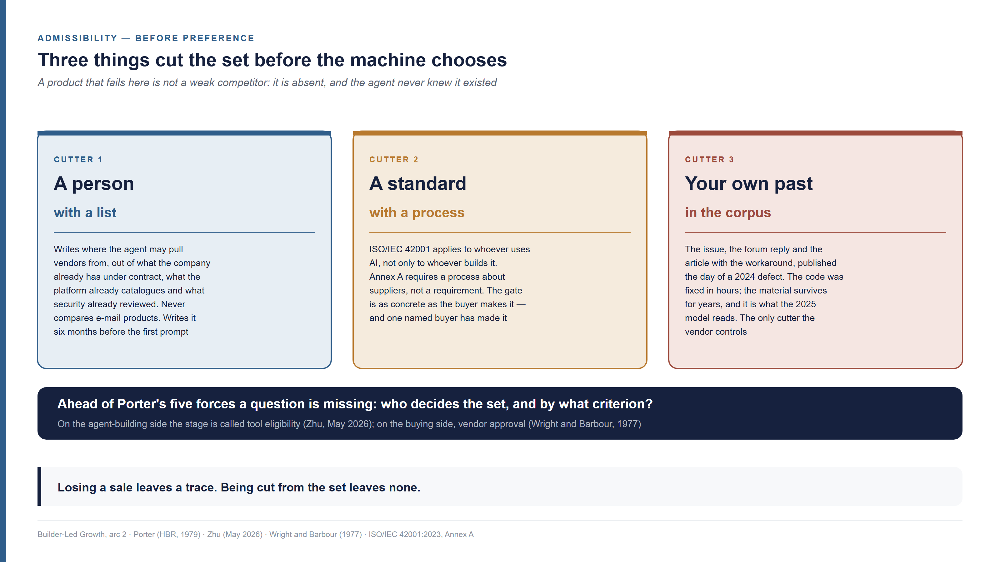
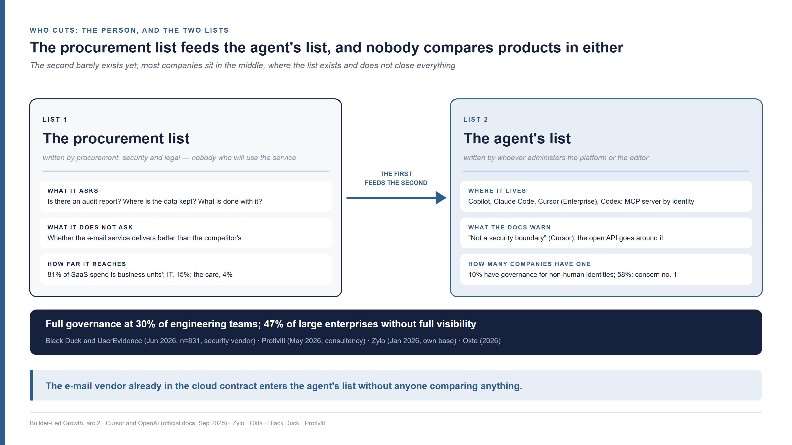
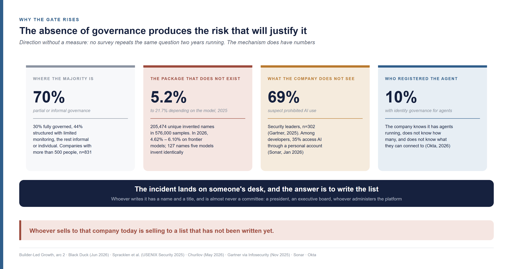
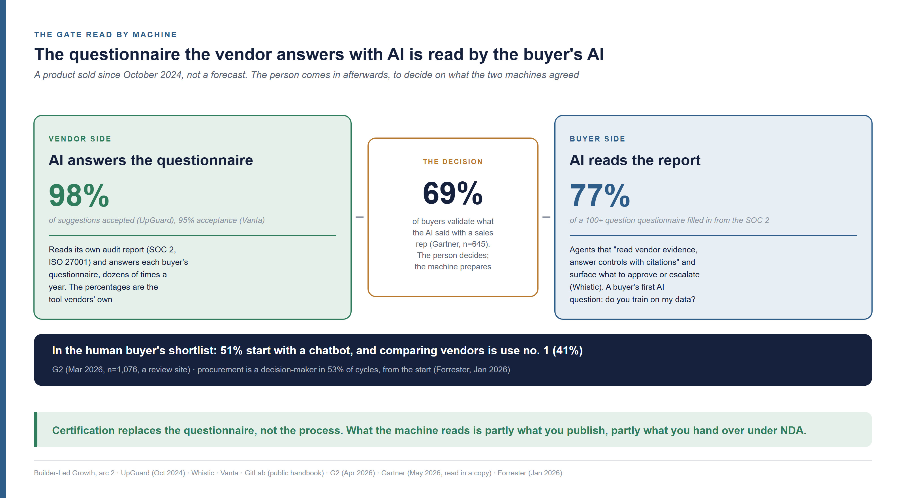
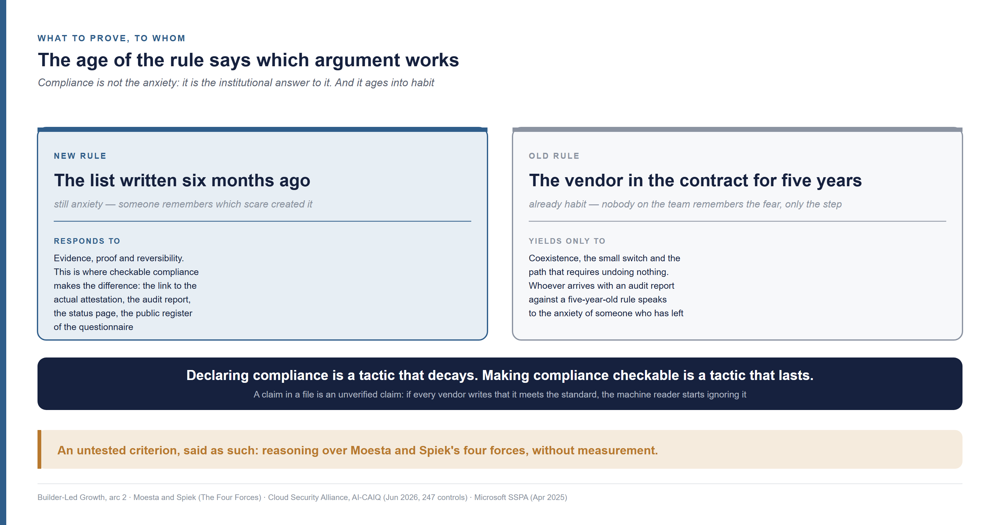

<!--
Arc 2, part 3 of the Builder-Led Growth series, by Matheus Ramos.
CANONICAL VERSION (English).
Portuguese counterpart: ../pt-br/arco2-03-compliance-a-lista-de-onde-a-ia-escolhe.md
Text frozen. Scheduled for LinkedIn on 2 October 2026.
Generated from the private working repository. Do not edit here.
-->

# Compliance in Builder-Led Growth — how to get on the list the AI is allowed to pick from

*Fourth piece of the second arc of this series. It does not require the earlier
ones. You know what losing a sale looks like: there is a proposal, there is a
competitor, there is a reason logged in the CRM. A company of 2,500 people built
its own CRM with AI, and the e-mail service working inside it was decided six
months before the first prompt, by someone who will never compare e-mail
vendors. If you sell one of them, nobody turned you down. You were never on the
list.*

---

## Where the vendor was when the list was written

Losing a sale leaves a trace. The sale in this story left none: the CRM's e-mail
service was decided by a list, months before anyone asked for a CRM, and the
vendor left out never knew there was a list. Before asking what makes the
machine prefer a product, one has to ask who decided which set it was allowed
to choose from. Three things cut: a person, with a list; a standard, with a
process; and whatever your own product left written on the internet the day it
failed.

The scene is the one from the previous piece of this series, with the table
turned once more. A company of 2,500 people needed a CRM with e-mail built in,
to track conversion metrics and follow up with customers. People do not forget
to chase a proposal; they give up after a few attempts, and the company wanted
the system to insist on their behalf. On a Tuesday, a developer asked the coding
agent to build the reminder dispatch. The agent wrote the code, and the e-mail
went out through a service nobody in that conversation chose. It was on a list
that a person in charge of AI governance had written six months earlier, to say
where the agent was allowed to pull vendors from.

If you sell transactional e-mail and you were not on that list, what happened to
you has no name in your CRM. No proposal was declined. No competitor won. The
person who wrote the list never compared your product with the one that got in,
because the list was not written by comparing e-mail products: it was written
from what the company already had under contract, what the platform already
catalogued, and what security had already reviewed. The developer never saw
your name, and neither did the agent, because the list reached it before the
prompt did.

Michael Porter published in 1979 the five forces that measure how much power
each side holds in an industry: rivalry, new entrants, substitutes, suppliers
and buyers
([Porter, Harvard Business Review, March 1979](https://hbr.org/1979/03/how-competitive-forces-shape-strategy)).
All five assume the competitors are already in the race and the question is how
much value each one captures. The CRM scene happens before that. A question is
missing ahead of the five: **who decides the set of options, and by what
criterion?** I call that stage **admissibility**, the moment where what is
disputed is being in the set, not being preferred within it. A product that
fails there is not a weak competitor: it is absent, and the agent never knew it
existed.

The stage already had a name on the side of those who build agents. Chenye Zhu,
an AI product manager, called *tool eligibility* the layer that decides which
tools an agent may use in a given situation, separate from selection:
eligibility answers "is this tool allowed in this state?", selection answers
"among the allowed ones, which does the model use?"
([Zhu, 23 May 2026](https://www.chenyezhu.com/writing/tool-eligibility-deterministic-guardrails-ai-agents/);
a personal blog post). The distinction is his. What he does not draw from it is
the consequence for whoever sells: the ineligible tool does not lose, it
vanishes. On the buyer's side the stage is older still: Peter Wright and
Fredrick Barbour described in 1977 the two-phase decision, a screening that
forms the set and a choice within it
([Wright and Barbour, 1977](https://www.gsb.stanford.edu/faculty-research/working-papers/phased-decision-strategies-sequels-initial-screening)).
Procurement calls the screening **vendor approval**, and approval comes before
the quote. The difference here is that the screening is not the buyer's, nor the
machine's that chooses: it belongs to a third party who writes the list and will
never take part in the choice.

## The list that cuts the agent is written by someone who does not choose

Whoever writes the procurement list will never compare your e-mail service with
the competitor's, and whoever administers the agent only decides which list it
may pull from. There are two lists, the first feeds the second, and the second
barely exists yet. What each one demands of the vendor is different, and most
companies sit in the middle, where the list exists and does not close
everything.

The **procurement list** is the older of the two. It is the register of approved
vendors: who has a signed contract, who passed the security review, who legal
has already read. It is written by procurement, security and legal, and it has a
property that matters for this piece: nobody who writes it will use the e-mail
service. The security person who approved the e-mail vendor does not know, and
does not need to know, whether it delivers better than the competitor. She knows
whether it has an audit report, where it keeps the data and what it does with
it.

The **agent's list** is the new one. It is the configuration that tells a coding
agent which servers, connectors and services it may connect to. The previous
piece of this series showed the apparatus: GitHub Copilot's internal registry,
Claude Code's managed file, the admin controls at Lovable and Bolt. The same
exists in the editor and in the terminal. Cursor has, on the enterprise plan
only, a dashboard where "enterprise admins can control which MCP servers users
may run", with entries by command pattern or by URL pattern, tool-by-tool
permissions and a toggle that decides whether the user may add servers outside
the list ([Cursor](https://cursor.com/docs/mcp)). OpenAI's Codex reads a
requirements file in which a list of servers by identity makes the client
"enable an MCP server only when both its name and identity match an approved
entry"; an empty list disables MCP altogether
([OpenAI](https://learn.chatgpt.com/docs/enterprise/managed-configuration)).
MCP is the *Model Context Protocol*, the protocol through which an agent
connects to external tools and services; the agent's list is, in practice, the
list of who may talk to it through that protocol.

The agent's list is written by whoever administers the platform or the editor,
and that person does not choose an e-mail vendor: she chooses among what the
procurement list has already approved and what the platform has already
catalogued. That is why the first feeds the second. The e-mail vendor that sits
in the contract of the cloud already under contract, or in the platform's
connector catalogue, enters the agent's list without anyone comparing anything.
What is outside both does not enter, and the machine receives the result as if
it were the whole world.

Except that the second list barely exists. According to Okta's annual report on
application use in companies, 10% of organisations have a governance strategy
for non-human identities, the category the agent falls into, and 58% name AI and
identity governance as their number one concern
([Okta, Businesses at Work 2026](https://www.okta.com/businesses-at-work/);
identity-vendor material, based on its own customer base). On the procurement
list side the picture is similar: 30% of engineering teams at companies with
more than 500 people describe their use of AI assistants as fully governed, 44%
as structured with limited monitoring, and the rest as informal or individual
([Black Duck and UserEvidence, 9 June 2026, 831 respondents](https://www.prnewswire.com/news-releases/ai-coding-hits-97-enterprise-adoption-new-black-duck-study-shows-governance-is-the-roi-multiplier-302794103.html);
an application-security vendor, with outsourced research). Nearly half of large
enterprises say they lack full visibility into how employees use AI
([Protiviti, 6 May 2026](https://www.protiviti.com/us-en/press-release-ai-pulse-half-enterprises-lack-ai-visibility);
a consultancy). The company of 2,500 people in the scene, with its list written
six months earlier, is in the minority that has already written one.

There is a figure that shows where the money actually flows. In the 75 billion
dollars of software spend under management at Zylo, business units control 81%
of the spend, IT controls 15%, and 4% goes on the corporate card without passing
through anyone; that 4% grew 267% in a year, and ChatGPT is the most expensed
application
([Zylo, 2026 SaaS Management Index, 29 January 2026](https://zylo.com/news/2026-saas-management-index);
a SaaS-management vendor, base restricted to its own customers). What I read in
those numbers is reasoning, not measurement: the procurement list governs a
slice of what the company uses, and the mechanism from the previous piece, in
which the agent chooses by corpus and by platform default, operates inside the
compliant company, in the spend the list does not reach.

That is the middle, where most companies sit. The list exists and does not close
everything. The editors' own documentation says so in plain words: Cursor's
permissions reference warns that the lists are "not a security boundary" and are
"best-effort convenience"
([Cursor](https://cursor.com/docs/reference/permissions)); Codex's warns that
the sandbox's network filtering does not reach MCP server traffic
([OpenAI](https://learn.chatgpt.com/docs/enterprise/managed-configuration)); and
the previous piece already showed that no list stops the agent from writing,
in code, a direct call to any service's API. For the e-mail vendor, the middle
has a practical consequence: the agent's list decides what may be connected by
protocol, and the corpus keeps deciding what may be imported by code. Whoever is
off the list can still get in through the second door, and whoever is on the
list can lose through the second door as well.

## What a standard decides when the one reading it is a machine

A buyer certified against an AI management standard has a mandatory process
about suppliers, and a process is a gate. The standard does not say what to
demand of you; it says a process must exist, and each buyer defines the rest.
One named buyer has defined it, and requires the standard of anyone supplying AI
for sensitive use.

The standard is ISO/IEC 42001, published in December 2023, the first
international standard for an artificial intelligence management system: for
AI, the equivalent of what ISO 27001 is for information security. It applies to
any organisation "providing **or using** products or services that utilize AI
systems", and it defines the impact assessment as a process of whoever is
"developing, providing or using" those products
([ISO/IEC 42001:2023, public sample of clauses 1 to 4](https://cdn.standards.iteh.ai/samples/81230/4c1911ebc9a641fcb6ee21aa09c28ad3/ISO-IEC-42001-2023.pdf)).
The word "using" is the one that matters for the scene: the company of 2,500
people that built its CRM with AI is within scope, even without developing a
single model.

What the standard says about suppliers sits in Annex A, the list of reference
controls. Control A.10.3 requires that "the organization shall establish a
process to ensure that its usage of services, products or materials provided by
suppliers aligns with the organization's approach to the responsible development
and use of AI systems"; A.10.2 requires responsibilities to be allocated
"between the organization, its partners, suppliers, customers and third parties"
([wording reproduced in Darktrace's public statement of applicability, 3 December 2025](https://cdn.prod.website-files.com/626ff4d25aca2edf4325ff97/6931b27220b329fdba170de2_Darktrace%20ISO%2042001%20Statement%20of%20Applicability.pdf);
the full text of the standard is paid). Notice the verb: the standard does not
require supplier certification, nor a report, nor a questionnaire. It requires
that a **process** exist, within the scope the company itself declared. The gate
is as concrete as the buyer makes it.

One buyer made it concrete. Microsoft's supplier assurance programme, in its
official guide of April 2025, says that "all suppliers providing AI Systems will
be required to provide Independent Assurance options", that ISO 42001 "can be
offered to validate compliance" and that it "is required for any AI sensitive
cases", with credit scoring, higher-education admission, medical diagnosis and
criminal justice on the list of sensitive cases
([Microsoft, Supplier Security and Privacy Assurance, version 11, April 2025](https://cdn-dynmedia-1.microsoft.com/is/content/microsoftcorp/microsoft/accex/documents/presentations/FY25-Program-Guide-v11_en-US.pdf)).
The requirement applies to whoever publishes the AI system, not to whoever merely
uses an assistant. It is a named buyer, with a date, turning the standard's
process into a purchasing requirement. Where that happens, admissibility has a
written form, and the vendor left outside knows exactly what was missing.

Two gaps stay in plain view. The first: nobody knows how many companies hold the
certification. There is no official register, and third-party estimates, adding
up announcements, run from "fewer than 50" in May 2025 to "more than 350" in
April 2026
([list maintained by AI Compliance Vendors, revised 17 May 2026](https://aicompliancevendors.com/blog/iso-42001-certified-companies-list);
a commercial aggregator). The names with dates are few and large: AWS in
November 2024
([AWS](https://aws.amazon.com/blogs/machine-learning/aws-achieves-iso-iec-420012023-artificial-intelligence-management-system-accredited-certification/)),
Anthropic in January 2025
([Anthropic](https://www.anthropic.com/news/anthropic-achieves-iso-42001-certification-for-responsible-ai)).
The second: the figures circulating in blogs about the share of buyers who will
require the standard by 2027 have no source anywhere, and I do not use them.

What the standard created, even without a count, is a vocabulary a machine can
read. The Cloud Security Alliance, the consortium that maintains the standard
cloud-security questionnaire, published in June 2026 version 1.1 of the AI
Controls Matrix, with 247 control objectives in 18 domains, mapped to ISO 42001,
the NIST AI RMF and the European AI Act, and the self-assessment questionnaire
that goes with it, the AI-CAIQ, can be filled in by the vendor and submitted to a
public register
([Cloud Security Alliance, AI Controls Matrix v1.1, 22 June 2026](https://cloudsecurityalliance.org/artifacts/ai-controls-matrix-v1-1)).
On the law's side, Article 25 of the European AI Act obliges the provider of a
high-risk system and "the third party that supplies an AI system, tools,
services, components, or processes" to specify, "by written agreement", the
information and technical access needed for compliance, with an exception for
open source ([AI Act, Article 25](https://ai-act-service-desk.ec.europa.eu/en/ai-act/article-25)).
Standard, questionnaire and law converge on the same point: what is asked of the
vendor is structured evidence, and structured evidence is what a machine reads
better than a person does.

## The defect fixed in hours that cuts you two years later

A person cuts with a list and a standard cuts with a process. The third cutter
is whatever became public about your product the day a defect appeared: the
issue, the forum reply, the article with the workaround. The code was fixed in
hours; that material survives for years. The next model reads the material, not
the code.

The mechanism has already appeared in this series from its good side. When I
wrote about community and validation signal, I showed that public material
about a product rises slowly in the training corpus and falls slowly. What
matters here is the bad side of the same property. A defect in your e-mail
service, on a Tuesday in 2024, produces that week three public things: the
issue opened in the repository, the forum question with someone's reply that
found a way out, and a developer's article explaining how to work around it. The
team fixes the defect on Wednesday. The three things stay on the internet, and
none of them is updated, because the defect no longer exists for whoever fixed
it.

The model that trains in 2025 reads all three. To it, your product has that
defect, and the workaround is to use something else. The agent that builds the
CRM in 2026, with no list in front of it, receives from the model the
instruction to work around a problem solved two years earlier. There was no
person, and no standard. What cut was your own past, without anyone in the
company knowing there had been a cut.

This is reasoning, not measurement: I found no study measuring how long a fixed
defect keeps being described as live by a model's answers. What has been
measured is the reproducibility of what the model learns wrong. In the largest
study of code packages invented by models, when the same request was repeated
ten times, 43% of the invented names reappeared in all ten runs
([Spracklen et al., USENIX Security 2025](https://arxiv.org/abs/2406.10279)).
What the model learned, it repeats consistently. That holds for the package that
does not exist, and it holds, by reasoning, for the defect that no longer does.

The consequence is actionable, cheap and rare: **fixing the code is not
enough.** When the defect has already produced public material, the issue has to
be closed with text saying what changed and in which version, the forum question
has to be answered in place, and the article has to be dated, or its author
asked to date it. Without that, the fix exists in the product and does not exist
for the machine. It is the only one of the three cutters the vendor controls
entirely, and that is why it is the first to fix.

## Why the list that does not exist today will exist tomorrow

In seven out of ten organisations, governance over AI tooling is partial or
informal. What changes that is not regulation: it is the agent proposing a
package that does not exist, and nobody in the company knowing how many agents
are running. The absence of governance produces the risk that will justify it,
and whoever writes the list after that is a person with a name and a title, not
a committee.

The seven out of ten come from the same survey as the earlier section: 30% of
teams describe their use of AI as fully governed, and the other 70% fall between
limited monitoring, informal guidance and individual adoption
([Black Duck and UserEvidence, 9 June 2026](https://www.prnewswire.com/news-releases/ai-coding-hits-97-enterprise-adoption-new-black-duck-study-shows-governance-is-the-roi-multiplier-302794103.html)).
I am not claiming a direction. No survey repeats the same question two years
running, and what exists as a series is not comparable. What can be described is
the mechanism that pushes an organisation from one side to the other, with
numbers.

The first is the package that does not exist. When an agent writes code it
imports libraries, and sometimes it imports one that never existed. The study by
Joseph Spracklen and colleagues, with 576,000 code samples from 16 models,
measured 5.2% invented packages in commercial models and 21.7% in open-source
ones, with 205,474 unique non-existent names
([Spracklen et al., USENIX Security 2025](https://arxiv.org/abs/2406.10279);
peer-reviewed). The re-evaluation of May 2026, on that year's frontier models,
measured between 4.62% and 6.10% over 199,845 prompts, and found 127 names that
five different models invent identically, of which 53 could still be registered
by anyone ([Churilov, 16 May 2026](https://arxiv.org/abs/2605.17062); an
independent researcher). The rate fell, and the risk stayed: a name that five
models invent alike is a name an attacker can register with malicious code
inside, and the next agent installs it. Seth Larson, of the Python Software
Foundation, coined the term for this in April 2025, *slopsquatting*
([Seth Larson](https://www.linkedin.com/in/sethmlarson/)).

The second number is what the organisation does not see. In a Gartner survey of
302 security leaders, between March and May 2025, 69% suspected or had evidence
that employees were using prohibited public generative AI
([Gartner, via Infosecurity Magazine, 20 November 2025](https://www.infosecurity-magazine.com/news/gartner-40-firms-hit-shadow-ai/);
the original release returned an access error, and the number was read in press
coverage). Among developers, 35% access AI tools through a personal account, not
a corporate one
([Sonar, State of Code 2026, 8 January 2026, more than 1,100 respondents](https://www.sonarsource.com/company/press-releases/sonar-data-reveals-critical-verification-gap-in-ai-coding/);
a code-analysis vendor). Okta's 10% with identity governance for agents, from
the earlier section, close the picture: the company knows it has agents running,
does not know how many, and does not know what they can connect to.

Put the two numbers together and the sequence explains itself. What follows is
reasoning, not measurement. The company without a list lets the agent import
whatever it wants. At some point it imports a name that does not exist, or
connects a service nobody reviewed, and the incident lands on someone's desk.
The answer is to write the list. **The absence of governance produces the risk
that will justify it.** Whoever sells to that company today is selling to a list
that has not been written yet, and the useful question is not whether it will
exist, but who will write it and from what.

The answer has a name and a title, and it is almost never a committee. When I
looked for companies publicly describing who decides which AI tools employees
may use, the decisions that came to light were leadership's: Microsoft's
president, Brad Smith, told a United States Senate hearing on 8 May 2025 that
"at Microsoft we don't allow our employees to use the DeepSeek app", because of
where the data sits
([TechCrunch, 8 May 2025](https://techcrunch.com/2025/05/08/microsoft-employees-are-banned-from-using-deepseek-app-president-says)).
Unilever describes a process in which every AI use case, including those bought
from vendors, goes through an assessment platform and "final decisions on AI use
cases are made by a senior executive board" with legal, human resources and
technology
([Davenport and Cartledge, MIT Sloan Management Review, 15 November 2023](https://sloanreview.mit.edu/article/ai-ethics-at-unilever-from-policy-to-process)).
The best-documented AI ethics committees govern the products the company itself
builds, not the vendor list. The pattern of "a centre of excellence that
approves tools" exists in the material of those who sell the deployment of such
centres, and I found no company describing its own in a first-party source. For
whoever sells, that changes the addressee: the list has a person behind it, or a
function, and that is where the evidence has to arrive.

## The gate that is also a machine reading

The machine became a customer because it chooses, and in compliance it became a
customer by another route: it reads the vendor's audit report and answers the
buyer's questionnaire. Comparing vendors is already the number one use of
chatbots among software buyers, and the decision still belongs to a person.

The market calls **TPRM**, *third-party risk management*, the set of steps by
which a company assesses a vendor before letting it touch its data. The central
instrument is the security questionnaire, and the central evidence is the
**SOC 2**, the independent audit report on a vendor's security controls, defined
by the American association of public accountants. An e-mail vendor that wants
onto a large company's procurement list answers that questionnaire and hands
over that report, and does so dozens of times a year, once per buyer. The buyer,
on the other side, reads dozens of reports from different vendors. The machine
does that kind of work well, and it is already doing it.

Both sides appeared in the same announcement, on 30 October 2024. UpGuard, which
sells a third-party risk platform, announced on the same day a feature for the
buyer, in which AI reads the vendor's SOC 2 and fills in about 77% of a
questionnaire of more than a hundred questions, and a feature for the vendor, in
which AI answers the buyer's questionnaire with 98% of suggestions accepted
([UpGuard, 30 October 2024](https://www.upguard.com/press/upguard-launches-enhanced-ai-powered-suite);
the percentages are the company's own). Whistic describes agents that "read
vendor evidence, answer controls with citations" and surface what the team needs
to approve or escalate, reading SOC 2, ISO and model cards
([Whistic](https://www.whistic.com/vendor-assessments); a vendor). Vanta, on
the vendor side, sells questionnaire answers with a 95% acceptance rate and, on
the buyer side, quotes a customer saying "the AI feature pulls out the most
important details so we don't have to spend time combing vendor documentation"
([Vanta](https://www.vanta.com/products/ai); a vendor). Nobody has named the
phenomenon, so I describe it without a name: **the questionnaire the vendor
answers with AI is read by the buyer's AI.** The person comes in afterwards, to
decide on what the two machines agreed.

What that machine asks first, when the vendor is an AI vendor, has already been
written down by a buyer. GitLab publishes its own vendor-approval process in the
company handbook, and in it the assessment of a vendor that uses AI starts by
establishing "whether the vendor uses GitLab or GitLab customer content for
developing, training, re-training, or fine tuning" models; a new AI feature that
adds a sub-processor is a material change and reopens the assessment
([GitLab, public handbook, read on 9 September 2026](https://gitlab.com/gitlab-com/content-sites/handbook/-/raw/main/content/handbook/security/security-assurance/security-risk/third-party-risk-management.md)).
The same handbook says what certification does and what it does not: for a
system that touches sensitive data, SOC 2 or ISO 27001 is the first-line
evidence, and whoever lacks it falls back to self-attestation by questionnaire.
**Certification replaces the questionnaire, not the process.** The e-mail vendor
with an audit report skips the exchange of spreadsheets; it does not skip the
review.

The machine reader is not only at the security gate. It is in the human buyer's
shortlist, with a number. In a G2 survey of 1,076 B2B software buyers, in March
2026, 51% start their research with an AI chatbot rather than a search engine,
against 29% a year earlier; **comparing vendors is the number one use, at 41%**;
69% say they chose a different vendor on the chatbot's guidance, and 33% bought
from one they did not know
([G2, 15 April 2026](https://www.prnewswire.com/news-releases/new-g2-research-half-of-b2b-software-buyers-now-start-their-research-with-ai-chatbots-302742807.html);
G2 is a review site and has an interest in AI citing reviews). Gartner, with 645
buyers between August and September 2025, measured 45% using generative AI in
the purchase, "primarily to gather information on vendors and products", and 69%
validating what the AI said with a sales rep
([Gartner, 20 May 2026, read in a full copy](https://www.marketscreener.com/news/gartner-survey-finds-69-of-b2b-buyers-turn-to-sales-reps-to-validate-ai-generated-insights-ce7f5ad9db8cf524);
the original release returned an access error). Forrester measures procurement
as a decision-maker in 53% of buying cycles, "from the start"
([Forrester, State of Business Buying 2026, 21 January 2026](https://www.forrester.com/press-newsroom/forrester-2026-the-state-of-business-buying/);
no public sample size).

Three things follow. The first: the compliance gate is already, in part, a
machine reading, in a product sold and not in a forecast. The second: the human
buyer's shortlist goes through a chatbot in four out of ten cases, and the
chatbot reads what is published about you. The third limits the other two: the
decision stays human. The 69% who validate with a sales rep is the same number
in two populations, and the buyer using a risk platform reads the words "you own
the decision" on screen. What the machine does at the gate is prepare the
decision, and what it reads to prepare it is partly what you published and
partly what you handed over under a non-disclosure agreement. The published part
is the one the vendor controls alone. The handed-over part is what
compliance has always asked for, and it now has one more reader.

## What to prove, to whom, and why it depends on the age of the rule

Declaring compliance in a file the machine reads is a tactic that decays.
Making compliance checkable, with evidence that can be verified without
believing you, is a tactic that lasts. The right argument depends on how old the
rule in front of you is, because an old rule is no longer anyone's fear. That is
where the sale nobody lost stops being a mystery.

If the gate reads the vendor's files, the vendor can put in them the evidence
that the product meets standard and specification, and the case for the
purchase arrives together with the product, without depending on a sales
conversation that may never happen. It is an old market practice, being close to
whoever writes the requirements before the tender exists, carried over to the
place where the machine reads. Except that the idea has a fragile version and a
durable one, and the difference between them separates the tactic that decays
from the one that lasts. A claim in a file is an unverified claim. If every vendor writes in its
own file that it meets the standard, the signal degrades, and the machine reader
starts ignoring it. The durable version is evidence that can be checked without
believing you: the link to the actual attestation, to the audit report, to the
status page, to the public register of the questionnaire. **Declaring compliance
is a tactic that decays. Making compliance checkable is a tactic that lasts.**
When I wrote about operational accessibility I called this verifiable and
reversible; here it is the same property, applied to what compliance asks for.

The addressee of that evidence is a person or a function: the public tool
decisions came from a president, from an
executive board, from whoever administers the platform. That is the person the
old practice said to seek out before the tender. The difference is that she now
reads, or has the machine read, and what she reads first is what the machine has
already summarised.

What that person feels while reading depends on something almost no vendor looks
at: the age of the rule. Bob Moesta and Chris Spiek described the four forces
acting on any switch, the push of what no longer serves and the pull of the new
on one side, the anxiety of change and the habit of what already exists on the
other ([Moesta and Spiek, The Four Forces](https://jobstobedone.org/the-four-forces/)).
Compliance is not the anxiety. It is the institutional answer to it: someone
feared a data leak, and the organisation wrote a rule to contain that fear. The
part that changes the tactic is what happens afterwards. A rule followed for two
years stops being fear containment and becomes routine; nobody on the team
remembers which scare created it, and what remains is the step. Compliance ages
into habit.

From that comes a criterion that is my reasoning and has not been tested: **the
age of the rule says which argument works.** A new rule is still anxiety, and it
responds to evidence, proof and reversibility; that is the case of the list
written six months earlier at the company in the scene. That is where checkable
compliance makes the difference. An old rule is already habit, and it yields only
to coexistence, to the small switch and to the path that requires undoing
nothing; that is the case of the e-mail vendor that has been in the contract for
five years, and against it the compliance argument speaks to the anxiety of
someone who has already left. Whoever arrives at an organisation with an audit
report against a five-year-old rule is answering a question nobody asks any
more. Whoever arrives with the same report at an organisation that wrote its
list six months ago is answering the only question there is.

The sale nobody lost now has three addresses. The e-mail service that entered
the CRM of the company of 2,500 people entered through a list written six months
earlier, from a contract that already existed and a review a machine helped to
do. The vendor left out was cut in three places, and in all three it had reach
without needing a sales conversation: it could have been in the contract of the
cloud the company already pays for, or in the platform's catalogue; it could have
had checkable evidence in the place where the buyer's machine reads; and it
could have closed, with date and version, the public material of the 2024 defect.
None of the three things is marketing, and none is selling. They are the three
ways of existing for a list that has yet to be written.

If the governance that does not exist yet is what produces the risk that will
justify it, then the list is being written right now in seven out of ten
organisations, and whoever makes compliance checkable before it rises buys a
cheap position. That settles admissibility. It does not settle the choice. Among
the vendors left in the set, what makes the machine prefer one, and how long that
preference lasts, is the subject of the next piece of this series.

---

**Builder-Led Growth series**, by Matheus Ramos. Second arc:

- [Arc 2, part 0: From PLG to BLG — what still holds when the one choosing is a pair](arc2-00-from-plg-to-blg.md)
- [Arc 2, part 1: The Builder-Led Growth funnel — the three stages and what makes a product move faster](arc2-01-the-funnel-and-the-delegation-axis.md)
- [Arc 2, part 2: Candidacy in Builder-Led Growth — how to get picked by an AI beyond GEO](arc2-02-candidacy-beyond-geo.md)
- Arc 2, part 3: Compliance in Builder-Led Growth — how to get on the list the AI is allowed to pick from (this text)
- [Agentic commerce and Builder-Led Growth — what changes for growth and engineering](arc2-07-agentic-commerce.md)

The first arc, for anyone who wants the full route:

- [Part 1 — When the machine is also your customer](01-when-the-machine-is-the-customer.md)
- [Part 2 — The decision, the price and what to measure](02-decision-price-and-measurement.md)
- [Part 3 — The tax the machine charges and the human never sees](03-machine-legibility.md)
- [Part 4 — How many times the agent has to call a human](04-operational-accessibility.md)
- [Part 5 — The well everyone drinks from](05-community-and-validation-signal.md)
- [Part 6 — The machine is press and reader at once](06-public-relations.md)
- [Part 7 — What makes an agent trust you, and why its competence is the problem](07-trust-and-safety.md)
