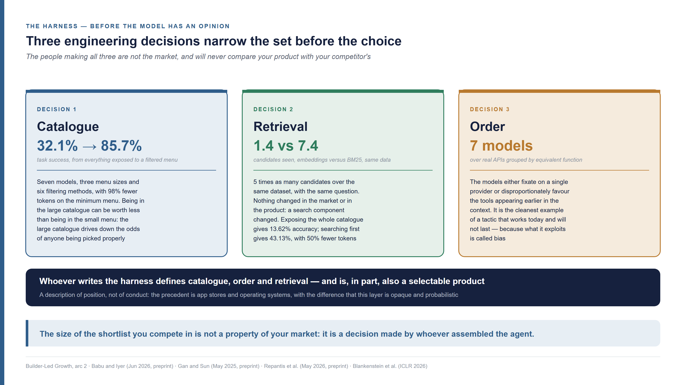
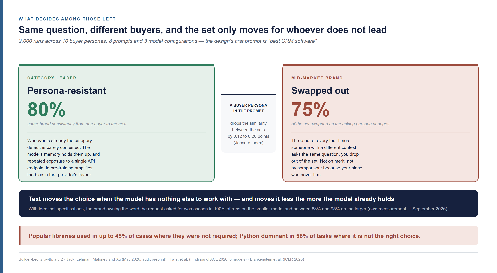
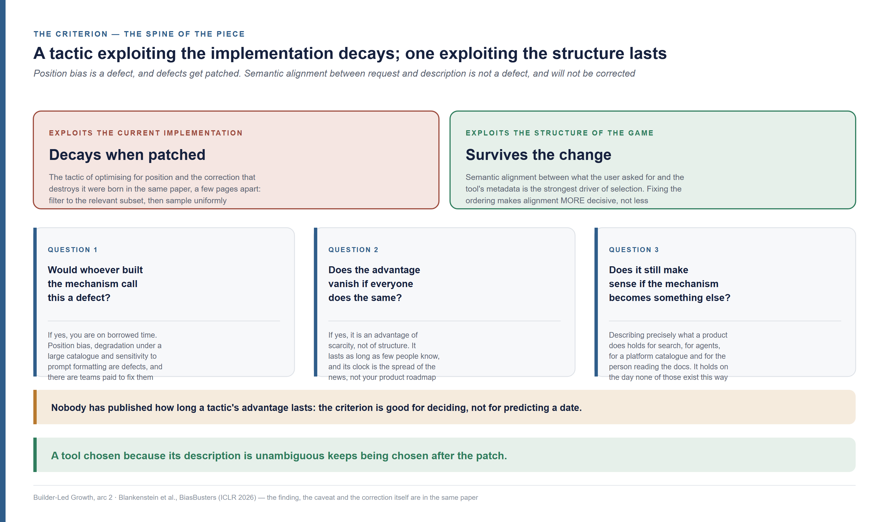
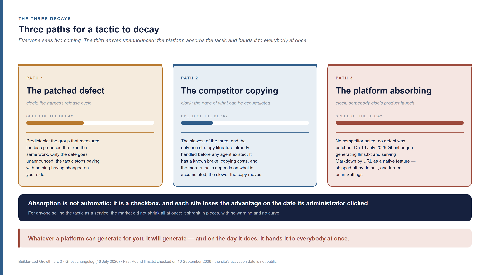
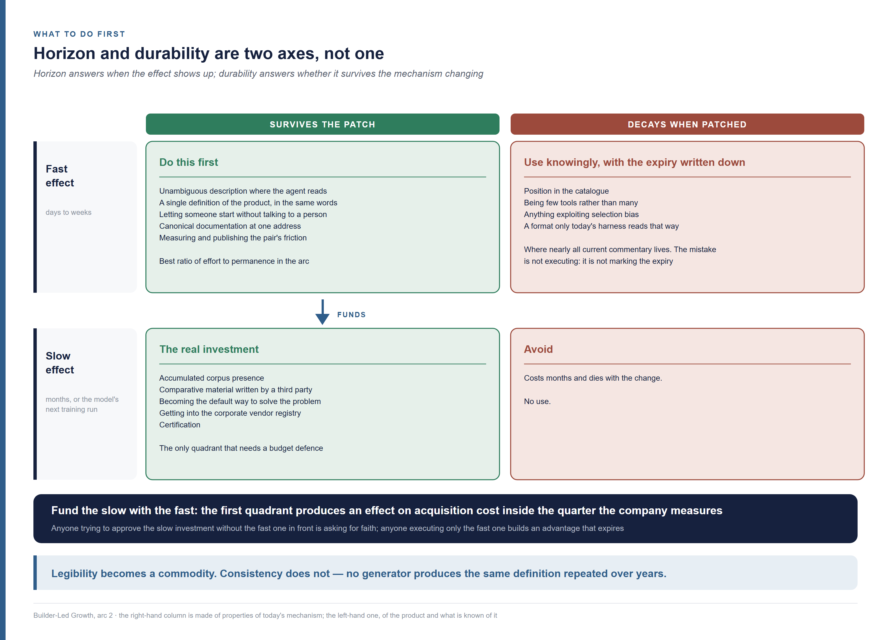

<!--
Arc 2, part 4 of the Builder-Led Growth series, by Matheus Ramos.
CANONICAL VERSION (English).
Portuguese counterpart: ../pt-br/arco2-04-recomendacao-a-tatica-que-dura.md
Text frozen. Scheduled for LinkedIn on 14 October 2026.
Generated from the private working repository. Do not edit here.
-->

# Recommendation in Builder-Led Growth — telling the tactic that lasts from the one that gets patched

*Fifth piece of the second arc of this series. It does not require the earlier
ones. Your product made it onto the list the AI agent picks from, and so did your
competitor's. In a company of 2,500 people, with both available, the agent took
your competitor — and the reason it wrote down said nothing about the product it
chose, it described the text published about it. Six months later, the winner
stopped winning without a single competitor doing anything.*

---

Over the last decade, people selling software learned to grow by persuading
people. First with ads, content and salespeople. Then by letting the product
itself do that work, in what the market calls **PLG**, product-led growth: the
person tries it, sees the value on their own, and decides. The term was
popularised in the mid-2010s by OpenView, with
[Blake Bartlett](https://www.linkedin.com/in/blakebartlett), and codified in a
book by [Wes Bush](https://www.linkedin.com/in/wesbush) in 2019.

**BLG** is builder-led growth, the name I gave in July 2026 to a phenomenon that
does not fit that model: **a code agent recommends or adopts your tool while
building something else.** A developer asks Claude Code, Codex or Cursor to build
a system, and the agent, halfway through the work, picks the e-mail service, the
database, the payments library. Nobody ran a vendor selection. The decision was
made by what I call the builder. A builder is the pair: the person and the agent
together.

In this series, a product's route into a project has three stages. In
**candidacy**, the product is in the set the agent picks from. In
**construction**, it has entered the code, and it can still be taken out. In
**adoption**, it has become a premise of what was shipped, and taking it out costs
a refactor. Inside candidacy a force acts that the market calls
**recommendation**: among the products in the set, which one the agent picks.

Anyone working in growth already has tools for moving recommendation. In search,
it is called SEO, *search engine optimization*. In AI assistants' answers, it is
called GEO, *generative engine optimization*, a term coined by Pranjal Aggarwal
and co-authors in November 2023
([arXiv 2311.09735](https://arxiv.org/abs/2311.09735)). Both come with lists of
tactics, and the lists mix two kinds that look alike. Some tactics take advantage
of a defect in today's agent, and in this industry a defect has a team paid to
fix it. Others take advantage of the way the choice works, and they keep holding
after the fix.

This text brings three answers. What decides the agent's choice before the model
has an opinion, and who has the edge among the products in the set, with the
numbers from six studies published between 2025 and 2026. A three-question
criterion for telling whether a tactic will last, and the three paths by which it
loses value. A grid for deciding what to do first, with the arithmetic that
defends a budget for what takes time to pay.

## Where the vendor was when the set was assembled

An agent's choice does not begin at the model. Before it sees any name at all,
three engineering decisions have already narrowed the set: how many tools go into
the **catalogue**, what **order** they appear in, and which component does the
**retrieval**, that is, goes and fetches the options and puts them in front of
the model. All three live in the **harness**, the market's word for the apparatus
that assembles and runs the agent around the model — and some of the companies
writing harnesses also sell products that harness can pick.

The company in this story has 2,500 people. The case is a composite, assembled
from published patterns, and it runs through the latest pieces of this series. It
built its own CRM with a coding agent. Someone responsible for AI governance had
written, months earlier, the list of vendors the agent was allowed to pull from.
Your product is on it. So is your competitor's. On a Tuesday, the developer asks
for the e-mail reminder dispatch, the agent writes the code, and the e-mail goes
out through your competitor.

You can read the reason, because the agent writes the reason down. It does not
say "more popular". It says "simple to integrate" and "good deliverability" —
attributes, wearing the face of analysis. Nobody measured deliverability in that
conversation. The agent did not open your documentation, did not compare prices,
did not run a test. It produced a justification after it had already chosen, and
the choice came from something that preceded the question.

That something is the harness. It decides what the agent may call, what order it
sees the options in, what gets fetched and placed in front of it before it
answers. Claude Code, Codex and Cursor are harnesses. The assisted-build platform
that produces a whole application in the browser is a harness. Anyone
configuring any of the three inside a company is writing harness too. Each of
those layers touches the set before the model has an opinion.

The first decision is the **catalogue**: how many tools stay visible. Its effect
is larger than it looks. Across seven models, three tool-menu sizes and six
filtering methods, task success went from 32.1% with every tool exposed to 85.7%
when a filter cut the menu to the minimum needed, using roughly 98% fewer tokens
([Babu and Iyer, 13 June 2026](https://arxiv.org/abs/2606.15508); preprint, not
yet peer-reviewed). The same model, with the same request, gets it right two and
a half times more often when it sees fewer options. For anyone selling, the
reading is uncomfortable: **being in the large catalogue can be worth less than
being in the small menu**, because the large catalogue drives down the odds of
anyone being picked properly.

The second decision is **retrieval**: which component goes and fetches the
options. Two numbers measure it. The first is coarse and the easiest to explain:
exposing the whole catalogue to the model produced 13.62% tool-selection
accuracy, while searching first and showing only what matters produced 43.13%,
with over 50% fewer prompt tokens
([Gan and Sun, 6 May 2025](https://arxiv.org/abs/2505.03275); preprint). The
second is finer, and it is what decides the size of the contest. In work
measuring
how long the shortlist shown to an agent ought to be, the authors ran the same
dataset through two different search components. With an embedding retriever —
which compares meaning — the learned depth was **1.4 candidates**. With BM25 —
which compares words — it was **7.4**
([Repantis, Gawde, Singh and Blackwell II, 23 May 2026](https://arxiv.org/abs/2605.24660);
preprint, and the authors state that their scope is only whether the right tool
**appears** in the set, not whether execution is correct).

Five times as many candidates, over the same data, with the same question.
Nothing changed in the market, in your product, or in what the user asked for. A
piece of engineering inside the harness changed. **The size of the shortlist you
compete in is not a property of your market: it is a decision made by whoever
assembled the agent**, and that person will never compare your product with your
competitor's.

The third decision is **order**. Across seven models, over a bank of real APIs
grouped by equivalent function, the models either fixated on a single provider or
disproportionately favoured the tools appearing earlier in the context
([Blankenstein and co-authors, ICLR 2026 camera-ready](https://arxiv.org/abs/2510.00307);
peer-reviewed, with the APIs scraped from a real repository and the queries
model-generated). Order is also the cleanest example of a tactic that works today
and will not last.

That leaves who makes the three decisions, and the answer is structural. The labs
building the models hold a position no other participant holds: they are, at the
same time, **a product that can be selected and the builders of the mechanism
that selects**. Whoever writes the harness defines catalogue, order and
retrieval — the three forces above.

This is a description of position, not of conduct, and the distinction matters. A
platform owner who also sells inside their own platform is an old situation, with
precedent in app stores and in operating systems, and decades of regulation and
case law dealing with it. What differs here is the nature of the layer: an app
store shelf can be audited from outside — you can open it, sort it, compare it.
An agent's selection layer is opaque and probabilistic. The same question, on the
same day, can return different sets, and there is no shelf to photograph.

## Whoever is already the category default is barely contested

Among those left in the set, whoever is already the category default is barely
contested. The same question, asked by different people, swaps as much as three
quarters of the recommended brands for anyone sitting mid-market and almost none
for whoever leads. The text you write moves the model's choice, and it moves it
less the more that model already holds about your category.

The number comes from an audit that uses, as its example, exactly the case of
this series. Four researchers ran 2,000 executions across 10 buyer personas, 8
prompts and 3 model configurations, to measure how much the context of the person
asking changes the list of brands that comes back. The design's first prompt is,
word for word, *"best CRM software"* — the same thing the company of 2,500 people
set out to build for itself.

The result has two halves, and the second is the one that matters to anyone
selling. Prefixing the message with a buyer persona drops the similarity between
the recommended sets, on an overlap measure called the Jaccard index, by 0.12 to
0.20 points. The effect, though, is **not the same for everyone**: category
leaders are persona-resistant, holding around **80%** same-brand consistency from
one buyer to the next, while mid-market brands swap up to **75%** of the set as
the persona changes
([Jack, Lehman, Maloney and Xu, 28 May 2026](https://arxiv.org/abs/2605.30207);
audit preprint, and one of the three measured cells rests on only 4 prompt
clusters, with a correspondingly wider confidence interval).

Read that again from the position of someone who does not lead. Three out of
every four times a person with a different context asks the same question, you
drop out of the set. Not on merit, not by comparison, not because someone
preferred another. Because your place in the set was never firm.

The same asymmetry shows up when the agent picks a library instead of a brand. In
the first empirical study of model preferences between libraries and programming
languages, covering eight models, widely adopted libraries were used in up to
**45%** of cases where the use was not required and diverged from the reference
solution; in high-performance tasks where Python is not the right choice, it
remained the dominant choice in **58%** of cases, and Rust was not used a single
time
([Twist, Harman, Syme, Noppen, Yannakoudakis, Nauck and Zhang, Findings of ACL 2026](https://arxiv.org/abs/2503.17181);
peer-reviewed, version of 4 June 2026). The authors' conclusion is short: models
may prioritise familiarity and popularity over suitability and task-specific
optimality.

The piece that completes the mechanism sits in the study by Blankenstein and
co-authors, the same one that measured the effect of order. Repeated exposure to a single API endpoint during
pre-training **amplifies the bias in that provider's favour**
([Blankenstein and co-authors, ICLR 2026](https://arxiv.org/abs/2510.00307)).
Which is to say: the material that piles up about you on the internet over years
does not sit still waiting to be read at the moment of choice. It enters the
formation of the set, from inside the model, before any harness. Whoever has
volume wins twice — in what the model brings from memory, and in the weight it
gives to what is placed in front of it.

There is a counterweight, and it is what keeps the contest open for whoever does
not lead. On 1 September 2026 I ran an experiment with four fictitious e-mail
providers, ones the model had never seen, with identical specifications — same
price, same limits, same API — differing only in the brand paragraph. When the
request said no e-mail could fail to arrive, the brand whose text promised
reliability won. When it asked for speed, the one promising simplicity won. That
held in 100% of runs on the smaller model and between 63% and 95% on the larger
one. **Text moves the choice when the model has nothing else to
work with.** What the persona audit adds is the limit on that: text moves less
the more the model already holds about the category. Two forces on the same
scale, and for anyone who is not the leader the scale tips the wrong way.

The honest answer to "what makes the machine prefer one?", then, is
uncomfortable and comes in two parts. **If you are already the category default,
almost nothing moves the choice against you. If you are not, almost everything
moves it — including against you.** The second part is where most products sit,
and where the choice of tactic decides the outcome.

## How to tell whether you are exploiting a defect

Appearing early in the list of tools the agent reads raises the odds of being
picked. The tactic works today, it is measured across seven models, and it will
not last long — and you can tell that before investing in it with a single
question: does the tactic depend on the agent being implemented the way it is
today, or on the structure of the game? Position bias is a defect, defects get
patched, and an unambiguous description keeps winning after the patch.

In practice, the tactic becomes a fight for position: being among the first
integrations a platform catalogue shows, or among the first tools declared in the
configuration the agent receives. Someone who works in growth reads the result by
Blankenstein and co-authors on order and sees a channel in it. The tactic is
cheap, it charts beautifully, and it **is going to die**.

It is going to die because nobody who builds agents considers this a desirable
property. It is called bias, and the same group that measured it proposed, in the
same work, the fix: filter the tools down to the relevant subset and then sample
uniformly among them, which substantially reduces selection bias without losing
task coverage
([Blankenstein and co-authors, ICLR 2026](https://arxiv.org/abs/2510.00307)).
The tactic of optimising for position and the correction that destroys it were
born in the same paper, a few pages apart.

Now set the study's other finding beside it: the **semantic alignment between
what the user asked for and the tool's metadata — name, description and
parameters — is the strongest driver of selection**. Nobody is going to fix that.
It is not a defect. It is the mechanism working: the agent has to match a need to
a description, and a description that states precisely what a tool does remains
the best description after any bias patch. Fixing the ordering makes semantic
alignment **more** decisive, not less.

Out of that comes the criterion I hold to:

> **A tactic that exploits the current implementation decays when the
> implementation changes. A tactic that exploits the structure of the game
> survives the change.**

Three questions apply the criterion to any tactic you come across, and all three
answer in minutes:

- **Would whoever built the mechanism call this a defect?** If yes, you are on
  borrowed time. Position bias, degradation under a large catalogue and
  sensitivity to prompt formatting are defects, and there are teams paid to fix
  them.
- **Does the advantage vanish if everyone does the same thing?** If yes, it is an
  advantage of scarcity, not of structure. It lasts as long as few people know,
  and its clock is the spread of the news, not your product roadmap.
- **Does the tactic still make sense if the mechanism becomes something else?**
  Describing precisely what a product does holds for search, for agents, for a
  platform catalogue and for the person reading the documentation. It holds on
  the day none of those exist in their current form.

One limit has to be stated plainly, because more research will not settle it
right now. **Nobody has published how long a tactic's advantage lasts in this
market.** There is no measurement of how many months separate "found it" from "it
stopped working", and no historical series tracking a tactic from start to
finish. Everything this text says about durability is reasoning resting on
mechanism, not on a number. The criterion above is good for deciding; it is not
good for predicting a date.

## Three paths for a tactic to decay

A tactic loses value by three paths: the defect it takes advantage of gets
patched, the competitor copies it, or the platform you publish on starts doing the
tactic for everybody. Everyone sees the first two coming. The third arrives
unannounced, because it depends on nobody acting against you: the platform
absorbs the tactic, generates what you were doing by hand, and hands it to
everybody at once, in a product launch. On 16 July 2026 that happened to one of
the files that people working on machine legibility — the machine's ability to
read, understand and use your product without ambiguity — had been recommending
others publish.

The **first path** is the patched defect, and its clock is the release cycle of
whoever builds the harness. The patch is predictable, because the group that
measured position bias proposed the fix in the same work. Only the date goes
unannounced: the tactic stops paying, and the metric falls with nothing having
changed on your side.

The **second path** is the competitor copying. It is the slowest of the three and
the only one that strategy literature already handled before any agent existed.
It has a known brake: copying costs, and the more a tactic depends on something
accumulated — corpus presence, third-party material, track record — the slower
the copy moves.

The **third path** has no counterpart in the other two, and it is the fastest.
The platform you work on top of embeds the tactic and starts delivering it ready
to all of its customers on the same day. No competitor acted. No defect was
patched. Your advantage evaporates through somebody else's product launch.

The case is concrete and it has a date. `llms.txt` is a file placed at a site's
root holding an index of the content in a format the machine reads without
effort — one of the items that people working on machine legibility had been
recommending others publish. Doing it by hand is work: it means generating the
index, keeping it current, and serving every page in a clean version. On **16
July 2026** Ghost, the content manager many publications run on, began offering
this as a native feature: with the toggle on, the system generates `llms.txt` at
the domain root and serves the Markdown version of any post when `.md` is
appended to the URL. Only public content goes in; a subscriber post appears with
title and excerpt, without the body
([Ghost, 16 July 2026](https://ghost.org/changelog/geo/)).

You can watch the result working. First Round Review, a venture firm's
publication, serves the file today, and the file introduces itself: *"Public
Ghost content for AI and LLM tooling"*, with the instruction to append `.md` to
any URL ([First Round](https://review.firstround.com/llms.txt), checked on 16
September 2026). The publication did not build that. Its platform did. The date
that particular site flipped the toggle is not public, and I could not confirm
it.

One detail of the launch changes the shape of the decay, and it sits in Ghost's
own wording: the feature **ships off by default** for sites that already existed,
and is turned on in Settings. Absorption, then, is not automatic — it is a
checkbox. That makes it instant and free for whoever turns it on, and uneven
across sites: each one loses the advantage on the date its administrator clicked,
not on the date of the launch. For anyone selling the tactic as a service, the
market did not shrink all at once; it shrank in pieces, with no warning and no
curve.

The e-mail vendor that won on that Tuesday won because its description matched
what the request was asking for. Six months later, the platform catalogue started
writing the description in the vendors' place, and the e-mail services in that
category all began appearing with the same sentence — in a platform catalogue the
description tends to belong to whoever catalogues, and there are catalogues where
two direct competitors receive identical text. The sentence the winner had
written stopped being its own. Nobody removed it from the list: it is still
there, with the same delivery quality, and it stopped being picked. Whoever was
building an advantage on that paragraph found out the paragraph was not an asset
— it was a window.

That is the general form, and it holds well beyond one file or one catalogue
field. **Whatever a platform can generate for you, it will generate — and on the
day it does, it hands it to everybody at once.**

## Horizon and durability decide what to do first

When everything looks urgent, what gets done first is what is fast and durable at
the same time. Horizon answers when the effect shows up; durability answers
whether it survives the mechanism changing, and they are two axes, not one.
Crossed, they give four quadrants, and only one of them needs a budget defence.

The confusion those two axes undo is common and expensive. The market tends to
order tactics by speed, in a queue running from what pays inside the quarter to
what pays the following year, and inside that queue treats everything fast as
equivalent. It is not. A fast tactic that dies at the next harness and a fast
tactic that keeps holding afterwards cost about the same and deliver different
things.

**Horizon** is when the effect shows up: days and weeks on one side, months or the
model's next training run on the other. **Durability** is whether the effect
survives when the mechanism changes, and what answers for it is the question
about implementation or structure. Every tactic occupies one cell, and the cell says what to
do with it.

The **fast and durable** quadrant is where you start, with no middle ground and
no consolation. It is the best ratio of effort to permanence in this whole arc: it
costs an afternoon and keeps holding after any harness patch. Describing without
ambiguity what the product does, in the place the agent reads, belongs here.
Having a single definition of the product, in the same words everywhere, belongs
here too. Letting someone start without talking to a person, likewise.

The **fast and ephemeral** quadrant is where nearly all the current commentary on
this subject lives. It works, it is easy to demonstrate, and it decays — position
in the catalogue, anything exploiting selection bias, and whatever depends on a
format only today's harness reads that way. It is not to be avoided: it is to be
**used knowingly**, with the expiry date written next to the target. The mistake
is not executing; it is executing without marking the horizon and then planning
the year on top of the result.

The **slow and durable** quadrant is the real investment. Accumulated corpus
presence, comparative material written by a third party, becoming the default way
to solve a problem, getting into the corporate vendor registry, obtaining
certification. **It is the only quadrant that needs a budget defence**, and the
reason is arithmetic: its effect does not show up inside the horizon the company
uses to assess investment. It is what finance calls the *competitive advantage
period* — the time during which a company sustains returns above its cost of
capital. Michael Mauboussin and Paul Johnson called it, in the title of the paper
that introduced it in 1997, the neglected value driver
([Mauboussin and Johnson, Financial Management, 1997](https://www.jstor.org/stable/3666168);
[Michael Mauboussin](https://www.linkedin.com/in/michael-mauboussin-12519b2)).

The **slow and ephemeral** quadrant costs months and dies with the change. It has
no use.

The practical recommendation closing all four is one line, and it is the one I
would use in a budget conversation: **fund the slow with the fast**. The tactics
in the first quadrant produce a measurable effect on acquisition cost inside the
quarter the company already measures, and it is with that result in hand that the
request for the part which only pays later gets supported. Anyone trying to
approve the slow investment without the fast one in front is asking for faith;
anyone executing only the fast one is building an advantage that expires.

The arithmetic behind that request fits in four lines, and none of them needs a
new tool. First: how many projects started using your product this quarter
without anyone in sales talking to whoever built them — the denominator of
candidacy, which comes out of your own first-use log. Second: how many of them
named the product in the request and how many received it from the agent, which
separates by asking in the first interaction and costs one field. Third: the cost
of the fast tactic that produced the second number, which is the time of whoever
wrote the description and the documentation, in hours. Fourth: the first two
divided by the third, compared against the acquisition cost of the channel the
company already funds.

What that arithmetic does in a budget conversation is shift the burden. Without
it, the request for the slow investment is a thesis about the future, and a
thesis about the future loses to a number about the present in any committee.
With it, the slow investment becomes the continuation of a channel that has
already demonstrated a cost per project, and the discussion stops being "does
this work?" and becomes "how much more". It is the same crossing product-led
growth made when it started measuring activation instead of arguing about it.

One caveat I cannot remove: the four lines measure what came in, and they do not
measure what did not. Anyone discarded before first use appears in no log at all,
and an acquisition cost calculated this way is optimistic by construction. No
public instrument today measures the entry that did not happen, and until one
exists, the arithmetic is good for defending a budget and not good for sizing a
market.

## The push nobody is measuring

No description moves a pair that is not looking for anything. Push cannot be
manufactured — breaking what someone already uses is not a tactic — but it
usually already exists without being noticed, and revealing it is the only tactic
that grows stronger over time instead of decaying.

Bob Moesta and Chris Spiek described the four forces acting on any switch: the
push of what no longer serves and the pull of the new on one side, the anxiety
about the change and the habit of what already exists on the other
([Moesta and Spiek, The Four Forces](https://jobstobedone.org/the-four-forces/);
[Bob Moesta](https://www.linkedin.com/in/bobmoesta)). The line from the source
that matters most here is literal: **without push, there is no search**. All the
work on description, catalogue and retrieval acts on the pull. If the push is not there, it acts on nobody.

Push cannot be manufactured honestly, because manufacturing it would mean
breaking what the person already uses. What can be done is something else, and it
is underused: **the push almost always already exists and is not being noticed**.
The team has lived with the friction long enough to stop counting it as a cost.
Revealing that friction, with a number, is the work.

Three ways to reveal it, and all three are measurable by whoever is on the other
side:

- **Count the stops.** Over seven working days, how many times did the agent have
  to call a human because of the current tool? Almost nobody measures this, and it
  is a number that stings when it shows up, because every stop has a name and a
  timestamp.
- **Publish a reference that allows self-diagnosis.** Not a comparison of your
  product against a competitor's — a measure of friction anyone can apply to their
  own environment and get a result about themselves.
- **Show the cost of rework.** How much token spend, time and human correction
  the current path consumes per delivery. It is the same arithmetic the company
  already does for infrastructure, applied to the tool.

One rule separates this from advertising, and it admits no adjustment: **the
instrument has to work even for someone who is not going to switch vendors**. If
the measure only produces a flattering result when it points at you, it is a
comparison in disguise, and whoever receives it notices on the first run.

Notice where this tactic falls on the grid, because it is the only one that does
not fit any of the four quadrants the expected way. It does not depend on any harness's current implementation. It does
not vanish if a competitor copies it, because a second friction-measurement
instrument in the market only reinforces the practice of measuring. **No platform
can absorb it**, because there is nothing to generate: the measure lives in the
customer's environment, not on your site. It is the only thing here that grows
stronger over time, as more people measure and the number becomes common
language.

## What no platform generates for you

Once the platform generates everything it can generate, one thing is left. The
file is generated; its content is not. No generator knows whether the definition
of your product is phrased five incompatible ways across your pages, and that is
why legibility becomes a commodity and consistency does not.

Every tactic in this market falls into one of the four cells, and the division
looks like this:

In the column of tactics that decay sit position in the catalogue, being a few
tools instead of many, whatever exploits selection bias, and the format only
today's harness reads that way. Everything there is a property of today's
mechanism. In the column of those that survive sit an unambiguous description, a
single definition of the product, accumulated corpus presence and certification.
Everything there is about your product and about what is known of it, and none of
it changes when the harness changes version.

Absorption by the platform cuts that grid on the diagonal, and that is where it
stops being frightening. What a platform can generate is whatever has a
predictable shape: an index, a file, a catalogue field, a clean version of a page.
All of that is **legibility**, and legibility becomes a commodity for the same reason anything generatable does: on the day the
generator exists, everyone has it.

What no generator produces is **consistency**: the same definition of the product,
in the same words, across everything published about it. The platform knows how
to list your pages. It does not know whether, across those pages, you described
yourself in five ways that do not match — and those five descriptions reach the
model as five voices competing for the same slot. Consistency is not generatable
because it is not a format: it is a decision, repeated over years, about what the
company says it is.

Two measured results sustain that difference. Semantic alignment between the request and the
description is the strongest driver of selection, and it will not be corrected
because it is not a defect. Repeated exposure forms the preference inside the
model before any harness. Both reward whoever says the same thing the same way
for long enough. No checkbox delivers that.

Being preferred is not being adopted. The product chosen on a Tuesday can be swapped out on the Thursday with
nobody cancelling anything, with no meeting, with no note in the CRM — the
project simply starts using something else, and the discard leaves no metric.
What holds a product in place after it has already been chosen, and why relying
on the machine alone does not produce a better outcome, is the subject of the next
piece of this series.

---

**Builder-Led Growth series**, by Matheus Ramos. Second arc:

- [Arc 2, part 0: From PLG to BLG — what still holds when the one choosing is a pair](arc2-00-from-plg-to-blg.md)
- [Arc 2, part 1: The Builder-Led Growth funnel — the three stages and what makes a product move faster](arc2-01-the-funnel-and-the-delegation-axis.md)
- [Arc 2, part 2: Candidacy in Builder-Led Growth — how to get picked by an AI beyond GEO](arc2-02-candidacy-beyond-geo.md)
- [Arc 2, part 3: Compliance in Builder-Led Growth — how to get on the list the AI is allowed to pick from](arc2-03-compliance-the-list-the-ai-picks-from.md)
- Arc 2, part 4: Recommendation in Builder-Led Growth — telling the tactic that lasts from the one that gets patched (this text)
- [Agentic commerce and Builder-Led Growth — what changes for growth and engineering](arc2-07-agentic-commerce.md)

The first arc, for anyone who wants the full route:

- [Part 1 — When the machine is also your customer](01-when-the-machine-is-the-customer.md)
- [Part 2 — The decision, the price and what to measure](02-decision-price-and-measurement.md)
- [Part 3 — The tax the machine charges and the human never sees](03-machine-legibility.md)
- [Part 4 — How many times the agent has to call a human](04-operational-accessibility.md)
- [Part 5 — The well everyone drinks from](05-community-and-validation-signal.md)
- [Part 6 — The machine is press and reader at once](06-public-relations.md)
- [Part 7 — What makes an agent trust you, and why its competence is the problem](07-trust-and-safety.md)
