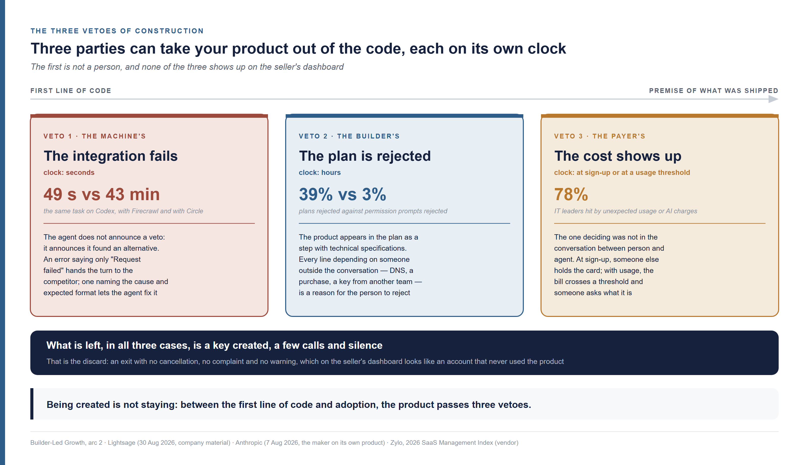
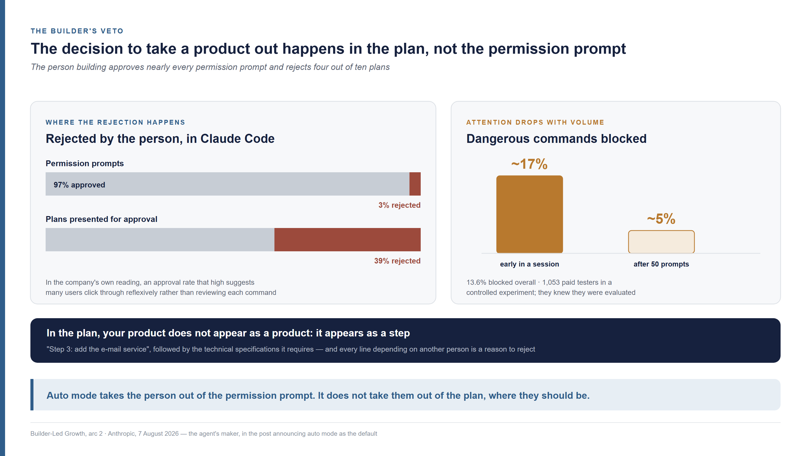
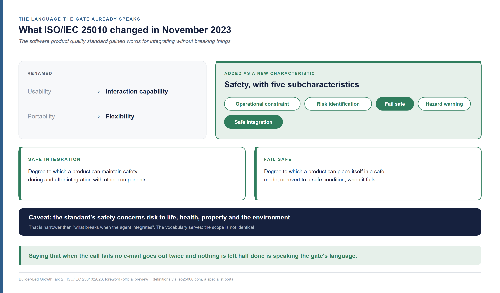
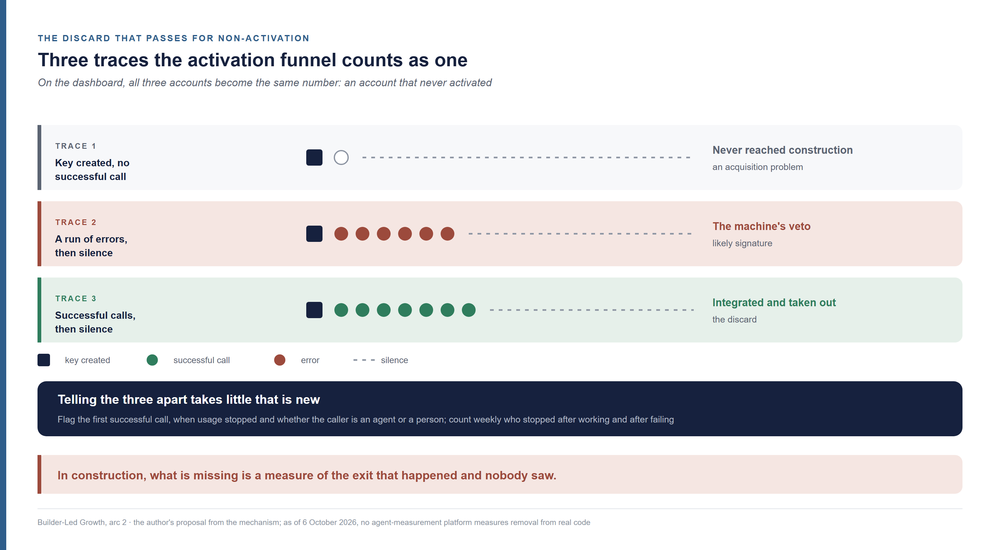
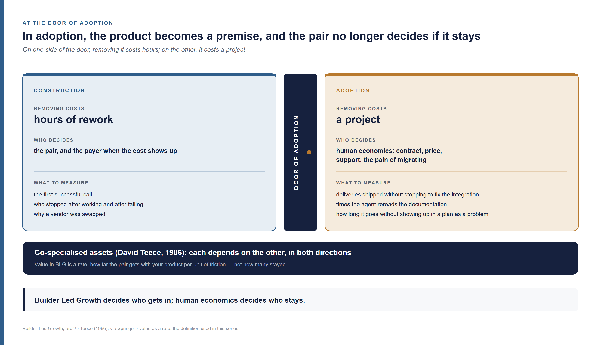

<!--
Arc 2, part 5 of the Builder-Led Growth series, by Matheus Ramos.
CANONICAL VERSION (English).
Portuguese counterpart: ../pt-br/arco2-05-construcao-o-que-segura-o-produto.md
Text frozen. Scheduled for LinkedIn on 21 October 2026.
Generated from the private working repository. Do not edit here.
-->

# Construction in Builder-Led Growth — what keeps your product in the code after the AI picks it

*Sixth piece of the second arc of this series. It does not require the earlier
ones. On Tuesday, an AI agent picked your product for the system a company was
building. On Wednesday, it was already in the code. By Friday it was gone, and
nobody cancelled anything, nobody complained, nobody opened a ticket. On your
dashboard, the only trace is an access key that made three calls.*

---

Over the last decade, people selling software learned to grow by persuading
people. First with ads, content and salespeople. Then by letting the product
itself do that work, in what the market calls **PLG**, product-led growth: the
person tries it, sees the value on their own, and decides. The term was
popularised in the mid-2010s by OpenView, with
[Blake Bartlett](https://www.linkedin.com/in/blakebartlett), and codified in a
book by [Wes Bush](https://www.linkedin.com/in/wesbush) in 2019.

**BLG** is builder-led growth, the name I gave in July 2026 to a phenomenon that
does not fit that model: **a code agent recommends or adopts your tool while
building something else.** A developer asks Claude Code, Codex or Cursor to build
a system, and the agent, halfway through the work, picks the e-mail service, the
database, the payments library. The decision is made by what I call the builder.
A builder is the pair: the person and the agent together.

In this series, a product's route into a project has three stages. In
**candidacy**, the product is in the set the agent picks from. In
**construction**, it has entered the code, and it can still be taken out. In
**adoption**, it has become a premise of what was shipped, and taking it out costs
a refactor. The earlier pieces dealt with how a product gets into the set, how it
gets cut from it and what decides the choice. This one deals with what happens
after the choice went your way.

Anyone selling already has tools for this stage. They measure activation, time to
first call, how many accounts created actually go on to use the product. Anyone
building has a belief ready too: they believe they approve what the agent does,
because the agent asks before acting. Both fail at the same point. Construction
holds three vetoes, each running on its own clock, and none of them shows up on
the seller's dashboard. When one of them takes your product out of the code, what
happens is what I call here a **discard**: an exit with no cancellation, no
complaint and no warning, which on the seller's dashboard looks like an account
that never got around to using the product. The person building, for their part,
exercises the veto where they barely pay attention and stops exercising it where
the decision is made.

This text brings three answers, from both sides of the table. What the three
vetoes of construction are and what triggers each one, with the numbers the
makers of the agents themselves published between February and August 2026. What
a seller can design for each veto, and where a builder should put their
attention. How to tell apart, in your own logs, the product that was taken out
from the product that never worked, and what to measure once it finally becomes a
premise.

## The product made it into the code and can still leave

Getting into the code is rare, and leaving is still cheap. Construction begins
when the first line of code calling your product exists, and from then on the
cost of removing it is a few hours of rework, with no data migrated and no user
affected.

The company in this story has 2,500 people. The case is a composite, assembled
from published patterns, and it runs through the latest pieces of this series. It
decided to build its own CRM — the system that manages its customer
relationships — with a coding agent instead of buying one, which is no longer an
exception: in a Retool survey of 817 builders, 35% had already replaced at least
one purchased tool with something built in-house, and 78% expected to build more
in 2026
([Retool, 17 February 2026](https://retool.com/blog/ai-build-vs-buy-report-2026);
Retool sells an internal-tools building platform, and the sample is its own
customers).

This time, your product is the one picked. On Tuesday, the developer asked the
agent for the e-mail dispatch of proposal reminders, and the agent put your
service in the plan. On Wednesday, they ask it to set up the sending. This is
where this piece begins.

Reaching that Wednesday is harder than it looks. In a study of 26,760 pull
requests written by five agents — Claude Code, Cursor, Devin, Copilot and Codex —
across 1,832 public repositories with more than a hundred stars, the agents
imported libraries the project already had in 29.5% of cases, but added a new
dependency in only **1.3%**
([Twist and Zhang, arXiv 2512.11589](https://arxiv.org/abs/2512.11589), version of
27 January 2026, accepted to the MSR 2026 mining challenge track; the sample is
mature open-source projects, not assisted-build platforms). The agent prefers what
is already in the project. When it brings in something new, that is an event.

When the event happens at scale, it changes the business of whoever gets brought
in. On 4 June 2026, Supabase co-founder Paul Copplestone said, announcing a
funding round: *"we've seen a 600% increase in databases year-over-year. Claude
Code is the largest contributor since the start of the year. Agents are now
deploying the majority of databases on our platform"*
([PR Newswire](https://www.prnewswire.com/news-releases/supabase-raises-500m-at-10-5b-to-accelerate-lead-in-agentic-infrastructure-302791787.html);
the number counts databases created, in the company's own funding announcement).

Being created is not staying. Between the first line of code and the moment the
product becomes a premise of what was shipped, it passes three parties who can
take it out — and the first of them is not a person.

## The first veto belongs to the machine

When the integration fails, the first to switch vendors is the agent. It does not
announce that it is vetoing: it announces that it found an alternative.

Lightsage, a company that sells measurement of coding-agent behaviour, describes
what happens with each kind of failure. When the package install fails, the agent
*"recommends alternative"*. When the import fails, it *"suggests competitor"*. When
the API call fails — the API being the interface through which one program uses
another's service — it *"switches recommendation"*. When the error is unclear, it
*"can't troubleshoot, moves on"*
([Lightsage, 28 April 2026](https://lightsage.com/blog/how-coding-agents-decide-which-sdk-to-use)).
This is the company's own description, with no count of how often each thing
happens, from the vendor of the instrument that measures it.

The size of the gap between products, the same company measured. On one task,
identical for everyone and run by Codex, the integration with Firecrawl finished
in 49 seconds and 6 tool calls. The one with Circle took 43 minutes and 129 calls.
The slow APIs, according to the survey, *"had unclear error messages,
inconsistent response shapes, and complex auth flows that agents struggled to
navigate"*
([Lightsage, 30 August 2026](https://lightsage.com/blog/how-to-track-agent-recommendations-api-sdk-cli-mcp)).

On the CRM's Wednesday, the first call to your service comes back with an
authentication error that says only "Request failed". The agent tries again, gets
the same sentence and writes to the developer that it found a service that is
"simpler to set up". The developer reads one line, agrees, and the discard happens
before any person has decided to take your product out.

### On the seller's side

The machine's veto runs on a clock of seconds, and your product defends itself
against it with two things the agent can read in the middle of the failure.

**The error message that says what to do.** The difference Lightsage points to is
concrete: *"Invalid API key format. Expected: ak_live_xxx or ak_test_xxx"* lets the
agent fix the problem on its own; *"Error 401"* does not, and the agent moves on.
An error that names the cause and the expected format keeps your product in the
code. A generic error hands the turn to the competitor.

**The version the agent learned.** The agent writes code from what it saw in
training, and what it saw may be the version from two years ago. The same
company's example is the agent calling the path `/v1/users` when the current API
is on its third version. This is where information management lives: where the
documentation sits, how it is versioned and what happens to the old version when
the new one ships. An old version that answers with an error saying where the new
one is gives the agent a way back. One that simply disappears swaps your product
for one the agent knows better. That last part is my own idea, drawn from the
mechanism. If you maintain an API with more than one version live, have you seen
this happen?

### On the builder's side

The swap the agent makes falls into a kind of decision almost nobody reviews.
Anthropic separated, in Claude Code sessions, planning decisions — what to do,
which approach to take, what counts as done — from execution decisions — which
files to change, what code to write, *"what language to write in"*, which
commands to run. On average, *"people make about 70% of the planning decisions
but only 20% of the execution decisions"*
([Anthropic, 16 June 2026](https://www.anthropic.com/research/claude-code-expertise);
a classifier attributes each decision to the person or to the agent, and it is
the maker analysing its own product). Swapping the e-mail service because the call
failed is execution. It stays with the machine four times out of five.

With experience, the delegated share grows. Among new Claude Code users,
*"roughly 20% of sessions use full auto-approve, which increases to over 40% as
users gain experience"*
([Anthropic, 18 February 2026](https://www.anthropic.com/research/measuring-agent-autonomy)).
Whoever has been building longer delegates more of the execution, and execution
is where the machine's veto happens.

There is a cheap way to see that veto. One line in the project instructions
asking the agent to say whenever it swaps one vendor for another, and why, turns
the machine's veto into a decision the person sees. The swap may well be the right
one. What cannot happen is the company finding out, six months later, that the
CRM's e-mail service is one nobody chose and nobody knows why it is there. That is
my own idea. Try it and tell me what you think.

## The second veto lives in the plan, not in the permission prompt

The person building approves nearly every permission prompt and rejects four out
of ten plans. The decision to take a product out happens in the plan. The
permission prompt, which looks like the moment of control, has become a reflex.

Anthropic published both numbers together on 7 August 2026: *"users approve 97%
of permission prompts in Claude Code"*. In the company's own reading, *"an
approval rate that high suggests many users are clicking through reflexively
rather than reviewing each command"*. In the same text: *"when Claude presents a
plan for approval, users reject 39% of them. But for individual permissions
requests, the rejection rate is only 3%"*
([Anthropic, 7 August 2026](https://claude.com/blog/auto-mode-default-in-claude-code)).

The same post reports a controlled experiment with 1,053 paid professional
testers, in which dangerous commands were mixed in with ordinary ones. Human
review blocked 13.6% of the dangerous ones. Attention also drops with volume:
people *"blocked about 17% of dangerous commands early in a session, dropping to
about 5% after 50 or more prior prompts"*. The participants knew they were being
evaluated, without knowing on what. The larger caveat is who is publishing: it is
the agent's maker making the case for auto mode becoming the default, which is
exactly what the post announced.

On the CRM's Wednesday, suppose your service got past the machine's veto. The
agent comes back with the plan for the reminders, and your product appears in it
the way it usually does: not as a choice between vendors, but as a step. "Step 3:
add the e-mail service for sending the reminders", with your product's name.
Right below, the technical specifications it requires: verify the sending domain,
add three DNS records — DNS being the system that tells the internet which server
answers for a domain —, store a production key in an environment variable and
register a return address for delivery notices. Four lines. The developer reads
"DNS records" and "verify the domain", thinks of the week that will take and
writes: "use what we already have". The discard happens in the plan, without a
single permission prompt rejected.

The irritation behind that rejection has no measure in any source. The makers talk
about friction and approval fatigue without publishing a metric. What is measured
is where the rejection happens.

### On the seller's side

The plan is the shop window that matters in construction, and your product does
not appear in it as a product. It appears as a step — "add the e-mail service" —
followed by the technical specifications it requires. The one writing that step
is the agent, from what your product asks for. Every specification that depends
on someone outside the conversation — a DNS record, a purchase approval, a key
only another department can issue — becomes a line under the step, and every line
is a reason for the person to reject it.

The question worth asking about your product is what the plan shows of it. How
many lines it takes up, how many depend on another person and how many the agent
handles alone. A service that lets you start with a test key and a shared domain,
and leaves verifying your own domain for when there is volume, shows up in the
plan as one line. The same service, demanding everything before the first send,
shows up as four. The piece on operational accessibility, in the first arc,
counted those stops one by one. In construction they show up together, in the
same paragraph, at the exact moment the person decides.

### On the builder's side

Anthropic's numbers say where attention pays. Reviewing every permission prompt
pays little: nearly all of it is routine, and after fifty prompts almost nobody
reads anymore. Reviewing the plan pays a great deal, because that is where the
vendor appears, as a step and a list of specifications. What that step almost
never carries is what the person would need to decide: how much it costs and how
it gets undone.

Reading a plan with a new vendor in it fits in three questions. Is this service
already on the company's vendor list? How much does it cost at the volume this
system will have? If it has to be swapped six months from now, how much of the
code changes? All three get answered by asking the agent itself, before
approving. Auto mode, which Anthropic announced on 7 August 2026 as the default
for Claude Code's individual and team plans, takes the person out of the
permission prompt. It does not take them out of the plan, and the plan is where
they should be.

## The third veto arrives when the cost shows up

Whoever pays vetoes at the moment the cost shows up. That moment can come before
the first call to your product, at sign-up, or weeks later, when usage crosses a
threshold. Either way, the one deciding is someone who was not in the
conversation between the person and the agent.

I lived the first case. At a company I worked for, we needed an API to look up
CPF numbers — the individual taxpayer registry run by Brazil's federal revenue
service, used to check who a person is — along with other registration data. The
credit card for subscriptions sat with finance, and any new contract needed
authorisation and a justification of the spend. While building with Claude Code,
the vendor that came up was the most expensive one. With the budget we had, we
changed the architecture: we combined public APIs with cheaper services to bring
the spend down to the minimum. The vendor was swapped while still in
construction, before any invoice existed. It is a single case, mine.

The mechanism behind it shows up in very different places. A sales-software
company that tested sign-up with and without a credit card explained part of its
result this way: *"a lot of high-quality prospects for our software are employees
- without immediate access to a company credit card"*
([PhoneBurner, 27 June 2022](https://www.phoneburner.com/blog/what-removing-credit-cards-from-our-saas-signup-did-to-our-revenue);
one company's account of its own test). The person using the product rarely holds
the card. When the product asks for the card, it brings the one who holds it into
the decision.

The second moment is usage. In a survey of IT leaders published in 2026 by Zylo,
a company that sells software spend management, *"77% encountered unexpected costs
that surfaced after a contract was signed"*, and *"78% experienced unexpected
charges tied to consumption or AI features in the past year"*. The same report
reproduces how J.R. Storment, of the FinOps Foundation, describes the whole cycle:
*"People are signing up with their credit cards, and then spending hits some
critical threshold and the company suddenly moves to control and consolidate
it"*
([Zylo, 2026 SaaS Management Index](https://storage.pardot.com/504631/1769637721UN2uNio9/2026_saas_management_index_zylo.pdf);
material from the vendor of the solution to the problem it measures).

At the 2,500-person company, both moments are waiting for your product. If the
production key requires a paid plan, the developer asks finance for the card on
Wednesday, and finance asks how much it will cost at real volume. The developer
does not know, because the price never appeared in the plan, and the company
already has a contract with another e-mail service. If the free tier lets
construction go ahead, the veto only changes date: in the third week, the
reminders to the entire customer base cross the limit, the charge shows up, and
someone asks what it is. Either way, the discard comes through the bill.

### On the seller's side

Each moment calls for a different design.

**At sign-up**, what changes the outcome is construction being able to start
before the card is requested — a test key, a free tier that covers the volume of
someone still building. The payer's decision still exists, but it now happens in
front of something that works, not in front of a promise. It also helps for the
price to fit in the plan: if the agent can estimate the cost of the expected
volume by reading your pricing page, the step that adds your product can carry
the line "estimated cost at this system's volume". The piece on candidacy dealt
with machine-readable pricing as a selection criterion. In construction, it is
what the developer takes to finance.

**At the usage threshold**, what changes the outcome is the warning arriving
before the charge, and reaching whoever built the system: an alert that usage is
about to cross the free tier, with the month's projection, gives that person time
to explain the cost before anyone asks. These are my own ideas about the
mechanism. Have you measured the effect of any of them?

### On the builder's side

The person building looks at the bill. In Postman's 2023 survey on APIs, *"47% of
respondents said price is a consideration"* when deciding whether to integrate an
API, against 41% in the two previous years; among executives, 60%. Performance and
security come first, and price enters the decision for nearly half
([Postman, 2023 State of the API Report](https://voyager.postman.com/pdf/2023-state-of-the-api-report-postman.pdf);
a vendor's survey of its own audience). In Stack Overflow's 2025 survey, among the
reasons to reject a technology, *"prohibitive pricing"* comes second, after
security and privacy
([Stack Overflow, Developer Survey 2025](https://survey.stackoverflow.co/2025/work),
34,188 responses to that question; it is a ranking, with no percentage).

Often, the person building vetoes on the payer's behalf before asking them. That
is what happened in the CPF lookup case: the architecture changed because whoever
was building knew what finance would say. The agent helps with this if asked.
Requesting, in the plan, the cost of each service at real volume and a cheaper
alternative for the same step costs one line, and it puts the payer's decision
where it can still change the architecture without undoing code.

## The language the gate already speaks

There is a standard that already has a name for integrating without breaking
things. Whoever approves a plan and whoever writes a company's vendor list need to
know whether your product stays safe after it enters their system. The
international quality standard for software products gained words for that in its
2023 revision.

ISO/IEC 25010 is the product quality model engineering teams use to say what good
software is. The second edition, from November 2023, brought changes that the
standard's own foreword lists: *"Safety has been added as a quality characteristic
with subcharacteristics, i.e. operational constraint, risk identification, fail
safe, hazard warning and safe integration"*, and *"Usability and portability have
been replaced with interaction capability and flexibility respectively"*
([ISO/IEC 25010:2023, official preview](https://webstore.ansi.org/preview-pages/ISO/preview_ISO+IEC+25010-2023.pdf)).

Two of those subcharacteristics describe construction almost word for word.
**Safe integration** is the *"degree to which a product can maintain safety
during and after integration with one or more components"*. **Fail safe** is the
*"degree to which a product can automatically place itself in a safe operating
mode, or to revert to a safe condition in the event of a failure"*
([iso25000.com](https://iso25000.com/index.php/en/iso-25000-standards/iso-25010?start=5),
a specialist portal; the definitions sit outside the official preview). One honest
caveat: the standard's *safety* concerns risk to life, health, property and the
environment, which is narrower than "what breaks when the agent integrates". The
vocabulary serves. The scope is not identical.

In the piece on compliance, the standard that came up was a different one, ISO
42001, which governs the process of the organisation using AI. 25010 describes the
product, which is why it is the one that speaks to whoever approves the plan.
Saying that your service is fail safe — that when the call fails, no e-mail goes
out twice and nothing is left half done — is speaking the language of whoever
operates the gate.

There is a practice that produces the raw material for this as a by-product. At
Linear, the team building a new feature calls a *feature roast*, an optional
meeting, open to anyone in the company, where raw criticism of the whole feature
is asked for. The lead synthesises the feedback and turns it into problems to fix.
For many people in the company, it is the first time they see the feature, and the
logic is that if it confuses people inside, it will confuse people outside
(Karri Saarinen, [talk at Lenny and Friends Summit](https://www.youtube.com/watch?v=Zn9NZ-r1-C4),
10 September 2026; [Karri Saarinen](https://www.linkedin.com/in/karrisaarinen/)).
On 3 October 2026, he said the company has 53 of those documents
([post](https://x.com/karrisaarinen/status/2106260123387859089)).

Linear does not describe the roast as a list of failure modes, nor does it
publish it. The bridge is mine: an exercise like that produces, as a remainder, a
description of where the product confuses and where it fails, and that
description, published where the agent reads, is what the standard calls a hazard
warning and what whoever approves a plan wants to know.

## The discard that passes for non-activation

The discard leaves a trace, but the trace looks like non-activation. When your
product leaves the code on the CRM's Wednesday, nothing in your system records a
loss. What remains is a key created, a few calls and silence — the same trace as
someone who created an account and never got around to using it.

The difference between the two cases is the difference between an acquisition
problem and a product problem, and the activation funnel treats both as one. The
account that never made a successful call did not reach construction. The account
that made successful calls and stopped was integrated and taken out. The account
that piled up errors and stopped is the likely signature of the machine's veto.

Telling the three apart takes little that is new. Flag, on each account, whether
the first successful call happened and when usage stopped. Flag whether the calls
come from an agent or a person, by the identifier the agent itself sends — the
piece on agentic commerce called this instrumenting the invisible. Count, per
week, how many accounts stopped after working and how many stopped after failing.
Those two counts are the size of your machine veto and of your human veto, and
neither exists today on the activation dashboard.

The agent-measurement market has not reached this point yet. Platforms like
Lightsage run the agent through simulated tasks and measure whether it manages to
use the product and whether it recommends the competitor. None of them, as of 6
October 2026, measures the removal of a product already integrated in a
customer's real code, nor attributes that removal to whoever made it. The piece on
recommendation ended by saying that no public instrument measures the entry that
did not happen. In construction, what is missing is a measure of the exit that
happened and nobody saw.

On the builder's side, the instrument fits in one line and serves the company
itself: a line recording why a vendor was swapped, in the same place the project
keeps its decisions. The next time the agent suggests that service, the person
knows what happened the first time. Both proposals in this section are my own
ideas, and I have not found a company practising them in public. Does yours do
something similar?

## At the door of adoption

In adoption, the product becomes a premise, and whoever decides whether it stays
is no longer the pair. The system went to production, there is data stored in
your product's format, other parts of the code depend on its behaviour, and
removing it stops costing hours and starts costing a project.

Strategy literature has a name for this. [David Teece](https://www.linkedin.com/in/davidteece),
in his 1986 work on how innovators capture value, called the supporting assets an
innovation depends on complementary assets, and called **co-specialised** those
that depend on each other in both directions, with no easy substitute on either
side
([Springer](https://link.springer.com/rwe/10.1057/978-1-137-00772-8_340)). The CRM
that stores its sending history in your service's format, and your service that
holds the sending reputation of the company's domain, are exactly that to each
other.

This is where Builder-Led Growth hands over. The limit this series has held since
the first arc applies at this door: Builder-Led Growth decides who gets in; human
economics decides who stays. What keeps the product from here on is contract,
price, support, the pain of migrating — the instruments the market already knows
and that PLG already measures well.

What changes is what to measure at the handover. The definition of value I use in
this series is not a moment, it is a rate: value in BLG is whatever reinforces the
pair's work and makes it more efficient and more effective. Measuring adoption,
then, is not counting who stayed. It is measuring how far the pair gets with your
product per unit of friction — how many deliveries ship without anyone having to
stop and fix the integration, how many times the agent has to reread the
documentation, how long the product goes without showing up in a plan as a
problem.

There is an effect that scrambles that measurement. I use Linear every day
through Claude Code, connected to the product to create milestones and stories
for a project I am building. To the activation and engagement instruments of any
product, that use looks like absence, because they were designed for a person
clicking. It is a single case, mine. It suggests that, in agent-mediated adoption,
even "who stayed" has to be measured another way.

The whole arc so far measured how a product gets in: into the set, onto the list,
into the choice. Construction shows the other side. Leaving is silent, happens on
three different clocks and by three different hands, and the only record left is
indistinguishable from someone who never got in. Telling the discard apart from
non-activation is the instrument missing from Builder-Led Growth as a whole, not
just from this stage, because without it none of the tactics in the earlier pieces
has any way of knowing whether it worked. The next piece in this series brings the
arc's stages, forces and tactics together in one place and shows how they change
depending on who is on the other side.

---

**Builder-Led Growth series**, by Matheus Ramos. Second arc:

- [Arc 2, part 0: From PLG to BLG — what still holds when the one choosing is a pair](arc2-00-from-plg-to-blg.md)
- [Arc 2, part 1: The Builder-Led Growth funnel — the three stages and what makes a product move faster](arc2-01-the-funnel-and-the-delegation-axis.md)
- [Arc 2, part 2: Candidacy in Builder-Led Growth — how to get picked by an AI beyond GEO](arc2-02-candidacy-beyond-geo.md)
- [Arc 2, part 3: Compliance in Builder-Led Growth — how to get on the list the AI is allowed to pick from](arc2-03-compliance-the-list-the-ai-picks-from.md)
- [Arc 2, part 4: Recommendation in Builder-Led Growth — telling the tactic that lasts from the one that gets patched](arc2-04-recommendation-the-tactic-that-lasts.md)
- Arc 2, part 5: Construction in Builder-Led Growth — what keeps your product in the code after the AI picks it (this text)
- [Agentic commerce and Builder-Led Growth — what changes for growth and engineering](arc2-07-agentic-commerce.md)

The first arc, for anyone who wants the full route:

- [Part 1 — When the machine is also your customer](01-when-the-machine-is-the-customer.md)
- [Part 2 — The decision, the price and what to measure](02-decision-price-and-measurement.md)
- [Part 3 — The tax the machine charges and the human never sees](03-machine-legibility.md)
- [Part 4 — How many times the agent has to call a human](04-operational-accessibility.md)
- [Part 5 — The well everyone drinks from](05-community-and-validation-signal.md)
- [Part 6 — The machine is press and reader at once](06-public-relations.md)
- [Part 7 — What makes an agent trust you, and why its competence is the problem](07-trust-and-safety.md)
