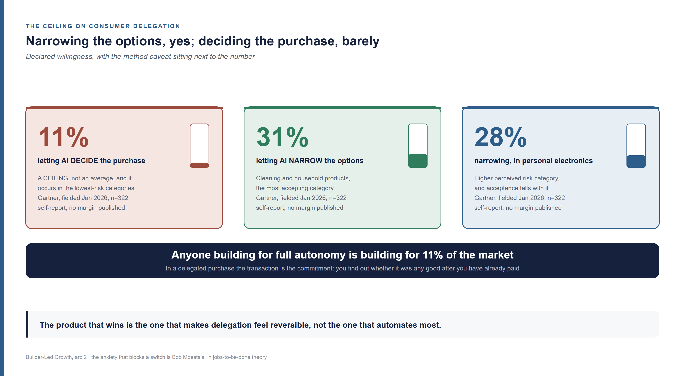
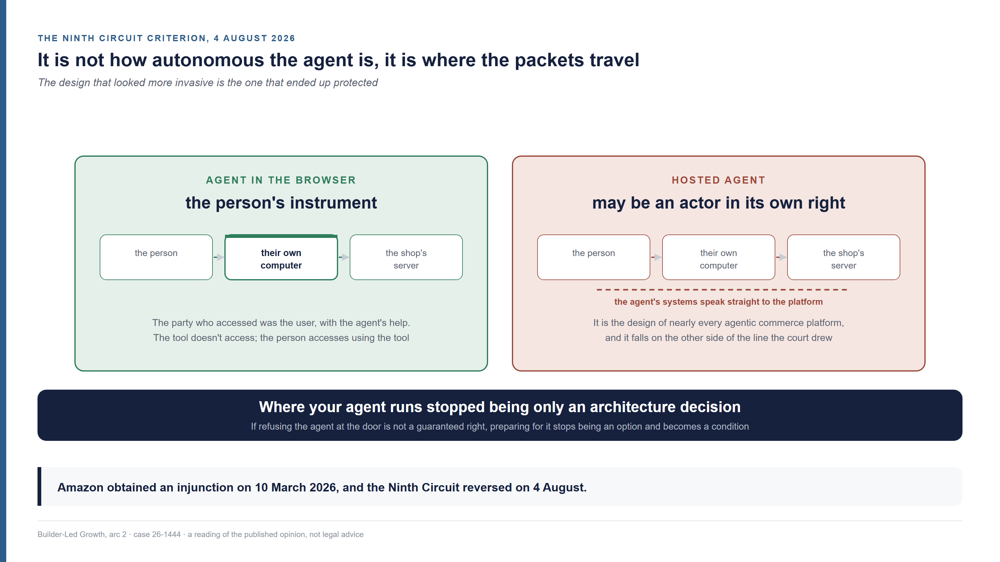
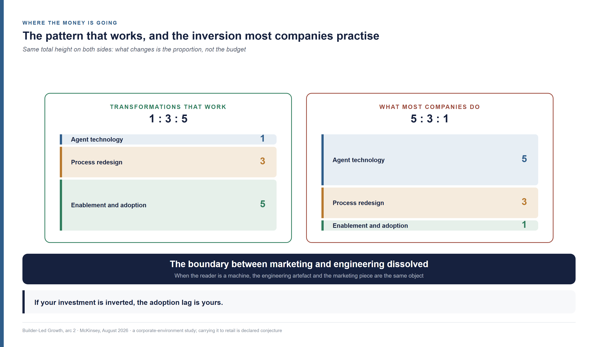

<!--
Arc 2, part 7 of the Builder-Led Growth series, by Matheus Ramos.
CANONICAL VERSION (English).
Portuguese counterpart: ../pt-br/arco2-07-comercio-agentico.md
Text frozen. Scheduled for LinkedIn on 2 September 2026.
Generated from the private working repository. Do not edit here.
-->

# Agentic commerce and Builder-Led Growth — what changes for growth and engineering

*You learned how to be found by whoever is searching. In agentic commerce whoever
is searching is no longer a person, and close to half of what your shop writes
never reaches them. This is the market where you can see, already finished, what
is only starting everywhere else.*

---

## A hundred million reais sold without anyone opening the shop

Magazine Luiza, one of the largest retailers in Brazil, has an assistant called
Lu. In 2026 she started assembling purchases inside the conversation, and the
company says it has transacted **R$ 100 million** down that route, at **three
times the conversion** of its traditional channels. The figure comes from Caio
Gomes, the company's Chief Data & AI Officer, speaking at the Fórum E-Commerce
Brasil. A company disclosed its own number, in a talk, with no period, no
methodology and no denominator. That is enough for me, with the record standing
that it is not an independent measurement.

The food delivery platform iFood has Ailo. It assembles the order inside WhatsApp,
applies coupons on its own, recommends from what you ordered before, handles a
complicated order with several dishes, and closes the purchase in one click over
Pix, the Brazilian instant payment system. It keeps preferences, dietary
restrictions and taste from one conversation to the next.

In the United States, on **11 January 2026**, Google and Shopify published an open
standard so that software agents can discover shops, assemble a cart and buy.
Twenty-odd companies signed on, Visa, Mastercard, Stripe, American Express,
Walmart and Target among them. The declared goal is to let the purchase happen
inside the conversation, without the person leaving for a website.

**The infrastructure they are building exists to put commerce inside a
conversation. Here commerce is already inside a conversation, and Pix already
settles it.**

This is not Brazil being ahead. It is a different route, on different plumbing,
with a mechanism that explains why the route works. Jason Goldberg, writing about
who will control the surface where the purchase happens, put it this way: *"the
closer the agent gets to the consumer's default context, the more influence it has
over the purchase decision"* ([Forbes, 19 February
2026](https://www.forbes.com/sites/jasongoldberg/2026/02/19/the-agentic-commerce-wars-part-2-the-race-for-the-glass/)).
The default context of the Brazilian consumer is a messaging app they already have
open all day. Nobody had to be talked into adopting a new agent. The agent showed
up where the person already was.

## Half of what your shop writes never reaches the one deciding

A product page is written for a person to look at. When the reader is a program,
much of what sits there doesn't make it across — and that already has a
measurement.

**Agentic commerce is a purchase in which a software agent performs one or more
steps of the process — discovering, comparing, assembling the cart, paying — on
behalf of a person, with a variable degree of delegation.** I went looking for
whoever coined the term and found nobody. The expression circulates without
attributable authorship, which is rare enough to be worth recording: nobody claims
it, so I will attribute it to nobody.

Adobe scores how much of a product page's content is legible to a language model.
The result by category lands between **47% in furniture and home decor and 63% in
cosmetics**, with electronics at 56%, sporting goods and apparel at 51% and
grocery at 48%. Even in the sectors doing best, **30% to 40% of the content on the
highest-value pages is not captured**.

Nobody wrote a bad page on purpose. The pages were written for a person to look
at, by a team that didn't know the next reader would be a program.

Traffic from that reader has already changed size, with instrumented measurement
over a base of more than a trillion visits. In May 2026 the traffic reaching
American shops from artificial intelligence tools grew **138% in a year**,
accumulating **1,324% since October 2024**, when Adobe started measuring. Whoever
arrives that way converts **54% better** than the rest, spends **53% more time** on
the site and sees **23% more pages** ([Adobe Analytics, via Digital Commerce 360,
17 June
2026](https://www.digitalcommerce360.com/2026/06/17/adobe-ai-referred-traffic-to-retail-sites-doubles-in-a-year/)).

A reader that brings traffic converting better than the rest, and that sees half
of what you wrote.

## You will not see the defeat happen

Before any cart exists, some part of the system assembled a short list and you
weren't on it. That elimination is real and it is recorded somewhere — in the logs
of whoever operated the agent. On your side there is no abandoned cart to
investigate, because there was no cart.

The dashboard you look at every day was designed for a loss that leaves a trace.
The person arrives, browses, abandons, and each of those steps becomes a line in
some report. The loss that matters here happens before the first step of that
design, and no report of yours records it.

That is different from the loss not happening. It happens, it has a size, and the
size sits with somebody else.

## The retailer is a product being selected, without writing a line of code

A retailer doesn't build software, and they are still, literally, a product being
selected by a machine. Either they fit the way the agent discovers, understands and
transacts, or they are left out.

I grew up hearing Ayrton Senna say that second place is nothing more than the first
of the losers. In agentic commerce that is the rule, with winner-takes-all logic.

With one caveat that matters. A conversation with an agent is not a straight line.
Somebody asks for burgers for the family, the agent brings options, the person
reformulates, and the order ends up as a pizza that pleases everyone and costs
less. At every reformulation the set is reassembled. Being left out of the first
answer is not a sentence — being left out of all of them is.

That changes what you measure. Showing up for *"best burger near me"* is not
enough. You have to stay reachable when the question becomes *"what pleases four
people with different tastes for up to a hundred and twenty reais"*, which is a
question about fit and price, not about category.

There is an organisational reason for the fitting to take longer than the urgency
suggests. In an August 2026 report on why agent adoption stalls inside companies,
McKinsey describes the fear that freezes behaviour most, in the words of the people
who feel it: if the agent gives me the wrong answer and I act on it, the mistake is
still mine. Responsibility without control.

That study looks at agent use inside organisations, not at commerce. Carrying its
conclusion to a retailer's desk is conjecture on my part. Informed guess, but
conjecture: the decision to expose catalogue and checkout to an external agent has
exactly the same shape — somebody signs their name under an answer the machine is
going to give on its own.

## In software the choice stays published; in commerce it vanished

When an agent picks a library, the code that uses it goes into a public
repository, and anyone reading that repository learns that you were chosen. The
artefact that gets built **is** the record of the choice.

The software case is worth seeing whole, because it is the contrast that organises
the rest of this text. Someone asks an AI build platform for an online shop:
catalogue, cart, payment, order confirmation e-mail. In some cases that person
names the parts — *"use Stripe for payments"* — and the decision was theirs. In
others they name nothing, and the payment service, the catalogue service and the
e-mail service turn up already wired into what was built. When that happens, the
vendor gained a customer who never knew they were signing anyone up.

> **In Product-Led Growth the one who tries and decides is a person. In
> Builder-Led Growth the one who tries and decides is a pair — the person and the
> machine — and what changes from case to case is how much of that decision was
> delegated to the machine.**

Between the two extremes there is a gradient, and it determines **what** drives the
choice. The more autonomous the machine is in finishing the task, the more the
corpus decides — the corpus being the public material the model trained on,
including documentation, code repositories, articles, forums and product reviews.
The more directed it is, the more the harness decides — the harness being the
scaffolding that runs the agent and bounds what it can call and see, with the
instructions it received, the tools switched on and the limits of the environment.

In commerce the public part is something else. Product reviews, ratings, comment
sections, third-party comparisons, videos from people who used it — all of that is
written, indexed, and it trains the model. What does not stay public is **the
record of the choice**: which product the agent put in the answer, what it
discarded before assembling the list, whether there was a return, whether there was
a dispute, whether the person bought again.

In software, being chosen produces public proof that you were chosen. In commerce,
being chosen produces nothing that leaves the party who operated the agent.

## Commerce is not the exception: it is where the movement already finished

There is a wider movement behind this, and the technology vendors describe it
themselves. Two practices stopped being experiments and turned into guidance
material: fine-tuning, which trains a model on the company's own collection, and
retrieval-augmented generation, which fetches from a proprietary base at answering
time. Amazon Web Services describes fine-tuning on *"historical customer
interactions and product specifications"* as the normal route for fitting a model
to your own business ([AWS Machine Learning Blog, 28 May 2025, by Idil Yuksel and
Karim
Akhnoukh](https://aws.amazon.com/blogs/machine-learning/tailoring-foundation-models-for-your-business-needs-a-comprehensive-guide-to-rag-fine-tuning-and-hybrid-approaches/)).
It is the technology vendor's own material, so it counts as a description of
recommended practice rather than a measurement of how many companies do it.

The accumulated effect is that part of what the machine knows starts living inside
whoever operates the platform, rather than in a collection anyone can read.

That movement is halfway through in software, where a public collection still
exists that is large enough to carry much of what the machine knows. In commerce it
never had to happen, because **the purchase was never public in the first place**.
The record of the choice always lived inside whoever operated the transaction.

> **Agentic commerce is not the exception to Builder-Led Growth. It is where the
> movement already finished, and that is why it shows the final shape of a process
> that in software has barely started.**

That makes this market readable as a **leading indicator** — the signal that moves
before the thing you want to predict, the way unemployment claims move before
measured unemployment. Anyone building software can look at agentic commerce to see
where their own contest ends up once the public collection stops being what
decides.

Half of that comparison is my own reasoning, and I would rather say so. That the
purchase was never public is shown above. That software is heading the same way I
infer from the practice the vendors document, not from a measurement of how much of
a corporate agent's context already comes from a private base rather than a public
collection. That number would settle it, and I did not find it.

For the retailer, the practical consequence fits in a sentence: **your shop stopped
being a destination and became a data source.** Before, the person came in and you
watched — what they searched for, where they stopped, what they abandoned. Now the
agent watches, and you receive a request. The sale can go on happening. The
watching, not.

## The lever moves from publishing to feeding

If the party deciding reads structured data handed to a gatekeeper, publishing more
content stops being the shortest path to being chosen. The January 2026 standard
describes that gatekeeper in detail, and it is worth reading as an admissions
specification.

An agent that wants to transact with a shop first has to discover what that shop is
capable of. The answer is a file at a fixed, predictable path:
**`/.well-known/ucp`**. What lives there is called a capability profile — the
structured declaration of what that shop knows how to do, in which version, with
which extensions. In the words of the Shopify engineering write-up, by Ilya
Grigorik: *"Discovery is the process of fetching these profiles; negotiation
computes their intersection."*

On the same day, Google began asking retailers for dozens of new attributes in the
product feed, including **answers to common questions, compatible accessories and
substitutes**.

A canonical file, at a predictable address, saying without context what a thing
does and what it accepts. This series holds that four things determine whether your
product is the one picked when the machine takes part: **being machine-legible**,
saying what you do without context; **being operationally accessible**, being
integrable without interpretation; **having a community** that writes about you in
places the machine reads; **being trustworthy enough** for the agent to act without
stopping to ask. The first two have just been published as a technical
specification by two large companies.

The theory did not predict the protocol. **The method of this work is the reverse:
Builder-Led Growth is already being practised; what we do here is observe and
name.** The same happened with Product-Led Growth — growth in which the product
itself does the work that used to belong to sales, popularised in the mid-2010s by
OpenView, with [Blake Bartlett](https://www.linkedin.com/in/blakebartlett), and
written into a book by [Wes Bush](https://www.linkedin.com/in/wesbush) in 2019 —
which companies practised for years before anyone wrote the name of it down.

## The funnel you use measures a person walking; what decides now is where your product is

The marketing funnel follows a person moving towards a purchase, and that is what
every commerce dashboard measures today. What needs measuring here is something
else: the point your product has reached inside a piece of work that a pair of
person and machine is carrying out.

The marketing funnel is the best known of all of them. The original formulation
belongs to Elias St. Elmo Lewis, in 1898 — attract attention, hold interest, create
desire — to which obtaining action was added later. The AIDA acronym appeared in
1921, with C. P. Russell, and the funnel drawing was attached to the model in 1924.
In today's language it has three heights: the top, where the person doesn't know
you and you measure reach, impressions and visits; the middle, where they compare
and you measure leads, clicks and carts assembled; the bottom, where they buy and
you measure conversion, average order value and acquisition cost.

The Builder-Led Growth funnel describes something else: where your product sits
inside that work. The one walking it is not the customer.

> **In the marketing funnel what moves is the customer. In the BLG funnel what
> moves is the product, and what moves it is the pair.**

### Candidacy: being in the material the options come from

In commerce that means being in the catalogue, in the feed, or in the base the
agent draws its options from. The verb changes: in software you work to **be
found**, in commerce you work to **be admitted**. Nobody operates a gate on the
installation of libraries; here the gate exists, has an owner, and has an
admissions process.

The closest comparison in marketing is a Google search. You may or may not show up
on the first page, and your link may or may not get clicked. Working your position
— what the market calls **SEO**, search engine optimisation — raises both odds
without turning into a guarantee. The machine doesn't hand back ten blue links for
someone to work through; it assembles an answer with two or three names inside it.
Being on that short list is the same game under other names: **GEO**, generative
engine optimisation, and **AEO**, answer engine optimisation. On Google the person
sees the whole list and decides where to click; in the agent's answer they see what
survived the curation, without knowing what was discarded.

**What gets measured.** Not traffic and not sessions, which is what a top of funnel
would measure. It is **presence in the answer**. Pick the thirty questions a
customer would ask in your category, put them to the agent repeatedly, record how
many of them you show up in. That rate is yours, and nobody publishes it.

**The tools.** AEO and GEO, canonical documentation, the content third parties
write about you, and, in commerce, the product feed plus the capability profile.

### Construction: the decision closed around you and removing you still costs a click

The stage begins when the agent stops considering alternatives and starts
assembling the answer with you inside it. Before that there were clarifying
questions, comparison, checks on price and delivery time — all of that is still
candidacy.

The cart is where this state becomes visible. The January standard names the
object, calling *Cart Mandate* the contract of what is going to be bought before it
is bought. You were chosen. Taking you out still costs one click.

**What gets measured.** The **substitution rate** between decision and payment: how
many times the agent assembled the answer with you and swapped you out before
closing. It is the cousin of the abandoned cart, with one difference that matters —
the one abandoning is not the person, it is the machine, on finding something that
made you stop fitting.

**The tools.** Completeness of product data, which is literally what the feed
started asking for: substitutes, compatible accessories, answers to common
questions. Correct price and stock in the feed, because an agent that finds a
mismatch swaps. Response time at the capability address, because an agent that
waits too long moves on.

### Adoption: the purchase became a premise

There is a stored payment method, there is data in your format, there are people
buying without reopening the comparison. The classic marketing funnel ends at the
purchase, and that gap is what the pirate funnel came to fill decades later —
acquisition, activation, retention, revenue and referral, presented by [Dave
McClure](https://www.linkedin.com/in/davemcclure) in 2007.

**What gets measured.** The share of repurchase that does **not** go back through
the consideration set. In practice: of the orders from the last ninety days, how
many came from somebody who compared nothing.

**The tools.** The memory layer. Subscription, stored payment, one-click
repurchase. It is the same force that jobs-to-be-done theory calls habit — Bob
Moesta describes it as the strongest of the forces opposing any switch.

### The middle stage shrinks until it disappears, and that is what makes candidacy decisive

A one-click repurchase goes from candidacy straight to adoption. There is no
interval in which you are chosen and can still be removed at no cost, and the
window a competitor could enter through never opens.

> **In commerce the middle stage is short, and it shrinks until it disappears as
> delegation rises.**

Almost nothing dies during construction, which is why **candidacy decides more here
than in software**. The work that in software spreads across three stages, in
commerce concentrates almost entirely in the first.

## Two limits no tactic removes

Everything so far runs into two edges that don't depend on you. One is how much
decision the consumer agrees to hand over. The other is whether refusing the agent
at your door is still your right.

### The consumer picks no vendor, and they are the one setting the ceiling

The one walking the funnel is whoever **builds**: the payments company, the
platform, the retailer who needs to be chosen. Those pick vendors. The consumer
picks no vendor at all — they receive a finished answer.

What they receive depends entirely on the quality of that funnel. If half of what is
written about a category is not legible to the machine, the recommendation reaching
them was assembled from partial information, and nothing on the screen says so.
They didn't choose the sources, don't know which ones they were, and have no way to
check.

They do set a hard constraint for whoever is building. Declared willingness to let
artificial intelligence **make** the purchase decision **tops out at 11%**, in the
lowest-risk categories. Willingness to let the machine merely **narrow** the options
reaches **31%** for cleaning and household products and **28%** for personal
electronics. That is 322 consumers in the United States, fielded in January 2026,
in a Gartner survey that publishes neither sampling method nor margin of error — I
use the order of magnitude, not the decimals. It is self-report, which on the
subject of artificial intelligence tends to diverge from measured behaviour.

> **Anyone building for full autonomy is building for 11% of the market.**

The force holding this back has a name. Bob Moesta, describing what makes somebody
switch solutions, separates the pull of the new from the **anxiety** it provokes. In
the old comparison between a drill and double-sided tape competing for the same job
of hanging a picture, you can try the tape and give up. In a delegated purchase you
cannot: **the transaction is the commitment.** You find out whether it was any good
after you have already paid.

### The door: on 4 August 2026 an American court decided who accesses what

The largest retailer in the world tried to shut the door. Amazon sued Perplexity
over a browser agent that bought on behalf of the people using it, and obtained an
injunction blocking access on 10 March 2026. On 4 August 2026 the Ninth Circuit
**vacated that injunction and remanded the case** (No. 26-1444, for publication).
Worth saying what that is and is not: the ruling is about Amazon's likelihood of
success, not about the merits, which remain open.

The reasoning, in the court's own words: *"it was the user who 'accessed' Amazon's
computers, with the help of Perplexity's AI agent"*. The tool doesn't access; the
person accesses using the tool.

The criterion is not the one you would imagine. **It is not how autonomous the
agent is, it is where it runs.** The browser in question operates on the person's
own machine, and it is the browser that requests the page from the shop's server.
The court's conclusion: *"Perplexity itself does not directly communicate with
Amazon's servers."* On the absence of precedent it is explicit — there is no
caselaw dealing with agentic AI, and the existing unauthorised-access cases *"do
not provide a perfect analogue"*.

The agent running in the person's browser, which looks more invasive, is the one
that ends up protected. **The server-hosted agent, which is the design of nearly
every agentic commerce platform, falls on the other side of the line.** Where your
agent runs stopped being only an architecture decision.

One detail of the case matters more to a retailer than the outcome does. At the
core of the dispute was Perplexity's decision not to send the **`user-agent
string`**, the field in which a program identifies itself when requesting a page.
In the opinion's words it was the mechanism *"that would communicate that the user
has activated an AI agent"*, and sending it would have let Amazon block the agent.
**The technical means of refusing existed; what was missing was the agent
identifying itself.**

For the retailer the reading is direct, and narrower than "you can't refuse":
refusing depends on being able to **recognise** the agent, and recognising depends
on a signal whoever builds the agent decides whether to send. While that is nobody's
obligation, **preparing for it stops being a strategic option and becomes a
condition you are subject to.**

## What to do — and why no single team solves this alone

When the reader is a machine, the engineering artefact and the marketing piece are
the same object, and the org chart doesn't know it. That is why the list below has
a third part.

The product description is sales material, because it is what the buyer reads. The
buyer is a machine. The capability file at `/.well-known/ucp` is the shop window.
The catalogue attribute, that dull field somebody fills in without enthusiasm, is
the commercial argument. These are not similar things: they are the same thing,
seen from two departments that don't talk to each other. The 47% to 63% legibility
by category is the bill for that mismatch.

One number shows where the money is going. The August 2026 McKinsey research
describes the pattern of transformations that work as **1:3:5** — for every dollar
invested in agent technology, three in process redesign and five in enablement and
adoption. Most companies **invert that formula completely**, putting nearly
everything into the technology and treating the rest as an implementation detail.
If your investment is inverted, the adoption lag is yours.

### For engineering

Five things change owner here, and all of them run through what the machine can
read without context.

**Publish a canonical profile at a predictable path.** If you are a merchant, that
now has a literal address. The principle holds for any vendor: one place, legible
without context, saying what you do and what you accept.

**Write the data the machine asks for, not the data the page needs.** Substitutes,
compatible accessories, answers to common questions.

**Measure your own legibility.** The calculation is simple and nobody does it: take
the twenty pages that sell most, list the facts a buyer needs in order to decide —
dimensions, compatibility, delivery time, returns policy, what's in the box — and
then ask a model to answer each of those facts using that page alone. Whatever it
can't answer is on the page in a way the machine can't reach: inside an image,
hidden behind a tab that only opens on click, or implied by sales copy instead of
stated. The public market reference sits between 47% and 63% by category. Finding
out where you land in that range is an afternoon's work; fixing what turns up is a
quarter's.

**Decide deliberately where the agent runs.** Browser or server changed in nature
after August 2026, and the answer changes who answers for the access.

**Instrument the invisible.** Record which decisions came from an agent and which
came from a person. Nobody publishes that number today. Whoever holds it internally
can see their own funnel while the market argues from impressions.

**Preserve the path back.** All the tolerance for delegated payment rests on being
able to undo. Where undoing is hard, delegation finds a lower ceiling.

### For growth

What gets measured changes before what gets done, because the top-of-funnel signal
you use today stops existing.

**Measure presence in the answer, not only traffic.** Thirty questions from your
category, repeated, recorded. It is the only way I know to see the stage where the
loss appears in no report at all.

**Test the reformulated question, not only the obvious one.** If the customer can
arrive through *"what pleases four people for up to a hundred and twenty reais"*,
that is the query that has to find you.

**Treat catalogue and feed as top of funnel**, because in commerce candidacy is
admission, not discovery. AEO and GEO still hold; the feed is the part you control.

**Recover the watching you lost.** If the person no longer comes into the shop, the
signals you used to read in their browsing have dried up. What is left comes from
the conversation the agent had, and negotiating access to that is a commercial
matter, not a technical one.

**Design for the 11% ceiling.** The product that wins is the one that makes
delegation feel reversible, not the one that automates most.

### For both, together

Three things have no owner in an org chart that separates whoever writes from
whoever publishes.

**The product description has a deadline and a growth owner**, because it is sales
material. Treating it as a data-entry chore somebody does when there's time left
over is leaving the shop window shut.

**The target is being written into the customer's own guidelines.** The
best-organised companies already don't let the agent choose alone: they write
specification documents that steer the machine within the general lines of the
house. Being named in that document is a more durable position than being in the
training data, which refreshes, and a cheaper one than switching cost, which
requires the code to already exist. It is won on technical credibility and closed
commercially, which means neither team gets there alone.

**Somebody has to own the answer to "who answers when the agent gets it wrong".**
That is not a compliance question. It is the question stalling adoption in the
companies that already bought the technology.

## What I don't know

Nobody publishes how many products were discarded before the short list existed.
That is the stage where most of the competition dies, and the only one with no
public instrument. Whoever operates the agent holds that log.

**Does decomposition widen the set or fragment it?** New tools break a problem into
pieces and send each piece to a specialised model. That could create more openings
— more subproblems, more chances to be considered — or the opposite, openings with
fewer plausible candidates, where the specialist wins for lack of a competitor.
Both readings hold up.

**I found no Brazilian measurement of the delegation ceiling.** The 11% figure is
American, and there is reason to suspect it differs here, not because Brazilians
trust more, but because delegation arrives through a channel they already use every
day. If anybody has that number, it is the most valuable one this text could have
cited.

**This series still hasn't proved its own central claim.** I hold that the machine
is taking part in vendor choice at a scale nobody is measuring. There are people
who can measure it and don't publish. Until that number exists, the burden sits
with whoever makes the claim, and the one making it is me.

If agentic commerce really is the final shape of what is starting in software, it
stops being a market to study and becomes a calendar. The shops are already on the
other side. Anyone building software still has the interval between one and the
other, and that interval is the only advantage anticipation offers.

If you work somewhere that can measure it, that is the conversation I most want to
have after this text.

---

**Builder-Led Growth series**, by Matheus Ramos. Second arc:

- [Arc 2, part 0: From PLG to BLG — what still holds when the one choosing is a pair](arc2-00-from-plg-to-blg.md)
- [Arc 2, part 1: The Builder-Led Growth funnel — the three stages and what makes a product move faster](arc2-01-the-funnel-and-the-delegation-axis.md)
- Agentic commerce and Builder-Led Growth — what changes for growth and engineering (this piece)

The first arc, for anyone who wants the full route:

- [Part 1 — When the machine is also your customer](01-when-the-machine-is-the-customer.md)
- [Part 2 — The decision, the price and what to measure](02-decision-price-and-measurement.md)
- [Part 3 — The tax the machine charges and the human never sees](03-machine-legibility.md)
- [Part 4 — How many times the agent has to call a human](04-operational-accessibility.md)
- [Part 5 — The well everyone drinks from](05-community-and-validation-signal.md)
- [Part 6 — The machine is press and reader at once](06-public-relations.md)
- [Part 7 — What makes an agent trust you, and why its competence is the problem](07-trust-and-safety.md)
