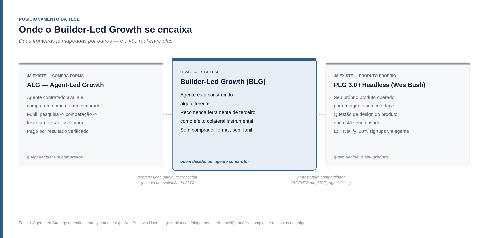
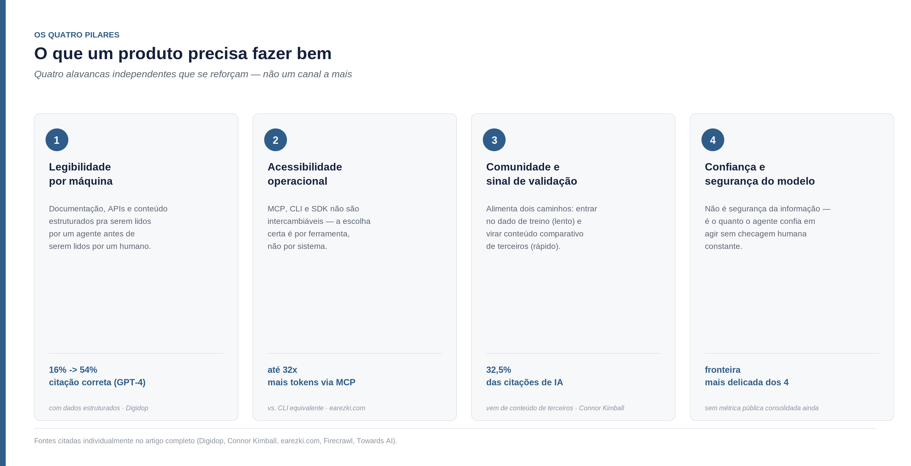
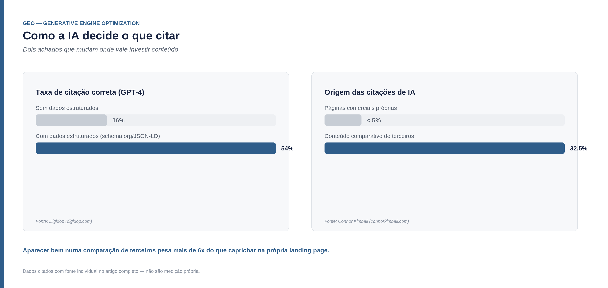
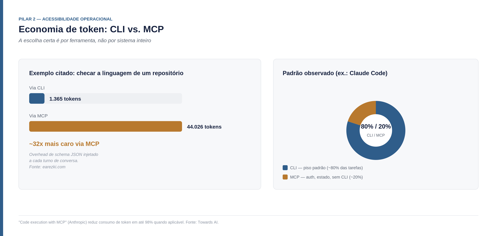
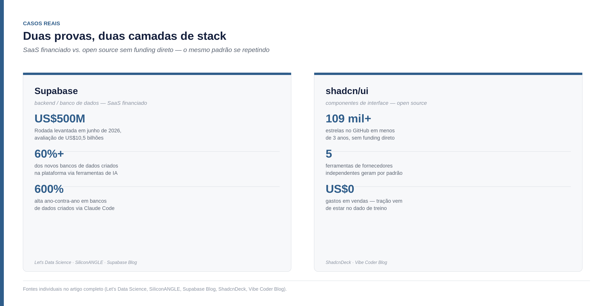

<!--
Parte 01 da série Builder-Led Growth, por Matheus Ramos.
VERSÃO NÃO CANÔNICA. A canônica é a inglesa: ../en/01-when-the-machine-is-the-customer.md
Em caso de divergência de fato ou de número, a inglesa prevalece.
Publicada no LinkedIn em 27 de julho de 2026: https://www.linkedin.com/pulse/builder-lead-growth-matheus-batista-ribeiro-ramos-mde2c
Gerado a partir do repositório privado de trabalho. Não editar aqui.
-->

# Builder-Led Growth: quando a máquina também é seu cliente

Há três meses, construindo uma API para unificar operações de Markdown, eu pedi ao Claude Code uma sugestão de ferramenta para organizar sprints e milestones. Ele sugeriu Linear. Eu não tinha mencionado Linear, nem Jira, nem nenhuma alternativa — só descrevi o que precisava. Mais tarde, ao discutir observabilidade, a sugestão foi Sentry, de novo sem eu ter posto isso na mesa.

Não é nada extraordinário — é o tipo de coisa que qualquer pessoa construindo com um assistente de código provavelmente já viu acontecer. Mas parei para pensar no que aquilo realmente era: um evento de aquisição de cliente para Linear e para Sentry, originado inteiramente por uma máquina, sem nenhum SEO, nenhum anúncio, nenhum vendedor envolvido. Se isso acontece comigo, em um projeto pequeno, quantas vezes está acontecendo agora, em paralelo, em milhares de outros projetos?

Essa pergunta puxou um fio que valia a pena investigar a fundo — com pesquisa real, não só intuição. O que segue é o que encontrei, incluindo os pontos em que minha hipótese inicial não se sustentou.

## A escala do padrão: o caso Supabase

A experiência pessoal foi o ponto de partida, mas não é, de maneira alguma, prova essencial. A prova está em um caso que já move bilhões de dólares.

Em junho de 2026, a Supabase levantou US$500 milhões a uma avaliação de US$10,5 bilhões. A narrativa de mercado por trás da rodada é explícita: mais de 60% dos novos bancos de dados criados na plataforma são iniciados por ferramentas de codificação com IA, e o Claude Code é, hoje, o maior contribuinte individual para o crescimento da empresa desde o início do ano — um aumento de 600% em bancos de dados criados ano contra ano ([Let's Data Science](https://letsdatascience.com/blog/supabase-10-5-billion-ai-agents-build-most-databases); [SiliconANGLE](https://siliconangle.com/2026/06/04/supabase-raises-500m-ai-coding-tools-drive-phenomenal-growth/)).

Isso não é acaso de mercado. A Lovable — cerca de 8 milhões de usuários e ~200 mil novos projetos por dia em fevereiro de 2026, quando cruzou US$400 milhões em receita recorrente anual ([TechCrunch](https://techcrunch.com/2026/03/11/lovable-says-it-added-100m-in-revenue-last-month-alone-with-just-146-employees/)) — provisiona um backend Supabase automaticamente em todo workspace criado — parceria estrutural, não coincidência ([Supabase Blog](https://supabase.com/blog/lovable-cloud-launch)). E o sinal mais revelador: a própria Supabase publicou um artigo técnico intitulado "AI Agents Know About Supabase. They Don't Always Use It Right" e lançou um pacote de Agent Skills — arquivos desenhados especificamente para ensinar agentes a usar seu produto corretamente ([Supabase Blog](https://supabase.com/blog/supabase-agent-skills)). Isso é uma empresa investindo deliberadamente em ser a escolha preferida de uma máquina, do mesmo jeito que investiria em SEO ou em um time de vendas.

## O que já existe — e o crédito que isso merece

Antes de propor qualquer nome ou framework, fiz a pergunta que qualquer pessoa cética deveria fazer: alguém já nomeou isso?

A resposta honesta é: não exatamente esse fenômeno, mas o território ao redor já está bem ocupado, e vale reconhecer quem chegou primeiro.

**Agent-Led Growth (ALG)** é hoje um termo estabelecido, com glossário próprio e cobertura de firmas como a Insight Partners. A definição do InstitutePM é precisa: "agent-led growth is what happens when AI Agents work for the buyer: researching vendors, compiling feature matrices, testing capabilities, evaluating options, and ultimately recommending or initiating purchases on the buyer's behalf" ([InstitutePM](https://www.institutepm.com/knowledge-hub/agent-led-growth-strategy)). O foco do ALG é o comprador — agentes substituindo o funil de avaliação B2B tradicional.

**Generative Engine Optimization (GEO)** já é indústria consolidada, com agências dedicadas a otimizar marcas para aparecerem em respostas do ChatGPT, Gemini e Perplexity ([Salesforce](https://www.salesforce.com/blog/generative-engine-optimization/)).

Aakash Gupta, na newsletter *Product Growth*, escreveu um guia direto sobre as três camadas que determinam se um agente consegue encontrar e usar seu produto — documentação legível por máquina, AGENTS.md e MCP servers ([news.aakashg.com](https://www.news.aakashg.com/p/master-ai-agent-distribution-channel)). E existe até uma disciplina técnica emergente, "harness engineering", com paper acadêmico próprio, sobre como o desenho da orquestração de um agente determina sua economia de token mais do que a escolha do modelo em si ([arXiv 2607.06906](https://arxiv.org/abs/2607.06906)).

Há ainda uma quarta peça, e talvez seja a mais próxima de casa: Wes Bush — a pessoa que mais popularizou o próprio termo "product-led growth" — descreve hoje uma evolução em três fases: PLG 1.0 (user-led), PLG 2.0 (agentic) e PLG 3.0 (headless), citando a Netlify como exemplo já na terceira fase, com 80% dos signups vindo de agentes ([Userpilot](https://userpilot.com/blog/product-led-growth/)). PLG 3.0/headless pergunta se o seu próprio produto é operável por um agente sem interface — uma questão de design, do lado de quem constrói o produto que está sendo usado.

É aqui que o ponto central desta tese aparece — e prefiro tratar isso como o argumento mais importante do texto, não como nota de rodapé no fim. Fui direto na fonte primária do ALG pra mapear a fronteira com precisão em vez de intuição: o site dedicado ao termo define o eixo do jeito mais direto possível — "PLG é o crescimento limitado pela UI do produto; ALG é a superfície de crescimento aberta a agentes autônomos externos operando contra uma *trusted growth layer*" ([Agent-Led Strategy](https://agentledstrategy.com/thesis)). Na definição dos próprios autores, ALG é sobre um agente contratado formalmente para avaliar e comprar em nome de um comprador — funil com estágios de pesquisa, comparação, teste e decisão, pago por resultado verificado. PLG 3.0/headless, por sua vez, pergunta sobre o *seu próprio* produto: ele é operável por um agente sem interface?

Nenhuma das duas fronteiras nomeia o evento que abriu este texto: um assistente de código, cuja tarefa principal não é avaliar nem comprar nada, recomendando ou incorporando uma ferramenta de terceiro como efeito colateral instrumental de estar construindo outra coisa. Não há comprador formal, não há funil de avaliação, e a pergunta não é sobre a operabilidade do seu produto — é sobre se você é a dependência que um agente escolhe por default enquanto resolve o problema de outra pessoa. É um vão real entre duas fronteiras já traçadas por gente séria, com dinheiro de venture capital atrás de uma delas — não uma categoria inteiramente nova. É um ângulo mais estreito que qualquer uma das duas, e por isso mais defensável do que reivindicar o espaço inteiro.

## A tese

Chamo esse vão de **Builder-Led Growth (BLG)** — não porque "builder" seja uma palavra mágica, mas porque nomeia com precisão quem toma a decisão: não um comprador avaliando fornecedores (ALG), não o seu próprio produto sendo operado (PLG 3.0), e sim um agente construtor escolhendo, no meio da construção, o que usar.

A tese cabe numa frase: quanto mais uma inteligência artificial passa a tratar seu produto como a resposta padrão para um problema, mais ele cresce.

A implicação incômoda é que a máquina passa a ocupar dois papéis simultaneamente: **cliente** — quando ela mesma decide arquitetura, escolhe dependências, seleciona ferramentas em nome de quem a opera — e **canal de distribuição** — quando ela recomenda algo a um humano que está construindo. Esses dois papéis já existiam separadamente em outras disciplinas — compra assistida por agente é ALG, recomendação de conteúdo é GEO, operabilidade do próprio produto sem interface é o que Wes Bush chama de PLG 3.0/headless. O que proponho fica no vão entre essas três fronteiras: não é avaliação formal de compra (isso é ALG), não é sobre o seu produto ser usável sem UI (isso é PLG 3.0) — é sobre ser a escolha default de um agente que está ocupado construindo outra coisa. Decisões de arquitetura, documentação e protocolo de acesso que hoje pertencem à "engenharia" começam a pertencer também à mesa de growth.

Vale a analogia histórica: o Product-Led Growth não substituiu o Sales-Led Growth quando surgiu — ele conquistou espaço próprio, foi se ajustando ao longo de uma década, e hoje convive lado a lado com motions de venda tradicional dependendo do tipo de negócio. Não estou propondo que essa disciplina substitua o PLG. Estou propondo que ela vá ganhando o mesmo tipo de espaço, com a mesma cautela.

E os números por trás dessa mudança de comportamento de compra, embora ainda incipientes, já são grandes o bastante para não ignorar — com uma ressalva importante que prefiro deixar explícita em vez de esconder: **as projeções divergem enormemente entre institutos**, o que por si só é um dado sobre o estágio da disciplina. A Gartner projeta que, até 2028, agentes de IA intermediarão 90% das compras B2B, movimentando US$15 trilhões ([Digital Commerce 360](https://www.digitalcommerce360.com/2025/11/28/gartner-ai-agents-15-trillion-in-b2b-purchases-by-2028/)). Já o tamanho do mercado de "agentic commerce" em 2026 varia de US$2,66 bilhões (NMSC) a US$7,7 bilhões (Grand View Research) — uma diferença de quase três vezes entre firmas sérias, cobrindo, em teoria, a mesma coisa. Isso não invalida a tendência. Mas diz que ainda estamos cedo o suficiente para que ninguém tenha uma régua confiável.

## Os quatro pilares

Quatro coisas que um produto precisa fazer bem para se tornar a escolha default de uma máquina — não um canal a mais, mas quatro alavancas independentes que se reforçam.

**1. Legibilidade por máquina — o equivalente do SEO aqui é o GEO.** Assim como SEO é vital pro PLG clássico, GEO (Generative Engine Optimization) é o equivalente estrutural para esta disciplina: documentação, APIs e conteúdo estruturados para serem lidos por um agente antes de serem lidos por um humano. E o efeito é mensurável, não é aposta: dados estruturados (schema.org/JSON-LD) mudam a taxa de citação correta de forma drástica — em um teste citado, o GPT-4 foi de 16% para 54% de respostas corretas quando o conteúdo consultado usava dados estruturados ([Digidop](https://www.digidop.com/blog/structured-data-secret-weapon-seo)). Mais revelador ainda: 32,5% das citações de IA vêm de conteúdo comparativo de terceiros — listicles, comparações, reviews — enquanto páginas comerciais do próprio produto respondem por menos de 5% ([Connor Kimball](https://connorkimball.com/blog/best-generative-engine-optimization-geo-strategies/)). Isso muda onde vale investir: aparecer bem numa comparação de terceiros pesa mais de seis vezes mais do que caprichar na própria landing page. É aqui que entra também o próprio Markdown como formato — mais adiante.

**2. Acessibilidade operacional — e a economia de token por trás da escolha.** MCP, CLI e SDK não são intercambiáveis, e a diferença entre eles é mensurável em dinheiro. Múltiplos benchmarks independentes mostram que um MCP server consome de 4 a 32 vezes mais tokens que uma CLI equivalente, por causa do overhead de schema JSON injetado a cada turno de conversa — um exemplo citado: checar a linguagem de um repositório custou 1.365 tokens via CLI contra 44.026 via MCP ([earezki.com](https://earezki.com/ai-news/2026-06-02-i-measured-mcp-vs-a-cli-for-agent-search-the-mcp-used-17x-more-tokens-per-call/)). A própria Anthropic publicou um padrão chamado "code execution with MCP" — tratar o MCP como uma API chamada via código, em vez de tool-calls diretas — que reduz o consumo de token em até 98% ([Towards AI](https://pub.towardsai.net/ai-agent-revolution-how-anthropic-cut-token-usage-by-98-with-code-execution-e276c9570bf0)). Preciso corrigir uma simplificação que eu mesmo cometi ao formular isso: a escolha certa não é "CLI sempre vence" nem "MCP sempre vence" — é decisão por ferramenta, não por sistema. O padrão observado em agentes como o Claude Code é usar os dois transportes ao mesmo tempo: CLI como piso padrão para cerca de 80% das tarefas envolvendo ferramentas que o modelo já conhece bem, e MCP reservado para os ~20% que exigem autenticação, conexão com estado, ou integração que simplesmente não tem CLI disponível ([Firecrawl](https://www.firecrawl.dev/blog/mcp-vs-cli)). A escolha certa depende de qual fatia do seu produto está em cada balde.

**3. Comunidade e sinal de validação.** Nenhum dos dois casos comprovados logo abaixo chegou a ser "default" sem antes ter tração de comunidade real — GitHub, documentação, gente de fora escrevendo sobre o produto. Comunidade alimenta dois caminhos ao mesmo tempo: um lento (entrar no dado de treino de um modelo) e um rápido (virar assunto de conteúdo comparativo de terceiros — que, como vimos no pilar 1, pesa mais de seis vezes mais que a própria página do produto). Gerir comunidade nessa disciplina deixa de ser só sobre satisfação de usuários humanos e passa a incluir, deliberadamente, produzir o tipo de conteúdo que uma máquina também consome.

**4. Confiança e segurança do modelo em relação ao produto.** Não é segurança da informação no sentido tradicional — é o quanto o próprio agente confia em recomendar ou executar sua ferramenta sem checagem humana constante. É a fronteira mais delicada dos quatro pilares, e a que mais separa este framework de qualquer coisa parecida com "SEO para robôs": os três primeiros pilares dizem respeito a ser encontrado, entendido e integrável; este diz respeito a ser confiável o bastante para agir sem supervisão.

Um quinto pilar candidato não sobreviveu ao critério de corte que apliquei pra decidir o que entra nessa lista: "ser a opção que um agente escolhe sozinho" descrevia o resultado que se busca, não uma prática independente que se executa — e por isso virou o nome de um estágio de funil, não um pilar. A análise completa de por que está na parte 2.

## Casos

Duas provas já consolidadas, e um experimento que eu mesmo estou rodando agora — trato os três com o mesmo rigor, mas não com a mesma confiança: os dois primeiros já aconteceram, o terceiro é aposta em teste.

**Supabase** prova o mecanismo na camada de backend/banco de dados: mais de 60% dos novos bancos de dados criados na plataforma são iniciados por ferramentas de codificação com IA, o Claude Code é hoje o maior contribuinte individual para o crescimento da empresa desde o início do ano — alta de 600% em bancos de dados criados ano contra ano —, e esse padrão sustentou uma rodada de US$500 milhões a uma avaliação de US$10,5 bilhões em junho de 2026 ([Let's Data Science](https://letsdatascience.com/blog/supabase-10-5-billion-ai-agents-build-most-databases); [SiliconANGLE](https://siliconangle.com/2026/06/04/supabase-raises-500m-ai-coding-tools-drive-phenomenal-growth/)). A Lovable provisiona um backend Supabase automaticamente em todo workspace criado — parceria estrutural, não coincidência ([Supabase Blog](https://supabase.com/blog/lovable-cloud-launch)) —, e a própria Supabase passou a investir deliberadamente em ser a escolha preferida de uma máquina, publicando um pacote de Agent Skills desenhado especificamente para ensinar agentes a usar o produto corretamente ([Supabase Blog](https://supabase.com/blog/supabase-agent-skills)).

**shadcn/ui** prova o mesmo mecanismo em uma camada diferente — componentes de interface — e com uma diferença que importa: não é uma empresa com estrutura de venture capital, é um projeto open source. Foi de projeto pessoal a mais de 109 mil estrelas no GitHub em menos de três anos, e hoje v0.dev, Lovable, Bolt, Cursor e Claude Code — cinco ferramentas de fornecedores completamente independentes entre si — geram shadcn/ui por padrão quando pedem para construir uma interface ([ShadcnDeck](https://www.shadcndeck.com/blog/rise-of-shadcn-ui-2026); [Vibe Coder Blog](https://blog.vibecoder.me/shadcn-ui-component-library-ai-development)). O mecanismo citado pelas próprias fontes é direto: os modelos foram treinados sobre um volume enorme de código usando shadcn, e isso por si só empurrou as ferramentas de IA a preferi-lo. Como o Supabase, o projeto também passou a investir deliberadamente nisso, lançando "shadcn/skills" — um pacote pensado explicitamente para ser consumido por agentes.

Dois casos, duas camadas de stack, dois modelos de negócio (SaaS financiado vs. open source sem funding direto) — e o mesmo padrão se repetindo.

**MarkdownScribe — o experimento em andamento.** Aqui preciso ser mais cauteloso, porque tenho interesse direto no resultado — não é um caso de sucesso, é uma aposta em teste, ainda sem lançamento público.

O que é: uma API que unifica seis operações comuns de manipulação de Markdown — extração de frontmatter, geração de sumário com slugify, lint, formatação, conversão de Mermaid para SVG, e conversão de URL para Markdown — servidas por REST, CLI e MCP sobre o mesmo backend, com cobrança por crédito de uso. O diferencial pretendido está na operação mais difícil do pacote: URL para Markdown com extração de conteúdo real, não "HTML virado Markdown cru" sem critério. Em teste interno que fizemos, um concorrente conhecido (Firecrawl) devolveu cerca de 65% de lixo — menu, botões de compartilhamento, comentários — ao converter um artigo de notícia real.

A aposta liga direto aos pilares acima, e prefiro ser honesto sobre quais ela já testa e quais ainda não. No pilar 1 (legibilidade por máquina): a aposta é que Markdown está de fato virando o padrão da camada legível por máquina — pipelines de IA e RAG usam até 95% menos tokens com Markdown do que com PDF ([MDisBetter](https://mdisbetter.com/blog/markdown-vs-pdf-for-ai)), embora a versão forte dessa afirmação seja falsa: PDF continua dominante em volume absoluto, com 2,5 trilhões já existentes no mundo ([TheyLovePDF](https://www.theylovepdf.com/el/pdf-trends-2026)) — Markdown não substitui PDF, vira padrão de uma camada paralela. No pilar 2 (acessibilidade operacional): em vez de apostar só em MCP, que custa caro em token, o produto é construído com REST, CLI e MCP sobre o mesmo backend, deixando quem consome escolher o canal mais barato pro seu caso — decisão tomada diretamente a partir da pesquisa deste texto, não o contrário. Os pilares 3 (comunidade) e 4 (confiança) são, com honestidade, os que o MarkdownScribe ainda não testou — o produto não tem comunidade construída nem histórico de uso que gere confiança de agente. É exatamente por isso que chamo isso de experimento, não de caso.

## Onde isso não se aplica

Nenhuma disciplina de growth serve para todo tipo de negócio — o PLG clássico também tem contraindicações conhecidas, e seria desonesto propor esta como universal. Sustento esta seção em duas bases diferentes, e prefiro deixar claro qual é qual em vez de misturar as duas como se pesassem igual: uma vem de dado publicado e verificável; a outra vem só da minha leitura empírica do mercado, sem validação formal ainda.

A barreira com lastro de dado: mercados regulados. 37% dos times que adotam IA agêntica citam segurança e compliance como maior obstáculo; no setor de saúde, 57% apontam privacidade de dados de paciente como preocupação principal; no financeiro, 31% apontam lacunas de governança. O EU AI Act torna obrigações de alto risco exigíveis a partir de agosto de 2026, classificando decisões automatizadas de crédito como "alto risco" ([Glean](https://www.glean.com/perspectives/top-7-industries-with-stringent-ai-compliance-needs-in-2026); [Fin.ai](https://fin.ai/learn/evaluate-ai-agent-compliance-financial-services)).

A segunda lista é conjectura minha, baseada em intuição de mercado, não em pesquisa formal — e trato como tal: bens de status e luxo, onde o valor está exatamente na escolha humana visível e no sinal social, provavelmente resistem a esse mecanismo — um agente "otimizando" a compra de um relógio de luxo contraria o propósito da própria compra. Vendas B2B que dependem de confiança pessoal construída ao longo de anos, serviços onde o julgamento subjetivo humano é irredutível (escolher um fotógrafo de casamento pelo estilo), e categorias que fazem de "feito sem IA" o próprio diferencial de marca também parecem, à primeira vista, fora do alcance dessa disciplina. Ninguém tem dados sólidos sobre esses limites ainda — inclusive porque o fenômeno é recente demais para ter sido testado à exaustão.

## A voz cética

Um texto honesto sobre isso precisa dar espaço ao contra-argumento, não só à tese.

A crítica mais óbvia: isso não é apenas GEO com um nome novo? Em parte, sim — GEO é um dos pilares, não uma disciplina concorrente. A diferença que tento sustentar: GEO cobre conteúdo e descoberta — ser encontrado e citado certo. O que descrevo soma duas coisas que o GEO sozinho não cobre: comunidade como motor paralelo de citação e de entrada em dado de treino (pilar 3), e a camada de fricção operacional que decide se uma recomendação vira, de fato, integração funcionando — protocolo de acesso e custo de token não como fator de preferência da IA, mas como fator de conversão entre intenção e adoção real (pilar 2). GEO ajuda a máquina a te encontrar; os outros pilares ajudam a máquina a te escolher e a te usar de verdade.

A segunda crítica é a que mais me obriga a rigor, porque tem duas variantes e cada uma precisa de resposta separada: isso não é apenas Agent-Led Growth com nome novo? E não é apenas a fase "headless" que o próprio Wes Bush já batizou dentro do PLG? Já tracei essa fronteira com fonte primária na seção anterior: ALG, na definição dos próprios autores, é sobre um comprador formal avaliando e comprando através de um agente — funil, estágios, pagamento por resultado verificado. PLG 3.0/headless é sobre o seu próprio produto ser operável sem interface. Nenhum dos dois nomeia um agente recomendando ferramenta de terceiro como efeito colateral de estar construindo outra coisa, sem comprador formal e sem ser sobre o seu produto sendo operado.

Onde não vou fingir que a fronteira é limpa: o próprio funil do ALG inclui, no estágio de avaliação, um agente "navegando documentação e testando capacidades" — próximo o bastante do que um agente de código faz ao experimentar uma biblioteca antes de adotá-la que a distinção vira mais uma questão de gatilho e contexto (avaliação deliberada de um comprador vs. subproduto instrumental de quem está construindo) do que de mecanismo totalmente disjunto. E a infraestrutura por trás do PLG 3.0 e a que descrevo aqui é, em boa parte, a mesma — AGENTS.md, MCP, Agent Skills servem tanto pra deixar um produto operável sem interface quanto pra deixá-lo recomendável no meio de uma construção alheia. Um crítico de boa-fé pode argumentar que isso é só um recorte de uma categoria ou de outra, não uma disciplina irmã — é uma crítica que levo a sério, não descarto por conveniência.

A terceira crítica, mais séria em outro sentido: essa estratégia inteira depende do comportamento de vendors de modelo que podem mudar da noite para o dia. Se a Anthropic ou a OpenAI alterarem como seus agentes recomendam ferramentas, uma vantagem competitiva construída em cima disso pode evaporar sem aviso.

Aqui cabe uma discussão, não um veredito fechado. Existe uma leitura mais otimista, que vale considerar: se os pilares que realmente pesam forem comunidade real e presença genuína em dado de treino — não um truque superficial específico de um vendor — a dependência é menor do que parece à primeira vista. Common Crawl, GitHub, fóruns técnicos e conteúdo comparativo de terceiros alimentam múltiplos modelos ao mesmo tempo; não são propriedade de um único vendor. Um produto profundamente entendido nesse substrato compartilhado fica menos vulnerável à mudança de política de um fornecedor específico do que um produto que só ganhou destaque via uma parceria pontual ou um truque raso de um modelo só. Dito isso, não tenho dado que comprove essa robustez na prática — é raciocínio, não medição, e a honestidade exige dizer isso. O risco que permanece, mesmo com os pilares bem executados: um vendor pode mudar a própria arquitetura de como agentes buscam informação — por exemplo, depender menos de retrieval em tempo real e mais de conhecimento paramétrico — de um jeito que reduz a eficácia de qualquer estratégia de GEO, não só a sua. Diversificar entre múltiplos assistentes e múltiplos canais (REST, CLI, MCP) segue sendo a mitigação mais concreta que tenho pra oferecer.

A quarta: existe um risco concreto de "agent-washing" — empresas colando o rótulo "otimizado para IA" em qualquer coisa, sem substância, do mesmo jeito que "AI-powered" virou clichê de pitch deck. Esse risco é real e provavelmente vai piorar antes de melhorar.

## E o "como", na prática?

Este texto ficou deliberadamente no nível de tese e evidência — o suficiente pra sustentar o argumento sem virar um manual de 6 mil palavras. Mas as perguntas óbvias que vêm depois de aceitar essa tese são todas operacionais: o que exatamente faz um modelo preferir um produto a outro, quais métricas acompanhar pra saber se está funcionando, qual modelo de precificação se encaixa melhor, como transformar gestão de comunidade em parte da estratégia — e, principalmente, como growth deve demandar de engenharia e se relacionar com ela pra essa tese sair do papel. Escrevi essa parte separadamente. O que eu imaginava como um segundo texto acabou virando uma série — cada pilar pedia mais espaço do que um aprofundamento único comportava.

## Fechamento

Junto os pontos, porque uma tese que não se sustenta sozinha no fim não merecia ter sido escrita. A Supabase vale US$10,5 bilhões em parte porque agentes de código a escolhem sozinhos. O shadcn/ui virou padrão em cinco ferramentas de fornecedores independentes sem gastar um real em vendas. Dado estruturado quase quadruplica a taxa de citação correta de um modelo. Isso não é uma coincidência isolada nem moda passageira — é evidência suficiente pra defender que existe, sim, uma disciplina aqui: Builder-Led Growth, com mecanismo, pilares, posicionamento claro frente ao que já existe (o vão entre ALG e PLG 3.0) e casos reais o bastante pra não ser só uma boa história.

Se essa tese se sustenta, a consequência organizacional é desconfortável pra boa parte das empresas: decisões que hoje moram inteiramente dentro de engenharia — qual protocolo expor, como estruturar documentação, o que vira exemplo de código público — deixam de ser só decisão técnica e passam a ser também decisão de growth. Não porque growth deva mandar em arquitetura, mas porque growth passa a ter, ali, um interesse legítimo: é nessas escolhas que se decide se uma máquina consegue te encontrar, te entender e te preferir. Growth que segue tratando isso como "problema de engenharia, não me cabe" está deixando um canal de aquisição inteiro em cima da mesa.

Não escrevo isso como quem decifrou uma categoria fechada. Escrevo como quem está no meio de um experimento — construindo um produto que aposta nessa tese, junto com os dados que encontrei ao testá-la, incluindo os que a contradisseram parcialmente. Se você tem um contra-exemplo, um caso que refuta isso, ou uma camada do framework que não se sustenta no seu contexto, é exatamente esse tipo de resposta que este texto está pedindo.

## Apêndice — o que fazer na segunda-feira

Fechando sem soar como quem tem a resposta pronta — porque não tenho — aqui estão ações concretas e pequenas o suficiente para testar esta semana, não um plano de doze meses:

- Peça a um assistente de código (Claude Code, Cursor, o que você usar) para resolver um problema do seu domínio sem citar sua ferramenta pelo nome. Veja se ele já recomenda você, um concorrente, ou nada.
- Se você tem uma API, meça quanto custaria em tokens expor ela como MCP versus como CLI simples — pode ser que a resposta certa para o seu caso seja as duas, não uma só.
- Escreva um `AGENTS.md` ou `llms.txt` simples — mas sabendo exatamente o que esperar dele. A Ahrefs analisou logs de servidor de 137 mil domínios e encontrou 97% dos arquivos `llms.txt` com zero requisições em maio de 2026; bots de retrieval de IA responderam por 1,1% dos acessos, e o maior solicitante foi ferramenta de auditoria de SEO, com 21,7% ([PPC Land](https://ppc.land/llms-txt-adoption-rises-8-8x-but-97-of-files-get-zero-ai-requests/)). Para visibilidade em busca generativa, portanto, o arquivo não entrega — o próprio Google declarou que ele não afeta ranking. O que o mesmo estudo mostra é que agentes de IDE (Cursor, Windsurf, Claude Code, Copilot, Cline, Aider) procuram ativamente `/llms.txt` e `/llms-full.txt` quando apontados para um site de documentação. É infraestrutura de prontidão para agentes, não ferramenta de GEO — e é justamente por isso que importa aqui.
- Se seu produto atende uma indústria regulada, não aposte nessa disciplina como motion principal — trate como camada complementar, não substituta.

---

**Série Builder-Led Growth**

- Parte 1 — Quando a máquina também é seu cliente (este texto)
- [Parte 2 — A decisão, o preço e o que medir](https://www.linkedin.com/pulse/builder-led-growth-parte-2-decis%C3%A3o-o-pre%C3%A7o-e-que-matheus-nqnuf/)

A série continua. Cada parte aprofunda um pedaço do que este texto só conseguiu apontar, e este bloco é atualizado conforme as próximas saem.
