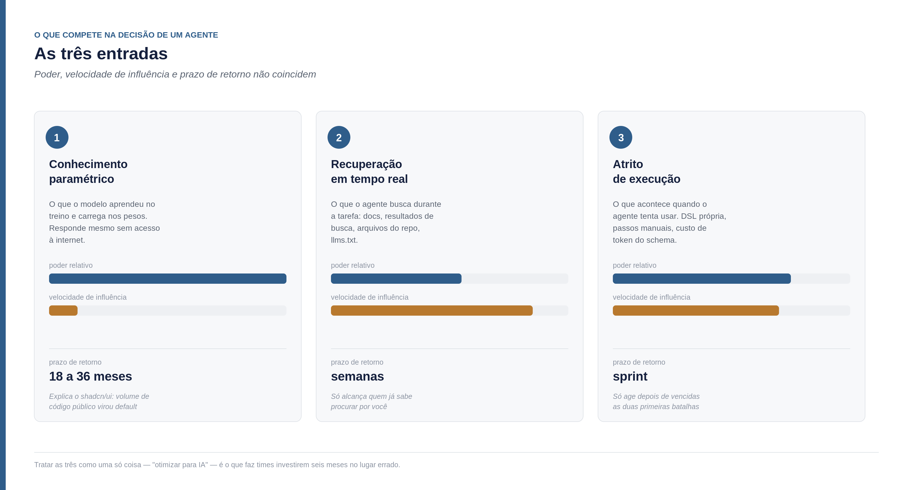
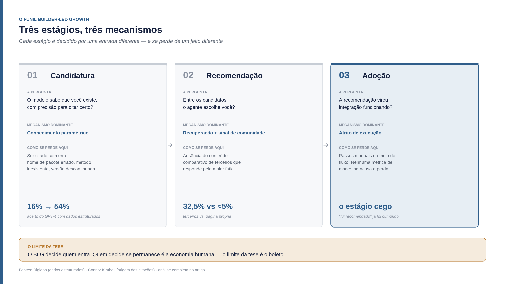
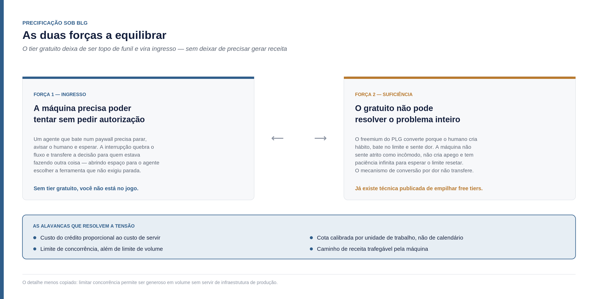
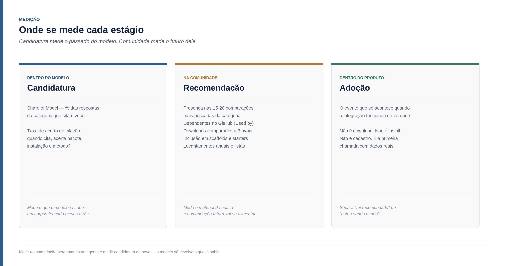
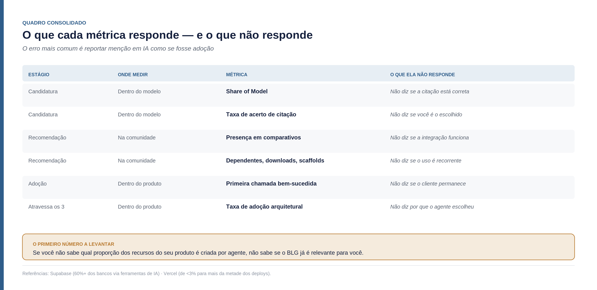

<!--
Parte 02 da série Builder-Led Growth, por Matheus Ramos.
VERSÃO NÃO CANÔNICA. A canônica é a inglesa: ../en/02-decision-price-and-measurement.md
Em caso de divergência de fato ou de número, a inglesa prevalece.
Publicada no LinkedIn em 30 de julho de 2026: https://www.linkedin.com/pulse/builder-led-growth-parte-2-decis%C3%A3o-o-pre%C3%A7o-e-que-matheus-nqnuf/
Gerado a partir do repositório privado de trabalho. Não editar aqui.
-->

# Builder-Led Growth, parte 2: a decisão, o preço e o que medir

*Continuação de ["Builder-Led Growth: quando a máquina também é seu cliente"](https://www.linkedin.com/pulse/builder-lead-growth-matheus-batista-ribeiro-ramos-mde2c). A parte 1 nomeou a disciplina, posicionou o BLG no vão entre Agent-Led Growth e PLG 3.0/headless, e propôs quatro pilares. Continuei investigando desde então, e o quadro ficou consideravelmente mais rico — a ponto de eu conseguir agora dizer coisas que na parte 1 eu só conseguia sugerir.*

Começo com o número que reorganizou minha leitura do problema.

A pesquisa do Stack Overflow de 2026, com 49 mil respondentes em 177 países, mostra adoção de ferramentas de IA em 84% dos desenvolvedores — contra 76% no ano anterior. Metade dos profissionais usa diariamente. E, no mesmo levantamento, a confiança na acurácia do output caiu para 29%, vindo de 40% em 2024. Apenas 3% dizem confiar "altamente" no código gerado ([byteiota](https://byteiota.com/stack-overflow-dev-survey-2026-ai-at-84-trust-at-3/)).

Vale parar nesses três números juntos, porque a combinação é incomum. Adoção subindo oito pontos em um ano. Confiança caindo onze. E a confiança alta — aquela que autorizaria usar o output sem revisar — em 3%.

Mercados costumam se comportar de outro jeito: quando a adoção sobe e a satisfação cai, ou o produto piorou, ou o uso se espalhou para casos que ele não atende. Aqui parece ser a segunda coisa. O assistente saiu de "me ajuda a escrever esta função" para "resolve esta tarefa", e nessa mudança de escopo passou a tomar decisões que antes eram do humano — inclusive a de qual ferramenta usar.

Quando propus o quarto pilar na parte 1 — confiança e segurança do modelo em relação ao produto — eu o descrevi como a fronteira mais delicada dos quatro. Estes números dão a ele um tamanho que eu não tinha: com 3% de confiança alta, ser recomendado é a parte fácil. Ser executado sem supervisão é onde mora quase toda a demanda não atendida do mercado.

Guarde esse número. Ele volta no fim.

## Voltando aos dois casos da parte 1, agora com mais fundo

A parte 1 apresentou Supabase e shadcn/ui como as duas provas do mecanismo. Continuei puxando os dois fios, e o que encontrei muda o peso de ambos — principalmente porque explica **por que** aconteceu, e não só que aconteceu.

### Supabase: a ordem dos fatores importa

A leitura mais comum do caso Supabase é a que reduz tudo a um acordo comercial: a Lovable escolheu Supabase como backend padrão, a Lovable cresceu, a Supabase pegou carona. Se fosse isso, não sustentaria tese nenhuma — seria só uma parceria bem-sucedida.

Fui atrás da cronologia e a ordem é outra. A Craft Ventures, que investiu na empresa, publicou o relato do executivo que passou quatro meses dentro da Supabase como interino de growth. A sequência que ele descreve é explícita: comunidade open source e tração no Hacker News primeiro; daí um dos projetos mais estrelados do GitHub; daí a posição de "backend padrão para desenvolvedores Postgres sérios, muitos usando Supabase junto com Cursor e Claude Code"; e **só então** as plataformas de vibe coding — Bolt, Figma Make, Lovable, v0 — adotaram ([Craft Ventures](https://www.craftventures.com/articles/inside-supabase-breakout-growth)).

A decisão da Lovable não criou o default. Ela ratificou um default que já existia.

Os números do período dão a escala: de 1 milhão para mais de 4,5 milhões de desenvolvedores em menos de um ano; receita recorrente anual de US$16 milhões em 2024 para US$70 milhões em setembro de 2025, crescimento de 250% ao ano com base de usuários subindo mais de 700%; 15,1 milhões de bancos de dados criados só em 2025, mais do que todos os anos anteriores somados; 55% do batch da Y Combinator mais recente à época do levantamento, de setembro de 2025, e mais de mil empresas YC no total usando a plataforma ([Sacra](https://sacra.com/research/supabase-at-70m-arr-growing-250-yoy/)).

E há uma frase no relato que vale mais que os números, porque é a tese dita por dentro: *"comunidade é um fosso, não um canal"*. Eles descrevem GEO, comunidade e ciclo de vida como esforço combinado — não como três iniciativas separadas de marketing.

Quando escrevi o terceiro pilar na parte 1, tratei comunidade como um dos quatro. Depois de ler esse relato, eu diria de outro jeito: comunidade é o pilar que **produz** os outros. É ela que gera o volume de código público que entra no treino, é ela que gera o conteúdo comparativo de terceiros, e é ela que gera o histórico de uso do qual a confiança do modelo se alimenta. Não é um quarto do trabalho — é a matéria-prima dos outros três.

### shadcn/ui: o mecanismo, olhado de perto

Na parte 1 eu disse que o shadcn/ui virou padrão em cinco ferramentas de fornecedores independentes — v0, Lovable, Bolt, Cursor e Claude Code — e atribuí isso ao volume de código de treino. Continuei investigando e o dado ficou mais nítido, incluindo o tamanho: mais de 109 mil estrelas no GitHub em menos de três anos, saindo de projeto pessoal.

O que me interessa aqui é o que esse caso prova por eliminação. Cinco ferramentas de empresas concorrentes entre si convergindo no mesmo padrão não se explica por acordo comercial — não existe acordo que inclua v0 (Vercel), Lovable, Bolt, Cursor e Claude Code (Anthropic) ao mesmo tempo. Também não se explica por marketing, porque um projeto open source sem funding direto não compra cinco integrações. O que sobra, e é o que as próprias fontes atribuem, é que os modelos aprenderam da mesma fonte: o volume de código público usando shadcn que se acumulou nos três anos anteriores.

Isso torna o shadcn o caso mais limpo de **candidatura por conhecimento paramétrico** que consegui encontrar. E os dois projetos, Supabase e shadcn, fizeram depois a mesma jogada: ambos lançaram pacotes de Agent Skills — arquivos desenhados explicitamente para ensinar agentes a usar o produto corretamente. Duas empresas em camadas diferentes da stack, com modelos de negócio opostos, chegando de forma independente à mesma conclusão sobre o que fazer em seguida.

## O que continuei descobrindo sobre llms.txt

Na parte 1, o apêndice recomendava escrever um `AGENTS.md` ou `llms.txt`, com a ressalva de que nenhum provedor de IA confirmava publicamente ler o arquivo. A recomendação estava certa; a ressalva é que ficou incompleta. Os dados que encontrei depois permitem ser preciso sobre **para que** o arquivo serve — e essa precisão acabou virando, na minha opinião, o achado mais valioso desta rodada.

A Ahrefs analisou logs de servidor de 137 mil domínios e encontrou que 97% dos arquivos `llms.txt` receberam zero requisições em maio de 2026. Onde houve requisição, bots de retrieval de IA — os que respondem perguntas dentro de produtos de busca — responderam por 1,1%. O maior solicitante isolado foi ferramenta de auditoria de SEO, com 21,7%. Só 7,4% das empresas da Fortune 500 têm o arquivo, contra 92,8% que têm `robots.txt`. O Google publicou nota explícita afirmando que o arquivo não afeta ranking em nenhuma direção. E, ainda assim, a adoção cresceu 8,8 vezes em doze meses ([PPC Land](https://ppc.land/llms-txt-adoption-rises-8-8x-but-97-of-files-get-zero-ai-requests/)).

Lido isoladamente, isso parece o fim da recomendação. Mas o mesmo estudo diz o contrário para o nosso caso, e a conclusão do Originality.ai é literal: `llms.txt` se parece muito mais com infraestrutura de prontidão para agentes do que com ferramenta de visibilidade em busca. Os agentes que efetivamente consomem o arquivo são exatamente os que interessam aqui — Cursor, Windsurf, Claude Code, GitHub Copilot, Cline e Aider procuram ativamente `/llms.txt` e `/llms-full.txt` quando apontados para um site de documentação.

Repare no que isso oferece à tese. Na parte 1, o argumento de que BLG e GEO são disciplinas distintas era conceitual — o tipo de coisa que se defende por raciocínio. Agora existe uma prática mensuravelmente inútil para GEO e mensuravelmente funcional para BLG, e a diferença aparece em log de servidor. A distinção deixou de depender de retórica.

A recomendação, refinada: escreva o arquivo, e não o inclua em nenhuma métrica de visibilidade em busca. Ele serve ao agente que já foi apontado à sua documentação — instrumento dos estágios 2 e 3 do funil, nunca do estágio 1. O que isso significa fica preciso na próxima seção.

## Como um modelo decide o que recomendar

Três entradas competem quando um agente escolhe uma ferramenta. Elas não pesam igual, custam coisas diferentes para influenciar, e respondem em prazos incompatíveis entre si.

**Conhecimento paramétrico** é o que o modelo aprendeu no treino e carrega nos próprios pesos. Quando um agente sugere uma biblioteca sem consultar nada, é daqui que vem a resposta. É a entrada mais poderosa — não depende de acesso à internet, nem de o usuário mencionar seu domínio — e a mais lenta: entre uma tecnologia se tornar comum e aparecer bem representada existe uma defasagem que estimo em 18 a 36 meses, considerando coleta, treino e liberação de um modelo grande. É a entrada que explica o shadcn.

O que isso implica é desconfortável e vale dizer sem rodeio: **se você começa hoje, o conhecimento paramétrico não é uma alavanca disponível neste trimestre.** Você não consegue estar no treino do ano passado. É o ativo mais durável dos três e o de retorno mais distante — vale construir, desde que ninguém prometa resultado trimestral por esse caminho.

**Recuperação em tempo real** é o que o agente busca durante a tarefa: sua documentação, resultados de busca, arquivos do repositório, o `llms.txt` se ele foi apontado para lá. É rápida de influenciar, em semanas. E tem uma limitação que o entusiasmo com GEO costuma esconder: **só alcança quem já sabe procurar por você.**

É por isso que a distinção entre GEO e AEO, embora real, importa menos do que parece aqui. GEO trata de ser citado dentro de respostas generativas; AEO trata de ser extraído como resposta direta em AI Overviews e assistentes de voz, e na prática GEO costuma ser tratado como o subconjunto generativo do AEO ([Jasper](https://www.jasper.ai/blog/geo-aeo)). Ambos são reais, ambos pertencem ao primeiro pilar, e ambos operam na camada de recuperação — que sozinha não resolve o problema de existir para o modelo.

**Atrito de execução** é o que acontece quando o agente tenta usar. Se a biblioteca exige uma linguagem própria que o modelo domina menos que TypeScript; se a integração tem seis passos manuais; se o servidor MCP injeta dois mil tokens de schema por turno — cada um é uma chance de desistir e tentar outra coisa. É a entrada mais ignorada e, na minha leitura, a mais subestimada, porque só age depois que você já venceu as duas primeiras batalhas. É fácil não perceber que se está perdendo ali, já que a métrica confortável — "fui recomendado" — já foi cumprida.

## O funil em três estágios

Na parte 1 mencionei que um pilar candidato não sobreviveu ao critério de corte: "ser a opção que um agente escolhe sozinho" descrevia o resultado buscado, não uma prática executável, e por isso virou nome de estágio. Aqui está o desenho completo, com o mecanismo que domina cada um.

**Candidatura.** O modelo sabe que você existe, com precisão suficiente para te citar corretamente. Dois caminhos, e você precisa de ao menos um: estar no conhecimento paramétrico, ou ser recuperável a partir de algo que o agente já tem motivo para consultar.

A palavra "corretamente" carrega peso. Um modelo que sabe que seu produto existe mas erra o nome do pacote, sugere um método inexistente ou aponta uma versão descontinuada não te candidatou — te queimou. O agente tenta, falha, e agora há uma experiência ruim associada ao seu nome naquela sessão. É aqui que dados estruturados mostram o efeito mais mensurável de tudo que encontrei: em teste citado, o GPT-4 passou de 16% para 54% de respostas corretas quando o conteúdo consultado usava schema.org/JSON-LD ([Digidop](https://www.digidop.com/blog/structured-data-secret-weapon-seo)). Não é sobre aparecer mais; é sobre aparecer certo.

**Recomendação.** Entre os candidatos, o agente escolhe você. A competição é comparativa, e o dado que mais mudou minha visão sobre alocação de conteúdo é este: 32,5% das citações de IA vêm de conteúdo comparativo de terceiros — listicles, comparações, reviews — enquanto páginas comerciais do próprio produto respondem por menos de 5% ([Connor Kimball](https://connorkimball.com/blog/best-generative-engine-optimization-geo-strategies/)). Mais de seis para um contra a sua própria landing page.

Esse dado abre uma pergunta que eu não sei responder, e prefiro deixá-la aberta a fingir que resolvi.

O número mede **procedência**: conteúdo de terceiro pesa 32,5%, página do próprio produto pesa menos de 5%. A leitura intuitiva é que a procedência independente é o que dá o peso — você não controla, logo vale mais. Se for isso, comparação comprada e review plantado tendem a ser descontados conforme os modelos aprendem a identificar padrão de fabricação, e o único caminho durável é o lento: ser bom o bastante para que terceiros escrevam por conta própria.

Mas existe uma categoria intermediária que o dado não resolve: **conteúdo comparativo em primeira pessoa** — a empresa publicando, no próprio domínio, a comparação honesta entre ela e os concorrentes. Não é review plantado, porque a autoria está declarada. Também não é página comercial no sentido do estudo, porque o formato é comparativo e inclui o concorrente. Se isso entra no balde de 5% ou captura parte dos 32,5% é algo que eu não consegui determinar com o material que tenho.

Deixo em aberto, e a consequência prática é grande: se conteúdo comparativo em primeira pessoa capturar peso de terceiro, existe uma alavanca barata e ainda pouco disputada. Se não capturar, é apenas uma boa página de defesa de marca. E, ao longo desta pesquisa, encontrei pelo menos uma empresa apostando na primeira hipótese.

**Adoção.** A recomendação vira integração funcionando. É onde a maioria dos produtos perde sem que nenhuma métrica de marketing acuse, porque o agente tentou, bateu em três passos que exigiam intervenção humana, o usuário se irritou no meio, e o projeto seguiu com outra coisa.

## Dois deslocamentos de 2025 e 2026, e o que cada um ensina

Supabase e shadcn mostram como se conquista uma posição. Dois casos posteriores mostram como se **perde** uma — e eles perdem por motivos opostos, o que é mais instrutivo do que se confirmassem a mesma coisa.

### Drizzle passou Prisma nos estágios iniciais

Não é tendência, é fato datado. Nos downloads semanais do npm: 4,1 milhões para o Prisma contra 4,4 milhões para o Drizzle no quarto trimestre de 2025, a primeira ultrapassagem; 4,3 milhões contra 5,1 milhões no primeiro trimestre de 2026, com o intervalo se ampliando. O Drizzle também virou a escolha majoritária em novos projetos t3-app, um dos starters de Next.js mais usados ([PkgPulse](https://www.pkgpulse.com/guides/prisma-vs-drizzle-2026)).

O mecanismo que as fontes atribuem é específico: o schema TypeScript-nativo do Drizzle funciona melhor com editores de código com IA, enquanto a linguagem de schema própria do Prisma às vezes atrapalha o autocomplete em ferramentas de vibe coding.

Vale desdobrar por que isso é legibilidade por máquina em estado quase laboratorial. O Prisma tem uma DSL própria. Para escrever um schema Prisma, o modelo precisa gerar código numa linguagem que aparece no corpus de treino em volume ordens de grandeza menor que TypeScript. O Drizzle não tem DSL: schema é TypeScript, e o modelo já sabe escrever TypeScript melhor do que qualquer linguagem inventada nos últimos cinco anos.

Daí sai a formulação que considero a mais útil desta parte: **a superfície de API de um produto é, ela mesma, uma decisão de legibilidade por máquina.** Não é documentação sobre o produto — é o produto. Um time que inventa uma linguagem própria por elegância de design está tomando uma decisão de distribuição sem saber que está.

E note o que não explica esse deslocamento: não foi preço, nem marketing, nem comunidade maior. O Prisma continua sendo um produto excelente, com ecossistema maduro. Perdeu terreno porque o modelo achou a sintaxe do concorrente mais fácil.

### Better Auth avança sobre Clerk no estágio final, contra a máquina

O Better Auth foi lançado em setembro de 2024 por Bereket Engida, desenvolvedor autodidata da Etiópia. Hoje tem mais de 28,6 mil estrelas no GitHub, 150 mil downloads semanais no npm e 6 mil membros no Discord, além de ter passado pela Y Combinator e levantado US$5 milhões ([makerkit](https://makerkit.dev/blog/tutorials/better-auth-vs-clerk)).

Mas os motivos citados para a troca não têm relação com preferência de máquina. Custo em escala é o primeiro e mais forte: a 100 mil usuários ativos mensais, o Clerk custa cerca de US$2.025 por mês contra o preço de uma instância Postgres, algo entre US$25 e US$50. A diferença anual chega perto de US$24 mil. Os outros dois são residência de dados na União Europeia e ausência de lock-in.

O detalhe que fecha o argumento é o que as mesmas fontes dizem sobre o Clerk: ele tem experiência de desenvolvedor superior e componentes prontos melhores. O padrão é explícito — a maioria dos SaaS novos começa com Clerk pela velocidade e reavalia quando SSO enterprise vira exigência de venda.

Traduzindo: a máquina continua preferindo Clerk. O humano é que troca, quando a fatura chega.

## O limite da tese, e por onde ela continua

A diferença entre esses dois deslocamentos desenha uma fronteira que na parte 1 eu ainda não tinha material para traçar.

O Drizzle venceu em candidatura e recomendação, por legibilidade — e o humano não reverte, porque trocar de ORM é decisão técnica cujo custo ele não sente no boleto. O Better Auth vence depois do default estabelecido, por economia — e a máquina não tem opinião, porque não é ela quem paga. Um agente não tem orçamento, não recebe fatura e não é penalizado por escolher a opção cara.

Daí a formulação mais completa que consigo dar à tese até aqui:

> O Builder-Led Growth domina os estágios de candidatura e recomendação. No estágio de adoção, ele decide se a recomendação vira integração funcionando. Quem decide se ela **permanece** é a economia humana.

O limite da tese é o boleto. E é justamente por isso que a próxima seção não é um apêndice comercial — é parte central do modelo.

Ressalva antes de seguir: são dois casos, e as fontes são comparativos técnicos, não levantamentos com metodologia publicada. Trato como padrão observado, não como lei. Um terceiro caso em que a máquina tenha revertido uma decisão econômica humana seria o contraexemplo mais valioso possível, e é o que eu mais gostaria de receber.

## Preço: por que ele sai da tríade e entra na estratégia

Uma ressalva de partida, para não parecer que estou descobrindo a roda: no PLG maduro, preço já deixou de ser assunto exclusivo de comercial há muito tempo. Limite de plano gratuito, gatilho de upgrade e unidade de cobrança são decisões de produto desde que o PLG virou disciplina — quem trabalha com isso sabe.

O que muda sob BLG é outra coisa, e é mais estrutural. Sob PLG, o preço é a variável que **converte** um usuário que já está usando. Sob BLG, o preço é a variável que **autoriza a máquina a começar** — e, ao mesmo tempo, a que determina se o humano deixa você ficar. São duas funções em pontos opostos do funil, exercidas por dois decisores diferentes, com sensibilidades opostas.

É isso que tira a discussão da tríade marketing–comercial–financeiro. Não porque essas áreas não importem, mas porque nenhuma das três tem mandato sobre as duas pontas ao mesmo tempo. Quem desenha o limite gratuito está desenhando a taxa de candidatura do produto — decisão de estratégia de distribuição. Quem desenha o preço em escala está desenhando o tempo de permanência — decisão de estratégia de retenção. Tratar as duas como uma tabela de planos é perder de vista que elas resolvem problemas diferentes.

### As duas forças a equilibrar

A tensão, formulada com precisão:

De um lado, **a máquina precisa poder tentar sem pedir autorização.** Um agente que bate num paywall tem que parar, avisar o humano e esperar. Essa interrupção é cara — ela quebra o fluxo, transfere uma decisão para alguém que estava fazendo outra coisa, e abre espaço para o agente simplesmente escolher outra ferramenta que não exigia parada. Sob BLG, o tier gratuito deixa de ser topo de funil de conversão e vira **ingresso**: sem ele, você não está no jogo.

De outro lado, **o gratuito não pode ser suficiente.** E aqui a diferença entre humano e máquina é decisiva. O freemium do PLG funciona porque o humano cria hábito, bate no limite, sente a dor e converte. A máquina não sente atrito como incômodo, não cria apego, não tem custo emocional de troca e tem paciência infinita para esperar um limite resetar. O mecanismo de conversão por dor não transfere.

Que isso já é problema real, e não previsão, dá para verificar: existe material publicado ensinando a montar agente de produção roteando entre free tiers de Gemini, Groq, Cerebras e Mistral, com a conclusão de que "cargas pequenas de produção conseguem se esconder dentro das cotas gratuitas se você rotear com cuidado" ([RoboRhythms](https://www.roborhythms.com/free-tier-ai-agent-stack/)). Os provedores mais sofisticados do mercado já estão sendo drenados exatamente assim.

### Firecrawl: um caso que executa o modelo inteiro

Ao pesquisar precificação, encontrei uma empresa que não está resolvendo só preço — está executando os quatro pilares e gerenciando os três estágios do funil de forma que me parece deliberada. Vale abrir o caso por inteiro, porque ele é a validação mais completa do framework que consegui reunir num único lugar.

Antes, um esclarecimento que devo à parte 1. Lá eu citei um teste interno em que a Firecrawl devolveu cerca de 65% de conteúdo indesejado ao converter um artigo de notícia. Faltou dizer o principal: eles foram escolhidos como referência do teste justamente por serem a melhor implementação disponível da categoria, e por já estarem praticando o que na época era só uma ideia se formando na minha cabeça. Foram meses de pesquisa, prova de conceito e desenvolvimento com o objetivo explícito de superar aquele número específico. Superar um benchmark que você escolheu deliberadamente porque ele era o mais alto não diz nada contra o benchmark.

E há um ponto de coerência interna que preciso registrar, porque contraria uma versão anterior deste raciocínio: **qualidade de produto não é um eixo independente da execução de BLG — é pré-condição dela.** Toda a tese depende disso. Um produto que não funciona não acumula uso; sem uso não há código público, sem código público não há presença no treino, e sem histórico de uso não há confiança de modelo. Nenhum dos quatro pilares sobrevive à ausência de qualidade. A Firecrawl tem 157 mil estrelas no GitHub e crescimento sustentado porque o produto entrega — o desenho de distribuição amplifica isso, não substitui.

**Pilar 1, legibilidade por máquina.** Eles publicam o preço em Markdown, num `/pricing.md` ao lado da página humana: o humano lê a tabela, a máquina lê o arquivo sem precisar interpretar layout. O próprio produto é definido em termos de legibilidade — "transforme qualquer fonte em Markdown limpo ou dados estruturados que seus agentes possam usar". Eles vendem exatamente aquilo de que a máquina precisa para consumir o resto da web, o que é uma coincidência interessante entre o que fazem e o que são.

**Pilar 2, acessibilidade operacional.** Aqui está a execução mais avançada que encontrei em qualquer produto. Existe um caminho de onboarding dedicado a agentes em `/agent-onboarding/SKILL.md` — um roteiro escrito para a máquina, não para o humano. Existe um `/auth.md` com fluxo de autenticação direta para plataformas capazes de emitir credencial de identidade própria, ou seja, o agente se autentica sem passo manual. No rodapé da página de preço há um bloco de texto endereçado literalmente a "AI agent, LLM, or automated system", instruindo qual caminho seguir conforme a capacidade da plataforma. E existe um tier gratuito **sem chave** — a instrução diz para preferir criar conta quando houver um humano disponível para cadastrar, e, caso nenhuma chave possa ser obtida, usar o caminho sem chave para buscar, extrair e interagir.

Esse último ponto merece ser lido devagar, porque é o reconhecimento operacional mais direto que já vi da tese: **eles construíram um caminho para o caso em que não há humano disponível para autorizar.** Isso só faz sentido se você considera a máquina um cliente, e não um canal.

**Pilar 3, comunidade.** O contador de estrelas do GitHub — 157,4 mil — fica no topo da página, ao lado do botão de cadastro, tratado como credencial e não como vaidade. Mantêm fórum próprio de comunidade, programa de embaixadores, programa de afiliados, programa para estudantes, e um repositório de templates ordenado por estrelas. O produto é open source. E a prova social na página de preço não é depoimento institucional: são posts de desenvolvedores reais no X, incluindo um que diz ter migrado de um concorrente após benchmark.

**Pilar 4, confiança.** SOC 2 Tipo 2, retenção zero de dados no plano enterprise, SSO, página de status pública. E uma política que considero um artefato de confiança desenhado para máquina, ainda que eles talvez não a descrevam assim: **não cobram por falha do lado deles.** Timeout ou erro de servidor não geram cobrança; página buscada com sucesso gera, mesmo que o site retorne erro. Para um agente que vai fazer milhares de chamadas sem supervisão, saber exatamente em que condições será cobrado é o tipo de previsibilidade que reduz o risco de deixá-lo rodando sozinho.

**E a gestão do funil.** É aqui que fica evidente que não é acidente.

No estágio de candidatura, o open source com 157 mil estrelas alimenta o corpus de treino, e os templates públicos multiplicam código que os menciona.

No estágio de recomendação está a aposta mais interessante, e é exatamente aquela pergunta em aberto de algumas seções atrás: eles mantêm uma página de **alternativas ao próprio produto**. Conteúdo comparativo em primeira pessoa, autoria declarada, concorrentes citados pelo nome.

Não dá para saber, de fora, se isso captura parte dos 32,5% de peso que o estudo atribui a conteúdo de terceiro, ou se fica no balde dos 5% de página própria. O que dá para observar é que existe uma função defensiva independente dessa dúvida: quando alguém — humano ou agente — busca "alternativas ao Firecrawl", a página deles disputa a resposta em vez de ceder o terreno inteiro para comparativos escritos por concorrentes. Somam a isso um glossário de extração web e páginas por caso de uso, todas estruturadas para serem recuperadas.

Se a aposta maior estiver certa, é uma alavanca barata que quase ninguém está usando. Se estiver errada, continua sendo boa defesa de marca. É o tipo de decisão com piso conhecido e teto incerto — e essas costumam valer a pena.

No estágio de adoção, o `SKILL.md` faz algo que eu não tinha visto: ele **roteiriza a escada de adoção do agente**, com ordem de preferência declarada. Prefira conta gratuita se houver humano disponível; se não houver, use o caminho sem chave. Isso é gestão de funil escrita como instrução executável para o cliente-máquina.

**Sobre a estrutura de preço propriamente.** Cobram por crédito, com custo proporcional ao custo de servir: scrape, crawl, map e monitor custam 1 crédito por página; busca custa 2 créditos por 10 resultados; interação em navegador custa 2 créditos por minuto de sessão; o produto de agente está em preview com 5 execuções diárias gratuitas e preço dinâmico. O gratuito é de 1.000 créditos por mês, sem cartão.

E há um detalhe que considero o mais inteligente e o menos copiado do desenho inteiro: **eles não limitam só volume, limitam concorrência.** O plano gratuito permite 2 requisições simultâneas; o intermediário, 50; o de maior porte, 150. Um agente pode consumir os 1.000 créditos gratuitos e avaliar o produto de verdade, mas não consegue operar carga de produção com 2 requisições paralelas. O gratuito fica generoso o bastante para servir de ingresso e estreito o bastante para não servir de infraestrutura.

Isso resolve a tensão das duas forças sem sacrificar nenhuma delas — e é a resposta mais bem-acabada que encontrei para o problema que abre esta seção.

### O custo escondido de remover o atrito

Há um efeito colateral no caminho sem chave que merece atenção, porque ele desloca um problema em vez de eliminá-lo.

Quando o agente consegue começar sem cadastro, ele começa mais rápido — e também **consome a cota gratuita mais rápido**, porque não há nenhum passo humano freando o ritmo. O momento em que alguém precisa decidir sobre dinheiro chega antes. E chega de um jeito específico: o humano é interrompido no meio de outra coisa, por um agente que topou num limite, para decidir sobre uma ferramenta que ele talvez não tenha escolhido conscientemente.

Vale reconhecer o paralelo com o funil clássico. Nas métricas piratas — aquisição, ativação, retenção, receita, indicação —, o que o caminho sem chave faz é otimizar ativação ao custo de antecipar o ponto de decisão de receita. Não é um ganho líquido: é uma troca deliberada de onde o gargalo vai aparecer.

E o gargalo aparece num lugar difícil. No PLG clássico, quem chega na hora de pagar é alguém que já usou, já criou hábito e já sentiu o valor — a decisão de receita acontece depois de uma sequência de experiências que a justificam. Sob BLG com onboarding sem atrito, a decisão pode chegar antes de o humano ter formado qualquer opinião própria sobre o produto. Ele não viveu a experiência; o agente viveu.

Isso sugere que o desenho de preço precisa responder também a uma pergunta de sequência, e não só de valor: **quando o humano for interrompido, ele já terá visto valor suficiente para dizer sim?** Se a resposta for não, o atrito removido no começo reaparece — maior — na hora da conversão. Duas alavancas parecem endereçar isso: dimensionar a cota gratuita para cobrir pelo menos um trabalho completo de ponta a ponta, de modo que a interrupção chegue depois de um resultado entregue; e tornar visível ao humano o que o agente já produziu com a ferramenta, para que a decisão de pagar seja tomada diante de valor demonstrado, e não de um aviso de limite.

Daqui em diante é raciocínio meu: não encontrei ninguém publicando dados de conversão sob esse desenho. Mas é o tipo de armadilha que só aparece quando se olha o funil inteiro em vez de celebrar a remoção de um atrito isolado.

### Modelos que servem ao BLG, e por quê

Sintetizando o que os casos sugerem — e deixando claro que isto é proposta minha, não framework testado em produção:

**Cobrança por consumo, não por assento ou por tempo.** Assento pressupõe um humano identificável por trás de cada licença, o que deixa de valer quando o consumidor é um processo. Cobrança por tempo desconecta receita de valor entregue. Crédito por operação amarra o que você fatura ao que custou servir, e escala naturalmente com o uso — inclusive uso de máquina.

**Custo do crédito proporcional ao custo de servir, não uniforme.** É o que a Firecrawl faz ao cobrar 1 crédito por página e 2 por minuto de navegador. Operações baratas ficam abundantes e criam hábito; operações caras consomem rápido e protegem margem. Um crédito uniforme para operações de custo desigual subsidia o uso caro com o barato, e sob BLG isso é perigoso porque o agente vai justamente para a operação que resolve o problema dele, sem consideração de custo.

**Alocação gratuita calibrada por unidade de trabalho, não por calendário.** A pergunta a responder é: quanto crédito um trabalho real e completo consome? Se um job típico cabe várias vezes dentro do gratuito, aquele segmento nunca vai pagar — não por abuso, por suficiência. E a resposta muda por operação, o que significa que a calibragem é por operação, não global.

**Limitação por concorrência, além de volume.** O detalhe da Firecrawl. Volume define quanto se pode experimentar; concorrência define se dá para operar em produção. Separar os dois eixos permite ser generoso em um sem abrir o outro.

**Caminho de receita trafegável pela máquina.** Se a única forma de pagar exige o humano visitar seu site, escolher plano e inserir cartão, você tem um gargalo humano no meio de um fluxo de máquina. Cobrança na própria chamada de API, autenticação programática e preço legível por máquina removem esse gargalo.

Sobre esse último ponto, o contraexemplo é o mais duro da série. Em 6 de janeiro de 2026, a Tailwind Labs demitiu 75% do time de engenharia — de quatro pessoas para uma. Receita caiu cerca de 80%, tráfego da documentação caiu cerca de 40%, e a projeção de caixa indicava incapacidade de pagar salários em seis meses. Tudo isso no momento de **maior** sucesso do produto: cerca de 70% de chance de um assistente de código escolher Tailwind sobre CSS puro, crescimento de 300% em instalações npm, cerca de 31 milhões de downloads semanais, 617 mil sites ativos ([devclass](https://devclass.com/2026/01/08/tailwind-labs-lays-off-75-percent-of-its-engineers-thanks-to-brutal-impact-of-ai/)).

O mecanismo da falha é preciso: a documentação era o único canal de descoberta dos produtos pagos. Com o agente escrevendo o CSS, o desenvolvedor deixou de visitar a documentação. A máquina consumiu o gratuito e cortou o caminho até o pago.

O fundador da Cline, ao anunciar patrocínio, escreveu que "agentes de código são pipelines de distribuição da Tailwind a esta altura". É a tese do BLG formulada por quem constrói o agente, sem relação nenhuma com este texto — e é também a demonstração de que **vencer no BLG e ter negócio sustentável são variáveis independentes.** Dá para ganhar completamente a distribuição e perder a empresa.

Aplicando isso ao experimento que eu mesmo estou tocando, e com o viés declarado: o MarkdownScribe cobra por crédito de uso na chamada de API, com custo por operação variando de 1 crédito (extrair frontmatter) a 100 (converter URL em Markdown com extração real), e alocação inicial de 2.000 créditos que não expiram. Ao cruzar isso com os casos de uso reais que documentei, descobri que um trabalho de frontmatter em 200 posts consome cerca de 200 créditos — cabe dez vezes no gratuito. As operações baratas são, na prática, produto gratuito permanente; só as caras funcionam como avaliação. Isso pode ser a estratégia certa, mas eu não tinha decidido isso conscientemente. É exatamente o tipo de coisa que a calibragem por unidade de trabalho revela.

## O que medir, e onde olhar

A pergunta que sempre vem depois é como saber se está funcionando. A resposta muda por estágio — e uma das coisas que mais amadureceram no meu entendimento desde a parte 1 é onde cada medição deve ser feita.

### Candidatura: mede-se dentro do modelo

Aqui a pergunta é o que o modelo já sabe sobre você. A métrica com nome próprio é *Share of Model*: o percentual de respostas de assistentes de IA, numa categoria, que mencionam ou recomendam sua marca. O cálculo é menções da sua marca sobre o total de menções de marcas na categoria. A metodologia que virou consenso de fato sugere rodar centenas de queries de categoria em ChatGPT, Gemini e Perplexity, com 60 a 100 execuções por query, já que a mesma pergunta gera respostas diferentes ([AIO Copilot](https://www.aiocopilot.com/blog/share-of-model-ai-visibility-measurement-2026)).

Não existe ainda padrão único certificado, e várias metodologias concorrentes foram publicadas em 2026. É medição jovem: confie na tendência mais que no valor absoluto, e desconfie de índice apresentado com duas casas decimais como se fosse medida física.

Há uma segunda métrica de candidatura que exige menos infraestrutura e que quase ninguém cita: **taxa de acerto de citação.** Quando o modelo te menciona, ele acerta o nome do pacote, o comando de instalação, o método? Uma lista de vinte perguntas revisadas manualmente por mês resolve, contra as centenas de queries com 60 a 100 execuções cada que o Share of Model exige.

A razão de eu acompanhar as duas juntas é que elas medem coisas diferentes e uma pode mascarar a outra. Share of Model alto com acerto de citação baixo significa que o modelo te recomenda e o agente falha ao tentar seguir a recomendação — a sessão termina com um erro associado ao seu nome, e o custo disso recai sobre você em vez de sobre quem não foi citado. Não tenho número que dimensione esse custo relativo, e não conheço estudo que tenha medido; é uma assimetria que observo, não uma quantidade que eu possa afirmar.

### Recomendação: mede-se fora do agente, na comunidade

Este é o ponto em que meu raciocínio mais evoluiu. Medir recomendação perguntando ao agente é, na prática, medir candidatura de novo — você está consultando o que o modelo já sabe. E o que o modelo sabe é o retrato de um corpus que foi fechado meses atrás.

A medição que realmente informa é a do **material do qual a recomendação futura vai se alimentar**. Dito de outro jeito: candidatura mede o passado do modelo; a comunidade mede o futuro dele. O que existe hoje em conteúdo comparativo, em código público e em discussão técnica é o que estará no treino do modelo da próxima geração e no retrieval de amanhã.

Onde olhar, concretamente:

**Presença em conteúdo comparativo.** Monte a lista das 15 a 20 comparações mais buscadas da sua categoria — o padrão "X vs Y", "melhores ferramentas de Z", "alternativas a W". Para cada uma, registre três coisas: se você aparece, em que posição, e se a descrição está correta. Essa é a métrica que corresponde diretamente aos 32,5% de citações vindas de terceiros. É trabalho manual, e é o mais alto retorno por hora que consigo apontar nesta parte.

**Sinais de repositório, olhando trajetória e não valor absoluto.** Estrelas no GitHub são o indicador mais citado e o mais fraco isoladamente — medem atenção, não uso. O que informa mais: número de repositórios dependentes (o "Used by"), contribuidores de fora da empresa, e velocidade de resposta a issues. Um projeto com 5 mil estrelas e 400 dependentes está numa posição diferente de um com 30 mil estrelas e 20 dependentes.

**Downloads comparativos, não isolados.** O npm trends permite sobrepor sua curva à dos três principais concorrentes. Foi exatamente assim que o cruzamento Drizzle–Prisma ficou visível, e num gráfico único, meses antes de qualquer análise escrever sobre isso.

**Inclusão em scaffolds e templates de início.** Este é o sinal mais subestimado de todos. Estar entre as opções do starter que as pessoas usam para começar projeto — o t3-app é o exemplo do caso Drizzle — coloca você no caminho por onde passa cada projeto novo. É distribuição composta: entra no projeto, o projeto vira código público, o código público vira treino.

**Presença em levantamentos anuais.** Stack Overflow Developer Survey, State of JS e equivalentes, JetBrains Developer Ecosystem. Aparecer como opção listada no questionário já é sinal — significa que os organizadores consideram você parte da categoria. Aparecer nos resultados com participação relevante é sinal mais forte, e é dado público e comparável ano a ano.

**Discussão espontânea.** Menções no Hacker News (a busca do Algolia é aberta e gratuita), em subreddits técnicos da sua área, e em listas curadas do tipo `awesome-*` no GitHub. O que interessa não é volume bruto, é a proporção entre menções espontâneas e menções originadas de canal próprio.

Para quem quiser ferramenta em vez de planilha, o mercado de monitoramento de marca se adaptou: Brandwatch e Talkwalker atendem quem precisa de análise ampla, Mention serve bem para alerta em tempo real, e surgiram plataformas dedicadas a rastrear presença em respostas de IA especificamente ([Brand24](https://brand24.com/blog/competitor-analysis-tools/)). Minha recomendação, ainda assim, é começar pela planilha manual das comparações. A ferramenta automatiza uma medição que você precisa entender antes de terceirizar.

### Adoção: mede-se dentro do produto, num único evento

Aqui as métricas de vaidade morrem. E a melhor referência não veio de teoria — veio da Supabase.

O relato do executivo que passou quatro meses dentro da empresa descreve a decisão de reorientar o funil inteiro em torno de um único evento: a criação de um banco de dados, que eles chamam de *initialization*. Não cadastro, não visita, não instalação — o momento em que o produto começa de fato a ser usado. Todas as métricas de ativação passaram a ser medidas contra esse evento, e o time passou a acompanhar taxa de inicialização em vez de cadastros.

Para BLG isso vira uma pergunta que serve a qualquer produto: **qual é o evento que só acontece quando a integração funcionou de verdade?**

Não é o download do pacote — o agente baixa e abandona. Não é a instalação do servidor MCP — instala e nunca chama. Não é o cadastro — pode criar conta e parar no primeiro erro de autenticação. É a primeira chamada bem-sucedida com dados reais do usuário.

Medir esse evento separa "fui recomendado" de "estou sendo usado". E isso é especialmente crítico sob BLG porque, com humano, a distância entre instalar e usar é curta: quem instalou queria usar. Com agente, a distância pode ser infinita — ele instala como parte de uma tentativa, falha, e segue adiante sem nunca voltar.

### Um indicador que atravessa os três

**Taxa de adoção arquitetural**: a proporção dos recursos criados no seu produto que foram originados por agente, e não por humano. A Supabase divulga que mais de 60% dos novos bancos na plataforma são iniciados por ferramentas de codificação com IA. A Vercel reportou, no Ship 2026, que deploys originados por agentes saíram de menos de 3% para mais da metade ([Digital Applied](https://www.digitalapplied.com/blog/vercel-ship-2026-agents-half-of-deployments-enterprise-stack)).

Se você não sabe esse número para o seu produto, não sabe se o BLG já é relevante para você ou ainda não. É o primeiro que eu levantaria.

## Fechamento

Recapitulando o que ficou mais nítido nesta rodada.

Supabase e shadcn não venceram por acordo nem por marketing: venceram porque a comunidade produziu o material do qual candidatura e recomendação se alimentam. Comunidade, revendo o que escrevi na parte 1, não é um dos quatro pilares — é o que fabrica a matéria-prima dos outros três.

Três entradas competem na decisão de um agente: o que ele aprendeu, o que consegue buscar, e o quanto dói usar. Têm poder, velocidade e prazo diferentes, e pesam diferente conforme o estágio. Dá para observar isso em deslocamentos reais — Drizzle venceu por legibilidade nos estágios iniciais, Better Auth avança por economia no estágio final, contra a preferência da máquina.

Daí a fronteira que eu ainda não conseguia traçar na parte 1: o BLG decide quem entra; a economia humana decide quem fica. E é por isso que preço não é apêndice comercial da tese — é a variável que opera nas duas pontas, autorizando a máquina a começar e determinando se o humano deixa você continuar.

Volto ao número da abertura. Adoção de IA em 84%, confiança em 29%, confiança alta em 3%. Se apenas 3% dos desenvolvedores confiam o bastante para não revisar, então todo produto que reduz a necessidade de revisão — que funciona na primeira tentativa, que erra de forma previsível, que não exige seis passos manuais — está competindo num mercado onde a maior parte da demanda por confiabilidade segue descoberta. Esse é o tamanho do quarto pilar, e é para onde a série caminha.

Na parte 3 eu abro o primeiro pilar por dentro: o que significa, na prática, ser legível para uma máquina — dos dados estruturados à superfície de API, passando pelo que GEO e AEO cobrem e pelo que eles não alcançam.

Se alguma parte deste mecanismo não bate com o que você observa na prática, é esse tipo de resposta que torna a série melhor.
