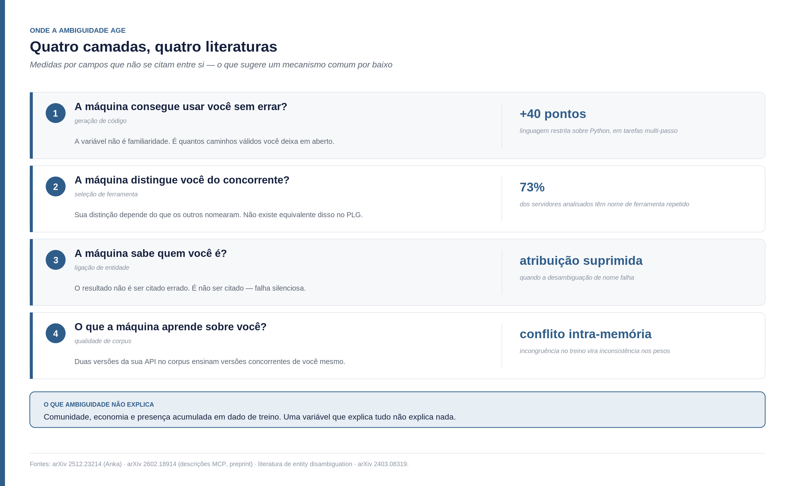
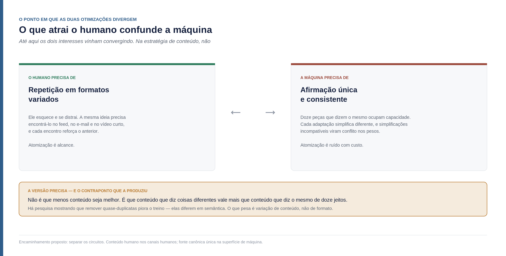
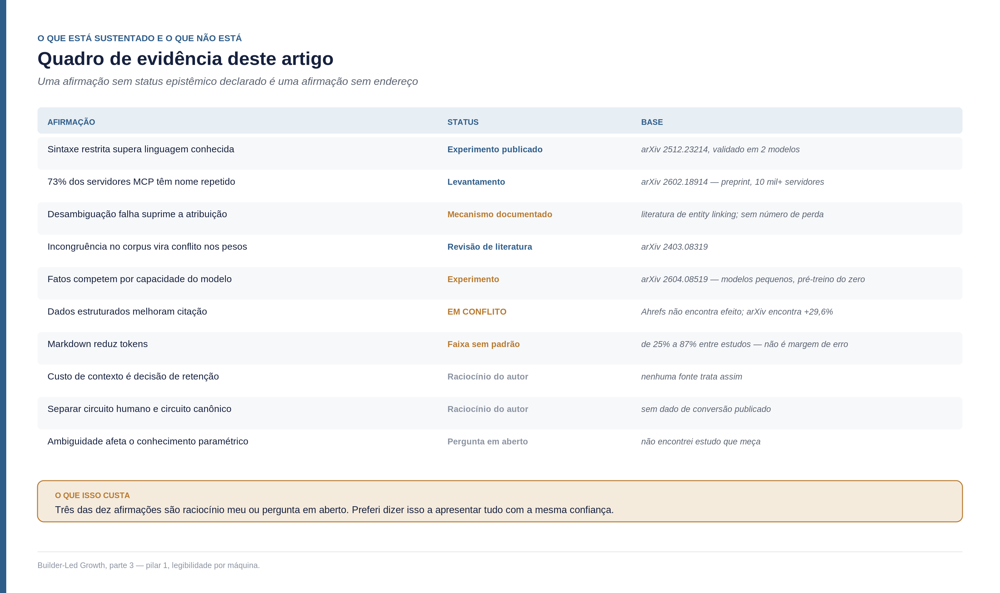

<!--
Parte 03 da série Builder-Led Growth, por Matheus Ramos.
VERSÃO NÃO CANÔNICA. A canônica é a inglesa: ../en/03-machine-legibility.md
Em caso de divergência de fato ou de número, a inglesa prevalece.
Publicada no LinkedIn em 5 de agosto de 2026: https://www.linkedin.com/pulse/builder-led-growth-parte-3-o-imposto-que-m%C3%A1quina-e-v%C3%AA-matheus-768vf/
Gerado a partir do repositório privado de trabalho. Não editar aqui.
-->

# Builder-Led Growth, parte 3: o imposto que a máquina cobra e o humano não vê

*Terceira parte da série sobre Builder-Led Growth. A [parte 1](01-quando-a-maquina-e-cliente.md) nomeou a disciplina e propôs quatro pilares. A [parte 2](02-decisao-preco-e-medicao.md) abriu o mecanismo da decisão, o papel do preço e o que medir. Esta abre o primeiro pilar por dentro — e ele acabou sendo sobre uma variável que eu não tinha visto quando escrevi os dois textos anteriores.*

Antes de entrar no primeiro pilar, vale recolocar os quatro na mesa. São semanas entre um artigo e outro, e quem chega por este texto não precisa ler os anteriores para acompanhar.

## Os quatro pilares, em uma página

**Legibilidade por máquina.** A máquina consegue ler, entender e usar seu produto sem ambiguidade. Cobre desde a documentação até a superfície de API, passando por dados estruturados e formato de arquivo. É o assunto deste artigo.

**Acessibilidade operacional.** A máquina consegue começar sem que um humano precise intervir no meio do caminho. Chave de API, autenticação, número de passos manuais, quanto contexto sua integração consome.

**Comunidade e sinal de validação.** Existe material produzido por terceiros do qual a recomendação futura vai se alimentar — comparativos, código público, discussão técnica, presença em levantamentos.

**Confiança e segurança do modelo.** A máquina, e o humano atrás dela, aceitam usar sem revisar cada passo. É onde estão as certificações, a previsibilidade de erro, e a maior parte da demanda não atendida do mercado.

Uma correção que a parte 2 já fez e que vale repetir: comunidade não é exatamente um dos quatro. É o que **produz a matéria-prima** dos outros três. É ela que gera o código público que entra no treino, o conteúdo comparativo que pesa na recomendação, e o histórico de uso do qual a confiança se alimenta.

Cada pilar age num momento diferente da decisão de um agente, e é por isso que cada um recebe um artigo próprio. Começando pelo que a máquina consegue ler, entender e usar do seu produto.

## Dois arquivos Markdown, destinos opostos

Veja esse contraste, que eu não sabia explicar até esta rodada de pesquisa.

O `llms.txt` é um arquivo Markdown na raiz do domínio, com um resumo da sua documentação para modelos de linguagem. A parte 2 trouxe o número: a Ahrefs analisou logs de servidor de 137 mil domínios e encontrou **97% dos arquivos `llms.txt` com zero requisições** em maio de 2026.

O `AGENTS.md` é um arquivo Markdown na raiz do repositório, com instruções para agentes de código. Os números dele vão na direção oposta: mais de **60 mil repositórios** o adotaram até 2026, contra mais de 20 mil em agosto de 2025. Foi formalizado como padrão aberto naquele mês, em colaboração entre OpenAI, Google, Cursor, Factory e Sourcegraph, e hoje está sob curadoria da Agentic AI Foundation, da Linux Foundation. É lido nativamente por mais de trinta ferramentas — Claude Code, GitHub Copilot, Cursor, OpenAI Codex, Gemini CLI, Windsurf, Devin, Aider, Amazon Q, entre outras ([Codersera](https://codersera.com/blog/agents-md-complete-guide-2026/)).

Há também números de impacto circulando: projetos que adotaram relatam de 35% a 55% menos bugs gerados por agente, e queda no tempo de preparação de uma sessão de 20 a 40 minutos para menos de 2. Vale um cuidado aqui — quem reporta esses números é quem adotou, não um estudo controlado. Serve para indicar direção, não para medir tamanho.

Antes de seguir, um contrapeso que encontrei depois e que muda o conselho. Um estudo com quatro agentes e 438 tarefas comparou repositórios com `AGENTS.md` gerado automaticamente por um modelo, repositórios com o arquivo escrito à mão, e repositórios sem arquivo nenhum. Os arquivos auto-gerados **reduziram** a taxa de sucesso em relação a não ter arquivo. Os escritos à mão, listando só o que o agente não consegue inferir do código — ordem de comandos, restrições de sequência, armadilhas recorrentes —, tiveram o melhor resultado.

Ou seja: adotar o arquivo é o começo da conversa, não o fim dela. Um arquivo de seis mil tokens pedindo ao modelo que "descreva este repositório" é pior que a ausência dele, porque ocupa contexto com o que já estava visível e às vezes inventa regras que não existem. O que funciona é curto, escrito por quem conhece as armadilhas, e restrito ao não óbvio.

Dois arquivos Markdown. Mesma ideia aparente. Mesmo esforço de escrita. Destinos opostos.

A explicação não está no formato nem na qualidade. Está em outro lugar:

> O `AGENTS.md` fica onde o agente já está — dentro do repositório que ele foi encarregado de editar. O `llms.txt` fica onde alguém precisa mandar o agente ir.

E daí sai a definição que organiza este artigo inteiro:

**Legibilidade por máquina não é publicar um artefato legível. É colocar o artefato no trajeto que o agente já percorre.**

Isso muda a pergunta de trabalho. Não é "minha documentação está boa?". É "onde o agente passa quando resolve um problema no meu domínio, e o que ele encontra lá?".

## O Google separou as duas disciplinas, e há data

Em 5 de maio de 2026, o Google adicionou a verificação de `llms.txt` aos audits agênticos do Chrome Lighthouse. Dois dias depois, o Lighthouse 13.3.0 promoveu a categoria "Agentic Browsing" de experimental para a configuração padrão ([Search Engine Land](https://searchengineland.com/google-llms-txt-chrome-lighthouse-478246), [Chrome for Developers](https://developer.chrome.com/docs/lighthouse/agentic-browsing/llms-txt)).

A auditoria sinaliza a página se houver erro de servidor ao buscar o arquivo. Se ele não existir, o resultado é marcado como "não aplicável" — publicar segue sendo opcional.

Repare no que aconteceu. A mesma empresa que declarou publicamente que o `llms.txt` não afeta ranking de busca colocou o arquivo numa categoria de auditoria dedicada a **navegação agêntica**. Não é contradição. É a confirmação institucional de que o arquivo nunca foi instrumento de busca.

A parte 2 argumentou essa fronteira com log de servidor. Agora existe também um ato de quem opera o buscador, com data.

Isso resolve, sem retórica, a confusão mais comum sobre esta tese. GEO e AEO, *generative engine optimization* e *answer engine optimization*, pertencem a este pilar — otimizar para ser citado em respostas generativas e para ser extraído como resposta direta são práticas reais e úteis. Mas são um **subconjunto** dele, e operam numa camada só: a de recuperação. Um produto pode ir bem em GEO e continuar impossível de usar para um agente que precisa integrá-lo. São problemas diferentes.

## Das três fontes de incerteza, você controla uma

Aqui o artigo ganha a espinha que faltava, e ela vem de um lugar que eu não tinha consultado.

Um trabalho de 2026 propõe decompor a incerteza de um modelo de linguagem em três componentes distintos, em vez de tratá-la como um escore único ([The Anatomy of Uncertainty in LLMs](https://arxiv.org/abs/2603.24967), de Aditya Taparia e Ransalu Senanayake):

**Ambiguidade de entrada** — a incerteza que vem de o pedido admitir múltiplas interpretações válidas.

**Lacuna de conhecimento** — a que vem de cobertura insuficiente no treino ou informação desatualizada.

**Aleatoriedade de decodificação** — a que vem do próprio processo de amostragem.

A motivação declarada dos autores é prática: um escore único não diz o que fazer. A decomposição diz. Alta incerteza de entrada pede esclarecimento; alta incerteza de conhecimento pede recuperação ou mais dado; alta incerteza de decodificação pede ajuste de amostragem.

Essas três fontes mapeiam quase diretamente nas três entradas de decisão que propus na parte 2 — e a conexão é minha, não dos autores. Mas o que interessa aqui é o que a decomposição revela quando se pergunta *quem controla o quê*. A lacuna de conhecimento você controla de forma indireta, e em prazo de meses a anos. A aleatoriedade de decodificação quem controla é o harness, não você. **A ambiguidade de entrada é sua, diretamente, e agora.**

Das três razões pelas quais um modelo pode errar sobre o seu produto, uma está inteiramente nas suas mãos, e é a única que responde a uma mudança feita hoje.

E é justamente onde quase ninguém está trabalhando. A discussão pública sobre otimização para IA está quase toda em **aparecer**. Muito pouco dela está em **ser inequívoco**.

### Uma correção sobre prazos, antes de seguir

A parte 2 falou em "uma defasagem que estimo em 18 a 36 meses, considerando coleta, treino e liberação de um modelo grande". Ao investigar a lacuna de conhecimento com mais cuidado, ficou claro que aquela frase juntava duas grandezas diferentes.

O intervalo entre a data de corte de um modelo e o seu lançamento é bem menor, e vem encolhendo:

- **GPT-3**, lançado em junho de 2020, corte em outubro de 2019 — cerca de 8 meses
- **ChatGPT (GPT-3.5)**, novembro de 2022, corte em setembro de 2021 — cerca de 14 meses
- **GPT-4**, março de 2023, corte em setembro de 2021 — cerca de 18 meses
- **GPT-4 Turbo**, novembro de 2023, corte em abril de 2023 — cerca de 7 meses
- **Claude Fable 5**, junho de 2026, corte em janeiro de 2026 — cerca de 5 meses
- **GPT-5.6 Sol**, julho de 2026, corte em fevereiro de 2026 — cerca de 5 meses

A curva sobe até o GPT-4 e cai depois. Hoje o intervalo típico está entre 5 e 8 meses ([Otterly](https://otterly.ai/blog/knowledge-cutoff/), [RankScope](https://rankscope.ai/blog/chatgpt-knowledge-cutoff)).

Os 18 a 36 meses correspondem a outra coisa: o tempo até uma tecnologia acumular volume de corpus suficiente para o modelo gerá-la por padrão. Isso depende de curva de adoção, não de calendário de treino — e é estimativa minha, derivada do caso shadcn/ui, não número de fonte.

A conclusão prática da parte 2 continua de pé: se você começa hoje, conhecimento paramétrico não é alavanca deste trimestre. Mas pelo segundo motivo, não pelo primeiro.

E há um fato que vai além da correção: o Gemini 3.6 Flash opera sem data de corte fixa, com acesso a busca em tempo real. Se isso virar padrão, duas das três fontes de incerteza deixam de ser separáveis.

## Ambiguidade, em quatro camadas

Se ambiguidade é a variável sob seu controle, vale entender onde ela age. Encontrei quatro camadas, e o que me convenceu de que existe um mecanismo comum por baixo foi que elas são medidas por literaturas que não se citam entre si: geração de código, seleção de ferramenta, ligação de entidade e qualidade de dado de treino.

### Camada 1 — a máquina consegue usar você sem errar?

Na parte 2 usei o caso Drizzle × Prisma para argumentar que a superfície de API é, ela mesma, uma decisão de distribuição. O mecanismo relatado pelas fontes era específico: o schema TypeScript-nativo do Drizzle funciona melhor com editores de código com IA, enquanto a linguagem de schema própria do Prisma às vezes atrapalha o autocomplete.

Continuei puxando esse fio e encontrei um resultado que refina a regra que derivei dali.

Um experimento publicado em dezembro de 2025 construiu uma linguagem de domínio específico chamada Anka, desenhada com sintaxe explícita e restrita para reduzir ambiguidade na geração ([arXiv 2512.23214](https://arxiv.org/abs/2512.23214), de Saif Khalfan Saif Al Mazrouei). O resultado: **sem nenhuma exposição prévia à linguagem no treino**, o Claude 3.5 Haiku atingiu 99,9% de sucesso de parse e 95,8% de acurácia em 100 problemas de benchmark. E superou Python em **40 pontos percentuais** em tarefas de pipeline multi-passo — 100% contra 60%. A validação cruzada com GPT-4o-mini confirmou a vantagem, com 26,7 pontos.

A causa que os autores atribuem: a flexibilidade do Python permite múltiplos caminhos válidos e exige gestão implícita de estado. É justamente onde os erros aparecem.

Isso significa que a variável determinante não é familiaridade. Python é a linguagem mais representada em corpus de treino que existe, e perde para uma linguagem que o modelo nunca viu.

Na parte 2 eu li o caso Drizzle corretamente e derivei dele uma regra larga demais — algo como "inventar uma linguagem própria é tomar uma decisão de distribuição sem saber". O caso continua de pé; a regra precisa de ajuste. Inventar linguagem própria é problema quando ela soma **baixo volume no corpus** com **sintaxe que não restringe o espaço de saída**. Uma linguagem que restringe pode compensar a ausência total de treino.

A formulação mais útil, então:

> Desenhe para reduzir ambiguidade, não para parecer familiar.

Isso é acionável de um jeito que a regra anterior não era. Não se trata de evitar abstrações próprias — trata-se de perguntar, a cada decisão de design, quantos caminhos válidos ela deixa em aberto.

Vale tornar isso concreto, porque "reduzir ambiguidade" soa vago até virar exemplo. Algumas decisões de superfície que restringem o espaço de saída, tiradas do que as fontes de prática recomendam para consumo por agente:

**Enum no lugar de string livre.** Um parâmetro que aceita `"pending" | "active" | "cancelled"` tem três saídas possíveis. O mesmo parâmetro tipado como string tem infinitas — e nada impede o modelo de produzir `"in_progress"`, que é plausível, coerente com o domínio e inválido.

**Um propósito por endpoint.** A recomendação recorrente é evitar um `/process` genérico com uma dúzia de modos. Cada modo é uma bifurcação onde o agente pode escolher errado, e a descrição do endpoint precisa carregar todas as ressalvas ao mesmo tempo.

**Atalho declarado para o fluxo comum.** Se uma sequência de quatro chamadas é o caso frequente, oferecer uma chamada única que faça as quatro remove quatro pontos de erro de uma vez.

**Erro estruturado com código legível por máquina.** Sem isso, o agente não sabe se deve tentar de novo, tentar diferente ou parar — e a literatura de prática registra que ele entra em laço de repetição. Uma mensagem de erro em prosa é ambiguidade no pior momento possível: quando algo já falhou.

Vale dizer de onde vêm essas recomendações: são convergência de prática entre fornecedores de ferramentas de API e material de treinamento, não resultados medidos. Ou seja, é opinião informada de muita gente que fez isso, o que já é bastante — mas não é evidência.

### Camada 2 — entre você e o concorrente, a máquina consegue distinguir?

Esta é a camada mais desconfortável, e é onde está o dado mais forte desta rodada.

Um estudo analisou um corpus de mais de dez mil servidores MCP, classificando problemas de descrição em dezoito categorias ([From Docs to Descriptions, arXiv 2602.18914](https://arxiv.org/html/2602.18914) — preprint, ainda não revisado por pares). A distribuição dos problemas encontrados:

- **Nomes de ferramenta repetidos: 7.894 casos, cerca de 73% do corpus.** É a falha isolada mais frequente, com folga.
- Descrições funcionais confusas: 3.572
- Significado de parâmetro errado: 3.449
- Sem descrição do valor de retorno: 3.093
- Sem condições de acionamento declaradas: 2.972
- Entulho com detalhes irrelevantes: 2.904

A frase dos autores que resume o efeito: *"num ambiente com múltiplos servidores, essa ambiguidade semântica impede o LLM de distinguir entre ferramentas concorrentes, levando a comportamento de seleção arbitrária."*

E a causa que eles identificam é banal, o que a torna mais interessante: desenvolvedores nomeiam ferramentas a partir de funções utilitárias internas — `read_file`, `get_data` — em vez de identificadores unicamente distintos, que é o que um namespace compartilhado exige.

Um dado de apoio mostra o tamanho do efeito. Filtrar quais ferramentas o modelo vê, em vez de despejar todas, **mais que triplica** a acurácia de seleção: 43,13% contra 13,62% de linha de base, com corte de mais de 50% nos tokens de prompt ([RAG-MCP, arXiv 2505.03275](https://arxiv.org/html/2505.03275v1)).

Agora, o que isso tem de novo para quem pensa em crescimento.

**A sua distinção depende do que os outros nomearam.** Se três servidores expõem uma ferramenta chamada `search`, nenhum dos três é escolhido por mérito — o modelo seleciona arbitrariamente entre eles. Não existe equivalente disso no PLG, o crescimento puxado pelo próprio produto. Ali, um nome ruim custa a você. Aqui, o nome do concorrente custa a você também.

Vale registrar o enquadramento do próprio estudo: uma das perguntas de pesquisa é em que medida corrigir esses problemas **aumenta a vantagem competitiva** de um servidor MCP. É a tese deste artigo escrita em vocabulário de engenharia de software, por gente que não está discutindo distribuição.

E há duas correções que os autores derivam do próprio levantamento, e que valem mais que o diagnóstico.

A primeira é sobre **condições de acionamento**. Quase três mil casos do corpus não declaram em que situação a ferramenta deve ser usada. Uma descrição robusta, segundo eles, não pode apenas dizer o que a ferramenta faz — precisa dizer explicitamente o contexto em que ela deve ser preferida às outras. Repare no deslocamento: isso não é documentar a sua ferramenta, é posicioná-la contra as alternativas, dentro da própria descrição. É argumento de venda escrito para uma máquina.

A segunda é sobre **fronteiras**. Mais de mil casos apresentam limites pouco claros — até onde a ferramenta vai e onde ela para. Sem isso, o modelo executa comportamentos que a ferramenta não tem ou interpreta mal as restrições dos argumentos. Declarar o que você **não** faz é, contraintuitivamente, uma forma de ser escolhido: reduz a chance de ser chamado no caso errado e falhar.

Há ainda um diagnóstico dos autores sobre a causa raiz que merece ser citado, porque descreve um padrão de trabalho reconhecível: eles chamam de desenvolvimento *"código primeiro, descrição por último"*, em que a documentação é tratada como tarefa posterior e não como contrato funcional de interface.

Sob Builder-Led Growth, essa ordem se inverte. A descrição **é** a interface — é o único artefato que o cliente-máquina lê antes de decidir.

### Camada 3 — a máquina sabe quem você é?

A terceira camada é sobre identidade, e ela abre um assunto grande o bastante para eu não conseguir tratá-lo aqui.

O problema tem nome na literatura de recuperação de informação: desambiguação de entidade. Um nome pode corresponder a várias entidades — o exemplo canônico é a sigla ABC, que resolve para American Broadcasting Company, Australian Broadcasting Corporation ou o jornal espanhol. E uma entidade pode ter vários nomes: nome completo, sigla, variações de grafia, apelidos.

As entidades em maior risco são as de nome genérico, as que têm homônimo próximo entre concorrentes, e as que já acumulam histórico de confusão em conversas de venda e suporte.

O achado que mais me chamou atenção é o mecanismo da falha. Em pipelines de recuperação, as fontes são puxadas por relevância semântica e depois atribuídas por entidade. Se a desambiguação falha, **a atribuição é suprimida**. Ou seja: o resultado da ambiguidade de nome não é ser citado errado. É simplesmente não ser citado.

É uma falha silenciosa. Não aparece em nenhuma métrica de erro, porque nada deu errado — apenas nada aconteceu.

Existe um caso que torna o mecanismo visível, e ele é anterior à IA generativa. A linguagem criada no Google chama-se Go. O domínio `go.org` já estava tomado, o que levou a `golang.org`, e buscar a palavra "go" era inviável — palavra comum demais para ser indexada com precisão. A comunidade adotou "Golang" como apelido buscável, e o time passou a usar `golang.org` e o handle `@golang`. Há inclusive o issue de número 9 no repositório do projeto, aberto por alguém reivindicando já usar o nome para a própria linguagem.

O time do Go resolveu o problema com o instrumento disponível na época, e a linguagem cresceu. O que mudou não foi a decisão deles — foi o custo do problema. Na era da busca, o humano contornava digitando "golang", e o preço era atrito. A máquina não contorna: se a desambiguação falha, ela não tenta a variação alternativa por conta própria.

A contramedida disponível hoje é entrada em knowledge graph — Wikidata, dados estruturados, verbete — que é o sinal de desambiguação mais forte que existe.

Estou deixando esta seção curta de propósito. Ao investigar, o assunto se mostrou de outra escala: envolve branding e naming, taxonomia, linguística, engenharia de identificadores e governança — cinco corpos de conhecimento, cada um com literatura própria. Há inclusive um trabalho clássico demonstrando que ambiguidade é propriedade **funcional** da linguagem humana, não defeito dela — o que muda toda a discussão. Vou dedicar um artigo inteiro a isso.

Por ora, fica a constatação:

> Nomear parece decisão de marca. Sob Builder-Led Growth, é também decisão de distribuição.

### Camada 4 — a ambiguidade se inscreve nos pesos

As três primeiras camadas tratam do que acontece na hora. A quarta trata do que fica.

Uma revisão da literatura sobre conflitos de conhecimento em modelos de linguagem classifica o problema em três tipos: conflito entre o contexto e a memória do modelo, conflito entre fontes distintas dentro do contexto, e **conflito intra-memória** — inconsistência dentro dos próprios pesos ([Knowledge Conflicts for LLMs: A Survey, arXiv 2403.08319](https://arxiv.org/html/2403.08319v1)).

A afirmação relevante é direta: incongruências no conjunto de treino resultam em inconsistências no conhecimento codificado nos parâmetros do modelo.

Somando a isso dois comportamentos documentados na mesma revisão: modelos demonstram viés de confirmação forte, favorecendo a evidência que aparece com mais frequência; e há sensibilidade à ordem em que a informação é apresentada. Sobre capacidade de detectar o próprio conflito, o GPT-4 identifica contradições em documentos autocontraditórios com mais de 70% de probabilidade, enquanto outros modelos ficam abaixo de 50%.

Traduzindo para o problema de quem constrói produto:

> Se a API do seu produto mudou entre versões e as duas versões estão no corpus público, você criou um conflito intra-memória **sobre você mesmo**. O modelo passa a saber duas coisas incompatíveis a seu respeito — e a favorecer a que aparece com mais frequência, que costuma ser a versão antiga, porque teve mais tempo para acumular menções.

Isso reenquadra um fenômeno que todo mundo que usa assistente de código conhece: o agente sugerindo uma API depreciada. A explicação corrente é defasagem de data de corte. Às vezes é. Mas parte disso pode ser conflito interno de memória — e esse não se resolve esperando o próximo modelo, porque o material contraditório continua no corpus. Pior: pode se agravar, à medida que novas versões da sua API vão surgindo e cada uma deixa o próprio rastro de tutoriais, exemplos e respostas em fórum. Cada versão nova acrescenta uma voz à discussão que o modelo está tentando resolver sozinho.

A consequência prática é chata e ninguém trata como trabalho de distribuição: versionar de forma que não gere conflito, depreciar explicitamente no próprio material, manter nomenclatura consistente entre versões. É higiene de corpus.

E há uma assimetria cruel nisso. Quanto mais bem-sucedido você foi antes, mais material antigo existe sobre você — tutoriais de terceiros, respostas em fóruns, posts de blog, código de exemplo em repositórios abandonados. O sucesso passado é literalmente o que compete com a sua versão atual pela atenção do modelo. Um produto que nunca teve tração não tem esse problema; um que teve, tem.

Isso sugere uma prática que não vi ninguém recomendar: quando você quebra compatibilidade, o trabalho não termina em atualizar a sua documentação. Termina em tornar a mudança **detectável** no material que você não controla — nomes de método que não colidem com os antigos, mensagens de erro que dizem explicitamente "isto mudou na versão X", exemplos datados. Você não consegue editar o corpus alheio. Consegue fazer com que a versão nova seja inconfundível com a antiga.

### O corpus sobre você não é um depósito, é um orçamento

Há uma segunda descoberta nesta camada, e ela contraria frontalmente a recomendação padrão de otimização para IA.

Um trabalho de abril de 2026 formaliza a memorização de fatos do ponto de vista da teoria da informação e estuda como a distribuição do dado de treino afeta a acurácia factual ([Cram Less to Fit More, arXiv 2604.08519](https://arxiv.org/abs/2604.08519), de Jiayuan Ye, Vitaly Feldman e Kunal Talwar, na Apple). Os achados:

A acurácia factual fica **abaixo do limite de capacidade** sempre que a quantidade de informação contida nos fatos do treino excede a capacidade do modelo. O problema é agravado quando a distribuição de frequência dos fatos é enviesada — em lei de potência, por exemplo.

E o resultado que dá a medida do efeito: podar dados de treino permitiu a um modelo de 110 milhões de parâmetros memorizar 1,3 vez mais fatos de entidade do que com treino padrão, igualando o desempenho de um modelo dez vezes maior treinado no conjunto completo.

**Ressalva de rigor, e ela é grande:** o experimento é de pré-treino do zero, em corpus anotado da Wikipédia e conjuntos semissintéticos, com modelos pequenos. Extrapolar para o efeito de um produto específico dentro de um corpus de fronteira é inferência minha, não resultado do trabalho.

Feita a ressalva, o mecanismo é o que importa: **fatos competem entre si pela capacidade do modelo.** Um fato redundante sobre você ocupa espaço que outro fato seu poderia ocupar.

O que nos leva ao ponto mais contraintuitivo deste artigo.

## O que atrai o humano confunde a máquina

Existe uma prática consolidada em conteúdo, e ela está em expansão acelerada: atomização. A ideia é pegar um ativo central e quebrá-lo nas menores unidades utilizáveis — mensagens-chave, dados, citações, visualizações — adaptando cada uma ao formato de um canal. O ciclo recomendado é pilar, atomizar, distribuir, rodando semanalmente. Já existem agentes que executam isso de ponta a ponta, com promessas de redução expressiva de custo de produção.

Para o humano, faz sentido. Repetição em formatos variados é alcance. A mesma ideia encontra a pessoa no feed, no e-mail e no vídeo curto, e cada encontro reforça o anterior.

Para a máquina, essa mesma prática produz três efeitos, e nenhum deles é bom.

**Primeiro, custo de capacidade.** Doze peças que dizem a mesma coisa ocupam orçamento que outros fatos seus poderiam ocupar. É o mecanismo do parágrafo anterior aplicado à sua própria estratégia de conteúdo.

**Segundo, e este é o mais grave, inconsistência.** Ao adaptar a mesma mensagem a doze canais, cada versão simplifica de um jeito diferente. As simplificações não são idênticas — e afirmações ligeiramente incompatíveis sobre o mesmo produto viram o conflito intra-memória da seção anterior. Você não só gasta capacidade: você ensina versões concorrentes de si mesmo.

**Terceiro, ambiguidade fabricada.** Um trecho extraído de um argumento maior carrega menos contexto do que precisaria para ser lido de um jeito só. Fragmentar é remover a informação que desambiguava.

### O contraponto, que melhora o argumento

Antes de transformar isso em recomendação, encontrei uma evidência que vai na direção contrária e que vale mais do que a confirmação.

Há pesquisa mostrando que treinar em dado **deduplicado** produz resultado pior do que manter quase-duplicatas, com degradação equivalente a treinar com 5% a 10% menos dado. A explicação: quase-duplicatas são menos equivalentes do que se supõe — elas diferem de forma perceptível em semântica ([arXiv 2404.06508](https://arxiv.org/pdf/2404.06508)).

Isso me obrigou a precisar o mecanismo, e a versão precisa é mais forte do que a intuição inicial:

> Não é que menos conteúdo seja melhor. É que **conteúdo que diz coisas diferentes** é melhor que conteúdo que diz a mesma coisa de doze jeitos. O que ajuda a máquina é variação semântica. O que a atrapalha é variação de formato sem variação de conteúdo.

E é exatamente por isso que a atomização é o caso difícil: ela produz o segundo tipo por construção. Tem o custo de capacidade da duplicata sem o ganho informativo da variação genuína.

### Por que essa seção importa mais que as outras

Este é o primeiro ponto da série em que otimizar para o humano e otimizar para a máquina apontam em direções opostas.

Até aqui, os dois interesses vinham convergindo. Documentação clara serve aos dois. Integração sem atrito serve aos dois. Produto confiável serve aos dois. Aqui, não: o humano precisa de repetição e variação de formato para lembrar; a máquina precisa de afirmação única e consistente para não confundir.

O encaminhamento que me parece razoável não é escolher entre as duas otimizações. É **separá-las**. Aviso que daqui em diante é raciocínio meu — procurei alguém publicando dados sobre isso e não achei.

Separar significa algo mais específico do que ter uma seção de documentação. Significa aceitar que existem dois circuitos de conteúdo com regras diferentes:

**O circuito humano** continua como está. Atomização, repetição, adaptação por canal, variação de tom. Ele é otimizado para memória e alcance, e essas são propriedades de quem esquece e se distrai. Nada nesta pesquisa sugere mudar isso.

**O circuito canônico** obedece à regra oposta: cada afirmação sobre o seu produto existe **uma vez**, num lugar, na versão corrente. Documentação versionada, `AGENTS.md`, `llms.txt`, dados estruturados, referência de API. Quando algo muda, muda ali — e as versões anteriores são explicitamente marcadas como anteriores, não apagadas nem deixadas ambíguas.

A pergunta prática que separa os dois: **se esta afirmação estiver errada daqui a seis meses, em quantos lugares eu preciso corrigir?** Se a resposta for "um", é circuito canônico. Se for "doze", é circuito humano — e você acabou de aceitar que doze versões diferentes dela vão circular.

Isso tem um custo organizacional que não é pequeno. Na maioria das empresas, os dois circuitos são tocados por times diferentes, com metas diferentes, e o circuito canônico costuma ser responsabilidade de quem tem menos recurso. Não tenho solução para isso — é o tipo de problema que provavelmente pertence a um artigo sobre como times de produto se organizam sob esta disciplina.

## Custo de contexto também é legibilidade

Há uma dimensão da legibilidade que não parece pertencer a ela até você olhar os números.

Cada ferramenta exposta por um servidor MCP custa entre 550 e 1.400 tokens em nome, descrição, schema JSON, descrições de campo, enums e instruções de sistema. O servidor MCP oficial do GitHub consome 17.600 tokens de definições de ferramenta por requisição. Três serviços com quarenta ferramentas somam cerca de 55 mil tokens de definição **antes de o agente ler a primeira mensagem do usuário** — mais de um quarto do limite de 200 mil do Claude ([StackOne](https://www.stackone.com/blog/mcp-token-optimization/), [The New Stack](https://thenewstack.io/how-to-reduce-mcp-token-bloat/)).

Não é problema periférico. Existe issue aberta no repositório oficial do protocolo pedindo que a especificação enderece o overhead de cerca de mil tokens por ferramenta por sessão. E o assunto saiu do blog técnico e entrou em pesquisa formal, com trabalhos sobre compressão de schema de ferramentas publicados no arXiv. Uma solução do Atlassian Labs substitui o inventário completo por duas ferramentas genéricas e relata redução de 70% a 97% no consumo inicial.

Há ainda um efeito menos discutido: o custo das **respostas**. Uma única chamada a uma API corporativa pode devolver centenas de milhares de caracteres de JSON cru. Nas análises que encontrei, esse custo costuma superar o das definições, e recebe menos atenção.

"Publique um servidor MCP" virou conselho padrão. O dado sugere uma leitura mais cuidadosa: um servidor mal desenhado é um **custo imposto ao usuário**. Ele ocupa contexto que pertenceria ao trabalho da pessoa.

E aqui há uma consequência que fecha um circuito com a parte 2, que abriu a decisão e o preço.

A parte 2 descreveu o custo escondido de remover atrito: onboarding sem chave faz o agente consumir a cota mais rápido e antecipa o momento em que alguém precisa decidir sobre dinheiro. O custo de contexto produz o mesmo efeito por outra via — e essa é mais difícil de enxergar, porque **o custo não aparece na sua fatura, aparece na do usuário**.

Um servidor que ocupa 55 mil tokens encarece toda sessão em que está carregado. O humano percebe isso como lentidão, janela cheia ou conta de API subindo. A reação natural é remover ferramentas do harness. Ou seja: o agente adotou, e o humano **desadota** por economia — sem que nenhum preço de plano tenha entrado na conta.

A parte 2 formulou o limite da tese como "o BLG decide quem entra, a economia humana decide quem fica". Isso continua valendo, e agora fica mais amplo: não é só o preço do seu produto que devolve o controle ao humano. É qualquer custo que o uso do seu produto imponha a ele. Sob Builder-Led Growth existe uma fatura implícita que o fornecedor não emite e não vê.

Daí sai uma derivação que não encontrei em nenhuma fonte: **economia de contexto é decisão de retenção, não de engenharia.** Quem desenha o servidor com carregamento progressivo ou compressão de schema está comprando permanência. Toda a literatura que encontrei trata o assunto como otimização técnica.

E note a relação com o resto deste artigo. As soluções que a literatura propõe para o problema de contexto — carregamento progressivo, recuperação de ferramentas sob demanda, compressão de schema — são todas formas de **mostrar menos ao modelo de cada vez**. Aquele ganho de acurácia na escolha entre ferramentas concorrentes, de 13,62% para 43,13%, vem exatamente disso: filtrar quais ferramentas o modelo vê antes de pedir que ele escolha.

Ou seja, custo de contexto e ambiguidade não são dois problemas. São o mesmo problema medido em unidades diferentes. Cada token que você ocupa sem necessidade é atenção que o modelo distribui entre mais opções — e distribuir atenção entre mais opções é a definição operacional de ficar em dúvida.

## Dados estruturados: quando a evidência está em conflito

Esta seção é o oposto da anterior. Aqui os estudos discordam, e a discordância é mais informativa do que qualquer um deles isolado.

**A favor.** A parte 2 citou um teste em que o GPT-4 passou de 16% para 54% de respostas corretas quando o conteúdo consultado usava schema.org/JSON-LD. Um trabalho de março de 2026 mede efeito semelhante: JSON-LD enriquecido com páginas de entidade otimizadas para agente eleva a acurácia de geração aumentada por recuperação em 29,6% em pipelines padrão e 29,8% em pipelines totalmente agênticos. E o Google, em declaração de abril de 2025, afirmou que dados estruturados dão vantagem em resultados de busca.

**Contra.** A Ahrefs acompanhou 1.885 páginas que adicionaram JSON-LD entre agosto de 2025 e março de 2026, comparando-as a 4.000 páginas de controle com nível de citação semelhante. Não encontrou aumento significativo de citações em Google AI Overview, AI Mode ou ChatGPT.

Os dois lados têm desenho metodológico declarado. Não dá para descartar nenhum.

A reconciliação que me parece mais provável, e aqui já estou especulando com base no que li, está em como o modelo processa o arquivo. Modelos tokenizam a resposta HTML inteira, incluindo os blocos de script que contêm o JSON-LD, mas não fazem parsing daquilo como dado estruturado: leem como texto corrido, junto com o resto da página.

Se for isso, o ganho não vem de o modelo "entender schema". Vem de o schema **afirmar o fato de forma explícita, curta e sem ambiguidade** no meio do texto. O que explicaria por que a acurácia melhora nos estudos de recuperação enquanto a taxa de citação não melhora no estudo da Ahrefs: são coisas diferentes. Ser citado é competição por atenção. Ser citado corretamente é redução de ambiguidade.

E isso reforça a tese deste artigo. O valor do dado estruturado não é decorativo nem de ranqueamento. É desambiguar.

## Formato: a faixa honesta

Sobre Markdown contra HTML, os números existem em quantidade — e discordam entre si o suficiente para que escolher um seja desonesto.

Um estudo com 50 páginas relata redução de 67% em tokens, aumento de 31% em acurácia e economia mensurável de custo. Outros relatos apontam de 68% a 87% de redução para conteúdo limpo e páginas reais. Um benchmark medido chega a 71%. E há um estudo contrário, sugerindo que a economia real fica em torno de 25% e que os números altos são otimistas. Em pipelines de recuperação, a faixa relatada é de até 35% de ganho de acurácia com 20% a 30% menos custo de token.

> A direção é consistente entre todos os estudos. A magnitude não tem metodologia padronizada. De 25% a 87% não é margem de erro — é ausência de padrão.

Declaro o viés: converter conteúdo para Markdown legível por máquina é o racional de negócio do produto que estou construindo. É exatamente por isso que prefiro publicar a faixa inteira a escolher o número que me favorece.

## Quando a legibilidade sai do repositório

Uma objeção justa a tudo que escrevi até aqui: os exemplos vêm todos de ferramentas de desenvolvedor. Servidor MCP, `AGENTS.md`, schema de ORM. Alguém pode concluir que a tese só vale para quem vende a quem programa.

Há um movimento em curso que sugere o contrário.

O WebMCP é um padrão proposto ao W3C, desenvolvido em conjunto por Google e Microsoft, que permite a um site expor ações executáveis diretamente a agentes rodando dentro do navegador. O desenvolvedor declara funções JavaScript nomeadas e formulários HTML como endpoints legíveis por máquina — "buscar estoque", "iniciar checkout", "abrir chamado". Em vez de o agente tirar um screenshot da página e adivinhar onde clicar, o site entrega a lista do que sabe fazer e os parâmetros exatos de cada ação ([Web Developer](https://webdeveloper.com/news/google-webmcp-chrome-149-origin-trial/), [Locomotive](https://locomotive.agency/blog/webmcp-ai-agents-website-functions/)).

A diferença para o MCP tradicional é de arquitetura: o MCP conecta o agente a servidores de backend; o WebMCP mantém tudo dentro da aba. As ferramentas executam no JavaScript da página, compartilham a sessão que o usuário já tem, e o navegador media o que o agente pode fazer.

O estado atual: especificação aceita pelo Web Machine Learning Community Group do W3C em setembro de 2025, origin trial experimental no Chrome 149, suporte nativo em Chrome e Edge previsto para o segundo semestre de 2026. Firefox e Safari participam das discussões sem compromisso de implementação declarado.

Resumindo: é padrão em teste, com dois navegadores relevantes ainda fora. Vamos esperar para ver — mas vamos ver de qualquer forma, porque um dos dois maiores navegadores do mundo já está implementando.

O que ele significa para a tese, se avançar: qualquer site — comércio eletrônico, SaaS com interface, serviço — passa a poder declarar suas ações para uma máquina. Legibilidade por máquina sai do repositório e entra na web comum. E a mesma pergunta deste artigo se aplica: quantos caminhos válidos a sua declaração deixa em aberto?

## O que medir neste pilar

A parte 2 tratou de medição por estágio da decisão. Aqui vão as medidas específicas de legibilidade, em ordem de custo crescente.

**Taxa de acerto de citação.** Já propus isso na parte 2, quando o assunto era o que medir; agora o mecanismo está explicado. Uma lista de vinte perguntas sobre o seu domínio, revisadas manualmente uma vez por mês: quando o modelo menciona você, ele acerta o nome do pacote, o comando de instalação, o método? Quando ele erra, a causa costuma estar em uma de duas coisas que vimos aqui — ou ele não sabe quem você é, e resolveu seu nome para outra entidade, ou ele aprendeu duas versões incompatíveis suas e escolheu a errada.

**Dispersão semântica.** Derivado dos métodos de quantificação de incerteza: faça a mesma pergunta sobre o seu produto várias vezes e meça o quanto as respostas divergem **em significado**, não em palavras. A distinção importa — entropia em nível de token captura variação de fraseado e não distingue isso de ambiguidade real, por isso a literatura desenvolveu medidas de entropia semântica. Alta dispersão sobre você é medida indireta de ambiguidade da sua superfície.

**Auditoria de nomes.** Seus identificadores colidem com os de quem? Nos registries de MCP isso é verificável diretamente. Lembrando que cerca de 73% dos servidores analisados no levantamento têm nomes de ferramenta repetidos — a chance de você estar nessa conta é alta o suficiente para justificar a checagem.

**Custo de contexto.** Quantos tokens seu servidor ocupa antes da primeira mensagem do usuário. É mensurável em uma tarde e quase ninguém mede.

**Consistência entre versões.** Quantas afirmações incompatíveis sobre o seu produto existem hoje no corpus público. Documentação antiga não removida, tutoriais de terceiros desatualizados, respostas antigas em fóruns.

Aqui há uma lacuna que vale dizer em voz alta: **não existe índice de ambiguidade calculado a partir do artefato**, sem passar por um modelo. A única exceção que encontrei foi o detector construído para aquele levantamento de servidores MCP, e ele serve só para descrições de ferramenta. Todas as medidas acima olham para o sintoma dentro do modelo. Medir a causa no próprio material continua sendo problema em aberto — e, na minha leitura, uma oportunidade.

Vale explicitar por que essa distinção importa e não é preciosismo. Medir o sintoma dentro do modelo tem três limitações práticas: custa dinheiro por execução, muda quando o modelo muda, e chega tarde — quando a dispersão semântica aparece, o material ambíguo já está no corpus há meses. Um índice calculado sobre o artefato responderia antes de publicar, custaria quase nada e não dependeria de qual modelo está na frente. É a diferença entre um exame de sangue e uma balança.

Enquanto isso não existe, o substituto razoável é manual e barato: pegar sua documentação principal e sua descrição de ferramentas e perguntar, linha a linha, quantas leituras diferentes cada afirmação admite. É trabalho tedioso — e, pelos números daquele levantamento de dez mil servidores, é onde está a maior parte do problema.

## Onde ambiguidade não explica nada

Uma variável que explica tudo não explica nada. Vale marcar onde esta para.

Ambiguidade explica execução, seleção competitiva, identidade e parte do que o modelo aprende. **Não explica** por que terceiros escrevem sobre você — isso é o pilar do sinal de validação, aquele material de terceiro do qual a recomendação se alimenta, e depende de comunidade e não de clareza. **Não explica** a economia que faz o humano trocar de fornecedor quando a fatura chega. E **não explica** a presença acumulada em dado de treino, que é função de volume e tempo, e que nenhuma quantidade de precisão acelera.

E ficou uma pergunta que honestamente não sei responder. Se conteúdo ambíguo produz representação ambígua nos pesos, então dois produtos com documentação de mesmo volume e mesma qualidade aparente poderiam estar representados de formas muito diferentes dentro do modelo — um com contornos nítidos, outro borrado. Procurei e não encontrei estudo que tenha medido isso.

Se você trabalha com avaliação de modelos e sabe de algum trabalho nessa direção, ou tem uma forma de testar, é o tipo de coisa que eu gostaria de discutir. Deixo a pergunta aberta de propósito.

## Fechamento

O que ficou mais nítido nesta rodada.

Legibilidade por máquina não é publicar um artefato legível — é estar no trajeto que o agente já percorre. O `AGENTS.md` e o `llms.txt` são o mesmo formato com o mesmo esforço, e a diferença de destino entre eles é inteiramente de posição.

Das três fontes de incerteza que um modelo tem sobre o seu produto, você controla uma diretamente e no curto prazo: a ambiguidade. Lacuna de conhecimento leva meses ou anos. Aleatoriedade de decodificação não é sua.

E ambiguidade age em quatro camadas, medidas por literaturas que não se falam: se a máquina consegue usar você sem errar, se consegue distinguir você do concorrente num namespace compartilhado, se sabe quem você é, e o que ela acaba aprendendo a seu respeito.

A formulação que eu levaria daqui:

> Ambiguidade é o imposto que a máquina cobra e o humano não vê. O humano resolve ambiguidade de graça — lê o contexto, pergunta, tenta de novo, infere pelo bom senso. É trabalho que ele nem registra como trabalho. A máquina não resolve: ela escolhe arbitrariamente, erra, ou desiste.

Cada ponto de ambiguidade que sobrou no seu produto porque "dá para entender" é um ponto onde a máquina pode escolher outro.

E o achado mais desconfortável desta parte é o da inversão. Até aqui, otimizar para humano e otimizar para máquina vinham convergindo. Na estratégia de conteúdo, elas divergem: o humano precisa de repetição em formatos variados, e a máquina precisa de afirmação única e consistente. Se essa leitura estiver certa, a resposta não é escolher um dos dois — é parar de servir os dois pelo mesmo canal.

Na parte 4 abro o segundo pilar: acessibilidade operacional. O que acontece quando a máquina já escolheu você e tenta começar — quantos passos exigem um humano, quanto custa o primeiro sucesso, e por que a maioria dos produtos perde ali sem que nenhuma métrica acuse.

Se alguma parte deste mecanismo não bate com o que você observa na prática, é esse tipo de resposta que a série precisa para avançar.

---

**Série Builder-Led Growth — arco 1: os quatro pilares**

- [Parte 1 — Quando a máquina também é seu cliente](01-quando-a-maquina-e-cliente.md)
- [Parte 2 — A decisão, o preço e o que medir](02-decisao-preco-e-medicao.md)
- Parte 3 — O imposto que a máquina cobra e o humano não vê (este texto)
- [Parte 4 — Quantas vezes o agente precisa chamar um humano](04-acessibilidade-operacional.md)
- [Parte 5 — O poço de onde todos bebem](05-comunidade-e-sinal-de-validacao.md)
- [Parte 6 — A máquina é imprensa e leitor ao mesmo tempo](06-relacoes-publicas.md)
- [Parte 7 — O que faz o agente confiar](07-confianca-e-seguranca.md)

O arco 1 está completo, e este bloco leva às sete partes. A série continua no arco 2, que não exige o arco 1 — cada peça de lá retoma os conceitos que usa.
