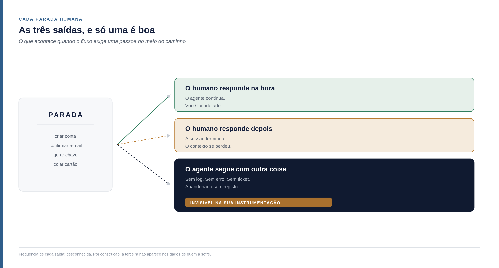
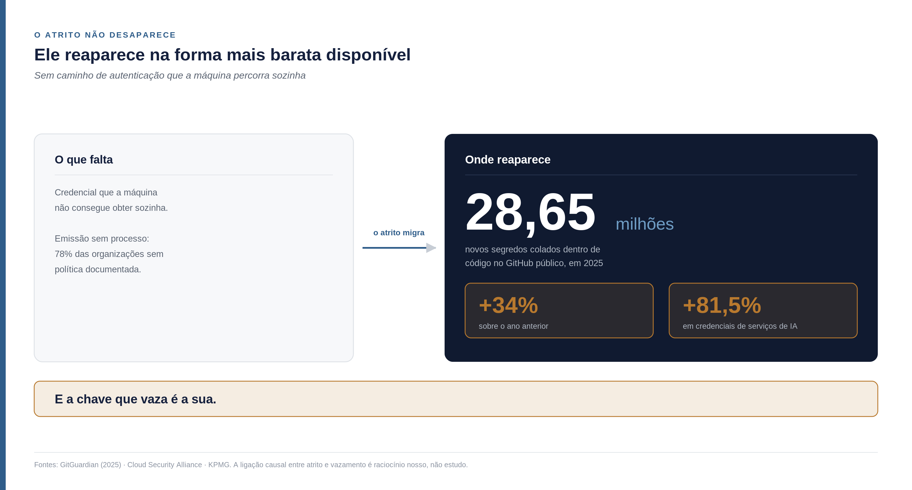
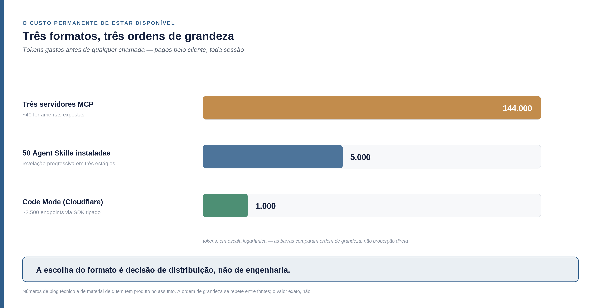
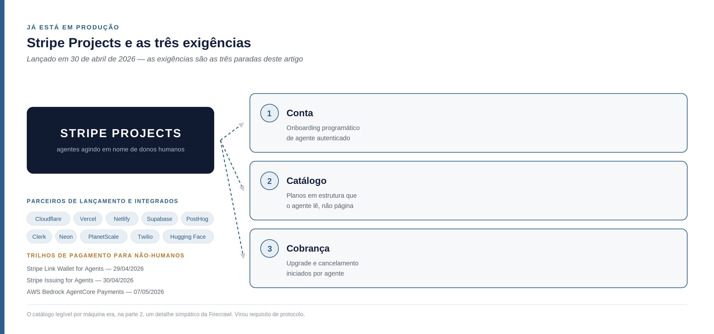
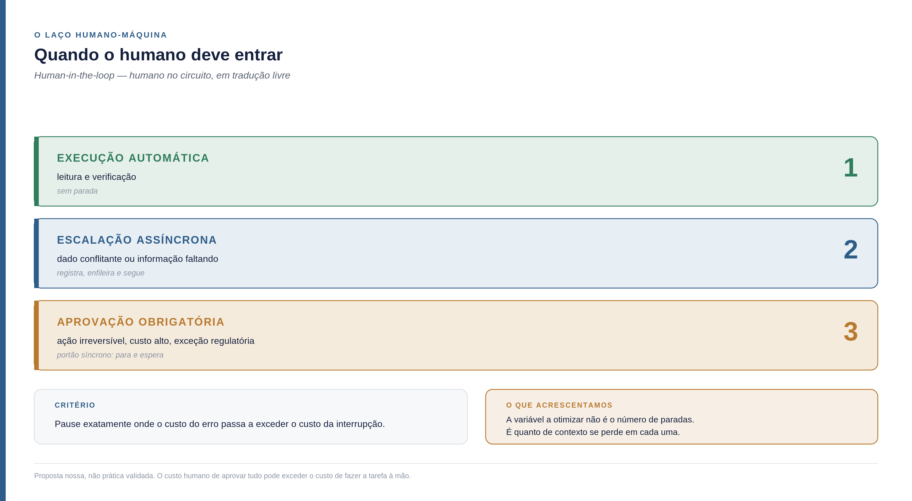

<!--
Parte 04 da série Builder-Led Growth, por Matheus Ramos.
VERSÃO NÃO CANÔNICA. A canônica é a inglesa: ../en/04-operational-accessibility.md
Em caso de divergência de fato ou de número, a inglesa prevalece.
Publicada no LinkedIn em 6 de agosto de 2026: https://www.linkedin.com/pulse/builder-led-growth-parte-4-quantas-vezes-o-agente-um-matheus-ubmwf/
Gerado a partir do repositório privado de trabalho. Não editar aqui.
-->

# Builder-Led Growth, parte 4: quantas vezes o agente precisa chamar um humano

*Quarta parte da série sobre Builder-Led Growth. A [parte 1](https://www.linkedin.com/pulse/builder-lead-growth-matheus-batista-ribeiro-ramos-mde2c) nomeou a disciplina e propôs quatro pilares. A [parte 2](https://www.linkedin.com/pulse/builder-led-growth-parte-2-decis%C3%A3o-o-pre%C3%A7o-e-que-matheus-nqnuf/) abriu o mecanismo da decisão e o papel do preço. A [parte 3](https://www.linkedin.com/pulse/builder-led-growth-parte-3-o-imposto-que-m%C3%A1quina-e-v%C3%AA-matheus-768vf/) tratou do primeiro pilar, legibilidade por máquina. Esta abre o segundo — e ele se resume a uma pergunta que dá para contar.*

## Os quatro pilares, em uma página

**Legibilidade por máquina.** A máquina consegue ler, entender e usar seu produto sem ambiguidade. Documentação, dados estruturados, formato de arquivo, superfície de API. Foi o assunto da parte 3.

**Acessibilidade operacional.** A máquina consegue começar sem que um humano precise intervir no meio do caminho. Credencial, autenticação, número de passos manuais, custo de estar disponível. É o assunto deste artigo.

**Comunidade e sinal de validação.** Existe material produzido por terceiros do qual a recomendação futura vai se alimentar — comparativos, código público, discussão técnica.

**Confiança e segurança do modelo.** A máquina, e o humano atrás dela, aceitam usar sem revisar cada passo.

Uma correção que a parte 2 fez e que vale repetir: comunidade não é bem um dos quatro. É o que **produz a matéria-prima** dos outros três — o código público que entra no treino, o conteúdo comparativo que pesa na recomendação, o histórico de uso do qual a confiança se alimenta.

Cada pilar age num momento diferente da decisão. Este trata do momento em que a máquina já escolheu você e tenta começar.

## O número que encerra a discussão sobre se isso é real

A Vercel publica um índice de produção do seu AI Gateway — a camada por onde passa o tráfego de modelos dos times que usam a plataforma. Os dados de abril de 2026, cobrindo mais de 200 mil times e sete meses de histórico, mostram o seguinte: **58,9% de todos os tokens já fluem em requisições de chamada de ferramenta**, contra 31,6% seis meses antes. E **22,2% das requisições terminam em uma chamada de ferramenta**, contra 11,4% em outubro de 2025 ([Vercel](https://vercel.com/blog/ai-gateway-production-index)).

Dobrou em meio ano.

Guarde a proporção: mais da metade dos tokens que circulam na camada de modelo não são conversa. São máquina chamando ferramenta. Se o seu produto não é uma dessas ferramentas, você está fora de mais da metade do tráfego que importa nessa camada.

E agora a parte incômoda: existe uma métrica consagrada para medir exatamente esse momento, e ela mede a coisa errada.

## A métrica que existe e começa a contar tarde demais

Em produtos de API, a métrica de referência chama-se *time to first successful call* — tempo até a primeira chamada bem-sucedida, contado da criação da conta até a primeira resposta que funciona. Abaixo de cinco minutos é considerado excelente. Acima de trinta indica atrito que reduz de forma relevante a conversão de quem testou para quem ativou.

Há uma variante mais antiga, o *time to first hello world* — tempo até o primeiro "olá mundo", ou seja, até o desenvolvedor conseguir o resultado mínimo que prova que aquilo funciona. Em times de relações com desenvolvedores, ela costuma aparecer ao lado de *weekly active tokens* — tokens ativos por semana — como as duas métricas norte da área. E há um dado prático interessante: oferecer uma coleção pronta para rodar deixa o desenvolvedor entre 1,7 e 56 vezes mais rápido na primeira chamada. A amplitude dessa faixa é grande demais para tratar como medida; serve para indicar que o efeito existe, não o tamanho dele.

Todas essas métricas têm uma coisa em comum: **começam a contar da criação da conta**.

Sob Builder-Led Growth, o relógio começa antes. O agente já escolheu você — venceu a candidatura, venceu a recomendação — e ainda não tem conta, nem chave, nem permissão. O intervalo que decide o resultado é o que vai da **intenção** à primeira chamada. E praticamente ninguém instrumenta isso, porque toda a instrumentação existente foi desenhada para um funil que começa no cadastro.

Uma das fontes que li resume bem a mudança de contexto: a documentação passou a ter duas audiências, e a audiência de máquina cresce mais rápido que a humana.

## A acessibilidade operacional em uma pergunta contável

A definição operacional deste pilar cabe numa frase:

> Conte quantas vezes o seu fluxo chama um humano, da decisão até a primeira chamada bem-sucedida.

É contável numa tarde. Pegue o caminho que um agente percorreria para usar seu produto pela primeira vez e marque cada ponto em que ele precisa parar e pedir algo a uma pessoa. Criar conta. Confirmar e-mail. Gerar chave. Aceitar termos. Escolher plano. Colar cartão.

Cada uma dessas paradas tem três destinos possíveis, e só um é bom.

**O humano responde na hora.** O agente continua, e você foi adotado. É o caso que todo mundo imagina quando desenha o fluxo.

**O humano responde depois.** Mas o contexto se perdeu. A sessão terminou, a janela fechou, o agente já não sabe por que precisava daquilo. Formalmente você foi adotado; na prática, aquela tarefa não foi concluída.

**O agente segue com outra coisa.** E aqui está o problema deste pilar.

## O que acontece quando a máquina não usa e também não chama o humano

O agente encontra uma parada, avalia que não vale interromper a pessoa, e resolve o problema de outro jeito. Sem log. Sem erro. Sem ticket de suporte. Sem sequer um cadastro abandonado que apareça em algum relatório.

O produto não foi rejeitado. Foi **abandonado sem registro**.

Aqui preciso ser rigoroso comigo mesmo, porque a tentação é grande. Não sei com que frequência isso acontece. Não tenho número nenhum, e nem poderia ter a partir dos dados de quem sofre o efeito — se houvesse registro, não seria essa saída. Escrever que é o cenário mais comum seria construir uma afirmação que se protege sozinha de qualquer contestação, e isso não é argumento.

O que dá para afirmar é mais estreito e ainda assim incômodo: **essa saída existe, é invisível na instrumentação que os produtos têm hoje, e o tamanho dela é desconhecido para quem a sofre.** Você não vê a fila de gente desistindo porque não há fila. Vê um número de ativações que parece razoável, sem denominador.

É a mesma forma de falha silenciosa que a parte 3, [o imposto que a máquina cobra e o humano não vê](https://www.linkedin.com/pulse/builder-led-growth-parte-3-o-imposto-que-m%C3%A1quina-e-v%C3%AA-matheus-768vf/), encontrou na desambiguação de nome — quando o modelo não resolve a quem um nome se refere, a atribuição some, e nenhuma métrica de erro acusa, porque nada deu errado. Aqui a falha acontece uma camada depois, na execução, e some do mesmo jeito.

E há um jeito de medir, ainda que indireto, que trago mais adiante na seção sobre o que acompanhar: instrumentar o lado do agente, e não o seu. Quem opera a frota de agentes vê a desistência que você não vê.

## Como a máquina decide continuar ou desistir

Se a decisão de desistir existe, vale entender por que ela é tomada. E ela é diferente das decisões dos estágios anteriores.

Na candidatura e na recomendação, o agente escolhe por preferência: o que ele conhece, o que consegue recuperar, o que parece adequado. Aqui não é preferência. É **viabilidade dentro do orçamento da tarefa**. O agente está no meio de outra coisa, tem contexto limitado e um objetivo que não é usar você.

O que pesa, a partir do que as fontes descrevem sobre comportamento de agente:

**Existe caminho que não exige humano?** Se não existe, o custo de insistir é indeterminado — pode ser trinta segundos ou pode ser o dia inteiro, dependendo de quando a pessoa olhar a tela.

**O erro devolvido diz o que fazer?** Uma mensagem que informa apenas que algo falhou obriga o agente a adivinhar. Uma que diz qual passo faltou permite continuar.

**Quantos passos faltam, e isso é descobrível antes de começar?** Um fluxo de seis etapas declarado no início é um custo conhecido. O mesmo fluxo descoberto uma etapa por vez é uma sequência de surpresas.

**O contexto restante comporta a tentativa?** Se a janela já está cheia — e a parte 3 mostrou o quanto ela enche rápido —, a tentativa nem começa.

Daí sai a formulação que me parece mais útil deste artigo:

> A máquina não desiste porque o produto é ruim. Desiste porque o caminho até o sucesso não é **estimável**.

Isso muda o que se deve corrigir primeiro. Não é reduzir o número de passos a qualquer custo — é tornar o custo visível antes de o agente investir na tentativa.

## O que trava é quase sempre a credencial

Se a maior parte das paradas fosse distribuída entre coisas diferentes, este pilar seria uma lista de melhorias soltas. Não é. Quase tudo converge para um ponto: a máquina precisa de uma credencial e não tem como obtê-la sozinha.

O termo que o mercado de segurança usa é **identidade não-humana** — qualquer credencial que não pertence a uma pessoa. Chave de API, token de serviço, conta de robô, certificado de máquina. Elas sempre existiram. O que mudou foi a proporção.

A KPMG, no relatório *Cybersecurity Considerations 2026*, estima que a empresa média já opera com mais de **80 identidades de máquina para cada identidade humana**. E o ritmo é o que assusta: uma organização que tinha cerca de 50 mil identidades de máquina em 2021 chegou a 250 mil em 2025 — cinco vezes mais em quatro anos.

Aqui as fontes divergem, e prefiro mostrar a faixa inteira em vez de escolher o número que soa melhor: em ambientes nativos de nuvem, um levantamento aponta 144 identidades de máquina por humano e outro aponta 45. Três vezes de diferença entre medidas que descrevem, em tese, a mesma coisa — o que por si só diz algo sobre o quanto essa contagem ainda está sendo aprendida.

O efeito, esse, aparece nas três fontes. **68% dos incidentes de segurança de TI envolvem identidades de máquina**, e metade das empresas pesquisadas já teve alguma brecha por identidade não-humana sem gestão. O preparo não acompanha: 78% das organizações não têm política documentada para criar ou remover identidades de IA, e apenas 8% declaram confiança alta de que o sistema que já usam para gerir identidade e acesso — o IAM, de *identity and access management* — dá conta do risco.

Sobre a procedência desses números, porque ela muda o peso que merecem: o de 80 para 1 é da KPMG, primária e nomeada. Os de governança e incidente vêm de um whitepaper da [Cloud Security Alliance](https://labs.cloudsecurityalliance.org/research/csa-whitepaper-nonhuman-identity-agentic-ai-governance-v1-cs/), associação do setor, e de duas compilações de mercado ([Axis Intelligence](https://axis-intelligence.com/machine-identity-statistics/), [Digital Applied](https://www.digitalapplied.com/blog/agent-identity-credentials-non-human-access-2026-playbook)) que citam pesquisas primárias que eu não abri uma a uma. São suficientes para sustentar a ordem de grandeza e a direção. Não são suficientes para eu defender a segunda casa decimal de nenhum deles.

Guarde esses números por dois parágrafos. Eles reaparecem em outro lugar, com outra cara.

## Atrito não desaparece, muda de lugar

A GitGuardian varre repositórios públicos procurando credenciais expostas. Em 2025 ela contou **28,65 milhões de novos segredos colados diretamente dentro de código** no GitHub público — alta de 34% sobre o ano anterior, o maior salto anual desde que a empresa começou a medir. As credenciais de serviços de IA, especificamente, cresceram 81,5%.

Agora junte as duas coisas. De um lado, um volume de identidades de máquina que quintuplicou e um processo de emissão que a maioria das organizações admite não ter. Do outro, dezenas de milhões de chaves aparecendo dentro de código público.

O mecanismo que liga uma ponta à outra é curto: quando não existe caminho de autenticação que uma máquina consiga percorrer sozinha, o atrito não desaparece. Ele reaparece na forma mais barata disponível para quem está com pressa — uma chave colada no código, porque era o jeito de fazer aquilo funcionar hoje.

E a chave que vaza é a sua.

Aviso que daqui é raciocínio meu: não encontrei nenhum estudo ligando causalmente atrito de onboarding a vazamento de credencial. O que existe são duas curvas subindo juntas e um mecanismo direto entre elas. É o bastante para eu levar a sério, não para eu afirmar como demonstrado.

Mas se a leitura estiver certa, ela muda de que time é o problema. Autenticação deixa de ser o requisito de segurança que atrapalha a adoção e vira parte do produto — porque o caminho que a máquina percorre sozinha é, ao mesmo tempo, o que reduz o atrito e o que tira a chave do repositório. Não são duas iniciativas disputando prioridade. É uma só.

## O que a especificação de 28 de julho de 2026 mudou

Vale explicar o protocolo antes de falar do que ele passou a fazer. **MCP** é a sigla de *Model Context Protocol* — um padrão aberto, criado pela Anthropic e adotado depois por outros fornecedores, que define como um agente descobre quais ferramentas externas existem e como as chama. É o encanamento pelo qual um assistente de código conversa com o seu produto.

A revisão publicada em 28 de julho de 2026 é a maior mudança que o protocolo teve até então, e boa parte dela ataca exatamente a parada humana que este artigo está contando. Vale destrinchar item por item, porque cada sigla esconde uma consequência prática.

**Núcleo sem estado.** Antes, um servidor podia depender de manter sessão entre uma requisição e outra. Agora não precisa. Na prática: hospedar um servidor MCP deixa de exigir infraestrutura especial e passa a rodar atrás de um balanceador comum.

**Servidores MCP passam a ser formalmente *resource servers* OAuth 2.1.** OAuth é o padrão de autorização que a web já usa há mais de uma década — é o que está por trás de "entrar com a sua conta do Google". Colocar o MCP dentro dele significa parar de inventar autenticação e reaproveitar o que o mundo já sabe operar.

***Protected Resource Metadata* obrigatório.** O servidor passa a publicar, em lugar previsível, onde o cliente deve se autenticar. O cliente descobre sozinho, em vez de alguém precisar contar para ele.

***Dynamic Client Registration*** — registro dinâmico de cliente. O cliente se registra programaticamente, em tempo de execução. Sem exagero: isto é a remoção formal, do protocolo, do humano que copiava um identificador de um painel e colava em outro lugar. É a parada humana mais comum de todas virando uma chamada.

***Resource Indicators*.** O token passa a ficar amarrado ao destino para o qual foi emitido. Se vazar, não serve em outro lugar — o que reduz o tamanho do estrago daquele item anterior sobre chaves em código público.

**Cache da listagem de ferramentas.** O `tools/list`, que é como o agente descobre o que existe, passa a poder ser cacheado. Ataca diretamente o custo de contexto medido na parte 3, [o imposto que a máquina cobra e o humano não vê](https://www.linkedin.com/pulse/builder-led-growth-parte-3-o-imposto-que-m%C3%A1quina-e-v%C3%AA-matheus-768vf/), e que a seção seguinte retoma com números.

[David Soria Parra](https://www.linkedin.com/in/david-soria-parra-4a78b3a), um dos criadores do MCP e hoje seu mantenedor principal na Anthropic, reconhece publicamente o problema de excesso de contexto e descreve a direção do protocolo nos mesmos termos: descoberta progressiva, transporte sem estado, composição por código. Não é uma crítica externa que o protocolo ignora — é o diagnóstico de quem o construiu.

O que isso significa para quem constrói produto: a maior parte das paradas humanas deste pilar deixou de ser um problema sem solução padrão. Passou a ser uma decisão de adotar, ou não, um padrão que já existe.

## O custo permanente de estar disponível

Resolvida a entrada, sobra uma conta que quase ninguém faz: **estar disponível custa, e custa toda vez.**

Não é o custo de ser chamado. É o custo de existir no contexto do agente antes mesmo de qualquer chamada — as definições de ferramenta que ele precisa carregar só para saber que você está ali. E aqui os três formatos disponíveis hoje separam-se por ordem de grandeza, não por preferência de gosto.

**MCP.** Entre 550 e 1.400 tokens por ferramenta exposta. O servidor oficial do GitHub consome cerca de 17.600 tokens por requisição. Um servidor de banco de dados com 106 ferramentas gastou 54.600 tokens antes de responder qualquer coisa. Três servidores somando cerca de 40 ferramentas queimaram 72% de uma janela de 200 mil tokens — e o trabalho ainda nem tinha começado. A Perplexity relatou ter abandonado o MCP internamente porque a conta não fechava em produção.

**Agent Skills.** Padrão aberto publicado pela Anthropic em 18 de dezembro de 2025 e adotado por OpenAI, Google, GitHub e Cursor em semanas. O formato é um arquivo `SKILL.md`, e o mecanismo é *progressive disclosure* — revelação progressiva, o princípio de mostrar só o necessário em cada etapa, que vem do design de interface e aqui é aplicado ao contexto do modelo. Funciona em três estágios: a descoberta carrega apenas nome e descrição; a ativação lê o arquivo inteiro quando a tarefa casa; a execução carrega o resto se precisar. O resultado: **50 skills instaladas custam cerca de 5.000 tokens permanentes** — cerca de um décimo do que três servidores MCP custavam no exemplo acima.

**Code Mode**, da Cloudflare. Em vez de expor definições de ferramenta, expõe um SDK tipado e um ambiente isolado onde o agente escreve código para usar o produto. O número reportado: um contexto de ferramentas de 1,17 milhão de tokens caiu para cerca de mil, cobrindo aproximadamente 2.500 endpoints. É uma redução de 99,9%, e a magnitude é grande o suficiente para eu marcar que ainda não confirmei na fonte primária.

Uma ressalva que vale onde os números aparecem, e não em rodapé: boa parte destas medições vem de blog técnico e de material publicado por quem tem produto no assunto. As ordens de grandeza se repetem entre fontes independentes, o que me deixa confortável com a comparação relativa. Os valores exatos, não tanto.

> A escolha do formato pelo qual você se torna disponível é decisão de distribuição, não de engenharia. Ela determina quanto custa, ao seu cliente, manter você por perto.

E há uma assimetria nisso que vale enxergar. O custo de estar disponível é pago pelo cliente, em tokens, toda vez que ele abre uma sessão — mesmo nas sessões em que não usa você. Um produto caro de manter por perto é um produto que alguém, em algum momento, remove da configuração para liberar espaço. Não por insatisfação. Por orçamento.

## Isso já está em produção, e dá para ver de fora

Até aqui tudo pode soar como recomendação. Não é: há empresas que já reorganizaram produto em torno dessas paradas, e o que elas exigem de quem se integra mostra bem o que este pilar cobra.

Em 30 de abril de 2026 a Stripe lançou o **Projects**, um protocolo que permite a agentes criar contas, comprar domínios, fazer upgrade de plano e implantar infraestrutura em nome de donos humanos. Cloudflare, Vercel e Netlify entraram como parceiras de lançamento; Supabase, PostHog, Clerk, Neon, PlanetScale, Twilio e Hugging Face já aparecem integradas.

Repare no que o protocolo exige de quem adere, porque são exatamente as três paradas que este artigo vinha contando:

1. Criação de conta que aceita onboarding programático de um agente autenticado
2. Catálogo de planos exposto em estrutura que o agente lê, não apenas uma página de preço feita para humano
3. Cobrança que aceita upgrade e cancelamento iniciados por agente

O segundo item merece um segundo olhar. Na parte 2 a Firecrawl aparecia publicando um `/pricing.md` — uma versão do preço escrita para máquina — e aquilo parecia um detalhe simpático de quem entendeu o jogo antes. Deixou de ser detalhe: virou requisito de protocolo de um dos maiores processadores de pagamento do mundo.

Ainda em abril e maio de 2026 apareceram os trilhos de pagamento: **Stripe Link Wallet for Agents** e **Issuing for Agents**, em 29 e 30 de abril, e o **AWS Bedrock AgentCore Payments**, em 7 de maio, com Coinbase e Stripe, no qual agentes descobrem, avaliam e pagam por APIs e servidores dentro de um mesmo laço de execução.

Isso responde diretamente a uma recomendação que a parte 2 fez sem ter como cumprir: ter um caminho de receita que a máquina consiga percorrer. Naquele momento era uma boa ideia sem infraestrutura. Agora a infraestrutura existe.

E há um reconhecimento mais silencioso, que eu acho o mais revelador dos três. A Cloudflare publicou uma superfície de documentação dedicada a agentes, separada da documentação para pessoas, em `developers.cloudflare.com/docs-for-agents/`. É a admissão explícita de que o leitor-agente e o leitor-humano querem visões diferentes do mesmo material — que é a inversão descrita na parte 3, [o imposto que a máquina cobra e o humano não vê](https://www.linkedin.com/pulse/builder-led-growth-parte-3-o-imposto-que-m%C3%A1quina-e-v%C3%AA-matheus-768vf/), virando estrutura de site.

## O que herdamos, e o que acrescentamos

Se enxergo mais longe é porque estou sentado em ombro de gigantes. A frase é de Isaac Newton, numa carta a Robert Hooke de 1675, embora a metáfora seja bem mais antiga — atribuída a Bernardo de Chartres no século XII e registrada por João de Salisbury. Vale aqui.

[Joshua Baer](https://www.linkedin.com/in/joshuabaer), fundador e CEO do Capital Factory, publicou em abril de 2026 o framework **Agents First**, em agentsfirst.dev, com uma formulação que prefiro citar na íntegra a parafrasear:

> "Todo produto está ganhando um segundo cliente: o humano que paga e o agente que decide."
>
> — Joshua Baer, *Agents First*, abril de 2026

O framework traz nove princípios de implementação, uma escada de adoção em cinco níveis, anti-padrões nomeados e um instrumento aberto que pontua sites. É trabalho sério, e melhorou o entendimento desta série sobre o fenômeno — digo isso com todas as letras porque é verdade e porque creditar bem custa pouco.

E, no mesmo movimento, o que muda aqui. Aquele framework pergunta como construir a interface para o agente. Esta série pergunta o que a interface faz com a sua distribuição — e o que acontece quando o humano volta a decidir. As decisões são as mesmas: desenho de API, formato de documentação, escolha de protocolo. O que proponho é tirá-las da categoria "assunto técnico" e levá-las para a mesa de growth, com growth tendo papel na decisão.

O ganho prático dessa mudança é o que interessa a quem lê. Quando a escolha de formato deixa de ser decisão de engenharia e passa a ser decisão de distribuição, ela passa a ser avaliada por custo de aquisição, por retenção e por permanência — não por elegância de arquitetura. Times de produto e de growth ganham vocabulário para disputar uma decisão que hoje acontece sem eles na sala.

Há também terreno que esta série cobre e que fica fora do escopo declarado daquele trabalho: comunidade como produtora da matéria-prima dos outros pilares, presença acumulada em dado de treino, o limite econômico onde o humano retoma a decisão — e a experiência combinada, que é a próxima seção.

Dois instrumentos que dá para usar hoje, e que são complementares entre si e ao que proponho aqui: o **Agent Readiness Score** da Cloudflare, que mede sinais externos verificáveis por um rastreador, e o **a14y.dev**, com 38 verificações versionadas aplicadas a páginas.

Um dado do levantamento da Cloudflare mostra o tamanho da janela: **4% dos sites declaram preferências de uso de IA**, e menos de quinze sites, somados, publicam cartões de servidor MCP ou catálogos de API. O campo está praticamente vazio. É por isso que tratar o assunto como decisão de crescimento, e não como tarefa de infraestrutura, ainda rende vantagem.

## A experiência combinada

Aqui entra um acréscimo à tese, e ele começou com um relato — meu, com todo o viés que isso carrega.

Configurando meios de pagamento para dois projetos, com Stripe, trabalhando em *vibe coding* — programar conversando com o agente, deixando que ele escreva a maior parte do código —, a quantidade de vezes que precisei intervir foi pequena. Os resultados vieram certos. Praticamente não houve retrabalho.

É experiência de um usuário satisfeito, com interesse declarado no assunto, e não uma medida. Mas há algo nela que os números deste artigo inteiro não capturam: **a ausência de retrabalho**. Nenhuma métrica de adoção conta quantas vezes o humano precisou corrigir o que o agente fez com aquela ferramenta. E é exatamente isso que a pessoa sente ao usar.

Daí sai o conceito. Não existem duas experiências paralelas, uma para o agente e outra para o humano, que um time otimiza em separado. Existe **uma só**, que atravessa os dois, e cuja qualidade percebida se forma na costura entre eles.

Três consequências, e elas são desconfortáveis.

**A experiência humana passa a ser mediada.** A pessoa não experimenta o seu produto. Ela experimenta o resultado que o agente produziu usando o seu produto. Sua interface pode ser irrelevante e o produto ainda assim ser amado; pode ser excelente e o humano nunca chegar a vê-la.

**A qualidade percebida muda de definição.** Deixa de ser a qualidade do que você construiu e passa a ser a qualidade do que o agente conseguiu fazer com o que você construiu. São duas coisas diferentes, e a segunda depende inteiramente dos dois primeiros pilares — o quanto a máquina consegue ler e entender você, e o quanto consegue operar você sem parar no meio. É o que este artigo e o anterior vinham dizendo por outro caminho.

**E a terceira eu não sei responder.** No meu relato, o acerto do agente ao usar a Stripe foi sentido por mim como qualidade da Stripe. Mas eu sei distinguir as camadas — sei o que é a ferramenta, o que é o modelo e o que é o meu próprio prompt. Alguém que não faz essa distinção provavelmente atribui tudo ao agente. Se for assim, produtos excelentes podem estar construindo reputação para o assistente e não para si mesmos. Não tenho dado nenhum sobre isso, e é uma pergunta que muda bastante o cálculo de quem investe em ser bom para máquina. Se você tem como observar isso no seu produto, é o tipo de coisa que eu gostaria de saber.

O que fica: a jornada do usuário agora passa pela máquina, e isso torna tudo mais complexo. Otimizar apenas a execução produz um produto que funciona e ninguém percebe. Otimizar apenas a interface humana produz um painel que ninguém abre.

## Quando o humano deve entrar

Este artigo passou dez seções contando paradas humanas como custo. Falta dizer o contrário, que é igualmente verdadeiro: há paradas que precisam existir, e removê-las é pior do que mantê-las.

O nome que a literatura usa é *human-in-the-loop* — humano no circuito, em tradução livre: o desenho em que a execução automática pausa para uma decisão humana em pontos definidos. Existem dois padrões, e a diferença entre eles importa mais do que parece.

O **portão síncrono** para tudo e espera. Controle máximo, latência máxima. É o desenho certo quando a ação é irreversível — apagar dados, transferir dinheiro, publicar algo.

A **escalação assíncrona** registra o ponto de decisão, coloca numa fila e segue trabalhando em outra coisa. Perde controle imediato, ganha continuidade.

A graduação que aparece com mais frequência tem três faixas: execução automática para leitura e verificação; escalação quando há dado conflitante ou informação faltando; aprovação obrigatória para ação irreversível, custo alto ou exceção regulatória. E o critério que organiza as três é razoavelmente simples de enunciar — pause exatamente onde o custo do erro passa a exceder o custo da interrupção.

Há um alerta recorrente junto, e ele é o contrapeso honesto de tudo que este artigo defendeu: o custo humano de aprovar tudo pode facilmente exceder o custo de simplesmente fazer a tarefa à mão. Um fluxo com dez portões síncronos não é um fluxo seguro, é um fluxo que ninguém usa.

E aqui vai a proposta que eu acrescento, que é raciocínio meu e não prática validada: para Builder-Led Growth, o desenho que serve é o que **preserva o contexto da tarefa através da parada**. Um portão síncrono que perde tudo quando a pessoa demora duas horas para olhar é pior que uma escalação assíncrona que retoma exatamente de onde estava. Volte às três saídas do começo do artigo: a segunda — o humano responde depois e o contexto se perdeu — é uma falha de desenho do laço, não uma falha do humano. A variável a otimizar não é o número de paradas. É quanto se perde em cada uma.

O Stanford Digital Economy Lab, em relatório de 2026, encontrou ganhos mais fortes justamente em fluxos com critério de sucesso claro e erros recuperáveis. A frase que resume a direção do setor é boa: não se trata de autonomia sem supervisão, e sim de **autonomia seletiva**.

O grau de acoplamento entre as duas personas — a máquina que executa e a pessoa que responde — é assunto grande o bastante para um artigo próprio, e é o que pretendo fazer.

## Como crescer dentro de um registry

Uma pergunta prática, já que os diretórios curados de servidores MCP são hoje um caminho de descoberta: o que fazer para existir bem dentro deles?

Publique um `server.json` correto sob um nome cuja posse você comprovou. Quando a autenticação for por GitHub, use o padrão de namespace `io.github.<usuário-ou-org>/<servidor>`. Reivindique as listagens que já existem em diretórios de terceiros, porque provavelmente elas existem sem você. Configure integração contínua para registrar cada versão automaticamente — submissão manual produz listagem desatualizada, e listagem desatualizada é pior que ausência, porque instrui errado. Liste também no Glama, que rastreava cerca de 37 mil servidores em meados de 2026, e no `awesome-mcp-servers`. E vale saber que o digest semanal do PulseMCP é descrito por autores como um dos canais de maior sinal.

A ligação com o artigo anterior é direta. Aquele levantamento que encontrou quase 7.900 nomes de ferramenta repetidos entre servidores MCP descrevia um problema sem apontar o que fazer. É aqui: o namespace do registry é literalmente o lugar onde esses nomes brigam, e reivindicar o seu cedo é a ação concreta que faltava.

## O que se ganha, e não só o que se evita

Este pilar foi apresentado até agora pelo lado da perda. Vale virar a moeda.

**A conversão de piloto para produção sobe.** Um levantamento aponta 38% em stacks com MCP integrado contra 22% sem. É projeção de consultoria, não pesquisa com amostra declarada, e trato como indicação de direção e não como medida.

**O custo de conectar tende a zero.** O caminho tradicional de integração tem cerca de oito passos, da leitura da documentação ao deploy. O caminho desenhado para agente tem dois: instalar e conectar. O que desaparece é código de ligação. O que não desaparece — e é honesto dizer — é mapeamento de dado, regra de negócio e trabalho de conformidade. Esses continuam sendo humanos.

**Compatibilidade rende alcance sem efeito de rede.** Cada novo cliente de agente que passa a suportar o protocolo amplia o seu alcance sem que você faça nada. É diferente de efeito de rede: seu produto não fica mais valioso quando há mais clientes, fica mais **alcançável**. A distinção importa porque muda o que você faz — em efeito de rede, você corre atrás de usuários; aqui, você corre atrás de compatibilidade.

**Ergonomia vira diferencial durável.** Dois produtos com a mesma API REST podem oferecer experiências de agente que não se parecem. Um expõe uma ferramenta genérica de consulta e deixa o agente descobrir o resto. O outro expõe dez ferramentas bem nomeadas, com parâmetros tipados e erros que dizem o que fazer. A API é a mesma. A taxa de sucesso, não.

## Onde este pilar difere do que já se faz

Vale marcar as fronteiras, porque muita coisa aqui parece já resolvida por disciplinas existentes.

**Contra o design de API clássico:** ali o consumidor é humano — uma pessoa que lê a documentação uma vez e escreve código que persiste, e que acumula familiaridade com o seu produto ao longo do tempo. Aqui o consumidor é a máquina, que decide de novo a cada sessão e não acumula nada entre uma e outra: cada sessão começa do zero, sem memória do que funcionou da última vez. Documentação boa resolve o primeiro caso. Não resolve o segundo.

**Contra o PLG, o crescimento puxado pelo próprio produto:** o funil de ativação começa no cadastro. Aqui o momento que decide acontece antes de existir conta.

**Contra o Agent-Led Growth:** ali existe um comprador com processo de avaliação. Aqui a adoção é subproduto de outra tarefa, e ninguém está avaliando nada.

**Contra o Agents First:** ali a pergunta é como construir a interface. Aqui é o que a interface faz com a sua distribuição — e o que acontece quando o humano volta a decidir.

## O que medir

Sete coisas, em ordem de quanto eu confio nelas.

**Número de paradas humanas** entre a decisão e a primeira chamada bem-sucedida. É a definição operacional do pilar e dá para levantar numa tarde.

**Tempo da intenção à primeira chamada**, e não do cadastro. Exige instrumentação que provavelmente você não tem.

**Taxa de sucesso de chamada de ferramenta.** Abaixo de 90% indica problema de desenho, não de infraestrutura.

**Acurácia de seleção de ferramenta.** Registre a sequência de chamadas por tarefa e marque os casos em que o agente chama uma, recebe erro e tenta outra. Cada um desses é um nome ou uma descrição que não estava clara.

**Taxa de retorno do agente** — o equivalente à retenção de sete e trinta dias, aplicada a quem não é gente.

**Custo permanente de contexto** do formato pelo qual você se expõe. É a conta da seção sobre formatos, feita para o seu caso.

**Taxa de visibilidade humana**: quantas ações de agente produzem algum artefato que a pessoa vê. Se o agente usa e o humano nunca fica sabendo, você tem um problema de atribuição — que é a pergunta em aberto da experiência combinada, virando métrica.

E fica devendo a saída invisível, aquela em que o agente segue com outra coisa. Ela não aparece em nenhuma dessas sete, porque não aparece na sua telemetria por definição. O que dá para fazer é reproduzi-la: **rode um agente contra o seu próprio fluxo**, com a mesma tarefa que um cliente real daria, e conte quantas vezes ele para, o que ele faz depois de parar, e em quantas tentativas chega ao fim. Rode contra dois ou três concorrentes na sequência, porque o número sozinho não diz nada sem comparação. Não é medida de mercado, é medida de bancada — e é a única disponível hoje. Se você opera uma frota de agentes, aí sim tem o dado que os fornecedores não têm: você enxerga a desistência do lado de quem desiste.

A lacuna atravessa a lista inteira e vale dizer com clareza: quase toda instrumentação existente começa no cadastro, porque foi desenhada para um funil humano. Três dessas sete métricas não têm ferramenta pronta hoje.

## Onde este pilar não chega

Acessibilidade operacional não faz a máquina escolher você — isso é a legibilidade por máquina, e é o que o dado de treino já decidiu. Não faz o humano continuar pagando, que é o limite econômico da parte 2: o BLG decide quem entra, a economia humana decide quem fica. E não substitui um produto que funcione.

Há ainda casos em que o número de paradas humanas é requisito, não defeito. Setores em que a aprovação existe porque alguém precisa responder por ela. Nesses, contar paradas continua útil — só que a meta deixa de ser zero.

O que este pilar faz é mais estreito e mais verificável do que qualquer promessa maior: ele determina se a escolha que já foi feita a seu favor vira uso, ou vira nada — sem que você fique sabendo.

## O que faria este pilar cair

Uma coisa me incomoda em ter escrito este artigo, e prefiro dizer do que deixar o leitor descobrir sozinho: o argumento tem uma forma que resiste a contestação com facilidade demais. Se a falha central não deixa rastro, qualquer ausência de evidência pode ser lida como confirmação. Isso é conveniente, e o que é conveniente merece desconfiança — inclusive a minha.

Então vale dizer, com a mesma clareza, o que me faria abandonar este pilar.

**Se reduzir paradas não mudar nada.** Pegue dois fluxos, um com seis paradas humanas e outro com uma, e rode a mesma tarefa nos dois com o mesmo agente. Se a taxa de conclusão for parecida, a cadeia causal que sustenta este artigo inteiro está quebrada, e a contagem de paradas é um número bonito que não prediz nada. Este é o teste mais barato de todos, e quem tiver dois produtos concorrentes na mão consegue rodar numa tarde.

**Se os agentes, na prática, sempre chamarem o humano.** A terceira saída é o que dá gravidade ao pilar. Se, observando agentes reais em bancada, eles interromperem a pessoa em praticamente toda parada em vez de contornar, então o problema é de latência e de paciência do usuário — que é um problema conhecido, com soluções conhecidas. O pilar continuaria válido e deixaria de ser interessante: viraria otimização de onboarding com outro nome.

**Se a padronização resolver sozinha.** A especificação de 28 de julho de 2026 removeu boa parte das paradas por decreto. Se a adoção for ampla e rápida, a acessibilidade operacional deixa de separar quem cresce de quem não cresce, e passa a ser piso — todo mundo tem, ninguém ganha por isso. Nesse cenário eu não estaria errado sobre o mecanismo; estaria errado sobre ele valer como vantagem, que é uma afirmação diferente e mais importante para quem decide onde investir.

Não sei qual dos três vai acontecer. Registro os três porque um pilar que não diz como pode ser derrubado não é um pilar, é uma crença.

## O experimento que eu não rodei

Declarar condição de falseamento e parar aí seria fácil demais. Então desenhei o teste — e vou dizer por que não o executei, o que me parece mais útil do que fingir que a questão está resolvida.

Primeiro, o desenho que a maioria tentaria e que não serve: comparar dois produtos concorrentes, um com onboarding curto e outro com onboarding longo. Não funciona porque dois produtos diferentes não diferem só nas paradas. Diferem também em quanto o modelo já conhece cada um — que é legibilidade, e não acessibilidade. Se o de onboarding curto também for o mais conhecido, e ele vencer, não há como saber qual dos dois pilares produziu o resultado. O experimento confirmaria a tese inteira sem testar coisa nenhuma.

**O desenho que isola o pilar é variar o fluxo dentro do mesmo produto.** Mesmo nome, mesma documentação, mesma presença em dado de treino, mesma API — mudando só quantas paradas humanas existem até a primeira chamada. Três braços: zero paradas com faixa de uso sem chave; uma parada com conta e confirmação de e-mail; três paradas com conta, e-mail, plano e cartão. Cruzados com duas condições: um operador respondendo em até um minuto, e ninguém respondendo. É essa segunda condição que torna a terceira saída observável.

A tarefa nomeia o produto de propósito — a acessibilidade age depois da escolha, então deixar o agente escolher reintroduziria a legibilidade. E precisa admitir alternativa, senão o agente não tem como contornar e a hipótese fica impossível de testar.

O desfecho principal é binário: a tarefa foi concluída com uma chamada bem-sucedida, ou não. O secundário é qual das três saídas aconteceu, codificado às cegas — com o rótulo do braço removido da transcrição, por quem não sabe de onde ela veio.

Sobre o tamanho da amostra, que é onde a maioria dos testes caseiros se perde: para detectar uma diferença de 40 pontos percentuais na taxa de conclusão, com 80% de poder, são necessárias cerca de 10 execuções por braço. Para 20 pontos, cerca de 30. E com cinco execuções por braço, mesmo um efeito grande passa despercebido dois terços das vezes — **ausência de diferença com amostra pequena não é evidência de ausência de efeito**, é evidência de que o teste não tinha como enxergar.

Agora o motivo de eu não ter rodado, com a conta feita. Cem execuções custam entre 8 e 120 dólares em tokens, dependendo do modelo — irrelevante. O que custa é o resto: montar os três caminhos de onboarding, escrever o arnês, supervisionar as execuções com humano presente e codificar cem transcrições à mão. Entre 27 e 41 horas. Não é que não dê para fazer. É cerca de uma semana de trabalho que eu escolhi não gastar antes de publicar isto.

E há uma ironia nessa conta que eu não tinha visto até fazê-la. Este artigo passou uma seção inteira dizendo que o custo humano de um fluxo pode exceder o benefício de executá-lo, e que aí a tarefa é adiada sem que nada registre o adiamento. Foi exatamente o que aconteceu com o experimento: a parte que a máquina faz custa oito dólares, a parte que exige gente custa uma semana, e o resultado é uma tarefa que não aconteceu. Sem log, sem erro, sem ticket.

Não trato isso como evidência — é um caso, é o nosso, e tenho interesse no resultado. Mas o mecanismo apareceu num lugar onde eu não estava procurando, e essa é a única razão pela qual ele me convence um pouco mais do que convencia antes.

Então fica como está: protocolo aberto, resultado inexistente. Se você tem dois fluxos de onboarding do mesmo produto e uma tarde, o teste de dez execuções por braço já distingue um efeito grande. Se rodar, me conte o que deu — inclusive, e principalmente, se der o contrário do que este artigo afirma.

E é essa última parte que eu não consigo parar de achar o ponto mais importante. Todo o resto deste artigo tem número. A terceira saída, aquela em que o agente segue com outra coisa, não tem. É a única em que você não recebe sinal nenhum, e é provavelmente a mais comum.

Se você for fazer uma coisa só depois de ler isto, faça a contagem: pegue o caminho que um agente percorreria até a primeira chamada no seu produto e marque cada parada. O número vai ser maior do que você imagina. E depois me conte qual foi — estou juntando esses números, e eles ainda não existem em lugar nenhum.

Na parte 5 entra o terceiro pilar, comunidade e sinal de validação. É o pilar que não se constrói escrevendo código, e o único cuja matéria-prima é produzida por outras pessoas.

---

**Série Builder-Led Growth**

- [Parte 1 — Quando a máquina também é seu cliente](https://www.linkedin.com/pulse/builder-lead-growth-matheus-batista-ribeiro-ramos-mde2c)
- [Parte 2 — A decisão, o preço e o que medir](https://www.linkedin.com/pulse/builder-led-growth-parte-2-decis%C3%A3o-o-pre%C3%A7o-e-que-matheus-nqnuf/)
- Parte 3 — O imposto que a máquina cobra e o humano não vê: https://www.linkedin.com/pulse/builder-led-growth-parte-3-o-imposto-que-m%C3%A1quina-e-v%C3%AA-matheus-768vf/
- Parte 4 — Quantas vezes o agente precisa chamar um humano (este texto)

A série continua. Cada parte aprofunda um pedaço do que a anterior só conseguiu apontar, e este bloco é atualizado conforme as próximas saem.
