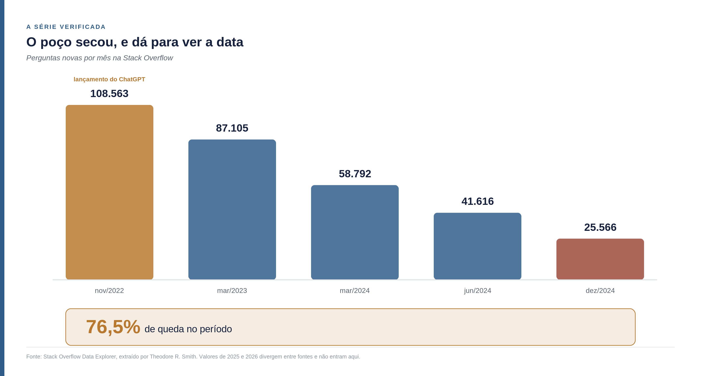
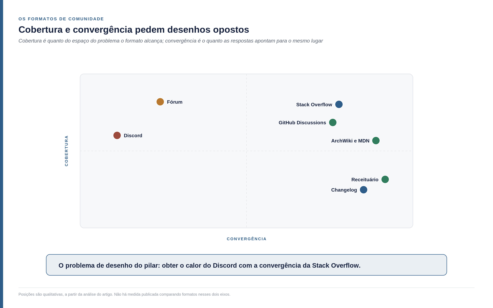
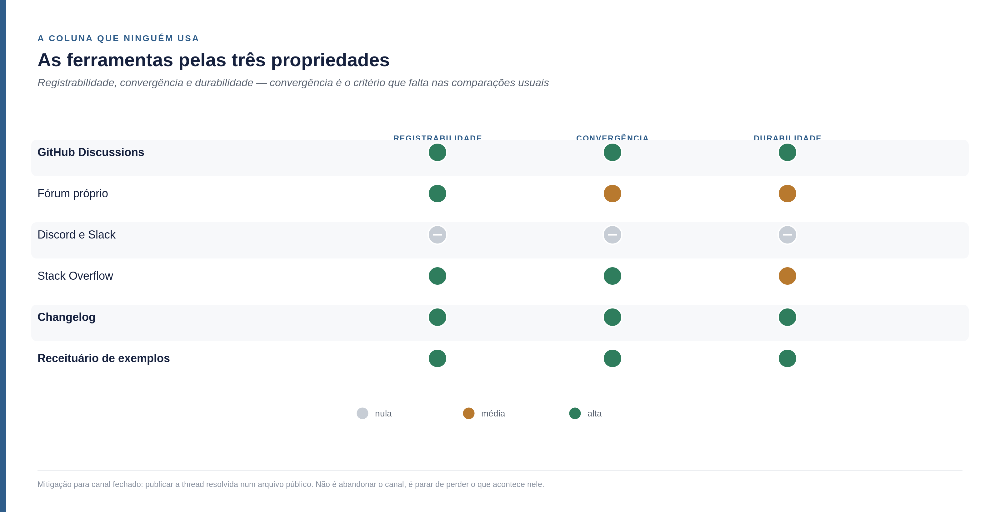
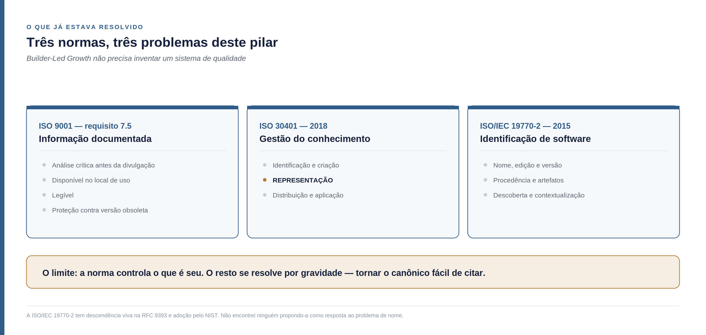
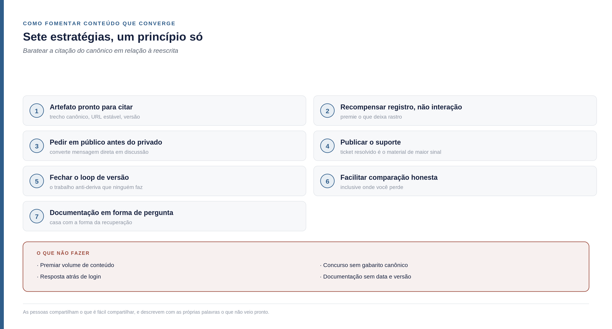

<!--
Parte 05 da série Builder-Led Growth, por Matheus Ramos.
VERSÃO NÃO CANÔNICA. A canônica é a inglesa: ../en/05-community-and-validation-signal.md
Em caso de divergência de fato ou de número, a inglesa prevalece.
Texto congelado. Prevista no LinkedIn para 11 de agosto de 2026.
Gerado a partir do repositório privado de trabalho. Não editar aqui.
-->

# Builder-Led Growth, parte 5: o poço de onde todos bebem

*Quinta parte da série sobre Builder-Led Growth. A [parte 1](https://www.linkedin.com/pulse/builder-lead-growth-matheus-batista-ribeiro-ramos-mde2c) nomeou a disciplina e propôs quatro pilares. A [parte 2](https://www.linkedin.com/pulse/builder-led-growth-parte-2-decis%C3%A3o-o-pre%C3%A7o-e-que-matheus-nqnuf/) abriu o mecanismo da decisão e o papel do preço. A parte 3 tratou da legibilidade por máquina e a parte 4, da acessibilidade operacional. Esta trata do terceiro pilar — e ele é o único que não é seu.*

## Os quatro pilares, em uma página

**Legibilidade por máquina.** A máquina consegue ler, entender e usar seu produto sem ambiguidade. Foi o assunto da parte 3.

**Acessibilidade operacional.** A máquina consegue começar sem que um humano precise intervir no meio do caminho. Foi o assunto da parte 4.

**Comunidade e sinal de validação.** Existe material produzido por terceiros do qual a recomendação futura vai se alimentar. É o assunto deste artigo.

**Confiança e segurança do modelo.** A máquina, e o humano atrás dela, aceitam usar sem revisar cada passo.

Desde a parte 2 esta série vem dizendo que comunidade não é bem um dos quatro pilares — que ela é o que **produz a matéria-prima** dos outros três. Era uma ressalva incômoda, porque dizia o que comunidade não é sem dizer o que ela é. Este artigo resolve isso, e a resposta muda o que se deve fazer.

## Não é um pilar. É o lençol freático.

Pilar é seu. Você o dimensiona, constrói, e ele fica de pé no seu terreno.

Comunidade não funciona assim, e a imagem que descreve melhor é a água subterrânea. Você não a fabrica: perfura, bombeia e usa. O aquífero tem quatro propriedades que descrevem este pilar com precisão desconfortável.

**Ele produz a matéria-prima que o resto consome.** A água não é a lavoura. É o que a lavoura bebe.

**Ele é compartilhado com o vizinho.** Lençol freático não respeita divisa de terreno. O conteúdo de terceiro sobre a sua categoria alimenta o modelo que também vai responder sobre o seu concorrente. Você não consegue bombear só a sua água.

**Ele é esgotável, e recarrega numa escala de tempo que não é a sua.** Quem bombeia demais rebaixa o nível para todo mundo, inclusive para si.

**E sozinho ele não sustenta nada.** Aquífero de que ninguém tira água é só água: não hidrata ninguém, não irriga nada, não vira colheita. Continua sendo matéria, e matéria não é resultado.

Uma ressalva antes de seguir, porque a metáfora tem um viés embutido: estou usando a água pelo ângulo de quem a utiliza. Quem olha para aquífero pensando em preservação vai dizer, com razão, que água intocada tem valor em si. Aqui a analogia serve para descrever crescimento de produto, e por isso ela adota deliberadamente a perspectiva do uso.

A terceira propriedade é a que entrou por último e mudou o artigo inteiro, porque ela deixou de ser metáfora e virou descrição literal do que aconteceu nos últimos três anos.

## O poço secou, e dá para ver a data

A Stack Overflow foi, por mais de uma década, o maior poço de matéria-prima que o software já teve. Antes de olhar os números, uma palavra sobre de onde eles vêm — porque este é um assunto em que circula muito número solto.

A série primária é do Stack Overflow Data Explorer, extraída e publicada como planilha por Theodore R. Smith, e é a mesma citada por [Gergely Orosz](https://blog.pragmaticengineer.com/stack-overflow-is-almost-dead/), por [Eric Holscher](https://www.ericholscher.com/blog/2025/jan/21/stack-overflows-decline/) e por [Drew Breunig](https://www.dbreunig.com/2025/05/16/stackoverflow-s-decline.html). Há uma camada de agregadores repetindo esses dados com magnitudes que não batem entre si; nada aqui vem deles.

No mês em que o ChatGPT foi lançado, novembro de 2022, a Stack Overflow recebeu **108.563 perguntas**. Em março de 2023, 87.105. Em março de 2024, 58.792 — queda de 32,5% contra o mesmo mês do ano anterior. Em junho de 2024, 41.616 contra 63.752 em junho de 2023. E em **dezembro de 2024, 25.566** contra 42.716 no mesmo mês do ano anterior, queda de 40,2%.

Do lançamento do ChatGPT a dezembro de 2024, a queda é de **76,5%**. O pico histórico, segundo as fontes secundárias, foi de cerca de 200 mil perguntas por mês em 2014.

A queda prosseguiu em 2025 e 2026, e aqui preciso ser honesto sobre o que não sei. Os valores que circulam para esse período — alguns milhares de perguntas por mês, e há quem cite algumas centenas — não fecham entre si nem com a série que verifiquei. Um deles, atribuído ao mesmo Data Explorer, implica uma base para dezembro de 2024 que é dois terços da que a série traz, o que sugere definições de consulta diferentes. E encontrei pelo menos um valor mensal que quase certamente é de mês incompleto, coletado com o mês em curso.

Então fico com o que dá para sustentar: a queda é de três quartos entre o fim de 2022 e o fim de 2024, prosseguiu depois disso, e a magnitude exata em 2025 e 2026 depende de qual definição de "pergunta" a consulta usou.

E há duas causas nas fontes, que não se excluem. Uma é o deslocamento das perguntas de rotina para os assistentes, a partir do fim de 2022. A outra é anterior: o volume já caía desde 2017, depois do pico de 2014, e as fontes associam parte disso ao endurecimento da moderação — perguntas fechadas mais rápido e em maior número. Guarde essa segunda causa. Ela volta mais adiante, e não do jeito que parece.

## O poço não seca por igual, e isso inverte a intuição

Breunig fez uma pergunta que eu não teria feito: a queda é uniforme entre linguagens?

Não é. Comparando 2023 com 2024, a família C — C, C++, C# e, por proximidade cultural, Rust — caiu entre 35% e 40%. As linguagens de script dominantes, JavaScript, Python e Ruby, caíram cerca de metade.

A explicação dele é direta: assistentes acertam mais nas linguagens populares, porque elas são fatia maior do corpus de treino e recebem mais atenção na fase de aprendizado por reforço. Quem programa em Python pergunta menos ao fórum porque o modelo já responde bem.

Daqui em diante é leitura minha, e ela é desconfortável. Se a queda é maior onde o modelo já é bom, então **o poço seca mais rápido exatamente onde ele mais bebeu**. Acertar a resposta destrói a fonte da resposta.

Para quem constrói produto, isso inverte uma intuição que parece óbvia. Estar num ecossistema popular parece proteção — mais gente, mais conteúdo, mais chance de o modelo conhecer você. Mas é justamente nesse ecossistema que o rastro público novo está secando mais rápido. O que sustenta a sua presença lá é acervo, não fluxo. E acervo envelhece.

## Onde a comunidade foi parar

A pergunta seguinte é melhor que a anterior: se as pessoas pararam de perguntar num lugar, onde elas passaram a perguntar?

A resposta é que a matéria-prima não desapareceu — ela se dividiu em dois destinos com propriedades opostas.

O primeiro é público e colado ao código. O **GitHub Discussions** virou o canal de pergunta específica de biblioteca e de framework, com respostas frequentemente dos próprios mantenedores. Reporta-se algo em torno de 40 milhões de usuários ativos por mês em 2025, alta de 340% sobre 2022 — e a vantagem estrutural é que a resposta fica ao lado do código, das issues e do changelog que ela referencia. Vale a ressalva: esses números vêm de compilações de estatísticas, não de relatório primário da GitHub.

O segundo é fechado. Discord e Slack levaram a conversa em tempo real, com comunidades grandes por tecnologia. O próprio Breunig registra isso, e reconhece o custo com todas as letras: a opacidade desses canais para buscadores e links é frustrante, ainda que o nível de suporte seja melhor do que era antes.

É a observação mais importante deste artigo, e ela vem de um praticante que não tem nenhuma relação com esta tese. **A comunidade não morreu. Ela mudou para lugares que não deixam rastro público.** Sob Builder-Led Growth, essa é a diferença entre produzir matéria-prima e não produzir nada.

E há uma fragilidade a declarar junto da boa notícia: a própria GitHub identifica uma distância crescente entre quem abre um pull request e quem de fato mantém o código, com mantenedores sob pressão de perguntas repetidas e issues duplicadas. O canal que hoje produz a melhor matéria-prima é sustentado por um número pequeno de pessoas.

## A parte incômoda: o duplicado era deduplicação

Agora volte à segunda causa do declínio, a que veio antes da IA.

A prática mais criticada da Stack Overflow era fechar pergunta por duplicidade. Quem tentou perguntar ali conhece a sensação, e ela era ruim: você chega com um problema, e o problema é fechado apontando para outra pergunta que talvez não seja bem a sua.

Em termos de máquina, essa prática tem outro nome. Ela é **deduplicação do corpus**. Uma pergunta, uma resposta aceita, um lugar canônico para cada assunto. Ela força convergência e reduz dispersão — e é por isso que aquele acervo virou a matéria-prima de melhor qualidade que o software já teve.

As duas coisas eram verdadeiras ao mesmo tempo. A mesma regra que a comunidade humana experimentava como hostil era a que produzia o registro de que os modelos se alimentaram. Não estou dizendo que a comunidade estava errada em achá-la dura, nem que a plataforma estava certa em aplicá-la daquele jeito. Estou dizendo que o custo e o benefício estavam em contas diferentes, e ninguém somava as duas.

E quando a conversa migrou para o Discord, as duas contas viraram ao mesmo tempo: a experiência humana melhorou e a qualidade do registro colapsou.

Isso explica por que este pilar é difícil, e por que não é questão de esforço. Não existe "fazer comunidade melhor" que resolva os dois lados. Até agora, latência de resposta e convergência de registro pediam desenhos opostos.

O problema de desenho deste pilar cabe numa frase: **como obter o calor do Discord com a convergência da Stack Overflow.**

## Não é a média. É a dispersão.

Antes de propor solução, preciso corrigir uma coisa que eu mesmo vinha formulando errado.

Eu vinha dizendo que conteúdo de comunidade sem fonte canônica "amplifica a média" do que se fala sobre o produto. Média é a grandeza errada, e a correção veio de uma observação simples: média 5 entre 9 e 1 é uma coisa; média parecida entre 9, 10, 1, 1, 2 e 3 é outra completamente diferente.

O modelo não devolve a média do corpus. Ele amostra de uma distribuição. Dois acervos com a mesma média podem ter dispersões e formatos completamente diferentes, e é o formato que decide o comportamento. Um acervo em que metade do material diz A e metade diz B produz resposta ora A, ora B — e isso é pior que um acervo uniformemente medíocre, porque o medíocre pelo menos é **previsível**.

Sob Builder-Led Growth, previsibilidade vale mais que qualidade média. Acertar 60% das vezes e errar 40% de formas variadas produz falha silenciosa, daquele tipo que a parte 4 descreveu: o agente tenta, não funciona, ele segue com outra coisa e ninguém fica sabendo. Acertar sempre a mesma coisa um pouco subótima produz um problema que alguém consegue ver e reportar.

E o ruído não cresce em linha reta. Uma chamada de API tem vários aspectos independentes: nome do método, nome e ordem dos parâmetros, forma de autenticar, formato de retorno. Se o corpus contém `v` variantes documentadas de cada aspecto e a chamada tem `k` aspectos, o número de combinações possíveis é `v` elevado a `k`. Só uma está certa.

Com duas variantes e três aspectos: oito combinações possíveis. Com quatro variantes e três aspectos: sessenta e quatro. **Dobrar as variantes multiplicou por oito o espaço de erro.** É crescimento combinatório, e é por isso que a intuição de que "mais conteúdo é sempre melhor" falha aqui.

O híbrido não é hipótese. Breunig registra uma sessão em que pediu ao modelo uma junção espacial em DuckDB: ele primeiro inventou a função; recebendo a documentação, acertou a função e errou os parâmetros; na terceira tentativa devolveu a consulta com a função comentada por ser difícil demais. Pedaço certo de uma variante, pedaço errado de outra.

Se isso parece estranho para uma máquina, vale lembrar que acontece com gente há bastante tempo, e tem nome. O efeito Mandela — batizado em 2010, a partir da lembrança generalizada de que Nelson Mandela teria morrido na prisão nos anos 1980 — descreve exatamente isto: muita gente guardando com convicção uma versão que nunca existiu. O exemplo que quase todo leitor vai reconhecer é a fala de Darth Vader, que a memória coletiva registrou como "Luke, I am your father" e que no filme é *"No, I am your father"*.

Os mecanismos que a psicologia cognitiva descreve para isso são três, e são os mesmos que este artigo vem descrevendo. **Recombinação**: a pessoa junta fragmentos de memórias diferentes e monta uma lembrança convincente e incorreta — que é o híbrido do parágrafo anterior. **Preenchimento por esquema**: a mente completa a lacuna com o que deveria estar ali, e não com o que estava; o modelo completa com a continuação mais provável, e não com a verdadeira. E **conformidade de memória**: ver muita gente repetindo o mesmo detalhe errado altera a própria lembrança, que é reforço por volume.

Daí sai uma pergunta de diagnóstico que é barata de fazer e desconfortável de responder: **o que todo mundo "sabe" sobre o seu produto que nunca foi verdade?**

E sai a formulação que organiza o resto deste artigo: **o trabalho deste pilar não é elevar a qualidade média do que se fala sobre você. É reduzir a dispersão.** Uma fonte canônica viva não melhora a média — ela colapsa a distribuição em torno de um modo.

## A erosão do canônico

O que vem a seguir tem uma consequência prática que contraria a intuição de quem trabalha com crescimento.

Fóruns, comparativos, tutoriais de terceiro, posts de blog — tudo isso espalha o produto e, ao mesmo tempo, vai erodindo o conhecimento canônico sobre ele. Cada peça é uma formulação nova. Cada versão antiga que continua no ar é uma variante permanente. Sem um lugar contra o qual conferir, o que sobe do poço é a mistura.

Mas a conclusão não é publicar menos, e essa distinção importa. **Distribuição é multiplicador, não direção.** Ela amplifica a razão entre canônico e variante que você já tem. Com fonte canônica forte e atual, distribuir amplifica o acerto. Com fonte fraca ou desatualizada, amplifica a deriva.

Duas consequências saem daí.

A primeira reordena a série: **legibilidade por máquina — o primeiro pilar, aquele em que a máquina consegue ler e entender o seu produto sem ambiguidade — é pré-requisito do terceiro.** Antes de investir em programa de comunidade, é preciso existir um lugar único, atual e legível por máquina que diga como o produto funciona — e a comunidade precisa ter motivo para apontar para lá em vez de reescrever. Volume depois disso é multiplicador. Volume antes disso é ruído com custo.

A segunda é sobre quem ganha. A leitura intuitiva é que vence quem tem mais recurso: mais gente escrevendo, mais comparativos patrocinados, mais conteúdo. Os casos desta série dizem o contrário. O shadcn/ui saiu de projeto pessoal a padrão em cinco ferramentas de fornecedores independentes entre si, sem financiamento direto e sem gastar em vendas. A Supabase é citada porque agentes a escolhem sozinhos.

O mecanismo explica por quê. Uma organização grande produzindo material inconsistente sobre o próprio produto, em escala, está aumentando a própria dispersão — cavando mais fundo e turvando a água que ela mesma vai beber. Orçamento maior com pior disciplina canônica produz deriva mais rápida, não vantagem. Aviso que aqui é raciocínio meu, coerente com os casos mas ainda sem medida direta. Volto a ele no fim, porque é um bom candidato a derrubar tudo o que este artigo defende.

## O conceito: comunidade de registro

A série vinha dizendo que comunidade produz matéria-prima sem definir o que conta como comunidade aqui. Sem definição, a orientação vira "faça comunidade", que não orienta nada.

A definição que proponho:

> Comunidade, sob Builder-Led Growth, é o sistema que converte relação humana em **registro público, convergente e durável** sobre o produto.

Três palavras carregam tudo. **Público** — existe fora do login. **Convergente** — as respostas apontam para o mesmo lugar. **Durável** — datado, versionado, e o obsoleto é aposentado ou marcado.

O nome que proponho é **comunidade de registro**, emprestado de *system of record*, o termo que software corporativo usa há décadas para o sistema que detém a versão autoritativa de um dado. O empréstimo é o argumento: sob BLG, a comunidade **é** o sistema de registro do produto perante a máquina. Tratá-la como programa de engajamento é usar a ferramenta errada para o problema.

E daí saem três propriedades que dá para medir, o que é raro neste assunto:

**Registrabilidade** — a proporção das interações que deixam artefato público. Um Discord com dez mil pessoas e nenhum arquivo público tem registrabilidade zero.

**Convergência** — a dispersão entre as respostas para a mesma pergunta. É a grandeza que a seção anterior identificou como a que importa.

**Durabilidade** — o registro é datado, versionado, e o conteúdo obsoleto é aposentado ou marcado. Sem isso, cada versão antiga vira uma variante permanente.

## Um detalhe que muda o alvo: quem escreve sobre você já não é só gente

Antes de seguir para a prática, há uma mudança em curso que merece ser marcada, ainda que eu vá desenvolvê-la em outro texto.

Existem hoje milhares de posts, vídeos e tutoriais ensinando a usar assistentes de código. E é razoável supor que boa parte desse material tenha sido escrita pelos próprios assistentes — alguém pede ao agente que escreva o tutorial sobre como usar o agente. Se cada peça dessas é uma formulação nova, o problema da dispersão deixa de ter escala humana.

Há evidência da direção, ainda que os números do volume total sejam frágeis. Estimativas de que a maior parte do conteúdo novo da web já seja gerada por máquina circulam bastante e vêm quase todas de compilações comerciais — não uso nenhuma delas aqui como medida. Mas há um contraste que aparece nessas mesmas fontes e que vale mais que os totais: enquanto a maioria do volume publicado seria automática, a fatia do que efetivamente ranqueia em busca e vem de máquina é pequena. **Volume não é visibilidade** — a mesma lição da dispersão, vista de outro ângulo.

O que é sólido é o comportamento do lado do repositório. O `AGENTS.md`, arquivo em markdown que diz a um agente como trabalhar dentro de um projeto, está em mais de 60 mil repositórios, é lido por mais de trinta agentes diferentes, e passou a ser mantido sob a Linux Foundation em dezembro de 2025. O padrão se repetiu com outros: um repositório reunindo arquivos `DESIGN.md` extraídos de 59 sites apareceu em 31 de março de 2026 e, em dez dias, tinha 35 mil estrelas — crescimento mais rápido que o de qualquer coletânea semelhante na história do GitHub. Markdown virou a camada de protocolo entre humanos e agentes, e o repositório de código virou depósito de coisa que não é código.

Isso não quebra a definição de comunidade de registro. Reforça a parte dela que já estava lá: **o que importa é o registro, não quem o produziu.** Um tutorial gerado por máquina é conteúdo de terceiro para todos os efeitos — vai ser lido, indexado e citado como qualquer outro.

O que muda é o alvo da intervenção, e aí está o ponto que pretendo desenvolver. Se quem escreve o material sobre o seu produto é, cada vez mais, um agente lendo o seu repositório, existe uma alavanca que não existia antes: **você ensina a máquina que ensina o humano.** Um `AGENTS.md` correto e exemplos canônicos versionados não servem só para a execução funcionar — servem para que o tutorial que alguém vai publicar sobre você nasça certo. Você não controla o autor. Você alimenta a fonte de que ele bebe.

## O fórum, que é o formato que aparece quando ninguém decide nada

Vale parar no fórum antes de falar de ferramenta, porque ele é a forma que a conversa técnica assume por padrão. Ninguém projeta um fórum: ele surge. E por isso ele acaba decidindo a comunidade de muitas empresas — e, com ela, a matéria-prima que a máquina vai encontrar — sem que ninguém tenha decidido coisa alguma.

O que o fórum faz bem é o que nenhum outro formato faz. Ele produz linguagem natural em torno de problema real — a frase que a pessoa usa quando está travada, e não a que o redator técnico usaria. E cobre o espaço do problema, não só o do produto: metade das threads não é sobre a sua ferramenta, é sobre a dificuldade que levou alguém até ela. Isso alimenta a candidatura, porque é assim que um modelo aprende que o seu produto tem a ver com aquela dificuldade.

O que ele faz mal é tudo o que este artigo vem descrevendo. Cada thread é uma formulação nova do mesmo assunto — a maior dispersão de todos os formatos. E envelhece sem aviso: a resposta correta de 2023 continua no ar em 2026, com a mesma aparência de resposta correta.

**Fórum é o formato de melhor cobertura e pior convergência.** Sozinho, ele produz exatamente o acervo multimodal descrito acima: muitas respostas plausíveis, nenhuma autoritativa.

Cinco práticas mudam isso, e nenhuma delas exige trocar de ferramenta:

Marcar a resposta canônica de forma visível **no artefato**, e não só no banco de dados — quem raspa a página precisa ver a marcação. Adotar a norma de uma página por assunto, em vez de uma thread por ocorrência. Datar e versionar cada resposta, aposentando o obsoleto de forma explícita. Ligar de volta ao documento canônico em vez de reescrever a resposta ali. E pedir revisão a quem tem incentivo diferente do seu antes de marcar algo como definitivo — volto a esse ponto adiante, porque ele tem um mecanismo próprio.

Fórum não é bom nem ruim para este pilar. É o formato que mais depende de governança. Com essas cinco práticas ele vira o melhor ativo disponível. Sem elas, vira a maior fonte de deriva que a empresa tem — e a mais difícil de perceber, porque parece comunidade saudável.

## As ferramentas, avaliadas pela coluna que ninguém usa

Quase toda comparação de ferramenta de comunidade olha para engajamento, retenção e facilidade de moderação. A coluna que falta é convergência.

| Ferramenta | Registrabilidade | Convergência | Durabilidade |
|---|---|---|---|
| **GitHub Discussions** | alta | alta — resposta marcada, ao lado do código | alta — versionada com o repositório |
| Fórum próprio | alta | média — há marcador de resolvido, mas o canônico fica longe do código | média — depende de curadoria ativa |
| Discord e Slack | nula por padrão | nula | nula |
| Stack Overflow | alta | alta | o acervo antigo continua ensinando |
| Changelog e notas de versão | alta | alta | a mais alta de todas |
| Receituário de exemplos | alta | a mais alta de todas | alta |

Duas linhas dessa tabela merecem atenção porque costumam ficar de fora da conversa sobre comunidade.

**O changelog** resolve durabilidade melhor que qualquer fórum, e quase ninguém o trata como ativo de comunidade. Ele é datado por natureza, curto, canônico e escrito em ordem cronológica — que é exatamente o que falta ao acervo de fórum. Um changelog bem mantido é o mecanismo mais barato de aposentar informação velha sem apagar nada.

**O receituário de exemplos canônicos** é o mecanismo mais direto de convergência que existe, e a razão é quase boba: **quem copia não inventa variante.** Um repositório de exemplos que funcionam, mantido atualizado, converte cada pessoa que o usa num replicador da mesma formulação. É o oposto exato do que acontece quando alguém precisa descobrir sozinho como fazer e depois escreve do próprio jeito.

Sobre Discord e Slack, a mitigação de maior retorno para quem já tem comunidade grande em canal fechado é simples e existe pronta: publicar a thread resolvida num arquivo público. Não é abandonar o canal — é parar de perder o que acontece nele.

## Quem já faz isso, e o mecanismo comum entre elas

Duas comunidades técnicas resolveram esse problema antes de ele existir na forma atual, e vale olhar como.

A **ArchWiki** é a documentação da Arch Linux, distribuição criada por Judd Vinet — programador canadense que começou a desenvolvê-la no início de 2001 e lançou a versão 0.1 em 11 de março de 2002. A wiki em si nasceu depois: foi instalada em 8 de julho de 2005, e desde então mais de 20 mil pessoas criaram conta e fizeram perto de 400 mil edições, transformando uma página em branco numa das referências técnicas mais citadas do mundo Linux.

O dado que interessa aqui é de governança, não de volume: a maior parte das edições vem de colaboradores de fora do time de manutenção, e existe a norma de que cada página seja atualizada para refletir a versão do pacote que está sendo distribuída. Junta as três propriedades de uma vez — é pública, tem uma página por assunto, e a atualização por versão é obrigação declarada, não boa intenção. O projeto Arch inclusive compartilhou a estratégia de wiki com o Debian, o que sugere que o modelo se transfere.

O **MDN Web Docs** é o caso mais explícito, e nasceu de um resgate. Em fevereiro de 2005 um time pequeno da Mozilla pegou o DevEdge — o material para desenvolvedores da Netscape, cuja licença a Fundação Mozilla obteve da AOL — e decidiu transformá-lo num recurso aberto, gratuito e construído pela comunidade. A wiki original entrou no ar em 23 de julho de 2005.

A tese declarada era a de que desenvolvedores não deveriam caçar documentação espalhada entre órgãos de padrão, fabricantes de navegador e terceiros: deveria existir uma fonte única e canônica, mantida pela comunidade e apoiada pelos principais fornecedores. Doze anos depois, em 2017, os fabricantes concorrentes entraram formalmente no projeto — o que transformou a tese em arranjo institucional. Convergência como decisão de desenho, não como efeito colateral.

O mecanismo comum entre as duas é o que interessa, e ele responde ao dilema que este artigo levantou. **Não é moderação punitiva. É norma de página única mais obrigação de atualização.** Convergência por arquitetura, e não por fechamento de duplicata.

É essa a saída para "como obter o calor do Discord com a convergência da Stack Overflow": você não precisa fechar a pergunta de ninguém se existe um lugar óbvio onde a resposta mora e todo mundo sabe qual é.

Uma ressalva honesta: não encontrei nenhuma medida comparando quanto cada uma dessas fontes é citada por modelos. As afirmações de que documentação de alta autoridade é mais citada vêm, quase todas, de material comercial de otimização para IA. Trato como indicação, não como medida.

## As normas que já tinham resolvido pedaços disto

Aqui vale uma confissão de percurso: comecei procurando o que a gestão da qualidade tinha a oferecer e encontrei mais do que esperava — inclusive uma norma que resolve, desde 2015, um problema que esta série levantou sem saber que havia norma.

A **ISO 9001**, no requisito 7.5, trata do que ela chama de informação documentada. O mapeamento com este pilar é quase termo a termo:

| O que a norma exige | O equivalente aqui |
|---|---|
| Análise crítica antes da divulgação | Reduzir dispersão na origem |
| Disponível no local de uso | Colocar o artefato no caminho que o agente já percorre, que é a formulação da legibilidade por máquina |
| Legível | Legibilidade por máquina, que foi o assunto da parte 3 |
| Proteção contra uso de versão obsoleta | Fechar o loop de versão |

Esse último item é requisito auditável desde a versão de 2008. Enquanto a discussão sobre conteúdo para IA descobre que material desatualizado atrapalha, a gestão da qualidade já exigia procedimento contra isso havia quase duas décadas.

A **ISO 30401**, de 2018, é norma de sistema de gestão do conhecimento, e é a mais aderente a este pilar de todas que encontrei. Ela trata de identificação, criação, análise, **representação**, distribuição e aplicação do conhecimento. Comunidade de registro é, na linguagem dela, um sistema de gestão do conhecimento cujo destinatário passou a incluir a máquina — e representação e distribuição são exatamente as duas etapas onde o Builder-Led Growth muda o requisito.

A diferença que a disciplina nova introduz é de fronteira. A norma pressupõe conhecimento interno, com pessoas como destinatárias. Aqui o conhecimento que decide crescimento é público, produzido em parte por terceiros, e tem a máquina lendo.

E a que me surpreendeu: a **ISO/IEC 19770-2** define etiqueta de identificação de software — metadado estruturado, entregue junto com o produto, com nome, edição, versão, organizações envolvidas na produção e na distribuição, artefatos e relações entre produtos. Criada para resolver a dificuldade de **descobrir, identificar e contextualizar** software. Tem descendência viva na RFC 9393 e adoção pelo NIST.

Guarde o que a parte 3 descreveu sobre ambiguidade de identidade — o modelo não consegue resolver a quem um nome se refere — e o que a parte 4 apontou sobre os quase 7.900 nomes de ferramenta repetidos entre servidores MCP, sem apontar solução padronizada. **Existe norma para identidade de software legível por máquina desde 2015**, e não encontrei ninguém no debate sobre agentes que a tenha mencionado.

Por que a identificação de software resolvida para gestão de ativos nunca foi reaproveitada para identificação de produto perante agentes? Não sei. Suspeito que seja distância entre comunidades técnicas que não se leem, mas isso é palpite. Se alguém souber a resposta, é o tipo de coisa que eu gostaria de ouvir — e é onde eu começaria a procurar, se estivesse resolvendo o problema de nome hoje.

O argumento que essas três permitem é confortável e desconfortável ao mesmo tempo: **Builder-Led Growth não precisa inventar um sistema de qualidade.** Controle de informação documentada, gestão do conhecimento e identificação legível por máquina já existem, escritos, revisados e auditáveis. O que falta não é norma. É perceber que os documentos que decidem o crescimento agora estão fora da organização.

E aqui está o limite, que precisa ser dito para o argumento não virar propaganda de certificação. A ISO 9001 aplica controle de documento ao que a organização controla. Post de fórum de terceiro não entra em controle documental — não é seu. O que dá para fazer é o deslocamento: tornar o documento canônico tão fácil de citar que o conteúdo da comunidade vire **ponteiro** em vez de **cópia**. Controle sobre o que é seu; gravidade sobre o que não é.

Norma descreve requisito, não garante resultado. Certificação nenhuma faz um modelo escolher você.

## Como fazer pessoas produzirem conteúdo que converge

Tudo até aqui descreve o que deveria existir. Falta a parte difícil, que é conseguir que exista sem mandar em ninguém — porque comunidade não obedece.

O princípio que organiza as sete estratégias abaixo é o mesmo: **as pessoas compartilham o que é fácil compartilhar, e descrevem com as próprias palavras aquilo que não veio pronto.** Cada estratégia barateia a citação do canônico em relação à reescrita.

**Dê o artefato pronto para ser citado.** Trecho canônico, endereço estável, marca de versão. Quem copia não inventa variante. Funcionalidade mal documentada é descrita de doze jeitos porque cada pessoa teve que descobrir sozinha, e cada descoberta virou uma redação diferente.

**Recompense o registro, não a interação.** Se o programa de comunidade premia atividade no Discord, você recebe atividade no Discord. Premie o texto público, a discussão respondida, o comparativo — o que deixa rastro. É a mudança de métrica que muda o comportamento, e ela custa uma reunião.

**Peça em público antes de responder em privado.** Mensagem direta com pergunta técnica vira convite a abrir a discussão pública, e a resposta vai lá. Converte privado em público sem trocar de ferramenta e sem gastar nada.

**Publique o suporte.** Ticket resolvido é o material de maior sinal que a empresa produz, e quase todo ele está trancado. Publicar tickets resolvidos, anonimizados, como base pública, é a maior fonte de matéria-prima ociosa que existe na maioria das empresas — e a mais fácil de justificar internamente, porque reduz o volume de tickets repetidos.

**Feche o loop de versão.** Conteúdo apodrece, e conteúdo apodrecido não desaparece: vira variante permanente. Encontrar e atualizar material público sobre versões antigas reduz dispersão diretamente. É o trabalho anti-deriva que ninguém faz, porque não aparece em nenhuma métrica de engajamento.

**Facilite a comparação honesta.** Conteúdo comparativo de terceiro é o que mais pesa quando um modelo cita alguém. Publicar comparação própria, com fonte e incluindo onde você perde, produz material que terceiros copiam — e comparação em que a empresa admite um limite é a que tem chance de ser reproduzida, justamente porque não parece peça de venda.

**Escreva a documentação em forma de pergunta.** Título em forma de pergunta casa com a forma como a recuperação acontece. É barato, e reaproveita o que quinze anos de fórum já ensinaram sobre como as pessoas descrevem um problema.

Do outro lado, quatro coisas a não fazer: premiar volume de conteúdo, que produz variantes e variante é o dano; promover concurso de conteúdo sem gabarito canônico, que multiplica formulações incompatíveis; deixar resposta atrás de login, que zera a registrabilidade; e publicar documentação sem data e sem versão, que transforma acervo em variante permanente.

## O mecanismo que a própria comunidade pode operar

Há um instrumento de convergência que não depende de você marcar nada, e ele é o mais sofisticado que existe hoje: as Notas da Comunidade do X.

O algoritmo é de **ponte**. Uma nota só aparece quando recebe avaliação positiva de um conjunto diverso de avaliadores — gente que costuma discordar entre si em outras notas. Tecnicamente é fatoração de matrizes, com componentes adicionais contra abuso, manipulação dirigida e mutirão de avaliação. A exigência é sutil e elegante: a nota precisa de avaliações positivas que **não sejam previsíveis** pela tendência prévia de quem avalia.

O princípio transfere direto para este pilar, e ele reformula a estratégia da comparação honesta. O sinal mais forte de convergência não é "o fornecedor disse". É "o fornecedor e pessoas com interesses diferentes convergiram nisto". Uma resposta canônica endossada apenas por mantenedores é sinal mais fraco que a mesma resposta endossada também por usuários independentes que discordam entre si sobre outras coisas. E isso é desenhável: basta pedir revisão a quem tem incentivo diferente do seu antes de marcar algo como definitivo.

O limite precisa ir junto, porque a pesquisa sobre o mecanismo é honesta a respeito dele. Um estudo apresentado na ACM Web Conference de 2026, "Consensus Stability of Community Notes on X", encontrou que **30,2% das notas exibidas perdem depois o status de úteis e desaparecem** — e atribui isso menos à qualidade da nota e mais a avaliação estrategicamente motivada depois da exibição. Há trabalhos relacionados sobre manipulação coordenada nesse tipo de checagem e sobre a sustentabilidade do mecanismo.

Para quem pensa em corpus, essa instabilidade importa de um jeito específico. Uma marcação que aparece e some produz variância **ao longo do tempo**, e não entre fontes — e para um acervo que alimenta modelo, registro instável é quase tão ruim quanto registro divergente. **Convergência sem durabilidade não resolve o problema.**

## Quem responde pelo lado da máquina

Falta a pergunta organizacional, e ela vem de um lugar que não é o debate sobre IA.

[Joca Torres](https://www.linkedin.com/in/jocatorres/) — autor de quatro livros de produto e ex-CPO de Gympass, Conta Azul e Locaweb — trata plataformas como produtos de múltiplos lados, e traz uma distinção que resolve isto. Segundo ele, gerir um produto é entender o valor para um tipo de usuário; gerir uma plataforma é entender o valor para vários tipos **e a relação entre eles**. Conheci esse enquadramento nos cursos de Product Management da PM3, e ele é uma das origens desta série. No material dele há um caso concreto: no Gympass, hoje Wellhub, havia um time para cada ator do marketplace — academias, RH das empresas, e as pessoas que usavam.

A pergunta equivalente aqui é: quem, na sua empresa, responde pelo lado da máquina?

E vale ser preciso sobre uma coisa antes de responder, porque a analogia tem um limite. Chamar o modelo de "lado da plataforma" é impreciso. Lado tem objetivo, negocia, responde a incentivo. O modelo não faz nada disso — ele lê e devolve misturado. É mais próximo do lençol freático deste artigo do que de um participante.

Ainda assim a pergunta organizacional vale, e a minha resposta é que **não seja um time novo**. O dono do lado da máquina deve ser quem já é dono da fonte canônica, porque as duas funções são a mesma: manter uma versão autoritativa e fazer o resto do mundo apontar para ela.

O que isso desloca é a definição do papel. Relações com desenvolvedores deixam de ser medidas por evento, presença e comunidade ativa, e passam a ser medidas por registro.

## O que medir

Seis coisas, e nenhuma delas tem ferramenta pronta — o que é, por si só, informação sobre o estágio da disciplina.

**Taxa de registro público**: das interações com a sua comunidade, quantas deixam artefato acessível sem login.

**Dispersão**: para as tarefas mais comuns do seu produto, quantas formulações incompatíveis existem publicamente. É a métrica central deste pilar e a mais trabalhosa — hoje só dá para levantar à mão, ou pondo um agente para comparar as versões que encontra. O que é, aliás, um produto esperando alguém construir.

**Idade mediana do conteúdo público** sobre o seu produto. Se a mediana é de dois anos, metade do que ensina sobre você foi escrita antes da sua versão atual.

**Proporção entre conteúdo de terceiro e conteúdo próprio**, porque é o terceiro que pesa na citação.

**Taxa de resposta marcada como canônica** nas discussões públicas — quantas terminam com um "é isto" visível.

**Cobertura**: quantas das perguntas mais frequentes têm uma resposta pública marcada. É a que dá o trabalho mais imediato, porque a lista costuma ser curta e o buraco costuma ser óbvio.

## O que faria este pilar cair

Três condições, e a primeira é a que mais me incomoda.

**Se a dispersão não predisser nada.** Pegue duas tecnologias comparáveis, meça quantas formulações incompatíveis existem publicamente para as tarefas mais comuns de cada uma, e depois compare a taxa de acerto de um agente ao executar essas tarefas. Se a tecnologia com maior dispersão não tiver desempenho pior, o argumento central deste artigo está errado. É um teste caro mas possível, e é o primeiro que eu faria.

**Se recurso resolver, afinal.** Sustentei aqui que orçamento maior com pior disciplina canônica produz deriva mais rápida, não vantagem, e me apoiei nos casos da série — shadcn/ui e Supabase venceram sem comprar presença. Se aparecerem casos em que investimento pesado em volume de conteúdo produziu representação melhor apesar da inconsistência, a formulação cai, e comunidade vira uma questão de escala como qualquer outro canal.

**Se a matéria-prima deixar de vir de texto público.** Este artigo inteiro pressupõe que o que a comunidade escreve em público alimenta o que a máquina sabe. Se os modelos passarem a aprender predominantemente de outras fontes — telemetria de uso, execução de código, dados licenciados sob contrato —, o pilar continua existindo e muda de endereço. Eu não saberia dizer para onde.

E fica a pergunta que não consigo responder e que me parece a mais importante deste artigo. Se o modelo aprendeu com a comunidade, e a comunidade está migrando para dentro do modelo, **de onde vem a matéria-prima da próxima geração?** O GitHub Discussions é uma resposta parcial e frágil, sustentada por poucos mantenedores já sobrecarregados. Não sei se é suficiente. Se você tem uma leitura melhor dessa conta, eu quero ouvir.

Na parte 6 entra o que Relações Públicas já sabia sobre isto desde 1984 — e por que o modelo que a disciplina considerava o mais ético acabou virando também o mais eficaz, por um motivo que ninguém tinha como prever.

---

**Série Builder-Led Growth**

- [Parte 1 — Quando a máquina também é seu cliente](https://www.linkedin.com/pulse/builder-lead-growth-matheus-batista-ribeiro-ramos-mde2c)
- [Parte 2 — A decisão, o preço e o que medir](https://www.linkedin.com/pulse/builder-led-growth-parte-2-decis%C3%A3o-o-pre%C3%A7o-e-que-matheus-nqnuf/)
- Parte 3 — O imposto que a máquina cobra e o humano não vê: https://www.linkedin.com/pulse/builder-led-growth-parte-3-o-imposto-que-m%C3%A1quina-e-v%C3%AA-matheus-768vf/
- Parte 4 — Quantas vezes o agente precisa chamar um humano: [ler](04-acessibilidade-operacional.md)
- Parte 5 — O poço de onde todos bebem (este texto)

A série continua. Cada parte aprofunda um pedaço do que a anterior só conseguiu apontar, e este bloco é atualizado conforme as próximas saem.
