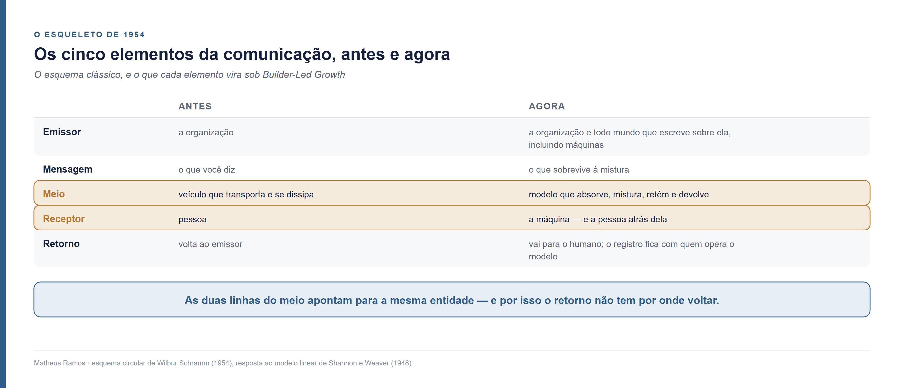
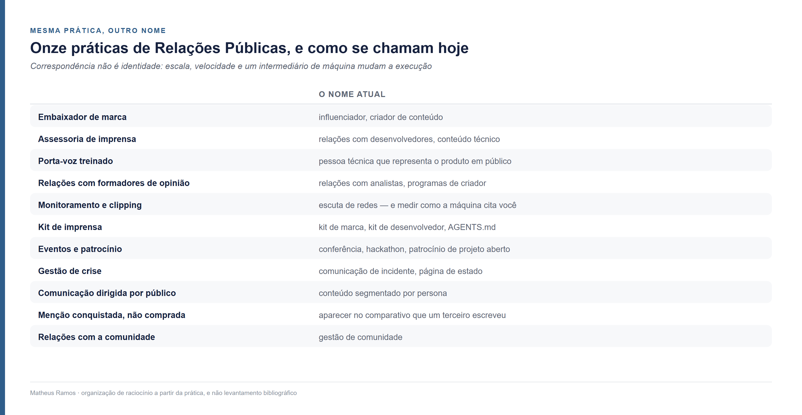

<!--
Parte 06 da série Builder-Led Growth, por Matheus Ramos.
VERSÃO NÃO CANÔNICA. A canônica é a inglesa: ../en/06-public-relations.md
Em caso de divergência de fato ou de número, a inglesa prevalece.
Publicada no LinkedIn em 14 de agosto de 2026: https://www.linkedin.com/pulse/builder-led-growth-parte-6-m%C3%A1quina-%C3%A9-imprensa-e-ao-matheus-8fvsf/
Gerado a partir do repositório privado de trabalho. Não editar aqui.
-->

# Builder-Led Growth, parte 6: a máquina é imprensa e leitor ao mesmo tempo

*Sexta parte da série sobre Builder-Led Growth. A [parte 1](01-quando-a-maquina-e-cliente.md) nomeou a disciplina e propôs quatro pilares. A [parte 2](02-decisao-preco-e-medicao.md) abriu o mecanismo da decisão e o papel do preço. A parte 3 tratou da legibilidade por máquina, a parte 4 da acessibilidade operacional, e a parte 5 da comunidade que alimenta as duas. Esta volta trinta anos para trás, porque parte do que estamos descobrindo já tinha nome.*

## Os quatro pilares, em uma página

**Legibilidade por máquina.** A máquina consegue ler, entender e usar seu produto sem ambiguidade.

**Acessibilidade operacional.** A máquina consegue começar sem que um humano precise intervir no meio do caminho.

**Comunidade e sinal de validação.** Existe material produzido por terceiros do qual a recomendação futura vai se alimentar.

**Confiança e segurança do modelo.** A máquina, e o humano atrás dela, aceitam usar sem revisar cada passo.

Este texto não abre um quinto pilar. Ele faz outra coisa: pega uma disciplina que passou o século XX resolvendo um problema muito parecido com o nosso e pergunta o que dela ainda serve.

## Uma tia, uma festa de fim de ano, e uma frase

Entrei na faculdade em 1997, aos 17 anos, em Comunicação Social — Relações Públicas, na Universidade Federal de Goiás.

Naquela época era difícil explicar para a tia, na festa de fim de ano, o que exatamente um relações-públicas faz. Quem estudava medicina ou engenharia civil não passava por isso. A pergunta vinha sempre com aquele tom de quem quer ajudar e não sabe como.

Alguém, em algum momento daqueles primeiros semestres, me deu a definição que eu uso até hoje:

> **Publicidade é você falar de si para os outros. Relações Públicas é fazer os outros falarem de você.**

Guardei aquilo como uma boa frase de corredor. Não me ocorreu, nem podia ocorrer, que trinta anos depois ela seria a descrição mais exata que eu conheço de como um produto de software é escolhido.

Vou dizer uma coisa antes de seguir, porque ela explica por que este texto existe. Eu esperava que Relações Públicas ganhasse notoriedade e relevância com o tempo. Não foi o que aconteceu. As pessoas continuam sem entender o que é, e a conversa da festa de fim de ano seria hoje quase igual.

O que eu quero com este artigo é fazer jus a essa ciência e mostrar o que ela vale. É uma contribuição pequena diante do tamanho da disciplina, e está feita com carinho e capricho.

### O que é Relações Públicas, para quem nunca precisou saber

A definição que a PRSA — a associação norte-americana da área — adota desde 2 de março de 2012 diz que Relações Públicas é *o processo estratégico de comunicação que constrói relações de benefício mútuo entre uma organização e seus públicos*.

Três palavras dessa frase carregam quase tudo, e as três importam aqui.

**Processo**, e não campanha. Não é um ato pontual de divulgação; é prática continuada. A própria PRSA explicou a escolha da palavra: *processo* foi preferido a *função de gestão* porque a segunda evoca controle e comunicação de mão única.

**Benefício mútuo.** A relação precisa valer para os dois lados. Se só um ganha, não é isso.

**Públicos**, no plural. Não existe "o público". Existem grupos com interesses distintos, e falar com cada um exige coisas diferentes.

Um detalhe dessa definição me parece bonito demais para deixar passar: **ela foi construída por multidão**. A PRSA abriu submissões em 2012, recebeu perto de mil propostas, selecionou três finalistas e levou a votação pública. A vencedora teve 671 de 1.447 votos. Uma disciplina que estuda como organizações e públicos se ajustam mutuamente definiu a si mesma exatamente assim — o que, veremos adiante, é o modelo que ela própria considera o melhor.

Quando entrei na faculdade em 1997, aliás, a definição vigente ainda era a de 1982. Ela ficou trinta anos no lugar.

E sobre a dificuldade de explicar à tia: ela não era minha. A Faculdade de Informação e Comunicação da UFG, onde me formei, mantém no ar uma página intitulada exatamente **"O que é e o que não é Relações Públicas?"** — e boa parte dela é uma lista do que não é. Não é "tipo Jornalismo e Publicidade". Não é Relações Internacionais. Não é acompanhante de executivo, nem recepcionista de luxo. Uma disciplina que precisa se definir por eliminação está dizendo algo sobre a própria posição.

## A frase de 1997 virou especificação técnica

Em 1997, "fazer os outros falarem de você" era uma distinção profissional. Quase uma piada de corredor para explicar a diferença entre dois cursos da mesma faculdade.

A parte 1 desta série registrou um número que muda a natureza daquela frase: **32,5% das citações em respostas de IA vêm de conteúdo comparativo produzido por terceiros, contra menos de 5% vindas de páginas comerciais do próprio produto.**

Fazer os outros falarem de você passou a valer, na recuperação por máquina, mais de seis vezes o que vale falar de si.

Preciso ser exato sobre o que esse número é e o que ele não é. Ele mede comportamento de citação — o que o sistema traz de volta quando alguém pergunta. Não mede composição de corpus de treino, que é outra coisa e se mede de outro jeito. Confundir as duas seria transformar um dado bom num argumento frouxo.

Mas mesmo com a ressalva, o deslocamento é grande. Uma distinção que servia para organizar dois currículos virou um parâmetro de distribuição.

## A máquina é imprensa e leitor ao mesmo tempo

Os dois papéis já estão estabelecidos nesta série, em momentos diferentes.

A parte 1 abriu dizendo que a máquina também é seu cliente: ela consome o que você entrega, tem necessidades próprias a atender, e a experiência dela com o seu produto decide se há uma segunda vez. A parte 5 mostrou o outro lado, ao tratar do material público que alimenta a recomendação — o que a máquina absorve ela redistribui, e isso faz dela canal do que se diz sobre você.

Relações Públicas entra aqui para dizer **que tipo de canal** é esse, porque disso depende como se faz a gestão.

Gestão de canal de distribuição é uma disciplina madura, e ela funciona com um conjunto conhecido de instrumentos: contrato, margem, treinamento, exclusividade de território, meta, verba de cooperação. Um revendedor ou um distribuidor reformula o seu discurso, sim — mas ele reformula dentro de um acordo em que os incentivos dos dois lados estão alinhados de propósito. Você treina, remunera e mede.

**Nenhum desses instrumentos existe com a máquina.** Não há contrato, não há margem a repassar, não há meta a negociar, e não existe alguém do outro lado com quem alinhar incentivo.

Esse tipo de canal também já é conhecido, e a disciplina que o estuda tem quase um século: **imprensa.** Um jornal leva o que você diz a um público que é dele, e não seu, reescreve no caminho, e decide sozinho o que sai. Não há contrato que garanta a pauta. O que existe é insumo bem preparado e uma relação construída ao longo do tempo.

É a mesma condição da máquina, e por isso o instrumento é o mesmo: **você trabalha a entrada, porque a saída não é sua.**

Olhe a coluna da direita de cima para baixo. Ela acumula o que as outras duas dividiam.

Isso não tem precedente confortável. Na história da comunicação, o leitor e o veículo nunca foram a mesma entidade: quem lia o jornal não imprimia a próxima edição, e a gráfica não era o público. **A máquina é o primeiro leitor que também é a gráfica** — usa o seu produto para resolver o problema de alguém e, no mesmo movimento, ensina o próximo a usá-lo.

Daí sai a consequência prática — a razão de este artigo existir. Atender a máquina como cliente e alimentá-la como veículo são trabalhos diferentes, que competem pelo mesmo orçamento e costumam ficar em mesas diferentes da empresa. Cuidar só da experiência dela deixa o insumo por conta do acaso. Cuidar só do insumo entrega material excelente sobre um produto em que ela trava na primeira tentativa. **São dois trabalhos, e nenhum dos dois funciona sozinho.**

E note a última linha da tabela, que é a que dá esperança: você não controla a saída, mas controla o insumo. É exatamente a condição em que assessoria de imprensa opera desde sempre, e é por isso que existe uma disciplina inteira sobre como fazer isso bem.

Vale a ressalva: isso é correspondência de papéis, não identidade. Um veículo de imprensa tem intenção editorial, pessoas que decidem e responsabilidade sobre o que publica; um modelo tem pesos. O que a tabela sustenta é mais modesto e mais útil — **o formato do relacionamento é o mesmo, e para esse formato já existe método testado.**

## O press release é o precedente direto

Com o papel de veículo nomeado, a pergunta seguinte se responde sozinha: como se alimenta bem um intermediário que reescreve o que recebe?

Escrevendo um documento feito para ser reaproveitado.

É isso que um comunicado à imprensa sempre foi. Não é um anúncio — é matéria-prima estruturada, com os fatos verificáveis na frente, escrita no formato que facilita a vida de quem vai transformá-la. Quem escreve um bom release não está pedindo para ser publicado na íntegra. Está tornando fácil ser citado corretamente.

Troque "jornalista" por "modelo" nessa frase e ela continua inteira.

**A versão de 2026 disso tem outros nomes.** Um arquivo `AGENTS.md` na raiz do repositório — a convenção que descreve para um agente de código como trabalhar naquele projeto. Um `llms.txt` — o arquivo que oferece a um modelo uma versão limpa e navegável do que o site diz. Documentação com blocos prontos para citação. Uma lista versionada das afirmações que você considera verdadeiras sobre o seu próprio produto.

Todos são a mesma peça: **um comunicado escrito para um intermediário que vai transformar antes de redistribuir.**

O formato já foi reaproveitado para outra finalidade, muito depois de existir, e o caso merece crédito. A Amazon usa desde 2005 um método interno em que um produto começa pelo comunicado de imprensa — escreve-se primeiro o release do produto que ainda não existe, e só depois se trabalha para trás até o que precisa ser construído. O relato mais detalhado do método está em *Working Backwards*, de Colin Bryar e Bill Carr, dois ex-executivos da empresa; vale registrar que é relato de quem esteve lá, e não documento institucional.

O que interessa nesse método não é a técnica de produto. É o pressuposto embutido nela: **escrever o comunicado primeiro obriga a decidir qual é a versão canônica da sua história antes de construir qualquer coisa.** A parte 5, ao tratar do material público que alimenta a recomendação, mostrou o que acontece quando essa versão canônica não existe: aparecem várias formulações incompatíveis para a mesma coisa, e o modelo aprende todas. Chamamos isso de dispersão, e ela é o custo direto de nunca ter decidido qual é a sua versão.

São o mesmo problema, resolvidos com trinta anos de distância e por gente que não estava conversando entre si.

## Os cinco elementos, e o recado que não era para você

A teoria geral da comunicação organiza qualquer troca em cinco elementos: quem **emite**, a **mensagem**, o **meio** que a carrega, quem **recebe**, e o **retorno** que volta de quem recebeu para quem emitiu.

O quinto elemento tem data e autor. Wilbur Schramm, em 1954, propôs um esquema circular em que a comunicação não termina na recepção: o receptor responde, a resposta volta ao emissor, e o emissor corrige a próxima emissão. Foi resposta direta aos modelos lineares que dominavam até ali — o de Claude Shannon e Warren Weaver, de 1948, descrevia a comunicação como uma linha só de ida. Schramm sustentou algo mais forte: **comunicação sem retorno está incompleta.**

O esqueleto traz junto um conceito que dá nome ao problema central desta série: **ruído** — tudo aquilo que degrada a mensagem entre a emissão e a recepção. A dispersão que a parte 5 mediu, aquela contagem de quantas formulações incompatíveis existem publicamente para a mesma tarefa, é ruído com outro nome.

Veja o que cada elemento vira sob Builder-Led Growth:

Duas linhas dessa tabela merecem parar.

**A primeira é o meio que retém.** No esquema clássico o meio transporta e some — o papel do jornal vai para o lixo, o sinal de rádio se dissipa. Aqui não. O modelo é o primeiro canal que guarda tudo o que passou por ele e devolve misturado, meses depois, para alguém que você nunca viu. Aquela imagem da água subterrânea que a parte 5 usou — o aquífero compartilhado com o vizinho, do qual todo mundo bebe — é a mesma observação dita em vocabulário de hidrologia.

**A segunda é que o meio e o receptor viraram a mesma entidade.** É o acúmulo de papéis descrito acima, agora visível na estrutura: as duas linhas do meio da tabela apontam para a máquina. E é daí que sai o problema do retorno, porque **o esquema de Schramm pressupõe que quem recebe é distinto de quem carrega.** Quando as duas funções colapsam numa coisa só, a resposta do receptor não tem por onde voltar — ela é absorvida pelo próprio canal.

Olhe agora para gestão de produto e conte quantas coisas são, no fundo, esse retorno. Entrevista com usuário. Ticket de suporte. Análise de cancelamento. Pesquisa de satisfação. Descoberta contínua. Todas fazem o mesmo movimento — trazer a resposta de quem usou de volta até quem construiu.

**O retorno quebra em três lugares distintos, e cada um dói de um jeito.**

**O primeiro: o que o agente pensa do seu produto não chega até você.** Ele tenta, encontra um obstáculo, não resolve, e segue para outra coisa.

Quando a parte 4 tratou das paradas em que o agente precisa de um humano, ela separou três desfechos possíveis: a pessoa aparece e resolve, a pessoa aparece e desiste, ou o agente contorna sozinho e nunca chama ninguém. O terceiro é o que não deixa rastro em lugar nenhum — não gera ticket, não gera cadastro abandonado, não gera reclamação. **Aquela saída silenciosa é, vista pelo esqueleto da comunicação, o primeiro ponto em que o retorno se perde.**

**O segundo: o que o usuário pensa do resultado vai para o agente.** A pessoa reclama para quem lhe entregou o trabalho, e quem entregou foi o agente. Ela diz "isso aqui não funcionou", o agente ajusta e tenta outro caminho, e o produto que causou a falha nunca fica sabendo dela. O recado existiu e alguém o escutou. Só não chegou a quem podia agir sobre ele.

**O terceiro, que é o que muda a natureza do risco: o laço não sumiu, ele fechou em outro lugar.** Quem opera o modelo tem registro da sessão inteira — o que foi tentado, o que falhou, o que exigiu segunda tentativa, onde a pessoa se irritou. O retorno existe. Está sendo coletado. E está sendo coletado por uma organização que não é a sua.

**Por que isso é risco de produto, e não só de comunicação.** Um produto que perde o retorno não para de ser julgado. A decisão de recomendar ou não recomendar continua acontecendo todos os dias, alimentada por informação a que você não tem acesso. E o intervalo entre a sua qualidade piorar e você descobrir que piorou deixa de ser medido em dias de suporte: passa a ser medido em quanto tempo você leva para notar uma curva caindo sem saber o porquê.

Vale dizer o que isso é: raciocínio, não medição. Não conheço estudo que tenha quantificado esse atraso. O mecanismo é direto o suficiente para eu apostar nele, e barato o suficiente para alguém falsear.

**O que dá para tentar fazer. Nenhuma dessas quatro coisas fecha o laço de verdade, mas cada uma recupera um pedaço do que se perdeu.**

**Montar a sua própria bancada.** Rodar um agente contra o seu produto em intervalo fixo, com tarefas reais, e medir o que acontece. É o único retorno que você controla inteiramente. Mede o seu produto, não o seu usuário — o que é uma limitação séria e ainda assim é mais do que nada.

**Fazer o erro carregar um caminho de volta.** Mensagem de erro estruturada, com um endereço de relato que o agente possa mostrar ao humano. Não garante nada, porque mostrar ou não é decisão do agente. É barato, e a alternativa é o silêncio. Não conheço nenhum produto fazendo isso hoje, o que pode significar que não funciona ou que ninguém tentou.

**Perguntar no lugar onde a pessoa está.** Se ela vê o resultado dentro do editor dela e não no seu painel, a pergunta precisa acontecer lá. Como fazer isso sem virar interrupção é problema em aberto. Não sei a resposta, e gostaria de ouvir quem souber.

**Instrumentar o que ainda passa por você.** Chamadas, erros por tipo, abandono na primeira tentativa. É retorno pobre — você vê comportamento sem enxergar intenção — mas é o que sobrou.

E fica uma pergunta que eu não sei responder. Se a informação mais útil sobre como o seu produto se comporta está com quem opera o modelo, existe algum arranjo em que ela volte ao produto de forma agregada, sem expor ninguém? Eu não sei se alguém está construindo isso, nem se deveria. Se você trabalha nesse problema, eu quero muito conversar.

## Duas palavras velhas para os dois problemas desta série

Semiótica é o estudo de como os signos produzem sentido, e ela dá nome a uma correspondência que organiza dois problemas desta série num só.

As duas tradições principais dividem o signo de formas diferentes. Ferdinand de Saussure trabalha com um par: o **significante**, que é a forma, e o **significado**, que é o conceito evocado. Charles Sanders Peirce trabalha com três: o signo, o **objeto** a que ele se refere, e o **interpretante** — o efeito que o signo produz em quem o recebe.

Roman Jakobson destacou de Peirce uma ideia que vale parar para ler duas vezes: **todo signo se traduz em outro signo.**

Essa frase é uma descrição funcional de um modelo de linguagem. Ele recebe signos e devolve outros signos, indefinidamente. Não é um receptor que consome a mensagem e para — é uma máquina de produzir interpretantes em série, a partir de tudo que absorveu.

Duas relações clássicas entre signos cobrem, uma para cada lado, os dois modos de falha que esta série descreveu em partes diferentes:

**Nome ambíguo e corpus disperso não são dois assuntos: são as duas relações fundamentais entre signo e sentido, uma em cada direção.** Uma disciplina do século XIX já tinha os dois catalogados e nomeados, e o mapa dela cobre o terreno inteiro.

Peirce ainda oferece uma classificação que tem consequência prática direta. Ele separa os signos em **ícone** (parece com o que representa), **índice** (tem ligação de causa com o que representa) e **símbolo** (arbitrário, funciona por convenção aprendida).

Nome de produto é símbolo. Não há nada na palavra que aponte para o que a ferramenta faz — funciona porque existe convenção, e convenção precisa ser aprendida por quem recebe. O modelo aprende a dele lendo o corpus. **Se o corpus carrega duas convenções, ele aprende as duas.** Que é, com um vocabulário de mais de cem anos, exatamente o mecanismo da dispersão.

Aviso que essa última leitura é minha, e não é interpretação estabelecida de Peirce. Estou pegando uma classificação feita para outra finalidade e aplicando a um problema que ele não podia imaginar.

Uma última peça desse vocabulário, e ela fecha o argumento do release. Comunicação depende de emissor e receptor operarem o mesmo **código**. Publicar um `AGENTS.md` é, nesses termos, tornar o código explícito em vez de esperar que o receptor o deduza do corpus. É o mesmo instinto do assessor de imprensa competente: **não deixe o intermediário adivinhar.**

## Nicho, e por que ele ficou mais verdadeiro

"The riches are in the niches" — a riqueza está nos nichos — é uma dessas frases que circulam há tanto tempo no marketing que a autoria se perdeu. Susan Friedmann publicou um livro com esse título; Pat Flynn é frequentemente creditado por popularizá-la. Não encontrei fonte que estabeleça a origem com segurança, e prefiro dizer isso a escolher um nome pela conveniência.

A ideia, seja de quem for, é anterior a tudo isto: segmentar e falar com precisão para um grupo definido rende mais que falar de forma genérica para todos.

O que mudou é o mecanismo pelo qual isso rende.

A parte 5 mostrou que volume de conteúdo sem âncora canônica amplifica a dispersão em vez de reduzi-la — o ruído cresce de forma combinatória, porque cada aspecto descrito de formas incompatíveis se multiplica pelos outros. Duas variantes em três aspectos já produzem oito combinações possíveis, das quais uma é a correta.

Nicho é a defesa direta contra isso. **Um escopo estreito tem menos aspectos para descrever, e menos aspectos significa menos combinações erradas possíveis.** A frase antiga vale por um motivo novo: não é sobre encontrar um público menos disputado, é sobre ter menos superfície para o ruído ocupar.

Isso é raciocínio derivado do achado de dispersão, e não medida direta. Ninguém, que eu saiba, mediu dispersão contra amplitude de escopo.

**E há um nicho novo em cima da mesa, que é o assunto desta série inteira: a própria máquina.**

Ela é parte interessada, é cliente, e se comporta como nicho no sentido mais estrito do termo — um público com necessidades muito específicas, que não são as de ninguém mais. A diferença é que essas necessidades entram em conflito com boa parte do que as estratégias de crescimento atuais consideram acertado, principalmente as que dependem de comunicação e marketing.

O atrito aparece em quatro pontos concretos:

- Texto persuasivo, que aumenta conversão com humano, entra como ruído e ocupa contexto que era do argumento
- Volume de conteúdo, que amplia alcance humano, amplifica a dispersão quando não há versão canônica
- Cadastro antes do primeiro uso, que qualifica lead, é onde o agente para e às vezes não volta
- Diferenciação por posicionamento, que ajuda o humano a escolher, atrapalha a máquina quando vira nome ambíguo

É contraintuitivo, e é só aparentemente paradoxal. As duas listas de necessidades não se contradizem no fundo: elas competem pelo mesmo espaço, e o que resolve é escolher deliberadamente onde cada uma manda em vez de supor que o que serve a um serve ao outro.

## As disciplinas se confundiram, e isso não é queixa

Criador de conteúdo. Influenciador. Embaixador. Programa de defensores.

Quatro nomes para uma prática que Relações Públicas já fazia décadas antes de qualquer um deles existir: **cultivar terceiros que falam de você para um público que é deles, não seu.**

Quero ser claro sobre o tom aqui, porque é fácil escorregar. Isto não é reivindicação de território, nem reclamação de crédito perdido. Nomes de disciplina mudam o tempo todo, e quase sempre porque a prática migrou para onde havia mais demanda. **O que interessa não é quem chegou primeiro. É que quem precisa resolver esses problemas hoje não está começando do zero.**

Vale ver os pares lado a lado, porque assim o leitor confere um por um em vez de aceitar a afirmação:

Correspondência não é identidade, e exagerar aqui estragaria o argumento. Escala, velocidade e o fato de o intermediário ser agora uma máquina mudam a execução em quase todas essas linhas. O que a tabela sustenta é o suficiente: **existe método testado por décadas em condição adversa, e ele está disponível para quem acha que o problema é novo.**

Devo dizer que essa tabela é organização de raciocínio, não levantamento bibliográfico. Montei os pares a partir do que a prática ensina, e não conferindo cada um contra a literatura da área.

## O modelo que era o mais ético virou também o mais eficaz

Em 1984, James Grunig e Todd Hunt publicaram *Managing Public Relations* e propuseram quatro modelos para descrever como as organizações praticam a disciplina. Quatro décadas depois, continua sendo o arcabouço mais ensinado da área.

Há uma descrição de Grunig e Hunt sobre o segundo modelo que ficou décadas parada esperando este momento: eles chamam quem o pratica de **"jornalistas residentes"** — profissionais que produzem informação precisa sobre a própria organização, no formato de quem sabe que outro vai reaproveitar aquilo.

Se você já escreveu documentação pensando em como um modelo vai ler, você é um jornalista residente. Só que o veículo mudou.

Grunig e Hunt consideravam o modelo simétrico o melhor dos quatro — mais ético, porque pressupõe que a organização também pode mudar de posição, e não apenas o público. Nos anos 1990 essa ideia se desdobra na Teoria da Excelência.

**E aqui está a inversão.**

A crítica mais repetida ao modelo simétrico, ao longo de quatro décadas, não foi que ele seja errado. Foi que **ele pede à organização que aja contra o próprio interesse.**

Diálogo genuíno custa tempo, equipe e disposição para mudar de posição em público. Em troca, entrega uma relação melhor — e nada que apareça no resultado do trimestre. Quem defendia o modelo defendia pelo argumento ético, porque era o único disponível: não havia razão egoísta para ser simétrico. Uma organização que adotasse o modelo estaria escolhendo pagar mais caro por convicção. Daí a acusação de que era idealizado, adequado ao manual e não à mesa de orçamento.

O que muda sob Builder-Led Growth é exatamente isso: aparece a razão egoísta que faltava.

Comunicação simétrica produz artefato de terceiro — a conversa pública, o comparativo escrito por quem usou, a resposta em fórum que alguém marcou como definitiva. E artefato de terceiro é, segundo o número que abriu este artigo, o que mais pesa na recuperação por máquina.

**O argumento que faltava ao modelo simétrico não era ético. Era econômico. E ele apareceu.**

Uma organização que pratica simetria hoje não está pagando mais caro por convicção: está produzindo o tipo de material que mais pesa na hora em que uma máquina decide o que recomendar. A conta que não fechava passou a fechar, e não porque alguém convenceu ninguém de nada.

Vale dizer de onde vem isso: é uma ponte entre uma teoria de 1984 e um dado de comportamento de recuperação de 2026, e as duas coisas nunca se encontraram na literatura. Trate como proposta, não como achado.

## Simetria implementada em algoritmo

Existe um exemplo em funcionamento do modelo simétrico como mecanismo, e não como intenção.

As Notas da Comunidade, no X, permitem que qualquer participante proponha um esclarecimento sobre uma publicação. A nota só aparece publicamente se receber avaliação positiva de pessoas que **historicamente discordam entre si** — o sistema usa o histórico de avaliações para identificar quem costuma ficar em lados opostos, e exige concordância entre eles.

É o modelo simétrico traduzido em matemática: nenhum lado sozinho consegue publicar, e o acordo entre discordantes vira o critério.

Vale registrar um número que mostra que o mecanismo é vivo e não perfeito: **30,2% das notas que chegam a ser exibidas depois perdem esse estado**, quando avaliações posteriores mudam o quadro. A conclusão não é definitiva por construção, e isso é característica, não defeito.

Para quem constrói produto, o que interessa não é copiar o algoritmo. É a propriedade que ele demonstra: **é possível desenhar um mecanismo em que o sinal de validade emerge do acordo entre partes que não se alinham** — e um sinal com essa origem não se fabrica com orçamento, porque fabricá-lo exigiria convencer ao mesmo tempo dois grupos que costumam discordar entre si.

## O que faria tudo isto cair

Três condições, e a primeira derruba o artigo inteiro.

**Se conteúdo próprio bem estruturado passar a pesar tanto quanto conteúdo de terceiro.** Todo este texto se apoia na assimetria entre 32,5% e menos de 5%. Se os sistemas de recuperação passarem a tratar declaração oficial da empresa com o mesmo peso que comparativo independente — o que é uma decisão de engenharia que alguém pode tomar amanhã —, a frase de 1997 volta a ser só uma boa frase. Eu acho isso improvável, porque a assimetria existe justamente para resistir a manipulação, mas é decisão de terceiros e não previsão minha.

**Se o paralelo com a imprensa não sobreviver ao uso.** Sustentei que o papel de veículo, somado ao de cliente, se comporta como o de um meio de imprensa. Se na prática as técnicas de assessoria não produzirem resultado diferente das técnicas de marketing direto, a analogia é bonita e inútil. Isso é testável por quem tiver os dois conjuntos de material e paciência para comparar.

**Se o retorno voltar a fechar em você.** A seção sobre feedback pressupõe que a informação sobre como o seu produto se comporta fica com quem opera o modelo. Se surgirem canais padronizados que devolvam isso ao produto — e há razões comerciais para alguém construir exatamente isso —, o risco que descrevi diminui bastante. Eu ficaria feliz de estar errado nesse.

E fica a pergunta com a qual eu abriria uma conversa, se estivéssemos numa mesa. Passei trinta anos achando que aquela frase da faculdade era uma boa definição profissional. Ela virou um parâmetro de sistema. **Quantas outras coisas que aprendemos como distinção de ofício são, na verdade, descrições de mecanismo esperando o mecanismo aparecer?** Eu tenho uma suspeita de por onde começar a procurar, mas prefiro ouvir a sua.

## Encerro voltando ao começo

O mundo muda, e sociedades, culturas e organizações mudam com ele. Entendo por que certos conceitos saem de circulação: o contexto que os justificava passou, e carregar tudo o que já se pensou seria impossível. Abandonar nem sempre é descuido.

Mas nem todo abandono é mérito do tempo. Alguns modelos param de circular não porque falharam, e sim porque ficaram restritos a uma esfera da organização e nunca chegaram às outras.

O caso mais claro que encontrei nesta série apareceu na parte 5, quando fui procurar normas técnicas que tratassem do material público sobre um produto. A **ISO/IEC 19770-2** define desde 2015 uma etiqueta de identificação de software: metadado estruturado, entregue junto com o produto, com nome, edição, versão, quem produziu e quem distribuiu. Foi criada para resolver a dificuldade de **descobrir, identificar e contextualizar** software — que é, quase palavra por palavra, o problema de nome ambíguo que os agentes enfrentam. Tem descendência viva na RFC 9393 e adoção pelo NIST, e eu não encontrei ninguém no debate sobre agentes que a tenha mencionado.

A norma não está errada nem obsoleta. Ela mora na mesa de gestão de ativos de tecnologia, e o problema apareceu na mesa de produto. Duas salas do mesmo prédio que não se leem.

Relações Públicas é o mesmo caso, com outro endereço. Não envelheceu: ficou numa mesa que as discussões de crescimento pararam de visitar.

Se olharmos para trás com alguma paciência, vamos encontrar respostas já escritas para perguntas que estamos fazendo como se fossem inéditas. O que eu quis com este texto foi resgatar um pedaço dessa memória — que, no meu caso, também é afetiva — e recolocar Relações Públicas, semiótica e a teoria geral da comunicação no meio da conversa sobre crescimento, em vez da nota de rodapé.

É uma contribuição pequena diante do tamanho dessas disciplinas. É também tudo o que eu tinha para dar, e está inteira aqui.

Na parte 7 entra o quarto pilar — confiança e segurança do modelo. É o único que ainda não abrimos, e é aquele em que a decisão de recomendar depende menos do que você escreveu e mais do que você não fez.

---

**Série Builder-Led Growth — arco 1: os quatro pilares**

- [Parte 1 — Quando a máquina também é seu cliente](01-quando-a-maquina-e-cliente.md)
- [Parte 2 — A decisão, o preço e o que medir](02-decisao-preco-e-medicao.md)
- [Parte 3 — O imposto que a máquina cobra e o humano não vê](03-legibilidade-por-maquina.md)
- [Parte 4 — Quantas vezes o agente precisa chamar um humano](04-acessibilidade-operacional.md)
- [Parte 5 — O poço de onde todos bebem](05-comunidade-e-sinal-de-validacao.md)
- Parte 6 — A máquina é imprensa e leitor ao mesmo tempo (este texto)
- [Parte 7 — O que faz o agente confiar](07-confianca-e-seguranca.md)

O arco 1 está completo, e este bloco leva às sete partes. A série continua no arco 2, que não exige o arco 1 — cada peça de lá retoma os conceitos que usa.

---

**Fontes e créditos**

- Definição de Relações Públicas e o processo de escolha em 2012: [PRSA](https://www.prsa.org/about/all-about-pr) e [PRSAY, 1 de março de 2012](https://prsay.prsa.org/2012/03/01/new-definition-of-public-relations/)
- "O que é e o que não é Relações Públicas?": [Faculdade de Informação e Comunicação, UFG](https://rp.fic.ufg.br/p/28755-o-que-e-e-o-que-nao-e-relacoes-publicas)
- Os quatro modelos: James Grunig e Todd Hunt, *Managing Public Relations*, 1984. Descrição consultada em [Ohio State — Writing for Strategic Communication Industries](https://ohiostate.pressbooks.pub/stratcommwriting/chapter/four-models-of-public-relations/)
- Modelo circular e o papel do retorno: Wilbur Schramm, 1954. Referência consultada em [Wikipedia — Schramm's model of communication](https://en.wikipedia.org/wiki/Schramm%27s_model_of_communication). O modelo linear anterior é o de Claude Shannon e Warren Weaver, 1948
- Saussure, Peirce e a leitura de Jakobson: [Saussure e Peirce: dois conceitos de signo complementares](https://www.academia.edu/40836098/SAUSSURE_E_PEIRCE_DOIS_CONCEITOS_DE_SIGNO_COMPLEMENTARES) e [Semiologia/semiótica em Saussure e Jakobson](https://periodicos.ufrn.br/gelne/article/download/13589/9217/)
- Método do comunicado escrito primeiro: Colin Bryar e Bill Carr, *Working Backwards*, 2021 — relato de ex-executivos, não documento institucional. Descrição do método em [workingbackwards.com](https://workingbackwards.com/concepts/working-backwards-pr-faq-process/)
- Notas da Comunidade: mecanismo e o dado de 30,2% detalhados na parte 5 desta série
- O número de 32,5% contra menos de 5%: fonte creditada na parte 1 desta série
