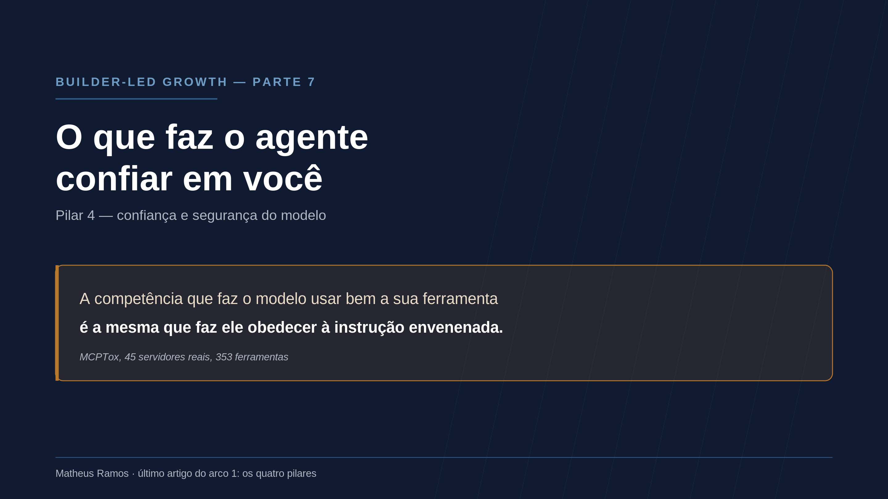
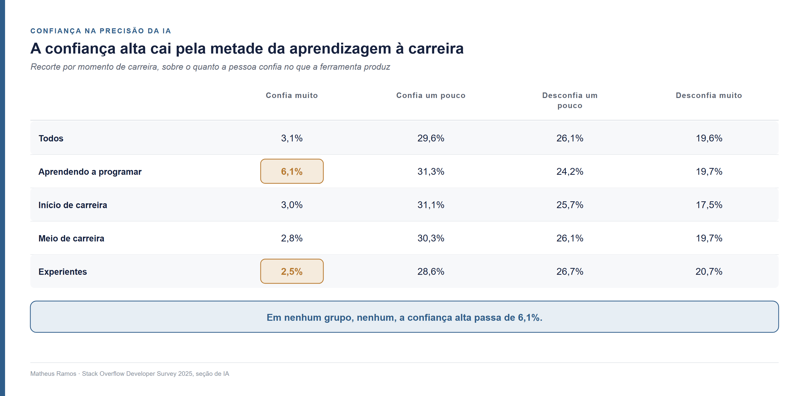
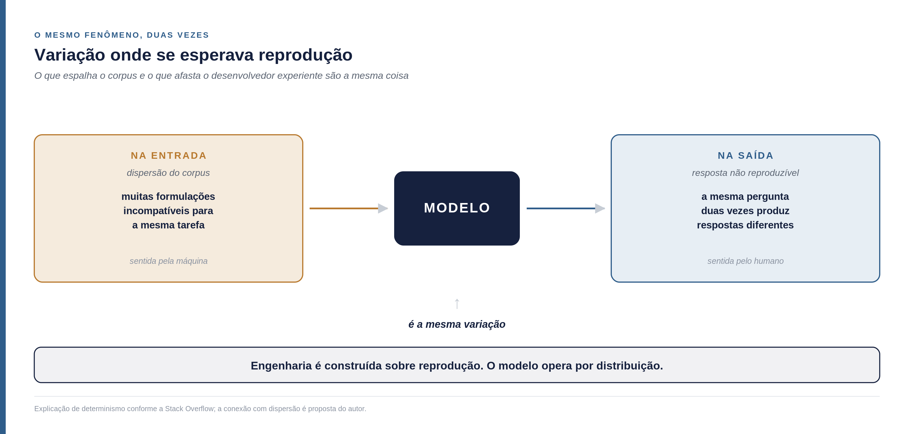
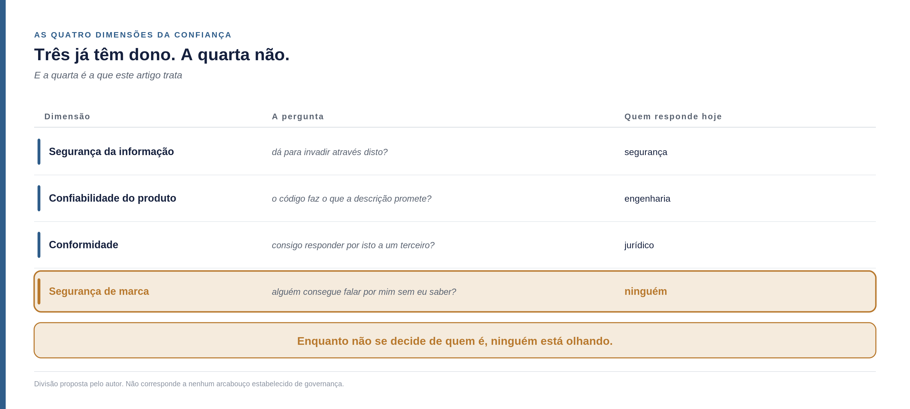
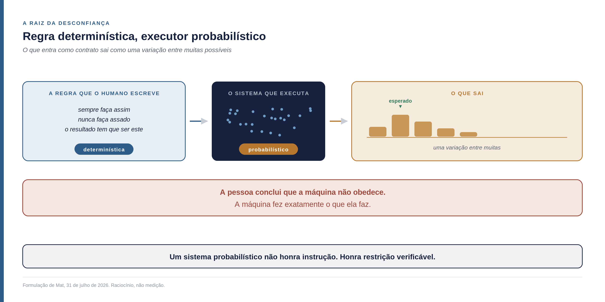
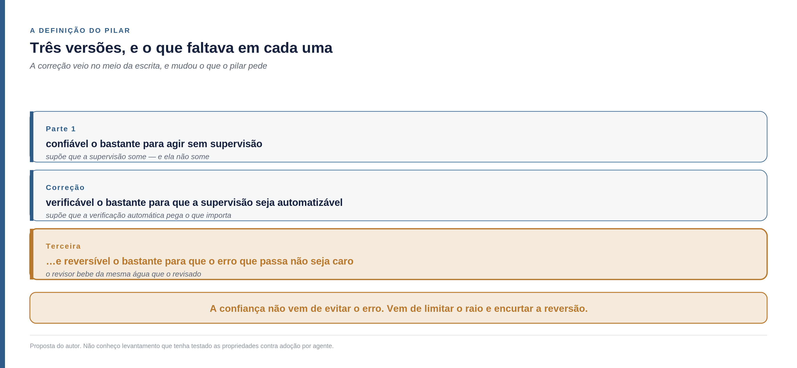
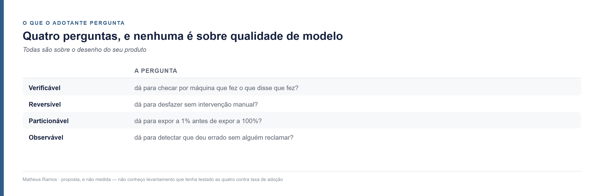
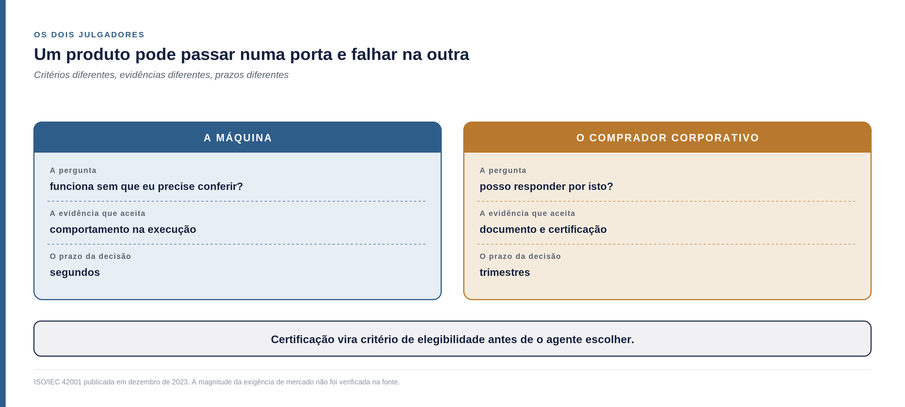
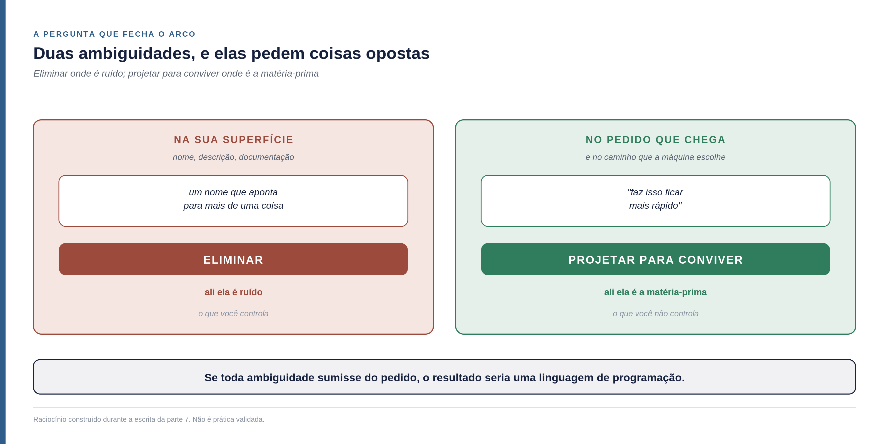
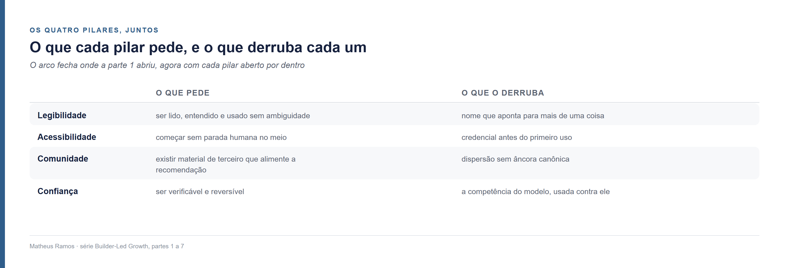

<!--
Parte 07 da série Builder-Led Growth, por Matheus Ramos.
VERSÃO NÃO CANÔNICA. A canônica é a inglesa: ../en/07-trust-and-safety.md
Em caso de divergência de fato ou de número, a inglesa prevalece.
Texto congelado. Prevista no LinkedIn para 18 de agosto de 2026.
Gerado a partir do repositório privado de trabalho. Não editar aqui.
-->

# Builder-Led Growth, parte 7: o que faz o agente confiar, e por que a competência dele é o problema

*Sétima e última parte do primeiro arco desta série. A [parte 1](01-quando-a-maquina-e-cliente.md) nomeou a disciplina e propôs quatro pilares. A [parte 2](02-decisao-preco-e-medicao.md) abriu o mecanismo da decisão. As partes 3, 4, 5 e 6 trataram da legibilidade, da acessibilidade, da comunidade e do que Relações Públicas já sabia sobre tudo isso. Esta abre o último pilar — e ele é o que estava faltando.*

## Do que trata este capítulo

Os seis textos anteriores olharam para fora: como a máquina encontra você, entende você, começa a usar você, e de onde ela tira o que sabe sobre você.

Este olha para dentro. **O assunto aqui é a relação entre humano e máquina no ato de construir** — quem decide o quê, quem confere o quê, e em que condições alguém aceita que uma decisão siga adiante sem que outra pessoa a leia.

Isso não é digressão. É o pilar. Porque o que decide se o seu produto é usado sem supervisão não é uma propriedade sua isolada — é o encaixe entre o que o seu produto oferece e o arranjo de trabalho de quem vai adotá-lo. Um produto pode ser excelente e ainda assim não caber no processo pelo qual aquela equipe decide o que vai para produção.

Três coisas serão tratadas, nesta ordem:

**Por que a confiança está caindo enquanto o uso sobe**, o que é o contrário do que costuma acontecer com tecnologia nova.

**Por que a mesma competência que faz um agente usar bem a sua ferramenta é a que o torna vulnerável** a quem escreve instrução escondida na descrição dela.

**Que arranjo de trabalho entre humano e máquina consegue funcionar mesmo assim** — e que exigências isso cria para o seu produto, que talvez você nunca tenha ouvido no jargão de crescimento.

E ao final, uma pergunta que eu não tinha até escrever este texto, e que muda o que a série vinha recomendando.

## Os quatro pilares, em uma página

**Legibilidade por máquina.** A máquina consegue ler, entender e usar seu produto sem ambiguidade.

**Acessibilidade operacional.** A máquina consegue começar sem que um humano precise intervir no meio do caminho.

**Comunidade e sinal de validação.** Existe material produzido por terceiros do qual a recomendação futura vai se alimentar.

**Confiança e segurança do modelo.** A máquina, e o humano atrás dela, aceitam usar sem revisar cada passo. É o assunto deste artigo, e o único que ainda não tinha sido aberto.

Os três primeiros tratam de ser encontrado, entendido e integrável. Este trata de outra coisa: **de o agente aceitar agir sem que alguém confira cada passo.**

## O tamanho do problema, em um número

Em 2023, cerca de 70% dos desenvolvedores usavam ou planejavam usar ferramentas de IA, e a confiança nelas girava em torno de 40%. Em 2025, o uso subiu para 84% — e a confiança caiu para 29%, onze pontos abaixo do ano anterior.

A própria Stack Overflow, que conduz a pesquisa, apontou o que isso tem de estranho:

> "Uma curva típica de adoção de tecnologia mostra a relação oposta. Familiaridade gera confiança. (...) Mas quanto mais os desenvolvedores usam IA, ao que parece, menos eles confiam nela."

**A curva clássica está invertida.** Normalmente você aprende os limites de uma ferramenta e passa a confiar dentro deles. Aqui o uso cresce e a confiança cai junto.

E há um detalhe na definição que eles usam, que vale ler devagar porque é a definição deste pilar:

> "Confiança do desenvolvedor é sinônimo de **disposição para colocar código gerado por IA em produção com revisão humana mínima**."

Uma empresa que estuda desenvolvedores há duas décadas chegou, por conta própria, à mesma formulação que esta série vinha construindo. Isso não prova nada — mas é o tipo de convergência que dá alguma tranquilidade.

## Quem tem mais experiência confia menos, mas não do jeito que se costuma dizer

A pesquisa pergunta o quanto a pessoa confia na precisão do que a ferramenta de IA produz. Os cortes por momento de carreira dizem uma coisa específica:

Preciso ser exato aqui, porque a leitura fácil é errada. **A desconfiança não cresce muito com a experiência** — vai de 19,6% no geral para 20,7% entre experientes, e essa diferença não sustenta grande conclusão.

O que os números dizem com força é outra coisa: **a confiança alta cai pela metade entre quem está aprendendo a programar e quem já tem carreira**, e continua caindo devagar depois disso. E em nenhum grupo, nenhum, ela passa de 6,1%.

Some-se o que aparece quando se pergunta por que alguém ainda pediria ajuda a uma pessoa num futuro com IA avançada. A razão mais escolhida, com **75,3%**, foi: *quando eu não confio na resposta da IA*. Em segundo lugar, com 61,7%, preocupação ética ou de segurança sobre o código.

**Para quem constrói produto, essa é a leitura que importa:** ser recomendado é a parte resolvida. A demanda não atendida está inteira do outro lado — em ser executado sem que alguém precise conferir.

## Por que o desenvolvedor sênior desconfia, e por que é o mesmo problema do corpus

A explicação que a Stack Overflow oferece é sobre determinismo, e ela conecta com um lugar inesperado.

Engenharia de software é construída sobre reprodução: mesma entrada, mesma saída. Você escreve uma função, testa, e ela se comporta de forma previsível. É o que faz a disciplina se chamar engenharia.

O modelo opera por probabilidade. A mesma pergunta feita duas vezes produz respostas diferentes — as duas possivelmente corretas, estruturadas de formas distintas, com escolhas distintas.

Agora repare onde já vimos isso.

Quando a parte 5 tratou do material público que alimenta a recomendação, o problema central era a **dispersão**: quantas formulações incompatíveis existem para a mesma tarefa. Um corpus com muitas variantes prejudica a máquina porque ela passa a amostrar de uma distribuição espalhada em vez de reproduzir uma resposta.

**É o mesmo fenômeno, em dois pontos da mesma cadeia.** A variação que espalha o corpus e a variação que afasta o desenvolvedor experiente são a mesma coisa: **variação onde se esperava reprodução.** Um sente na entrada, o outro sente na saída.

## A inversão: o que faz você ser escolhido é o que te expõe

Aqui está o achado que organiza este artigo.

A parte 3 tratou a descrição da sua ferramenta como o campo onde você elimina ambiguidade. A parte 6 tratou o mesmo campo como um comunicado escrito para um intermediário que vai reescrever você. Nos dois casos, era **o insumo que você controla.**

É o mesmo campo que um atacante usa.

**O ataque se chama envenenamento de ferramenta**, e o mecanismo é simples de descrever: instruções maliciosas ficam nos **metadados da ferramenta** — na descrição, não no código. Não há programa a executar, não há binário a analisar. É texto, no lugar onde o modelo espera encontrar a explicação de para que serve aquilo.

Um estudo publicado em agosto de 2025, chamado MCPTox, montou um teste sobre **45 servidores MCP reais e em operação, com 353 ferramentas autênticas**. MCP é o Model Context Protocol — a convenção, proposta pela Anthropic em novembro de 2024, pela qual um produto expõe suas capacidades para que um agente as descubra e use; um servidor MCP é a ponta que você publica, e cada ferramenta dentro dele tem nome e descrição. O estudo gerou 1.312 casos maliciosos cobrindo dez categorias de risco. Os resultados:

- A maior taxa de sucesso de ataque observada foi de **72,8%**
- Os agentes quase não recusam: a maior taxa de recusa registrada, entre todos os modelos testados, ficou **abaixo de 3%**

E o achado que muda a natureza do problema:

> **"Modelos mais capazes são frequentemente mais suscetíveis, porque o ataque explora a capacidade superior deles de seguir instruções."**

Leia isso duas vezes.

**A competência que faz o modelo usar bem a sua ferramenta é exatamente a que faz ele obedecer à instrução envenenada.** Não são duas propriedades diferentes que se pode separar com mais treino. É uma só, olhada de dois ângulos.

Os autores concluem que o alinhamento de segurança existente é ineficaz nesses casos, e o motivo é estrutural: **a ação usa ferramentas legítimas para uma operação não autorizada.** Não há código malicioso a detectar. Há uma ferramenta normal, usada para o que não devia.

Vale a condição do experimento, porque ela importa: isso é laboratório, contra servidores escolhidos para o teste. Não é uma taxa de campo, e eu não sei qual seria. O que o número mostra não é a frequência do ataque no mundo — é que **a defesa, quando o ataque acontece, praticamente não existe.**

## A dimensão que não tem dono

Existe uma variante disso que não é sobre roubar nada.

É possível esconder instrução no HTML de uma página — em atributo, em comentário, em texto deslocado para fora da tela por CSS, em metadado estruturado — de modo que um agente que leia aquela página seja instruído a falar bem de um produto. O servidor pode inclusive identificar que o visitante não é humano e servir uma versão diferente da página, só para ele. A técnica tem nome emprestado da otimização para buscadores: **cloaking**, com outro alvo.

Se a palavra técnica atrapalha, a analogia é direta: **é plantar informação falsa para que quem tem o alcance a repita como se fosse apuração própria.** A diferença em relação ao boato que circula entre pessoas é que aqui o mecanismo é silencioso e escalável — a página mente só para a máquina, e o humano que lê a mesma página não vê nada de estranho.

A parte 6 argumentou que a máquina é imprensa e leitor ao mesmo tempo, e que por isso o repertório de assessoria de imprensa se aplica. Isto é o outro lado da mesma moeda: **é assessoria de imprensa fraudulenta. É escrever o seu release na página de outra pessoa** — e depois esperar que ela seja citada como fonte independente, que é exatamente o que dá peso a ela.

E aqui aparece uma lacuna organizacional que vale nomear. O quarto pilar tem quatro dimensões, e três delas já têm dono:

A linha de baixo é a que este artigo trata, e ela não está no organograma de quase nenhuma empresa. É de marca? De segurança? De produto? Enquanto não se decide, ninguém está olhando.

E há uma consequência mais ampla, que a série vai precisar desenvolver noutro lugar: **o código deixou de ser produto de uma pessoa e passou a ser produto do par humano-máquina.** Com isso, texto que antes era só de engenharia — a descrição de uma ferramenta, o arquivo de instruções na raiz do repositório, a mensagem de erro — passa a interessar a marca, a jurídico e a segurança ao mesmo tempo. Cada vez mais áreas da empresa entram numa decisão que costumava ser técnica.

## O aquífero contaminado

A parte 5 propôs que comunidade não é bem um pilar — é o lençol freático. Você não fabrica a água: perfura, bombeia e usa. O aquífero é compartilhado com o vizinho, é esgotável, e sozinho não sustenta nada.

Envenenar descrição de ferramenta e esconder instrução em página é atacar o aquífero.

E aqui está o que a imagem captura e o vocabulário de segurança não captura: **o dano não é ao concorrente. É ao meio.** Uma injeção bem-sucedida não prejudica só o produto que ela imita — ela degrada o material do qual todo mundo bebe, inclusive quem envenenou.

Essa última parte é a que muda a natureza do argumento. Não é poluição industrial clássica, onde o custo cai sobre terceiros e o poluidor sai ileso. **Quem contamina o corpus treina o modelo que ele mesmo vai usar.** O dano volta.

E daí sai a terceira camada de um argumento que a parte 6 já tinha construído em duas.

Ali, a defesa do modelo simétrico de comunicação — aquele em que os dois lados podem mudar de posição — ganhou razão econômica: comunicação simétrica produz artefato de terceiro, e artefato de terceiro é o que mais pesa quando a máquina decide. **Agora acrescenta-se: manter a água limpa é insumo de todo mundo, inclusive seu.**

O "benefício mútuo" que está na definição de Relações Públicas desde 2012 deixa de ser aspiração de manual e vira **manutenção de infraestrutura compartilhada.**

Preciso ser honesto sobre o limite disso, ou vira pregação. **Ninguém mediu o retorno do dano ao poluidor**, e o intervalo entre contaminar e beber a própria água é longo o bastante para que o cálculo individual de curto prazo ainda favoreça contaminar. O argumento é de mecanismo, e o mecanismo tem prazo.

## O que o pilar realmente pede

Quando propus este pilar na parte 1, escrevi que ele era sobre ser confiável o bastante para agir sem supervisão.

Isso está incompleto, e o que falta muda a coisa toda. **Mas antes de propor a correção, preciso descrever o que de fato acontece hoje**, porque descrever o desejável como se fosse o corrente seria o erro mais fácil deste artigo.

### O que realmente se pratica

O arranjo dominante não é "o humano define política e sai". É este:

**O humano escreve as regras. A máquina escreve o código. O humano revisa a saída.**

É isso que a maior parte das equipes está fazendo, e a revisão humana no fim da linha não desapareceu em lugar nenhum — ela cresceu. É também, na minha leitura, uma das razões da desconfiança que os números mostram: quem revisa vê de perto o que precisou corrigir.

### O descasamento que produz a desconfiança

E há um problema mais fundo dentro desse arranjo, que vale nomear porque explica muita coisa.

**As regras que o humano escreve são determinísticas. O sistema que as executa é probabilístico.**

Quem escreve uma regra escreve como quem escreve contrato: *sempre faça assim, nunca faça assado, o resultado tem que ser este.* É como fomos treinados — é como se especifica software desde sempre.

Do outro lado, o executor amostra de uma distribuição. Ele não descumpre a regra por rebeldia; ele produz uma variação entre muitas possíveis, e algumas variações atendem a regra melhor que outras.

Resultado: a regra determinística atravessa o sistema probabilístico e o que sai do outro lado quase nunca é exatamente o que a regra descrevia. **A pessoa que escreveu a regra conclui que a máquina não obedece. A máquina fez exatamente o que ela faz.**

Some-se a isso que, na maioria dos casos, o conjunto de regras nem sequer está bem estabelecido — está na cabeça de alguém, espalhado em conversas, ou escrito para humano ler e não para máquina cumprir. **A desconfiança que os números medem não nasce da máquina ser ruim. Nasce desse descasamento.**

### Então o que a correção propõe

Não é que a supervisão desapareça. **Ela muda de executor e muda de natureza.**

E a mudança de natureza é a parte que interessa: em vez de escrever a regra como se ela fosse cumprida ao pé da letra, escrever **o que precisa ser verdade no fim, seja qual for o caminho.** Um sistema probabilístico não honra instrução; ele honra restrição verificável.

É a diferença entre *"implemente desta maneira"* e *"pode implementar como quiser, desde que nenhuma chamada externa aconteça sem registro, nenhuma operação seja irreversível, e este conjunto de testes passe."* A primeira frase é um contrato que vai ser quebrado. A segunda é uma cerca — e a máquina sabe operar dentro de cerca.

Por isso a formulação do pilar tem duas partes:

> **Verificável o bastante para que a supervisão seja automatizável. E reversível o bastante para que o erro que passa não seja caro.**

A segunda parte existe porque a primeira não basta, e o motivo é o mesmo aquífero.

E vale dizer o que isso é: **descrição de para onde a coisa parece estar indo, e não do que a maioria faz hoje.** Quem opera assim é minoria, e é dela que trata a seção sobre uma operação real, adiante.

## Por que o revisor automático não pega tudo

Se máquina revisa máquina, existe uma condição em que as duas beberam da mesma água — e essa condição é mais comum do que parece.

Vale separar os casos, porque a diferença é prática e não retórica.

**Um verificador determinístico não tem esse problema.** Compilador, teste automatizado, análise estática, checagem de tipo, política aplicada por regra explícita: nada disso amostra de distribuição. Se o teste passa, passou pelo mesmo motivo hoje e amanhã. Esse tipo de revisão automática é antigo, funciona, e não é do que estou falando.

**Um modelo treinado sobre dados que a empresa controla também é outro caso.** Quem treina sobre o próprio código, com o próprio histórico de incidentes, produz um revisor cujos erros não são necessariamente os mesmos de quem escreveu. A correlação existe, mas é menor, e a empresa tem alguma alavanca sobre ela.

**O caso frágil é o que a maioria vai adotar por ser o mais barato:** um modelo de propósito geral revisando o que outro modelo de propósito geral escreveu. Os dois beberam do mesmo lençol freático — literalmente o mesmo corpus público que a parte 5 descreveu. **O laço detecta o que os dois não erram junto, e a correlação é alta por construção.**

E aqui a metáfora do aquífero se paga: se a água estiver envenenada — pela dispersão que a parte 5 mediu, ou pela instrução plantada que este artigo acabou de descrever —, **o revisor bebeu do mesmo poço envenenado que o autor.** Ele não vai estranhar o gosto.

Há literatura formando-se em torno disso. Há trabalho sobre colapso quando modelo revisa código de modelo de forma recursiva. Há a observação de que sistemas de avaliação por modelo são sensíveis ao desenho do avaliador e **tendem a favorecer saída que se parece com saída de modelo.** E há o caso mais incômodo de todos: um remendo gerado por IA pode passar em todos os testes e continuar semanticamente errado — porque teste verifica comportamento declarado, não intenção.

**Daí a política definida por humano não ser resíduo do processo antigo.** Não é o pedaço que ainda não foi automatizado. É o que quebra a correlação e impede o laço de ficar se autoconfirmando — do mesmo jeito que, no aquífero, é a fonte externa que impede a água de virar apenas o que já estava dentro.

E daí também a segunda metade da definição. Se o erro correlacionado atravessa a revisão por construção, então **a defesa não pode ser só detectar antes. Precisa ser conter depois:** expor a uma fração, medir, reverter rápido.

A confiança, nesse desenho, não vem de evitar o erro. Vem de **limitar o raio do erro e encurtar o tempo até a reversão.**

## O par que constrói: conveniente ou melhor?

Se o humano sai da revisão e vai para a política, vale perguntar se o arranjo anterior era bom ou apenas confortável.

Há uma medida que ajuda, e ela é desconfortável. A METR conduziu um ensaio aleatorizado com dezesseis desenvolvedores experientes, sobre 246 tarefas reais em repositórios grandes e maduros que eles já conheciam bem. Antes de começar, previram ficar 24% mais rápidos com ferramentas de IA. Ao terminar, estimaram ter ficado 20% mais rápidos.

**A medição mostrou 19% mais lentos.**

As ressalvas são grandes e precisam vir junto: dezesseis pessoas é pouco; o contexto é específico, de gente que conhece profundamente o código em que mexe; as ferramentas eram as do início de 2025; e a própria METR passou a marcar o resultado como histórico, dizendo que não reflete necessariamente as ferramentas nem os fluxos atuais.

**O que o ensaio mostra não é que o par humano-máquina não funciona.** Mostra que, naquele desenho, a sensação de velocidade e a velocidade real divergiram — e divergiram na direção do conforto. As pessoas sentiram ganho onde havia perda, e continuaram sentindo depois de terminar.

Há uma explicação candidata que a própria pesquisa da Stack Overflow sugere, e ela é o que chamam de **carga de discernimento**: quando cada trecho gerado exige verificação, você precisa ler com atenção, entender o que faz, testar e checar os casos extremos. Se essa verificação custa o mesmo que teria custado escrever, o que exatamente se ganhou?

**Aqui está por que isso importa para o desenho do produto, e não só para o processo.** Revisar código que você não escreveu é caro porque exige reconstruir a intenção de quem escreveu. Especificar antes é declarar a intenção enquanto ela ainda existe na sua cabeça.

E é o mesmo movimento que a parte 6 descreveu quando tratou do comunicado escrito primeiro: decidir a versão canônica antes de construir. **Uma especificação é, para o problema, o que um arquivo de instruções é para o produto** — o código compartilhado que evita que o receptor adivinhe.

## Onde o humano passa a atuar

Se a supervisão vira automática e o esforço humano vai para a frente, ele vai para onde exatamente?

Para três camadas que estão se formando com nome próprio, e vale conhecer os termos porque eles vão aparecer cada vez mais.

**Harness** é a camada de software em volta do modelo. O modelo em si é um preditor sem estado — recebe contexto, devolve texto. O harness é a infraestrutura que despacha chamadas de ferramenta, administra o que entra no contexto e aplica as regras. Está se formando literatura tratando o harness como ativo de engenharia e como plano de controle, e não como cola entre componentes.

**Guardrails** são as regras aplicadas em tempo de execução: interceptar entrada e saída antes de chegarem ao destino, controlar privilégio por chamada, restringir não só um passo isolado mas o traço inteiro da execução.

**Política** é o que um humano decide antes de qualquer execução acontecer: o que pode, o que não pode, o que exige alguém acordado.

**A conexão com a parte 6 é direta:** harness e guardrail são, para o agente, o que a política editorial é para uma redação. Não escrevem a matéria — decidem o que sai.

Registro que li a superfície dessa literatura, e não o fundo. Vários dos trabalhos são pré-publicações de 2026 que localizei mas não estudei. Trato o vocabulário como estabelecido e as conclusões como não verificadas por mim.

## Uma operação que já trabalha assim

Se o arranjo que acabei de descrever é minoria, vale olhar quem já opera nele.

**Declaro duas coisas antes de seguir.** Primeiro, tenho relação pessoal com pessoas da empresa que vou citar, e por isso me limito a material público: comunicado, cobertura de imprensa e página de vagas, tudo com fonte no fim do texto. Segundo, e mais difícil de escrever sem parecer bajulação: **eu admiro o que essa empresa construiu.** É uma companhia séria, que colocou tecnologia e cliente em pé de igualdade — ou melhor, numa relação em que um sustenta o outro — e que está fora da curva pelos números e pela forma de trabalhar.

Prefiro declarar a admiração e manter a distância crítica do que fingir uma neutralidade que eu não tenho. As ressalvas sobre os dados estão no fim desta seção, e elas valem inteiras.

A CloudWalk, empresa brasileira de pagamentos, informou em comunicado de 11 de março de 2026 ter fechado 2025 com R$ 5,44 bilhões de receita, R$ 602 milhões de lucro líquido e receita anualizada de R$ 7,16 bilhões em dezembro — **com uma equipe de 720 pessoas**, o que dá cerca de R$ 10 milhões de receita por profissional. O crescimento composto desde 2019 é de 186% ao ano.

A frase de Luis Silva, fundador e presidente, resume o posicionamento: *"Toda fintech diz que usa IA. Nós somos uma empresa de IA que, por acaso, opera no setor financeiro."*

**Mas o que interessa a este pilar não é o número. É a divisão de trabalho descrita no mesmo comunicado:**

> Agentes autônomos desenvolvem software, aprovam crédito, previnem fraudes, fecham vendas, respondem atendimentos e criam campanhas de marketing de forma independente. **As equipes humanas, por sua vez, definem políticas, tratam exceções e governam o risco.**

**Repare no contraste com o arranjo dominante que descrevi acima.** Lá, o humano escreve a regra, a máquina codifica, e o humano revisa a saída. Aqui, o humano define política, trata exceção e governa risco — e a revisão de saída não é o trabalho dele.

Não é uma diferença de ferramenta. É uma diferença de desenho organizacional, e ela foi tomada como decisão, não herdada como acidente.

**E é exatamente disto que trata o Builder-Led Growth.** A disciplina não é sobre otimizar texto para máquina — isso é consequência. É sobre uma mentalidade em que a máquina é parte do time que constrói e do canal que distribui ao mesmo tempo, e em que as decisões de produto são tomadas com isso em conta desde o começo. Uma empresa que reorganiza a própria divisão de trabalho em torno disso está praticando a disciplina antes de ela ter nome.

E o produto que nasceu desse modelo, o JIM.com, é descrito em termos que valem para o pilar de acessibilidade e para este ao mesmo tempo: *"não há painel, não há manual, não há curva de aprendizado."* Quando um pagamento é recusado, o agente diagnostica antes de o vendedor ligar.

**As ressalvas, e elas são obrigatórias.** Os números são de comunicado da própria empresa, não de demonstração auditada publicada; a cobertura de imprensa que encontrei reproduz a nota, e não faz apuração independente. A atribuição do resultado à IA autônoma é da empresa — pagamentos é um setor com receita por pessoa naturalmente alta, e a base brasileira cresceu num ambiente de forte adoção digital. **Relato a atribuição. Não a endosso.**

E uma empresa não é padrão. É sinal — mas é um sinal muito bem-vindo, porque a maior parte do que se lê sobre autonomia de agentes é promessa de fornecedor. Aqui há uma operação em escala, com número publicado e nome de quem assina, dizendo como organizou o trabalho. Independentemente do que se conclua sobre a atribuição dos resultados, **ter um caso concreto para examinar vale mais que dez artigos sobre o que deveria funcionar.**

E há outras empresas caminhando nessa direção. Esta é a que tem os números mais abertos, e é por isso que ela aparece aqui.

## As quatro propriedades que viram condição de entrada

Aqui está a consequência prática para quem constrói produto de terceiro, que é o assunto desta série.

Se o adotante opera assim, ele não vai perguntar se o seu produto é bom. Vai perguntar quatro outras coisas:

Nenhuma delas é sobre qualidade de modelo. Todas são sobre desenho do seu produto.

E a consequência é dura: **um produto que não permite reversão limpa nem exposição parcial não pode ser adotado sob esse modelo de operação**, por melhor que seja em tudo o mais. Não é que ele perde na comparação — é que ele não entra na lista.

Isso é proposta, e não medida. Não conheço levantamento que tenha testado essas quatro propriedades contra taxa de adoção por agente. Mas o mecanismo é direto o suficiente para eu apostar nele, e barato o suficiente para alguém falsear.

## A outra porta: quem assina embaixo

Existe um segundo julgador, com critérios completamente diferentes, e um produto pode passar num e falhar no outro.

Do lado do comprador, a **ISO/IEC 42001** — publicada em dezembro de 2023, primeiro padrão internacional de sistema de gestão de inteligência artificial — virou referência de compra. Empresas grandes vêm anunciando certificação publicamente desde o início de 2025, e a norma aparece com frequência crescente nas listas de exigência de fornecedor.

Encontrei números circulando sobre a proporção de grandes compradores que planejam exigir a norma. Não consegui chegar ao levantamento original — ele aparece citado apenas em material de empresas que vendem certificação — e por isso não uso o número. **A direção é observável; a magnitude eu não verifiquei.**

**O ponto que interessa à disciplina:** certificação vira critério de elegibilidade **antes** de o agente escolher. É um filtro que age numa etapa anterior a tudo que esta série descreveu — e isso faz da conformidade não apenas uma barreira ao Builder-Led Growth, mas também um canal.

## A janela que a regulação abriu sem querer

Havia uma expectativa de que a regulação forçasse o mercado a produzir confiança verificável, e havia uma data.

As obrigações de alto risco do EU AI Act entrariam em vigor em 2 de agosto de 2026. **Em 16 de junho de 2026, o Parlamento Europeu aprovou o adiamento:** as obrigações do Anexo III passam para 2 de dezembro de 2027, e as do Anexo I para 2 de agosto de 2028. As obrigações de transparência do Artigo 50 seguem valendo a partir de 2 de agosto de 2026.

Vou aproveitar para registrar um erro nosso, porque ele ensina algo útil. Nossa pesquisa tinha anotado a data original como fato estável, e o adiamento já existia quando anotamos. **Prazo regulatório futuro não é dado — é previsão com força de lei, e ela muda.** Qualquer data desse tipo precisa ser reconferida na semana da publicação, não na semana da pesquisa.

Sobre a consequência: são dezesseis meses a mais. Quem contava com a norma para empurrar o mercado vai esperar. E no intervalo, **confiança segue sendo problema de produto, e não de conformidade.**

Há uma leitura de oportunidade nisso, e ela cabe. Dezesseis meses é prazo suficiente para construir trilha de auditoria, identidade rastreável e revogação **antes de precisar** — e chegar à mesa de compra com a evidência pronta enquanto os outros ainda estão lendo a norma. Voltando ao poço: quem chega antes bebe água limpa.

A ressalva que impede isso de virar conselho fácil: antecipar também custa, e pode-se construir para uma exigência que muda antes de entrar em vigor. A própria data mudando é a prova.

## Deveríamos construir sistemas que abraçam a ambiguidade?

Essa pergunta apareceu enquanto eu escrevia, e ela põe em xeque algo que esta série vinha recomendando desde o começo.

O primeiro pilar diz para eliminar ambiguidade: nome que não colide, descrição que admite uma leitura só, documentação sem versões contraditórias. O texto inteiro deste artigo diz que a máquina é probabilística e que variação é o problema.

Junte os dois e a conclusão parece ser: elimine toda a ambiguidade que conseguir, e depois lute contra a que sobrar.

**Acho que essa conclusão está errada, e a distinção que resolve é entre dois tipos de ambiguidade que a série vinha tratando como um só.**

### A ambiguidade que é defeito

Quando um nome aponta para mais de uma coisa, quando duas páginas suas dizem coisas incompatíveis sobre a mesma operação, quando a descrição da ferramenta admite duas leituras — isso é ruído, no sentido exato que a parte 6 usou: degradação da mensagem entre emissão e recepção.

Não há nada a abraçar aqui. Isso é defeito, e o defeito é seu, no que você controla.

### A ambiguidade que é a razão de existir

Agora considere o outro lado. Uma pessoa pede ao agente *"faz isso ficar mais rápido"*. Não disse o que é rápido o bastante, nem a que custo, nem onde. O pedido é ambíguo, e é assim que gente pede coisas.

**Se toda ambiguidade fosse eliminada do pedido, o resultado seria uma linguagem de programação** — e aí não seria preciso modelo nenhum. A capacidade de trabalhar com pedido mal formulado não é um defeito tolerado do sistema. **É o produto inteiro.**

Então a resposta à pergunta é dupla, e as duas metades apontam para lados opostos:

### O que "projetar para conviver" quer dizer na prática

Volto à distinção entre instrução e restrição, porque ela é a forma concreta disso.

Um sistema que exige que a máquina siga exatamente um caminho está tentando eliminar ambiguidade onde ela é inerente — e vai quebrar, repetidamente, do jeito que a seção sobre descasamento descreveu.

Um sistema que declara **o que precisa ser verdade no fim** e deixa o caminho em aberto está abraçando a ambiguidade na parte certa. Ele não pergunta "você fez do jeito que mandei?". Pergunta "o resultado satisfaz estas condições?".

**As quatro propriedades desta seção — verificável, reversível, particionável, observável — são exatamente isso.** Nenhuma delas exige que a máquina se comporte de um jeito específico. Todas exigem que, seja qual for o comportamento, dê para checar, desfazer, limitar e enxergar.

**É uma tolerância projetada, e não uma esperança.**

Registro que isso é raciocínio meu, construído durante a escrita deste texto, e não prática validada. Mas ele reconcilia duas coisas que estavam brigando na série, e a reconciliação me parece mais verdadeira que qualquer das duas sozinha.

## Os quatro pilares, reunidos

Este artigo fecha o arco que a parte 1 abriu. Vale ver os quatro juntos uma vez, agora que cada um foi aberto por dentro.

E há uma coisa que só aparece com os quatro na mesa.

Os três primeiros aumentam a sua superfície: ser mais legível, mais acessível e mais comentado significa estar mais exposto, em mais lugares, a mais leitores que você não escolhe. **O quarto pilar não é mais um item da lista. É o que decide se essa superfície toda trabalha a seu favor ou contra você.**

E o limite da tese continua onde estava desde a parte 2, sem mudança: **o Builder-Led Growth decide quem entra; a economia humana decide quem fica.** Nenhuma otimização para máquina sustenta um produto que não fecha a conta com gente.

## O que faria este pilar cair

**Se o alinhamento resolver o envenenamento de descrição.** O argumento central se apoia em que a competência de seguir instruções e a vulnerabilidade à instrução envenenada são a mesma propriedade. Se alguém demonstrar separação limpa entre as duas — modelo que obedece bem à instrução legítima e recusa a maliciosa com taxa alta —, esta seção envelhece rápido. Eu ficaria contente de estar errado.

**Se o laço de máquina revisando máquina não tiver o ponto cego que descrevi.** Isso é testável: pegue um conjunto de erros conhecidos, veja quantos o revisor automático detecta, e compare com a taxa de detecção quando revisor e autor vêm de treinos diferentes. Se não houver diferença, a correlação que eu suponho não existe.

**Se a confiança começar a subir com o uso.** A curva invertida é o pilar inteiro. Se a próxima pesquisa mostrar adoção e confiança subindo juntas, a demanda não atendida que eu descrevi está sendo atendida, e o pilar perde urgência sem perder validade.

E fica a pergunta que eu não sei responder, e que me parece a mais importante deste artigo. Se a defesa contra descrição envenenada for desconfiar de descrições ricas, **o produto honesto que escreve bem a própria documentação paga o preço do atacante.** Não sei onde fica esse ponto de equilíbrio, nem se alguém está pensando nele como problema de desenho e não só de segurança. Se você trabalha com isso, é a conversa que eu mais quero ter.

---

Este texto fecha o primeiro arco da série — os quatro pilares, propostos na parte 1 e abertos um a um. O que vem a seguir sai da estrutura e vai para o movimento: **como o crescimento acontece dentro dessa disciplina, quais são os motions, e como o funil se comporta quando quem percorre não é gente.** Começa numerado do zero, e não vai exigir que ninguém leia estes sete antes.

---

**Série Builder-Led Growth — arco 1: os quatro pilares**

- [Parte 1 — Quando a máquina também é seu cliente](01-quando-a-maquina-e-cliente.md)
- [Parte 2 — A decisão, o preço e o que medir](02-decisao-preco-e-medicao.md)
- [Parte 3 — O imposto que a máquina cobra e o humano não vê](03-legibilidade-por-maquina.md)
- [Parte 4 — Quantas vezes o agente precisa chamar um humano](04-acessibilidade-operacional.md)
- [Parte 5 — O poço de onde todos bebem](05-comunidade-e-sinal-de-validacao.md)
- [Parte 6 — A máquina é imprensa e leitor ao mesmo tempo](06-relacoes-publicas.md)
- Parte 7 — O que faz o agente confiar (este texto)

---

**Fontes e créditos**

- Adoção e confiança de desenvolvedores: [Stack Overflow Developer Survey 2025, seção de IA](https://survey.stackoverflow.co/2025/ai) e [Mind the gap: closing the AI trust gap for developers, 18 de fevereiro de 2026](https://stackoverflow.blog/2026/02/18/closing-the-developer-ai-trust-gap/)
- Envenenamento de ferramenta: Yuhao Wang e colegas, *MCPTox: A Benchmark for Tool Poisoning Attack on Real-World MCP Servers*, [arXiv 2508.14925](https://arxiv.org/abs/2508.14925), agosto de 2025, publicado depois nos anais da AAAI
- Ensaio de produtividade: [METR, Measuring the Impact of Early-2025 AI on Experienced Open-Source Developer Productivity](https://metr.org/blog/2025-07-10-early-2025-ai-experienced-os-dev-study/)
- Números e citações da CloudWalk: [comunicado da empresa, 11 de março de 2026](https://www.cloudwalk.io/newsroom/cloudwalk-hits-1-3-billion-annualized-revenue-run-rate-and-1-8-million-revenue-per-employee-in-2025)
- Adiamento do EU AI Act: [Gibson Dunn](https://www.gibsondunn.com/eu-ai-act-omnibus-agreement-postponed-high-risk-deadlines-and-other-key-changes/) e [Jones Walker](https://www.joneswalker.com/en/insights/blogs/ai-law-blog/yes-august-2-still-matters-the-eu-approved-a-high-risk-ai-delay-but-most-trans.html)
- ISO/IEC 42001: norma publicada em dezembro de 2023 pela ISO e pela IEC
- O número de 32,5% contra menos de 5%: fonte creditada na parte 1 desta série
- A imagem do lençol freático e o conceito de comunidade de registro: parte 5 desta série
