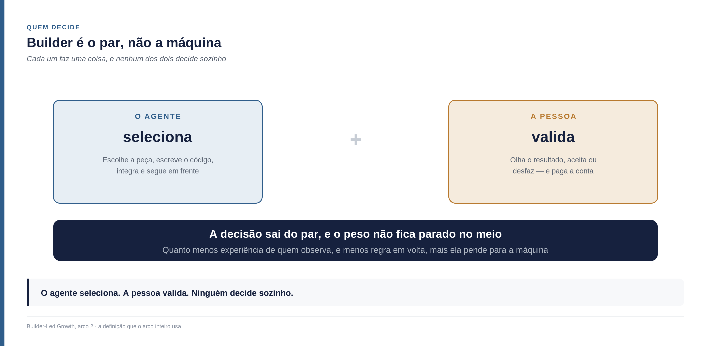
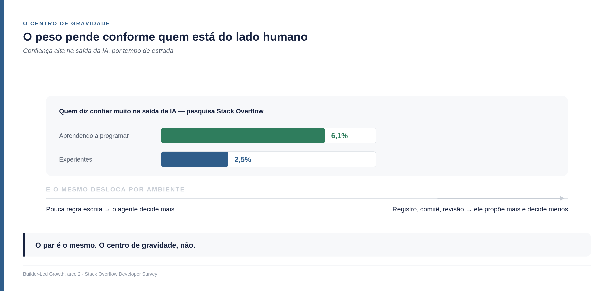
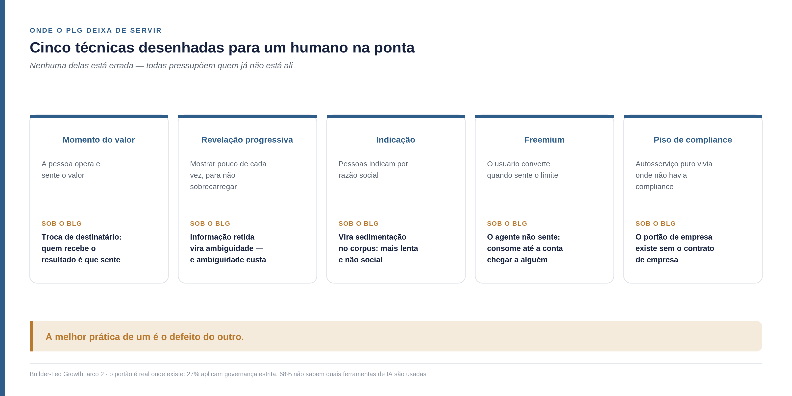
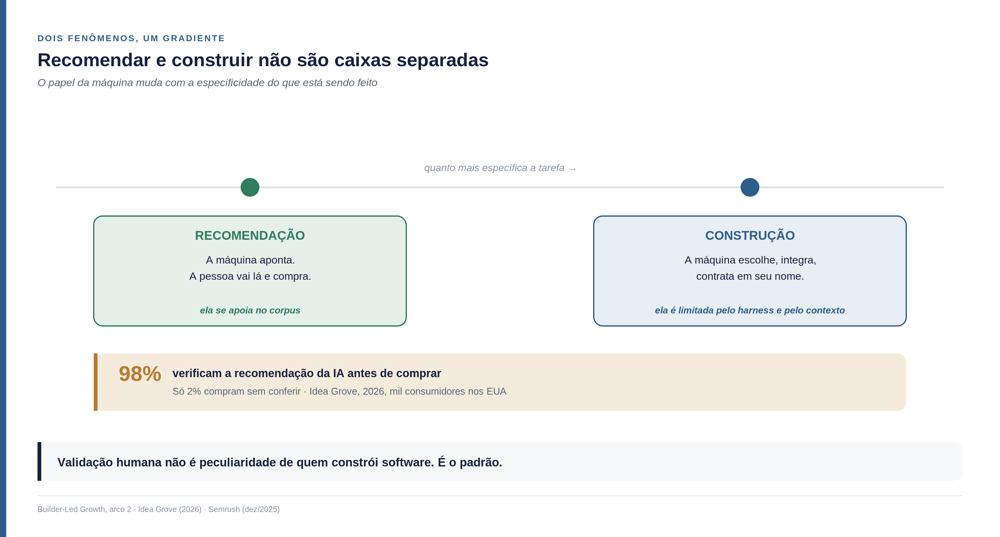
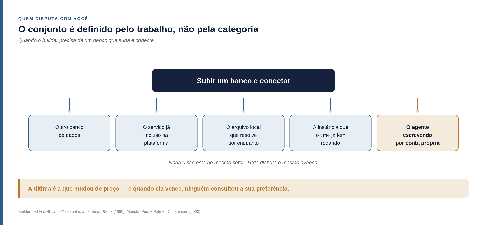

<!--
Arco 2, parte 0 da série Builder-Led Growth, por Matheus Ramos.
VERSÃO NÃO CANÔNICA. A canônica é a inglesa: ../en/arc2-00-from-plg-to-blg.md
Em caso de divergência de fato ou de número, a inglesa prevalece.
Texto congelado. Prevista no LinkedIn para 8 de setembro de 2026.
Gerado a partir do repositório privado de trabalho. Não editar aqui.
-->

# Do PLG ao BLG — o que continua valendo quando quem escolhe é um par

*Abre o segundo arco desta série. Não exige ter lido o primeiro — os conceitos que
importam são retomados aqui. O primeiro arco perguntava o que a máquina decide; o
segundo pergunta como o par decide, e o que fazer com isso.*

---

## Duas siglas, antes de começar

**PLG** é *product-led growth*, crescimento liderado pelo produto: a ideia de que
o próprio produto faz o trabalho que antes cabia a vendas e marketing — a pessoa
experimenta, percebe o valor sozinha, e decide.

**BLG** é *builder-led growth*, o nome que dei em julho de 2026 a um fenômeno
específico: **um agente de código recomenda ou adota a sua ferramenta enquanto
constrói outra coisa.** Não há comprador avaliando fornecedores, não há processo
de avaliação, não há ninguém fazendo compras. A adoção acontece como subproduto
instrumental de uma tarefa de construção — e quem ganha ali cresce, quem perde não
existe para aquele projeto.

O resto deste texto é sobre o que essas duas têm em comum e onde deixam de ter.

## Uma lente mais forte sobre a palavra mais importante

Quando nomeei esta disciplina, em julho de 2026, escrevi que "builder" nomeava com
precisão quem toma a decisão: não um comprador avaliando fornecedores, não o seu
produto sendo operado sem interface, e sim um agente construtor escolhendo, no
meio da construção, o que usar.

A palavra estava certa e continua. **O que faltou foi detalhe.** Aquela versão
descreveu o fenômeno de longe, o suficiente para nomeá-lo; esta troca a lente e
examina quem exatamente está ali.

Cheguei ao detalhe por três caminhos que só fizeram sentido quando vistos juntos.

O primeiro veio da prática. Quem constrói com agentes conhece a cena: o agente
para pela terceira vez para pedir uma credencial, e quem está observando perde a
paciência e troca de ferramenta. A troca não passou por nenhum critério que a
máquina tenha avaliado. Ela aconteceu do lado de fora.

O segundo veio de um instrumento consagrado que continuou funcionando quando eu
esperava que quebrasse. **[Sean Ellis](https://www.linkedin.com/in/seanellis)** formulou uma pergunta que virou referência
para medir ajuste entre produto e mercado: como você se sentiria se não pudesse
mais usar este produto? **[Rahul Vohra](https://www.linkedin.com/in/rahulvohra/)**, fundador do Superhuman, conta em 13 de
novembro de 2018 que essa pergunta lhe deu parte do que precisava e não tudo — e
que ele construiu um método inteiro em volta dela para conseguir agir sobre o
resultado ([First Round Review](https://review.firstround.com/how-superhuman-built-an-engine-to-find-product-market-fit/)).

Eu apostava que a pergunta de Ellis perdesse sentido quando quem opera o produto é
uma máquina. Não perdeu. Ela continua funcionando — e quem responde deixou de ser
quem opera e passou a ser quem recebe o resultado.

O terceiro veio das restrições. Treino, *harness* — o andaime que executa o agente
e delimita o que ele pode chamar e enxergar —, *guardrail* — o limite que barra
certas ações antes de elas acontecerem — e regra de compliance não agem sobre o
agente. Agem sobre o conjunto. Descrevem como o conjunto foi montado.

Somados, os três dizem a mesma coisa, e é assim que uso o termo daqui em diante:

> **Builder é o par: a pessoa e o agente juntos.** O agente seleciona, a pessoa
> valida, e nenhum dos dois decide sozinho.

Era o que a palavra já dizia no mercado — nas plataformas de construção assistida,
builder é quem constrói com IA, e ninguém precisa explicar que há uma pessoa ali.
A diferença é que agora essa pessoa entra no modelo em vez de ficar
subentendida.

E perdoe-me o trocadilho infame: o cliente do BLG é, literalmente, um
super-humano. O caso que acabei de citar é o Superhuman, e a coincidência era boa
demais para deixar passar. Feita a brincadeira, sigo com "builder".

## O híbrido de máquina e humano não é invenção desta década

Vale conter o entusiasmo antes que ele estrague o argumento.

Pares entre pessoa e máquina existem há muito tempo. Uma planilha usada para
decidir onde investir é um deles: a pessoa formula, a ferramenta calcula, e a
decisão sai do conjunto. Ferramenta sempre existiu, sempre mudou o que a pessoa
consegue decidir, e vai continuar mudando.

O que mudou foi a natureza da ferramenta. **Ela virou probabilística.**

A planilha erra do jeito que foi programada para errar — some uma coluna errada e
ela vai somar errado toda vez, do mesmo jeito, até alguém corrigir. O assistente
erra diferente a cada execução, e às vezes acerta na segunda tentativa a mesma
pergunta que tinha errado na primeira.

Isso tem uma consequência prática que atravessa o arco inteiro: **governança
desenhada para ferramenta determinística não cobre ferramenta probabilística.**
Uma regra do tipo "conferir a fórmula antes de aprovar" funciona quando a fórmula
é estável. Quando o que se aprova é uma tendência, e não um passo, o mesmo
procedimento passa a dar uma sensação de controle que ele já não entrega.

Repare no que isso faz com a ideia de conferir: você não está mais aprovando uma
resposta, está aprovando uma distribuição de respostas possíveis.

## O trabalho é o mesmo. A contratação é que mudou

Aqui entra um conceito que uso ao longo de todo o arco, e ele tem paternidade
disputada — vale contar direito, porque as linhagens dizem coisas diferentes.

**[Tony Ulwick](https://www.linkedin.com/in/tonyulwick)** concebeu a abordagem em 1990, aplicando pensamento de Seis Sigma
ao processo de inovação, e batizou o método de *Outcome-Driven Innovation* —
inovação orientada a resultado — em 1999
([Strategyn](https://strategyn.com/jobs-to-be-done/history-of-jtbd/)).
**[Bob Moesta](https://www.linkedin.com/in/bobmoesta)**, **Rick Pedi** e **John Palmer** chegaram, na mesma década, à noção de que
clientes têm trabalhos a realizar. E **Clayton Christensen** cunhou o termo
*jobs-to-be-done* em *The Innovator's Solution*, de 2003, sendo quem mais o
popularizou.

A contribuição de Christensen que mais serve aqui é ter trocado "resultado" por
**avanço**: um trabalho é o avanço que alguém tenta fazer numa circunstância
específica. As pessoas contratam produtos para avançar, e demitem os que não
avançam.

Do ponto de vista de quem constrói, o avanço que se quer não mudou muito. Ter o
produto no ar. Ter o site funcionando com gente acessando. Entregar até sexta.

**O que mudou foi o processo — e, com ele, as necessidades. Porque apareceu um
contratante novo.**

Sob o builder existem dois contratantes, cada um com trabalho próprio, específico
e legítimo. A máquina contrata um banco de dados que suba e conecte. A pessoa
contrata ter o produto no ar até sexta. Nenhum dos dois é sub-trabalho do outro —
eles são aninhados na execução e independentes na teoria. E é exatamente por isso
que a escola de Christensen e Moesta insiste que um trabalho não se decompõe: o
milkshake do exemplo clássico é um trabalho inteiro, e um trabalho pode ser
minúsculo e ainda assim ser um trabalho.

E é aqui que a teoria muda quem você acha que são seus concorrentes.

**O conjunto que disputa com você é definido pelo trabalho, não pela categoria.**
Quem quer se entreter por umas duas horas, de forma prática, pode ir ao cinema,
ligar o videogame, abrir um livro ou levar os filhos para caminhar no parque. Nada
disso está no mesmo setor. Todos disputam o mesmo avanço. O concorrente do cinema
não é só outra sala de projeção — é tudo o que a pessoa escolhe para resolver
aquilo.

Trazendo para cá: quando o builder precisa de um banco de dados que suba e
conecte, você não disputa apenas com outros bancos de dados. Disputa com o serviço
gerenciado que já vem incluso na plataforma, com o arquivo local que resolve por
enquanto, com a instância que o time já tem rodando para outra coisa — e com o
agente escrevendo aquilo por conta própria.

**Essa última opção é a que mudou de preço.** Executar por conta própria sempre
concorreu; o custo dela é que desabou para um dos dois membros do par. E quando
ela vence, você não perdeu a preferência de ninguém: perdeu antes de a preferência
ser consultada.

Uma precisão que a definição de builder cobra, e que vale carregar por todo o
arco: **a máquina não resolve sozinha.** Ela seleciona; quem decide é o par. Ainda
que o agente escreva as duzentas linhas que substituem o seu produto, foi o par
que aceitou aquele caminho — por ação de quem observa, ou por omissão de quem não
foi chamado.

## O peso não fica parado no meio do par

Dizer que o par decide junto pode dar a impressão de metade e metade. Não é isso.
**O peso pende, e pende conforme quem está do lado humano.**

Circulou no meio dos builders um relato que descreve isso melhor do que qualquer
definição minha. Alguém conta que começou fazendo um site, já refez dez versões,
nenhuma pronta para mostrar — e que no meio da confusão acabou construindo uma
plataforma inteira para uma clínica de psicologia. Agenda, prontuário, pagamento,
mensageria, teleconsulta, relatório, automação, e até IA ajudando a redigir
prontuário. E fecha admitindo que não faz a menor ideia do que está fazendo: tem
quarto sem porta, escada que não leva a lugar nenhum, janela sem parede. Mas está
indo.

Repare no que aconteceu ali. Quase toda decisão de arquitetura foi delegada. A
pessoa não escolheu banco de dados, nem forma de autenticação, nem estrutura de
pastas — ela descreveu o que queria e validou o que apareceu funcionando.

Agora imagine a mesma construção conduzida por alguém com quinze anos de
plataforma. Muda tudo: as decisões de arquitetura voltam para o lado humano, o
agente executa mais e escolhe menos.

**E há dado sustentando que essa diferença é real.** Na pesquisa de 2025 da Stack
Overflow com desenvolvedores ([Developer Survey
2025](https://survey.stackoverflow.co/2025/ai)), a confiança alta na saída da IA é
de **6,1% entre quem está aprendendo a programar** e cai para **2,5% entre os
experientes**. Não é opinião sobre a ferramenta: é quase três quintos da confiança
desaparecendo com o tempo de estrada. E em nenhum grupo, nenhum, ela passa de 6,1%.

Vale dizer de onde vem esse número, porque a própria pesquisa deixa um pedaço de
fora. As quatro respostas publicadas somam 78,5% de quem respondeu — cerca de um
quinto escolheu alguma coisa que a Stack Overflow não divulga, e os percentuais
saem sobre o total de gente, não sobre as quatro opções mostradas. O contraste
entre os dois grupos é o que interessa aqui, e ele se sustenta. O nível absoluto é
que pede cuidado, porque não dá para saber como esse quinto se reparte entre quem
está começando e quem já tem estrada.

O mesmo desloca por ambiente. Onde há pouca governança e pouca regra escrita, o
agente decide mais. Onde há registro aprovado, comitê e revisão obrigatória, ele
decide menos e propõe mais.

> **Quanto menos experiência de quem observa, e quanto menos regra em volta, mais
> a decisão pende para a máquina.** O par é o mesmo; o centro de gravidade, não.

Para quem vende, isso tem consequência direta: o mesmo produto é avaliado por
critérios diferentes conforme quem está do outro lado. Quem delega quase tudo
julga pelo resultado que apareceu. Quem delega pouco julga pela decisão que teria
tomado sozinho — e cobra explicação.

## O que veio antes: growth hacking, e o que o PLG construiu

Nada do que segue é crítica. É reconhecimento do que funcionou, e do que o BLG
herda inteiro.

**[Sean Ellis](https://www.linkedin.com/in/seanellis)** cunhou "growth hacker" num texto de 2010, depois de conduzir
crescimento na Dropbox, na LogMeIn e na Eventbrite nos anos de inflexão de cada
uma. A definição dele: alguém cujo norte é crescimento, e que submete tudo o que
faz ao impacto potencial em crescimento escalável. Em 2017 publicou *Hacking
Growth* com **[Morgan Brown](https://www.linkedin.com/in/morganb/)**.

A contribuição central do livro não é uma lista de truques. É um sistema
operacional de time: cadência semanal de hipótese, priorização, experimento e
laço de aprendizado depois de cada teste.

O **PLG** veio em seguida, popularizado em meados da década de 2010 pela OpenView,
com [Blake Bartlett](https://www.linkedin.com/in/blakebartlett), e codificado em livro por [Wes Bush](https://www.linkedin.com/in/wesbush) em 2019. Dele herdamos
quatro instrumentos que continuam de pé:

- **As métricas pirata**, o AARRR que
  [Dave McClure](https://www.linkedin.com/in/davemcclure) apresentou em 2007 —
  aquisição, ativação, retenção, receita e indicação —,
  que dividem a jornada em estágios de comportamento observável.
- **O lead qualificado pelo produto**: usuário que completou uma ação central e
  viu o valor por conta própria. Troca o sinal declarado pelo sinal
  comportamental.
- **O tempo até o valor**: quanto demora até a pessoa chegar ao momento em que a
  coisa funciona.
- **As três motions** — autosserviço puro, autosserviço assistido por vendas, e
  venda para empresa —, hoje operadas em combinação pela maior parte do mercado.

E aqui vem uma coisa que preciso admitir sobre a minha própria linhagem. Chamei o
BLG de uma forma de hacking, na disposição de olhar o mecanismo em vez da
convenção. A disposição é a mesma. **Mas o instrumento principal do growth hacking
não porta para cá**, e por três razões.

Não dá para dividir a amostra: o agente não é uma população que se separa em
grupo A e grupo B, ele consulta o modelo que existe naquele momento. A perda é
invisível: quando o agente não escolhe você, ninguém registra nada, porque não há
carrinho abandonado nem sessão interrompida — o projeto simplesmente seguiu com
outra coisa. E o laço de retorno está quebrado, porque a máquina acumula os papéis
de meio e de destinatário, e a resposta se perde no próprio canal.

Isso não invalida a linhagem. Obriga a inventar o instrumento que falta, e é uma
das dívidas que este arco carrega declaradas.

## O limite que o próprio PLG reconhece

Este é o achado que mais me surpreendeu, e ele não vem de crítica externa: está na
literatura de PLG.

O autosserviço puro funciona numa faixa estreita — produto de usuário individual
ou empresa pequena, preço na ordem de zero a trinta dólares por usuário ao mês, e
**sem complexidade de compliance**. Acima de trinta mil dólares de contrato anual,
com comitê de várias pessoas, revisão de segurança e processo de compras, o
autosserviço puro deixa de funcionar
([Digital Applied](https://www.digitalapplied.com/blog/product-led-growth-2026-plg-strategy-playbook)).
Vale dizer de onde vem o número: é material de consultoria de mercado, não
levantamento com metodologia publicada.

Guarde essa condição — sem complexidade de compliance. Ela vai voltar, e o que
acontece com ela é uma das coisas mais consequentes deste texto.

## Onde as duas se encontram

O que o PLG construiu e o BLG herda sem ressalva:

**O produto é o canal.** Continua valendo por inteiro. O que muda é que a
descrição da interface passa a ser a peça de marketing que a máquina lê.

**Entrada sem porteiro.** Vale mais, não menos. O agente não preenche formulário
de cartão nem clica em "fale com vendas".

**Aterrissar e expandir.** Sobrevive, e talvez melhor: a integração pequena
endurece dentro do código e vira base da próxima.

**Sinal comportamental em vez de declarado.** A lógica sobrevive inteira. O que
muda é que o sinal deixou de vir de uma pessoa.

## Onde o PLG deixa de servir

Também não é crítica. É reconhecer que essas técnicas foram desenhadas para um
humano na ponta, e fazem exatamente o que prometem quando há um.

**O momento de perceber o valor troca de destinatário.** Cheguei a escrever, num
rascunho anterior, que esse momento deixava de existir. Não deixa: o valor existe
e é percebido, com outros critérios. Ver o
banco de dados subir sem provisionamento manual, já conectado e com as regras de
segurança aplicadas, é percepção de valor inequívoca.

O que muda não é a existência do valor. É de quem é o momento. **O agente não
sente valor: ele produz o estado em que a pessoa sente.** O conceito sobrevive
inteiro e o destinatário se desloca — você deixa de desenhar o momento para quem
opera o produto e passa a desenhar para quem recebe o resultado.

A consequência prática inverte o alvo do onboarding. O PLG otimiza o caminho de
quem clica. Aqui, quem clica é a máquina e quem julga é a pessoa que só vê o fim.
Desenhar passa a ser minimizar o que a máquina atravessa e maximizar o que a
pessoa encontra pronto quando olha.

**A revelação progressiva — *progressive disclosure* — se inverte.** Mostrar pouco
de cada vez, para não sobrecarregar, é prática consagrada em desenho de interface
desde os anos 1980, e o texto de referência é o de
[Jakob Nielsen](https://www.nngroup.com/articles/progressive-disclosure/). Para a
máquina, informação retida é ambiguidade. Repare no que isso significa: a melhor prática de um é o defeito do
outro. Vale para dica flutuante, estado vazio, tour guiado e lista de primeiros
passos, que são todos instrumentos de atenção e motivação. A máquina não tem
nenhuma das duas.

**A indicação não acontece.** Pessoas indicam por razão social — parecer útil,
pertencer, retribuir. O agente não indica. O que ocupa o lugar é outra coisa: a
escolha vira código público, resposta em fórum, tutorial, e isso se deposita no
material que treina o modelo seguinte. Não é indicação, é sedimentação. É mais
lenta, não é social, e não se incentiva com programa de indicação.

**O freemium encontra um consumidor sem noção de orçamento.** O modelo aposta que
o usuário gratuito converte quando sente o limite. O agente não sente o limite —
ele consome até a conta chegar a um humano.

**E o piso de compliance desceu.** Aqui está a condição que pedi para guardar. O
PLG puro vivia justamente onde não havia complexidade de compliance. Sob o BLG,
registro corporativo, allowlist e gateway se colocam na frente de qualquer
ferramenta, independentemente do preço.

> O portão de empresa passa a existir sem o contrato de empresa.

Com uma ressalva de tamanho que os números impõem, e que trato em detalhe na peça
sobre candidatura: apenas 27% das organizações aplicam governança estrita, e 68%
não sabem quais ferramentas de IA seus desenvolvedores usam
([Northflank](https://northflank.com/blog/enterprise-ai-coding-agent-deployment)).
O portão é real onde existe, e os dois números descrevem adoção ainda parcial. Não
achei medida da velocidade com que ele se espalha, então não afirmo direção — o
que dá para dizer é que ele não é condição universal hoje.

## Dois fenômenos que se parecem e não são o mesmo

Preciso separar duas coisas antes de seguir, porque estamos falando de funil e
misturá-las embaralha os estágios.

**A primeira: a máquina recomenda a um humano.** Você pergunta ao assistente qual
tênis comprar, qual ferramenta usar, e ele devolve uma lista curta com uma razão
para cada item. Em 2026 isso acontece em escala grande: o ChatGPT opera na casa de
900 milhões de usuários semanais, e uma pesquisa da Semrush de dezembro de 2025
aponta que metade dos compradores dos Estados Unidos já comprou algo depois de
pesquisar com IA
([Darkroom](https://www.darkroomagency.com/observatory/how-chatgpt-shopping-transforms-online-purchasing),
[Crescitaly](https://blog.crescitaly.com/chatgpt-shopping-search-optimization-2026-brand-playbook/)).
Material de agência, vale dizer, e não levantamento independente.

**A segunda: o agente seleciona, integra e usa.** Ninguém pergunta nada a ele
sobre marca. Ele está construindo, precisa de uma peça, escolhe uma, escreve o
código que a usa, e segue. A escolha vira dependência antes de virar conversa.

Nas duas, quem decide é o par. **A diferença é onde a pessoa está na sequência.**

- **Na recomendação**, quem executa é a pessoa: ela recebe a sugestão, vai lá e
  compra. Ela entra **antes** da execução.
- **Na seleção durante a construção**, quem executa é o agente: ele escreve o
  código e integra. A pessoa entra **depois**, olhando um resultado que já virou
  dependência.

E existe um número que mostra o quanto essa diferença pesa. Um estudo da Idea
Grove, de 2026, com mil consumidores nos Estados Unidos, encontrou que **98%
verificam a recomendação da IA antes de comprar. Apenas 2% compram sem conferir**
([Opascope](https://opascope.com/insights/ai-shopping-assistant-guide-2026-agentic-commerce-protocols/)).

Guarde esse 98%, porque ele diz algo que atravessa este arco inteiro: mesmo no
caso em que a máquina só sugere, quase ninguém segue sem olhar. **A validação
humana não é uma peculiaridade de quem constrói software. É o padrão.** O que
muda, quando o agente executa, é que a validação chega depois — e olhando um
resultado, não uma opção.

**E os dois não são caixas separadas: são pontos de um mesmo gradiente.** O papel
que a máquina assume muda conforme o tamanho e a especificidade do que está sendo
construído.

Se eu quero saber qual switch comprar para a rede de casa, pergunto e recebo uma
indicação — ali ela aponta, e eu vou lá. Se eu quero construir um conjunto de seis
interfaces de programação que resolvem, juntas, a criação e o gerenciamento de
arquivos de texto estruturado, ela deixa de apontar: escolhe, integra, testa,
contrata em meu nome.

E há um padrão que vale registrar como hipótese, porque explica os dois extremos:

- **Quanto mais genérica a tarefa, mais a máquina se apoia no corpus** — no que
  aprendeu, no que é consenso, no que aparece muito.
- **Quanto mais específica, mais ela é limitada pelo harness, pelo contexto e
  pelo que foi pedido** — e menos o consenso do treino decide.

Isso é raciocínio meu, e não encontrei ninguém medindo. Se estiver certo, tem uma
consequência prática grande: quem vende para tarefa genérica disputa presença no
corpus; quem vende para tarefa específica disputa presença no harness e nos
arquivos que o agente lê durante o trabalho.

**Nenhum dos pontos do gradiente é dispensável, e a nossa tese trata do
gradiente inteiro.** Ser recomendado é território do que o mercado chama de GEO e
AEO — otimização para motor generativo e para motor de resposta, o esforço de ser
encontrado e citado corretamente por sistemas que respondem em vez de listar. A
primeira peça desta série já tratava disso ao falar de legibilidade por máquina,
porque tudo se apoia na mesma base: se o modelo não entende o que você faz, ele
não recomenda nem escolhe.

O que muda ao longo do gradiente é o resto do funil. Na ponta da recomendação, seu
trabalho termina quando a pessoa clica. Na ponta da construção, ele começa aí.

## O que o comprador chama de valor

Se a decisão passa por uma pessoa, vale saber o que essa pessoa persegue.

Uma pesquisa da Gartner com 204 líderes de finanças, em março de 2026, mostra que
45% dos investimentos em IA na área pendem para produtividade e 20% para qualidade
de decisão. O achado com mais peso é outro: organizações que investiram em
iniciativas que **criam nova proposta de valor, produto ou mercado** tiveram mais
que o dobro de chance de relatar valor alto realizado. E a mesma pesquisa registra
um efeito de teto no uso voltado a produtividade — automatizado o processo, o
ganho incremental achata
([Gartner](https://www.gartner.com/en/newsroom/press-releases/2026-07-20-gartner-survey-shows-45-percent-of-cfos-say-their-ai-investments-lean-towwards-productivity-while-20-percent-say-these-investments-lean-towards-decision-quality)).
É pesquisa de uma área específica, com amostra declarada, e "valor alto realizado"
é autorrelato.

Atrás disso há uma camada mais antiga e mais durável. **Alfred Rappaport**, em *Creating Shareholder Value*, de 1986, propôs sete
direcionadores que a gestão
pode operar para criar valor: crescimento de vendas, margem operacional, alíquota
efetiva de imposto, investimento em capital de giro, investimento em ativo fixo,
custo de capital, e — o sétimo — **duração da vantagem competitiva**.

Os seis primeiros são disputados por todo mundo. O sétimo é o que o BLG opera, e é
o menos discutido em conversa de crescimento: por quanto tempo o retorno continua
acima do custo de capital.

E há um número do próprio modelo que sustenta boa parte deste arco: **até dois
terços do valor de um negócio vêm de fluxo de caixa posterior ao horizonte normal
de planejamento.** Antes de usá-lo, vale dizer de onde ele vem: o modelo é de 1986
e nasce da tradição de valor ao acionista, que tem crítica própria e está longe de
ser consenso. Uso como vocabulário de finanças, e não como posição sobre para que
serve uma empresa. A objeção padrão ao BLG é que ele é lento. Se ele é mesmo, ainda está em debate —
e descobrir quais motores aceleram esse crescimento é justamente o percurso deste
arco. O que dá para dizer desde já é que o instrumento que a própria firma usa
coloca a maior parte do valor depois do horizonte que ela planeja.

Daí sai um reposicionamento que muda como se pede orçamento para isso:

> **O BLG é argumento de custo de aquisição além de ser argumento de
> crescimento.** Ser recomendado por um agente é adquirir cliente sem gastar
> mídia — e retorno de aquisição é o que o conselho examina antes de olhar taxa
> de crescimento. Quem só apresenta a parte de crescimento está deixando metade
> do argumento na mesa.

## A soma das duas abordagens não é de graça

A tese que sustento aqui é que PLG e BLG somam, porque são clientes distintos com
necessidades distintas. Com o veto humano estabelecido, ela
ganha mecanismo em vez de ficar no slogan:

> **BLG sem PLG falha na validação. PLG sem BLG falha na candidatura.**

O agente nunca chega a considerar quem não está legível para ele. E quem chega,
mas entrega resultado que irrita quem observa, é removido. Cada abordagem cobre o
ponto cego da outra.

Só que a soma cobra, e em três lugares.

**Primeiro, no vocabulário.** Chamar o BLG de salto em relação ao PLG sugere que
ele é estágio mais avançado, e isso não se sustenta. Uma ferramenta de linha de
comando com documentação excelente e nenhuma interface pode ser ótima em BLG e
inexistente em PLG. Não são degraus de maturidade; são endereços diferentes.

**Segundo, e é o que mais dói: as duas colidem em pontos concretos.** A revelação
progressiva melhora a experiência humana e piora a legibilidade para máquina. O
freemium desenhado para conversão humana vira custo sem teto quando o consumidor é
um agente. O muro de cadastro que melhora a captura de sinal de intenção é parada
dura para o agente. São decisões de desenho em que é preciso escolher, e prometer
soma sem atrito seria desonesto.

**Terceiro, no argumento de orçamento.** Que 58% das empresas de SaaS operem
alguma forma de PLG e que cerca de 91% pretendam aumentar o investimento
([UserGuiding](https://userguiding.com/blog/state-of-plg-in-saas)) é evidência de
que o PLG está funcionando para elas, não de que devam desviar verba. E vale dizer
de onde vêm esses dois números: são de fornecedor de ferramenta de onboarding e de
empresa de investimento, ambos com interesse na tese, e não de levantamento
independente. O argumento
mais forte para o BLG não é redirecionar orçamento. É que existe um trecho do
funil que ninguém está medindo, e ele não está na alçada de quem cuida do PLG
hoje.

## Onde o ajuste entre produto e mercado se move

Volto ao método do Superhuman, porque ele mostra o deslocamento inteiro num
instrumento só.

A métrica veio do próprio Sean Ellis, e é indicador antecedente em vez de
consequente: perguntar como a pessoa se sentiria sem o produto, e medir o
percentual que responde "muito decepcionado". Depois de avaliar perto de cem
empresas, Ellis encontrou o patamar de 40% — abaixo disso, o crescimento quase
sempre travava. O Superhuman começou em 22%, subiu para 33% apenas segmentando
quem já amava o produto, e chegou a 58% em três trimestres.

O motor tem quatro passos, e o primeiro é segmentar para achar quem apoia. O
segundo é o que interessa aqui: analisar o retorno de quem está em cima do muro, e
**desconsiderar educadamente quem não ficaria decepcionado** — porque essas pessoas
estão longe demais e distorcem o roteiro.

E é nesse segundo passo que o método encontra o seu limite no nosso terreno.

Sob o BLG existe um grupo equivalente que é **invisível**: os agentes que tentaram
você e seguiram com outra coisa. Eles não respondem pesquisa, não abandonam
carrinho, não cancelam nada. O motor inteiro depende de comparar quem ama com quem
quase ama — e aqui só se enxerga quem já está dentro.

Não tenho a resposta para isso, e prefiro dizer com todas as letras: **qual é o
substituto da pesquisa de ajuste quando parte da amostra é estruturalmente
inalcançável?** Se você tem uma ideia, é a conversa que eu mais gostaria de ter
depois deste texto.

## Um caso para pensar junto

A Linear atingiu avaliação de 1,25 bilhão de dólares numa série C de 82 milhões,
em junho de 2025
([Built In San Francisco](https://www.builtinsf.com/articles/linear-raises-82m-series-c-1b-valuation-20250611)).
O fundador, [Karri Saarinen](https://www.linkedin.com/in/karrisaarinen/), publicou os números de operação: retenção líquida de
receita acima de 140%, com time de 70 pessoas no sexto aniversário da empresa
([no X](https://x.com/karrisaarinen/status/1880314177165869284)). Uso a fonte dele
porque é primária, e porque agregadores divergem bastante no quadro de pessoal.

O que circula sobre o método deles inclui quatro ausências: não fazem teste A/B,
não trabalham ativação, não mantêm painel de crescimento e não usam tática de
retenção.

Olhando as quatro juntas, elas compartilham algo. **São todas instrumentos para
medir e influenciar comportamento humano em agregado.** Teste A/B precisa de muita
gente para ter poder estatístico. Trabalho de ativação otimiza a primeira sessão
de uma pessoa. Painel de crescimento acompanha passos humanos no funil. Tática de
retenção combate abandono humano.

A explicação que costuma ser dada é cultura, e ela é plausível. Aqui vai uma
leitura alternativa, e aviso que daqui em diante é especulação minha, sem nenhuma
validação: a lista de descartes coincide com a lista do que o BLG prevê que
enfraqueça quando o julgamento decisivo deixa de ser o agregado de sessões humanas.

E uma contenção, que é para nós e não para eles. Retenção líquida de receita mede
expansão dentro de contas que já existem. É número forte, e não diz nada sobre
candidatura — o estágio em que o BLG afirma que a disputa se decide. Usar o número
como prova de vitória na entrada seria pegar evidência de um estágio para afirmar
coisa de outro. Vale registrar também que quem compra esse produto é um time de
engenharia, o comprador humano mais próximo da máquina que existe. Um método pode
estar muito bem ajustado a essa categoria sem ser superior em geral.

## O que vem a seguir

O que este texto estabeleceu: quem decide é um par; o avanço que se busca não
mudou muito, mas o processo e as necessidades mudaram porque apareceu um
contratante novo; e o que o PLG construiu sobrevive quase inteiro, com cinco
pontos onde ele deixa de servir e um portão que desceu de nível.

O que ele não respondeu, e as peças seguintes tentam: como esse par decide, passo
a passo; que forças agem dentro da decisão e quem as opera; o que se pode fazer em
cada estágio para que máquina e pessoa decidam a seu favor; e como isso muda
conforme quem está do outro lado.

Fecho com a pergunta que ficou aberta lá em cima, porque ela é a que mais me
incomoda e a que eu menos sei responder sozinho: **como você mede o que perdeu
para alguém que nunca soube que estava competindo com você?**

---

*Segundo arco da série Builder-Led Growth, por Matheus Ramos.*

*O primeiro arco, para quem quiser o percurso completo:*

- *Parte 1 — Quando a máquina também é seu cliente: [ler](01-quando-a-maquina-e-cliente.md)*
- *Parte 2 — A decisão, o preço e o que medir: [ler](02-decisao-preco-e-medicao.md)*
- *Parte 3 — O imposto que a máquina cobra e o humano não vê: [ler](03-legibilidade-por-maquina.md)*
- *Parte 4 — Quantas vezes o agente precisa chamar um humano: [ler](04-acessibilidade-operacional.md)*
- *Parte 5 — O poço de onde todos bebem: [ler](05-comunidade-e-sinal-de-validacao.md)*
- *Parte 6 — A máquina é imprensa e leitor ao mesmo tempo: [ler](06-relacoes-publicas.md)*
- *Parte 7 — O que faz o agente confiar, e por que a competência dele é o
  problema: [ler](07-confianca-e-seguranca.md)*
