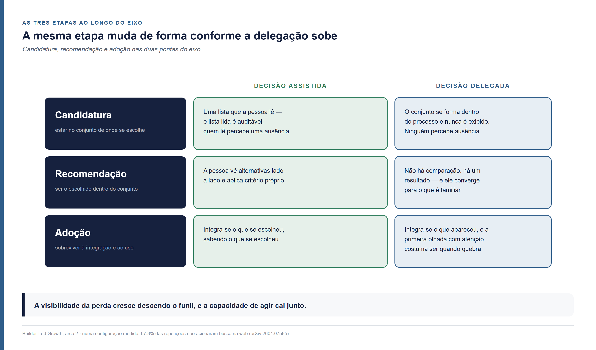
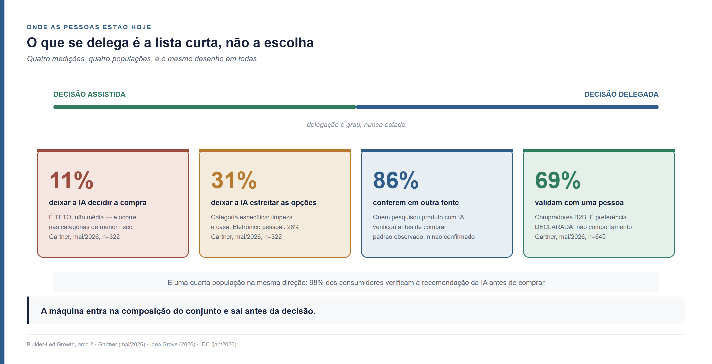
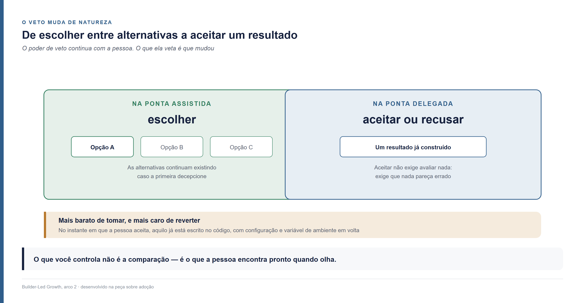
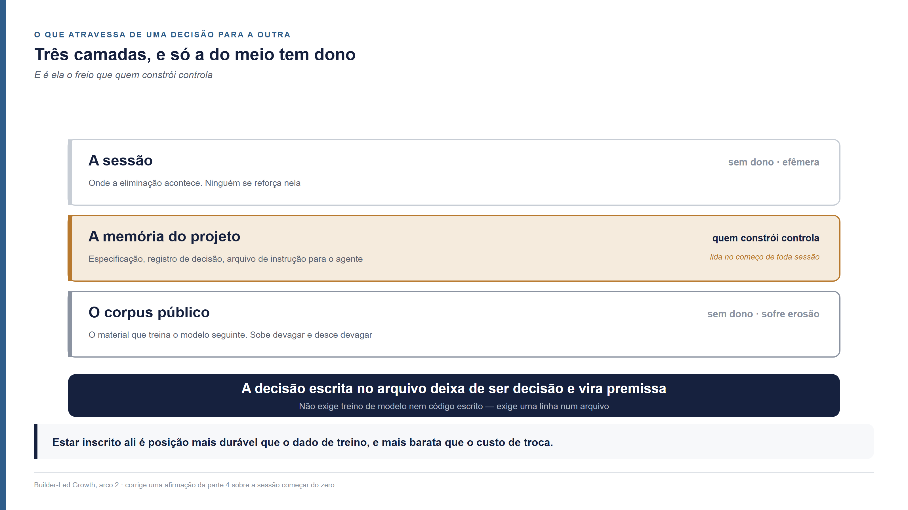

<!--
Arco 2, parte 1 da série Builder-Led Growth, por Matheus Ramos.
VERSÃO NÃO CANÔNICA. A canônica é a inglesa: ../en/arc2-01-the-funnel-and-the-delegation-axis.md
Em caso de divergência de fato ou de número, a inglesa prevalece.
Texto congelado. Prevista no LinkedIn para 27 de agosto de 2026.
Gerado a partir do repositório privado de trabalho. Não editar aqui.
-->

# O funil do Builder-Led Growth — as três etapas e o que acelera a passagem

*Segunda peça do segundo arco desta série. Não exige as anteriores. Aqui o funil do
builder ganha as três etapas que ele precisava ter — candidatura, construção e
adoção — e a explicação de por que a velocidade com que um produto atravessa as
três depende de quanto o par de pessoa e máquina delegou.*

---

## O banco de dados que eu não escolhi

Peço a uma plataforma de construção assistida que monte uma aplicação. Descrevo o
que ela precisa fazer: guardar cadastro de gente, deixar essa gente entrar com
senha, e subir arquivo.

Ela monta. Funciona.

Em algum lugar daquilo há um banco de dados, um serviço de autenticação e um
serviço de armazenamento. Nenhum dos três foi escolhido por mim. Eu não vi lista,
não comparei preço, não li documentação. Três nomes de banco de dados me
ocorreriam se alguém tivesse perguntado — e ninguém perguntou.

O que me interessa não é ter ficado com o banco errado. O que apareceu funciona. O
que me interessa é a velocidade. Aquele produto atravessou o percurso inteiro, de
nome desconhecido a dependência escrita no código, em minutos. Nenhuma reunião,
nenhuma comparação, nenhuma objeção.

E não é impressão minha. O fornecedor de infraestrutura publicou o mecanismo com
todas as letras, em 29 de setembro de 2025: *"todo builder de IA usando a Lovable
já está usando a Supabase, saiba ele disso ou não"*
([Supabase](https://supabase.com/blog/lovable-cloud-launch)). É declaração de
empresa com interesse comercial em enfatizar a própria penetração. Vale ler com
isso em mente. Mas quem escreveu está do lado que enxerga: é o fornecedor, não o
usuário, quem consegue contar decisões que o decisor nunca viu.

Este texto é sobre esse percurso — quais são as etapas dele, e o que faz um produto
andar mais rápido ou mais devagar entre elas.

## Recomendação não é uma etapa do funil

Quando escrevi sobre a decisão, o preço e o que medir, propus candidatura,
recomendação e adoção. Continuei investigando, e uma das três estava classificada
errado.

**Recomendação não é uma etapa. É uma das forças que agem dentro da candidatura.**

A diferença importa e é fácil de verificar. Candidatura e adoção descrevem **onde
o produto está**: dentro do conjunto considerado, dentro do que foi entregue.
Recomendação descreve **o que acontece com ele** ali dentro. Um funil mede posição,
não acontecimento — e enfiar um acontecimento no meio de duas posições foi o que
deixou o modelo escorregadio.

Não é ideia sem precedente. Everett Rogers, ao descrever como uma inovação se
difunde, separa conhecimento, persuasão, **decisão**, **implementação** e
**confirmação** ([revisão da
teoria](https://files.eric.ed.gov/fulltext/ED501453.pdf)). A decisão, nele, é um
momento pontual entre dois estados que duram. É a mesma distinção, feita décadas
antes, para um decisor que ainda era só humano.

As três etapas que sustento daqui em diante:

**Candidatura** — o seu produto está no conjunto de onde se escolhe. Você é
conhecido, encontrável, e ninguém precisou de você ainda.

**Construção** — o seu produto saiu do corpus e entrou no código. Alguém está
montando uma coisa, e você faz parte do que está sendo montado. Ainda dá para
tirar.

**Adoção** — o seu produto virou premissa. Está no que foi entregue ao mercado, e
tirar custa refatoração, migração e risco.

E uma correção que vale para as três, porque foi outro erro meu: **a transição
entre etapas não é um mecanismo só.** É conjunto de ações, do mesmo jeito que se
anda no funil pirata do crescimento liderado por produto — aquisição, ativação,
retenção, receita e indicação — em que ninguém procura o botão que move o usuário
de um estágio para o outro. Nas peças seguintes eu detalho quais ações são essas em
cada etapa; aqui o trabalho é explicar as etapas.

## Candidatura: estar no conjunto de onde se escolhe

A primeira etapa não decide nada. Ela define quem tem direito de ser considerado.

Pense num time que precisa enviar e-mail transacional — aquela mensagem de
"confirme seu cadastro" que sai automaticamente. Existem dezenas de serviços que
fazem isso. Na prática, três ou quatro serão considerados. Os outros não perderam a
comparação: nunca entraram nela.

**É a etapa mais decisiva e a única em que a perda é invisível.** Se você não entra
no conjunto, não existe carrinho abandonado, não existe cadastro incompleto, não
existe reclamação. O projeto seguiu com outra coisa e ninguém registrou nada.

### As forças que agem na candidatura

As táticas de cada uma dessas forças ficam para as próximas peças desta série, que
tratam de candidatura em detalhe. Aqui basta saber quais forças existem:

**Estar no corpus.** O material público que treinou o modelo determina se o seu
nome aparece associado ao problema que ele está resolvendo.

**Ter documentação canônica.** Uma definição do que você faz, escrita uma vez,
consistente em toda parte, que se entende sem contexto.

**A comunidade.** O material que terceiros escrevem sobre você é a matéria-prima de
tudo isso. Tratei desse assunto ao descrever a comunidade como o poço de onde
todos bebem ([Parte 5](05-comunidade-e-sinal-de-validacao.md)).

**AEO e GEO** — otimização para motor de resposta e para motor generativo, o
esforço de ser encontrado e citado corretamente por sistemas que respondem em vez
de listar.

**E a recomendação**, que é a força que faz o produto sair do conjunto e entrar na
construção. Quanto melhor a candidatura, mais rápida e mais precisa ela é.

### Quanto se delega nesta etapa, medido

Quatro medições públicas ajudam aqui. Todas descrevem a mesma situação: **a máquina
monta uma lista curta e a pessoa escolhe.** Nenhuma delas alcança o caso em que a
empresa restringiu o conjunto por política. E nenhuma consegue alcançar o caso em
que ninguém viu conjunto nenhum — sobre esse, quem responderia não tem o que
dizer.

A disposição do consumidor de deixar a IA **tomar** a decisão de compra tem **teto
em 11%** — a palavra é do próprio levantamento, *"topped out at 11%"*, e o teto
ocorre nas categorias de menor risco, como higiene pessoal. Já a disposição de
deixar a IA **estreitar** as opções chega a **31%** em produto de limpeza e casa
([Gartner, 27 de maio de
2026](https://www.gartner.com/en/newsroom/press-releases/2026-05-27-gartner-survey-finds-consumers-want-ai-shopping-help-but-not-ai-purchase-decisions)).
São 322 consumidores nos Estados Unidos, campo em janeiro de 2026, e o comunicado
não publica amostragem nem margem de erro — uso o padrão, não os decimais.

Na compra corporativa de software, **69% dizem preferir validar com um vendedor
humano** as conclusões que a IA gerou ([Gartner, 20 de maio de
2026](https://www.gartner.com/en/newsroom/press-releases/2026-05-20-gartner-survey-finds-sixty-nine-percent-of-b-two-b-buyers-turn-to-sales-reps-to-validate-ai-generated-insights),
645 compradores). A palavra do comunicado é *prefer*: preferência declarada, não
comportamento medido.

E **86%** de quem pesquisou um produto com IA conferiu a recomendação em outra
fonte antes de comprar. Some-se a quarta população, que a peça de abertura deste
arco já trouxe: 98% dos consumidores verificam antes de comprar.

Quatro medições, quatro recortes, o mesmo desenho: **quando existe lista, o que se
delega é montá-la, não escolher dentro dela.**

Uma ressalva vale para os quatro: são autodeclaração, e autodeclaração sobre
trabalho com IA tem um problema documentado. Num experimento aleatorizado com 16
desenvolvedores experientes e 246 tarefas reais dos próprios repositórios, as
pessoas ficaram **19% mais lentas** com a ferramenta. Antes esperavam acelerar 24%.
Depois de medidas como mais lentas, ainda estimavam ter acelerado 20% ([METR, 10 de
julho de 2025](https://metr.org/blog/2025-07-10-early-2025-ai-experienced-os-dev-study/)).
São **vinte pontos entre o medido e o acreditado**, e do lado de dentro a distância
não aparece. Volto a esse estudo no fim, porque ele diz mais uma coisa.

## Construção: estar dentro do que está sendo feito

A segunda etapa começa num ponto material. Vale fixá-lo, porque errar essa
fronteira foi o que me confundiu antes: **a construção começa quando existe a primeira linha
de código que chama o seu produto.**

Antes disso, por menor que seja a lista, você continua candidato. Estar numa lista
curta ainda é estar num conjunto.

Aqui o produto deixa de ser um nome no corpus e passa a ser tecnologia dentro
daquilo que alguém está tentando criar. Um MVP, uma prova de conceito, o teste de
fim de semana de quem faz *vibe coding* — programar descrevendo o que se quer e
aceitando o que a máquina escreve.

E aqui está a característica que define a etapa: **ainda dá para tirar, e tirar é
barato.** Algumas horas de retrabalho, nenhum dado migrado, nenhum usuário
afetado.

### Um exemplo que mostra a decisão inteira

Um sistema precisa de login seguro, com **MFA** — autenticação de múltiplos
fatores, aquela em que a senha sozinha não basta e vem um segundo código.

Existem dois caminhos. Escrever o código, usando as bibliotecas de criptografia que
já existem. Ou adotar uma solução de mercado que resolve isso como serviço.

Os dois funcionam. Os dois são defensáveis. **O que decide qual dos dois acontece é
o grau de delegação.**

Com pouca delegação, alguém pesa: quanto custa manter isso, quem cuida quando
quebrar, que auditoria vamos precisar passar. Com muita delegação, a máquina
resolve com o que ela alcança primeiro — e o que ela alcança primeiro é função do
harness, do que foi pedido, das políticas de segurança e compliance ativas, e dos
laços de revisão que existem ou não existem no caminho.

O par não mudou. O produto não mudou. O que mudou foi quanta decisão passou por uma
pessoa.

### O que ajuda a converter aqui

As táticas também ficam para depois: a construção ganha peça própria mais adiante
nesta série. O que importa agora é que as forças aqui são outras, diferentes das
que agem na candidatura. São quatro:

**Documentação familiar, organizada e legível por máquina.** Não é a mesma coisa que
ter documentação boa para humano: aqui o que conta é ser recuperável, inequívoca, e
suficiente sem contexto.

**Falar a língua de quem opera o portão.** Expressar prontidão nos termos das normas
técnicas que o comprador já usa é o que torna a sua conformidade conferível em vez
de declarada.

**Gestão da informação.** Onde a informação vive, como ela é versionada, e o que
acontece com a versão antiga quando a nova sai.

**A comunidade, de novo** — porque é dela que vem o exemplo funcionando que o
agente encontra quando precisa integrar você.

## Adoção: ter virado premissa

A terceira etapa é onde o produto para de ser uma escolha e vira parte da coisa.

Ele foi para produção. Está no que o builder entregou ao mercado. Existem dados
guardados no formato dele, existem outras partes do sistema que dependem do
comportamento dele, existe gente usando sem saber que ele existe.

**Aqui o custo de remoção deixa de ser algumas horas e passa a ser um projeto.**
Refatoração, migração de dados, risco de quebrar o que funciona, e a pergunta
incômoda de por que trocar algo que está de pé.

É a mesma força que a teoria do trabalho a ser feito chama de **hábito** — a
inércia do que já está instalado, uma das forças que Bob Moesta descreve como
contrárias a qualquer troca. Sob o BLG ela é mais forte do que no software
tradicional, e por um motivo específico: o produto não está apenas no fluxo de
trabalho de alguém, está na obra que essa pessoa entregou e pela qual ela responde.

Daí sai a consequência mais valiosa desta etapa para quem vende. É desconfortável
de escrever:

> **Chegar à adoção cria uma barreira competitiva que não foi conquistada em
> comparação.** O concorrente pode ser melhor e não ser considerado, porque o custo
> de demitir o que está lá é maior que a diferença entre os dois.

### E o veto muda de natureza

Quando a delegação é baixa, o veto é uma escolha entre alternativas visíveis: a
pessoa vê três, prefere uma, e as outras continuam existindo caso a primeira
decepcione.

Quando é alta, não há alternativas na tela. Há um resultado pronto.

> **O veto deixa de ser escolha entre alternativas e vira aceitação ou recusa de um
> resultado já construído** — mais barato de dar, e mais caro de desfazer.

Mais barato porque aceitar não exige avaliar nada: exige que nada pareça errado.
Foi o que eu fiz com o banco de dados. Mais caro de desfazer porque, no instante em
que a pessoa aceita, aquilo já está escrito no código.

## A delegação é o acelerador

Agora a parte que amarra as três etapas. É a tese deste texto.

Delegação é grau, não é interruptor, e as duas pontas desse grau precisam de nome:

> **Decisão assistida por IA: a pessoa escolhe entre opções que a máquina reuniu.
> Decisão delegada: a pessoa aceita ou recusa um resultado que a máquina já
> construiu.**

Procurei nome de mercado antes de cunhar. Comércio conversacional descreve compra
por aplicativo de mensagem, anterior aos modelos de linguagem. Busca sem clique
descreve a ausência do clique. Otimização para motor generativo nomeia o que faz
quem publica. E o Agentic Commerce Protocol, da Stripe e da OpenAI
([openai.com](https://openai.com/index/buy-it-in-chatgpt/)), nomeia o extremo em que
o agente compra sozinho. Nenhum nomeia o caso do meio, que é a máquina mediando com
a decisão humana preservada. Se alguém cunhou equivalente antes de mim, o crédito é
dessa pessoa e eu troco o meu pelo dela.

**Quanto mais o par delega à máquina, mais rápido um produto atravessa o funil.** E
não é só porque a pessoa deixa de escolher. É porque o próprio conjunto de onde se
escolheria fica menor, e concentra no que já é familiar.

Quatro mecanismos independentes empurram nessa direção.

**O primeiro mecanismo é o que mais me surpreendeu. Ele merece uma explicação com
calma.**

Antes de o agente escolher qualquer coisa, alguma peça do sistema precisa decidir o
que ele vai sequer enxergar. Existem centenas ou milhares de ferramentas
disponíveis, e todas não cabem — nem na janela de contexto do modelo, nem no tempo
que a resposta tem para acontecer. Quem faz essa triagem é um componente chamado
**recuperador**: dada a tarefa, ele devolve os candidatos mais parecidos com o
pedido. Só esses chegam ao modelo. Os outros não existem naquela decisão.

Quantos candidatos ele devolve é um número com nome próprio: profundidade.
Num trabalho que mede qual seria a profundidade certa, **sobre exatamente os mesmos
dados de bancada, a profundidade aprendida foi de 1,4 candidatos com um tipo de
recuperador e 7,4 com outro** ([arXiv
2605.24660](https://arxiv.org/abs/2605.24660)).

Traduzindo para o que isso significa do lado de fora: um time de engenharia troca o
componente de busca — decisão técnica, tomada por motivos técnicos, sem ninguém na
sala discutindo fornecedores — e o número de produtos que chegam a ser considerados
sai de cerca de um para cerca de sete. **Nada mudou no seu produto, no seu mercado,
nem na pergunta que a pessoa fez.** Mudou quantas cadeiras havia na sala.

Se você é o quarto candidato mais relevante para aquele problema, existe uma
configuração em que você é considerado e outra em que você não chega a aparecer — e
as duas são defensáveis do ponto de vista de quem montou o sistema. Ninguém decidiu
te excluir.

Os autores declaram o limite do trabalho: o escopo é se a ferramenta certa aparece
no conjunto, não se ela é usada corretamente depois.

**O segundo é a degradação por tamanho de catálogo.** Com cerca de 50 ferramentas
disponíveis, a acurácia de selecionar a certa fica entre 84% e 95%. Com 200, cai
para uma faixa entre 41% e 83%. Com 740, fica entre 0% e 20% na maioria dos modelos
([BiasBusters, arXiv 2510.00307](https://arxiv.org/html/2510.00307)). Quanto mais
opções existem, menos a máquina consegue escolher entre elas — e o que sobra é o
que ela já conhecia.

**O terceiro é a ordem.** No mesmo trabalho, ferramenta no meio de uma lista longa é
selecionada corretamente em 22% a 52% dos casos, e a ordem sozinha move o desempenho
entre 13% e 85%. Vale dizer que são resultados de laboratório, com catálogos
sintéticos, e que a leitura de que isso se transfere para uso real é minha.

**O quarto é a busca que não acontece.** Numa configuração medida, **57,8% das
repetições não acionaram busca na web** (Schulte, Bleeker e Kaufmann, [arXiv
2604.07585](https://arxiv.org/pdf/2604.07585), 10 de abril de 2026 — número obtido
via citação em revisão crítica, não da tabela primária). Sem busca, o conjunto vem
inteiro do que o modelo já traz de fábrica.

Some tudo e o resultado é medível no comportamento: num trabalho com oito modelos,
bibliotecas populares aparecem desnecessariamente em até **48%** dos casos, e Python
é escolhido em **58%** inclusive onde é subótimo. A conclusão dos autores, com as
palavras deles: *"LLMs may prioritise familiarity and popularity over suitability"*
([Twist, Zhang, Harman, Syme, Noppen, Yannakoudakis e Nauck, Findings of ACL 2026,
arXiv 2503.17181](https://arxiv.org/abs/2503.17181)).

> **A delegação não só tira a escolha da pessoa. Ela encolhe o conjunto de onde a
> escolha sairia.**

Para quem já é padrão de categoria, isso é aceleração pura: o funil inteiro passa a
ser percorrido em minutos, sem comparação e sem objeção. Para quem disputa o segundo
lugar, é o contrário — não é escolhido, e também não é comparado, que é como se
melhora numa disputa.

### Duas velocidades que não se pode confundir

Aqui preciso desmontar uma conclusão fácil e errada, porque ela seria confortável
demais para quem vende.

Delegação acelera o funil **do fornecedor**. Não existe evidência de que ela acelere
o trabalho **de quem constrói**.

Volto ao experimento aleatorizado que citei acima: os desenvolvedores ficaram 19%
mais lentos com a ferramenta e acreditavam ter acelerado 20%. Os autores são
explícitos ao dizer que o resultado não se estende além daquele grupo e daqueles
repositórios, e na atualização de 24 de fevereiro de 2026, com 57 participantes, os
intervalos de confiança cruzam o zero
([METR](https://metr.org/blog/2026-02-24-uplift-update/)).

São duas contas diferentes. Seu produto pode estar atravessando o funil mais rápido
do que nunca, dentro de projetos que estão andando mais devagar do que os donos
imaginam.

E daí sai a pergunta que eu deixo para quem constrói produto: se a delegação baixa
torna a passagem mais lenta, **quão melhor a experiência precisa ser para o par
avançar mesmo assim?** Não sei responder, e desconfio que a resposta seja diferente
em cada etapa.

## O que atravessa de uma decisão para a outra

Preciso corrigir uma frase minha antes de fechar.

Ao tratar de acessibilidade operacional, escrevi que a máquina decide de novo a cada
sessão e não acumula nada entre uma e outra — que cada sessão começa do zero. **A
parte sobre a máquina é verdadeira. A parte sobre o par não é**, e é o par que
decide. Continuei investigando e vi que aquilo vale para uma camada só — a camada errada
para quem quer entender este assunto.

São três camadas. Eu vinha operando com duas.

A **sessão** é onde a eliminação acontece. Efêmera, sem dono, e ninguém se reforça
nela.

O **corpus público** — o material que treina o modelo seguinte — acumula devagar,
não tem dono, e sofre erosão.

A do meio é a que faltava. É a única com dono: a **memória do projeto**.
Especificação, registro de decisão, arquivo de instrução para o agente. Quem
constrói controla essa camada inteira. Ela é lida no começo de toda sessão.

Daí sai um mecanismo de hábito que eu não tinha. Escreva "usamos este banco de
dados, e por este motivo" no arquivo de memória do projeto, e **essa decisão passa a
ser relida em toda sessão seguinte. Ela deixa de ser decisão e vira premissa.** É o
hábito mais barato de instalar e o mais difícil de deslocar: não exige treino de
modelo nem código escrito, exige uma linha num arquivo.

Repare no que isso faz com a velocidade: **a memória do projeto é o freio que a
pessoa controla.** Escrever a escolha é reintroduzir uma decisão humana no caminho,
sem depender de comitê nem de política de empresa.

Para quem vende, abre uma posição que a série ainda não tinha nomeado: **estar
inscrito no artefato de memória do cliente é posição mais durável que estar no dado
de treino, que se atualiza, e mais barata que o custo de troca, que exige o código
já existir.** A linha ética é clara: você escreve a documentação, quem decide
referenciá-la é o cliente.

## O que fica

O funil do builder tem três etapas. Elas descrevem onde o produto está, não o que
acontece com ele. **Candidatura**: você está no conjunto de onde se escolhe.
**Construção**: você está no código de algo que está sendo feito, e tirar custa
horas. **Adoção**: você virou premissa do que foi entregue, e tirar custa um
projeto.

Recomendação continua existindo, e continua importando — mas como uma das forças que
agem dentro da candidatura, ao lado do corpus, da documentação canônica, da
comunidade e da otimização para os motores que respondem.

E a velocidade da passagem é função da delegação. Quanto mais o par delega, menor
fica o conjunto considerado, mais concentrado no familiar, e mais rápido um produto
percorre as três etapas — sem que ninguém tenha comparado nada. É por isso que essa
conta importa para quem constrói e para quem vende. Acho que as empresas ainda
não estão olhando para ela.

As peças seguintes entram etapa por etapa: o que medir em cada uma, e que ações
convertem para a próxima.

Fecho com o que não sei.

Ninguém publica quantas decisões de fornecedor o agente tomou sozinho. Procurei em
levantamento de desenvolvedor, em relatório de plataforma e por formulação livre.
Nenhum pergunta a quem constrói quem escolheu a biblioteca, o serviço ou o banco na
última vez — a pessoa ou o agente.

E não é falha de busca. Uma das plataformas construiu a taxonomia que responderia
isso, separando o trabalho iniciado por código, por um agente e por vários agentes,
na própria interface de métricas, desde 29 de maio de 2026. O agregado não é
publicado.

**Existe quem consiga medir, e não publica.** Se você trabalha num lugar assim, esse
número é o dado mais importante que este arco poderia citar — e a conversa que eu
mais gostaria de ter depois deste texto.

---

**Série Builder-Led Growth**, por Matheus Ramos. Segundo arco:

- [Arco 2, parte 0: Do PLG ao BLG — o que continua valendo quando quem escolhe é um par](arco2-00-do-plg-ao-blg.md)
- Arco 2, parte 1: O funil do Builder-Led Growth — as três etapas e o que acelera a passagem (este texto)

O primeiro arco, para quem quiser o percurso completo:

- [Parte 1 — Quando a máquina também é seu cliente](01-quando-a-maquina-e-cliente.md)
- [Parte 2 — A decisão, o preço e o que medir](02-decisao-preco-e-medicao.md)
- [Parte 3 — O imposto que a máquina cobra e o humano não vê](03-legibilidade-por-maquina.md)
- [Parte 4 — Quantas vezes o agente precisa chamar um humano](04-acessibilidade-operacional.md)
- [Parte 5 — O poço de onde todos bebem](05-comunidade-e-sinal-de-validacao.md)
- [Parte 6 — A máquina é imprensa e leitor ao mesmo tempo](06-relacoes-publicas.md)
- [Parte 7 — O que faz o agente confiar, e por que a competência dele é o problema](07-confianca-e-seguranca.md)
