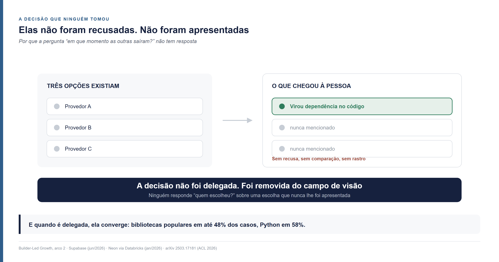

<!--
Arco 2, parte 1 da série Builder-Led Growth, por Matheus Ramos.
VERSÃO NÃO CANÔNICA. A canônica é a inglesa: ../en/arc2-01-the-funnel-and-the-delegation-axis.md
Em caso de divergência de fato ou de número, a inglesa prevalece.
Texto congelado. Data no LinkedIn ainda não definida.
Gerado a partir do repositório privado de trabalho. Não editar aqui.
-->

# Não é quem decide. É quanto foi delegado

*Segunda peça do segundo arco desta série. Não exige as anteriores. A peça
de abertura estabeleceu que quem escolhe é um par de pessoa e máquina. Esta trata
do funil — o que é, por que ele sobrevive quando quem seleciona é a máquina, e o
que acontece em cada etapa dele conforme mais coisa vai sendo delegada.*

---

## O banco de dados que eu não escolhi

Peço a uma plataforma de construção assistida que monte uma aplicação. Descrevo o
que ela precisa fazer: guardar cadastro de gente, deixar essa gente entrar com
senha, e subir arquivo.

Ela monta. Funciona.

Em algum lugar daquilo há um banco de dados, um serviço de autenticação e um
serviço de armazenamento. Nenhum dos três foi escolhido por mim. Eu não vi lista,
não comparei preço, não li documentação. Três nomes de banco de dados me
ocorreriam se alguém tivesse perguntado — e ninguém perguntou.

O que me interessa aqui não é ter ficado com o banco errado. O que apareceu
funciona. O que me interessa é que **eu tinha poder de veto e não o exerci**, e
não por distração: exercer veto exige saber que existe algo a vetar.

E não é impressão minha. O fornecedor de infraestrutura publicou o mecanismo com
todas as letras, em 29 de setembro de 2025: *"todo builder de IA usando a Lovable
já está usando a Supabase, saiba ele disso ou não"*
([Supabase](https://supabase.com/blog/lovable-cloud-launch)). É declaração de
empresa com interesse comercial em enfatizar a própria penetração, e vale ler com
isso em mente. Mas quem escreveu está do lado que enxerga: é o fornecedor, não o
usuário, quem consegue contar decisões que o decisor nunca viu.

A pergunta prática que organiza o texto inteiro é esta: **onde, no percurso, essa
escolha foi feita?**

## O que eu achava, e onde isso não se sustentou

Comecei este arco com uma posição, nascida de uma correção que fiz num rascunho
anterior. Dizer que a máquina escolhe é falso, porque o humano escolhe
tanto quanto. Fora desta teoria isso é evidente — alguém escolhendo pão na padaria
não delegou nada. E dentro dela também: decidir qual problema atacar, qual avanço
perseguir, e então pedir ajuda à máquina é decisão humana do começo ao fim.

Continuei investigando, e a posição se sustentou pela metade.

**Onde ela se sustenta:** sempre que existe uma escolha à vista, o humano continua
escolhendo. Todos os levantamentos que encontrei confirmam isso, e alguns deles
aparecem mais abaixo.

**Onde ela não se sustenta:** quando a escolha nunca chega a existir para a
pessoa. No caso do banco de dados, não houve delegação — houve ausência. Eu não
transferi uma decisão para a máquina; a decisão simplesmente não passou por mim.
Dizer que eu escolhi tanto quanto ela seria falso.

É por isso que a formulação certa não é sobre quem decide, e sim sobre **quanto foi
delegado**. Delegação é grau, e o grau tem duas pontas que precisam de nome:

> **Decisão assistida por IA: a pessoa escolhe entre opções que a máquina reuniu.
> Decisão delegada: a pessoa aceita ou recusa um resultado que a máquina já
> construiu.**

Procurei nome de mercado antes de cunhar. **Comércio conversacional** foi cunhado
por [Chris Messina](https://www.linkedin.com/in/factoryjoe/) em 2015 e descreve
compra por aplicativo de mensagem. **Busca sem clique** foi quantificada em escala
por [Rand Fishkin](https://www.linkedin.com/in/randfishkin/) a partir de 13 de
agosto de 2019 e descreve a ausência do clique. **Otimização para motor
generativo** foi cunhada em 16 de novembro de 2023
([arXiv 2311.09735](https://arxiv.org/abs/2311.09735)) e nomeia o que faz quem
publica. E o **Agentic Commerce Protocol**, da Stripe e da OpenAI, de setembro de
2025 ([openai.com](https://openai.com/index/buy-it-in-chatgpt/)), nomeia o extremo
em que o agente compra sozinho. Nenhum nomeia o caso comum, que é a máquina no
meio com a decisão humana preservada. Se alguém cunhou equivalente antes de mim, o
crédito é dessa pessoa e eu troco o meu pelo dela.

Vale uma cerca antes de seguir. Uma organização decidindo passar a desenvolver com
IA é uma troca grande, com comitê e orçamento. O par já formado escolhendo qual
ferramenta usar no meio da construção é outra. Este texto trata da segunda.

## O funil, com calma

Agora o assunto principal.

Um funil é uma figura simples: muita coisa entra em cima, pouca sai embaixo, e a
cada etapa o conjunto encolhe. Ele não explica por que alguém desistiu. Ele diz
**onde** procurar.

Um exemplo fora de software deixa isso claro. Uma loja recebe mil visitantes por
mês, cem experimentam alguma peça, e vinte compram. O funil não diz se o problema
é o preço, o provador ou o atendimento. Diz que a queda maior está entre entrar e
experimentar, e que é ali que se investiga primeiro. É um instrumento de
localização, não de diagnóstico.

A figura vem da publicidade do começo do século XX, e a paternidade é disputada:
as etapas costumam ser creditadas a Elias St. Elmo Lewis, em 1898, parte da
literatura atribui a formulação completa a Arthur Frederick Sheldon, e a sigla AIDA
só aparece em 1921, com C. P. Russell ([E. St. Elmo
Lewis](https://en.wikipedia.org/wiki/E._St._Elmo_Lewis)).

### Por que ainda um funil, e não a roda

Há um debate corrente sobre substituir o funil pelo *flywheel*, a roda que gira e
ganha momento a cada volta. O argumento contra o funil é razoável: o comprador
humano não anda em linha reta. Ele volta, revisita, pergunta a um colega, some por
três semanas e reaparece. Uma compra corporativa envolve dez ou mais pessoas
entrando em momentos diferentes. Um funil desenhado como escada não descreve isso.
A leitura dominante hoje é de complementaridade — funil para aquisição e previsão,
roda para retenção. Os números que circulam nesse debate vêm de material de
agência, sem metodologia publicada, e eu os trato como o clima da discussão.

**Quando quem seleciona é a máquina, a objeção principal ao funil perde força**, e
o motivo é concreto: dentro de uma sessão de trabalho, a eliminação é irreversível.

Volte ao banco de dados. No instante em que ele foi escolhido, o código passou a
chamá-lo. Existe uma string de conexão, existem tabelas com o formato dele, existe
uma biblioteca cliente instalada. O concorrente não é "revisitado mais tarde" — ele
sai, e sai na mesma sessão em que entrou. Não há comitê que reabra. Não há segunda
reunião. Perde-se opção, e não se recupera de graça.

Isso é exatamente o comportamento que um funil descreve: conjunto que só encolhe,
nunca cresce, e cada etapa é uma peneira.

**E a roda volta por cima, num plano diferente.** Aquela escolha vira código
público, resposta em fórum, tutorial, dado de treino. Isso alimenta a próxima
seleção, feita por outro agente, em outra empresa, meses depois.

> **Funil dentro da sessão, flywheel entre sessões.**

As duas figuras descrevem planos diferentes do mesmo fenômeno, e a briga entre elas
se dissolve quando se diz de qual plano se fala. Com uma correção à roda: roda que
perde energia para de girar, não gira ao contrário. O que se acumula entre sessões
também evapora — foi o que descrevi ao tratar de comunidade como lençol freático,
que sobe com o que se deposita e desce com o que se extrai. Quando o decaimento
importa, é essa a figura que uso.

### As três etapas, e o que cada uma quer dizer

Este funil tem três etapas. Elas foram nomeadas quando tratei de decisão, preço e
medição, e aqui ganham a explicação que faltava, com exemplo em cada uma.

## Candidatura: estar no conjunto de onde se escolhe

A primeira etapa não decide nada. Ela define quem tem direito de ser considerado.

Pense num time que precisa enviar e-mail transacional — aquela mensagem de "confirme
seu cadastro" que sai automaticamente. Existem dezenas de serviços que fazem isso.
Na prática, o time vai considerar três ou quatro. Os outros não perderam a
comparação. Eles nunca entraram nela.

Estar no conjunto depende de coisas que não têm nada a ver com ser bom: o modelo já
ter visto o seu nome associado àquele problema, existir documentação que se entende
sem contexto, o nome do produto não colidir com outra coisa, e — quando há
governança — estar na lista de ferramentas aprovadas da empresa.

**É a etapa mais decisiva e a única em que a perda é invisível.** Se o seu produto
não entra no conjunto, não existe carrinho abandonado, não existe cadastro
incompleto, não existe reclamação. O projeto seguiu com outra coisa e ninguém
registrou nada.

### O que se delega aqui, medido

Esta é a etapa que as pessoas mais entregam à máquina, e há três levantamentos
independentes, em três populações, apontando o mesmo desenho.

A disposição do consumidor de deixar a IA **tomar** a decisão de compra tem **teto
em 11%** — a palavra é do próprio levantamento, *"topped out at 11%"*, e o teto
ocorre nas categorias de menor risco, como higiene pessoal. Já a disposição de
deixar a IA **estreitar** as opções chega a **31%** em produto de limpeza e casa
([Gartner, 27 de maio de
2026](https://www.gartner.com/en/newsroom/press-releases/2026-05-27-gartner-survey-finds-consumers-want-ai-shopping-help-but-not-ai-purchase-decisions)).
São 322 consumidores nos Estados Unidos, campo em janeiro de 2026, e o comunicado
não publica amostragem nem margem de erro — uso o padrão, não os decimais.

Na compra corporativa de software, **69% dizem preferir validar com um vendedor
humano** as conclusões que a IA gerou ([Gartner, 20 de maio de
2026](https://www.gartner.com/en/newsroom/press-releases/2026-05-20-gartner-survey-finds-sixty-nine-percent-of-b-two-b-buyers-turn-to-sales-reps-to-validate-ai-generated-insights),
645 compradores). A palavra do comunicado é *prefer*: preferência declarada, não
comportamento medido.

E **86%** de quem pesquisou um produto com IA conferiu a recomendação em outra fonte
antes de comprar. Some-se a quarta população, que a peça de abertura deste arco já
trouxe: 98% dos consumidores verificam antes de comprar.

Quatro medições, quatro recortes, o mesmo desenho: **o que se delega hoje é a
formação da lista curta, não a escolha.** A máquina monta o conjunto e sai antes da
decisão. Uma casa de análise descreveu isso como estreitar o campo antes que a
avaliação humana comece ([IDC, 28 de janeiro de
2026](https://www.idc.com/resource-center/blog/ai-mediated-buying-journeys-how-buyers-decide-whos-worth-their-time/)).

Antes de usar esses números para qualquer coisa, uma ressalva que vale para todos
eles: são autodeclaração, e autodeclaração sobre trabalho com IA tem um problema
documentado. Num experimento aleatorizado com 16 desenvolvedores experientes e 246
tarefas reais dos próprios repositórios, as pessoas ficaram **19% mais lentas** com
a ferramenta. Antes esperavam acelerar 24%. Depois de medidas como mais lentas,
ainda estimavam ter acelerado 20% ([METR, 10 de julho de
2025](https://metr.org/blog/2025-07-10-early-2025-ai-experienced-os-dev-study/)).
São **vinte pontos de distância entre o medido e o acreditado**, e do lado de
dentro a distância não aparece. Os autores são explícitos ao dizer que o resultado
não se estende além daquele grupo, e na atualização de 24 de fevereiro de 2026, com
57 participantes, os intervalos de confiança cruzam o zero
([METR](https://metr.org/blog/2026-02-24-uplift-update/)).

Uso os quatro levantamentos pelo formato comum entre eles, e não pelo valor de
nenhum.

### A candidatura muda de forma conforme a delegação sobe

Na ponta assistida, o conjunto é uma **lista que alguém lê**. Lista lida é
auditável: quem conhece o mercado percebe quando um nome esperado não está ali, e
pergunta.

Na ponta delegada, o conjunto se forma dentro do processo e nunca é exibido.
Ninguém percebe ausência nenhuma, porque não há nada para perceber. Foi o que
aconteceu com o meu banco de dados.

Um mecanismo ajuda a explicar por que o conjunto se fecha tão cedo. Numa
configuração medida, **57,8% das repetições não acionaram busca na web** (Schulte,
Bleeker e Kaufmann, [arXiv 2604.07585](https://arxiv.org/pdf/2604.07585), 10 de
abril de 2026 — número obtido via citação em revisão crítica, não da tabela
primária). Sem busca, o conjunto de candidatos vem inteiro do que o modelo já traz
de fábrica. A curadoria aconteceu antes de a sessão começar, e por isso não há
momento de curadoria a observar.

## Recomendação: ser o escolhido dentro do conjunto

A segunda etapa é a que todo mundo imagina quando pensa em decisão. Três opções na
mesa, critérios, uma vencedora.

Na ponta assistida é isso mesmo. A pessoa vê as alternativas lado a lado, pesa
preço, maturidade, quem já usa, e escolhe. Ela pode escolher pelo motivo errado,
mas escolheu.

Na ponta delegada não há comparação. Há um resultado.

E quando não há comparação, a escolha não se espalha pelas opções disponíveis —
ela **converge**. Num trabalho com oito modelos, bibliotecas populares aparecem
desnecessariamente em até **48%** dos casos, Python é escolhido em **58%** inclusive
onde é subótimo, e Rust não é usado uma única vez em cenário de alto desempenho. A
conclusão dos autores, com as palavras deles: *"LLMs may prioritise familiarity and
popularity over suitability"* ([Twist, Zhang, Harman, Syme, Noppen, Yannakoudakis e
Nauck, Findings of ACL 2026, arXiv 2503.17181](https://arxiv.org/abs/2503.17181)).

Traduzindo para quem vende: **quem já é padrão de categoria ganha com a delegação.
Quem disputa o segundo lugar perde duas vezes** — não é escolhido, e também não é
comparado, que é como se melhora numa disputa. Aviso que essa última leitura é
minha e não foi testada.

### A decisão que ninguém tomou

Aqui volto ao banco de dados, porque é nesta etapa que ele se explica.

Eu suspeitava que a delegação estivesse crescendo entre quem constrói com IA. Antes
de procurar, escrevi o que derrubaria a suspeita, porque pesquisa que só volta com
o que a gente já achava tem problema na pergunta. Três critérios: proporção estável
no tempo, aumento só em execução, ou população que delega muito encolhendo.

Dois dos três aconteceram. A suspeita caiu.

A única série pública que chega perto de medir entrega de tarefa inteira não sobe:
27,8% no campo de dezembro de 2024 a janeiro de 2025, 27% no seguinte, 39% em agosto
de 2025, 32% em novembro, e deixou de ser publicada nas duas edições seguintes
([Anthropic Economic
Index](https://www.anthropic.com/research/anthropic-economic-index-january-2026-report)).
Não trato como série: a edição de 15 de janeiro de 2026 declara troca de
classificador no meio, e a medição é do próprio fornecedor sobre o próprio produto.

O escrutínio, esse, **aumenta** com experiência. A taxa de interrupção sobe de 5%
para 9% dos turnos entre usuários de alta permanência ([Anthropic, 24 de março de
2026](https://www.anthropic.com/research/economic-index-march-2026-report)). E os
agentes são conservadores justamente onde a decisão de fornecedor mora: em 26.760
pedidos de alteração autorados por agente, **apenas 1,3% introduzem dependência
nova**, e os que importam alguma biblioteca são incorporados a taxas de 6% a 11%
menores ([Twist e Zhang, King's College London, arXiv
2512.11589](https://arxiv.org/html/2512.11589)). Ou seja: quando há biblioteca em
jogo, o humano olha mais, não menos.

Há até contra-evidência de quem nomeou o fenômeno. [Andrej
Karpathy](https://www.linkedin.com/in/andrej-karpathy-9a650716/) cunhou *vibe
coding* — programar descrevendo o que se quer e aceitando o que a máquina escreve,
sem ler as alterações — em 2 de fevereiro de 2025. Em 4 de fevereiro de 2026
aposentou o termo e propôs *agentic engineering* no lugar, escrevendo que programar
por meio de agentes vira fluxo padrão do profissional *"except with more oversight
and scrutiny"* ([registro datado por Simon
Willison](https://simonwillison.net/2026/Feb/26/andrej-karpathy/)).

Nada disso captura o meu banco de dados.

Em 4 de junho de 2026, [Paul
Copplestone](https://www.linkedin.com/in/paulcopplestone/), cofundador e
presidente-executivo da Supabase, declarou: *"agents are now deploying the majority
of databases on our platform"*, sobre uma base declarada de mais de 250 mil clientes
([release
oficial](https://www.prnewswire.com/news-releases/supabase-raises-500m-at-10-5b-to-accelerate-lead-in-agentic-infrastructure-302791787.html)).
A Neon aparece com número vizinho em relatório da Databricks de 27 de janeiro de
2026: agentes criam **80% de todos os bancos e 97% das ramificações**
([Databricks](https://www.databricks.com/blog/enterprise-ai-agent-trends-top-use-cases-governance-evaluations-and-more)).

Escolher banco de dados é decisão de arquitetura e de fornecedor. Não é execução.

Por que essas decisões não aparecem em nenhuma pesquisa de opinião? Porque a
pergunta não faz sentido para quem responde:

> **A decisão não foi delegada. Foi removida do campo de visão.**

Ninguém responde "quem escolheu o banco?" sobre uma escolha que nunca lhe foi
apresentada. Os outros bancos que me ocorreriam não saíram em nenhum momento. Eles
nunca entraram.

## Adoção: sobreviver à integração e ao uso

A terceira etapa é onde a maioria das análises para de olhar, e é onde o dinheiro
some.

Ser escolhido não é ficar. A integração pode falhar, o custo pode surpreender, o
comportamento pode não ser o que a documentação prometia. Na ponta assistida, quem
integra sabe o que escolheu e por quê, então tem paciência com o que dá errado — a
escolha é dele.

Na ponta delegada, integra-se o que apareceu. E a primeira vez que alguém olha
aquilo com atenção costuma ser quando quebra.

Um exemplo de rotina: o serviço de e-mail transacional entrou sem discussão,
funcionou por semanas, e um dia as mensagens começam a cair em caixa de spam.
Alguém abre o código para entender, descobre um serviço que não escolheu, e a
primeira pergunta não é técnica — é "por que estamos usando isto?". A troca que vem
depois não passa por nenhum critério que a máquina tenha avaliado.

### O veto muda de natureza

Aqui está a mudança com mais consequência prática do texto inteiro.

Na ponta assistida, o veto é uma escolha entre alternativas visíveis. A pessoa vê
três, prefere uma, e as outras duas continuam existindo caso a primeira decepcione.

Na ponta delegada, não há alternativas na tela. Há um resultado pronto.

> **O veto deixa de ser escolha entre alternativas e vira aceitação ou recusa de um
> resultado já construído** — mais barato de tomar, e mais caro de reverter.

Mais barato porque aceitar não exige avaliar nada: exige que nada pareça errado.
Foi o que eu fiz com o banco de dados. Mais caro de reverter porque, no instante em
que a pessoa aceita, aquilo já está escrito no código, com configuração, variáveis
de ambiente e tabelas em volta.

Para quem constrói produto, a consequência é direta: **você não controla a
comparação. Você controla o que a pessoa encontra pronto quando finalmente olha.**

### E uma assimetria que atravessa as três etapas

Quanto mais fundo no funil, mais visível fica a perda — e menos se pode fazer a
respeito.

Se o produto é descartado na adoção, existe rastro: alguém trocou, alguém
reclamou, alguém abriu uma issue. Se ele nem entra na candidatura, não existe
rastro nenhum. E é justamente na candidatura que ainda daria para agir.

Não conheço medição dessa assimetria, e aviso que a leitura é minha. Ela é a razão
pela qual a primeira etapa merece mais investimento do que costuma receber.

## O que atravessa de uma sessão para a outra

Preciso corrigir uma frase minha antes de fechar.

Ao tratar de acessibilidade operacional, escrevi que a máquina decide de novo a
cada sessão e não acumula nada entre uma e outra — que cada sessão começa do zero.
**A parte sobre a máquina é verdadeira. A parte sobre o par não é**, e é o par que
decide. Continuei investigando e vi que aquilo vale para uma camada só, e é a
camada errada para quem quer entender este assunto.

São três camadas, e eu vinha operando com duas.

A **sessão** é onde a eliminação acontece. Efêmera, sem dono, e ninguém se reforça
nela.

O **corpus público** — o material que treina o modelo seguinte — acumula devagar,
não tem dono, e sofre erosão.

A do meio é a que faltava, e é a única com dono: a **memória do projeto**.
Especificação, registro de decisão, arquivo de instrução para o agente. Quem
constrói controla essa camada inteira, e ela é lida no começo de toda sessão.

Daí sai um mecanismo de hábito que eu não tinha. Escreva "usamos este banco de
dados, e por este motivo" no arquivo de memória do projeto, e **essa decisão passa
a ser relida em toda sessão seguinte. Ela deixa de ser decisão e vira premissa.** É
o hábito mais barato de instalar e o mais difícil de deslocar: não exige treino de
modelo nem código escrito, exige uma linha num arquivo.

Para quem vende, isso abre uma posição que a série ainda não tinha nomeado: **estar
inscrito no artefato de memória do cliente é posição mais durável que estar no dado
de treino, que se atualiza, e mais barata que o custo de troca, que exige o código
já existir.** A linha ética é clara: você escreve a documentação, quem decide
referenciá-la é o cliente.

E isso obriga um ajuste na formulação do funil: **ele opera no nível da decisão,
não no da sessão.** Nem toda decisão tem o mesmo tamanho. Algumas são locais à
tarefa e serão redecididas amanhã; outras são registradas e viram premissa. As que
importam são as registradas, porque essas pararam de ser decididas.

## O que fica

O funil continua servindo, no nível da decisão. Candidatura define quem é
considerado, recomendação define quem vence, adoção define quem fica — e a
candidatura é a etapa mais decisiva e a única sem rastro de perda.

Conforme a delegação sobe, as três mudam de forma. O conjunto para de ser exibido,
a comparação some, e o veto vira aceitação de um resultado pronto.

E existe uma classe inteira de decisão que nenhuma medição de opinião captura,
porque ela não foi delegada — foi removida do campo de visão. O banco de dados que
eu não escolhi é um caso dela, e o fornecedor publicou o mecanismo.

As peças seguintes descem etapa por etapa: duas sobre candidatura, uma sobre como
se entra no conjunto e outra sobre como se é cortado dele antes de qualquer
preferência; uma sobre o que decide a escolha e o que dessas táticas decai; uma
sobre adoção e o veto; e uma de fechamento, sobre onde o seu produto se encaixa e
quem cuida disso dentro da empresa.

Fecho com o que não sei.

Ninguém publica quantas decisões de fornecedor o agente tomou sozinho. Procurei em
levantamento de desenvolvedor, em relatório de plataforma e por formulação livre.
Nenhum pergunta a quem constrói quem escolheu a biblioteca, o serviço ou o banco na
última vez — a pessoa ou o agente.

E não é falha de busca. Uma das plataformas construiu a taxonomia que responderia
isso, separando o trabalho iniciado por código, por um agente e por vários agentes,
na própria interface de métricas, desde 29 de maio de 2026. O agregado não é
publicado.

**Existe quem consiga medir, e não publica.** Se você trabalha num lugar assim,
esse número é o dado mais importante que este arco poderia citar — e a conversa que
eu mais gostaria de ter depois deste texto.

---

**Série Builder-Led Growth**, por Matheus Ramos. Segundo arco:

- [Arco 2, parte 0 — Do PLG ao BLG: o que continua valendo quando quem escolhe é um par](arco2-00-do-plg-ao-blg.md)
- Arco 2, parte 1 — Não é quem decide. É quanto foi delegado (este texto)

O primeiro arco, para quem quiser o percurso completo:

- [Parte 1 — Quando a máquina também é seu cliente](01-quando-a-maquina-e-cliente.md)
- [Parte 2 — A decisão, o preço e o que medir](02-decisao-preco-e-medicao.md)
- [Parte 3 — O imposto que a máquina cobra e o humano não vê](03-legibilidade-por-maquina.md)
- [Parte 4 — Quantas vezes o agente precisa chamar um humano](04-acessibilidade-operacional.md)
- [Parte 5 — O poço de onde todos bebem](05-comunidade-e-sinal-de-validacao.md)
- [Parte 6 — A máquina é imprensa e leitor ao mesmo tempo](06-relacoes-publicas.md)
- [Parte 7 — O que faz o agente confiar, e por que a competência dele é o problema](07-confianca-e-seguranca.md)
