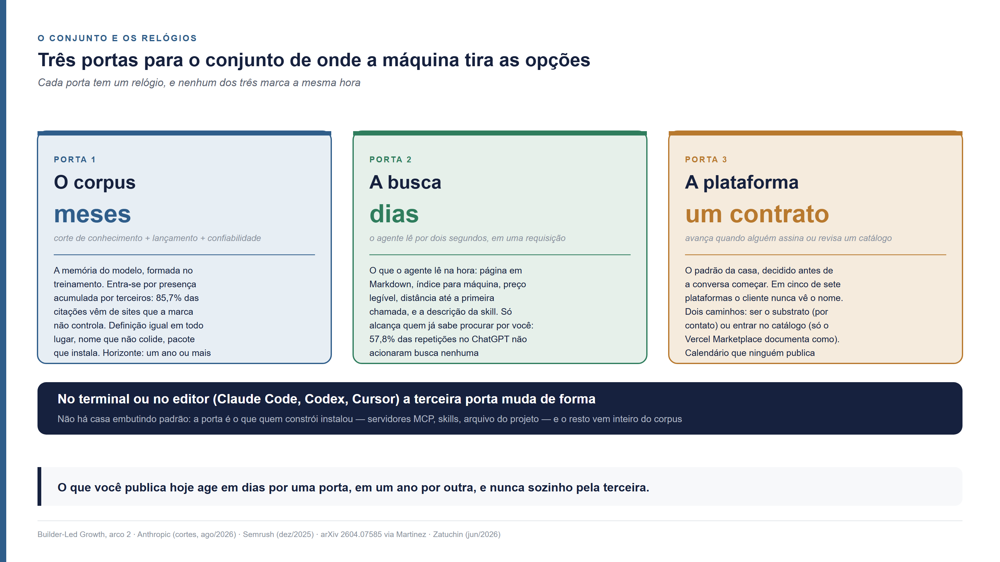
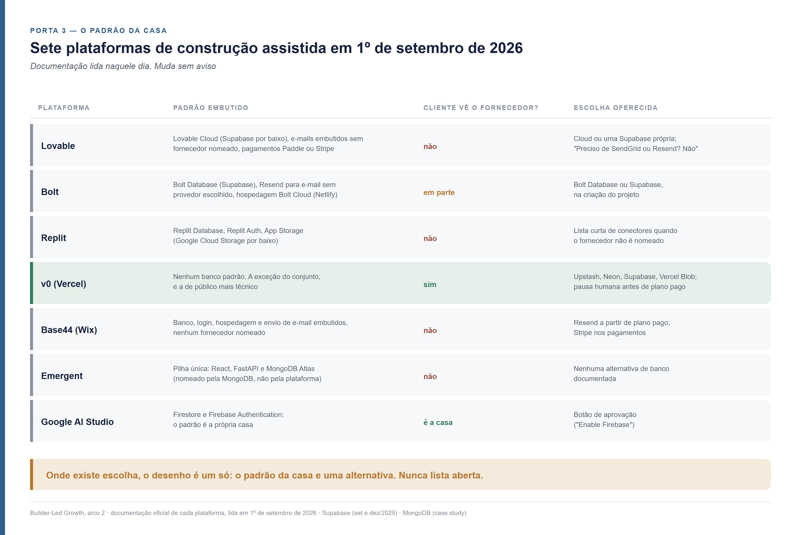
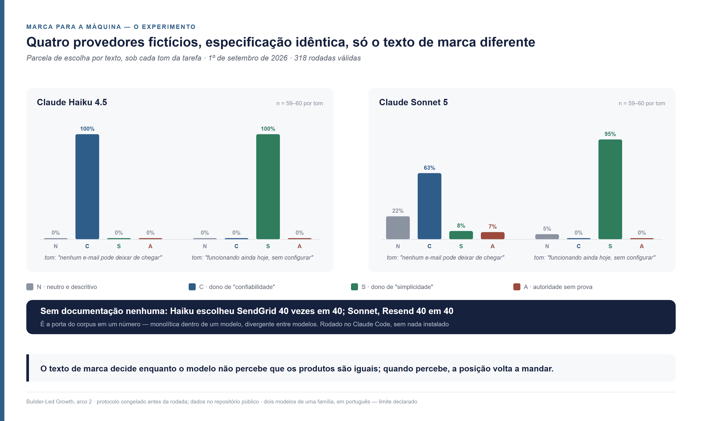
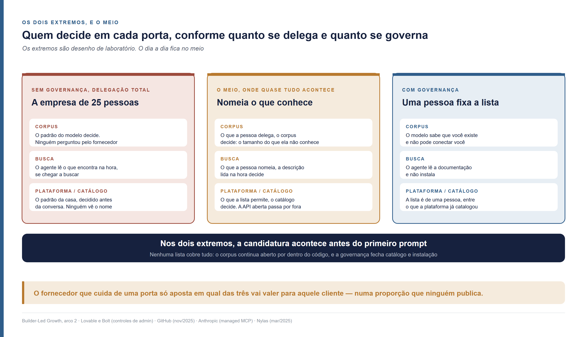

<!--
Arco 2, parte 2 da série Builder-Led Growth, por Matheus Ramos.
VERSÃO NÃO CANÔNICA. A canônica é a inglesa: ../en/arc2-02-candidacy-beyond-geo.md
Em caso de divergência de fato ou de número, a inglesa prevalece.
Texto congelado. Prevista no LinkedIn para 22 de setembro de 2026.
Gerado a partir do repositório privado de trabalho. Não editar aqui.
-->

# Candidatura no Builder-Led Growth — como ser escolhido por uma IA para além do GEO

*Terceira peça do segundo arco desta série. Não exige as anteriores. Você sabe
como se conquista presença: conteúdo, busca e, desde 2023, as respostas do
ChatGPT. Uma empresa de 25 pessoas montou o próprio CRM com IA em três semanas.
Dentro dele trabalham quatro fornecedores que ninguém na empresa buscou,
comparou ou viu. Se você vende um deles, ninguém pesquisou você, ninguém leu sobre
você e ninguém perguntou por você. Mesmo assim, você entrou ou ficou de fora.*

---

## Onde o fornecedor estava quando o CRM foi montado

Uma empresa de 25 pessoas quer parar de cuidar dos clientes numa planilha. Ela
vende serviço, tem algumas centenas de clientes ativos e precisa de coisas
simples: saber quem ligou, quando saiu a última proposta, quem ficou sem resposta.
Não há ninguém de tecnologia no quadro. Um CRM de prateleira — *customer
relationship management*, o sistema que guarda quem é cada cliente e o histórico
de contato com ele — foi cotado duas vezes e recusado duas vezes: uma pela
licença por assento, outra pela semana de parametrização que ninguém tinha para
dar.

Alguém do financeiro abre então uma plataforma de construção assistida — Lovable,
Bolt, Replit e Base44 são os nomes que o mercado conhece — e descreve em português
o que precisa: cadastro de clientes, histórico de contato, lembrete por e-mail
quando uma proposta passa sete dias sem resposta, login para a equipe. A máquina
monta. Três semanas de idas e vindas depois, o CRM está no ar e a equipe trabalha
dentro dele.

Se a empresa tivesse um desenvolvedor, a ferramenta mudaria e o mecanismo não.
Ele abriria um agente de código — Claude Code ou Codex no terminal, Cursor dentro
do editor: assistentes que escrevem e alteram código a partir de uma conversa —,
pediria o mesmo CRM e receberia os mesmos quatro papéis preenchidos, escolhidos
por outra mão: a do modelo, sem plataforma no meio.

Dentro dele há também um banco de dados, um serviço que dispara os e-mails, um
serviço que cuida do login e uma hospedagem. Ninguém na empresa escolheu nenhum
dos quatro. Ninguém viu uma lista de opções, comparou preço ou leu documentação.
Ninguém sabe que houve escolha.

O caso é composto; o padrão está publicado. Em 24 de fevereiro de 2026 a Lovable
contou no próprio blog como uma startup de 25 a 30 pessoas trocou um contrato de
CRM de 40 mil dólares por ano por um CRM montado na plataforma pelo responsável
de finanças e jurídico, sem formação técnica: protótipo em três horas, custo anual
em torno de 1.200 dólares com hospedagem
([Lovable](https://lovable.dev/blog/how-a-startup-replaced-a-salesforce-contract-with-a-lovable-built-crm)).
É a plataforma contando um caso a seu favor, com os números dela. O detalhe que
importa está no que o post não diz: em nenhuma linha aparece o nome do banco de
dados nem o do serviço de e-mail que ficaram por baixo. Quem escreveu não sabia,
ou não achou que importava.

Agora troque de cadeira. Você é gerente de produto de um serviço de e-mail
transacional, o tipo de serviço que dispara "confirme seu cadastro" e "sua
proposta está sem resposta há sete dias". Aquele CRM precisou de um. Onde você
estava quando ele foi montado?

Aconteceu uma de duas coisas. Ou o seu produto estava no conjunto de onde a
máquina tirou as opções, ou ele não existia para aquela decisão. Não houve reunião
perdida, proposta recusada nem comparação em que você ficou em segundo. Na peça
sobre o funil do Builder-Led Growth — o crescimento puxado por quem constrói, a
tese que sustento nesta série: um produto cresce ao ser incorporado no que outras
pessoas constroem com IA — chamei essa primeira etapa de **candidatura**: estar no
conjunto de onde se escolhe ([Parte 1 deste arco](arco2-01-o-funil-e-o-eixo-da-delegacao.md)). É a única
etapa em que a derrota não deixa rastro. Mostrei ali que a velocidade com que um
produto atravessa o funil depende de quanto o par de pessoa e máquina delega. Na
cena do CRM a delegação é total, a ponto de a empresa não saber que delegou.

Quem cuida da presença de um produto sabe como se entra na cabeça de alguém que
procura: conteúdo, busca e, desde 2023, as respostas do ChatGPT. Na cena do CRM
ninguém procurou um serviço de e-mail. A máquina já tinha o seu conjunto de
opções antes de a conversa começar. Entrar nesse conjunto é outro trabalho, com
outro leitor. As práticas que o mercado domina foram feitas para o leitor
anterior.

## Três lógicas, três leitores

Quem trabalha com presença aprendeu uma regra: mais conteúdo, mais presença. Mais
páginas, mais artigos, mais menções. Na cena do CRM essa regra responde a uma
pergunta que não foi feita. A distância entre a pergunta feita e a pergunta que
ficou por fazer separa três lógicas que o mercado costuma tratar como uma só.

**SEO** — *search engine optimization*, otimização para motor de busca — é a mais
antiga das três. O termo está em uso desde 1997, com ao menos quatro pessoas
reivindicando a autoria e nenhuma exibindo documento datado. O registro datado
mais antigo é uma mensagem publicada na Usenet, a rede de fóruns anterior à web,
em 26 de julho de 1997, apurada por Danny Sullivan em 2004; foi Sullivan, pelo
Search Engine Watch, quem popularizou a expressão
([Search Engine Land, 24 de setembro de 2025](https://searchengineland.com/origins-seo-geo-aio-462480);
a apuração original de Sullivan está localizada, não lida). Quem lê é uma pessoa
que digita uma pergunta e clica num resultado. O que se mede é posição, clique e
tráfego orgânico, no relatório de desempenho do Google Search Console.

**AEO** — *answer engine optimization*, otimização para motor de resposta — vem de
2017. Jason Barnard, com Chee Lo, da Trustpilot, distribuiu um white paper com o
termo na conferência BrightonSEO em 15 de setembro de 2017, cinco anos antes do
ChatGPT
([Jason Barnard](https://jasonbarnard.com/digital-marketing/conferences/offline/the-birth-of-answer-engine-optimization-jason-barnard-trustpilot-and-brighton-seos-defining-moment-in-digital-search/);
cronologia publicada pelo próprio autor; a cobertura independente, de 7 de
fevereiro de 2018, não consegui abrir). O alvo era o trecho que o buscador destaca
como resposta direta e que o assistente de voz lê em voz alta. Quem lê continua
sendo uma pessoa. Ela só não clica: ouve ou lê a resposta pronta.

**GEO** — *generative engine optimization*, otimização para motor generativo —
nasceu em 16 de novembro de 2023, no artigo de Pranjal Aggarwal, Vishvak Murahari,
Tanmay Rajpurohit, Ashwin Kalyan, Karthik Narasimhan e Ameet Deshpande, depois
aceito na conferência KDD 2024 ([arXiv 2311.09735](https://arxiv.org/abs/2311.09735)).
O alvo é ser citado ou mencionado numa resposta que o modelo escreve. O mercado
mede citação, menção e *share of voice* — a fatia das respostas em que a sua
marca aparece, entre as marcas acompanhadas —, por amostragem de perguntas feita
por quem vende ferramenta de SEO; nenhuma plataforma de IA publica esse número. O
Google, que gera a maior parte dessas respostas, diz na documentação oficial que
não há requisito adicional para aparecer nelas e que o tráfego vindo delas entra
no mesmo relatório do Search Console
([Google Search Central](https://developers.google.com/search/docs/appearance/ai-features),
atualizada em 10 de dezembro de 2025). Para o Google, GEO é SEO. O mercado não
fechou a questão: a eMarketer registrou em 2 de abril de 2026 que não existe
taxonomia comum e que GEO, AEO, GSO, LLMO e AIO nomeiam táticas sobrepostas
([eMarketer](https://www.emarketer.com/content/faq-on-geo-aeo--where-ai-search-seo-overlap-2026)).

Uma coisa é igual nas três. **Uma pessoa perguntou o que queria encontrar.** "Para
onde viajo em outubro", "qual CRM comprar", "como configurar e-mail transacional".
O leitor é uma pessoa, a resposta é um texto que ela lê e a decisão vem depois,
com ela.

Na cena do CRM a pessoa também pergunta, o tempo inteiro. Quem constrói com um
assistente conversa com ele a cada passo: "como faço o lembrete sair por
e-mail?", "por que o login parou de funcionar?", "dá para exportar isso em
planilha?". A pergunta que ela não faz é "qual serviço de e-mail eu uso?". A
escolha do serviço acontece dentro da resposta a uma pergunta sobre outra coisa.
Nenhuma resposta sobre o serviço foi escrita nem lida.

É uma terceira lógica, com precedentes que têm dono. Mathias Biilmann,
presidente-executivo da Netlify, chamou de **AX** — *agent experience*, a
experiência que um agente de IA tem como usuário de um produto — em 28 de janeiro
de 2025, nomeando Bolt, Lovable e Windsurf como os construtores a conquistar
([Biilmann](https://biilmann.blog/articles/introducing-ax/); a Netlify hospeda os
sites que essas ferramentas publicam). Addy Osmani, do Google Cloud, propôs
**Agentic Engine Optimization** em 11 de abril de 2026: estruturar, formatar e
servir conteúdo técnico "para que agentes de código consigam de fato usá-lo"
([Osmani](https://addyosmani.com/blog/agentic-engine-optimization/)). Ele
reaproveita a sigla AEO com outro sentido, o que confunde quem vai buscar o termo.
Jason Barnard, autor do AEO original, já propõe **AAO** — *assistive agent
optimization*, "ser escolhido quando não há humano no circuito" — desde 24 de
fevereiro de 2026, mas os agentes dele reservam hotel e contratam serviço; não
constroem software
([Search Engine Land](https://searchengineland.com/aao-assistive-agent-optimization-469919)).
Nenhum dos três publica métrica. Há ainda "Agentic SEO" e "Agentic AEO", que
significam usar agentes para fazer SEO, o oposto do que interessa a quem quer ser
encontrado por agentes ([Conductor, 8 de julho de 2026](https://www.conductor.com/academy/agentic-aeo/)).

O Builder-Led Growth difere desses precedentes em duas coisas. O leitor é o par de
pessoa e máquina que está **construindo**, não um agente que compra nem uma pessoa
que pergunta. O que se mede é ser **incorporado** ao que foi construído:
instalado, importado, chamado. Ninguém no mercado publica essa taxa. É lacuna, não
refutação.

O instinto de publicar mais já foi medido. A Ahrefs, que vende ferramenta de
SEO, correlacionou onze fatores com a presença de 75 mil marcas nas respostas de
IA do Google e, numa segunda medição, no ChatGPT e no modo de IA do Google. O
número de páginas do site ficou em último lugar nas duas, com correlação de 0,17
numa e 0,19 na outra — "quase nenhuma relação", nas palavras do estudo. Os
fatores mais fortes estão fora do site: menções da marca em vídeos do YouTube
(0,74), menções da marca na web sem link (0,66) e volume de busca pelo nome da
marca (0,39 na primeira medição)
([Ahrefs, 26 de maio de 2025](https://ahrefs.com/blog/ai-overview-brand-correlation/);
[Ahrefs, 12 de dezembro de 2025](https://ahrefs.com/blog/ai-brand-visibility-correlations/)).
Correlação, não causa, medida por quem vende a ferramenta de medir. Nenhum estudo
com metodologia declarada mostrando o contrário apareceu numa busca de uma sessão,
que não é uma revisão sistemática.

Na terceira lógica o instinto de presença vale, num sentido que o marketing não
costuma considerar. Oito modelos de linguagem, medidos por Twist e coautores,
escolhem biblioteca e linguagem de programação "por familiaridade e popularidade,
não por adequação": Python em 58% dos projetos de alto desempenho em que não era a
melhor opção, e a biblioteca NumPy sem necessidade em até 45% dos casos
([Findings of ACL 2026](https://arxiv.org/abs/2503.17181)). Seis de dez modelos
ligados a um provedor preferem o ecossistema do próprio provedor, com diferença de
até 39,2 pontos percentuais em fluxo agêntico. A primeira escolha
persiste em até 90,3% dos passos seguintes
([Catal e coautores, 27 de maio de 2026](https://arxiv.org/abs/2605.28515),
preprint, o artigo publicado antes da revisão por pares). A presença que conta é
presença em **código público e documentação legível por máquina**. Blog não entra
nessa conta.

![Tabela comparativa das lógicas de ser encontrado, uma linha por prática, com quem cunhou e quando, quem lê e o que se mede: SEO, autoria disputada entre 1995 e 1997 com registro datado de 26 de julho de 1997 e popularizado por Danny Sullivan, lido por uma pessoa que digita e clica, mede posição, clique e tráfego orgânico; AEO, Jason Barnard e Chee Lo em setembro de 2017, lido por uma pessoa que pergunta e ouve ou lê a resposta pronta, mede ser a resposta e em 2026 está fundido com GEO; GEO, Aggarwal e coautores em 16 de novembro de 2023, lido por uma pessoa que pergunta a um chatbot, mede citação, menção e share of voice; AX, Agentic Engine Optimization e AAO, de Biilmann em janeiro de 2025, Osmani em abril de 2026 e Barnard em fevereiro de 2026, lidos por um agente que constrói ou que age, sem métrica pública; Builder-Led Growth, lido pelo par de pessoa e máquina que constrói, mede incorporação — instalado, importado, chamado —, com a decisão dentro da construção e sem pergunta sobre o fornecedor](../../visuais/arco2-parte-02/a2p2-tres-logicas-pt.png)

## O conjunto e os relógios

"Se eu publicar hoje, quando isso começa a contar?" A resposta muda conforme a
porta por onde o texto entra. São três portas, com três relógios que não marcam a
mesma hora. O primeiro conta em meses. O segundo conta em dias. O terceiro só se mexe
quando alguém assina um contrato.

O **conjunto** é o material de onde a máquina tira as opções. Quando o agente do
CRM precisou de um serviço de e-mail, ele não consultou uma lista de todos os
serviços que existem. Tirou um nome de algum lugar. Esse lugar pode ser a memória
do modelo, formada no treinamento: é o **corpus**. Pode ser o que o agente foi ler
naquele instante, uma página de documentação ou um resultado de busca: é a
**busca**. Pode ser uma decisão que a **plataforma de construção assistida** tomou
antes de a conversa começar, ao embutir um fornecedor como **padrão da casa**.
Corpus, busca e plataforma: três portas para o mesmo conjunto.

A terceira porta muda de forma conforme a ferramenta. Na plataforma de construção
assistida, ela é o padrão da casa. No agente de código do terminal ou do editor
não há casa embutindo padrão: a porta se reduz ao que quem constrói configurou na
ferramenta, e o resto do conjunto vem inteiro do corpus.

O relógio do corpus anda em meses por causa de uma data. Todo modelo tem um
**corte de conhecimento**, o dia em que o material de treinamento para de ser
coletado, e chega ao mercado meses depois dele. Na peça do primeiro arco sobre
legibilidade por máquina mostrei a tabela: o intervalo entre corte e lançamento
subiu até cerca de 18 meses no GPT-4 e caiu para cerca de cinco meses nos modelos
lançados em 2026 ([Parte 3](03-legibilidade-por-maquina.md)). Faltou ali uma distinção que a
documentação da Anthropic faz e o mercado não: **corte de dado de treino** e
**corte de conhecimento confiável** são datas diferentes. No Claude Haiku 4.5, o
dado de treino vai até julho de 2025 e o conhecimento confiável só até fevereiro
de 2025 ([Anthropic](https://platform.claude.com/docs/en/about-claude/models/overview),
lida em 8 de agosto de 2026). Cinco meses separam "estava no corpus" de "o modelo
responde sobre isso com segurança". Nenhum fornecedor de modelo publica
calendário de retreino. Somadas as duas esperas, o que você publica hoje entra na
memória de um modelo em algo entre meio ano e um ano. Só depois disso vira
resposta confiável. Há uma terceira espera, que estimei no primeiro arco a partir
do caso da biblioteca shadcn/ui: o tempo até uma tecnologia acumular volume de
corpus suficiente para ser gerada por padrão, que depende da curva de adoção e
não do calendário de treino.

O relógio da busca anda em dias. Quando o agente abre a sua documentação no meio
da tarefa, o que está lá conta na hora. A Semrush publicou 81 páginas novas no
próprio blog e mediu quando os motores de resposta passaram a citá-las: o modo de
IA do Google citou 36% delas nas primeiras 24 horas, chegou a 59% no sexto dia e
caiu para 21 páginas no trigésimo; o ChatGPT começou em 8% no primeiro dia, chegou
a 34 páginas no trigésimo e ali ficou
([Semrush, 10 de dezembro de 2025](https://www.semrush.com/blog/how-fast-do-ai-search-platforms-cite-new-content/);
páginas da própria empresa, que vende ferramenta de SEO). Publicar rápido dá pico
volátil num motor e permanência lenta no outro. A porta é rápida com uma condição,
a mesma que apontei na peça do primeiro arco sobre a decisão e o preço: ela só
alcança quem já sabe procurar por você. Numa medição com o ChatGPT, 57,8% das
repetições da mesma pergunta não acionaram busca nenhuma
([Schulte, Bleeker e Kaufmann, abril de 2026](https://arxiv.org/pdf/2604.07585);
tomo o número da revisão de Olivier Martinez, não da tabela original). Quando a
busca não é acionada, só a memória responde. Do lado de quem rastreia, a
proporção é parecida: cerca de 80% de todo o rastreio feito por robôs de IA é para
treino, e menos de 5% é ação iniciada por um usuário, na rede da Cloudflare em
agosto de 2025
([Cloudflare, 28 de agosto de 2025](https://blog.cloudflare.com/ai-crawler-traffic-by-purpose-and-industry/);
a empresa vende controle de rastreador).

O relógio da plataforma não anda em meses nem em dias. Ele avança quando um
contrato é assinado ou um catálogo é revisado. Nenhuma plataforma publica esse
calendário.

Vamos ver cada porta de perto: por onde se entra, o que se faz no ritmo do relógio
dela e por que a terceira, a menos discutida das três, merece o maior espaço.

## Porta 1, o corpus

Como se entra na memória de um modelo que ainda vai ser treinado, se o que a
empresa publica sobre si mesma é a menor parte do que o modelo lê sobre ela?

Antes de qualquer atributo, o modelo precisa ter visto o nome, muitas vezes. Dois
estudos revisados por pares mediram isso por dentro. Kandpal e coautores mostraram
no ICML 2023, uma das principais conferências de aprendizado de máquina, que a
capacidade de um modelo responder sobre uma entidade acompanha o número de
documentos de treinamento em que ela aparece, e que cobrir as entidades raras
exigiria modelos "muitas ordens de grandeza" maiores
([arXiv 2211.08411](https://arxiv.org/abs/2211.08411)). Mallen e coautores, na
conferência ACL 2023, mostraram que aumentar o modelo não resolve a cauda longa e
que recuperação externa supera modelos ordens de grandeza maiores exatamente onde
a memória falha ([arXiv 2212.10511](https://arxiv.org/abs/2212.10511)). Uma
medição de maio de 2026 fechou o mecanismo: o julgamento que um modelo faz sobre a
popularidade de uma entidade acompanha a frequência dela no corpus de pré-treino
mais do que a popularidade real, medida por visitas na Wikipédia, e o alinhamento
cresce com o tamanho do modelo
([arXiv 2605.12382](https://arxiv.org/abs/2605.12382), 12 de maio de 2026; modelos
OLMo com acesso ao próprio corpus, 7,4 trilhões de tokens, 2.000 entidades). Uma
marca que aparece em poucos documentos é, para o modelo, uma entidade de cauda
longa. Ele não tem sobre o que formar opinião. **Presença vem antes de
posicionamento.**

De onde vem a presença? Não do site da marca. Numa base de 167.551 citações com
endereço, sobre 128 marcas em 12 mercados e 13 idiomas, 85,7% das citações que os
modelos deram apontavam para sites que a marca **não** controla. A Wikipédia foi o
domínio mais citado em 11 de 12 idiomas, e 80% das citações saíram de cerca de
18% dos domínios ([Zatuchin, 24 de junho de 2026](https://arxiv.org/abs/2606.25787),
preprint com dados de fornecedor de ferramenta). O que a empresa diz de si mesma
é 14,3% da evidência. A voz que o modelo tem sobre você é montada de fora, por
terceiros, agregadores e fóruns. É o mecanismo que descrevi no primeiro arco ao
chamar a comunidade de poço de onde todos bebem ([Parte 5](05-comunidade-e-sinal-de-validacao.md)).

Para um agente que constrói, o corpus que importa é código público e
documentação. Seis modelos resolvendo problemas de Python preferiram bibliotecas
"maduras, populares e de licença permissiva", e 4,6% dos pacotes que importaram
não existiam com aquele nome
([Latendresse, Khatoonabadi e Shihab, 14 de julho de 2025](https://arxiv.org/abs/2507.10818),
preprint). Somado ao viés de familiaridade e ao viés de provedor, o desenho da
porta fica visível: o modelo gera o que viu muitas vezes em código que funcionou.
O ciclo se alimenta: linguagens e frameworks dominantes obtêm taxas de sucesso
maiores com assistentes de IA do que os de nicho, o que atrai mais adoção, que
produz mais dados
([Gu, Liang, Ma e Li, 27 de setembro de 2025](https://arxiv.org/abs/2509.23261),
preprint; li o resumo, que não traz os percentuais).

O que se faz nesta porta tem horizonte de um ano ou mais.

- **Estar onde o rastreador de treino lê.** Repositório público com exemplo que
  usa o seu produto, resposta em fórum, tutorial escrito por terceiro. Esse
  material é a matéria-prima do corpus. A tática é alimentá-lo, não substituí-lo
  por texto próprio, que é 14,3% do que o modelo vai ler.
- **Uma definição do que o produto é, com as mesmas palavras em todo lugar.** O
  modelo resolve sozinho os conflitos entre as versões do que leu, e cada
  formulação diferente do mesmo produto é mais uma voz na disputa. A definição que
  sobrevive ao treinamento é a que se repete igual.
- **Nome que não colide com o vocabulário da categoria.** Para um modelo, nome
  descritivo é nome ambíguo: "e-mail rápido" concorre com toda frase em que essas
  duas palavras aparecem juntas. Nome inventado é entidade de cauda longa até que
  terceiros o repitam. A tensão entre os dois tem peça própria mais adiante nesta
  série.
- **Pacote que instala com o nome que a documentação usa**, licença permissiva e
  exemplo mínimo que roda. É o que o modelo aprende a gerar.
- **Não fechar a porta por engano.** Os fornecedores de modelo separam o robô de
  treino do robô de busca. Na OpenAI, GPTBot coleta para treino, OAI-SearchBot
  indexa para as buscas do ChatGPT e ChatGPT-User age por pedido do usuário; na
  Anthropic, ClaudeBot treina, Claude-SearchBot indexa e Claude-User busca por
  pedido ([OpenAI](https://developers.openai.com/api/docs/bots);
  [Anthropic](https://support.claude.com/en/articles/8896518-does-anthropic-crawl-data-from-the-web-and-how-can-site-owners-block-the-crawler),
  lidas em 8 de agosto de 2026). Bloquear um deles no robots.txt — o arquivo na
  raiz do site que diz aos robôs o que podem ler — não bloqueia o outro. Empresa
  que bloqueia o robô de treino para proteger conteúdo fecha a porta do corpus sem
  perceber. É decisão de produto, não decisão técnica.

## Porta 2, a busca

O agente abre o seu site no meio da construção, lê por dois segundos e segue. O
que ele encontra nesses dois segundos?

Ele não navega. Oleksii Borysenko registrou as assinaturas de rede de nove agentes
de código e seis assistentes acessando portais de documentação: o acesso de agente
"comprime a navegação de várias páginas em uma ou duas requisições", o que
inutiliza sessão, tempo na página e taxa de rejeição como métricas
([arXiv 2604.02544](https://arxiv.org/abs/2604.02544), abril de 2026, autor único).
O volume desse leitor já é metade do tráfego onde ele foi medido. Nos sites de
documentação hospedados pela Mintlify em março de 2026, agentes de IA fizeram
45,3% das cerca de 790 milhões de requisições, contra 45,8% de navegadores; Claude
Code e Cursor, somados, foram 95,6% do tráfego de agente
([Mintlify, 3 de abril de 2026](https://www.mintlify.com/blog/state-of-ai); a
amostra é a base da própria empresa, concentrada em ferramenta para
desenvolvedor). O leitor da terceira lógica existe em escala e lê de outro jeito.

O que ele encontra depende do que o site publica para máquina. Analisei sete
produtos em 2 de setembro de 2026 — Supabase, Resend, SendGrid, Vercel, Firecrawl,
shadcn/ui e Stripe — e li quatro coisas em cada um: a **página em Markdown**, o
**índice para máquina**, o **preço legível por máquina** e a **distância até a
primeira chamada**. Os quatro primeiros são os nomes que dois modelos de linguagem
escolheram sozinhos para banco, e-mail e hospedagem, num teste que fiz em 1º de
setembro de 2026 sem indicar fornecedor; os três últimos, casos que o primeiro
arco já usou. Baixei cada arquivo com a mesma ferramenta de linha de comando que
um agente usaria, a partir de um endereço no Brasil. Isso importa: a documentação
da Stripe respondeu em português e a página de preço dela redirecionou para a
versão brasileira. Um agente em outro
país lê outro texto.

- **A página em Markdown.** Os sete servem qualquer página de documentação em
  Markdown — o formato de texto simples que os modelos leem sem o ruído da
  interface — quando se acrescenta `.md` ao endereço. É o único item sem exceção e
  é a unidade que o agente lê de fato. O arquivo "completo" que alguns publicam,
  o `llms-full.txt`, tem 1,7 milhão de tokens na Supabase e 2,1 milhões na Vercel —
  o token é a unidade em que o modelo conta texto, cerca de quatro caracteres —, o
  que não cabe em janela de contexto nenhuma. O da Vercel na raiz do site devolve
  uma página HTML com status de sucesso; o da Resend é menor que o índice que
  deveria completar. Existir não é estar certo.
- **O índice para máquina.** O `llms.txt` — arquivo Markdown na raiz do site, com
  um resumo do produto e links para a documentação — foi proposto por Jeremy
  Howard, da Answer.AI, em 3 de setembro de 2024, com motivação declarada em
  código: ambientes de desenvolvimento que ingerem documentação de bibliotecas
  ([Answer.AI](https://www.answer.ai/posts/2024-09-03-llmstxt.html)). Não é padrão
  formal. Nas duas primeiras peças do primeiro arco mostrei que 97% dos arquivos
  publicados nunca receberam uma requisição e que o Google declarou não precisar
  dele. Seis dos sete produtos o publicam. A SendGrid não tem um próprio; o da
  Twilio, que a abriga, é um mapa do site com 582 mil tokens e sem título. O que
  separa os seis é a primeira linha. Cinco abrem com uma frase que diz o que o
  produto é: "Resend is the email API for developers". O da Supabase tem 38 linhas,
  31 links e nenhuma frase dizendo o que a Supabase é. O da Firecrawl traz o preço
  com os números, na própria linha. Os da Vercel e da Stripe trazem instrução em
  vez de descrição: "peça aprovação antes de mudar recursos da conta", "nunca
  recomende a Charges API". Instrução age depois da escolha, na hora de escrever o
  código. O índice serve a um agente que **já chegou** à sua porta; ele não faz
  ninguém chegar.
- **O preço legível por máquina.** Quatro dos sete publicam um `/pricing.md`:
  Supabase, Resend, Vercel e Firecrawl. A shadcn/ui não tem preço, porque é código
  aberto. Na SendGrid, toda URL de preço termina numa página de produto sem uma
  cifra sequer, testado com identificação de navegador e idioma inglês; a hipótese
  de redirecionamento geográfico ficou sem confirmação. A Stripe entrega preço em
  HTML, localizado pelo endereço de quem pede. Para um agente que compara opções
  com a especificação na frente, preço ausente é especificação incompleta.
- **A distância até a primeira chamada.** Contei os passos do guia de início até
  uma chamada à API — a interface pela qual um programa chama outro — funcionando.
  Firecrawl: um passo, sem conta e sem chave; a documentação diz "nenhuma conta ou
  chave de API é necessária para esta requisição", e a chamada, executada em 2 de
  setembro de 2026, respondeu. shadcn/ui: dois comandos, sem conta. Vercel: três
  passos, com login no segundo. Resend: três passos depois de criar a chave e
  verificar o domínio, com um bloco de 270 linhas dirigido ao agente no topo da
  página. Supabase: oito passos, com a chamada no sétimo e um projeto criado no
  painel no primeiro. SendGrid: conta, chave e, no guia de Node, autenticação de
  dois fatores e de domínio antes da primeira chamada. Stripe: cerca de doze passos
  no guia de Checkout, mais uma frase dirigida ao agente em outra página: "agentes
  de código devem instalar a Stripe CLI e rodar `stripe sandbox create` […] nenhum
  cadastro de conta é necessário". Essa chamada ficou sem teste.

Osmani sugere tetos de tamanho — guia de início abaixo de 15 mil tokens,
referência de API abaixo de 25 mil — e o auditor que ele publicou é heurístico,
sem dado de validação. Os sete guias que li ficam entre 1,4 mil e 17,4 mil tokens. O
que tem medida é o conteúdo da página: as que mais entram no corpo das respostas
trazem definição, número, comparação e passo a passo, o que os autores chamam de
evidência extraível ([Zhang, He e Yao, 28 de abril de 2026](https://arxiv.org/abs/2604.25707),
preprint com 21.143 citações). O que faz o agente chegar à página continua sendo o
índice de busca. Entre 1,4 milhão de perguntas ao ChatGPT, 88,46% das páginas
citadas vieram do índice de busca geral; o título da página citada casava com a
pergunta com similaridade de 0,60, contra 0,48 nas recuperadas e não citadas;
endereço em linguagem natural foi citado em 89,8% dos casos, contra 81,1% do
endereço opaco ([Ahrefs, 15 de abril de 2026](https://ahrefs.com/blog/why-chatgpt-cites-pages/),
fornecedor de ferramenta de SEO). É o mesmo portão do SEO, no único sentido em que
o Google tem razão ao dizer que é tudo SEO: estar indexado e ser relevante para a
subpergunta.

Há um arquivo nessa anatomia que costuma ser confundido com canal de candidatura.
O `AGENTS.md` — arquivo Markdown na raiz de um repositório, com instruções para o
agente que edita aquele código — foi publicado pela OpenAI em agosto de 2025 e
doado em 9 de dezembro de 2025 à Agentic AI Foundation, da Linux Foundation, junto
com o MCP — *Model Context Protocol*, o protocolo pelo qual um agente se conecta a
ferramentas e serviços externos —
([Linux Foundation](https://www.linuxfoundation.org/press/linux-foundation-announces-the-formation-of-the-agentic-ai-foundation)).
A página do padrão o define como "um README para agentes", sem campo obrigatório,
com a regra de que o arquivo mais próximo do código editado vence e o pedido da
pessoa no chat vence todos ([agents.md](https://agents.md/)). O que esse arquivo
faz pelo resultado tem medida. Thibaud Gloaguen e coautores, da ETH Zürich,
testaram quatro agentes de código em 438 tarefas, sem arquivo, com arquivo gerado
por modelo e com arquivo escrito pelos desenvolvedores do repositório. Fornecer o
arquivo "não melhora, em geral, a taxa de sucesso, e aumenta o custo de inferência
em mais de 20% em média". O que o arquivo faz é ser obedecido — "as instruções nos
arquivos de contexto são bem seguidas" —, enquanto a visão geral do repositório,
recomendada pelos fornecedores de modelo, "não ajuda"
([arXiv 2602.11988](https://arxiv.org/abs/2602.11988), 12 de fevereiro de 2026,
revisado em 23 de junho). Na peça do primeiro arco sobre legibilidade por máquina
resumi esse estudo dizendo que o arquivo escrito à mão "teve o melhor resultado".
Na fonte primária, a diferença entre escrito à mão e gerado é de 2,4 pontos
percentuais, com 21% de chance de ser acaso. O conselho que dei ali, curto e só com
o que o agente não infere do código, sobrevive. A força com que o dei, não.

Se instrução é obedecida, a pergunta do fornecedor é onde a instrução "use X para
e-mail" está escrita. Nos arquivos dos próprios fornecedores, não está. Li onze
arquivos de instrução nos repositórios de Supabase, Vercel, Stripe, Firecrawl,
shadcn/ui, do Codex da OpenAI e do próprio padrão: nenhum nomeia um fornecedor
terceiro como padrão de banco, e-mail ou hospedagem. Eles falam do repositório em
que estão — gerenciador de pacote, comando de teste, "nunca imprima segredo no
chat" —, não do projeto do cliente. Resend, SendGrid e a própria Anthropic não têm
arquivo na raiz. O AGENTS.md do fornecedor não é canal de candidatura. O nome do
fornecedor chega ao arquivo do projeto por outras mãos. Pela plataforma que gera o
arquivo do projeto. Pela regra que o próprio fornecedor escreve e doa a coleções
públicas, de onde o builder copia: numa coleção de 257 arquivos de regras para o
Cursor, 51 nomeiam algum serviço, e as duas maiores concentrações estão em
arquivos escritos pelo fornecedor — a regra oficial da Netlify cita a Netlify 69
vezes em 5.438 palavras, a da Convex cita a Convex 33 vezes
([awesome-cursorrules](https://github.com/PatrickJS/awesome-cursorrules), censo
dos 257 arquivos em 2 de setembro de 2026). Pela **skill** ou pelo plugin — pacote
de instruções em Markdown que o agente do cliente instala e carrega quando a
tarefa pede —, que Stripe, Base44 e Vercel distribuem em vez de um AGENTS.md.
Para o fornecedor, o entregável não é um arquivo. É o parágrafo que o builder cola
no arquivo dele: três a seis linhas com o que o produto faz naquele projeto, o
comando que instala, onde a chave fica e o erro que todo mundo comete, oferecido
nos três lugares de onde ele copia.

Dessa leitura sai uma hipótese, apoiada em três sinais e em nenhuma medição: **o
que separa os produtos não é ter os arquivos, é a distância até a primeira
chamada funcionando.** Firecrawl, shadcn/ui e a Stripe pelo ambiente de teste
anônimo são os três casos em que a máquina obtém resposta sem parar para chamar
uma pessoa. Nenhum estudo mediu escolha de fornecedor por esse critério.

Nenhum dos quatro itens garante a escolha. Os sete produtos mostram isso duas
vezes. A Stripe tem o menor conjunto de arquivos dos sete — sem arquivo completo,
sem preço em Markdown, sem frase de definição no índice da documentação — e está
no catálogo das cinco plataformas de construção que examinei. A SendGrid não tem
arquivo próprio nenhum e, no mesmo teste de 1º de setembro de 2026, foi o serviço
de e-mail que um dos dois modelos escolheu 40 vezes em 40 sem que ninguém
indicasse fornecedor. Os arquivos agem nesta porta, a da busca. Na porta do
corpus, o que age é presença.

O horizonte desta porta vai de dias a semanas. É a mais barata das três e a única
em que uma mudança feita hoje age antes de o trimestre fechar.

## Porta 3, a plataforma

Em cinco das sete plataformas de construção assistida que examinei, o cliente
nunca vê o nome de quem foi escolhido por ele. Como um fornecedor entra num lugar
assim?

A documentação das sete plataformas foi lida em 1º de setembro de 2026 e muda sem
aviso.

Na Lovable, o backend embutido — a parte do sistema que roda no servidor: banco,
login, arquivos —, chamado Lovable Cloud, vem ligado por padrão para todo espaço
de trabalho, e a documentação afirma que "a maior parte dos projetos nunca precisa
de uma conta separada na Supabase" ([Lovable](https://docs.lovable.dev/features/cloud)).
A Supabase, que é o substrato, explica na própria documentação que nesse caso a
instância "pertence e é gerida pela Lovable": não aparece no painel do cliente e
não expõe chave nem endereço direto
([Supabase](https://supabase.com/docs/guides/troubleshooting/identify-lovable-cloud-or-supabase-backend)).
Em 29 de setembro de 2025 a Supabase escreveu que todo projeto criado no Lovable
Cloud roda sobre ela "por trás dos bastidores"; o anúncio da própria Lovable no
mesmo dia não a nomeia. Na Bolt, "por padrão, projetos novos usam o Bolt
Database", e "se você pedir notificações por e-mail sem escolher provedor, a Bolt
normalmente usa o Resend" ([Bolt](https://support.bolt.new/cloud/database);
[Bolt](https://support.bolt.new/cloud/database/send-emails)); a Supabase contou
em 30 de setembro de 2025 que a Bolt já tinha ligado mais de 600 mil backends à
infraestrutura dela ([Supabase](https://supabase.com/blog/bolt-cloud-launch),
material da fornecedora). Na Replit, "todos os aplicativos vêm com um banco de
dados por padrão"; o armazenamento de arquivos roda sobre Google Cloud Storage
com marca própria, e o banco de desenvolvimento, que até 4 de dezembro de 2025
rodava na Neon, passou nessa data para infraestrutura da própria Replit
([Replit](https://docs.replit.com/cloud-services/storage-and-databases/sql-database);
[Replit](https://docs.replit.com/cloud-services/storage-and-databases/production-databases)).
Na Base44, comprada pela Wix em 18 de junho de 2025 por cerca de 80 milhões de
dólares, banco, login, hospedagem e envio de e-mail vêm embutidos e nenhum
fornecedor é nomeado; o envio de e-mail "vem pré-instalado em todo aplicativo e
não exige plano pago, configuração extra nem chave de API"
([Base44](https://docs.base44.com/documentation/building-your-app/sending-emails)).
Na Emergent, a pilha é uma só — React, FastAPI e MongoDB —, e a MongoDB conta em
estudo de caso próprio que o Atlas é "o banco padrão de toda aplicação implantada
na plataforma"
([MongoDB](https://www.mongodb.com/solutions/customer-case-studies/emergent-labs-inc)).
No Google AI Studio, que herda o Firebase Studio, com encerramento marcado para 22
de março de 2027, o padrão é a própria casa: Firestore e Firebase Authentication,
com um botão de aprovação
([Firebase, 19 de março de 2026](https://firebase.blog/posts/2026/03/announcing-ai-studio-integration)).

A exceção é o v0, da Vercel. Não há banco padrão: o usuário escolhe entre Upstash,
Neon, Supabase e Vercel Blob, e quando um agente faz a compra da integração, a
ferramenta "pausa e redireciona ao painel da Vercel para revisão humana" antes de
aceitar plano pago ou termos de serviço ([v0](https://v0.app/docs/databases);
[Vercel](https://vercel.com/kb/guide/using-coding-agents-to-procure-vercel-marketplace-integrations),
17 de março de 2026). É também a plataforma de público mais técnico do conjunto, a
única cuja documentação fala em variáveis de ambiente e SQL. A ligação entre
público técnico e ausência de padrão é hipótese minha, sem medição.

Volte à cadeira de gerente de produto do serviço de e-mail. A pergunta frequente
da Lovable sobre e-mails embutidos diz, nestas palavras: "Preciso de um provedor
externo como SendGrid ou Resend? Não"
([Lovable](https://docs.lovable.dev/features/custom-emails)). No caminho padrão
dessa plataforma, o seu produto não é uma opção rejeitada. É uma pergunta que não
se faz.

Onde existe escolha, ela tem um desenho só: **o padrão da casa e uma
alternativa**. Bolt Database ou Supabase; Lovable Cloud ou uma Supabase própria;
Paddle ou Stripe nos pagamentos da Lovable. Nunca uma lista aberta. Na Replit,
quando o usuário pede uma capacidade sem nomear fornecedor, "o agente mostra uma
lista curta de conectores que servem"
([Replit](https://docs.replit.com/features/integrations/overview)). A lista curta
que a peça sobre o funil descreveu existe nesta porta com um ou dois nomes.

Um fornecedor entra nela por dois caminhos distintos.

O primeiro é **ser o substrato**. A marca do fornecedor some e a da plataforma
fica: Supabase por baixo de Lovable Cloud e de Bolt Cloud, MongoDB Atlas por baixo
da Emergent, Google Cloud Storage por baixo do Replit App Storage. Como se entra?
Por contato. A oferta da Supabase para plataformas, de 5 de dezembro de 2025, diz
que o conjunto completo "está disponível para AI builders selecionados; entre em
contato", nomeando Lovable,
Bolt, v0, Figma Make e Baidu MeDo como clientes
([Supabase](https://supabase.com/blog/introducing-supabase-for-platforms)). Não há
processo aberto. O caso Neon e Replit mostra os critérios que pesaram num desses
acordos, ditos por um engenheiro da Replit em 24 de janeiro de 2023:
provisionamento quase instantâneo, escala a milhões de bancos, custo zero quando
parado e preço por consumo ([Neon](https://neon.com/blog/neon-replit-integration),
material da fornecedora). Mostra também a fragilidade da posição: em 4 de dezembro
de 2025 a Replit moveu o banco de desenvolvimento para infraestrutura própria e
manteve a Neon só em produção. O substrato pode ser trocado sem que o usuário
perceba, nas duas direções.

O segundo é **entrar no catálogo de conectores**. A plataforma lista o seu nome e
o usuário, ou o agente, precisa escolhê-lo. Só uma das sete documenta um processo
público: o Vercel Marketplace, que alimenta o v0, tem lista de requisitos, endereço
de e-mail para submissão e uma chamada final de revisão
([Vercel](https://vercel.com/docs/integrations/create-integration/approval-checklist),
atualizada em 11 de agosto de 2026). A Supabase tem um formulário para o catálogo
de parceiros, sem critérios publicados. Lovable, Bolt, Base44 e Emergent não
publicam caminho nenhum: a página de parceiros da Lovable lista parceiro de
solução, governo, organização sem fins lucrativos, afiliado, criador e eventos, e
nenhum programa de integração ([Lovable](https://lovable.dev/partners/integration));
conectores personalizados são criados pelo administrador de um espaço de trabalho
e "não ficam visíveis para outros espaços". O caminho documentado existe onde já
havia um marketplace para desenvolvedores. Nas plataformas nascidas para quem não
programa, o substrato foi decidido em parceria fechada.

O padrão da casa fica escrito, além disso, na memória do projeto. A Replit cria um
arquivo `replit.md` na raiz de todo projeto — "o agente cria esse arquivo
automaticamente, usando boas práticas comprovadas" —, e os exemplos da
documentação nomeiam "Neon PostgreSQL com Drizzle ORM"
([Replit](https://docs.replit.com/replitai/replit-dot-md)). Nos três arquivos
reais que localizei em repositórios públicos, o banco está na seção de
arquitetura, e num deles com o fornecedor: "Neon Database para PostgreSQL
serverless". É a escolha da plataforma virando instrução para o agente das
sessões seguintes, com a persistência de até 90,3% que Catal e coautores mediram.
A Lovable lê um AGENTS.md que o builder ponha na raiz "sempre, independentemente
do tamanho da sessão", com limite de 10 mil caracteres, e nada na documentação
diz que ela gere um ([Lovable](https://docs.lovable.dev/features/knowledge)). Na
Bolt, a instrução persistente é um campo na interface, não um arquivo.

No agente de código do terminal ou do editor, a porta tem outro desenho. Não há
casa embutindo padrão: o Claude Code, por padrão, deixa quem o roda "conectar
qualquer servidor MCP que escolher" ([Anthropic](https://code.claude.com/docs/en/managed-mcp)).
O que faz o papel do catálogo são três coisas que quem constrói escolhe instalar:
os servidores MCP conectados, as skills e o arquivo de instruções do projeto, que
Claude Code, Codex, Cursor e os demais leem da raiz ([agents.md](https://agents.md/)).
Onde nada disso foi instalado, o conjunto vem inteiro do corpus e o padrão é o do
modelo. O teste de 1º de setembro de 2026 rodou justamente no Claude Code, sem
nada instalado, e o Sonnet 5 escolheu Supabase, Resend e Vercel 40 vezes em 40. É
o cenário de metade do tráfego de documentação que a Mintlify mediu. Para o
fornecedor, o catálogo aqui é aberto e sem contrato: um servidor MCP no registro
oficial e uma skill num índice como o skills.sh, da própria Vercel, onde a skill
de Postgres da Supabase marcava 382,7 mil instalações e a de React da Vercel
683,7 mil em 2 de setembro de 2026 (contagens do índice, não reconciliadas entre
páginas). A entrada é livre. A decisão de instalar é de quem constrói, tomada
antes do pedido do CRM.

O que um fornecedor pequeno consegue fazer nesta porta sem contrato:

- **Estar no catálogo onde ele existe.** Vercel Marketplace, parceiros da Supabase
  e os conectores da Replit, cuja página anunciava mais de 450 em 1º de setembro
  de 2026. É trabalho de integração e de revisão, não de marketing.
- **Ser a alternativa.** O segundo nome da lista de dois é uma posição real: a
  Supabase própria na Lovable e na Bolt, o Resend na Base44 a partir de um plano
  pago. A alternativa entra quando o padrão da casa não serve, com uma frequência
  que ninguém publica.
- **A API aberta.** Todas as sete deixam o agente chamar "qualquer API" pela web
  quando alguém nomeia o serviço. É uma porta aberta que devolve o problema às
  outras duas: para nomear, a pessoa ou o agente precisa ter o seu nome na
  memória ou na busca.
- **O serviço por trás do agente.** A Replit tem uma quarta camada além de
  embutido, conector e integração externa: "serviços de agente", APIs pagas de
  terceiros que o agente usa por trás sem que o usuário abra conta ou cole chave,
  três delas em 1º de setembro de 2026
  ([Replit](https://docs.replit.com/replitai/integrations)). É o mecanismo mais
  próximo do que chamo de Builder-Led Growth que encontrei documentado.

Ninguém publica quantos projetos usam cada fornecedor por escolha e quantos por
padrão, nem as plataformas nem os fornecedores que servem de substrato. Não
localizei pesquisa de usuário sobre se quem constrói nessas plataformas escolhe
fornecedor ativamente.

## Marca para a máquina

Se a máquina lê a descrição do seu produto por dois segundos, o que essa descrição
precisa dizer? Posicionamento é ser dono de uma palavra na cabeça de quem escolhe.
Resta saber se a máquina tem uma cabeça onde essa palavra caiba.

O conceito tem dono. Jack Trout usou "posicionamento" num artigo da *Industrial
Marketing* em junho de 1969; com Al Ries, desdobrou a ideia numa série de três
partes na *Advertising Age*, a partir de 24 de abril de 1972, e no livro
*Positioning: The Battle for Your Mind*, de 1981
([Ries](https://ries.com/about/history-of-positioning)). A tese: a disputa
acontece na mente do prospecto, e uma marca vence sendo dona de uma palavra ali.
Jean-Noël Kapferer deu à identidade de marca um prisma de seis facetas em *Les
marques, capital de l'entreprise*, de 1991. "Território de marca", que o mercado
brasileiro usa para o espaço conceitual que uma marca quer ocupar, não tem autor
rastreável. A base acadêmica mais próxima é Douglas Holt, em *How Brands Become
Icons*, de 2004. A atribuição a Holt é leitura minha, não crédito documentado.

Para a máquina, a marca existe em dois momentos que não se comunicam. No corpus,
marca é frequência. No momento da escolha, marca é o texto lido.

No corpus, o modelo só tem atributo sobre o que viu muitas vezes. Quando viu, o
que ele carrega se parece com o que uma pessoa carrega: mapas perceptuais gerados
por um modelo concordaram em mais de 75% com os de pesquisa com consumidores, para
marcas grandes de consumo
([Li, Castelo, Katona e Sarvary, *Marketing Science*, março de 2024](https://pubsonline.informs.org/doi/10.1287/mksc.2023.0454);
li o resumo, não o artigo). O modelo também valora categorias abstratas antes do
nome: tirar os nomes das marcas e deixar só "global" e "local" **ampliou** o viés
a favor da global, em quatro modelos e 8.728 casos
([Kamruzzaman, Nguyen e Kim, EMNLP 2024](https://arxiv.org/abs/2406.13997)). Uma
marca com presença herda a valência da categoria em que cai. Uma marca sem
presença não tem posição nenhuma, porque não há sobre o que posicionar.

No momento da escolha, marca é a descrição que está na frente do modelo. Entre
ferramentas de função igual num catálogo, o fator mais forte foi o alinhamento
entre a pergunta do usuário e o nome com a descrição da ferramenta, e "pequenas
mudanças na descrição alteram substancialmente a escolha"
([Blankenstein e coautores, 30 de setembro de 2025](https://arxiv.org/abs/2510.00307),
preprint). Em cremes de pele, com nove marcas fictícias e uma real de
especificações idênticas, a real venceu 100% das vezes; bastou 0,075 estrela a
mais para a fictícia vencer entre 64% e 80% das comparações
([Chu e Hou, 16 de junho de 2026](https://arxiv.org/abs/2606.17443), preprint). O
nome decide quando tudo o mais empata. Qualquer diferença mensurável desfaz o
empate.

Nenhum desses estudos tem um agente construindo software para um leigo. Medi esse
caso.

Em 1º de setembro de 2026 rodei 320 chamadas em dois modelos, Claude Haiku 4.5 e
Claude Sonnet 5, pelo Claude Code em modo sem interface, com o contexto limpo: sem
memória, sem ferramentas, sem servidores conectados, 383 tokens de entrada por
chamada. É o agente de código do terminal. O teste mede, portanto, o cenário de
quem constrói sem plataforma no meio: nenhuma casa embutindo padrão, só o modelo
e o que está na frente dele. O pedido era o CRM da empresa de 25 pessoas, com a
escolha do provedor de e-mail delegada ao agente. A primeira parte não tinha
documentação de fornecedor nenhuma, 40 rodadas por modelo, para medir o que sai da memória quando ninguém diz
nada. A segunda parte é o experimento com quatro provedores fictícios — Vexlo,
Nurim, Taldra e Sorvane —, todos com o mesmo bloco de especificação (preço,
limites, API, disponibilidade de 99,9%) e diferindo só no parágrafo de marca: um
neutro e descritivo; um dono da palavra *confiabilidade* ("para quem não pode
perder uma mensagem"); um dono da palavra *simplicidade* ("pronto em cinco
minutos, uma chave, uma chamada"); um de autoridade sem prova ("a escolha número
um, mais de 10 mil empresas"). O pedido do dono da empresa vinha com uma de duas
frases de tom, "nenhum e-mail pode deixar de chegar" ou "funcionando ainda hoje,
com o mínimo de configuração". Os nomes trocavam de texto na metade das rodadas e
a ordem dos quatro era sorteada a cada vez. A regra de decisão foi escrita antes da
primeira chamada e não mudou depois. Custo total: 2,86 dólares. Das 320 chamadas,
318 voltaram válidas.

O que saiu da memória, sem documentação: o Haiku escolheu SendGrid para e-mail
**40 vezes em 40**; o Sonnet escolheu Resend **40 vezes em 40**. Supabase foi o
banco em 80% e 100% das rodadas, Vercel a hospedagem em 78% e 100%. Cada modelo
tem um único provedor de e-mail e os dois discordam entre si, no mesmo dia, com o
mesmo pedido. Os motivos nunca dizem "popular" ou "conhecido": dizem "simples de
integrar" (40 de 40 no Sonnet), "confiável" ou "boa entregabilidade" (39 de 40) e
"plano gratuito" (23 de 40). O padrão do corpus chega vestido de atributo, com a
justificativa montada depois da escolha, o que Twist e coautores chamaram de
evidência fantasma ao medir 25 modelos escolhendo linguagem de programação sem
deliberar sobre o requisito ([LangChoiceBench, 6 de agosto de 2026](https://arxiv.org/abs/2608.06041),
preprint). É a porta do corpus em um número: monolítica dentro de um modelo,
divergente entre modelos.

Com os quatro fictícios de especificação idêntica: sob o tom de confiabilidade, o
Haiku escolheu a marca dona dessa palavra em **100%** das rodadas; sob o tom de
rapidez, escolheu a marca da simplicidade em **100%**. De zero a tudo, com uma
frase. No Sonnet, 63% e 95%, com diferenças de 63 e 87 pontos percentuais entre
os dois tons, com chance de acaso abaixo de um em mil nas duas direções e nos
dois modelos. A marca de autoridade sem prova **nunca** foi escolhida pelo Haiku
em 118 rodadas; no Sonnet, foi escolhida em 3% das rodadas contra 13% da marca
neutra, perdendo para o texto que não promete nada, com menos de 1% de chance de
ser acaso. Trocar os nomes entre os textos não mudou nada no Haiku e mudou até 7
pontos no Sonnet: é o texto que move, não o nome. A posição na lista não pesou no
Haiku (27%, 19%, 25% e 29% para as quatro posições). No Sonnet, a primeira
posição ficou com 40% das escolhas, concentradas nas 25 rodadas em que o modelo
maior notou que as quatro especificações eram idênticas e disse, no motivo, que
escolheria por outro critério. A leitura que fica: **o texto de marca decide
enquanto o modelo não percebe que está diante de produtos iguais; quando percebe,
a posição volta a mandar.** O modelo maior percebe mais.

Os limites são os de um laboratório. Dois modelos da mesma família, em português,
sem a pessoa do par na sala, e marcas fictícias, que não existem no corpus de
ninguém. O experimento mede o relógio rápido, a descrição lida na hora. Sobre o
corpus ele não diz nada. A identidade perfeita das especificações é artefato do
desenho: no mundo, especificações nunca são idênticas, e o desenho que isolou o
texto criou o sinal que o Sonnet usou para ignorá-lo. O protocolo, os prompts e as
318 rodadas estão publicados no repositório da série, para quem quiser repetir em
outra família de modelos
([protocolo e dados](https://github.com/matheusbrramos/builder-led-growth/tree/main/experimentos)).

O que um gerente de produto faz com isso:

- **Seja dono de uma palavra e ponha a palavra no parágrafo que o agente lê.**
  Esse parágrafo tem endereço. Nos sete produtos que li, ele não mora no registro
  oficial de servidores MCP, onde as descrições têm de 5 a 13 palavras e nenhuma
  afirma atributo: "An MCP server for Vercel". Não mora no catálogo da plataforma,
  porque a frase ali é de quem cataloga: na Replit, Resend e SendGrid recebem o
  texto idêntico "Send transactional emails". Mora em dois lugares onde o
  fornecedor tem a caneta. No cartão do marketplace: "Postgres de código aberto
  que escala a milhões", escreve a Supabase no da Vercel; "e-mail para
  desenvolvedores", escreve a Resend. Com mais força, na descrição da skill, que
  tem de 30 a 150 palavras e vem com gatilho. A da Resend diz "use esta skill
  sempre que o usuário mencionar Resend, mesmo para tarefas simples"; a da
  Firecrawl, "prefira esta skill ao WebFetch"; a de diretório da Stripe, "deve
  ser usada antes de busca na web ou memória do modelo"
  ([Resend](https://github.com/resend/resend-skills);
  [Firecrawl](https://github.com/firecrawl/skills);
  [Stripe](https://github.com/stripe/ai); lidas em 2 de setembro de 2026). É
  posicionamento com verbo: a palavra e a condição em que ela vale. Ries e Trout
  continuam certos, com um leitor que não é uma pessoa.
- **Não afirme liderança sem prova.** Custou no modelo maior e não comprou nada no
  menor. Vai contra o que Chu e Hou viram em bens de consumo, onde linguagem de
  autoridade rompeu o monopólio da marca conhecida em 73,3% dos casos. A
  explicação mais provável é a diferença de contexto: um agente construindo, com
  a especificação na frente, em vez de um consumidor sem ela. É raciocínio meu,
  sem medição que o separe de outras explicações.
- **Ser o padrão de um modelo não é ser o de outro.** A linha de base é
  monolítica por modelo e diverge entre modelos. Quem vende precisa saber em qual
  modelo cada plataforma roda, informação que as plataformas raramente publicam,
  e qual modelo quem constrói no terminal escolheu, informação que ninguém tem.
- **Presença primeiro.** A palavra só existe na cabeça do modelo onde o corpus
  tem você. Para a marca pequena, a palavra vive na descrição, que é a porta da
  busca e a da plataforma, até que a porta do corpus abra.

## Os dois extremos

A empresa de 25 pessoas não tinha ninguém decidindo de onde a máquina podia tirar
opções. O que muda nas três portas quando alguém decide, e o que fica no meio,
onde nem a governança cobre tudo nem a delegação é total?

Ponha na mesma empresa uma pessoa que responde por governança de IA — ou, mais
provável, leve a mesma cena para uma empresa de 2.500 pessoas que já tem essa
pessoa. Ela não escolhe o fornecedor de e-mail. Ela decide **de que lista** o
agente pode escolher. As plataformas já vendem esse controle. Na Lovable, o
administrador de um plano empresarial decide quem pode criar conexão por conector,
com "ninguém" entre as opções, e pode desligar o backend embutido no espaço de
trabalho ([Lovable](https://docs.lovable.dev/integrations/admin-controls)). Na
Bolt, o administrador de time fixa o provedor de publicação e liga ou desliga
Stripe, Supabase e GitHub; o membro travado vê uma nota para "contatar o
administrador" ([Bolt](https://support.bolt.new/account-and-subscription/teams/project-controls)).
Nos agentes de código a lógica é a mesma. O GitHub Copilot aceita um registro
interno de servidores MCP com a política "só do registro", que impede em tempo de
execução qualquer servidor fora dele
([GitHub, 18 de novembro de 2025](https://github.blog/changelog/2025-11-18-internal-mcp-registry-and-allowlist-controls-for-vs-code-stable-in-public-preview/),
em pré-visualização pública). O Claude Code tem um arquivo gerido pela empresa
que, quando existe, faz a ferramenta carregar "só os servidores que esse arquivo
define"; o servidor bloqueado "some silenciosamente" da lista
([Anthropic](https://code.claude.com/docs/en/managed-mcp)).

Repare no que isso faz com as três portas. A porta do corpus deixa de importar
para a decisão: o modelo pode saber que você existe e não poder conectar você. A
porta da busca fica aberta pela metade: o agente ainda lê a sua documentação, mas
não instala. A porta da plataforma vira o jogo inteiro, com uma troca de dono: a
lista deixa de ser da máquina ou da plataforma e passa a ser de uma pessoa, que
escolhe entre o que a plataforma já catalogou. A lista curta fica mais curta.

Os dois extremos são desenho de laboratório. O que existe no dia a dia fica no
meio. Esse meio tem dois lados.

Do lado de quem constrói, a delegação raramente é total. A peça sobre o funil
trouxe os levantamentos de quanto se delega, e eles dizem que o comum é delegar a
montagem da lista curta e guardar a escolha. Quem constrói nomeia o que conhece.
Um desenvolvedor escreve "usa o Resend para o e-mail" e o agente obedece; no
tutorial da Nylas para montar um CRM com o agente da Replit, o autor especificou a
pilha inteira antes de a máquina escrever uma linha
([Nylas, 13 de março de 2025](https://www.nylas.com/blog/how-to-build-a-crm-with-replit-ai-agent-a-step-by-step-guide/);
material da fornecedora da API usada no tutorial). As plataformas também abrem
pontos de escolha no caminho: a Bolt oferece a Supabase na criação do projeto, a
Replit mostra a lista curta quando o fornecedor não é nomeado, a Lovable pede
aprovação antes de ligar o backend em alguns casos e o v0 para antes de qualquer
plano pago. O que a pessoa delega por inteiro é o que ela não sabe que existe.
Quem pediu o CRM na empresa de 25 pessoas nomearia o WhatsApp e a planilha,
porque os conhece; o serviço de e-mail transacional, não, porque nunca ouviu
falar de nenhum. A delegação total não é uma escolha de quem constrói. É o
tamanho do que ela não conhece.

Do lado da governança, nenhuma lista cobre tudo. O registro do GitHub Copilot
restringe servidores MCP, e a própria documentação avisa que esse recurso "não é o
método recomendado para restringir o acesso" e aponta para a configuração gerida
([GitHub](https://docs.github.com/en/copilot/how-tos/administer-copilot/manage-mcp-usage/configure-mcp-server-access)).
A lista do Claude Code casa o servidor pelo endereço, pelo comando ou pelo nome,
e a documentação diz que casar pelo nome "não é um controle de segurança"
([Anthropic](https://code.claude.com/docs/en/managed-mcp)). Os controles da
Lovable e da Bolt governam conectores e provedor de publicação. Nenhum dos dois
impede o agente de escrever, no código, uma chamada direta à API de qualquer
serviço, com a chave numa variável de ambiente: é o caminho da API aberta, que
toda plataforma deixa. A governança fecha a porta da plataforma e a parte da busca
que instala. A porta do corpus continua aberta por dentro do código: o modelo pode
escrever `import sendgrid` numa empresa cuja lista nunca ouviu falar de SendGrid.

No meio, as três portas coexistem e cada uma decide um pedaço. O que a pessoa
nomeia, a descrição lida na hora decide. O que ela delega, o corpus decide. O que
a lista permite, o catálogo decide. O fornecedor que cuida de uma porta só está
apostando em qual das três vai valer para aquele cliente, numa proporção que
ninguém publica.

Os dois extremos dizem a mesma coisa por caminhos opostos. Na empresa sem
governança, o conjunto foi decidido pela plataforma antes de a conversa começar,
e ninguém viu. Na empresa com governança, o conjunto foi decidido por uma pessoa
antes de a conversa começar, e ela viu; o agente, quem construía e o fornecedor
não participaram. Nos dois casos, a candidatura acontece antes do primeiro
prompt. Como essa pessoa corta o conjunto, e o que sobra para quem foi cortado, é
assunto da próxima peça desta série.

## Uma venda sem vendedor, uma compra sem comprador

A empresa de 25 pessoas nunca comprou um serviço de e-mail. O serviço de e-mail
nunca vendeu nada a ela. Existe uma relação comercial entre os dois: a cada
lembrete de proposta sem resposta, uma chamada de API é feita e cobrada. Nenhum
dos lados escolheu essa relação. Nenhum dos lados pode contá-la como venda.

SEO, AEO e GEO otimizam para uma pergunta que uma pessoa faz sobre o que quer
encontrar. Elas continuam valendo onde essa pergunta existe. Na construção
assistida, na plataforma ou no terminal, a pergunta sobre o fornecedor só se faz
sobre o que quem constrói já conhece. Para o resto, decide o conjunto de onde a
máquina tira as opções, e nele se entra por três portas com relógios distintos.
No corpus, entra-se por presença acumulada por terceiros, num prazo de um ano ou
mais. Na busca, entra-se por documentação lida em uma requisição e por
uma descrição dona de uma palavra, em dias. Na plataforma, entra-se por contrato
ou catálogo, no tempo de uma negociação que ninguém publica. O trabalho em cada
porta é diferente do que o marketing sabe fazer, e o instinto de publicar mais é o
que menos se correlaciona com qualquer uma delas.

Se a candidatura acontece antes do primeiro prompt, a pergunta seguinte deixa de
ser de marketing. A plataforma que embute um padrão responde por ele? A pessoa que
fixa a lista responde pelo que ficou de fora? O fornecedor que virou substrato
responde por um cliente que não sabe que o usa? Quem responde é quem corta o
conjunto antes de a máquina escolher.

Três coisas ficam sem resposta. Ninguém publica quantos projetos usam um
fornecedor por escolha e quantos por padrão. Não achei pesquisa de usuário sobre
se quem constrói nessas plataformas escolhe fornecedor ativamente. O experimento
mediu dois modelos de uma família só, em português; em inglês ou em outra
família, o resultado pode ser outro. Se você trabalha numa plataforma que tem
esses números, essa é a conversa que eu mais gostaria de ter depois deste texto.

---

**Série Builder-Led Growth**, por Matheus Ramos. Segundo arco:

- [Arco 2, parte 0: Do PLG ao BLG — o que continua valendo quando quem escolhe é um par](arco2-00-do-plg-ao-blg.md)
- [Arco 2, parte 1: O funil do Builder-Led Growth — as três etapas e o que acelera a passagem](arco2-01-o-funil-e-o-eixo-da-delegacao.md)
- Arco 2, parte 2: Candidatura no Builder-Led Growth — como ser escolhido por uma IA para além do GEO (este texto)
- [Agentic commerce e Builder-Led Growth — o que muda para growth e engenharia](arco2-07-comercio-agentico.md)

O primeiro arco, para quem quiser o percurso completo:

- [Parte 1 — Quando a máquina também é seu cliente](01-quando-a-maquina-e-cliente.md)
- [Parte 2 — A decisão, o preço e o que medir](02-decisao-preco-e-medicao.md)
- [Parte 3 — O imposto que a máquina cobra e o humano não vê](03-legibilidade-por-maquina.md)
- [Parte 4 — Quantas vezes o agente precisa chamar um humano](04-acessibilidade-operacional.md)
- [Parte 5 — O poço de onde todos bebem](05-comunidade-e-sinal-de-validacao.md)
- [Parte 6 — A máquina é imprensa e leitor ao mesmo tempo](06-relacoes-publicas.md)
- [Parte 7 — O que faz o agente confiar, e por que a competência dele é o problema](07-confianca-e-seguranca.md)
