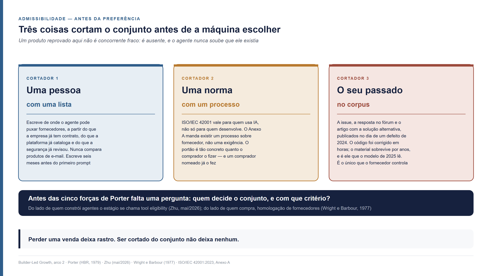
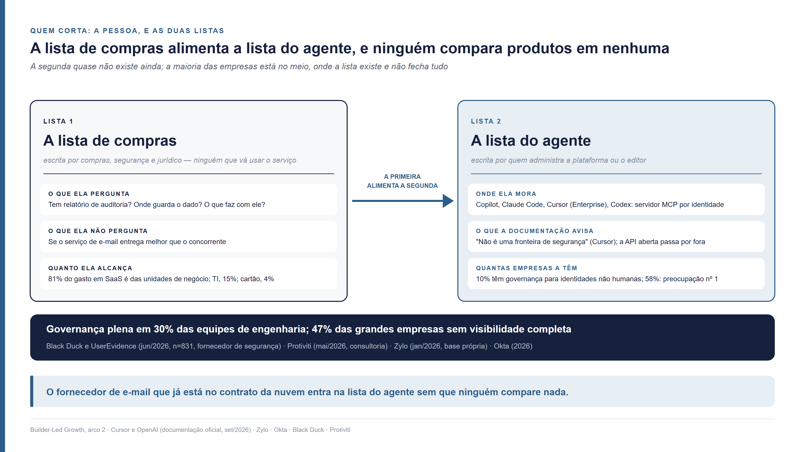
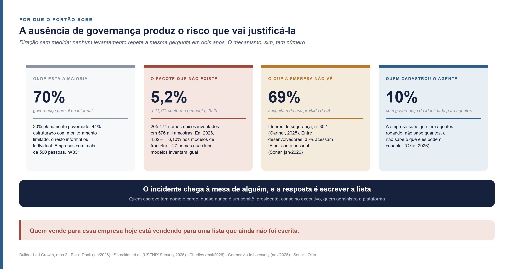
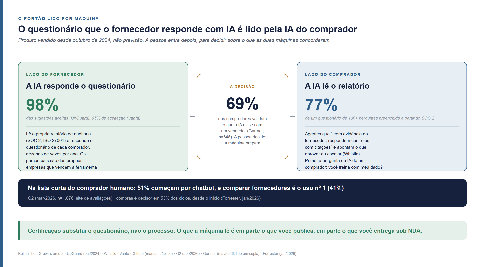
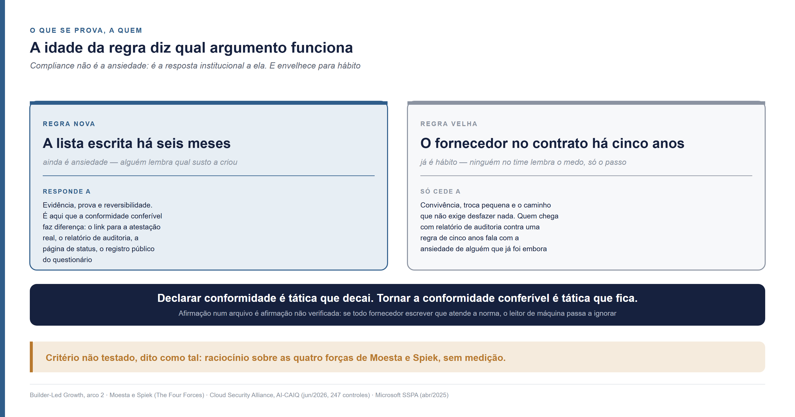

<!--
Arco 2, parte 3 da série Builder-Led Growth, por Matheus Ramos.
VERSÃO NÃO CANÔNICA. A canônica é a inglesa: ../en/arc2-03-compliance-the-list-the-ai-picks-from.md
Em caso de divergência de fato ou de número, a inglesa prevalece.
Texto congelado. Prevista no LinkedIn para 1 de outubro de 2026.
Gerado a partir do repositório privado de trabalho. Não editar aqui.
-->

# Compliance no Builder-Led Growth — como entrar na lista de onde a IA pode escolher

*Quarta peça do segundo arco desta série. Não exige as anteriores. Você sabe o
que é perder uma venda: tem proposta, tem concorrente, tem motivo anotado no
CRM. Uma empresa de 2.500 pessoas montou o próprio CRM com IA, e o serviço de
e-mail que trabalha dentro dele foi decidido seis meses antes do primeiro prompt,
por alguém que nunca vai comparar fornecedores de e-mail. Se você vende um deles,
ninguém recusou você. Você nunca esteve na lista.*

---

## Onde o fornecedor estava quando a lista foi escrita

Perder uma venda deixa rastro. A venda desta história não deixou
nenhum: o serviço de e-mail do CRM foi decidido por uma lista, meses antes de
alguém pedir o CRM, e o fornecedor que ficou de fora nunca soube que houve
lista. Antes de perguntar o que faz a máquina preferir um produto, é preciso
perguntar quem decidiu de que conjunto ela podia escolher. São três os que
cortam: uma pessoa, com uma lista; uma norma, com um processo; e o que o seu
próprio produto deixou escrito na internet no dia em que falhou.

A cena é a mesma da peça anterior desta série, com a mesa virada de novo. Uma
empresa de 2.500 pessoas precisava de um CRM com e-mail integrado, para
acompanhar as métricas de conversão e fazer follow-up com os clientes. Pessoas
não esquecem de cobrar uma proposta; elas desistem depois de poucas tentativas,
e a empresa queria que o sistema insistisse por elas. Numa terça-feira, um
desenvolvedor pediu ao agente de código que montasse o disparo dos lembretes. O
agente escreveu o código, e o e-mail saiu por um serviço que ninguém naquela
conversa escolheu. Ele estava numa lista que uma pessoa de governança de IA
tinha escrito seis meses antes, para dizer de onde o agente podia puxar
fornecedores.

Se você vende serviço de e-mail transacional e não estava nessa lista, o que
aconteceu com você não tem nome no seu CRM. Não houve proposta recusada. Não
houve concorrente que ganhou. A pessoa que escreveu a lista nunca comparou o seu
produto com o que entrou, porque a lista não foi escrita comparando produtos de
e-mail: foi escrita a partir do que a empresa já tinha contrato, do que a
plataforma já catalogava e do que a segurança já tinha revisado. O desenvolvedor
nunca viu o seu nome, e o agente também não, porque a lista chegou a ele antes
do prompt.

Michael Porter publicou em 1979 as cinco forças que medem quanto poder cada lado
tem numa indústria: rivalidade, novos entrantes, substitutos, fornecedores e
compradores
([Porter, Harvard Business Review, março de 1979](https://hbr.org/1979/03/how-competitive-forces-shape-strategy)).
As cinco pressupõem que os concorrentes estão todos no páreo e que a questão é
quanto de valor cada um captura. A cena do CRM acontece antes disso. Falta uma
pergunta anterior às cinco: **quem decide o conjunto de opções, e com que
critério?** Chamo esse estágio de **admissibilidade**, o momento em que se
disputa estar no conjunto e não ser o preferido dentro dele. Um produto
reprovado aí não é concorrente fraco: é ausente, e o agente nunca soube que ele
existia.

O estágio já tinha nome do lado de quem constrói agentes. Chenye Zhu, gerente de
produto de IA, chamou de *tool eligibility* a camada que decide quais
ferramentas um agente pode usar numa situação, separada da seleção: elegibilidade
responde "esta ferramenta é permitida neste estado?", seleção responde "entre as
permitidas, qual o modelo usa?"
([Zhu, 23 de maio de 2026](https://www.chenyezhu.com/writing/tool-eligibility-deterministic-guardrails-ai-agents/);
texto de blog pessoal). A distinção é dele. O que ele não tira dela é a
consequência para quem vende: a ferramenta inelegível não perde, some. Do lado
de quem compra, o estágio é mais antigo ainda: Peter Wright e Fredrick
Barbour descreveram em 1977 a decisão em duas fases, uma triagem que forma o
conjunto e uma escolha dentro dele
([Wright e Barbour, 1977](https://www.gsb.stanford.edu/faculty-research/working-papers/phased-decision-strategies-sequels-initial-screening)).
Em português, o mercado chama a triagem de **homologação de fornecedores**, e a
homologação vem antes da cotação. A diferença aqui é que a triagem não é do
comprador, nem da máquina que escolhe: é de um terceiro que escreve a lista e
nunca vai participar da escolha.

## A lista que corta o agente é escrita por quem não escolhe

Quem escreve a lista de compras nunca vai comparar o seu serviço de e-mail com o
concorrente, e quem administra o agente só decide de que lista ele pode puxar.
São duas listas, a primeira alimenta a segunda, e a segunda quase não existe
ainda. O que se cobra do fornecedor é diferente em cada uma, e a maioria das
empresas está no meio, onde a lista existe e não fecha tudo.

A **lista de compras** é a mais antiga das duas. É o cadastro de fornecedores
homologados: quem tem contrato assinado, quem passou pela revisão de segurança,
quem a área jurídica já leu. Ela é escrita por compras, segurança e jurídico, e
tem uma propriedade que importa para esta peça: ninguém que a escreve vai usar
o serviço de e-mail. A pessoa de segurança que aprovou o fornecedor de e-mail
não sabe, e não precisa saber, se ele entrega melhor que o concorrente. Ela sabe
se ele tem relatório de auditoria, onde guarda o dado e o que faz com ele.

A **lista do agente** é a nova. É a configuração que diz a um agente de código
quais servidores, conectores e serviços ele pode ligar. A peça anterior desta
série mostrou o aparato: o registro interno do GitHub Copilot, o arquivo gerido
do Claude Code, os controles de administrador da Lovable e da Bolt. O mesmo
existe no editor e no terminal. O Cursor tem, só no plano empresarial, um
painel em que "administradores podem controlar quais servidores MCP os usuários
podem executar", com entrada por padrão de comando ou de endereço, permissão
ferramenta a ferramenta e um interruptor que decide se o usuário pode
acrescentar servidores fora da lista
([Cursor](https://cursor.com/docs/mcp)). O Codex, da OpenAI, lê um arquivo de
requisitos em que uma lista de servidores por identidade faz o cliente "ativar
um servidor MCP só quando o nome e a identidade batem com uma entrada aprovada";
lista vazia desliga o MCP inteiro
([OpenAI](https://learn.chatgpt.com/docs/enterprise/managed-configuration)). MCP
é o *Model Context Protocol*, o protocolo pelo qual um agente se conecta a
ferramentas e serviços externos; a lista do agente é, na prática, a lista de
quem pode falar com ele por esse protocolo.

A lista do agente é escrita por quem administra a plataforma ou o editor, e
essa pessoa não escolhe fornecedor de e-mail: ela escolhe entre o que a lista de
compras já aprovou e o que a plataforma já catalogou. É por isso que a primeira
alimenta a segunda. O fornecedor de e-mail que está no contrato da nuvem já
contratada, ou no catálogo de conectores da plataforma, entra na lista do agente
sem que ninguém compare nada. O que está fora das duas não entra, e a máquina
recebe o resultado como se fosse o mundo inteiro.

Só que a segunda lista quase não existe. Segundo o relatório anual da Okta sobre
uso de aplicativos em empresas, 10% das organizações têm estratégia de
governança para identidades não humanas, a categoria em que o agente cai, e 58%
citam governança de IA e de identidade como a preocupação número um
([Okta, Businesses at Work 2026](https://www.okta.com/businesses-at-work/);
material de fornecedor de identidade, com base na própria carteira de clientes).
Do lado da lista de compras, o quadro é parecido: 30% das equipes de engenharia
em empresas com mais de 500 pessoas descrevem o uso de assistentes de IA como
plenamente governado, 44% como estruturado com monitoramento limitado, e o resto
como informal ou individual
([Black Duck e UserEvidence, 9 de junho de 2026, 831 respondentes](https://www.prnewswire.com/news-releases/ai-coding-hits-97-enterprise-adoption-new-black-duck-study-shows-governance-is-the-roi-multiplier-302794103.html);
fornecedor de segurança de aplicação, com pesquisa terceirizada). Quase metade
das grandes empresas diz não ter visibilidade completa do uso de IA pelos
funcionários
([Protiviti, 6 de maio de 2026](https://www.protiviti.com/us-en/press-release-ai-pulse-half-enterprises-lack-ai-visibility);
consultoria). A empresa de 2.500 pessoas da cena, com a lista escrita seis meses antes,
está na minoria que já escreveu.

Existe um dado que mostra onde o dinheiro de fato passa. Na base de 75 bilhões
de dólares em gasto com software sob gestão da Zylo, as unidades de negócio
controlam 81% do gasto, a área de TI controla 15%, e 4% é gasto no cartão
corporativo, sem passar por ninguém; esse 4% cresceu 267% num ano e o ChatGPT é o
aplicativo mais lançado em reembolso
([Zylo, 2026 SaaS Management Index, 29 de janeiro de 2026](https://zylo.com/news/2026-saas-management-index);
fornecedor de gestão de SaaS, base restrita aos próprios clientes). O que leio
nesses números é raciocínio, não medição: a lista de compras governa uma fatia
do que a empresa usa, e o mecanismo da peça anterior, em que o agente escolhe pelo
corpus e pelo padrão da plataforma, opera dentro da empresa com compliance, no
gasto que a lista não alcança.

Isso é o meio, onde a maioria das empresas está. A lista existe e não fecha
tudo. A documentação dos próprios editores diz isso com todas as letras: a
referência de permissões do Cursor avisa que as listas "não são uma fronteira de
segurança" e são "conveniência de melhor esforço"
([Cursor](https://cursor.com/docs/reference/permissions)); a do Codex avisa que
a filtragem de rede do ambiente isolado não alcança tráfego de servidores MCP
([OpenAI](https://learn.chatgpt.com/docs/enterprise/managed-configuration)); e
a peça anterior já mostrou que nenhuma lista impede o agente de escrever, no
código, uma chamada direta à API de qualquer serviço. Para o fornecedor de
e-mail, o meio tem uma consequência prática: a lista do agente decide o que
pode ser conectado por protocolo, e o corpus continua decidindo o que pode ser
importado por código. Quem está fora da lista ainda pode entrar pela segunda
porta, e quem está dentro da lista pode perder pela segunda porta também.

## O que uma norma decide quando quem a lê é máquina

Comprador certificado numa norma de gestão de IA tem processo obrigatório sobre
fornecedor, e processo é portão. A norma não diz o que exigir de você; diz que
exista um processo, e cada comprador define o resto. Um comprador nomeado já
definiu, e exige a norma de quem fornece IA para uso sensível.

A norma é a ISO/IEC 42001, publicada em dezembro de 2023, a primeira norma
internacional de sistema de gestão de inteligência artificial: o equivalente,
para IA, do que a ISO 27001 é para segurança da informação. Ela vale para
qualquer organização "que fornece **ou usa** produtos ou serviços que utilizam
sistemas de IA", e define a avaliação de impacto como processo de quem está
"desenvolvendo, fornecendo ou usando" esses produtos
([ISO/IEC 42001:2023, amostra pública das cláusulas 1 a 4](https://cdn.standards.iteh.ai/samples/81230/4c1911ebc9a641fcb6ee21aa09c28ad3/ISO-IEC-42001-2023.pdf)).
A palavra "usa" é a que importa para a cena: a empresa de 2.500 pessoas que
montou o CRM com IA está dentro do escopo, mesmo sem desenvolver modelo nenhum.

O que a norma diz de fornecedor está no Anexo A, a lista de controles de
referência. O controle A.10.3 manda que "a organização estabeleça um processo
para garantir que seu uso de serviços, produtos ou materiais fornecidos por
fornecedores esteja alinhado à sua abordagem de desenvolvimento e uso
responsável de sistemas de IA"; o A.10.2 manda alocar responsabilidades "entre a
organização, seus parceiros, fornecedores, clientes e terceiros"
([redação reproduzida na declaração de aplicabilidade pública da Darktrace, 3 de dezembro de 2025](https://cdn.prod.website-files.com/626ff4d25aca2edf4325ff97/6931b27220b329fdba170de2_Darktrace%20ISO%2042001%20Statement%20of%20Applicability.pdf);
o texto integral da norma é pago). Repare no verbo: a norma não manda exigir
certificação de fornecedor, nem relatório, nem questionário. Manda que exista um
**processo**, dentro do escopo que a própria empresa declarou. O portão é tão
concreto quanto o comprador o fizer.

Um comprador fez. O programa de garantia de fornecedores da Microsoft, no guia
oficial de abril de 2025, diz que "todo fornecedor que provê sistemas de IA será
obrigado a oferecer opções de garantia independente", que a ISO 42001 "pode ser
oferecida para validar conformidade" e que ela "é exigida para qualquer caso
sensível de IA", com crédito, admissão universitária, diagnóstico médico e
justiça criminal na lista de casos sensíveis
([Microsoft, Supplier Security and Privacy Assurance, versão 11, abril de 2025](https://cdn-dynmedia-1.microsoft.com/is/content/microsoftcorp/microsoft/accex/documents/presentations/FY25-Program-Guide-v11_en-US.pdf)).
A exigência vale para quem publica o sistema de IA, não para quem apenas usa um
assistente. É um comprador nomeado, com data, transformando o processo da norma
num requisito de compra. Onde isso acontece, a admissibilidade tem forma
escrita, e o fornecedor de fora sabe exatamente o que faltou.

Duas lacunas ficam à vista. A primeira: ninguém sabe quantas empresas têm a certificação. Não há registro oficial, e as
estimativas de terceiros, somando anúncios, vão de "menos de 50" em maio de 2025
a "mais de 350" em abril de 2026
([lista mantida por AI Compliance Vendors, revisada em 17 de maio de 2026](https://aicompliancevendors.com/blog/iso-42001-certified-companies-list);
agregador comercial). Os nomes com data são poucos e grandes: AWS em novembro
de 2024
([AWS](https://aws.amazon.com/blogs/machine-learning/aws-achieves-iso-iec-420012023-artificial-intelligence-management-system-accredited-certification/)),
Anthropic em janeiro de 2025
([Anthropic](https://www.anthropic.com/news/anthropic-achieves-iso-42001-certification-for-responsible-ai)).
A segunda: os números que circulam em blogs sobre a fatia de compradores que vai
exigir a norma até 2027 não têm fonte em lugar nenhum, e não os uso.

O que a norma criou, mesmo sem contagem, foi um vocabulário que a máquina
consegue ler. A Cloud Security Alliance, o consórcio que mantém o questionário
padrão de segurança em nuvem, publicou em junho de 2026 a versão 1.1 da AI
Controls Matrix, com 247 objetivos de controle em 18 domínios, mapeados para a
ISO 42001, o NIST AI RMF e o AI Act europeu, e o questionário de autoavaliação
que a acompanha, o AI-CAIQ, pode ser preenchido pelo fornecedor e submetido a um
registro público
([Cloud Security Alliance, AI Controls Matrix v1.1, 22 de junho de 2026](https://cloudsecurityalliance.org/artifacts/ai-controls-matrix-v1-1)).
Do lado da lei, o artigo 25 do AI Act europeu obriga o fornecedor de sistema de
alto risco e "o terceiro que fornece sistema, ferramenta, serviço, componente ou
processo de IA" a especificar, "por acordo escrito", a informação e o acesso
técnico necessários à conformidade, com exceção para código aberto
([AI Act, artigo 25](https://ai-act-service-desk.ec.europa.eu/en/ai-act/article-25)).
Norma, questionário e lei convergem no mesmo ponto: o que se pede ao fornecedor
é evidência estruturada, e evidência estruturada é o que uma máquina lê melhor
que uma pessoa.

## O defeito consertado em horas que corta você dois anos depois

Uma pessoa corta com uma lista e uma norma corta com um processo. O terceiro
cortador é o que ficou público sobre o seu produto no dia em que um defeito
apareceu: a issue, a resposta no fórum, o artigo com a solução alternativa. O código foi
corrigido em horas; esse material sobrevive por anos. O próximo modelo lê o
material, não o código.

O mecanismo já apareceu nesta série pelo lado bom. Quando escrevi sobre
comunidade e sinal de validação, mostrei que o material público sobre um produto
sobe devagar no corpus de treino e desce devagar. Aqui interessa o lado ruim da
mesma propriedade. Um defeito no seu serviço de e-mail, numa terça de 2024,
produz naquela semana três coisas públicas: a issue aberta no repositório, a
pergunta no fórum com a resposta de alguém que achou uma saída, e o artigo de
um desenvolvedor explicando como contornar. O time corrige o defeito na
quarta. As três coisas continuam na internet, e nenhuma delas foi atualizada,
porque o defeito já não existe para quem o corrigiu.

O modelo que treina em 2025 lê as três. Para ele, o seu produto tem aquele
defeito, e a solução alternativa é usar outra coisa. O agente que constrói o
CRM em 2026, sem lista nenhuma pela frente, recebe do modelo a instrução de
contornar um problema que foi resolvido dois anos antes. Não houve pessoa, nem
norma. O que cortou foi o seu próprio passado, sem que ninguém na empresa
soubesse que houve corte.

Isso é raciocínio, não medição: não achei estudo que meça quanto tempo um
defeito corrigido continua sendo descrito como vivo pelas respostas de um
modelo. O que existe de medido é a reprodutibilidade do que o modelo aprende
errado. No maior estudo sobre pacotes de código inventados por modelos, quando o
mesmo pedido foi repetido dez vezes, 43% dos nomes inventados reapareceram em
todas as dez execuções
([Spracklen et al., USENIX Security 2025](https://arxiv.org/abs/2406.10279)).
O que o modelo aprendeu, ele repete com consistência. Vale para o pacote que não
existe e vale, por raciocínio, para o defeito que não existe mais.

A consequência é acionável, barata e rara:
**corrigir o código não basta.** Quando o defeito já gerou material público, é
preciso fechar a issue com o texto dizendo o que mudou e em que versão,
responder na própria pergunta do fórum, e datar o artigo, ou pedir a quem o
escreveu que date. Sem isso, a correção existe no produto e não existe para a
máquina. É o único dos três cortadores que o fornecedor controla inteiro, e por
isso é o primeiro a resolver.

## Por que a lista que não existe hoje vai existir amanhã

Em sete de cada dez organizações, a governança sobre ferramenta de IA é parcial
ou informal. O que muda isso não é regulação: é o agente propor um pacote que não
existe, e ninguém na empresa saber quantos agentes estão rodando. A ausência de
governança produz o risco que vai justificá-la, e quem escreve a lista depois
disso é uma pessoa com nome e cargo, não um comitê.

Os sete em dez vêm do mesmo levantamento da seção anterior: 30% das equipes
descrevem o uso de IA como plenamente governado, e os outros 70% ficam entre
monitoramento limitado, orientação informal e adoção individual
([Black Duck e UserEvidence, 9 de junho de 2026](https://www.prnewswire.com/news-releases/ai-coding-hits-97-enterprise-adoption-new-black-duck-study-shows-governance-is-the-roi-multiplier-302794103.html)).
Não afirmo direção. Nenhum levantamento repete a mesma pergunta em dois anos
seguidos, e o que existe de série não é comparável. O que dá para descrever é o
mecanismo que empurra uma organização de um lado para o outro, com número.

O primeiro é o pacote que não existe. Quando um agente escreve código, ele
importa bibliotecas, e às vezes importa uma que nunca existiu. O estudo de
Joseph Spracklen e colegas, com 576 mil amostras de código de 16 modelos, mediu
5,2% de pacotes inventados nos modelos comerciais e 21,7% nos de código aberto,
com 205.474 nomes únicos inexistentes
([Spracklen et al., USENIX Security 2025](https://arxiv.org/abs/2406.10279);
revisado por pares). A reavaliação de maio de 2026, sobre os modelos de
fronteira daquele ano, mediu entre 4,62% e 6,10% em 199.845 pedidos, e achou 127
nomes que cinco modelos diferentes inventam de forma idêntica, dos quais 53
ainda podiam ser registrados por qualquer pessoa
([Churilov, 16 de maio de 2026](https://arxiv.org/abs/2605.17062); pesquisador
independente). A taxa caiu, e o risco ficou: um nome que cinco modelos inventam
igual é um nome que um atacante pode registrar com código malicioso dentro, e o
próximo agente instala. Seth Larson, da Python Software Foundation, cunhou o
termo para isso em abril de 2025, *slopsquatting*
([Seth Larson](https://www.linkedin.com/in/sethmlarson/)).

O segundo número é o que a organização não vê. Num levantamento da Gartner com
302 líderes de segurança, entre março e maio de 2025, 69% suspeitavam ou tinham
evidência de que funcionários usavam IA generativa pública proibida
([Gartner, via Infosecurity Magazine, 20 de novembro de 2025](https://www.infosecurity-magazine.com/news/gartner-40-firms-hit-shadow-ai/);
o comunicado original devolveu erro de acesso, e o número foi lido em cobertura
de imprensa). Entre desenvolvedores, 35% acessam ferramentas de IA por conta
pessoal, não pela corporativa
([Sonar, State of Code 2026, 8 de janeiro de 2026, mais de 1.100 respondentes](https://www.sonarsource.com/company/press-releases/sonar-data-reveals-critical-verification-gap-in-ai-coding/);
fornecedor de análise de código). Os 10% da Okta com governança de identidade
para agentes, da seção anterior, fecham o quadro: a empresa sabe que tem agentes
rodando, não sabe quantos, e não sabe o que eles podem conectar.

Junte os dois números e a sequência se explica sozinha. O que segue é
raciocínio, não medição. A empresa sem lista deixa o agente importar o que quiser. Em algum
momento ele importa um nome que não existe, ou conecta um serviço que ninguém
revisou, e o incidente chega à mesa de alguém. A resposta é escrever a lista.
**A ausência de governança produz o risco que vai justificá-la.** Quem vende
para essa empresa hoje está vendendo para uma lista que ainda não foi escrita,
e a pergunta útil não é se ela vai existir, mas quem vai escrevê-la e a partir
de quê.

A resposta tem nome e cargo, e quase nunca é um comitê. Quando procurei empresas
descrevendo publicamente quem decide quais ferramentas de IA os funcionários
podem usar, as decisões que vieram a público foram de liderança: o presidente
da Microsoft, Brad Smith, disse numa audiência no Senado dos Estados Unidos, em
8 de maio de 2025, que "na Microsoft não permitimos que nossos funcionários usem
o aplicativo do DeepSeek", por causa de onde os dados ficam
([TechCrunch, 8 de maio de 2025](https://techcrunch.com/2025/05/08/microsoft-employees-are-banned-from-using-deepseek-app-president-says)).
A Unilever descreve um processo em que cada caso de uso de IA, inclusive os
comprados de fornecedor, passa por uma plataforma de avaliação e "as decisões
finais são de um conselho executivo sênior" com jurídico, recursos humanos e
tecnologia
([Davenport e Cartledge, MIT Sloan Management Review, 15 de novembro de 2023](https://sloanreview.mit.edu/article/ai-ethics-at-unilever-from-policy-to-process)).
Os comitês de ética de IA mais documentados governam os produtos que a própria
empresa constrói, não a lista de fornecedores. O padrão de "centro de excelência
que aprova ferramenta" existe no material de quem vende a implantação desse
centro, e não achei empresa descrevendo o próprio em fonte própria. Para quem
vende, isso muda o destinatário: a lista tem uma pessoa por trás, ou uma função,
e é com ela que a evidência precisa chegar.

## O portão que também é uma máquina lendo

A máquina virou cliente porque escolhe, e no compliance ela virou cliente por
outro caminho: lê o relatório de auditoria do fornecedor e responde o
questionário do comprador. Comparar fornecedores já é o uso número um de chatbot
entre quem compra software, e a decisão continua sendo de uma pessoa.

O mercado chama de **TPRM**, *third-party risk management*, a gestão de risco de terceiros: o
conjunto de etapas pelo qual uma empresa avalia um fornecedor antes de deixá-lo
tocar seus dados. O instrumento central é o questionário de segurança, e a
evidência central é o **SOC 2**, o relatório de auditoria independente sobre os
controles de segurança de um fornecedor, definido pela associação americana de
contadores públicos. Um fornecedor de e-mail que quer entrar na lista de compras
de uma empresa grande responde a esse questionário e entrega esse relatório, e
faz isso dezenas de vezes por ano, uma para cada comprador. O comprador, do
outro lado, lê dezenas de relatórios de fornecedores diferentes. A máquina faz
bem esse tipo de trabalho, e já está fazendo.

Os dois lados apareceram no mesmo comunicado, em 30 de outubro de 2024. A
UpGuard, que vende plataforma de gestão de risco de terceiros, anunciou no mesmo
dia uma função para o comprador, em que a IA lê o SOC 2 do fornecedor e preenche
cerca de 77% de um questionário de mais de cem perguntas, e uma função para o
fornecedor, em que a IA responde o questionário do comprador com 98% das
sugestões aceitas
([UpGuard, 30 de outubro de 2024](https://www.upguard.com/press/upguard-launches-enhanced-ai-powered-suite);
os percentuais são da própria empresa). A Whistic descreve agentes que "leem
evidência do fornecedor, respondem controles com citações" e apontam o que a
equipe precisa aprovar ou escalar, lendo SOC 2, ISO e fichas de modelo
([Whistic](https://www.whistic.com/vendor-assessments); fornecedor). A Vanta,
do lado do fornecedor, vende respostas de questionário com 95% de aceitação e,
do lado do comprador, cita um cliente dizendo que "a IA extrai os detalhes mais
importantes para não termos que vasculhar a documentação do fornecedor"
([Vanta](https://www.vanta.com/products/ai); fornecedor). Ninguém deu nome ao
fenômeno, então descrevo sem nome: **o questionário que o fornecedor responde
com IA é lido pela IA do comprador.** A pessoa entra depois, para decidir sobre
o que as duas máquinas concordaram.

O que essa máquina pergunta primeiro, quando o fornecedor é de IA, já está
escrito por um comprador. O GitLab publica o próprio processo de homologação de
fornecedor no manual da empresa, e nele a avaliação de um fornecedor que usa IA
começa por saber "se o fornecedor usa conteúdo do GitLab ou de clientes para
desenvolver, treinar, retreinar ou ajustar" modelos; uma função nova de IA que
cria um subprocessador é mudança material e reabre a avaliação
([GitLab, manual público, lido em 9 de setembro de 2026](https://gitlab.com/gitlab-com/content-sites/handbook/-/raw/main/content/handbook/security/security-assurance/security-risk/third-party-risk-management.md)).
O mesmo manual diz o que a certificação faz e o que ela não faz: para sistema que
toca dado sensível, SOC 2 ou ISO 27001 é a evidência de primeira linha, e quem
não tem cai para autoatestação por questionário. **Certificação substitui o
questionário, não o processo.** O fornecedor de e-mail com relatório de
auditoria pula a troca de planilhas; não pula a revisão.

O leitor de máquina não está só no portão de segurança. Está na lista curta do
comprador humano, com número. Num levantamento da G2 com 1.076 compradores de
software B2B, em março de 2026, 51% começam a pesquisa por um chatbot de IA em
vez de por um buscador, contra 29% um ano antes; **comparar fornecedores é o uso
número um, com 41%**; 69% dizem ter escolhido um fornecedor diferente por
orientação do chatbot, e 33% compraram de um que não conheciam
([G2, 15 de abril de 2026](https://www.prnewswire.com/news-releases/new-g2-research-half-of-b2b-software-buyers-now-start-their-research-with-ai-chatbots-302742807.html);
a G2 é site de avaliações e tem interesse em que a IA cite avaliações). A
Gartner, com 645 compradores entre agosto e setembro de 2025, mediu 45% usando
IA generativa na compra, "principalmente para reunir informação sobre
fornecedores e produtos", e 69% validando o que a IA disse com um vendedor
([Gartner, 20 de maio de 2026, lido em cópia integral](https://www.marketscreener.com/news/gartner-survey-finds-69-of-b2b-buyers-turn-to-sales-reps-to-validate-ai-generated-insights-ce7f5ad9db8cf524);
o comunicado original devolveu erro de acesso). A Forrester mede que compras é
decisor em 53% dos ciclos, "desde o início"
([Forrester, State of Business Buying 2026, 21 de janeiro de 2026](https://www.forrester.com/press-newsroom/forrester-2026-the-state-of-business-buying/);
sem tamanho de amostra público).

Daí seguem três coisas. A primeira: o portão de compliance já é, em parte, uma
máquina lendo, em produto vendido e não em previsão. A segunda: a lista curta do
comprador humano passa por um chatbot em quatro de cada dez casos, e o chatbot
lê o que está publicado sobre você. A terceira limita as outras duas: a decisão
continua humana. Os 69% que validam com um
vendedor são o mesmo número, em duas populações, e o comprador que usa
plataforma de gestão de risco lê a frase "você é o dono da decisão" na tela.
O que a máquina faz no portão é preparar a decisão, e o que ela lê para
prepará-la é, em parte, o que você publicou e, em parte, o que você entregou
sob acordo de confidencialidade. A parte publicada é a que o fornecedor controla
sozinho. A parte entregue é a que o compliance sempre pediu, e agora tem um
leitor a mais.

## O que se prova, a quem, e por que depende da idade da regra

Declarar conformidade num arquivo que a máquina lê é tática que decai. Tornar a
conformidade conferível, com evidência que se confere sem acreditar em você, é
tática que fica. O argumento certo depende de quanto
tempo tem a regra que está na sua frente, porque regra velha já não é o medo de
ninguém. É aí que a venda que ninguém perdeu deixa de ser mistério.

Se o portão lê os arquivos do fornecedor, o fornecedor pode pôr neles a evidência de que atende norma e especificação, e o
argumento de contratação chega junto com o produto, sem depender de uma conversa
comercial que talvez nunca aconteça. É uma prática antiga de mercado, estar
perto de quem escreve os requisitos antes de o edital existir, transposta para o
lugar onde a máquina lê. Só que a ideia tem uma versão frágil e uma durável, e a
diferença entre as duas separa a tática que decai da que fica. Afirmação num arquivo
é afirmação não verificada. Se todo fornecedor escrever no próprio arquivo que
atende a norma, o sinal se degrada, e o leitor de máquina passa a ignorá-lo. A
versão durável é a evidência que pode ser conferida sem acreditar em você: o
link para a atestação real, para o relatório de auditoria, para a página de
status, para o registro público do questionário. **Declarar conformidade é
tática que decai. Tornar a conformidade conferível é tática que fica.** Quando
escrevi sobre acessibilidade operacional, chamei isso de verificável e
reversível; aqui é a mesma propriedade, aplicada ao que o compliance pede.

O destinatário dessa evidência é uma pessoa ou uma função: a decisão pública
de ferramenta foi de presidente, de conselho
executivo, de quem administra a plataforma. É essa pessoa que a prática antiga
mandava procurar antes do edital. A diferença é que agora ela lê, ou manda a
máquina ler, e o que ela lê primeiro é o que a máquina já resumiu.

O que essa pessoa está sentindo quando lê depende de uma coisa que quase nenhum
fornecedor olha: a idade da regra. Bob Moesta e Chris Spiek descreveram as
quatro forças que agem sobre qualquer troca, o empurrão do que não serve mais e a
atração do novo de um lado, a ansiedade com a mudança e o hábito do que já existe
do outro ([Moesta e Spiek, The Four Forces](https://jobstobedone.org/the-four-forces/)).
Compliance não é a ansiedade. É a resposta institucional a ela: alguém teve medo
de que um dado vazasse, e a organização escreveu uma regra para conter aquele
medo. A parte que muda a tática é o que acontece depois. Regra seguida por dois
anos deixa de ser contenção de medo e vira rotina; ninguém no time lembra qual
susto a criou, e o que sobra é o passo. Compliance envelhece para hábito.

Daí sai um critério que é raciocínio meu e não foi testado: **a idade da regra
diz qual argumento funciona.** Regra nova ainda é ansiedade, e responde a
evidência, prova e reversibilidade; é o caso da lista escrita seis meses antes na
empresa da cena. É aí que a conformidade conferível faz diferença. Regra velha
já é hábito, e só cede a convivência, a troca pequena e ao caminho que não exige
desfazer nada; é o caso do fornecedor de e-mail que está no contrato há cinco
anos, e contra ele o argumento de conformidade fala com a ansiedade de alguém
que já foi embora. Quem chega numa organização com relatório de auditoria contra
uma regra de cinco anos está respondendo a uma pergunta que ninguém está mais
fazendo. Quem chega com o mesmo relatório numa organização que escreveu a lista
há seis meses está respondendo à única pergunta que existe.

A venda que ninguém perdeu tem, agora, três endereços. O serviço de e-mail que
entrou no CRM da empresa de 2.500 pessoas entrou por uma lista escrita seis
meses antes, a partir de um contrato que já existia e de uma revisão que uma máquina ajudou a fazer. O
fornecedor que ficou de fora foi cortado em três lugares, e nos três ele tinha
alcance sem precisar de uma conversa comercial: podia estar no contrato da nuvem
que a empresa já paga, ou no catálogo da plataforma; podia ter a evidência
conferível no lugar onde a máquina do comprador lê; e podia ter fechado, com
data e versão, o material público do defeito de 2024. Nenhuma das três coisas é
marketing, e nenhuma é venda. São as três formas de existir para uma lista que
ainda vai ser escrita.

Se a governança que ainda não existe é o que produz o risco que vai
justificá-la, então a lista está sendo escrita agora em sete de cada dez
organizações, e quem torna a conformidade conferível antes de ela subir compra
posição barata. Isso resolve a admissibilidade. Não resolve a escolha. Entre os
fornecedores que sobraram no conjunto, o que faz a máquina preferir um, e por
quanto tempo essa preferência dura, é o assunto da próxima peça desta série.

---

**Série Builder-Led Growth**, por Matheus Ramos. Segundo arco:

- [Arco 2, parte 0: Do PLG ao BLG — o que continua valendo quando quem escolhe é um par](arco2-00-do-plg-ao-blg.md)
- [Arco 2, parte 1: O funil do Builder-Led Growth — as três etapas e o que acelera a passagem](arco2-01-o-funil-e-o-eixo-da-delegacao.md)
- [Arco 2, parte 2: Candidatura no Builder-Led Growth — como ser escolhido por uma IA para além do GEO](arco2-02-candidatura-para-alem-do-geo.md)
- Arco 2, parte 3: Compliance no Builder-Led Growth — como entrar na lista de onde a IA pode escolher (este texto)
- [Agentic commerce e Builder-Led Growth — o que muda para growth e engenharia](arco2-07-comercio-agentico.md)

O primeiro arco, para quem quiser o percurso completo:

- [Parte 1 — Quando a máquina também é seu cliente](01-quando-a-maquina-e-cliente.md)
- [Parte 2 — A decisão, o preço e o que medir](02-decisao-preco-e-medicao.md)
- [Parte 3 — O imposto que a máquina cobra e o humano não vê](03-legibilidade-por-maquina.md)
- [Parte 4 — Quantas vezes o agente precisa chamar um humano](04-acessibilidade-operacional.md)
- [Parte 5 — O poço de onde todos bebem](05-comunidade-e-sinal-de-validacao.md)
- [Parte 6 — A máquina é imprensa e leitor ao mesmo tempo](06-relacoes-publicas.md)
- [Parte 7 — O que faz o agente confiar, e por que a competência dele é o problema](07-confianca-e-seguranca.md)
