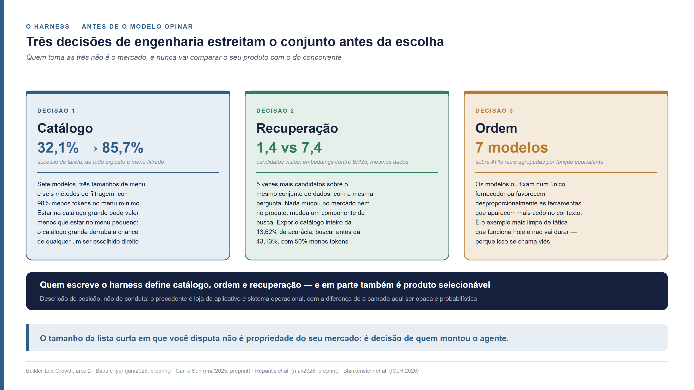
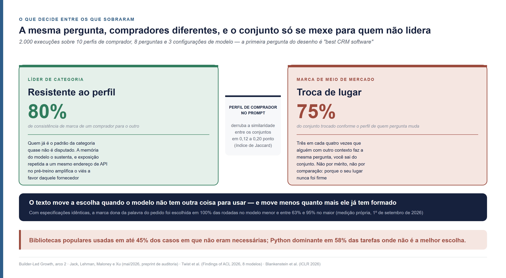
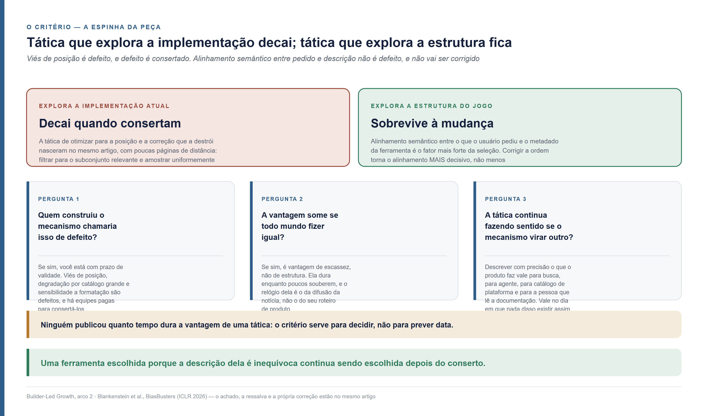
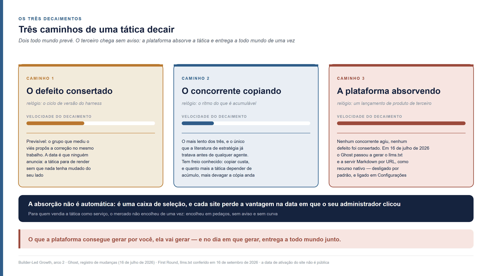
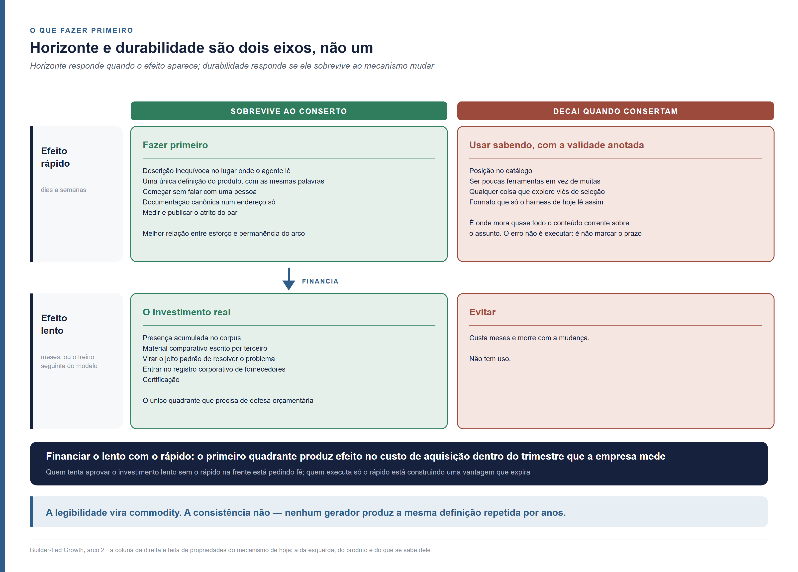

<!--
Arco 2, parte 4 da série Builder-Led Growth, por Matheus Ramos.
VERSÃO NÃO CANÔNICA. A canônica é a inglesa: ../en/arc2-04-recommendation-the-tactic-that-lasts.md
Em caso de divergência de fato ou de número, a inglesa prevalece.
Texto congelado. Prevista no LinkedIn para 13 de outubro de 2026.
Gerado a partir do repositório privado de trabalho. Não editar aqui.
-->

# Recomendação no Builder-Led Growth — como separar a tática que dura da que vai ser consertada

*Quinta peça do segundo arco desta série. Não exige as anteriores. O seu produto
chegou à lista de onde o agente de IA escolhe, e o do concorrente também. Numa
empresa de 2.500 pessoas, com os dois disponíveis, o agente pegou o concorrente —
e o motivo que ele escreveu não falava do produto escolhido, falava do texto
publicado sobre ele. Seis meses depois, quem venceu parou de vencer sem que
nenhum concorrente fizesse nada.*

---

Na última década, quem vende software aprendeu a crescer convencendo pessoas.
Primeiro com anúncio, conteúdo e vendedor. Depois deixando o próprio produto
fazer esse trabalho, no que o mercado chama de **PLG**, *product-led growth*,
crescimento liderado pelo produto: a pessoa experimenta, percebe o valor sozinha
e decide. O termo foi popularizado em meados da década de 2010 pela OpenView, com
[Blake Bartlett](https://www.linkedin.com/in/blakebartlett), e codificado em livro
por [Wes Bush](https://www.linkedin.com/in/wesbush) em 2019.

**BLG** é *builder-led growth*, o nome que dei em julho de 2026 a um fenômeno
que não cabe nesse modelo: **um agente de código recomenda ou adota a sua
ferramenta enquanto constrói outra coisa.** Um desenvolvedor pede ao Claude Code,
ao Codex ou ao Cursor que monte um sistema, e o agente, no meio do trabalho,
escolhe o serviço de e-mail, o banco de dados, a biblioteca de pagamento. Ninguém
abriu concorrência entre fornecedores. Quem decidiu foi o que chamo de builder.
Builder é o par: a pessoa e o agente juntos.

Nesta série, o caminho de um produto até dentro do projeto tem três etapas. Na
**candidatura**, o produto está no conjunto de onde o agente escolhe. Na
**construção**, ele entrou no código, e ainda dá para tirar. Na **adoção**, ele
virou premissa do que foi entregue, e tirar custa refatoração. Dentro da
candidatura age uma força que o mercado chama de **recomendação**: entre os
produtos que estão no conjunto, qual deles o agente escolhe.

Quem trabalha com crescimento já tem ferramenta para mexer em recomendação. Na
busca, ela se chama SEO, *search engine optimization*, otimização para motor de
busca. Nas respostas dos assistentes de IA, chama-se GEO, *generative engine
optimization*, termo cunhado por Pranjal Aggarwal e coautores em novembro de 2023
([arXiv 2311.09735](https://arxiv.org/abs/2311.09735)). As duas vêm com listas de
táticas, e as listas misturam dois tipos que parecem iguais. Algumas táticas
aproveitam um defeito do agente de hoje, e defeito, nessa indústria, tem equipe
paga para consertar. Outras aproveitam o jeito como a escolha funciona, e
continuam valendo depois do conserto.

Este texto traz três respostas. O que decide a escolha do agente antes de o
modelo opinar, e quem leva vantagem entre os produtos que estão no conjunto, com
os números de seis estudos publicados entre 2025 e 2026. Um critério de três
perguntas para saber se uma tática vai durar, e os três caminhos pelos quais ela
perde valor. Uma grade para decidir o que fazer primeiro, com a conta que defende
orçamento para o que demora a render.

## Onde o fornecedor estava quando o conjunto foi montado

A escolha do agente não começa no modelo. Antes de ele ver qualquer nome, três
decisões de engenharia já estreitaram o conjunto: quantas ferramentas entram no
**catálogo**, em que **ordem** elas aparecem, e que componente faz a
**recuperação**, isto é, vai buscar as opções e as põe na frente do modelo. As
três moram no **harness**, termo que o mercado usa em inglês para o aparato que
monta e opera o agente em volta do modelo — e algumas das empresas que escrevem
harness também vendem produto que esse harness pode escolher.

A empresa desta história tem 2.500 pessoas. O caso é composto, montado a partir
de padrões publicados, e acompanha as últimas peças desta série. Ela montou o
próprio CRM com um agente de código. Alguém de governança de IA tinha escrito,
meses antes, a lista de fornecedores de onde o agente podia puxar. O seu produto
está nela. O do concorrente também. Numa terça-feira, o desenvolvedor pede o
disparo dos lembretes por e-mail, o agente escreve o código, e o e-mail sai pelo
concorrente.

Você pode ler o motivo, porque o agente escreve o motivo. Ele não diz "é mais
popular". Diz "simples de integrar" e "boa entregabilidade" — atributos, com
cara de análise. Só que ninguém mediu entregabilidade naquela conversa. O agente
não abriu a sua documentação, não comparou preço, não rodou teste. Ele produziu
uma justificativa depois de já ter escolhido, e a escolha veio de algo anterior
à pergunta.

Esse algo anterior é o harness. É ele que decide o que o agente pode chamar, em
que ordem vê as opções, o que é buscado e trazido para a frente dele antes de ele
responder. O Claude Code, o Codex e o Cursor são harnesses. A plataforma de
construção assistida que monta um aplicativo inteiro no navegador é um harness.
Quem configura qualquer um dos três dentro da empresa está escrevendo harness
também. Cada uma dessas camadas mexe no conjunto antes de o modelo opinar.

A primeira decisão é o **catálogo**: quantas ferramentas ficam visíveis. O efeito
dela é maior do que parece. Num levantamento com sete modelos, três tamanhos de
menu de ferramentas e seis métodos de filtragem, o sucesso de tarefa foi de 32,1%
com todas as ferramentas expostas para 85,7% quando um filtro reduzia o menu ao
mínimo necessário, com cerca de 98% menos tokens consumidos
([Babu e Iyer, 13 de junho de 2026](https://arxiv.org/abs/2606.15508); preprint,
ainda sem revisão por pares). O mesmo modelo, com o mesmo pedido, acerta duas
vezes e meia mais quando vê menos opções. Para quem vende, a leitura é
desconfortável: **estar no catálogo grande pode valer menos que estar no menu
pequeno**, porque o catálogo grande derruba a chance de qualquer um ser escolhido
direito.

A segunda decisão é a **recuperação**: que componente vai buscar as opções e
trazê-las. Dois números medem isso. O primeiro é grosso e é o mais fácil de
explicar: expor o catálogo inteiro ao modelo entregou 13,62% de acurácia de
seleção de ferramenta, enquanto buscar antes e mostrar só o que interessa
entregou 43,13%, com mais de 50% menos tokens de prompt
([Gan e Sun, 6 de maio de 2025](https://arxiv.org/abs/2505.03275); preprint). O
segundo é mais fino, e é ele que decide o tamanho da disputa. Num
trabalho que mede qual deve ser o tamanho da lista curta que se mostra ao agente,
os autores rodaram o mesmo conjunto de dados com dois componentes de busca
diferentes. Com um recuperador de embeddings — que compara significado —, a
profundidade aprendida foi de **1,4 candidato**. Com BM25 — que compara palavras
—, foi de **7,4**
([Repantis, Gawde, Singh e Blackwell II, 23 de maio de 2026](https://arxiv.org/abs/2605.24660);
preprint, e os autores declaram que o escopo é apenas se a ferramenta certa
**aparece** no conjunto, não se a execução está correta).

Cinco vezes mais candidatos, sobre os mesmos dados, com a mesma pergunta. Nada
mudou no mercado, no seu produto ou no que o usuário pediu. Mudou uma peça de
engenharia dentro do harness. **O tamanho da lista curta em que você disputa não
é propriedade do seu mercado: é decisão de quem montou o agente**, e essa pessoa
nunca vai comparar o seu produto com o do concorrente.

A terceira decisão é a **ordem**. Num estudo com sete modelos, sobre um banco de
APIs reais agrupadas por função equivalente, os modelos ou fixaram num único
fornecedor ou favoreceram desproporcionalmente as ferramentas que apareciam mais
cedo no contexto
([Blankenstein e coautores, versão de câmera do ICLR 2026](https://arxiv.org/abs/2510.00307);
revisado por pares, com as APIs raspadas de um repositório real e as consultas
geradas por modelo). A ordem é também o exemplo mais limpo de tática que funciona
hoje e não vai durar.

Falta dizer quem toma as três decisões, e a resposta é estrutural. Os
laboratórios que constroem os modelos ocupam uma posição que nenhum outro
participante ocupa: são, ao mesmo tempo, **produto que pode ser selecionado e
construtores do mecanismo que seleciona**. Quem escreve o harness define
catálogo, ordem e recuperação — as três forças acima.

Isso é descrição de posição, não de conduta, e a distinção importa. Dono de
plataforma que também vende dentro da própria plataforma é situação antiga, com
precedente em loja de aplicativo e em sistema operacional, e décadas de regulação
e de jurisprudência tratando dela. O que muda aqui é a natureza da camada: uma
vitrine de loja de aplicativo é auditável de fora — dá para abrir, ordenar,
comparar. A camada de seleção de um agente é opaca e probabilística. A mesma
pergunta, no mesmo dia, pode devolver conjuntos diferentes, e não há prateleira
para fotografar.

## Quem já é o padrão da categoria quase não é disputado

Entre os que sobraram no conjunto, quem já é o padrão da categoria quase não é
disputado. A mesma pergunta, feita por pessoas diferentes, troca até três quartos
das marcas recomendadas para quem está no meio do mercado e quase nada para quem
lidera. O texto que você escreve move a escolha do modelo, e move menos quanto
mais esse modelo já tem formado sobre a sua categoria.

O número vem de uma auditoria que usa, como exemplo, exatamente o caso desta
série. Quatro pesquisadores rodaram 2.000 execuções sobre 10 perfis de comprador,
8 perguntas e 3 configurações de modelo, para medir quanto o contexto de quem
pergunta muda a lista de marcas que volta. A primeira pergunta do desenho é, ao
pé da letra, *"best CRM software"* — a mesma coisa que a empresa de 2.500 pessoas
foi montar sozinha.

O resultado tem duas metades, e a segunda é a que interessa a quem vende. Prefixar
a mensagem com um perfil de comprador derruba a similaridade entre os conjuntos
recomendados, numa medida de sobreposição chamada índice de Jaccard, de 0,12 a
0,20 ponto. Só que o efeito **não é igual para todo mundo**: marcas líderes de
categoria são resistentes ao perfil, mantendo cerca de **80%** de consistência de
marca entre um comprador e outro, enquanto marcas de meio de mercado trocam até
**75%** do conjunto conforme o perfil muda
([Jack, Lehman, Maloney e Xu, 28 de maio de 2026](https://arxiv.org/abs/2605.30207);
preprint de auditoria, e uma das três células medidas apoia-se em apenas 4
agrupamentos de pergunta, com intervalo de confiança correspondentemente mais
largo).

Leia de novo pelo lado de quem não lidera. Três em cada quatro vezes que alguém
com um contexto diferente faz a mesma pergunta, você sai do conjunto. Não por
mérito, não por comparação, não porque alguém preferiu outro. Porque o seu lugar
no conjunto nunca foi firme.

A mesma assimetria aparece quando o agente escolhe biblioteca em vez de marca. No
primeiro estudo empírico sobre as preferências de modelos entre bibliotecas e
linguagens, com oito modelos, bibliotecas amplamente adotadas foram usadas em até
**45%** dos casos em que o uso não era necessário e divergia da solução de
referência; em tarefas de alto desempenho em que Python não é a melhor escolha,
ele continuou sendo a escolha dominante em **58%** dos casos, e Rust não foi
usado uma única vez
([Twist, Harman, Syme, Noppen, Yannakoudakis, Nauck e Zhang, Findings of ACL 2026](https://arxiv.org/abs/2503.17181);
revisado por pares, versão de 4 de junho de 2026). A conclusão dos autores é
curta: modelos podem priorizar familiaridade e popularidade sobre adequação e
otimalidade para a tarefa.

A peça que fecha o mecanismo está no estudo de Blankenstein e coautores, o mesmo
que mediu o efeito da ordem. Exposição repetida a um mesmo endereço de API
durante o pré-treino **amplifica o viés em favor daquele fornecedor**
([Blankenstein e coautores, ICLR 2026](https://arxiv.org/abs/2510.00307)). Quer
dizer: o material que se acumula sobre você na internet ao longo de anos não fica
parado esperando ser lido no momento da escolha. Ele entra na formação do
conjunto, por dentro do modelo, antes de qualquer harness. Quem tem volume ganha
duas vezes — no que o modelo traz de memória e no peso que ele dá ao que aparece
na frente dele.

Existe um contrapeso, e é ele que mantém a disputa aberta para quem não
lidera. Em 1º de setembro de 2026 rodei um experimento com quatro provedores de
e-mail fictícios, que o modelo nunca tinha visto, com especificações idênticas —
mesmo preço, mesmos limites, mesma API — e diferentes só no parágrafo de marca.
Quando o pedido dizia que nenhum e-mail podia deixar de chegar, ganhava a marca
cujo texto prometia confiabilidade. Quando pedia rapidez, ganhava a que prometia
simplicidade. Foi assim em 100% das rodadas no modelo menor e entre 63% e 95% no
maior. **O texto move a
escolha quando o modelo não tem outra coisa para usar.** O que a auditoria de
perfis acrescenta é o limite disso: o texto move menos quanto mais o modelo já
tem formado sobre a categoria. São duas forças na mesma balança, e para quem não
é líder a balança pende para o lado errado.

A resposta honesta à pergunta "o que faz a máquina preferir um?", então, é
desconfortável e tem duas partes. **Se você já é o padrão da categoria, quase
nada move a escolha contra você. Se não é, quase tudo move — inclusive contra
você.** A segunda parte é onde a maioria dos produtos está, e onde a escolha de
tática decide o resultado.

## Como saber se você está explorando um defeito

Aparecer cedo na lista de ferramentas que o agente lê aumenta a chance de ser
escolhido. A tática funciona hoje, está medida em sete modelos, e vai durar
pouco — e dá para saber disso antes de investir nela com uma pergunta só: a
tática depende de o agente estar implementado do jeito que está hoje, ou da
estrutura do jogo? Viés de posição é defeito, defeito é consertado, e descrição
inequívoca continua vencendo depois do conserto.

Na prática, a tática vira disputa por posição: estar entre as primeiras
integrações que o catálogo de uma plataforma mostra, ou entre as primeiras
ferramentas declaradas na configuração que o agente recebe. Uma pessoa que
trabalha com crescimento lê o resultado de Blankenstein e coautores sobre a ordem
e enxerga ali um canal. A tática é barata, dá para demonstrar num gráfico, e
**vai morrer**.

Ela vai morrer porque ninguém que constrói agentes considera isso uma
propriedade desejável. Chama-se viés, e o mesmo grupo que o mediu propôs, no
mesmo trabalho, a correção: filtrar as ferramentas para o subconjunto relevante e
depois amostrar de forma uniforme entre elas, o que reduz substancialmente o viés
de seleção sem perder cobertura de tarefa
([Blankenstein e coautores, ICLR 2026](https://arxiv.org/abs/2510.00307)). A
tática de otimizar para a posição e a correção que a destrói nasceram no mesmo
artigo, com poucas páginas de distância.

Agora ponha do lado o outro achado do mesmo estudo: o **alinhamento semântico
entre o que o usuário pediu e o metadado da ferramenta — nome, descrição e
parâmetros — é o fator mais forte da seleção**. Ninguém vai corrigir isso. Não é
defeito. É o mecanismo funcionando: o agente precisa casar necessidade com
descrição, e uma descrição que diz com precisão o que a ferramenta faz continua
sendo a melhor descrição depois de qualquer conserto de viés. Corrigir a ordem
torna o alinhamento semântico **mais** decisivo, não menos.

Daí sai o critério que sustento:

> **Tática que explora a implementação atual decai quando a implementação muda.
> Tática que explora a estrutura do jogo sobrevive à mudança.**

Três perguntas aplicam o critério a qualquer tática que você leia por aí, e as
três se respondem em minutos:

- **Quem construiu o mecanismo chamaria isso de defeito?** Se a resposta for sim,
  você está com prazo de validade. Viés de posição, degradação por catálogo
  grande e sensibilidade a formatação de prompt são defeitos, e existem equipes
  pagas para consertá-los.
- **A vantagem some se todo mundo fizer igual?** Se sim, é vantagem de escassez,
  não de estrutura. Ela dura enquanto poucos souberem, e o relógio dela é o da
  difusão da notícia, não o do seu roteiro de produto.
- **A tática continua fazendo sentido se o mecanismo virar outro?** Descrever com
  precisão o que o produto faz vale para busca, para agente, para catálogo de
  plataforma e para a pessoa que lê a documentação. Vale também no dia em que
  nada disso existir na forma atual.

Um limite precisa ficar dito com todas as letras, porque ele não se resolve com
mais pesquisa neste momento. **Ninguém publicou quanto tempo dura a vantagem de
uma tática nesse mercado.** Não existe medição de quantos meses separam
"descobri" de "não funciona mais", nem série histórica que acompanhe uma tática
do começo ao fim. Tudo que este texto diz sobre durabilidade é raciocínio
apoiado em mecanismo, não número. O critério acima serve para decidir; não serve
para prever data.

## Três caminhos de uma tática decair

Uma tática perde valor por três caminhos: o defeito que ela aproveita é
consertado, o concorrente copia, ou a plataforma onde você publica passa a fazer
a tática por todo mundo. Os dois primeiros todo mundo prevê. O terceiro chega sem
aviso, porque não depende de ninguém agir contra você: a plataforma absorve a
tática, gera o que você fazia à mão e entrega a todo mundo de uma vez, num
lançamento de produto. Em 16 de julho de 2026 isso aconteceu com um dos arquivos
que quem trabalha com legibilidade por máquina — a capacidade de a máquina ler,
entender e usar o seu produto sem ambiguidade — vinha recomendando publicar.

O **primeiro caminho** é o defeito consertado, e o relógio dele é o ciclo de
versão de quem constrói o harness. O conserto é previsível, porque o grupo que
mediu o viés de posição propôs a correção no mesmo trabalho. A data é que ninguém
anuncia: a tática para de render, e a métrica cai sem que nada tenha mudado do
seu lado.

O **segundo caminho** é o concorrente copiando. É o mais lento dos três e o único
que a literatura de estratégia já tratava antes de qualquer agente existir. Ele
tem um freio conhecido: copiar custa, e quanto mais a tática depender de algo
acumulado — presença em corpus, material de terceiro, histórico — mais devagar a
cópia anda.

O **terceiro caminho** não tem contrapartida nos outros dois, e é o mais rápido.
A plataforma sobre a qual você trabalha embute a tática e passa a entregá-la
pronta para todos os seus clientes no mesmo dia. Nenhum concorrente agiu. Nenhum
defeito foi consertado. A sua vantagem evapora por um lançamento de produto de
terceiro.

O caso é concreto e tem data. O `llms.txt` é um arquivo posto na raiz
de um site com um índice do conteúdo em formato que a máquina lê sem esforço — um
dos itens que quem trabalha com legibilidade por máquina vinha recomendando
publicar. Fazer isso à mão dá trabalho: exige gerar o índice, mantê-lo em dia e
servir cada página numa versão limpa. Em **16 de julho de 2026** o Ghost, gestor
de conteúdo usado por muitas publicações, passou a oferecer isso como recurso
nativo: ligado o interruptor, o sistema gera o `llms.txt` na raiz do domínio e
serve a versão em Markdown de qualquer post quando se acrescenta `.md` à URL. Só
conteúdo público entra; post de assinante aparece com título e resumo, sem o
corpo ([Ghost, 16 de julho de 2026](https://ghost.org/changelog/geo/)).

Dá para ver o resultado funcionando. A First Round Review, publicação de uma
gestora de capital de risco, serve o arquivo hoje, e ele se identifica sozinho:
*"Public Ghost content for AI and LLM tooling"*, com a instrução de acrescentar
`.md` a qualquer URL
([First Round](https://review.firstround.com/llms.txt), conferido em 16 de
setembro de 2026). Não foi a publicação que construiu aquilo. Foi a plataforma
dela. A data em que aquele site específico ligou o interruptor não é pública, e
não consegui confirmá-la.

Um detalhe do lançamento muda a forma do decaimento, e ele está na redação do
próprio Ghost: o recurso **vem desligado por padrão** para sites que já existiam,
e se liga em Configurações. A absorção, então, não é automática — é uma caixa de
seleção. Isso a torna instantânea e gratuita para quem liga, e desigual entre
sites: cada um perde a vantagem na data em que o seu administrador clicou, não na
data do lançamento. Para quem vendia a tática como serviço, o mercado não
encolheu de uma vez; encolheu em pedaços, sem aviso e sem curva.

O fornecedor de e-mail que venceu naquela terça-feira venceu porque a descrição
dele casava com o que o pedido pedia. Seis meses depois, o catálogo da
plataforma passou a escrever a descrição no lugar dos fornecedores, e os
serviços de e-mail da categoria passaram a aparecer com a mesma frase — em
catálogo de plataforma a descrição costuma ser de quem cataloga, e há catálogo
em que dois concorrentes diretos recebem texto idêntico. A frase que o vencedor
tinha escrito deixou de ser dele. Ninguém o tirou da lista: ele continua lá,
com a mesma qualidade de entrega, e parou de ser escolhido. Quem estava
construindo vantagem sobre aquele parágrafo descobriu que o parágrafo não era
um ativo — era uma janela.

Essa é a forma geral, e ela vale muito além de um arquivo ou de um campo de
catálogo. **O que a plataforma consegue gerar por você, ela vai gerar — e no dia
em que gerar, entrega a todo mundo junto.**

## Horizonte e durabilidade decidem o que se faz primeiro

Quando tudo parece urgente, o que se faz primeiro é o que é rápido e durável ao
mesmo tempo. Horizonte responde quando o efeito aparece; durabilidade responde se
ele sobrevive ao mecanismo mudar, e são dois eixos, não um. Cruzados, dão quatro
quadrantes, e só um deles precisa de defesa orçamentária.

A confusão que esses dois eixos desfazem é comum e cara. O mercado costuma
ordenar tática por velocidade, numa fila que vai do que rende dentro do
trimestre ao que rende no ano seguinte, e dentro dessa fila trata tudo que é
rápido como
equivalente. Não é. Uma tática rápida que morre no próximo harness e uma tática
rápida que continua valendo depois dele custam quase o mesmo e entregam coisas
diferentes.

**Horizonte** é quando o efeito aparece: dias e semanas de um lado, meses ou o
treino seguinte do modelo do outro. **Durabilidade** é se o efeito sobrevive
quando o mecanismo muda, e quem responde por ela é a pergunta sobre
implementação ou estrutura.
Cada tática ocupa uma casa, e a casa diz o que fazer com ela.

O quadrante **rápido e durável** é onde se começa, sem meio-termo e sem consolo.
É a melhor relação entre esforço e permanência de todo este arco: custa uma tarde
e continua valendo depois de qualquer conserto de harness. Descrever sem
ambiguidade o que o produto faz, no lugar onde o agente lê, cabe aqui. Ter uma
única definição do produto, com as mesmas palavras em todos os lugares, também.
Permitir que alguém comece sem falar com uma pessoa, idem.

O quadrante **rápido e efêmero** é onde mora quase todo o conteúdo corrente sobre
o assunto. Ele funciona, é fácil de demonstrar e decai — posição no catálogo,
qualquer coisa que explore viés de seleção, e o que depende de um formato que só
o harness de hoje lê daquele jeito. Não é para evitar: é para **usar sabendo**,
com a data de validade anotada ao lado da meta. O erro não é executar; é executar
sem marcar o horizonte e depois planejar o ano em cima do resultado.

O quadrante **lento e durável** é o investimento real. Presença acumulada no
corpus, material comparativo escrito por terceiro, virar o jeito padrão de
resolver um problema, entrar no registro corporativo de fornecedores, obter
certificação. **É o único quadrante que precisa de defesa orçamentária**, e o
motivo é aritmético: o efeito dele não aparece dentro do horizonte que a empresa
usa para avaliar o investimento. É o que as finanças chamam de *competitive
advantage period*, período de vantagem competitiva — o tempo em que uma empresa
sustenta retorno acima do custo de capital. Michael Mauboussin e Paul Johnson o
chamaram, no título do artigo que o apresentou em 1997, de motor de valor
negligenciado
([Mauboussin e Johnson, Financial Management, 1997](https://www.jstor.org/stable/3666168);
[Michael Mauboussin](https://www.linkedin.com/in/michael-mauboussin-12519b2)).

O quadrante **lento e efêmero** custa meses e morre com a mudança. Não tem uso.

A recomendação prática que fecha os quatro é uma só, e é a que eu usaria numa
conversa de orçamento: **financiar o lento com o rápido**. As táticas do primeiro
quadrante produzem efeito mensurável no custo de aquisição dentro do trimestre
que a empresa mede, e é com esse resultado na mão que se sustenta o pedido de
verba para a parte que só rende depois. Quem tenta aprovar o investimento lento
sem o rápido na frente está pedindo fé; quem executa só o rápido está construindo
uma vantagem que expira.

A conta que sustenta esse pedido cabe em quatro linhas, e nenhuma delas precisa
de ferramenta nova. Primeiro: quantos projetos entraram usando o seu produto
neste trimestre sem que ninguém do comercial falasse com quem construiu — o
denominador da candidatura, que sai do seu próprio registro de primeiro uso.
Segundo: quantos deles nomearam o produto no pedido e quantos o receberam do
agente, que se separa perguntando na primeira interação e custa um campo.
Terceiro: o custo da tática rápida que produziu o segundo número, que é tempo de
quem escreveu a descrição e a documentação, em horas. Quarto: os dois primeiros
divididos pelo terceiro, comparados com o custo de aquisição do canal que a
empresa já financia.

O que essa conta faz numa conversa de orçamento é deslocar o ônus. Sem ela, o
pedido de verba para o investimento lento é uma tese sobre o futuro, e tese sobre
o futuro perde para número sobre o presente em qualquer comitê. Com ela, o
investimento lento vira a continuação de um canal que já demonstrou custo por
projeto, e a discussão deixa de ser "isso funciona?" para ser "quanto a mais". É
a mesma travessia que o crescimento liderado por produto fez quando passou a
medir ativação em vez de argumentar sobre ela.

Uma ressalva que eu não consigo remover: as quatro linhas medem o que entrou, e
não medem o que não entrou. Quem foi descartado antes do primeiro uso não aparece
em registro nenhum, e o custo de aquisição calculado assim é otimista por
construção. Nenhum instrumento público hoje mede a entrada que não aconteceu, e
enquanto não houver, a conta serve para defender orçamento e não serve para
dimensionar mercado.

## O empurrão que ninguém está medindo

Nenhuma descrição move um par que não está procurando nada. Empurrão não se
fabrica — quebrar o que a pessoa já usa não é tática —, mas ele costuma já
existir sem estar sendo percebido, e revelá-lo é a única tática que fica mais
forte com o tempo em vez de decair.

Bob Moesta e Chris Spiek descreveram as quatro forças que agem sobre qualquer
troca: o empurrão do que não serve mais e a atração do novo de um lado, a
ansiedade com a mudança e o hábito do que já existe do outro
([Moesta e Spiek, The Four Forces](https://jobstobedone.org/the-four-forces/);
[Bob Moesta](https://www.linkedin.com/in/bobmoesta)). A frase da fonte que mais
importa aqui é literal: **sem empurrão, não há busca**. Todo o trabalho de
descrição, catálogo e recuperação age sobre a atração. Se
o empurrão não existe, ele age sobre ninguém.

Empurrão não se fabrica de forma honesta, porque fabricá-lo seria quebrar o que a
pessoa já usa. O que dá para fazer é outra coisa, e é subaproveitada: **o
empurrão quase sempre já existe e não está sendo percebido**. A equipe convive
com o atrito há tanto tempo que parou de contá-lo como custo. Revelar esse
atrito, com número, é o trabalho.

Três formas de revelar, e as três são mensuráveis por quem está do outro lado:

- **Contar as paradas.** Em sete dias de trabalho, quantas vezes o agente
  precisou chamar um humano por causa da ferramenta atual? Quase ninguém mede isso, e é um número
  que dói quando aparece, porque cada parada tem um nome e um horário.
- **Publicar uma referência que permita autodiagnóstico.** Não o comparativo do
  seu produto contra o do concorrente — uma medida de atrito que qualquer pessoa
  possa aplicar ao próprio ambiente e obter um resultado sobre si mesma.
- **Mostrar o custo do retrabalho.** Quanto de token, de tempo e de correção
  humana o caminho atual consome por entrega. É a mesma conta que a empresa já
  faz para infraestrutura, aplicada à ferramenta.

Uma régua separa isso de propaganda, e ela não admite ajuste: **o instrumento tem
de funcionar mesmo para quem não vai trocar de fornecedor**. Se a medida só dá
resultado bonito quando aponta para você, é comparativo disfarçado, e quem
recebe percebe na primeira execução.

Repare onde esta tática cai na grade, porque ela é a única que não se encaixa
em nenhum dos quatro quadrantes do jeito esperado. Não
depende da implementação atual de harness nenhum. Não some se o concorrente
copiar, porque um segundo instrumento de medição de atrito no mercado só reforça
a prática de medir. **Nenhuma plataforma consegue absorvê-la**, porque não há o que
gerar: a medida vive no ambiente do cliente, não no seu site. Ela é a única coisa
aqui que fica mais forte com o tempo, à medida que mais gente mede e o número
vira linguagem comum.

## O que nenhuma plataforma gera por você

Depois que a plataforma gera tudo que ela consegue gerar, sobra uma coisa só. O
arquivo é gerado; o conteúdo dele não. Nenhum gerador sabe se a definição do seu
produto está formulada de cinco jeitos incompatíveis ao longo das suas páginas, e
é por isso que a legibilidade vira commodity e a consistência não.

Cada tática deste mercado cai numa das quatro casas, e a divisão fica assim:

Na coluna das táticas que decaem estão posição no catálogo, ser poucas
ferramentas em vez de muitas, o que explora viés de seleção e o formato que só o
harness de hoje lê daquele jeito. Tudo ali é propriedade do mecanismo de hoje. Na
coluna das que sobrevivem estão descrição inequívoca, uma definição única do
produto, presença acumulada no corpus e certificação. Tudo ali é sobre o seu
produto e sobre o que se sabe dele, e nada disso muda quando o harness muda de
versão.

A absorção pela plataforma corta essa grade na diagonal, e é aí que ela deixa de
ser assustadora. O que uma plataforma consegue gerar é o que tem forma previsível:
um índice, um arquivo, um campo de catálogo, uma versão limpa de uma página. Tudo
isso é **legibilidade**, e legibilidade vira
commodity pelo mesmo motivo que qualquer coisa gerável vira: no dia em que o
gerador existe, todo mundo tem.

O que nenhum gerador produz é **consistência**: a mesma definição do produto, com
as mesmas palavras, ao longo de tudo que se publicou sobre ele. A plataforma sabe
listar as suas páginas. Ela não sabe se, ao longo dessas páginas, você se
descreveu de cinco jeitos que não batem entre si — e essas cinco descrições
chegam ao modelo como cinco vozes disputando o mesmo lugar. Consistência não é
gerável porque não é formato: é decisão, repetida por anos, sobre o que a empresa
diz que é.

Dois resultados medidos sustentam essa diferença. Alinhamento semântico entre o pedido e a descrição
é o fator mais forte da seleção, e não vai ser corrigido porque não é defeito.
Exposição repetida forma a preferência dentro do modelo antes de qualquer
harness. As duas coisas premiam quem diz a mesma coisa do mesmo jeito por tempo
suficiente. Nenhuma caixa de seleção entrega isso.

Ser preferido não é ser adotado. O produto escolhido numa terça-feira pode ser trocado na quinta sem
que ninguém cancele nada, sem reunião, sem nota no CRM — o projeto simplesmente
passa a usar outra coisa, e o descarte não deixa métrica. O que segura um produto
depois de ele já ter sido escolhido, e por que se sustentar só na máquina não
produz resultado melhor, é o assunto da próxima peça desta série.

---

**Série Builder-Led Growth**, por Matheus Ramos. Segundo arco:

- [Arco 2, parte 0: Do PLG ao BLG — o que continua valendo quando quem escolhe é um par](arco2-00-do-plg-ao-blg.md)
- [Arco 2, parte 1: O funil do Builder-Led Growth — as três etapas e o que acelera a passagem](arco2-01-o-funil-e-o-eixo-da-delegacao.md)
- [Arco 2, parte 2: Candidatura no Builder-Led Growth — como ser escolhido por uma IA para além do GEO](arco2-02-candidatura-para-alem-do-geo.md)
- [Arco 2, parte 3: Compliance no Builder-Led Growth — como entrar na lista de onde a IA pode escolher](arco2-03-compliance-a-lista-de-onde-a-ia-escolhe.md)
- Arco 2, parte 4: Recomendação no Builder-Led Growth — como separar a tática que dura da que vai ser consertada (este texto)
- [Agentic commerce e Builder-Led Growth — o que muda para growth e engenharia](arco2-07-comercio-agentico.md)

O primeiro arco, para quem quiser o percurso completo:

- [Parte 1 — Quando a máquina também é seu cliente](01-quando-a-maquina-e-cliente.md)
- [Parte 2 — A decisão, o preço e o que medir](02-decisao-preco-e-medicao.md)
- [Parte 3 — O imposto que a máquina cobra e o humano não vê](03-legibilidade-por-maquina.md)
- [Parte 4 — Quantas vezes o agente precisa chamar um humano](04-acessibilidade-operacional.md)
- [Parte 5 — O poço de onde todos bebem](05-comunidade-e-sinal-de-validacao.md)
- [Parte 6 — A máquina é imprensa e leitor ao mesmo tempo](06-relacoes-publicas.md)
- [Parte 7 — O que faz o agente confiar, e por que a competência dele é o problema](07-confianca-e-seguranca.md)
