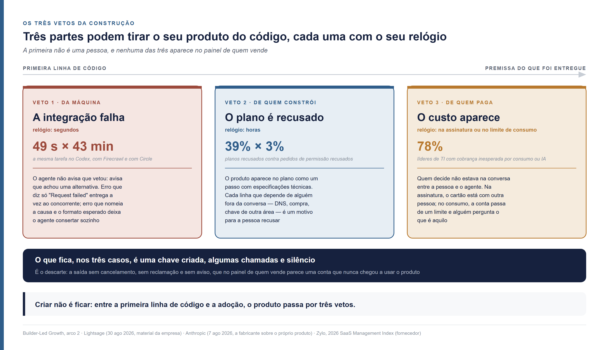
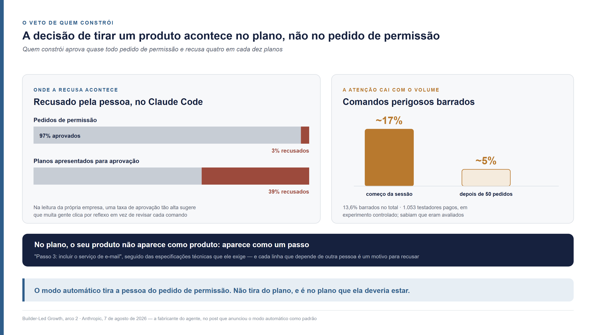
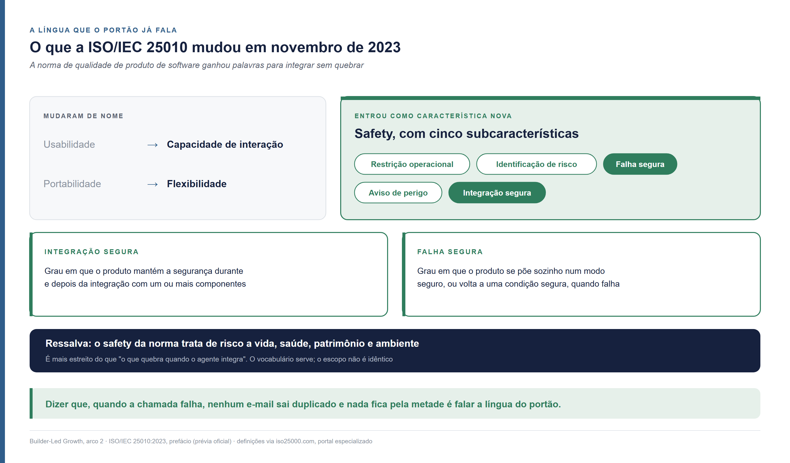
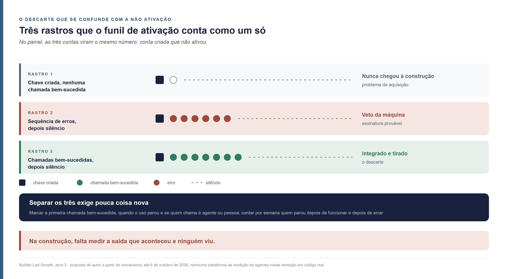
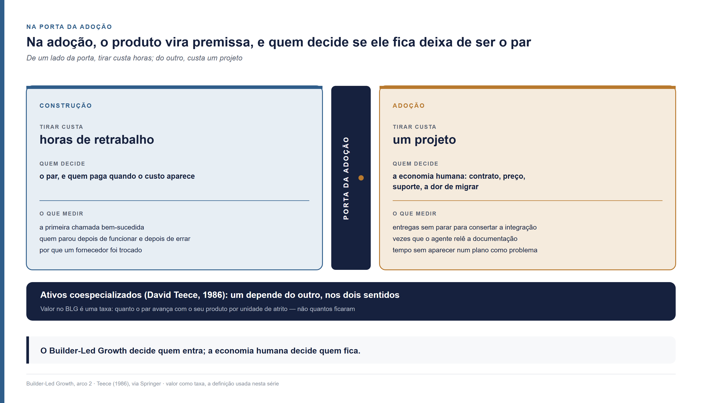

<!--
Arco 2, parte 5 da série Builder-Led Growth, por Matheus Ramos.
VERSÃO NÃO CANÔNICA. A canônica é a inglesa: ../en/arc2-05-construction-what-keeps-your-product-in-the-code.md
Em caso de divergência de fato ou de número, a inglesa prevalece.
Texto congelado. Prevista no LinkedIn para 20 de outubro de 2026.
Gerado a partir do repositório privado de trabalho. Não editar aqui.
-->

# Construção no Builder-Led Growth — o que segura o seu produto no código depois que a IA o escolhe

*Sexta peça do segundo arco desta série. Não exige as anteriores. Na terça-feira,
o agente de IA escolheu o seu produto para o sistema que uma empresa estava
construindo. Na quarta, ele já estava no código. Na sexta, não estava mais, e
ninguém cancelou nada, ninguém reclamou, ninguém abriu um chamado. No seu painel,
a única marca é uma chave de acesso que fez três chamadas.*

---

Na última década, quem vende software aprendeu a crescer convencendo pessoas.
Primeiro com anúncio, conteúdo e vendedor. Depois deixando o próprio produto
fazer esse trabalho, no que o mercado chama de **PLG**, *product-led growth*,
crescimento liderado pelo produto: a pessoa experimenta, percebe o valor sozinha
e decide. O termo foi popularizado em meados da década de 2010 pela OpenView, com
[Blake Bartlett](https://www.linkedin.com/in/blakebartlett), e codificado em livro
por [Wes Bush](https://www.linkedin.com/in/wesbush) em 2019.

**BLG** é *builder-led growth*, o nome que dei em julho de 2026 a um fenômeno
que não cabe nesse modelo: **um agente de código recomenda ou adota a sua
ferramenta enquanto constrói outra coisa.** Um desenvolvedor pede ao Claude Code,
ao Codex ou ao Cursor que monte um sistema, e o agente, no meio do trabalho,
escolhe o serviço de e-mail, o banco de dados, a biblioteca de pagamento. Quem
decide é o que chamo de builder. Builder é o par: a pessoa e o agente juntos.

Nesta série, o caminho de um produto até dentro de um projeto tem três etapas. Na
**candidatura**, ele está no conjunto de onde o agente escolhe. Na **construção**,
ele entrou no código, e ainda dá para tirar. Na **adoção**, ele virou premissa do
que foi entregue, e tirar custa refatoração. As peças anteriores trataram de como
se entra no conjunto, de como se é cortado dele e do que decide a escolha. Esta
trata do que acontece depois que a escolha deu certo.

Quem vende já tem instrumento para essa fase. Mede ativação, tempo até a primeira
chamada, quantas contas criadas chegam a usar o produto. Quem constrói também
tem a sua crença pronta: acredita que aprova o que o agente faz, porque o agente
pergunta antes de agir. As duas coisas falham no mesmo ponto. Na construção existem três vetos, cada um com o próprio relógio, e nenhum deles
aparece no painel de quem vende. Quando um deles tira o seu produto do código, o
que acontece é o que chamo aqui de **descarte**: a saída sem cancelamento, sem
reclamação e sem aviso, que no painel de quem vende se parece com uma conta que
nunca chegou a usar o produto. Quem constrói, por sua vez, exerce o veto onde quase não
presta atenção e deixa de exercê-lo onde a decisão acontece.

Este texto traz três respostas, dos dois lados da mesa. Quais são os três vetos
da construção e o que dispara cada um, com os números que os fabricantes dos
próprios agentes publicaram entre fevereiro e agosto de 2026. O que quem vende pode desenhar para cada veto e onde quem constrói deveria pôr a atenção. Como
distinguir, no seu próprio registro, o produto que foi tirado do produto que nunca chegou a funcionar e o que medir quando ele finalmente vira premissa.

## O produto entrou no código e ainda pode sair

Entrar no código é raro, e sair continua barato. A construção começa quando
existe a primeira linha de código que chama o seu produto, e a partir dali o
custo de tirá-lo é de algumas horas de retrabalho, sem dado migrado e sem usuário
afetado.

A empresa desta história tem 2.500 pessoas. O caso é composto, montado a partir
de padrões publicados, e acompanha as últimas peças desta série. Ela decidiu
construir o próprio CRM — o sistema de gestão de clientes — com um agente de código em vez de comprar um pronto, o
que já não é exceção: numa pesquisa da Retool com 817 construtores, 35% já tinham
substituído ao menos uma ferramenta comprada por construção própria, e 78%
esperavam construir mais em 2026
([Retool, 17 de fevereiro de 2026](https://retool.com/blog/ai-build-vs-buy-report-2026);
a Retool vende plataforma de construção interna, e a amostra é de clientes dela).

Desta vez, o seu produto é o escolhido. Na terça-feira, o desenvolvedor pediu ao
agente o disparo dos lembretes de proposta por e-mail, e o agente pôs o seu
serviço no plano. Na quarta, pede que ele configure o envio. É aqui que esta peça
começa.

Chegar até essa quarta-feira é mais difícil do que parece. Num estudo com 26.760
pedidos de alteração de código escritos por cinco agentes — Claude Code, Cursor,
Devin, Copilot e Codex —, em 1.832 repositórios públicos com mais de cem estrelas,
os agentes importaram bibliotecas que o projeto já tinha em 29,5% dos casos, mas
acrescentaram uma dependência nova em apenas **1,3%**
([Twist e Zhang, arXiv 2512.11589](https://arxiv.org/abs/2512.11589), versão de
27 de janeiro de 2026, aceito na trilha de desafio da conferência MSR 2026; o
recorte são projetos de código aberto maduros, não plataformas de construção
assistida). O agente prefere o que já está no projeto. Quando ele traz algo novo,
é um evento.

Quando o evento acontece em escala, ele muda o negócio de quem é trazido. Em 4 de
junho de 2026, o cofundador da Supabase, Paul Copplestone, disse ao anunciar uma
captação: *"we've seen a 600% increase in databases year-over-year. Claude Code
is the largest contributor since the start of the year. Agents are now deploying
the majority of databases on our platform"*
([PR Newswire](https://www.prnewswire.com/news-releases/supabase-raises-500m-at-10-5b-to-accelerate-lead-in-agentic-infrastructure-302791787.html);
o número é de bancos criados, num comunicado de captação da própria empresa).

Criar não é ficar. Entre a primeira linha de código e o momento em que o produto
vira premissa do que foi entregue, ele passa por três pessoas que podem tirá-lo
de lá — e a primeira delas não é uma pessoa.

## O primeiro veto é da máquina

Quando a integração falha, quem troca de fornecedor primeiro é o agente. Ele não
avisa que está vetando: avisa que encontrou uma alternativa.

A Lightsage, empresa que vende medição do comportamento de agentes de código,
descreve o que acontece em cada tipo de falha. Quando a instalação do pacote
falha, o agente *"recommends alternative"*. Quando o import falha, *"suggests
competitor"*. Quando a chamada à API — a interface pela qual um programa usa o serviço de
outro — falha, *"switches recommendation"*. Quando
o erro é pouco claro, *"can't troubleshoot, moves on"*
([Lightsage, 28 de abril de 2026](https://lightsage.com/blog/how-coding-agents-decide-which-sdk-to-use)).
É descrição da própria empresa, sem contagem de quantas vezes cada coisa
acontece, vinda de quem vende o instrumento que mede.

O tamanho da diferença entre produtos, a mesma empresa mediu. Numa tarefa igual
para todos, executada pelo Codex, a integração com a Firecrawl terminou em 49
segundos e 6 chamadas de ferramenta. A com a Circle levou 43 minutos e 129
chamadas. As APIs lentas, segundo o levantamento, *"had unclear error messages,
inconsistent response shapes, and complex auth flows that agents struggled to
navigate"*
([Lightsage, 30 de agosto de 2026](https://lightsage.com/blog/how-to-track-agent-recommendations-api-sdk-cli-mcp)).

Na quarta-feira do CRM, a primeira chamada ao seu serviço volta com um erro de
autenticação que diz só "Request failed". O agente tenta de novo, recebe a mesma
frase e escreve ao desenvolvedor que encontrou um serviço "mais simples de
configurar". O desenvolvedor lê uma linha, concorda, e o descarte acontece antes de qualquer
pessoa ter decidido tirar o seu produto.

### Do lado de quem vende

O veto da máquina tem relógio de segundos, e o seu produto se defende dele com
duas coisas que o agente consegue ler no meio da falha.

**A mensagem de erro que diz o que fazer.** A diferença que a Lightsage aponta é
concreta: *"Invalid API key format. Expected: ak_live_xxx or ak_test_xxx"*
permite ao agente consertar sozinho; *"Error 401"* não permite, e o agente segue
adiante. Erro que nomeia a causa e o formato esperado mantém o seu produto no
código. Erro genérico entrega a vez ao concorrente.

**A versão que o agente aprendeu.** O agente escreve o código a partir do que
viu no treinamento, e o que ele viu pode ser a versão de dois anos atrás. O
exemplo da mesma empresa é o agente chamando o caminho `/v1/users` quando a API
atual está na terceira versão. É aqui que mora a gestão da informação: onde a
documentação vive, como ela é versionada e o que acontece com a versão antiga
quando a nova sai. A versão antiga que responde com um erro dizendo onde está a
nova dá ao agente o caminho de volta. A que simplesmente some troca o seu produto
por um que o agente conhece melhor. Essa última parte é uma ideia minha, a partir do mecanismo. Se você mantém uma
API com mais de uma versão no ar, já viu isso acontecer?

### Do lado de quem constrói

A troca feita pelo agente cai num tipo de decisão que quase ninguém revisa. A
Anthropic separou, em sessões do Claude Code, as decisões de plano — o que fazer,
que abordagem tomar, o que conta como pronto — das de execução — que arquivos
mudar, que código escrever, *"what language to write in"*, que comandos rodar. Em
média, *"people make about 70% of the planning decisions but only 20% of the
execution decisions"*
([Anthropic, 16 de junho de 2026](https://www.anthropic.com/research/claude-code-expertise);
um classificador atribui cada decisão à pessoa ou ao agente, e é a própria
fabricante analisando o próprio produto). Trocar o serviço de e-mail porque a
chamada falhou é execução. Fica com a máquina em quatro de cada cinco casos.

Com a experiência, a parte delegada cresce. Entre usuários novos do
Claude Code, *"roughly 20% of sessions use full auto-approve, which increases to
over 40% as users gain experience"*
([Anthropic, 18 de fevereiro de 2026](https://www.anthropic.com/research/measuring-agent-autonomy)).
Quem constrói há mais tempo delega mais a execução, e é na execução que o veto
da máquina acontece.

Existe um jeito barato de ver esse veto. Uma linha nas instruções do projeto pedindo que o agente avise sempre que trocar
um fornecedor por outro, e diga por quê, transforma o veto da máquina numa
decisão que a pessoa vê. A troca pode até ser a certa. O que não pode é a empresa
descobrir, seis meses depois, que o serviço de e-mail do CRM é um que ninguém
escolheu e que ninguém sabe por que está lá. Essa é uma ideia minha. Teste você e me diga o que achou.

## O segundo veto mora no plano, não no pedido de permissão

Quem constrói aprova quase todo pedido de permissão e recusa quatro em cada dez
planos. A decisão de tirar um produto acontece no plano. O pedido de permissão,
que parece ser o momento do controle, virou reflexo.

A Anthropic publicou os dois números juntos, em 7 de agosto de 2026: *"users
approve 97% of permission prompts in Claude Code"*. Na leitura da própria
empresa, *"an approval rate that high suggests many users are
clicking through reflexively rather than reviewing each command"*. No mesmo
texto: *"when Claude presents a plan for approval, users reject 39% of them. But
for individual permissions requests, the rejection rate is only 3%"*
([Anthropic, 7 de agosto de 2026](https://claude.com/blog/auto-mode-default-in-claude-code)).

O mesmo post traz um experimento controlado com 1.053 testadores profissionais
pagos, em que comandos perigosos foram misturados a comandos comuns. A revisão
humana barrou 13,6% dos perigosos. A atenção ainda cai com o volume: as pessoas
*"blocked about 17% of dangerous commands early in a session, dropping to about
5% after 50 or more prior prompts"*. Os participantes sabiam que estavam sendo
avaliados, sem saber o quê. A ressalva maior é de quem publica: é a fabricante do agente justificando que o modo
automático vire o padrão, que foi exatamente o que o post anunciou.

Na quarta-feira do CRM, suponha que o seu serviço passou pelo veto da máquina. O agente volta com o plano dos lembretes, e o seu produto aparece nele do jeito
que costuma aparecer: não como uma escolha entre fornecedores, mas como um passo.
"Passo 3: incluir o serviço de e-mail para o disparo dos lembretes", com o nome do
seu produto. Logo abaixo, as especificações técnicas que ele exige: verificar o
domínio de envio, acrescentar três registros no DNS — o sistema que diz à internet
que servidor responde por um domínio —, guardar uma chave de produção numa
variável de ambiente e cadastrar um endereço de retorno para avisos de entrega.
Quatro linhas. O desenvolvedor lê "registros no DNS" e "verificar o domínio",
pensa na semana que isso vai levar e escreve: "usa o que a gente já tem". O descarte acontece no plano, sem nenhum pedido de permissão recusado.

A irritação que move essa recusa não tem medida em fonte nenhuma. Os fabricantes
falam em atrito e em fadiga de aprovação sem publicar métrica. O que está medido
é onde a recusa acontece.

### Do lado de quem vende

O plano é a vitrine que importa na construção, e o seu produto não aparece nele
como produto. Aparece como um passo — "incluir o serviço de e-mail" — seguido das
especificações técnicas que ele exige. Quem escreve esse passo é o agente, a
partir do que o seu produto pede. Cada especificação que depende de alguém fora
da conversa — um registro de DNS, uma aprovação de compra, uma chave que só outra
área libera — vira uma linha abaixo do passo, e cada linha é um motivo para a
pessoa recusar.

A pergunta que vale fazer sobre o seu produto é o que o plano mostra dele. Quantas
linhas ele ocupa, quantas dependem de outra pessoa e quantas o agente faz
sozinho. Um serviço que permite começar com uma chave de teste e um domínio
compartilhado, e deixa a verificação do domínio próprio para quando houver
volume, aparece no plano com uma linha. O mesmo serviço, exigindo tudo antes do
primeiro envio, aparece com quatro. A peça sobre acessibilidade operacional, no
primeiro arco, contou essas paradas uma a uma. Na construção elas aparecem juntas,
no mesmo parágrafo, no momento exato em que a pessoa decide.

### Do lado de quem constrói

Os números da Anthropic dizem onde a atenção rende. Revisar cada pedido de
permissão rende pouco: quase tudo é rotina, e depois de cinquenta pedidos quase
ninguém lê mais. Revisar o plano rende muito, porque é ali que o fornecedor aparece, como um passo
e uma lista de especificações. O que esse passo quase nunca traz é o que a pessoa
precisaria para decidir: quanto custa e como se desfaz.

A leitura de um plano com fornecedor novo cabe em três perguntas. Esse serviço
já está na lista de fornecedores da empresa? Quanto ele custa no volume que este
sistema vai ter? Se for preciso trocá-lo daqui a seis meses, quanto do código
muda? As três se respondem pedindo ao próprio agente, antes de aprovar. O modo
automático, que a Anthropic anunciou em 7 de agosto de 2026 como padrão dos
planos individuais e de equipe do Claude Code, tira a pessoa do pedido de
permissão. Não tira do plano, e é no
plano que ela deveria estar.

## O terceiro veto chega quando o custo aparece

Quem paga veta no momento em que o custo aparece. Esse momento pode chegar antes
da primeira chamada ao seu produto, na hora de assinar, ou semanas depois, quando
o consumo passa de um limite. Nos dois casos, quem decide é alguém que não
estava na conversa entre a pessoa e o agente.

Vivi o primeiro caso. Numa empresa em que trabalhei, precisávamos de uma API para
consultar CPF — o cadastro de pessoas físicas da Receita Federal — e outros dados
cadastrais. O cartão de crédito das assinaturas ficava com o financeiro, e
qualquer contratação precisava de autorização e de uma justificativa do gasto. Na
construção com o Claude Code, o fornecedor que apareceu era o mais caro. Com o
orçamento que tínhamos, mudamos a arquitetura: combinamos APIs públicas com
serviços mais baratos para reduzir o gasto ao mínimo. O fornecedor foi trocado
ainda na construção, antes de existir qualquer fatura. É um caso só, o meu.

O mecanismo por trás dele aparece em lugares bem diferentes. Uma empresa de
software de vendas que testou o cadastro com e sem cartão de crédito explicou
parte do resultado assim: *"a lot of high-quality prospects for our software are
employees - without immediate access to a company credit card"*
([PhoneBurner, 27 de junho de 2022](https://www.phoneburner.com/blog/what-removing-credit-cards-from-our-saas-signup-did-to-our-revenue);
relato de uma empresa sobre o próprio teste). Quem usa o produto raramente tem o
cartão. Quando o produto pede o cartão, chama para a decisão quem tem.

O segundo momento é o do consumo. Num levantamento com líderes de TI publicado em
2026 pela Zylo, empresa que vende gestão de gastos com software, *"77% encountered
unexpected costs that surfaced after a contract was signed"*, e *"78% experienced
unexpected charges tied to consumption or AI features in the past year"*. O mesmo
relatório reproduz a descrição de J.R. Storment, da FinOps Foundation, para o
ciclo inteiro: *"People are signing up with their credit cards, and then spending
hits some critical threshold and the company suddenly moves to control and
consolidate it"*
([Zylo, 2026 SaaS Management Index](https://storage.pardot.com/504631/1769637721UN2uNio9/2026_saas_management_index_zylo.pdf);
material de quem vende a solução para o problema que mede).

Na empresa de 2.500 pessoas, os dois momentos estão à espera do seu produto. Se a
chave de produção exige um plano pago, o desenvolvedor pede o cartão ao
financeiro na quarta-feira, e o financeiro pergunta quanto vai custar no volume
real. O desenvolvedor não sabe, porque o preço nunca apareceu no plano, e a
empresa já tem contrato com outro serviço de e-mail. Se a faixa gratuita deixa a
construção seguir, o veto só muda de data: na terceira semana, os lembretes para
toda a base de clientes passam do limite, a cobrança aparece, e alguém pergunta o
que é aquilo. Nos dois casos, o descarte acontece pela conta.

### Do lado de quem vende

Cada momento pede um desenho diferente.

**Na assinatura**, o que muda o resultado é a construção poder começar antes de o
cartão ser pedido — uma chave de teste, uma faixa gratuita que cubra o volume de
quem ainda está construindo. A decisão de quem paga continua existindo, mas passa
a acontecer diante de algo que funciona, e não diante de uma promessa. Também
ajuda o preço caber no plano: se o agente consegue estimar o custo do volume
previsto lendo a sua página de preço, o passo que inclui o seu produto pode trazer
a linha "custo estimado no volume deste sistema". A peça sobre candidatura tratou
do preço legível por máquina como critério de escolha. Na construção, ele é o que
o desenvolvedor leva ao financeiro.

**No limite de consumo**, o que muda o resultado é o aviso chegar antes da
cobrança, e a quem construiu: um alerta de que o uso vai passar da faixa
gratuita, com a projeção do mês, dá a essa pessoa o tempo de explicar o custo
antes que alguém pergunte. São ideias minhas sobre o mecanismo. Você já mediu o
efeito de alguma delas?

### Do lado de quem constrói

Quem constrói olha a conta. No levantamento da Postman de 2023 sobre APIs, *"47%
of respondents said price is a consideration"* na hora de decidir se integram uma
API, contra 41% nos dois anos anteriores; entre executivos, 60%. Desempenho e
segurança vêm antes, e o preço entra na decisão de quase metade
([Postman, 2023 State of the API Report](https://voyager.postman.com/pdf/2023-state-of-the-api-report-postman.pdf);
levantamento do próprio fornecedor com o seu público). Na pesquisa da Stack
Overflow de 2025, entre os motivos para rejeitar uma tecnologia, *"prohibitive
pricing"* vem em segundo lugar, depois de segurança e privacidade
([Stack Overflow, Developer Survey 2025](https://survey.stackoverflow.co/2025/work),
34.188 respostas nessa pergunta; é ordenação, sem percentual).

Muitas vezes, quem constrói veta pelo pagador antes de perguntar a ele. Foi o que
aconteceu no caso da consulta de CPF: a arquitetura mudou porque quem construía
sabia o que o financeiro ia dizer. O agente ajuda nisso se for chamado. Pedir, no
plano, o custo de cada serviço no volume real e uma alternativa mais barata para
o mesmo passo custa uma linha, e põe a decisão de quem paga no lugar em que ela
ainda pode mudar a arquitetura sem desfazer código.

## A língua que o portão já fala

Existe uma norma que já tem nome para integrar sem quebrar. Quem aprova um plano
e quem escreve a lista de fornecedores de uma empresa precisam saber se o seu
produto continua seguro depois de entrar no sistema deles. A norma internacional
de qualidade de produto de software ganhou palavras para isso na revisão de 2023.

A ISO/IEC 25010 é o modelo de qualidade de produto que times de engenharia usam
para dizer o que é software bom. A segunda edição, de novembro de 2023, trouxe
mudanças que o prefácio da própria norma lista:
*"Safety has been added as a quality characteristic with subcharacteristics, i.e.
operational constraint, risk identification, fail safe, hazard warning and safe
integration"*, e *"Usability and portability have been replaced with interaction
capability and flexibility respectively"*
([ISO/IEC 25010:2023, prévia oficial](https://webstore.ansi.org/preview-pages/ISO/preview_ISO+IEC+25010-2023.pdf)).

Duas dessas subcaracterísticas descrevem a construção quase palavra por palavra.
**Integração segura** é o *"degree to which a product can maintain safety during
and after integration with one or more components"*. **Falha segura** é o
*"degree to which a product can automatically place itself in a safe operating
mode, or to revert to a safe condition in the event of a failure"*
([iso25000.com](https://iso25000.com/index.php/en/iso-25000-standards/iso-25010?start=5),
portal especializado; as definições ficam fora da prévia oficial). Uma ressalva
honesta: o *safety* da norma trata de risco a vida, saúde, patrimônio e ambiente,
o que é mais estreito do que "o que quebra quando o agente integra". O
vocabulário serve. O escopo não é idêntico.

Na peça sobre compliance, a norma que apareceu foi outra, a ISO 42001, que
governa o processo da organização que usa IA. A 25010 descreve o produto, e por
isso é a que fala com quem aprova o plano. Dizer que o seu serviço tem falha
segura — que, quando a chamada falha, nenhum e-mail sai duplicado e nada fica
pela metade — é falar a língua de quem opera o portão.

Existe uma prática que produz a matéria-prima disso como subproduto. Na Linear, a
equipe que constrói uma funcionalidade nova convoca um *feature roast*, uma
reunião opcional, aberta a qualquer pessoa da empresa, em que se pede crítica crua
da funcionalidade inteira. O líder sintetiza o retorno e o transforma em problemas
a corrigir. Para muita gente da empresa, é a primeira vez que vê a funcionalidade,
e a lógica é que, se ela confunde quem está dentro, vai confundir quem está fora
(Karri Saarinen, [palestra no Lenny and Friends Summit](https://www.youtube.com/watch?v=Zn9NZ-r1-C4),
10 de setembro de 2026; [Karri Saarinen](https://www.linkedin.com/in/karrisaarinen/)).
Em 3 de outubro de 2026, ele contou que a empresa tem 53 documentos desses
([post](https://x.com/karrisaarinen/status/2106260123387859089)).

A Linear não descreve o roast como lista de modos de falha, nem o publica. A
ponte é minha: um exercício desses produz, como resto, a descrição de onde o
produto confunde e onde ele falha, e essa descrição, publicada onde o agente lê,
é o que a norma chama de aviso de perigo e o que quem aprova um plano quer saber.

## O descarte que se confunde com a não ativação

O descarte deixa rastro, mas o rastro parece não ativação. Quando o seu produto
sai do código pela quarta-feira do CRM, nada no seu sistema registra uma perda. O
que fica é uma chave criada, algumas chamadas e silêncio — o mesmo rastro de quem
criou uma conta e nunca chegou a usar.

A diferença entre os dois casos é a diferença entre um problema de aquisição e um
problema de produto, e o funil de ativação trata os dois como um só. A conta que
nunca fez uma chamada bem-sucedida não chegou à construção. A conta que fez
chamadas bem-sucedidas e parou foi integrada e tirada. A conta que acumulou erros
e parou é a assinatura provável do veto da máquina.

Separar os três exige pouca coisa nova. Marcar, em cada conta, se a primeira
chamada bem-sucedida aconteceu e quando o uso parou. Marcar se as chamadas vêm de
um agente ou de uma pessoa, pelo identificador que o próprio agente envia — a
peça sobre comércio agêntico chamou isso de instrumentar o invisível. Contar, por
semana, quantas contas pararam depois de funcionar e quantas pararam depois de
errar. As duas contagens são o tamanho do seu veto da máquina e do seu veto
humano, e nenhuma delas existe hoje no painel de ativação.

O mercado de medição de agentes ainda não chegou aqui. Plataformas como a
Lightsage rodam o agente em tarefas simuladas e medem se ele consegue usar o
produto e se recomenda o concorrente. Nenhuma, até 6 de outubro de 2026, mede a
remoção de um produto já integrado no código real de um cliente, nem atribui essa
remoção a quem a fez. A peça sobre recomendação terminou dizendo que nenhum
instrumento público mede a entrada que não aconteceu. Na construção, falta medir
a saída que aconteceu e ninguém viu.

Do lado de quem constrói, o instrumento cabe numa linha e serve à própria empresa: uma linha registrando por que um fornecedor foi trocado, no mesmo lugar
em que o projeto guarda as suas decisões. Na próxima vez que o agente sugerir
aquele serviço, a pessoa sabe o que aconteceu da primeira. As duas propostas desta seção são ideias minhas, e não encontrei empresa que as
pratique em público. A sua faz algo parecido?

## Na porta da adoção

Na adoção, o produto vira premissa, e quem decide se ele fica deixa de ser o par.
O sistema foi para produção, há dados guardados no formato do seu produto, outras
partes do código dependem do comportamento dele, e tirá-lo deixa de custar horas
e passa a custar um projeto.

A literatura de estratégia tem nome para isso. [David Teece](https://www.linkedin.com/in/davidteece), no trabalho de 1986 sobre como inovadores capturam valor,
chamou de ativos complementares os ativos de apoio de que uma inovação depende, e
de **coespecializados** os que dependem um do outro nos dois sentidos, sem
substituto fácil de nenhum lado
([Springer](https://link.springer.com/rwe/10.1057/978-1-137-00772-8_340)). O CRM
que guarda o histórico de envio no formato do seu serviço, e o seu serviço que
guarda a reputação de envio do domínio da empresa, são isso um para o outro.

É aqui que o Builder-Led Growth passa a vez. O limite que esta série sustenta
desde o primeiro arco vale nesta porta: o Builder-Led Growth decide quem entra; a
economia humana decide quem fica. O que mantém o produto depois daqui é contrato,
preço, suporte, a dor de migrar — os instrumentos que o mercado já conhece e que o
PLG já mede bem.

O que muda é o que medir na passagem. A definição de valor que uso nesta série
não é um momento, é uma taxa: valor no BLG é o que reforça, torna mais eficiente e
mais eficaz a atuação do par. Medir a adoção, então, não é contar quem ficou. É
medir quanto o par avança com o seu produto por unidade de atrito — quantas
entregas saem sem que ninguém precise parar para consertar a integração, quantas
vezes o agente precisa reler a documentação, quanto tempo o produto passa sem
aparecer num plano como problema.

Existe um efeito que embaralha essa medição. Uso o
Linear todos os dias por meio do Claude Code, conectado ao produto para criar
marcos e histórias de um projeto que construo. Para os instrumentos de ativação e de engajamento de qualquer produto,
esse uso parece ausência, porque eles foram desenhados para uma pessoa clicando.
É um caso só, o meu. Indica que, na adoção mediada por agente, até o "quem ficou"
precisa ser medido de outro jeito.

O arco inteiro até aqui mediu como um produto entra: no conjunto, na lista, na
escolha. A construção mostra o outro lado. Sair é silencioso, acontece em três
tempos diferentes e por três mãos diferentes, e o único registro que sobra é
indistinguível de quem nunca entrou. Separar o descarte da não ativação é o
instrumento que falta ao Builder-Led Growth inteiro, não só a esta etapa, porque
sem ele nenhuma das táticas das peças anteriores tem como saber se funcionou. A
próxima peça desta série junta as etapas, as forças e as táticas do arco num lugar só e mostra como elas mudam conforme quem está do outro lado.

---

**Série Builder-Led Growth**, por Matheus Ramos. Segundo arco:

- [Arco 2, parte 0: Do PLG ao BLG — o que continua valendo quando quem escolhe é um par](arco2-00-do-plg-ao-blg.md)
- [Arco 2, parte 1: O funil do Builder-Led Growth — as três etapas e o que acelera a passagem](arco2-01-o-funil-e-o-eixo-da-delegacao.md)
- [Candidatura no Builder-Led Growth — como ser escolhido por uma IA para além do GEO](arco2-02-candidatura-para-alem-do-geo.md)
- [Compliance no Builder-Led Growth — como entrar na lista de onde a IA pode escolher](arco2-03-compliance-a-lista-de-onde-a-ia-escolhe.md)
- [Recomendação no Builder-Led Growth — como separar a tática que dura da que vai ser consertada](arco2-04-recomendacao-a-tatica-que-dura.md)
- Construção no Builder-Led Growth — o que segura o seu produto no código depois que a IA o escolhe (este texto)
- [Agentic commerce e Builder-Led Growth — o que muda para growth e engenharia](arco2-07-comercio-agentico.md)

O primeiro arco, para quem quiser o percurso completo:

- [Parte 1 — Quando a máquina também é seu cliente](01-quando-a-maquina-e-cliente.md)
- [Parte 2 — A decisão, o preço e o que medir](02-decisao-preco-e-medicao.md)
- [Parte 3 — O imposto que a máquina cobra e o humano não vê](03-legibilidade-por-maquina.md)
- [Parte 4 — Quantas vezes o agente precisa chamar um humano](04-acessibilidade-operacional.md)
- [Parte 5 — O poço de onde todos bebem](05-comunidade-e-sinal-de-validacao.md)
- [Parte 6 — A máquina é imprensa e leitor ao mesmo tempo](06-relacoes-publicas.md)
- [Parte 7 — O que faz o agente confiar, e por que a competência dele é o problema](07-confianca-e-seguranca.md)
