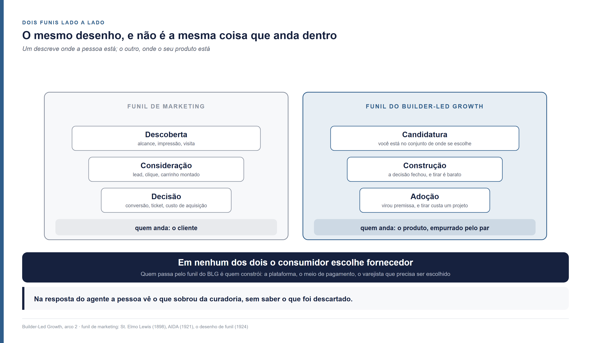
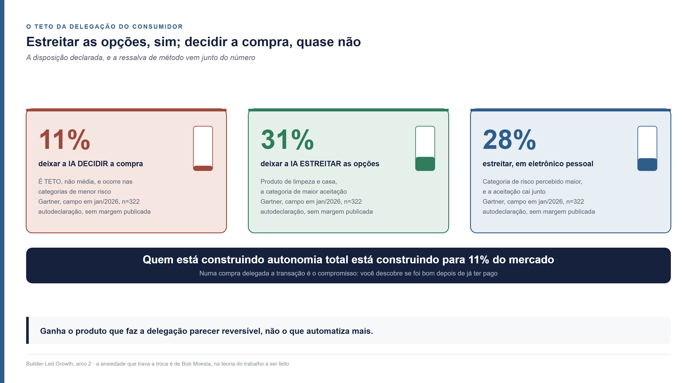
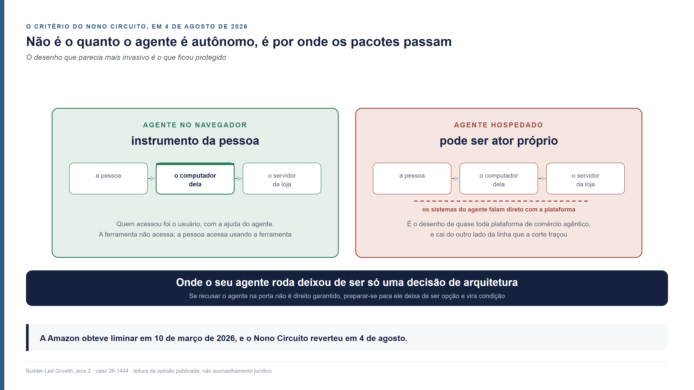
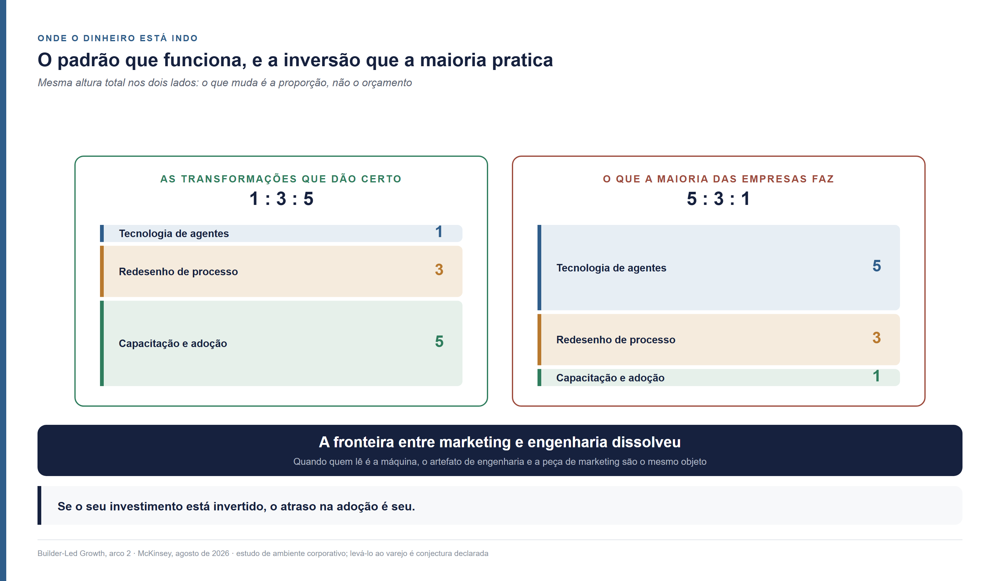

<!--
Arco 2, parte 7 da série Builder-Led Growth, por Matheus Ramos.
VERSÃO NÃO CANÔNICA. A canônica é a inglesa: ../en/arc2-07-agentic-commerce.md
Em caso de divergência de fato ou de número, a inglesa prevalece.
Publicada no LinkedIn em 1 de setembro de 2026: https://www.linkedin.com/pulse/agentic-commerce-e-builder-led-growth-o-que-muda-para-matheus-nrezf/
Gerado a partir do repositório privado de trabalho. Não editar aqui.
-->

# Agentic commerce e Builder-Led Growth — o que muda para growth e engenharia

*Você aprendeu a ser encontrado por quem procura. Em comércio agêntico quem
procura já não é uma pessoa, e perto de metade do que a sua loja escreve não chega
até ele. Este mercado é o lugar onde dá para ver, já terminado, o que está apenas
começando no resto.*

---

## Cem milhões de reais vendidos sem que ninguém abrisse a loja

O Magazine Luiza tem uma assistente chamada Lu. Em 2026 ela passou a montar compra
dentro da conversa, e a empresa diz ter transacionado **R$ 100 milhões por esse
caminho**, com **conversão três vezes maior** que a dos canais tradicionais. Quem
contou foi Caio Gomes, Chief Data & AI Officer da empresa, no Fórum E-Commerce
Brasil de 2026. O número foi divulgado pela empresa, numa palestra, sem período,
sem metodologia e sem denominador. Para mim já basta, mas fica o registro de que
não é uma medição independente.

No iFood existe o Ailo. Ele monta o pedido dentro do WhatsApp, aplica cupom
sozinho, recomenda pelo que você já pediu antes, entende pedido complicado com
vários pratos e fecha a compra com um clique via Pix. Guarda preferência,
restrição alimentar e gosto de uma conversa para a outra.

Nos Estados Unidos, em **11 de janeiro de 2026**, Google e Shopify publicaram um
padrão aberto para que agentes de software consigam descobrir lojas, montar
carrinho e comprar. Vinte e poucas empresas assinaram embaixo, entre elas Visa,
Mastercard, Stripe, American Express, Walmart e Target. O objetivo declarado é
permitir que a compra aconteça dentro da conversa, sem a pessoa sair para um site.

**A infraestrutura que eles estão construindo serve para pôr o comércio dentro de
uma conversa. Aqui o comércio já está dentro de uma conversa, e o Pix já
liquida.**

Isso não é o Brasil estando na frente. É outro caminho, com outra infraestrutura
por baixo, e existe um mecanismo que explica por que ele funciona. Jason Goldberg,
escrevendo sobre quem vai controlar a superfície onde a compra acontece, formulou
assim: *"quanto mais perto o agente chega do contexto padrão do consumidor, mais
influência ele tem sobre a decisão de compra"* ([Forbes, 19 de fevereiro de
2026](https://www.forbes.com/sites/jasongoldberg/2026/02/19/the-agentic-commerce-wars-part-2-the-race-for-the-glass/)).
O contexto padrão do consumidor brasileiro é um aplicativo de mensagem que ele já
abre o dia inteiro. Ninguém precisou ser convencido a adotar um agente novo. O
agente apareceu onde a pessoa já estava.

## Metade do que a sua loja escreve não chega a quem decide

Uma página de produto é escrita para uma pessoa olhar. Quando quem lê é um
programa, boa parte do que está ali não atravessa — e isso já tem medição.

**Comércio agêntico é a compra em que um agente de software executa uma ou mais
etapas do processo — descobrir, comparar, montar o carrinho, pagar — em nome de
uma pessoa, com grau variável de delegação.** Procurei quem cunhou o termo e não
achei. A expressão circula sem autoria atribuível, o que é raro o bastante para
valer o registro: ninguém reivindica, então não atribuirei a ninguém.

A Adobe avalia quanto do conteúdo de uma página de produto é legível para um
modelo de linguagem. O resultado por categoria fica entre **47% em móveis e
decoração e 63% em cosméticos**, com eletrônicos em 56%, esportivos e vestuário em
51% e mercearia em 48%. Mesmo nos setores que vão melhor, **de 30% a 40% do
conteúdo das páginas de maior valor não é capturado**.

Ninguém escreveu uma página ruim de propósito. As páginas foram escritas para uma
pessoa olhar, por um time que não sabia que o próximo leitor seria um programa.

O tráfego que vem desse leitor já mudou de tamanho, com medição instrumentada
sobre uma base de **mais de um trilhão de visitas**. Em maio de 2026 o tráfego que
chega às lojas americanas a partir de ferramentas de inteligência artificial
cresceu **138% em um ano**, acumulando **1.324% desde outubro de 2024**, quando a
Adobe começou a medir. Quem chega por ali converte **54% melhor** que o restante,
passa **53% mais tempo** no site e vê **23% mais páginas** ([Adobe Analytics, via
Digital Commerce 360, 17 de junho de
2026](https://www.digitalcommerce360.com/2026/06/17/adobe-ai-referred-traffic-to-retail-sites-doubles-in-a-year/)).

Um leitor que traz tráfego que converte melhor, e que só enxerga metade do que
você escreveu.

## Você não vai ver a derrota acontecer

Antes de existir carrinho, alguma peça do sistema montou uma lista curta e você não
entrou nela. Essa eliminação é real e está registrada em algum lugar — no log de
quem operou o agente. Do seu lado não há carrinho abandonado para investigar,
porque não houve carrinho.

O painel que você olha todo dia foi desenhado para uma perda que deixa rastro. A
pessoa entra, navega, abandona, e cada um desses passos vira linha em algum
relatório. A perda que importa aqui acontece antes do primeiro passo desse
desenho, e nenhum relatório seu a registra.

Isso é diferente de a perda não acontecer. Ela acontece, tem tamanho, e o tamanho
está com outra pessoa.

## O varejista é um produto sendo selecionado, mesmo sem escrever uma linha de código

Um varejista não constrói software, e ainda assim ele é, literalmente, um produto
sendo selecionado por uma máquina. Ou ele se adequa ao modo como o agente descobre,
entende e transaciona, ou fica de fora.

Cresci ouvindo do Senna que o segundo nada mais é do que o primeiro dos
perdedores. Em comércio agêntico isso é máxima, com a lógica do *winner takes
all*.

Com uma ressalva que importa. A conversa com um agente não é uma linha reta.
Alguém pergunta por hambúrguer para a família, o agente traz opções, a pessoa
reformula, e o pedido termina numa pizza que agrada todo mundo e sai mais barata. A
cada reformulação o conjunto é remontado. Ficar de fora da primeira resposta não é
sentença — ficar de fora de todas elas é.

Isso muda o que você mede. Não basta aparecer para *"melhor hambúrguer perto de
mim"*. É preciso continuar alcançável quando a pergunta vira *"o que agrada quatro
pessoas com gostos diferentes por até cento e vinte reais"*, que é uma pergunta
sobre adequação e preço, não sobre categoria.

Há uma razão organizacional para a adequação demorar mais do que a urgência
sugere. Num relatório de agosto de 2026 sobre por que a adoção de agentes trava
dentro das empresas, a McKinsey descreve o medo que mais congela comportamento nas
palavras de quem o sente: se o agente me dá a resposta errada e eu ajo com base
nela, o erro ainda é meu. Responsabilidade sem controle.

Esse estudo olha para o uso de agentes dentro de organizações, não para comércio.
Levar a conclusão dele para a mesa de um varejista é conjectura minha. Palpite
embasado, mas conjectura: a decisão de expor catálogo e checkout a um agente
externo tem exatamente o mesmo formato — alguém assina embaixo de uma resposta que
a máquina vai dar sozinha.

## Em software a escolha fica publicada; em comércio ela sumiu

Quando um agente escolhe uma biblioteca, o código que a usa vai para um repositório
público, e qualquer pessoa que leia aquele repositório aprende que você foi
escolhido. O artefato construído **é** o registro da escolha.

Vale ver o caso de software inteiro, porque é o contraste que organiza o resto
deste texto. Alguém pede a uma plataforma de construção assistida uma loja online:
catálogo, carrinho, pagamento, e-mail de confirmação de pedido. Em alguns casos
essa pessoa nomeia as peças — *"usa a Stripe para pagamento"* —, e aí a decisão foi
dela. Em outros ela não nomeia nada, e o serviço de pagamento, o de catálogo e o de
e-mail aparecem prontos no que foi montado. Quando isso acontece, o fornecedor
ganhou um cliente que nunca soube que estava contratando alguém.

> **No Product-Led Growth quem experimenta e decide é uma pessoa. No Builder-Led
> Growth quem experimenta e decide é um par — a pessoa e a máquina —, e o que muda
> de um caso para o outro é quanto dessa decisão foi delegado à máquina.**

Entre os dois extremos existe um gradiente, e ele determina **o que** influencia a
escolha. Quanto mais autônoma a máquina for para concluir a tarefa, mais o corpus
decide — corpus é o material público que treinou o modelo, incluindo documentação,
repositório de código, artigo, fórum e avaliação de produto. Quanto mais
direcionada ela for, mais o harness decide — harness é o andaime que executa o
agente e delimita o que ele pode chamar e enxergar, com as instruções que recebeu,
as ferramentas ligadas e os limites do ambiente.

Em comércio o público é outra coisa. Avaliação de produto, nota, seção de
comentários, comparativo de terceiro, vídeo de quem usou — tudo isso está escrito,
indexado e treina o modelo. O que não fica público é **o registro da escolha**:
qual produto o agente colocou na resposta, o que ele descartou antes de montar a
lista, se houve devolução, se houve disputa, se a pessoa comprou de novo.

Em software, ser escolhido gera prova pública de que você foi escolhido. Em
comércio, ser escolhido não gera nada que saia de dentro de quem operou o agente.

## O comércio não é a exceção: é onde o movimento já terminou

Existe um movimento mais amplo por trás disso, e ele está descrito pelos próprios
fornecedores de tecnologia. Duas práticas deixaram de ser experimento e viraram
material de orientação: o ajuste fino, que treina um modelo sobre o acervo da
empresa, e a recuperação aumentada, que busca informação numa base própria no
momento de responder. A Amazon Web Services descreve o ajuste sobre *"historical
customer interactions and product specifications"* como caminho normal para
adequar um modelo ao próprio negócio ([AWS Machine Learning Blog, 28 de maio de
2025, por Idil Yuksel e Karim
Akhnoukh](https://aws.amazon.com/blogs/machine-learning/tailoring-foundation-models-for-your-business-needs-a-comprehensive-guide-to-rag-fine-tuning-and-hybrid-approaches/)).
É material do fornecedor da tecnologia, então vale como descrição de prática
recomendada e não como medição de quantas empresas fazem isso.

O efeito acumulado é que parte do que a máquina sabe passa a viver dentro de quem
opera a plataforma, em vez de num acervo que qualquer pessoa consiga ler.

Esse movimento está no meio do caminho em software, onde ainda existe acervo
público grande o bastante para sustentar boa parte do que a máquina sabe. Em
comércio ele nunca precisou acontecer, porque **a compra nunca chegou a ser
pública**. O registro da escolha sempre morou dentro de quem operou a transação.

> **O comércio agêntico não é a exceção ao Builder-Led Growth. É o lugar onde o
> movimento já terminou, e por isso mostra a forma final de um processo que em
> software mal começou.**

Isso torna este mercado legível como **indicador antecedente** — o sinal que se
move antes daquilo que se quer prever, como pedido de seguro-desemprego se move
antes do desemprego medido. Quem constrói software olha para o comércio agêntico
para ver onde a própria disputa vai parar quando o acervo público deixar de ser o
que decide.

Aviso que metade dessa comparação é raciocínio meu. Que a compra nunca foi pública,
está mostrado acima. Que o software caminha para o mesmo lugar, eu infiro da
prática que os fornecedores documentam, e não de uma medição de quanto do contexto
de um agente corporativo já vem de base privada contra corpus público. Esse número
resolveria a questão, e eu não o encontrei.

Para o varejista, a consequência prática cabe numa frase: **a sua loja deixou de
ser um destino e virou uma fonte de dados.** Antes a pessoa entrava, e você
observava — o que ela procurou, onde parou, o que abandonou. Agora o agente
observa, e você recebe uma requisição. A venda pode continuar acontecendo. A
observação, não.

## A alavanca muda de publicar para alimentar

Se quem decide passa a ler dado estruturado entregue a um porteiro, publicar mais
conteúdo deixa de ser o caminho mais curto até ser escolhido. O padrão de janeiro
de 2026 descreve esse porteiro em detalhe, e vale ler como especificação de
entrada.

Um agente que queira transacionar com uma loja precisa primeiro descobrir do que
aquela loja é capaz. A solução é um arquivo num caminho fixo e previsível:
**`/.well-known/ucp`**. O que vive lá se chama perfil de capacidade — a declaração
estruturada do que aquela loja sabe fazer, em que versão, com que extensões. Nas
palavras do documento de engenharia da Shopify, escrito por Ilya Grigorik:
*"Discovery is the process of fetching these profiles; negotiation computes their
intersection."* Descobrir é buscar esses perfis; negociar é calcular a interseção
entre eles.

No mesmo dia, o Google passou a pedir do varejista dezenas de atributos novos no
cadastro de produto, incluindo **respostas a perguntas comuns, acessórios
compatíveis e substitutos**.

Um arquivo canônico, em endereço previsível, que diz sem contexto o que uma coisa
faz e o que ela aceita. Esta série sustenta que quatro coisas determinam se o seu
produto é o escolhido quando a máquina participa: **ser legível por máquina**,
dizer sem contexto o que você faz; **ser operacionalmente acessível**, dar para
integrar sem interpretação; **ter comunidade** que escreva sobre você em lugares
que a máquina lê; **ser confiável o bastante** para o agente agir sem parar para
perguntar. As duas primeiras acabaram de ser publicadas como especificação técnica
por duas empresas grandes.

A teoria não previu o protocolo. **O método deste trabalho é o inverso disso: o
Builder-Led Growth já está sendo praticado; o que fazemos aqui é observar e
nomear.** Aconteceu o mesmo com o Product-Led Growth — crescimento em que o próprio
produto faz o trabalho que antes cabia a vendas, popularizado em meados da década
de 2010 pela OpenView, com [Blake
Bartlett](https://www.linkedin.com/in/blakebartlett), e codificado em livro por
[Wes Bush](https://www.linkedin.com/in/wesbush) em 2019 —, que empresas praticavam
anos antes de alguém escrever o nome disso.

## O funil que você usa mede uma pessoa andando; o que decide agora é onde o seu produto está

O funil de marketing acompanha uma pessoa se movendo até a compra, e é isso que
todo painel de comércio mede hoje. O que precisa ser medido aqui é outra coisa: em
que ponto o seu produto está dentro de um trabalho que um par de pessoa e máquina
está executando.

O funil de marketing é o mais conhecido de todos. A formulação inicial é de Elias
St. Elmo Lewis, em 1898 — atrair atenção, manter interesse, criar desejo —, ao que
depois se somou obter ação. A sigla AIDA apareceu em 1921, com C. P. Russell, e o
desenho de funil foi associado ao modelo em 1924. Em linguagem de hoje ele tem três
alturas: topo, onde a pessoa não conhece você e se mede alcance, impressão e
visita; meio, onde ela compara e se mede lead, clique e carrinho montado; fundo,
onde ela compra e se mede conversão, ticket médio e custo de aquisição.

O funil do Builder-Led Growth descreve outra coisa: onde o seu produto está dentro
daquele trabalho. Quem anda por ele não é o cliente.

> **No funil de marketing quem se move é o cliente. No funil do BLG o que se move
> é o produto e quem o move é o par.**

### Candidatura: estar no material de onde as opções saem

Em comércio isso quer dizer estar no catálogo, no feed ou na base de onde o agente
tira as opções. O verbo muda: em software você trabalha para **ser encontrado**, em
comércio você trabalha para **ser admitido**. Ninguém opera um portão na instalação
de bibliotecas; aqui o portão existe, tem dono e tem processo de entrada.

A comparação mais direta no marketing é uma busca no Google. Você pode aparecer ou
não na primeira página, e o seu link pode ou não ser clicado. Trabalhar o
posicionamento — o que o mercado chama de **SEO**, otimização para motor de busca —
aumenta as duas chances, sem virar garantia. A máquina não devolve dez links azuis
para alguém percorrer; ela monta uma resposta com dois ou três nomes dentro. Estar
nessa lista curta é o mesmo jogo com outro nome: **GEO**, otimização para motor
generativo, e **AEO**, otimização para motor de resposta. No Google a pessoa vê a
lista inteira e decide onde clicar; na resposta do agente ela vê o que sobrou da
curadoria, sem saber o que foi descartado.

**O que se mede.** Não é tráfego nem sessão, que é o que o topo de funil mediria. É
**presença na resposta**. Escolha as trinta perguntas que um cliente faria na sua
categoria, pergunte ao agente com repetição, registre em quantas delas você
aparece. Essa taxa é sua e ninguém a publica.

**As ferramentas.** AEO e GEO, a documentação canônica, o conteúdo que terceiros
escrevem sobre você e, em comércio, o feed de produto mais o perfil de capacidade.

### Construção: a decisão fechou sobre você e tirar ainda custa um clique

A etapa começa quando o agente para de considerar alternativas e passa a montar a
resposta com você dentro. Antes disso houve pergunta de esclarecimento, comparação,
verificação de preço e prazo — tudo isso é candidatura ainda.

O carrinho é onde esse estado fica visível. O padrão de janeiro nomeia o objeto,
chamando de *Cart Mandate* o contrato do que vai ser comprado antes de ser
comprado. Você foi escolhido. Tirar você ainda custa um clique.

**O que se mede.** A **taxa de substituição** entre a decisão e o pagamento:
quantas vezes o agente montou a resposta com você e trocou antes de fechar. É o
primo do carrinho abandonado, com uma diferença que importa — quem abandona não é a
pessoa, é a máquina, ao encontrar algo que fez você deixar de servir.

**As ferramentas.** Completude do dado de produto, que é literalmente o que o
cadastro passou a pedir: substituto, acessório compatível, resposta a pergunta
comum. Preço e estoque corretos no feed, porque agente que encontra divergência
troca. Tempo de resposta do endereço de capacidade, porque agente que espera demais
segue adiante.

### Adoção: a compra virou premissa

Existe pagamento guardado, existe dado no seu formato, existe gente comprando sem
reabrir a comparação. O funil de marketing clássico termina na compra, e foi essa
lacuna que o funil pirata veio preencher décadas depois — aquisição, ativação,
retenção, receita e indicação, apresentado por [Dave
McClure](https://www.linkedin.com/in/davemcclure) em 2007.

**O que se mede.** A fatia de recompra que **não** volta a passar pelo conjunto de
consideração. Na prática: dos pedidos dos últimos noventa dias, quantos vieram de
alguém que não comparou nada.

**As ferramentas.** A camada de memória. Assinatura, pagamento guardado, recompra
de um clique. É a mesma força que a teoria do trabalho a ser feito chama de hábito
— Bob Moesta a descreve como a mais forte das contrárias a qualquer troca.

### A etapa do meio encolhe até sumir, e é isso que torna a candidatura decisiva

Uma recompra de um clique vai de candidatura direto a adoção. Não existe intervalo
em que você esteja escolhido e ainda dê para tirar sem custo, e a janela em que um
concorrente poderia entrar não chega a abrir.

> **Em comércio a etapa do meio é curta e encolhe até desaparecer conforme a
> delegação sobe.**

Quase nada morre na construção, e é por isso que **a candidatura decide mais aqui
do que em software**. O trabalho que em software se distribui por três etapas, em
comércio se concentra quase todo na primeira.

## Dois limites que nenhuma tática remove

Tudo o que veio até aqui esbarra em duas bordas que não dependem de você. Uma é
quanta decisão o consumidor aceita entregar. A outra é se recusar o agente na sua
porta ainda é um direito seu.

### O consumidor não escolhe fornecedor, e é ele que fixa o teto

Quem passa pelo funil é quem **constrói**: a empresa de meio de pagamento, a
plataforma, o varejista que precisa ser escolhido. Essas escolhem fornecedor. O
consumidor não escolhe fornecedor de nada — ele recebe uma resposta pronta.

O que ele recebe depende inteiramente da qualidade daquele funil. Se metade do que
existe escrito sobre uma categoria não é legível para a máquina, a recomendação que
chega até ele foi montada com informação parcial, e nada na tela diz isso. Ele não
escolheu as fontes, não sabe quais foram, e não tem como conferir.

Ele determina uma restrição dura para quem constrói. A disposição declarada de
deixar a inteligência artificial **tomar** a decisão de compra **tem teto em 11%**,
nas categorias de menor risco. A disposição de deixar a máquina apenas
**estreitar** as opções chega a **31%** em produto de limpeza e casa e **28%** em
eletrônico pessoal. São 322 consumidores nos Estados Unidos, com campo em janeiro
de 2026, num levantamento da Gartner que não publica amostragem nem margem de erro
— uso a ordem de grandeza, não os decimais. É autodeclaração, que em assunto de
inteligência artificial costuma divergir do comportamento medido.

> **Quem está construindo autonomia total está construindo para 11% do mercado.**

A força que trava tem nome. Bob Moesta, ao descrever o que faz alguém trocar de
solução, separa a atração do novo da **ansiedade** que ele provoca. Na velha
comparação entre a furadeira e a fita dupla-face disputando o mesmo trabalho de
pendurar um quadro, dá para testar a fita e desistir. Numa compra delegada não:
**a transação é o compromisso.** Você descobre se foi bom depois de já ter pago.

### A porta: em 4 de agosto de 2026 uma corte americana decidiu quem acessa o quê

A maior varejista do mundo tentou fechar a porta. A Amazon processou a Perplexity
por causa de um agente de navegador que comprava em nome de quem o usava, e obteve
uma liminar bloqueando o acesso em 10 de março de 2026. Em 4 de agosto de 2026 o
Nono Circuito **anulou a liminar e devolveu o caso** à primeira instância (caso
26-1444, decisão publicada). Vale dizer o que isso é e o que não é: a decisão trata
da probabilidade de a Amazon vencer, não do mérito, que segue em aberto.

O raciocínio, com as palavras da corte: *"it was the user who 'accessed' Amazon's
computers, with the help of Perplexity's AI agent"* — quem acessou os computadores
da Amazon foi o usuário, com a ajuda do agente. A ferramenta não acessa; a pessoa
acessa usando a ferramenta.

O critério não é o que se imagina. **Não é o quanto o agente é autônomo, é onde ele
roda.** O navegador em questão funciona na máquina da pessoa, e é ele que pede a
página ao servidor da loja. A conclusão da corte: *"Perplexity itself does not
directly communicate with Amazon's servers."* Sobre a falta de precedente ela é
explícita — não há jurisprudência tratando de IA agêntica, e os casos existentes
sobre acesso não autorizado *"do not provide a perfect analogue"*.

O agente que roda no navegador da pessoa, o que parece mais invasivo, é o que fica
protegido. **O agente hospedado num servidor, que é o desenho de quase toda
plataforma de comércio agêntico, cai do outro lado da linha.** Onde o seu agente
roda deixou de ser só uma decisão de arquitetura.

Um detalhe do caso interessa ao varejista mais do que o desfecho. O núcleo da
disputa foi a Perplexity não enviar o **`user-agent string`**, o campo em que um
programa se identifica ao pedir uma página. Nas palavras da opinião, era o
mecanismo *"that would communicate that the user has activated an AI agent"*, e
enviá-lo teria permitido à Amazon bloquear o agente. **O meio técnico de recusar
existia, e o que faltou foi o agente se identificar.**

Para o varejista a leitura é direta, e ela é mais estreita do que "não dá para
recusar": recusar depende de conseguir **reconhecer** o agente, e reconhecer
depende de um sinal que quem constrói o agente decide mandar ou não. Enquanto isso
não for obrigação de ninguém, **preparar-se deixa de ser opção estratégica e vira
condição a que você está sujeito.**

## O que fazer — e por que nenhum time resolve isso sozinho

Quando quem lê é a máquina, o artefato de engenharia e a peça de marketing são o
mesmo objeto, e o organograma não sabe disso. É por isso que a lista abaixo tem uma
terceira parte.

A descrição de produto é material de venda, porque é ela que o comprador lê. O
comprador é uma máquina. O arquivo de capacidade em `/.well-known/ucp` é a vitrine.
O atributo de catálogo, aquele campo chato que alguém preenche sem entusiasmo, é o
argumento comercial. Não são coisas parecidas: são a mesma coisa, vista de dois
departamentos que não se falam. Os 47% a 63% de legibilidade por categoria são a
conta desse desencontro.

Um número mostra onde o dinheiro está indo. A pesquisa da McKinsey de agosto de
2026 descreve o padrão das transformações que dão certo como **1:3:5** — para cada
dólar investido em tecnologia de agentes, três em redesenho de processo e cinco em
capacitação e adoção. A maioria das empresas **inverte essa fórmula por completo**,
colocando quase tudo na tecnologia e tratando o resto como detalhe de implementação.
Se o seu investimento está invertido, o atraso na adoção é seu.

### Para engenharia

Cinco coisas mudam de dono aqui, e todas passam pelo que a máquina consegue ler sem
contexto.

**Publique um perfil canônico em caminho previsível.** Se você é comerciante, isso
hoje tem endereço literal. O princípio vale para qualquer fornecedor: um lugar só,
legível sem contexto, que diga o que você faz e o que você aceita.

**Escreva o dado que a máquina pede, não o que a página precisa.** Substituto,
acessório compatível, resposta a pergunta comum.

**Meça a sua própria legibilidade.** A conta é simples e ninguém faz: pegue as
vinte páginas que mais vendem, liste os fatos que um comprador precisa saber para
decidir — medida, compatibilidade, prazo, política de devolução, o que vem na caixa
— e então peça a um modelo que responda cada um desses fatos usando só aquela
página. O que ele não conseguir responder está na página de um jeito que a máquina
não alcança: dentro de imagem, escondido atrás de aba que só abre com clique, ou
implicado num texto de venda em vez de dito. A referência pública de mercado está
entre 47% e 63% por categoria. Saber onde você cai nessa faixa é trabalho de uma
tarde; consertar o que aparecer é trabalho de um trimestre.

**Decida conscientemente onde o agente roda.** Navegador ou servidor mudou de
natureza depois de agosto de 2026, e a resposta muda quem responde pelo acesso.

**Instrumente o invisível.** Registre quais decisões vieram de um agente e quais
vieram de uma pessoa. Ninguém publica esse número hoje. Quem o tiver internamente
enxerga o próprio funil enquanto o mercado discute por impressão.

**Preserve o caminho de reversão.** Toda a tolerância a pagamento delegado se apoia
em poder desfazer. Onde desfazer é difícil, a delegação encontra um teto mais baixo.

### Para growth

O que se mede muda antes do que se faz, porque o sinal de topo que você usa hoje
para de existir.

**Meça presença na resposta, não só tráfego.** Trinta perguntas da sua categoria,
repetição, registro. É a única forma que conheço de enxergar a etapa em que a perda
não aparece em relatório nenhum.

**Teste a pergunta reformulada, não só a pergunta óbvia.** Se o cliente pode chegar
por *"o que agrada quatro pessoas por até cento e vinte reais"*, é essa a consulta
que precisa te encontrar.

**Trate catálogo e feed como topo de funil**, porque em comércio candidatura é
admissão, não descoberta. AEO e GEO continuam valendo; o feed é o que você controla.

**Recupere a observação que você perdeu.** Se a pessoa não entra mais na loja, os
sinais que você lia na navegação secaram. O que sobra vem da conversa que o agente
teve, e negociar acesso a isso é assunto comercial, não técnico.

**Projete para o teto de 11%.** Ganha o produto que faz a delegação parecer
reversível, não o que automatiza mais.

### Para os dois, juntos

Três coisas não têm dono num organograma que separa quem escreve de quem publica.

**A descrição de produto tem prazo e dono de crescimento**, porque é material de
venda. Tratá-la como tarefa de cadastro que alguém faz quando sobrar tempo é deixar
a vitrine fechada.

**O alvo é estar escrito na diretriz do cliente.** As empresas mais organizadas já
não deixam o agente escolher sozinho: escrevem documentos de especificação que
conduzem a máquina dentro das linhas gerais da casa. Estar nomeado nesse documento
é posição mais durável do que estar no dado de treino, que se atualiza, e mais
barata do que o custo de troca, que exige o código já existir. Ela se conquista com
credibilidade técnica e se fecha comercialmente, o que significa que nenhum dos
dois times chega lá sozinho.

**Alguém precisa ser dono da resposta a "quem responde quando o agente erra".** Não
é pergunta de conformidade. É a pergunta que está travando a adoção nas empresas
que já compraram a tecnologia.

## O que eu não sei

Ninguém publica quantos produtos são descartados antes de a lista curta existir. É a
etapa em que a maior parte da concorrência morre, e a única sem instrumento público.
Quem opera o agente tem esse log.

**Decompor amplia ou fragmenta o conjunto?** Ferramentas novas quebram um problema
em pedaços e mandam cada pedaço para um modelo especializado. Isso pode criar mais
vagas — mais subproblemas, mais oportunidades de ser considerado — ou o contrário,
vagas com menos candidatos plausíveis, em que o especialista ganha por ausência de
concorrente. As duas leituras se sustentam.

**Não achei medição brasileira do teto da delegação.** O número de 11% é americano,
e há razão para desconfiar que aqui seja diferente, não porque o brasileiro confie
mais, mas porque a delegação chega por um canal que ele já usa todo dia. Se alguém
tiver esse dado, é o número mais valioso que este texto poderia ter citado.

**Esta série ainda não provou a própria afirmação central.** Sustento que a máquina
está participando da escolha de fornecedor numa escala que ninguém está medindo.
Existe quem consiga medir isso e não publica. Até esse número existir, quem afirma
carrega o ônus, e quem afirma sou eu.

Se o comércio agêntico é mesmo a forma final do que está começando no software,
ele deixa de ser um mercado a estudar e vira um calendário. As lojas já estão do
outro lado. Quem constrói software ainda tem o intervalo entre uma coisa e outra, e
esse intervalo é a única vantagem que a antecipação oferece.

Se você trabalha num lugar que consegue medir, essa é a conversa que eu mais quero
ter depois deste texto.

---

**Série Builder-Led Growth**, por Matheus Ramos. Segundo arco:

- [Arco 2, parte 0: Do PLG ao BLG — o que continua valendo quando quem escolhe é um par](arco2-00-do-plg-ao-blg.md)
- [Arco 2, parte 1: O funil do Builder-Led Growth — as três etapas e o que acelera a passagem](arco2-01-o-funil-e-o-eixo-da-delegacao.md)
- Agentic commerce e Builder-Led Growth — o que muda para growth e engenharia (este texto)

O primeiro arco, para quem quiser o percurso completo:

- [Parte 1 — Quando a máquina também é seu cliente](01-quando-a-maquina-e-cliente.md)
- [Parte 2 — A decisão, o preço e o que medir](02-decisao-preco-e-medicao.md)
- [Parte 3 — O imposto que a máquina cobra e o humano não vê](03-legibilidade-por-maquina.md)
- [Parte 4 — Quantas vezes o agente precisa chamar um humano](04-acessibilidade-operacional.md)
- [Parte 5 — O poço de onde todos bebem](05-comunidade-e-sinal-de-validacao.md)
- [Parte 6 — A máquina é imprensa e leitor ao mesmo tempo](06-relacoes-publicas.md)
- [Parte 7 — O que faz o agente confiar, e por que a competência dele é o problema](07-confianca-e-seguranca.md)
